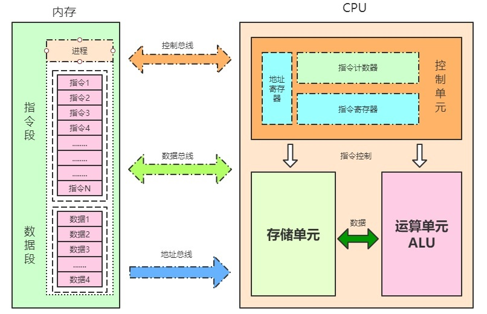
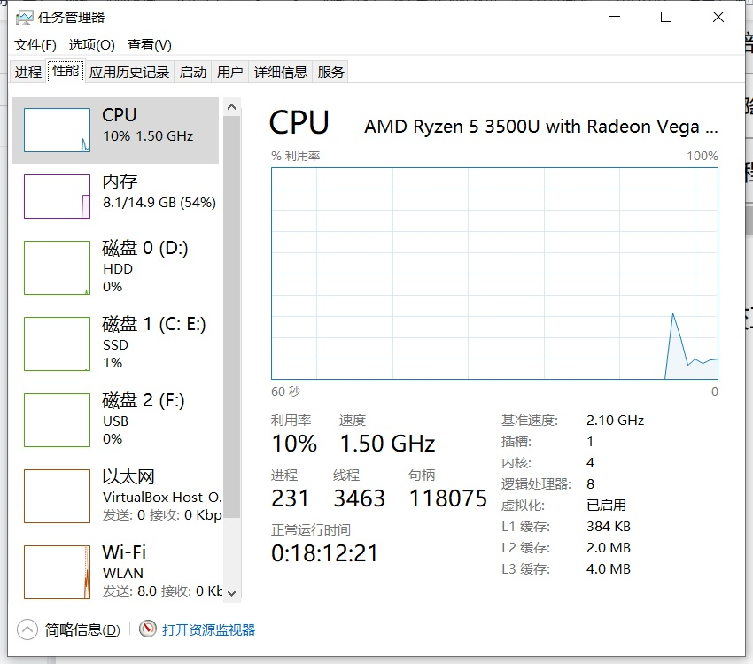
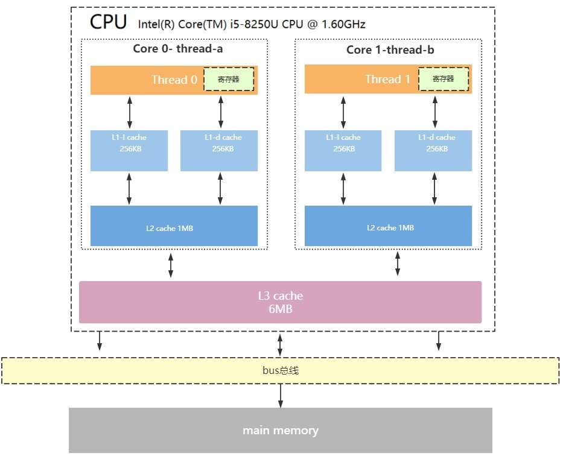
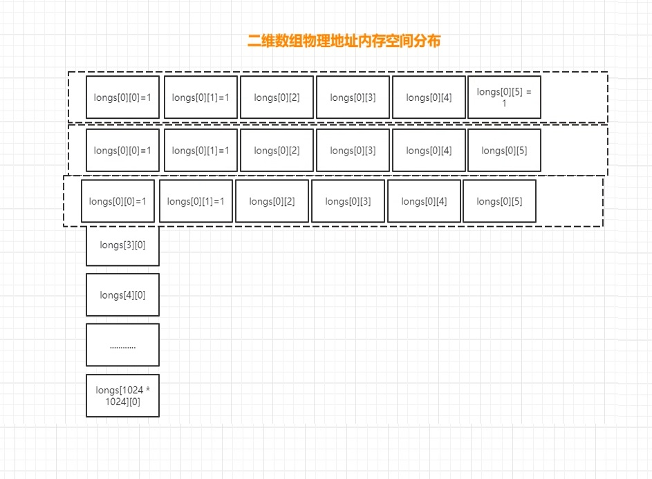
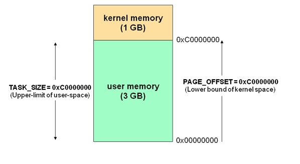
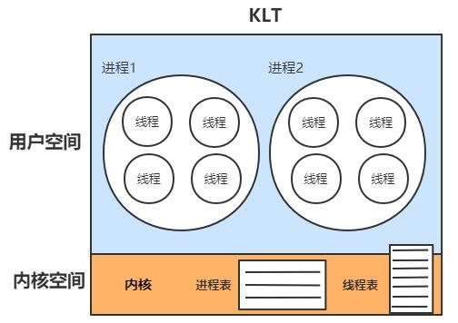
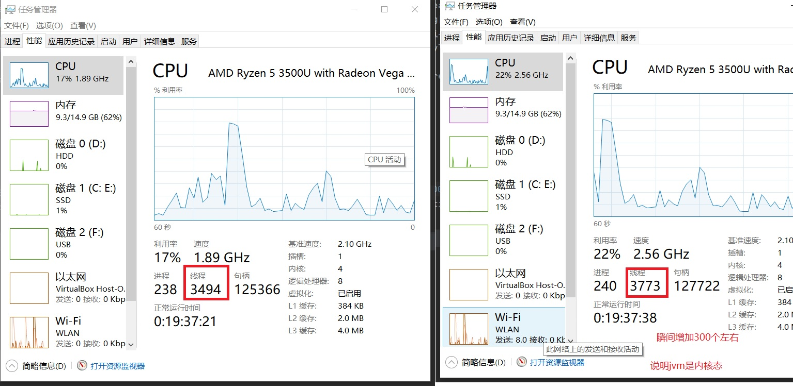
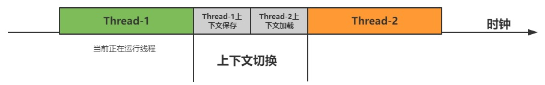

# JAVA并发编程

## 前言

## 1. CPU内部结构
**CPU的组成**是：
1. CPU的内核分为运算器和控制器；  
2. CPU的外核分为解码器、一级缓存和二级缓存；  
3. 指令系统，是一个CPU所能够处理的全部指令的集合，是一个CPU的根本属性。  

<a data-fancybox title="CPU内部结构" href="./image/CPU01.jpg"></a>

### 1.1 控制单元 
控制单元是整个CPU的指挥控制中心，由指令寄存器IR（Instruction Register）、指 令译码器ID（Instruction Decoder）和 操作控制器OC（Operation Controller） 等组 成，对协调整个电脑有序工作极为重要。它根据用户预先编好的程序，依次从存储器中取出 各条指令，放在指令寄存器IR中，通过指令译码（分析）确定应该进行什么操作，然后通过 操作控制器OC，按确定的时序，向相应的部件发出微操作控制信号。操作控制器OC中主要 包括：节拍脉冲发生器、控制矩阵、时钟脉冲发生器、复位电路和启停电路等控制逻辑。 

### 1.2 运算单元 
运算单元是运算器的核心。可以执行算术运算（包括加减乘数等基本运算及其附加运 算）和逻辑运算（包括移位、逻辑测试或两个值比较）。相对控制单元而言，运算器接受控 制单元的命令而进行动作，即运算单元所进行的全部操作都是由控制单元发出的控制信号来 指挥的，所以它是执行部件。 

### 1.3 存储单元 
存储单元包括 CPU 片内缓存Cache和寄存器组，是 CPU 中暂时存放数据的地方，里 面保存着那些等待处理的数据，或已经处理过的数据，CPU 访问寄存器所用的时间要比访 问内存的时间短。 寄存器是CPU内部的元件，寄存器拥有非常高的读写速度，所以在寄存 器之间的数据传送非常快。采用寄存器，可以减少 CPU 访问内存的次数，从而提高了 CPU 的工作速度。寄存器组可分为专用寄存器和通用寄存器。专用寄存器的作用是固定的，分别 寄存相应的数据；而通用寄存器用途广泛并可由程序员规定其用途


<a data-fancybox title="CPU内部结构" href="./image/cpu01.jpg"></a>

## 2. CPU缓存结构

现代CPU为了提升执行效率，减少CPU与内存的交互(交互影响CPU效率)，一般在CPU上集 成了多级缓存架构，
:::tip 常见的为三级缓存结构
L1 Cache，分为数据缓存和指令缓存，逻辑核独占 

L2 Cache，物理核独占，逻辑核共享

L3 Cache，所有物理核共享
:::
<a data-fancybox title="CPU缓存结构" href="./image/cpu02.jpg"></a>

<a data-fancybox title="CPU内部结构" href="./image/CPU03.jpg"></a>

存储器存储空间大小：内存>L3>L2>L1>寄存器； 

存储器速度快慢排序：寄存器>L1>L2>L3>内存； 

还有一点值得注意的是：缓存是由最小的存储区块-缓存行(cacheline)组成，缓存行大小通常为64byte。

比如你的L1缓存大小是512kb,而cacheline = 64byte,那么就是L1里有512 * 1024/64个 cacheline

----------------

### 2.1 CPU读取存储器数据过程
:::tip CPU读取存储器数据过程 

1、CPU要取寄存器X的值，只需要一步：直接读取。 

2、CPU要取L1 cache的某个值，需要1-3步（或者更多）：把cache行锁住，把某个数据拿来，解 锁，如果没锁住就慢了。 

3、CPU要取L2 cache的某个值，先要到L1 cache里取，L1当中不存在，在L2里，L2开始加锁，加 锁以后，把L2里的数据复制到L1，再执行读L1的过程，上面的3步，再解锁。 

4、CPU取L3 cache的也是一样，只不过先由L3复制到L2，从L2复制到L1，从L1到CPU。 

5、CPU取内存则最复杂：通知内存控制器占用总线带宽，通知内存加锁，发起内存读请求，等待 回应，回应数据保存到L3（如果没有就到L2），再从L3/2到L1，再从L1到CPU，之后解除总线锁 定。
:::
### 2.2 局部性原理
在CPU访问存储设备时，无论是存取数据抑或存取指令，都趋于聚集在一片连续的区域中，这就被称为局部性原理。

<font color='red'><strong>时间局部性（Temporal Locality）</strong></font>：如果一个信息项正在被访问，那么在近期它很可能还会被再次访问。 比如循环、递归、方法的反复调用等
再比如for循环实现sum求和，sum就是这次访问了，下次还被访问，体现的就是时间局部性。

<font color='red'><strong>空间局部性（Spatial Locality）</strong></font>：如果一个存储器的位置被引用，那么将来他附近的位置也会被引用。 比如顺序执行的代码、连续创建的两个对象、数组等。
理解的关键点 **存储的位置**，相邻的数据很可能被一同访问到。cache的基本原理就体现了这一点。**数组和链表** 通常具有很好的空间局部性

```java
package com.tqk.tl01.cpu;

public class TwoDimensionalArraySum {
    private static final int RUNS = 100;
    private static final int DIMENSION_1 = 1024 * 1024;
    private static final int DIMENSION_2 = 6;
    private static long[][] longs;

    public static void main(String[] args) throws Exception {
        /*
         * 初始化数组
         */
        longs = new long[DIMENSION_1][];
        for (int i = 0; i < DIMENSION_1; i++) {
            longs[i] = new long[DIMENSION_2];
            for (int j = 0; j < DIMENSION_2; j++) {
                longs[i][j] = 1L;
            }
        }
        System.out.println("Array初始化完毕....");

        long sum = 0L;
        long start = System.currentTimeMillis();
        for (int r = 0; r < RUNS; r++) {
            for (int i = 0; i < DIMENSION_1; i++) {//DIMENSION_1=1024*1024
                for (int j=0;j<DIMENSION_2;j++){//6
                    sum+=longs[i][j];
                }
            }
        }
        System.out.println("spend time1:"+(System.currentTimeMillis()-start));
        System.out.println("sum1:"+sum);

        sum = 0L;
        start = System.currentTimeMillis();
        for (int r = 0; r < RUNS; r++) {
            for (int j=0;j<DIMENSION_2;j++) {//6
                for (int i = 0; i < DIMENSION_1; i++){//1024*1024
                    sum+=longs[i][j];
                }
            }
        }
        System.out.println("spend time2:"+(System.currentTimeMillis()-start));
        System.out.println("sum2:"+sum);
    }
}
```

**执行结果**
```sh
Array初始化完毕....
spend time1:955
sum1:629145600
spend time2:2612
sum2:629145600
```
<a data-fancybox title="空间局部性（Spatial" href="./image/cpu04.jpg"></a>

第一种方式：先加二维数组6个数据

第二种方式：先加一维数组1024*1024个数据

=================================================================

先从内存中加载  [0][1] 到内存中去，根据cpu空间局部性（**数组和链表** 具有很好的空间局部性），会把[0][1]这个数据的连续数据加载到内存中去。

如果按照第一种方式，它会把[0][1],[0][2],[0][3],[0][4],[0][5],[0][6]同时加载到内存中去
所以第一种方式，cpu请求内存1024*1024次

如果按照第二种方式，它会只把[0][1]加载到内存中去，其它的连续数据在其它维度里。不相邻

所以第二种方式，cpu请求内存1024*1024次。第二种方式**1024*1024*6次**

------------------

:::tip 带有高速缓存的CPU执行计算的流程 
1. 程序以及数据被加载到主内存 
2. 指令和数据被加载到CPU的高速缓存 
3. CPU执行指令，把结果写到高速缓存 
4. 高速缓存中的数据写回主内存
:::

## 3. 操作系统内存管理 
### 3.1 执行空间保护 
操作系统有用户空间与内核空间两个概念，目的也是为了做到程序运行安全隔离与稳定，以 32位操作系统4G大小的内存空间为例
<a data-fancybox title="操作系统内存管理" href="./image/cpu05.jpg"></a>

 Linux为内核代码和数据结构预留了几个页框，这些页永远不会被转出到磁盘上。从 0x00000000 到 0xc0000000（PAGE_OFFSET） 的线性地址可由用户代码 和 内核代码进 行引用（即用户空间）。从0xc0000000（PAGE_OFFSET）到 0xFFFFFFFFF的线性地址只 能由内核代码进行访问（即内核空间）。内核代码及其数据结构都必须位于这 1 GB的地址空间中，但是对于此地址空间而言，更大的消费者是物理地址的虚拟映射。
  这意味着在 4 GB 的内存空间中，只有 3 GB 可以用于用户应用程序。进程与线程只能 运行在用户方式（usermode）或内核方式（kernelmode）下。用户程序运行在用户方式 下，而系统调用运行在内核方式下。在这两种方式下所用的堆栈不一样：用户方式下用的是 一般的堆栈(用户空间的堆栈)，而内核方式下用的是固定大小的堆栈（内核空间的对战，一 般为一个内存页的大小），即每个进程与线程其实有两个堆栈，分别运行与用户态与内核态。
  由空间划分我们再引深一下，CPU调度的基本单位线程，也划分为： 
  1、内核线程模型(KLT) 
  2、用户线程模型(ULT) 内核线程模型

### 3.2 内核线程模型：
系统内核管理线程(KLT),内核保存线程的状态和上下文信息，线程阻塞不会 引起进程阻塞。在多处理器系统上，多线程在多处理器上并行运行。线程的创建、调度和管 理由内核完成，效率比ULT要慢，比进程操作快。 

<a data-fancybox title="内核线程模型" href="./image/cpu06.jpg"></a>

### 3.3 用户线程模型
<a data-fancybox title="用户线程模型" href="./image/cpu07.jpg">![用户线程模型(./image/cpu07.jpg)</a>

用户线程(ULT)：用户程序实现,不依赖操作系统核心,应用提供创建、同步、调度和管理线程 的函数来控制用户线程。不需要用户态/内核态切换，速度快。内核对ULT无感知，线程阻 塞则进程（包括它的所有线程）阻塞。

**java JVM使用的是内核线程模型**

```java
package com.tqk.tl01.cpu;


public class MyThread extends Thread {
    public static void main(String[] args) {
        for (int i = 0; i < 300; i++) {
            Thread thread = new MyThread();
            thread.start();
            System.out.println(Thread.currentThread().getName() + ": 主线程main" + i);
        }
    }

    //重写run方法
    @Override
    public void run() {
        try {
            Thread.sleep(1000);
        } catch (InterruptedException e) {
            e.printStackTrace();
        }
    }
}
```
<a data-fancybox title="JVM使用的是内核线程模型" href="./image/cpu08.jpg"></a>

## 2. CPU 时间片轮转机制

时间片轮转调度是一种最古老、最简单、最公平且使用最广的算法,又称 RR 调度。每个进程被分配一个时间段,称作它的时间片,即该进程允许运行的时间。 

CPU 时间片轮转机制原理解释如下: 
如果在时间片结束时进程还在运行,则 CPU 将被剥夺并分配给另一个进程。 如果进程在时间片结束前阻塞或结束,则 CPU 当即进行切换。调度程序所要做的就是维护一张就绪进程列表,当进程用完它的时间片后,它被移到队列的末尾 

时间片轮转调度中唯一有趣的一点是时间片的长度。从一个进程切换到另一个进程是需要定时间的,包括保存和装入寄存器值及内存映像,更新各种表格和队
列等。假如进程切( processwitch),有时称为<font color='red'><strong>上下文切换( context switch)</strong></font>需要 5ms, 
再假设时间片设为 20ms,则在做完 20ms 有用的工作之后,CPU 将花费 5ms 来进行上下文切换。CPU 时间的20%被浪费在了管理开销上了。 为了提高 CPU 效率,我们可以将时间片设为 5000ms。这时浪费的时间只有 0.1%。
但考虑到在一个分时系统中,如果有10个交互用户几乎同时按下回车键, 将发生什么情况?假设所有其他进程都用足它们的时间片的话,最后一个不幸的进程不得不等待 5s 才获得运行机会。多数用户无法忍受一条简短命令要 5 才能做出响应,同样的问题在一台支持多道程序的个人计算机上也会发 

结论可以归结如下:
时间片设得太短会导致过多的进程切换,降低了CPU效率: 而设得太长又可能引起对短的交互请求的响应变差。将时间片设为 100ms 通常 是一个比较合理的折衷。 在 CPU 死机的情况下,其实大家不难发现当运行一个程序的时候把 CPU 给弄 到了 100%再不重启电脑的情况下,其实我们还是有机会把它 KⅢ掉的,我想也正是 因为这种机制的缘故。

## 3. 上下文切换

<a data-fancybox title="上下文切换" href="./image/cpu09.jpg"></a>

现在linux是大多基于抢占式，CPU给每个任务一定的服务时间，当时间片轮转的时候，需要把当前状态保存下来（也就是 CPU 寄存器和程序计数器），同时加载下一个任务，这个过程叫做上下文切换。时间片轮转的方式，使得多个任务利用一个CPU执行成为可能，但是保存现场和加载现场，也带来了性能消耗。

### 3.1 如何获得上下文切换的次数

```sh
[root@VM_0_15_centos ~]# vmstat 1 10
procs -----------memory---------- ---swap-- -----io---- -system-- ------cpu-----
 r  b   swpd   free   buff  cache   si   so    bi    bo   in   cs us sy id wa st
 5  0      0  97728  94000 551144    0    0    11    40    0    1  1  1 98  0  0
 0  0      0  97160  94000 551148    0    0     0    96  857 1214  6  1 92  1  0
 0  0      0  97192  94000 551152    0    0     0     0  635  998  0  1 99  0  0
 0  0      0  95656  94000 551160    0    0     0     0  695 1079  2  1 97  0  0
 0  0      0  95160  94000 551160    0    0     0     0  640 1012  1  1 98  0  0
 0  0      0  95160  94000 551184    0    0     0     0  603  928  0  0 100  0  0
 1  0      0  95176  94000 551184    0    0     0    36  603  890  1  1 98  0  0
 0  0      0  97060  94000 551176    0    0     0    72  693 1078  1  0 99  0  0
 0  0      0  97704  94000 551176    0    0     0     0 1674 2566  1  1 98  0  0
 0  0      0  97596  94000 551176    0    0     0     0 1085 1502  0  1 99  0  0
```

:::tip 参数说明

<font color='red'><strong>r</strong></font> 表示运行队列(就是说多少个进程真的分配到CPU)，我测试的服务器目前CPU比较空闲，没什么程序在跑，当这个值超过了CPU数目，就会出现CPU瓶颈了。这个也和top的负载有关系，一般负载超过了3就比较高，超过了5就高，超过了10就不正常了，服务器的状态很危险。top的负载类似每秒的运行队列。如果运行队列过大，表示你的CPU很繁忙，一般会造成CPU使用率很高。

<font color='red'><strong>b</strong></font> 表示阻塞的进程,这个不多说，进程阻塞，大家懂的。

<font color='red'><strong>swpd</strong></font> 虚拟内存已使用的大小，如果大于0，表示你的机器物理内存不足了，如果不是程序内存泄露的原因，那么你该升级内存了或者把耗内存的任务迁移到其他机器。

<font color='red'><strong>free</strong></font>   空闲的物理内存的大小，我的机器内存总共8G，剩余3415M。

<font color='red'><strong>buff</strong></font>   Linux/Unix系统是用来存储，目录里面有什么内容，权限等的缓存，我本机大概占用300多M

<font color='red'><strong>cache</strong></font> cache直接用来记忆我们打开的文件,给文件做缓冲，我本机大概占用300多M(这里是Linux/Unix的聪明之处，把空闲的物理内存的一部分拿来做文件和目录的缓存，是为了提高 程序执行的性能，当程序使用内存时，buffer/cached会很快地被使用。)

<font color='red'><strong>si</strong></font>  每秒从磁盘读入虚拟内存的大小，如果这个值大于0，表示物理内存不够用或者内存泄露了，要查找耗内存进程解决掉。我的机器内存充裕，一切正常。

<font color='red'><strong>so</strong></font>  每秒虚拟内存写入磁盘的大小，如果这个值大于0，同上。

<font color='red'><strong>bi</strong></font>  块设备每秒接收的块数量，这里的块设备是指系统上所有的磁盘和其他块设备，默认块大小是1024byte，我本机上没什么IO操作，所以一直是0，但是我曾在处理拷贝大量数据(2-3T)的机器上看过可以达到140000/s，磁盘写入速度差不多140M每秒

<font color='red'><strong>bo</strong></font> 块设备每秒发送的块数量，例如我们读取文件，bo就要大于0。bi和bo一般都要接近0，不然就是IO过于频繁，需要调整。

<font color='red'><strong>in</strong></font> 每秒CPU的中断次数，包括时间中断

<font color='red'><strong>cs</strong></font> 每秒上下文切换次数，例如我们调用系统函数，就要进行上下文切换，线程的切换，也要进程上下文切换，这个值要越小越好，太大了，要考虑调低线程或者进程的数目,例如在apache和nginx这种web服务器中，我们一般做性能测试时会进行几千并发甚至几万并发的测试，选择web服务器的进程可以由进程或者线程的峰值一直下调，压测，直到cs到一个比较小的值，这个进程和线程数就是比较合适的值了。系统调用也是，每次调用系统函数，我们的代码就会进入内核空间，导致上下文切换，这个是很耗资源，也要尽量避免频繁调用系统函数。上下文切换次数过多表示你的CPU大部分浪费在上下文切换，导致CPU干正经事的时间少了，CPU没有充分利用，是不可取的。

<font color='red'><strong>us</strong></font> 用户CPU时间，我曾经在一个做加密解密很频繁的服务器上，可以看到us接近100,r运行队列达到80(机器在做压力测试，性能表现不佳)。

<font color='red'><strong>sy</strong></font> 系统CPU时间，如果太高，表示系统调用时间长，例如是IO操作频繁。

<font color='red'><strong>id</strong></font>  空闲 CPU时间，一般来说，id + us + sy = 100,一般我认为id是空闲CPU使用率，us是用户CPU使用率，sy是系统CPU使用率。

<font color='red'><strong>wt</strong></font> 等待IO CPU时间。
:::

### 3.2 引起上下文切换的原因

:::tip  抢占式操作系统而言大体有五种：
​1、当前任务的时间片用完之后，系统CPU正常调度下一个任务；

2、当前任务碰到IO阻塞，调度线程将挂起此任务，继续下一个任务；

3、多个任务抢占锁资源，当前任务没有抢到，被调度器挂起，继续下一个任务；

4、用户代码挂起当前任务，让出CPU时间；

5、硬件中断；
:::

[[toc]]