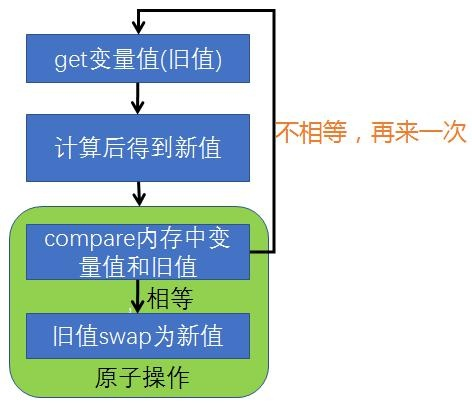
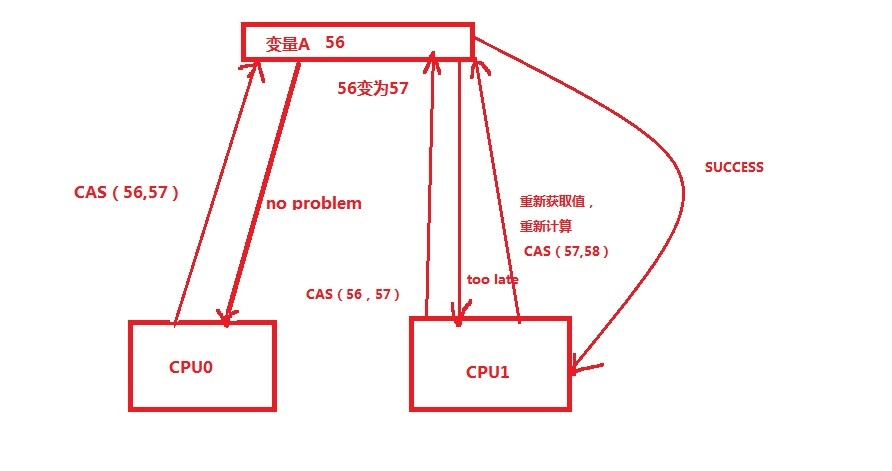

# 5. 原子操作 CAS

## 5.1 什么是原子操作？如何实现原子操作？ 

假定有两个操作 A 和 B，如果从执行 A 的线程来看，当另一个线程执行 B 时， 要么将 B 全部执行完，要么完全不执行 B，那么 A 和 B 对彼此来说是原子的。 

实现原子操作可以使用锁，<font color='red'><strong>锁机制</strong></font>，满足基本的需求是没有问题的了，但是 有的时候我们的需求并非这么简单，我们需要更有效，更加灵活的机制， synchronized 关键字是基于阻塞的锁机制，也就是说当一个线程拥有锁的时候， 访问同一资源的其它线程需要等待，直到该线程释放锁， 这里会有些问题：首先，如果被阻塞的线程优先级很高很重要怎么办？其次， 如果获得锁的线程一直不释放锁怎么办？（这种情况是非常糟糕的）。还有一种 情况，如果有大量的线程来竞争资源，那 CPU 将会花费大量的时间和资源来处 理这些竞争，同时，还有可能出现一些例如死锁之类的情况，最后，其实锁机制 是一种比较粗糙，粒度比较大的机制，相对于像计数器这样的需求有点儿过于笨重。

实现原子操作还可以使用当前的处理器基本都支持 CAS()的指令，只不过每个厂家所实现的算法并不一样，每一个 CAS 操作过程都包含三个运算符：一个内存地址 V，一个期望的值 A 和一个新值 B，操作的时候如果这个地址上存放的值 等于这个期望的值 A，则将地址上的值赋为新值 B，否则不做任何操作。 CAS 的基本思路就是，如果这个地址上的值和期望的值相等，则给其赋予新 值，否则不做任何事儿，但是要返回原值是多少。循环 CAS 就是在一个循环里不 断的做 cas 操作，直到成功为止。 


CAS 是怎么实现线程的安全呢？语言层面不做处理，我们将其交给硬件— CPU 和内存，利用 CPU 的多处理能力，实现硬件层面的阻塞，再加上 volatile 变 量的特性即可实现基于原子操作的线程安全。

<a data-fancybox title="CAS锁" href="./image/CAS1.jpg"></a>

<a herf="https://www.jianshu.com/p/ab2c8fce878b">CPU层面理解参考文献：https://www.jianshu.com/p/ab2c8fce878b</a>

## 5.2 CAS算法理解

<font color='red'><strong>CAS：Compare and Swap，即比较再交换</strong></font>

jdk5增加了并发包java.util.concurrent.*,其下面的类使用CAS算法实现了区别于synchronouse同步锁的一种**乐观锁**。JDK 5之前Java语言是靠synchronized关键字保证同步的，这是一种独占锁，也是悲观锁。

对CAS的理解，CAS是一种无锁算法，CAS有3个操作数，内存值V，旧的预期值A，要修改的新值B。当且仅当预期值A和内存值V相同时，将内存值V修改为B，否则什么都不做。


CAS比较与交换的伪代码可以表示为：

```java
do{

备份旧数据；

基于旧数据构造新数据；

}while(!CAS( 内存地址，备份的旧数据，新数据 ))
```
<a data-fancybox title="CAS锁" href="./image/CAS2.jpg"></a>

## 5.3 CAS 实现原子操作的三大问题

### 5.3.1 ABA 问题

因为 CAS 需要在操作值的时候，检查值有没有发生变化，如果没有发生变化 则更新，但是如果一个值原来是 A，变成了 B，又变成了 A，那么使用 CAS 进行 检查时会发现它的值没有发生变化，但是实际上却变化了。 ABA 问题的解决思路就是使用版本号。在变量前面追加上版本号，每次变量 更新的时候把版本号加 1，那么 A→B→A 就会变成 1A→2B→3A。举个通俗点的 例子，你倒了一杯水放桌子上，干了点别的事，然后同事把你水喝了又给你重新 倒了一杯水，你回来看水还在，拿起来就喝，如果你不管水中间被人喝过，只关 心水还在，这就是 ABA 问题。 

如果你是一个讲卫生讲文明的小伙子，不但关心水在不在，还要在你离开的 时候水被人动过没有，因为你是程序员，所以就想起了放了张纸在旁边，写上初 始值 0，别人喝水前麻烦先做个累加才能喝水。 

### 5.3.2 循环时间长开销大 

自旋 CAS 如果长时间不成功，会给 CPU 带来非常大的执行开销。

### 5.3.3 只能保证一个共享变量的原子操作 

当对一个共享变量执行操作时，我们可以使用循环 CAS 的方式来保证原子操作，但是对多个共享变量操作时，循环 CAS 就无法保证操作的原子性，这个时候就可以用锁。 还有一个取巧的办法，就是把多个共享变量合并成一个共享变量来操作。比 如，有两个共享变量 i＝2，j=a，合并一下 ij=2a，然后用 CAS 来操作 ij。从 Java 1.5 开始，JDK 提供了 AtomicReference 类来保证引用对象之间的原子性，就可以把 多个变量放在一个对象里来进行 CAS 操作。

## 5.4 Jdk 中相关原子操作类的使用

参见代码，包 cn.enjoyedu.ch3 下

### 5.4.1 AtomicInteger 

:::tip AtomicInteger
<font color='red'><strong>•int addAndGet（int delta）</strong></font>：以原子方式将输入的数值与实例中的值 （AtomicInteger 里的 value）相加，并返回结果   
<font color='red'><strong>•boolean compareAndSet（int expect，int update）</strong></font>：如果输入的数值等于预 期值，则以原子方式将该值设置为输入的值   
<font color='red'><strong>•int getAndIncrement()</strong></font>：以原子方式将当前值加 1，注意，这里返回的是自增前的值  
<font color='red'><strong>•int addAndGet(int delta)</strong></font>: 以原子方式旧值加 delta，并返回新值  
<font color='red'><strong>•int getAndSet（int newValue）</strong></font>：以原子方式设置为 newValue 的值，并返回旧值  
:::

```java
/**
 *类说明：演示基本类型的原子操作类
 */
public class UseAtomicInt {
    static AtomicInteger ai = new AtomicInteger(10);

    public static void main(String[] args) {
        //后++
        System.out.println(ai.getAndIncrement());
        //前++
        System.out.println(ai.incrementAndGet());
        //ai.compareAndSet();
        System.out.println(ai.addAndGet(24));
        System.out.println(ai.getAndSet(99));
        System.out.println(ai);
    }
```

### 5.4.2 AtomicIntegerArray 

主要是提供原子的方式更新数组里的整型，其常用方法如下:   
<font color='red'><strong>•int addAndGet（int i，int delta）</strong></font>：以原子方式将输入值与数组中索引 i 的元素相加    
<font color='red'><strong>•boolean compareAndSet（int i，int expect，int update）</strong></font>：如果当前值等于 预期值，则以原子方式将数组位置 i 的元素设置成 update 值。 需要注意的是，数组 value 通过构造方法传递进去，然后 AtomicIntegerArray 会将当前数组复制一份，所以当 AtomicIntegerArray 对内部的数组元素进行修改时，不会影响传入的数组  

```java
/**
 *类说明：AtomicIntegerArray
 */
public class AtomicArray {
    static int[] value = new int[] { 1, 2 };
    static AtomicIntegerArray ai = new AtomicIntegerArray(value);
    public static void main(String[] args) {
        ai.getAndSet(0, 3);
        System.out.println(ai.get(0));
        System.out.println(value[0]);//原数组不会变化
        }
}
```

### 5.4.3 更新引用类型 
原子更新基本类型的 AtomicInteger，只能更新一个变量，如果要原子更新多个变量，就需要使用这个原子更新引用类型提供的类。Atomic 包提供了以下 3 个类

<font color='red'><strong>AtomicReference</strong></font>  

原子更新引用类型  

```java
/**
 *类说明：演示引用类型的原子操作类
 */
public class UseAtomicReference {
    static AtomicReference<UserInfo> atomicUserRef;
    public static void main(String[] args) {
        //要修改的实体的实例
        UserInfo user = new UserInfo("Mark", 15);
        atomicUserRef = new AtomicReference(user);
        UserInfo updateUser = new UserInfo("Bill",17);
        atomicUserRef.compareAndSet(user,updateUser);

        System.out.println(atomicUserRef.get());
        System.out.println(user);
    }
    
    //定义一个实体类
    static class UserInfo {
        private volatile String name;
        private int age;
        public UserInfo(String name, int age) {
            this.name = name;
            this.age = age;
        }
        public String getName() {
            return name;
        }
        public int getAge() {
            return age;
        }

        @Override
        public String toString() {
            return "UserInfo{" +
                    "name='" + name + '\'' +
                    ", age=" + age +
                    '}';
        }
    }

}
```

<font color='red'><strong>AtomicStampedReference</strong></font>  

 利用版本戳的形式记录了每次改变以后的版本号，这样的话就不会存在 ABA 问题了。  
 这就是 AtomicStampedReference 的解决方案。  
 AtomicMarkableReference 跟 AtomicStampedReference 差不多，AtomicStampedReference 是使用 pair 的 int stamp 作为计数器使用，AtomicMarkableReference 的 pair 使用的是 boolean mark。   
 还是那个水的例子，AtomicStampedReference 可能关心的是动过几次， AtomicMarkableReference 关心的是有没有被人动过，方法都比较简单。   

```java
/**
 *类说明：演示带版本戳的原子操作类
 */
public class UseAtomicStampedReference {
    static AtomicStampedReference<String> asr
            = new AtomicStampedReference("mark",0);

    public static void main(String[] args) throws InterruptedException {
        //拿到当前的版本号(旧)
        final int oldStamp = asr.getStamp();
        final String oldReference = asr.getReference();
        System.out.println(oldReference+"============"+oldStamp);

        Thread rightStampThread = new Thread(new Runnable() {
            @Override
            public void run() {
                System.out.println(Thread.currentThread().getName()+":当前变量值："
                        +oldReference + "-当前版本戳：" + oldStamp + "-"
                  + asr.compareAndSet(oldReference,
                        oldReference + "+Java", oldStamp,
                        oldStamp + 1));
            }
        });

        Thread errorStampThread = new Thread(new Runnable() {
            @Override
            public void run() {
                String reference = asr.getReference();
                System.out.println(Thread.currentThread().getName()
                        +":当前变量值："
                        +reference + "-当前版本戳：" + asr.getStamp() + "-"
                        + asr.compareAndSet(reference,
                        reference + "+C", oldStamp,
                        oldStamp + 1));
            }
        });
        rightStampThread.start();
        rightStampThread.join();
        errorStampThread.start();
        errorStampThread.join();

        System.out.println(asr.getReference()+"============"+asr.getStamp());
    }
}
```

<font color='red'><strong>AtomicMarkableReference</strong></font>  
原子更新带有标记位的引用类型。可以原子更新一个布尔类型的标记位和引 用类型。构造方法是 AtomicMarkableReference（V initialRef，booleaninitialMark）


### 5.4.4 原子更新字段类

如果需原子地更新某个类里的某个字段时，就需要使用原子更新字段类， Atomic 包提供了以下 3 个类进行原子字段更新。 要想原子地更新字段类需要两步:  

第一步，因为原子更新字段类都是抽象类， 每次使用的时候必须使用静态方法 newUpdater()创建一个更新器，并且需要设置 想要更新的类和属性。  
第二步，更新类的字段（属性）必须使用 public volatile 修饰符。  

AtomicIntegerFieldUpdater： 原子更新整型的字段的更新器   
AtomicLongFieldUpdater： 原子更新长整型字段的更新器   
AtomicReferenceFieldUpdater： 原子更新引用类型里的字段  