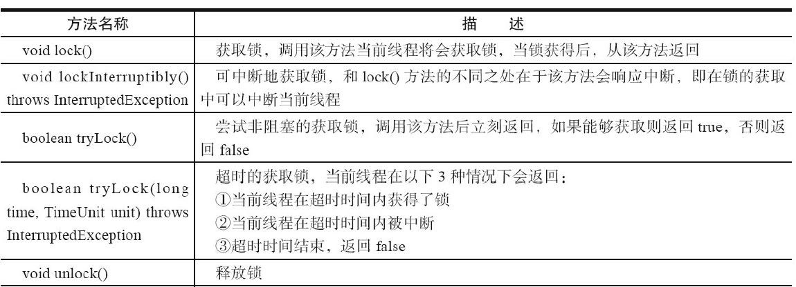
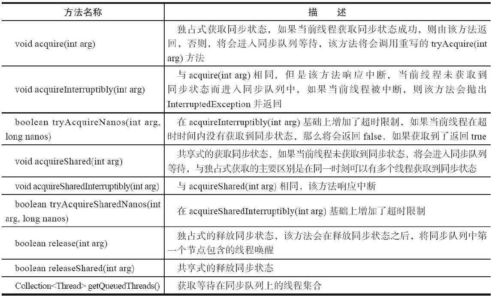
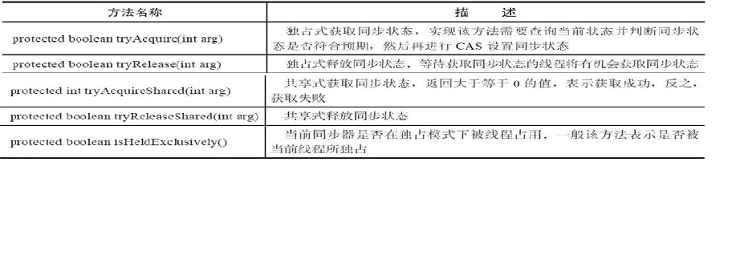

# 6. 显式锁和AQS

[[toc]]

## 6.1 显式锁
有了synchronized 为什么还要 Lock？ Java 程序是靠synchronized关键字实现锁功能的，使用 synchronized 关键字将会隐式地获取锁，但是它将锁的获取和释放固化了，也就是先获取再释放。

## 6.2 Lock 的标准用法

```java
lock.lock();
try{
    count++;
}finally{
    lock.unlock();
}
```
在 finally 块中释放锁，目的是保证在获取到锁之后，最终能够被释放。 不要将获取锁的过程写在 try 块中，因为如果在获取锁（自定义锁的实现） 时发生了异常，异常抛出的同时也会导致锁无故释放。

## 6.3 Lock 的常用 API

<a data-fancybox title="Lock 的常用 API" href="./image/lock.jpg"></a>


## 6.4 ReenTranLock

### 6.4.1 锁的可重入

<font color='red'><strong>可重入锁又叫递归锁(互斥锁)</strong></font>。是指在同一个线程的外层方法中获取锁的时候，再进入该线程的内层方法会自动获取锁（前提锁的是同一个对象）。不会因为之前已经获取过锁还没释放而阻塞。

java中ReentrantLock和Synchronized都是可重入锁。可重入锁的一个优点是**一定程度避免死锁**。


简单地讲就是：“同一个线程对于已经获得到的锁，可以多次继续申请到该锁的使用权”。

#### 6.4.1.1 synchronized 关键字隐式的支持重进入，比如一个 synchronized 修饰的递归方法，在方法执行时执行线程在获取了锁之后仍能连续多次地获得该锁。

```java
package com.tqk.ex4;

import java.text.SimpleDateFormat;
import java.util.Date;
import java.util.concurrent.TimeUnit;

public class LockDemo {
    /**
     * 代码中m1，m2都是由synchronized锁住的。在进入m1的时候持有锁了，方法里调用m2直接进入m2了。
     * 这个时候m1的锁还没释放。因为m2也是这个锁，所以能靠这把未释放的锁进入m2。证明了可重入性。
     * 
     **/
    public synchronized void m1() {
        System.out.println("进入到m1方法！"+new SimpleDateFormat("yyyy-MM-dd HH:mm:ss").format(new Date()));
        m2();
        try {
            TimeUnit.SECONDS.sleep(5);
        } catch (Exception e) {         
            e.printStackTrace();
        }       
    }
    public synchronized void m2() {
        System.out.println("进入到m2方法！"+new SimpleDateFormat("yyyy-MM-dd HH:mm:ss").format(new Date()));
        try {
            TimeUnit.SECONDS.sleep(5);
        } catch (Exception e) {
            e.printStackTrace();
        }       
    }

    /**
    * 没有死锁本身就说明了synchronized的同步块可重入
    **/

    public void m3() {
        synchronized (this) {
            System.out.println("进入m3的一层同步块");
            synchronized (this) {
                System.out.println("进入m3的二层同步块");
                synchronized (this) {
                    System.out.println("进入m3的三层同步块");
                }
            }
        }
    }
    public static void main(String[] args) {
        LockDemo lockDemo = new LockDemo();
        lockDemo.m3();
        new Thread(()->lockDemo.m1()).start();
        new Thread(()->lockDemo.m2()).start();
    }
}

//输出结果
进入m3的一层同步块
进入m3的二层同步块
进入m3的三层同步块
进入到m1方法！2021-08-24 21:47:40
进入到m2方法！2021-08-24 21:47:40
进入到m2方法！2021-08-24 21:47:50

```
<font color='red'><strong>可重入锁实现原理:每个锁对象拥有一个锁计数器和一个指向持有该锁的线程的指针</strong></font>

当执行monitor-enter的时候，如果该对象计数器为0说明当前锁没有被其他线程锁占有，java虚拟机会将该锁对象的持有线程设置为当前线程。并将计数器+1.
在目标锁对象不为0的情况下：
如果锁的持有者是当前线程。则锁对象的计数器+1.
如果锁对象不是当前线程则要等待锁对象的计数器归0，才能获得锁。
当执行monitor-exit的时候，java虚拟机将锁对象的计数器-1.计数器归0代表锁已经被释放

#### 6.4.1.2 ReentrantLock 在调用 lock()方法时，已经获取到锁的线程，能够再次调用 lock()方法获取锁而不被阻塞。


```java
package com.tqk.ex4;

import java.text.SimpleDateFormat;
import java.util.Date;
import java.util.concurrent.TimeUnit;
import java.util.concurrent.locks.Lock;
import java.util.concurrent.locks.ReentrantLock;

public class LockDemo {
    Lock lock = new ReentrantLock();
    public String getTime() {
        return new SimpleDateFormat("yyyy-MM-dd HH:mm:ss").format(new Date());
    }
    public void m1() {
        lock.lock();
        try {           
            System.out.println("进入m1方法"+getTime());
            m2();
            TimeUnit.SECONDS.sleep(5);
        } catch (Exception e) {
        }finally {
            lock.unlock();
        }
    }
    public void m2() {
        lock.lock();
        try {
            System.out.println("进入m2方法"+getTime());
            TimeUnit.SECONDS.sleep(5);
        } catch (Exception e) {
        }finally {
            lock.unlock();
        }
    }
    public static void main(String[] args) {
        LockDemo lockDemo = new LockDemo();
        lockDemo.m1();

    }
}
```
**lock和synchronized最主要的区别的synchronized是隐式获取锁和释放锁**。  
而ReentrantLock的是要手动lock，unlock的。而lock和unlock就是syncronized原理是+1，-1的操作。  
记住加几次锁就要放几次锁。否则会导致锁无法释放。  

### 6.4.2公平和非公平锁 

如果在时间上，**先对锁进行获取的请求一定先被满足，那么这个锁是公平的**， 反之，是不公平的。公平的获取锁，也就是等待时间最长的线程最优先获取锁， 也可以说锁获取是顺序的。 ReentrantLock 提供了一个构造函数，能够控制锁是否是公平的。事实上，公平的锁机制往往没有非公平的效率高。 

在激烈竞争的情况下,非公平锁的性能高于公平锁的性能的一个原因是:  
**在恢复一个被挂起的线程与该线程真正开始运行之间存在着严重的延迟**。   
假设线程 A 持有一个锁,并且线程 B 请求这个锁。由于这个锁已被线程 A 持有,因此 B 将被挂起。当 A 释放锁时,B 将被唤醒,因此会再次尝试获取锁。与此同时,如果 C 也请求这个锁,那么 C 很可能会在 B 被完全唤醒之前获得、使用以及释放这个锁。这样的情况是一种“双赢”的局面:B 获得锁的时刻并没有推迟,C 更早地获得了锁,并且吞吐量也获得了提高。


## 6.5 LockSupport

LockSupport 定义了一组的公共静态方法，这些方法提供了最基本的线程阻塞和唤醒功能，而 LockSupport 也成为构建同步组件的基础工具。  

LockSupport 定义了一组以 park 开头的方法用来阻塞当前线程，以及 unpark(Thread thread)方法来唤醒一个被阻塞的线程。LockSupport 增加了 park(Object blocker)、parkNanos(Object blocker,long nanos)和 parkUntil(Object blocker,long deadline)3 个方法，用于实现阻塞当前线程的功能，其中参数 blocker 是用来标识当前线程在等待的对象（以下称为阻塞对象），该对象主要用于问题 排查和系统监控。

<a data-fancybox title="LockSupport" href="./image/locksupport.jpg"></a>


**LockSupport可以让线程在任意位置阻塞.阻塞之后也有对应的唤醒方法.其本质上调用的是Unsafe类的native方法.** 

```java
    public static void park() {
        UNSAFE.park(false, 0L);
    }
```


```java
public class LockSupportDemo {
    public static void main(String[] args) {
        Thread a = new Thread(()->{
            System.out.println("进入到a线程");
            LockSupport.park();
            System.out.println("a线程被唤醒");
        },"线程a");
        a.start();
        new Thread(()->{
            System.out.println("进入到b线程");
            LockSupport.unpark(a);
        },"线程b") .start();
    }
}
```


其实现原理是这样的:每个使用它的线程都有一个许可(permit)关联.
permit相当于1,0的开关.默认是0.  
调用一次unpark就加1,变成1.  
调用一次park就把1变成0.同时park立即返回.  
注意的是只有0,1两种状态.也就是连续调用unpark多次,也只能让许可证变成1.能解一次park而已.  


**调用park时**:如果有凭证.则消耗这个凭证并且正常退出;如果没凭证,则要等待有凭证才可以退出  
**调用unpark时**:会增加一个凭证,但是凭证的上限是1.  

## 6.6 AbstractQueuedSynchronizer(AQS)

队列同步器 AbstractQueuedSynchronizer（以下简称同步器或 AQS），是用来构建锁或者其他同步组件的基础框架，它使用了一个 int 成员变量（<font color='red'><strong>state</strong></font>）表示同步状态，通过内置的 FIFO 队列来完成资源获取线程的排队工作。并发包的大师（Doug Lea）期望它能够成为实现大部分同步需求的基础。

### 6.6.1 CLH队列锁
研究过AQS源码的小伙伴们应该知道，AQS是JUC的核心，而CLH锁又是AQS的基础，说核心也不为过，因为AQS就是用了变种的CLH锁。如果要学好Java并发编程，那么必定要学好JUC；学好JUC，必定要先学好AQS；学好AQS，那么必定先学好CLH。因此，这就是我们为什么要学习CLH锁的原因。
https://zhuanlan.zhihu.com/p/197840259
https://www.cnblogs.com/yuyutianxia/p/4296220.html

### 6.6.2 AQS 使用方式和其中的设计模式 

AQS 的主要使用方式是继承，子类通过继承 AQS 并实现它的抽象方法来管 理同步状态，在 AQS 里由一个 int 型的 state 来代表这个状态，在抽象方法的实现过程中免不了要对同步状态进行更改，

CLH 队列锁即 Craig, Landin, and Hagersten (CLH) locks。 CLH 队列锁也是一种基于链表的可扩展、高性能、公平的自旋锁，申请线程仅仅在本地变量上自旋，它不断轮询前驱的状态，假设发现前驱释放了锁就结束自旋。


#### 6.6.2.1 AQS 使用方式和其中的设计模式
这时就需要使用同步器提供的 3 个方法：  
<font color='red'><strong>• getState()</strong></font>  ：获取当前同步状态。   
<font color='red'><strong>• setState(int newState)</strong></font>  ：设置当前同步状态。   
<font color='red'><strong>• compareAndSetState(int expect,int update)</strong></font>  ：使用 CAS 设置当前状态，该方法能够保证状态设置的原子性。  
来进行操作，因为它们能够保证状态的改变是安全的。

```java

    /**
     * The synchronization state.
     */
    private volatile int state;
```
在实现上，子类推荐被定义为自定义同步组件的静态内部类，AQS 自身没有 实现任何同步接口，它仅仅是定义了若干同步状态获取和释放的方法来供自定义同步组件使用，同步器既可以支持<font color='red'><strong>独占式地获取同步状态</strong></font> ，也可以支持<font color='red'><strong>共享式地获取同步状态</strong></font> ，这样就可以方便实现不同类型的同步组件（ReentrantLock、 ReentrantReadWriteLock 和 CountDownLatch 等）。


**同步器是实现锁（也可以是任意同步组件）的关键，在锁的实现中聚合同步器。** 

可以这样理解二者之间的关系： 锁是面向使用者的，它定义了使用者与锁交互的接口（比如可以允许两个线 程并行访问），隐藏了实现细节； 

同步器面向的是锁的实现者，它简化了锁的实现方式，屏蔽了同步状态管理、 线程的排队、等待与唤醒等底层操作。锁和同步器很好地隔离了使用者和实现者所需关注的领域。 

实现者需要继承同步器并重写指定的方法，随后将同步器组合在自定义同步组件的实现中，并调用同步器提供的模板方法，而这些模板方法将会调用使用者重写的方法。

**模板方法模式**  
同步器的设计基于模板方法模式。模板方法模式的意图是，定义一个操作中 的算法的骨架，而将一些步骤的实现延迟到子类中。模板方法使得子类可以不改
变一个算法的结构即可重定义该算法的某些特定步骤。我们最常见的就是 Spring 框架里的各种 Template。

#### 6.6.2.2 AQS 中的方法

**模板方法**

实现自定义同步组件时，将会调用同步器提供的模板方法，
<a data-fancybox title="acquire" href="./image/acquire.jpg"></a>

**可重写的方法**
<a data-fancybox title="tryacquire" href="./image/tryacquire.jpg"></a>

### 6.6.3 实现一个自己的独占锁

### 6.6.4 源码分析
从ReentrantLock说起，Lock接口的实现类，基本都是通过聚合了一个队列同步器的子类完成线程访问控制的。
```java
    public void lock() {
        sync.lock();
    }


public class ReentrantLock implements Lock, java.io.Serializable {
    private static final long serialVersionUID = 7373984872572414699L;
    /** Synchronizer providing all implementation mechanics */
    private final Sync sync;

    /**
     * Base of synchronization control for this lock. Subclassed
     * into fair and nonfair versions below. Uses AQS state to
     * represent the number of holds on the lock.
     */
    abstract static class Sync extends AbstractQueuedSynchronizer {
        private static final long serialVersionUID = -5179523762034025860L;
```
**上面两段代码就可以看出来：lock.lock本质上是在lock类中聚合一个AQS的实现类，然后调用lock和unlock都是调用这个AQS的实现类的方法来实现（unlock是调用sysn.release(1);）的。**


然后注意，我们知道ReentrantLock默认是非公平锁的，可以创建的时候传参设置为公平锁，那么这个公平还是非公平对于AQS的实现类有什么区别呢？

```java
    static final class FairSync extends Sync {
        private static final long serialVersionUID = -3000897897090466540L;

        final void lock() {
            acquire(1);
        }

        /**
         * Fair version of tryAcquire.  Don't grant access unless
         * recursive call or no waiters or is first.
         */
        protected final boolean tryAcquire(int acquires) {
            final Thread current = Thread.currentThread();
            int c = getState();
            if (c == 0) {
                if (!hasQueuedPredecessors() &&
                    compareAndSetState(0, acquires)) {
                    setExclusiveOwnerThread(current);
                    return true;
                }
            }
            else if (current == getExclusiveOwnerThread()) {
                int nextc = c + acquires;
                if (nextc < 0)
                    throw new Error("Maximum lock count exceeded");
                setState(nextc);
                return true;
            }
            return false;
        }
    }

    /**
     * Creates an instance of {@code ReentrantLock}.
     * This is equivalent to using {@code ReentrantLock(false)}.
     */
    public ReentrantLock() {
        sync = new NonfairSync();
    }

    /**
     * Creates an instance of {@code ReentrantLock} with the
     * given fairness policy.
     *
     * param fair {@code true} if this lock should use a fair ordering policy
     */
    public ReentrantLock(boolean fair) {
        sync = fair ? new FairSync() : new NonfairSync();
    }

```

-----------------------

从上述代码可以看出，根据传参的不同去实现不同的配置的Sync类型，Sync类型又是AQS的实现类。

<a data-fancybox title="tryacquire" href="http://49.232.21.151/group1/M00/00/00/rBUAEGBXad2AVvLXAACIHxTorUk541.jpg"></a>
