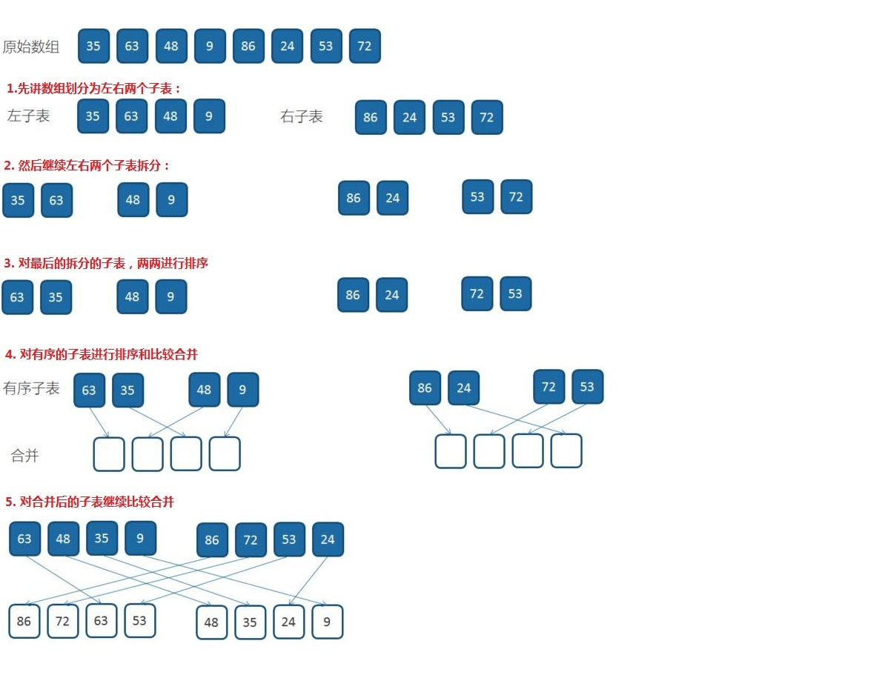
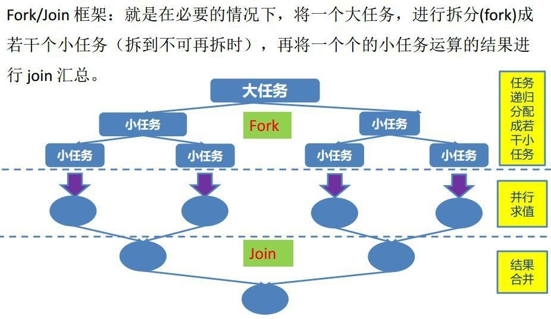
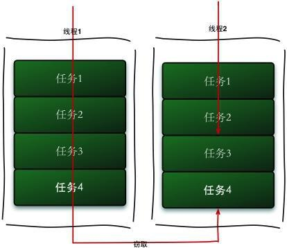
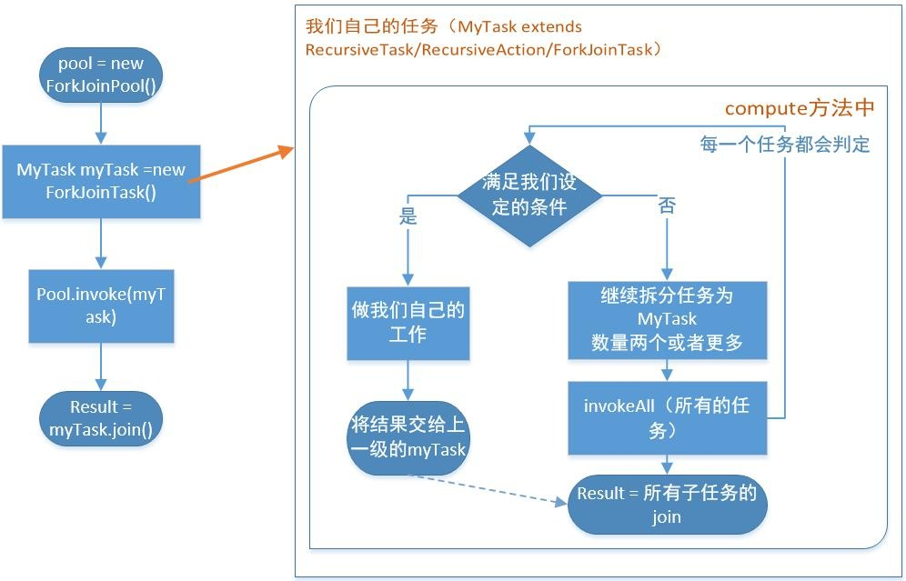
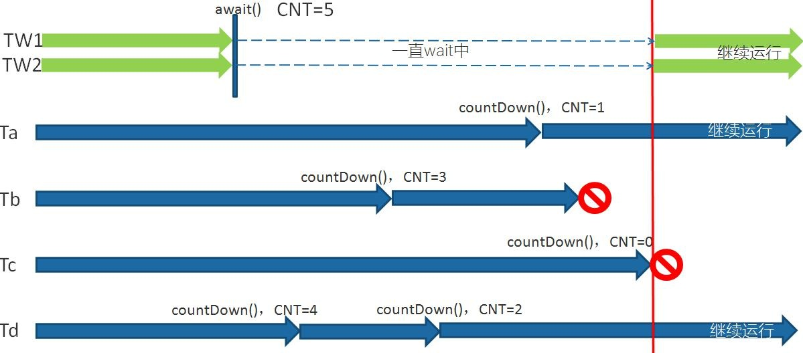
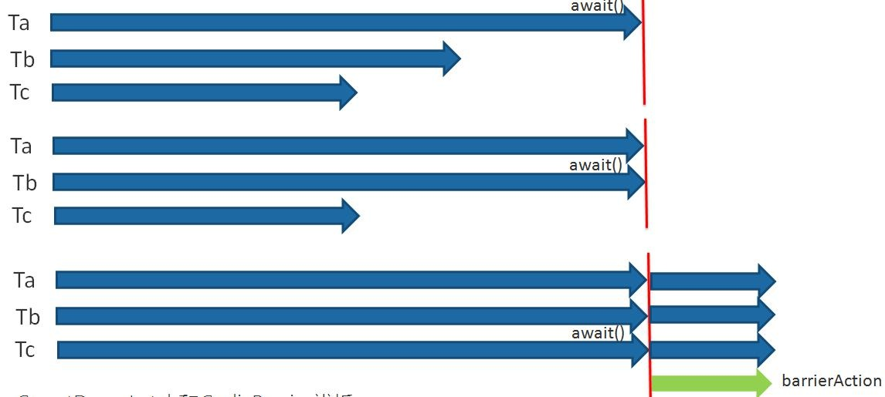

# 4.线程的并发工具类

[[toc]]
## 4.1 Fork-Join
java下多线程的开发可以我们自己启用多线程，线程池，还可以使用forkjoin， forkjoin 可以让我们不去了解诸如 Thread,Runnable 等相关的知识，只要遵循 forkjoin 的开发模式，就可以写出很好的多线程并发程序

### 4.1.1 分而治之

<font color='red'>**分治法的设计思想**</font>：将一个难以直接解决的大问题，分割成一些规模较小 的相同问题，以便各个击破，分而治之。 

<font color='red'>**分治策略**</font>：对于一个规模为 n 的问题，若该问题可以容易地解决（比如说 规模 n 较小）则直接解决，否则将其分解为 k 个规模较小的子问题，这些子问题 互相独立且与原问题形式相同(子问题相互之间有联系就会变为动态规范算法)， 递归地解这些子问题，然后将各子问题的解合并得到原问题的解。这种算法设计 策略叫做分治法。

### 4.1.2 归并排序
快速排序、归并排序、二分查找，还有大数据中 M/R 都是分而治之

归并排序是建立在归并操作上的一种有效的排序算法。该算法是采用分治法的一个非常典型的应用。将已有序的子序列合并，得到完全有序的序列；即先使每个子序列有序，再使子序列段间有序。

若将两个有序表合并成一个有序表，称为 2-路归并，与之对应的还有多路归并。对于给定的一组数据，利用递归与分治技术将数据序列划分成为越来越小的半子表，在对半子表排序后，再用递归方法将排好序的半子表合并成为越来越大的有序序列。 为了提升性能，有时我们在半子表的个数小于某个数（比如 15）的情况下， 对半子表的排序采用其他排序算法，比如插入排序。

**单线程归并排序**
```java

import java.util.Arrays;

public class MergeSort {
    public final static int MAX = 20;

    public static int[] sort(int[] array){
        if(array.length<=MAX){
            int[] left= MaoPaoSort.sort(array);
            return  left;
        }else{
            /*切分数组，然后递归调用*/
            int mid = array.length / 2;
            int[] left= Arrays.copyOfRange(array,0,mid);
            int[] right=Arrays.copyOfRange(array,mid,array.length);
            return merge(sort(left),sort(right));
        }
    }
    /**
     * 归并排序——将两段排序好的数组结合成一个排序数组
     *
     * @param left
     * @param right
     * @return
     */
    public static int[] merge(int[] left, int[] right) {
        int[] result = new int[left.length + right.length];
        for(int i=0,j=0,x=0;i<result.length;i++){
            if (j >= left.length) {
                // 左边数组已经取完，完全取右边数组的值即可
                result[i] = right[x++];
            } else if (x >= right.length){
                // 右边数组已经取完，完全取左边数组的值即可
                result[i] = left[j++];
            }else if(left[j]>right[x]){
                result[i]=right[x++];
            }else{
                result[i]=left[j++];
            }
        }
        return result;
    }

    public static void main(String[] args) {
        System.out.println("============================================");
        long start = System.currentTimeMillis();
        int[] array= sort(MakeArray.makeArray(30));
        for (int i :array){
            System.out.print(i+",");
        }
        System.out.println("");
        System.out.println(" spend time:"+(System.currentTimeMillis()-start)+"ms");
    }
}
```

```java
package com.tqk.ex2.forkjoin.sort.tqk;

import com.tqk.ex2.forkjoin.sort.InsertionSort;

public class MaoPaoSort {
    public static int[] sort(int[] array) {
        if (array.length == 0) {
            return array;
        }
        int  currentValue;
        int num;
        for (int i = 0; i <=array.length - 1; i++) {
            currentValue= array[i];
            for (int j=i+1;j<=array.length-1;j++){
                //找出一个最小值
                if(currentValue>array[j]){
                    num=currentValue;
                    currentValue=array[j];
                    array[j]=num;
                }else{
                    continue;
                }
            }
            array[i]=currentValue;
        }
        return array;
    }

    public static void main(String[] args) {
        System.out.println("============================================");
        int[] darray=InsertionSort.sort(MakeArray.makeArray(15));
        for (int i: darray) {
            System.out.print(i+", ");
        }
    }
}

```

#### 4.1.2.1 归并排序（降序）示例

<a data-fancybox title="归并排序（降序）示例" href="./image/guibing.jpg"></a>

** Fork join模式**

```java
package com.tqk.ex2.forkjoin.sort.tqk;

import com.tqk.ex2.forkjoin.sort.FkSort;

import java.util.Arrays;
import java.util.concurrent.ForkJoinPool;
import java.util.concurrent.RecursiveTask;

public class FkjMergeSort {
    private static class SumTask extends RecursiveTask<int[]> {
        private final static int THRESHOLD = 2;
        private int[] src;

        public SumTask(int[] src) {
            this.src = src;
        }

        @Override
        protected int[] compute() {
            if(src.length<=2){
                return MaoPaoSort.sort(src);
            }else {
                int mid = src.length / 2;
                int[] left= Arrays.copyOfRange(src,0,mid);
                int[] right= Arrays.copyOfRange(src,mid,src.length);
                FkjMergeSort.SumTask leftTask = new FkjMergeSort.SumTask(left);
                FkjMergeSort.SumTask rightTask = new FkjMergeSort.SumTask(right);
                invokeAll(leftTask,rightTask);
                int[] leftResult=leftTask.join();
                int[] rightResult=rightTask.join();
                return merge(leftResult,rightResult);
            }
        }
    }
    /**
     * 归并排序——将两段排序好的数组结合成一个排序数组
     *
     * @param left
     * @param right
     * @return
     */
    public static int[] merge(int[] left, int[] right) {
        int[] result = new int[left.length + right.length];
        for(int i=0,j=0,x=0;i<result.length;i++){
            if (j >= left.length) {
                // 左边数组已经取完，完全取右边数组的值即可
                result[i] = right[x++];
            } else if (x >= right.length){
                // 右边数组已经取完，完全取左边数组的值即可
                result[i] = left[j++];
            }else if(left[j]>right[x]){
                result[i]=right[x++];
            }else{
                result[i]=left[j++];
            }
        }
        return result;
    }

    public static void main(String[] args) {
        System.out.println("============================================");
        long start = System.currentTimeMillis();

        ForkJoinPool pool = new ForkJoinPool();
        int[] src = MakeArray.makeArray(30);

        FkjMergeSort.SumTask innerFind = new FkjMergeSort.SumTask(src);

        int[] array = pool.invoke(innerFind);
        for (int i :array){
            System.out.print(i+",");
        }
        System.out.println("");
        System.out.println(" spend time:"+(System.currentTimeMillis()-start)+"ms");
    }
}
```

### 4.1.3 Fork-Join 原理

<a data-fancybox title="Fork-Join 原理" href="./image/forkjoin.jpg"></a>

**工作密取**
即当前线程的 Task 已经全被执行完毕，则自动取到其他线程的 Task 池中取 出 Task 继续执行。 
ForkJoinPool 中维护着多个线程（一般为 CPU 核数）在不断地执行 Task，每 个线程除了执行自己职务内的 Task 之外，还会根据自己工作线程的闲置情况去获取其他繁忙的工作线程的 Task，如此一来就能能够减少线程阻塞或是闲置的时间，提高 CPU 利用率。

<a data-fancybox title="Fork-Join 原理" href="./image/miqu.jpg"></a>


### 4.1.4 Fork/Join 实战

#### 4.1.4.1 Fork/Join 使用的标准范式 

我们要使用 ForkJoin 框架，必须首先创建一个 ForkJoin 任务。它提供在任务 中执行 fork 和 join 的操作机制，通常我们不直接继承 ForkjoinTask 类，只需要直接继承其子类。 
1. RecursiveAction，用于没有返回结果的任务 
2. RecursiveTask，用于有返回值的任务 

task 要通过 ForkJoinPool 来执行，使用 submit 或 invoke 提交，  
两者的区别是：  
invoke 是同步执行，调用之后需要等待任务完成，才能执行后面的代码；   

submit 是异步执行。 

join()和 get 方法当任务完成的时候返回计算结果 
<a data-fancybox title="Fork/Join 使用的标准范式 " href="./image/forkjoin11.jpg"></a>


在我们自己实现的 compute 方法里，首先需要判断任务是否足够小，如果足够小就直接执行任务。如果不足够小，就必须分割成两个子任务，每个子任务在调用 invokeAll 方法时，又会进入 compute 方法，看看当前子任务是否需要继续分割成孙任务，如果不需要继续分割，则执行当前子任务并返回结果。使用 join 方法会等待子任务执行完并得到其结果

```java
package com.tqk.ex2.forkjoin.sum;


import cn.tqk.tools.SleepTools;
import com.tqk.ex2.forkjoin.sort.tqk.MakeArray;

import java.util.Arrays;
import java.util.concurrent.ForkJoinPool;
import java.util.concurrent.RecursiveTask;

/**
 * @author tqk
 */
public class SumArray {
    private static class SumTask extends RecursiveTask<Integer>{
        // 阈值
        private final static int THRESHOLD =20;
        private int[] src;
        private int fromIndex;
        private int toIndex;

        public SumTask(int[] src, int fromIndex, int toIndex) {
            this.src = src;
            this.fromIndex = fromIndex;
            this.toIndex = toIndex;
        }

        @Override
        protected Integer compute() {
            int count=0;
            if(THRESHOLD<(toIndex-fromIndex)){
                for (int i=fromIndex;i<=toIndex;i++){
                    SleepTools.ms(1);
                    count+=src[i];
                }
                return count;
            }else{
                int mid=src.length/2;
                int[] left=Arrays.copyOfRange(src,fromIndex,mid);
                int[] right=Arrays.copyOfRange(src,mid,toIndex);
                SumTask leftSumTask=new SumTask(left,0,left.length);
                SumTask rightSumTask=new SumTask(right,0,right.length);
                invokeAll(leftSumTask,rightSumTask);
                return  leftSumTask.join()+rightSumTask.join();
            }
        }

        public static void main(String[] args) {
            int[] src = MakeArray.makeArray(100000);
            /*new出池的实例*/
            ForkJoinPool pool = new ForkJoinPool();
            /*new出Task的实例*/
            SumTask innerFind = new SumTask(src,0,src.length-1);

            long start = System.currentTimeMillis();

            pool.invoke(innerFind);
            //System.out.println("Task is Running.....");

            System.out.println("The count is "+innerFind.join()
                    +"\n spend time:"+(System.currentTimeMillis()-start)+"ms");
        }
    }
}
```

#### 4.1.4.2 Fork/Join 的同步用法和异步用法

```java
package com.tqk.ex2.forkjoin;

import java.io.File;
import java.io.FileNotFoundException;
import java.io.PrintWriter;
import java.util.ArrayList;
import java.util.List;
import java.util.concurrent.ForkJoinPool;
import java.util.concurrent.RecursiveAction;

/**
 *类说明：遍历指定目录（含子目录）找寻指定类型文件
 */
public class FindDirsFiles extends RecursiveAction {

    private File path;
    File getPath=new File("allfile.txt");
    public FindDirsFiles(File path) {
        this.path = path;
    }

    @Override
    protected void compute() {
        List<FindDirsFiles> subTasks = new ArrayList<>();

        File[] files = path.listFiles();
        if (files!=null){
            for (File file : files) {
                if (file.isDirectory()) {
                    // 对每个子目录都新建一个子任务。
                    subTasks.add(new FindDirsFiles(file));
                } else {
                    // 遇到文件，检查。
                    if (file.getAbsolutePath().endsWith("java")){
                        System.out.println("文件:" + file.getAbsolutePath());
                        try {
                            PrintWriter printWriter=new PrintWriter(getPath);
                            printWriter.write(file.getAbsolutePath());
                            printWriter.close();
                        } catch (FileNotFoundException e) {
                            e.printStackTrace();
                        }
                    }
                }
            }
            if (!subTasks.isEmpty()) {
                // 在当前的 ForkJoinPool 上调度所有的子任务。
                for (FindDirsFiles subTask : invokeAll(subTasks)) {
                    subTask.join();
                }
            }
        }
    }

    public static void main(String [] args){
        try {
            // 用一个 ForkJoinPool 实例调度总任务
            ForkJoinPool pool = new ForkJoinPool();
            FindDirsFiles task = new FindDirsFiles(new File("F:/"));

            /*异步提交*/
            pool.execute(task);

            /*主线程做自己的业务工作*/
            System.out.println("Task is Running......");
            Thread.sleep(1);
            int otherWork = 0;
            for(int i=0;i<100;i++){
                otherWork = otherWork+i;
            }
            System.out.println("Main Thread done sth......,otherWork="
                    +otherWork);
            //task.join();//阻塞方法
            System.out.println("Task end");
        } catch (Exception e) {
            // TODO Auto-generated catch block
            e.printStackTrace();
        }
    }
}

```

## 4.2 CountDownLatch

闭锁，CountDownLatch 这个类能够使一个线程等待其他线程完成各自的工作后再执行。例如应用程序的主线程希望在负责启动框架服务的线程已经启动所有的框架服务之后再执行。 

CountDownLatch 是通过一个计数器来实现的，计数器的初始值为初始任务的数量。每当完成了一个任务后，计数器的值就会减 1 （CountDownLatch.countDown()方法）。当计数器值到达 0 时，它表示所有的已经完成了任务，然后在闭锁上等待 CountDownLatch.await()方法的线程就可以恢复执行任务。 

应用场景： 
实现最大的并行性：有时我们想同时启动多个线程，实现最大程度的并行性。 例如，我们想测试一个单例类。如果我们创建一个初始计数为 1 的 CountDownLatch，并让所有线程都在这个锁上等待，那么我们可以很轻松地完成测试。我们只需调用一次 countDown()方法就可以让所有的等待线程同时恢复执行。开始执行前等待 n 个线程完成各自任务：例如应用程序启动类要确保在处理用户请求前，所有 N 个外部系统已经启动和运行了，例如处理 excel 中多个表单。

<a data-fancybox title="CountDownLatch" href="./image/countdownlatch.jpg"></a>

```java
import cn.tqk.tools.SleepTools;

import java.util.concurrent.CountDownLatch;

/**
 *类说明：演示CountDownLatch用法，
 * 共5个初始化子线程，6个闭锁扣除点，扣除完毕后，主线程和业务线程才能继续执行
 */
public class UseCountDownLatch {
	
    static CountDownLatch latch = new CountDownLatch(6);

    /*初始化线程*/
    private static class InitThread implements Runnable{

        @Override
        public void run() {
        	System.out.println("Thread_"+Thread.currentThread().getId()
        			+" ready init work......");
            latch.countDown();
            for(int i =0;i<2;i++) {
            	System.out.println("Thread_"+Thread.currentThread().getId()
            			+" ........continue do its work");
            }
        }
    }

    /*业务线程等待latch的计数器为0完成*/
    private static class BusiThread implements Runnable{

        @Override
        public void run() {
            try {
                latch.await();
            } catch (InterruptedException e) {
                e.printStackTrace();
            }
            for(int i =0;i<3;i++) {
            	System.out.println("BusiThread_"+Thread.currentThread().getId()
            			+" do business-----");
            }
        }
    }

    public static void main(String[] args) throws InterruptedException {
        new Thread(new Runnable() {
            @Override
            public void run() {
            	SleepTools.ms(1);
                System.out.println("Thread_"+Thread.currentThread().getId()
            			+" ready init work step 1st......");
                latch.countDown();
                System.out.println("begin step 2nd.......");
                SleepTools.ms(1);
                System.out.println("Thread_"+Thread.currentThread().getId()
            			+" ready init work step 2nd......");
                latch.countDown();
                //一个线程中可以执行两次coundown方法
            }
        }).start();
        new Thread(new BusiThread()).start();
        for(int i=0;i<=3;i++){
            Thread thread = new Thread(new InitThread());
            thread.start();
        }

        latch.await();
        System.out.println("Main do ites work........");
    }
}
```

## 4.3 CyclicBarrier
CyclicBarrier 的字面意思是可循环使用（Cyclic）的屏障（Barrier）。它要做的事情是，让一组线程到达一个屏障（也可以叫同步点）时被阻塞，直到最后一 个线程到达屏障时，屏障才会开门，所有被屏障拦截的线程才会继续运行。 CyclicBarrier 默认的构造方法是 CyclicBarrier（int parties），其参数表示屏障拦截的线程数量，每个线程调用 await 方法告诉 CyclicBarrier 我已经到达了屏障，然后当前线程被阻塞。 

CyclicBarrier 还提供一个更高级的构造函数 CyclicBarrier（int parties，Runnable barrierAction），用于在线程到达屏障时，优先执行 barrierAction，方便处理更复杂的业务场景。

<a data-fancybox title="CyclicBarrier" href="./image/cyclicBarrier.jpg"></a>


```java
package com.tqk.ex2.countdownlatch;

import java.util.Map;
import java.util.concurrent.ConcurrentHashMap;
import java.util.concurrent.CyclicBarrier;

/**
 *类说明：演示CyclicBarrier用法,共4个子线程，他们全部完成工作后，交出自己结果，
 *再被统一释放去做自己的事情，而交出的结果被另外的线程拿来拼接字符串
 */
public class UseCyclicBarrier {

    private static CyclicBarrier barrier = new CyclicBarrier(4,new CollectThread());

    //存放子线程工作结果的容器
    private static ConcurrentHashMap<String,Long> resultMap
            = new ConcurrentHashMap<>();

    public static void main(String[] args) {
        for(int i=0;i<4;i++){
            Thread thread = new Thread(new SubThread());
            thread.start();
        }

    }

    /*汇总的任务*/
    private static class CollectThread implements Runnable{

        @Override
        public void run() {
            StringBuilder result = new StringBuilder();
            for(Map.Entry<String,Long> workResult:resultMap.entrySet()){
            	result.append("["+workResult.getValue()+"]");
            }
            System.out.println(" the result = "+ result);
            System.out.println("do other business........");
        }
    }

    /*相互等待的子线程*/
    private static class SubThread implements Runnable{

        @Override
        public void run() {
        	long id = Thread.currentThread().getId();
            resultMap.put(Thread.currentThread().getId()+"",id);
            try {
                	Thread.sleep(1000+id);
                	System.out.println("Thread_"+id+" ....do something ");
                barrier.await();
            	Thread.sleep(1000+id);
                System.out.println("Thread_"+id+" ....do its business ");
                //第一次等待结束后，汇总处理完之后，还可以继续等待再处理，下一轮汇总处理
                barrier.await();
            } catch (Exception e) {
                e.printStackTrace();
            }

        }
    }
}
```
CountDownLatch 的计数器只能使用一次，而<font color='red'> CyclicBarrier 的计数器可以**反复使用**</font>。CountDownLatch.await 一般阻塞工作线程，所有的进行预备工作的线程执行 countDown，而 CyclicBarrier 通过工作线程调用 await 从而自行阻塞，直到所有工作线程达到指定屏障，再大家一起往下走。 

在控制多个线程同时运行上，CountDownLatch 可以不限线程数量，而 CyclicBarrier 是固定线程数。 同时，CyclicBarrier 还可以提供一个 barrierAction，合并多线程计算结果。

## 4.4 Semaphore

<font color='red'>Semaphore（信号量）是用来控制同时访问特定资源的线程数量，它通过协调各个线程以保证合理的使用公共资源</font>

### 4.4.1 应用场景 

Semaphore 可以用于做**流量控制**，特别是公用资源有限的应用场景 

比如：数据库连接池，同时进行连接的线程有数量限制，连接不能超过一定的数量，当连接达到了限制数量后，后面的线程只能排队等前面的线程释放了数据库连接才能获得数据库连接。

比如：停车场场景，车位数量有限，同时只能容纳多少台车，车位满了之后只有等里面的车离开停车场外面的车才可以进入。

假如有一个需求， 要读取几万个文件的数据，因为都是 IO 密集型任务，我们可以启动几十个线程并发地读取，但是如果读到内存后，还需要存储到数据库中，而数据库的连接数只有 10 个，这时我们必须控制只有10 个线程同时获取数据库连接保存数据，否则会报错无法获取数据库连接。这个时候就可以使用 Semaphore 来做**流量控制**。

### 4.4.2 常用方法

Semaphore 的构造方法 Semaphore（int permits）接受一个整型的数字， 表示可用的许可证数量。Semaphore 的用法也很简单，首先线程使用 Semaphore 的 acquire()方法获取一个许可证，使用完之后调用 release()方法归还许可证。还可以用 tryAcquire()方法尝试获取许可证。

:::tip  常用方法
<font color='red'><strong>acquire()</strong></font>    
获取一个令牌，在获取到令牌、或者被其他线程调用中断之前线程一直处于阻塞状态。  
​
<font color='red'><strong>acquire(int permits) </strong></font>   
获取一个令牌，在获取到令牌、或者被其他线程调用中断、或超时之前线程一直处于阻塞状态。  
    
<font color='blue'><strong>acquireUninterruptibly()</strong></font>   
获取一个令牌，在获取到令牌之前线程一直处于阻塞状态（忽略中断）。  
    
<font color='red'><strong>tryAcquire()</strong></font>    
尝试获得令牌，返回获取令牌成功或失败，不阻塞线程。  
​
<font color='blue'><strong>tryAcquire(long timeout, TimeUnit unit)</strong></font>    
尝试获得令牌，在超时时间内循环尝试获取，直到尝试获取成功或超时返回，不阻塞线程。  
​
<font color='red'><strong>release()</strong></font>  
释放一个令牌，唤醒一个获取令牌不成功的阻塞线程。  
​
<font color='blue'><strong>hasQueuedThreads()</strong></font>  
等待队列里是否还存在等待线程。  
​
<font color='blue'><strong>getQueueLength()</strong></font>  
获取等待队列里阻塞的线程数。  
​
<font color='blue'><strong>drainPermits()</strong></font>  
清空令牌把可用令牌数置为0，返回清空令牌的数量。  
​
<font color='red'><strong>availablePermits()</strong></font>  
返回可用的令牌数量。
:::
<a data-fancybox title="Semaphore" href="./image/Semaphore.jpg"></a>

:::tip Semaphore提供一些其他方法，具体如下:
<font color='red'><strong>•int availablePermits()</strong></font>：返回此信号量中当前可用的许可证数。  

<font color='red'><strong>•int getQueueLength()</strong></font>：返回正在等待获取许可证的线程数。 

<font color='red'><strong>•boolean hasQueuedThreads()</strong></font>：是否有线程正在等待获取许可证。   

<font color='red'><strong>•void reducePermits（int reduction</strong></font>：减少 reduction 个许可证，是个 protected 方法。 

<font color='red'><strong>•Collection getQueuedThreads()</strong></font>：返回所有等待获取许可证的线程集合，是个 protected 方法。  
:::

### 4.4.3 Semaphore实现原理

#### 4.4.3.1 Semaphore初始化

```java
Semaphore semaphore=new Semaphore(2);
```

1、当调用new Semaphore(2) 方法时，默认会创建一个非公平的锁的同步阻塞队列。

2、把初始令牌数量赋值给同步队列的state状态，state的值就代表当前所剩余的令牌数量。


**初始化完成后同步队列信息如下图：**


<a data-fancybox title="Semaphore" href="./image/Semaphore1.jpg"></a>


#### 4.4.3.2 获取令牌

```java
semaphore.acquire();
```

1、当前线程会尝试去同步队列获取一个令牌，获取令牌的过程也就是使用原子的操作去修改同步队列的state ,获取一个令牌则修改为state=state-1。

2、 当计算出来的state<0，则代表令牌数量不足，此时会创建一个Node节点加入阻塞队列，挂起当前线程。

3、当计算出来的state>=0，则代表获取令牌成功。


**源码：**
```java
/**
     *  获取1个令牌
     */
    public void acquire() throws InterruptedException {
        sync.acquireSharedInterruptibly(1);
    }


/**
     * 共享模式下获取令牌，获取成功则返回，失败则加入阻塞队列，挂起线程
     * @param arg
     * @throws InterruptedException
     */
    public final void acquireSharedInterruptibly(int arg)
            throws InterruptedException {
        if (Thread.interrupted())
            throw new InterruptedException();
        //尝试获取令牌，arg为获取令牌个数，当可用令牌数减当前令牌数结果小于0,则创建一个节点加入阻塞队列，挂起当前线程。
        if (tryAcquireShared(arg) < 0)
            doAcquireSharedInterruptibly(arg);
    }

```

```java
/**
     * 1、创建节点，加入阻塞队列，
     * 2、重双向链表的head，tail节点关系，清空无效节点
     * 3、挂起当前节点线程
     * @param arg
     * @throws InterruptedException
     */
    private void doAcquireSharedInterruptibly(int arg)
        throws InterruptedException {
        //创建节点加入阻塞队列
        final Node node = addWaiter(Node.SHARED);
        boolean failed = true;
        try {
            for (;;) {
                //获得当前节点pre节点
                final Node p = node.predecessor();
                if (p == head) {
                    int r = tryAcquireShared(arg);//返回锁的state
                    if (r >= 0) {
                        setHeadAndPropagate(node, r);
                        p.next = null; // help GC
                        failed = false;
                        return;
                    }
                }
                //重组双向链表，清空无效节点，挂起当前线程
                if (shouldParkAfterFailedAcquire(p, node) &&
                    parkAndCheckInterrupt())
                    throw new InterruptedException();
            }
        } finally {
            if (failed)
                cancelAcquire(node);
        }
    }
```


**线程1、线程2、线程3、分别调用semaphore.acquire(),整个过程队列信息变化如下图：**

<a data-fancybox title="Semaphore" href="./image/Semaphore2.jpg"></a>


#### 4.4.3.3 释放令牌

```java
 semaphore.release();
```
当调用semaphore.release() 方法时

1、线程会尝试释放一个令牌，释放令牌的过程也就是把同步队列的state修改为state=state+1的过程

2、释放令牌成功之后，同时会唤醒同步队列中的一个线程。

3、被唤醒的节点会重新尝试去修改state=state-1 的操作，如果state>=0则获取令牌成功，否则重新进入阻塞队列，挂起线程。


**源码：**
```java
 /**
     * 释放令牌
     */
    public void release() {
        sync.releaseShared(1);
    }


/**
     *释放共享锁，同时会唤醒同步队列中的一个线程。
     * @param arg
     * @return
     */
    public final boolean releaseShared(int arg) {
        //释放共享锁
        if (tryReleaseShared(arg)) {
            //唤醒所有共享节点线程
            doReleaseShared();
            return true;
        }
        return false;
    }
```

```java
 /**
     * 唤醒同步队列中的一个线程
     */
    private void doReleaseShared() {
        for (;;) {
            Node h = head;
            if (h != null && h != tail) {
                int ws = h.waitStatus;
                if (ws == Node.SIGNAL) {//是否需要唤醒后继节点
                    if (!compareAndSetWaitStatus(h, Node.SIGNAL, 0))//修改状态为初始0
                        continue;
                    unparkSuccessor(h);//唤醒h.nex节点线程
                }
                else if (ws == 0 &&
                         !compareAndSetWaitStatus(h, 0, Node.PROPAGATE));
            }
            if (h == head)                   // loop if head changed
                break;
        }
    }
```

**继上面的图，当我们线程1调用semaphore.release(); 时候整个流程如下图：**

<a data-fancybox title="Semaphore" href="./image/Semaphore3.jpg"></a>

### 4.4.4 使用案例

### 4.4.4.1 数据库连接池

```java
package com.tqk.ex2.semaphore;

import java.sql.Connection;
import java.util.LinkedList;
import java.util.concurrent.Semaphore;

/**
 *类说明：演示Semaphore用法，一个数据库连接池的实现
 */

public class DBPoolSemaphore {

    private final static int POOL_SIZE = 10;

    //两个指示器，分别表示池子还有可用连接和已用连接

    private final Semaphore useful,useless;

    //存放数据库连接的容器

    private static LinkedList<Connection> pool = new LinkedList<Connection>();
    //初始化池
    static {
        for (int i = 0; i < POOL_SIZE; i++) {
            pool.addLast(SqlConnectImpl.fetchConnection());
        }
    }
    public DBPoolSemaphore() {
        this.useful = new Semaphore(10);
        this.useless = new Semaphore(0);
    }
    /*归还连接*/
    public void returnConnect(Connection connection) throws InterruptedException {
        if(connection!=null) {
            System.out.println("当前有"+useful.getQueueLength()+"个线程等待数据库连接!!"
                    +"可用连接数："+useful.availablePermits());
            useless.acquire();
            synchronized (pool) {
                pool.addLast(connection);
            }
            useful.release();
        }
    }

    /*从池子拿连接*/
    public Connection takeConnect() throws InterruptedException {
        useful.acquire();
        Connection connection;
        synchronized (pool) {
            connection = pool.removeFirst();
        }
        useless.release();
        return connection;
    }
}
```

### 4.4.4.2 停车场

```java
package com.tqk.ex2.semaphore;

import java.util.Random;
import java.util.concurrent.Semaphore;

public class TestCar {
    //停车场同时容纳的车辆10
    private  static Semaphore semaphore=new Semaphore(10);
    public static void main(String[] args) {
        //模拟100辆车进入停车场
        for(int i=0;i<100;i++){

            Thread thread=new Thread(new Runnable() {
                @Override
                public void run() {
                    try {
                        System.out.println("===="+Thread.currentThread().getName()+"来到停车场"+"  可用车位数："+semaphore.availablePermits()+"排队车辆数："+semaphore.getQueueLength());
                        if(semaphore.availablePermits()==0){
                            System.out.println("车位不足，请耐心等待");
                        }
                        semaphore.acquire();//获取令牌尝试进入停车场
                        System.out.println(Thread.currentThread().getName()+"成功进入停车场"+"  可用车位数："+semaphore.availablePermits()+"排队车辆数："+semaphore.getQueueLength());
                        Thread.sleep(new Random().nextInt(10000));//模拟车辆在停车场停留的时间
                        semaphore.release();//释放令牌，腾出停车场车位
                        System.out.println(Thread.currentThread().getName()+"驶出停车场"+"  可用车位数："+semaphore.availablePermits()+"排队车辆数："+semaphore.getQueueLength());
                    } catch (InterruptedException e) {
                        e.printStackTrace();
                    }
                }
            },i+"号车");
            thread.start();
        }
    }
}
```

## 4.5 Exchange
 Exchanger（交换者）是一个用于线程间协作的工具类。Exchanger 用于进行 线程间的数据交换。它提供一个同步点，在这个同步点，两个线程可以交换彼此的数据。这两个线程通过 exchange 方法交换数据，如果第一个线程先执行 exchange()方法，它会一直等待第二个线程也执行 exchange 方法，当两个线程都 到达同步点时，这两个线程就可以交换数据，将本线程生产出来的数据传递给对方


```java
package com.tqk.ex2.countdownlatch;

import java.util.HashSet;
import java.util.Set;
import java.util.concurrent.Exchanger;

/**
 *类说明：演示Exchange用法
 */
public class UseExchange {
    private static final Exchanger<Set<String>> exchange = new Exchanger<Set<String>>();

    public static void main(String[] args) {

        new Thread(new Runnable() {
            @Override
            public void run() {
            	Set<String> setA = new HashSet<String>();//存放数据的容器
                try {
                	/*添加数据
                	 * set.add(.....)
                	 * */
                    setA.add("A1");
                    setA.add("A2");
                	setA = exchange.exchange(setA);//交换set
                	/*处理交换后的数据*/
                    for (String str:setA
                    ) {
                        System.out.println("A:"+str);
                    }
                } catch (InterruptedException e) {
                }
            }
        }).start();

        new Thread(new Runnable() {
            @Override
            public void run() {
            	Set<String> setB = new HashSet<String>();//存放数据的容器
                try {
                	/*添加数据
                	 * set.add(.....)
                	 * set.add(.....)
                	 * */
                    setB.add("B1");
                    setB.add("B2");
                	setB = exchange.exchange(setB);//交换set
                	/*处理交换后的数据*/
                    for (String str:setB
                         ) {
                        System.out.println("B:"+str);
                    }
                } catch (InterruptedException e) {
                }
            }
        }).start();

    }
}
```

## 4.6 Callable、Future 和 FutureTask

Runnable 是一个接口，在它里面只声明了一个 run()方法，由于 run()方法返回值为 void 类型，所以在执行完任务之后无法返回任何结果。 Callable 位于 java.util.concurrent 包下，它也是一个接口，在它里面也只声明 了一个方法，只不过这个方法叫做 call()，这是一个泛型接口，call()函数返回的 类型就是传递进来的 V 类型。 

Future 就是对于具体的 Runnable 或者 Callable 任务的执行结果进行取消、查询是否完成、获取结果。必要时可以通过 get 方法获取执行结果，该方法会阻塞直到任务返回结果。 因为 Future 只是一个接口，所以是无法直接用来创建对象使用的，因此就 有了下面的 FutureTask。 FutureTask 类实现了 RunnableFuture 接口，RunnableFuture 继承了 Runnable 接口和 Future 接口，

而 FutureTask 实现了 RunnableFuture 接口。所以它既可以作为 Runnable 被线程执行，又可以作为 Future 得到 Callable 的返回值。
因此我们通过一个线程运行 Callable，但是 Thread 不支持构造方法中传递 Callable 的实例，所以我们需要通过 FutureTask 把一个 Callable 包装成 Runnable， 然后再通过这个 FutureTask 拿到 Callable 运行后的返回值。 要 new 一个 FutureTask 的实例


```java
package com.tqk.ex2.countdownlatch;

import java.util.Random;
import java.util.concurrent.Callable;
import java.util.concurrent.ExecutionException;
import java.util.concurrent.FutureTask;


/**
 *类说明：演示Future等的使用
 */
public class UseFuture {
	
	
	/*实现Callable接口，允许有返回值*/
	private static class UseCallable implements Callable<Integer>{
		private int sum;
		@Override
		public Integer call() throws Exception {
			System.out.println("Callable子线程开始计算！");  
//			Thread.sleep(1000);
	        for(int i=0 ;i<5000;i++){
	        	if(Thread.currentThread().isInterrupted()) {
					System.out.println("Callable子线程计算任务中断！");
					return null;
				}
	            sum=sum+i;
				System.out.println("sum="+sum);
	        }  
	        System.out.println("Callable子线程计算结束！结果为: "+sum);  
	        return sum; 
		}
	}
	
	public static void main(String[] args) 
			throws InterruptedException, ExecutionException {

		UseCallable useCallable = new UseCallable();
		//包装
		FutureTask<Integer> futureTask = new FutureTask<>(useCallable);
		Random r = new Random();
		new Thread(futureTask).start();

		Thread.sleep(1);
		if(r.nextInt(100)>50){
			System.out.println("Get UseCallable result = "+futureTask.get());
		}else{
			System.out.println("Cancel................. ");
			futureTask.cancel(true);
		}

	}

}

```