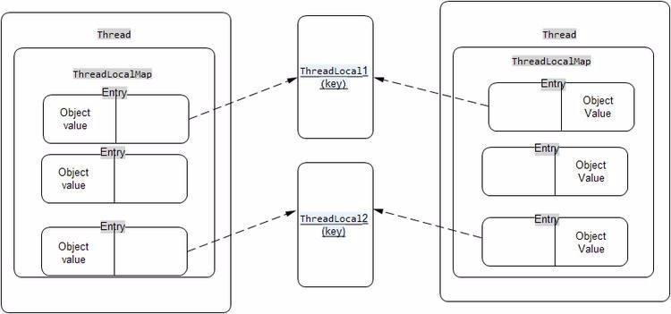
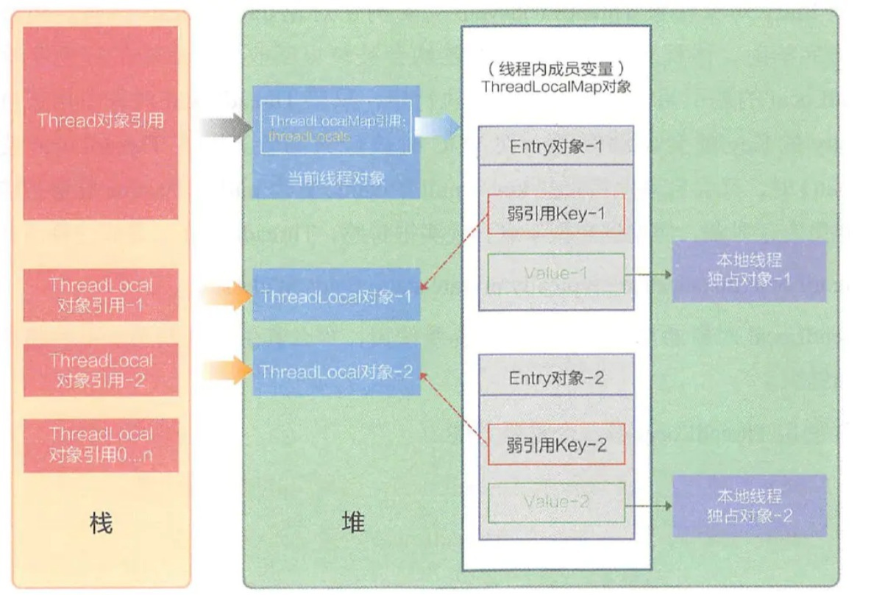
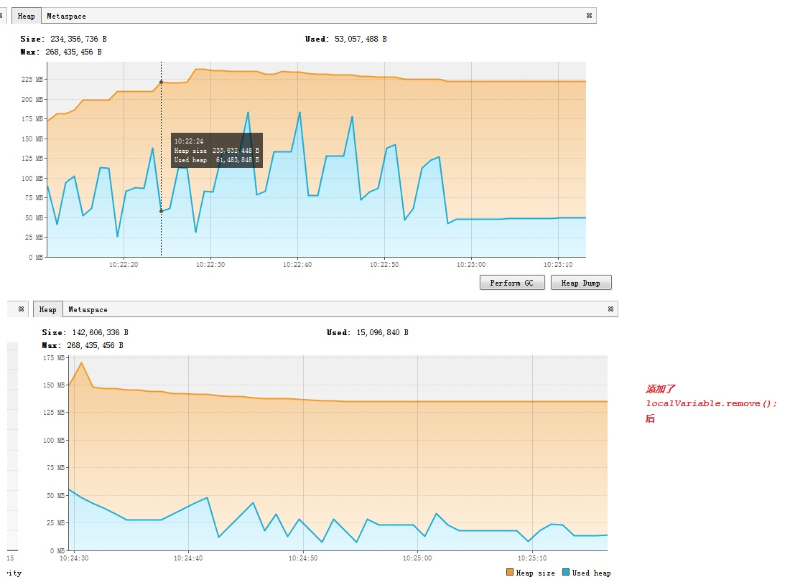
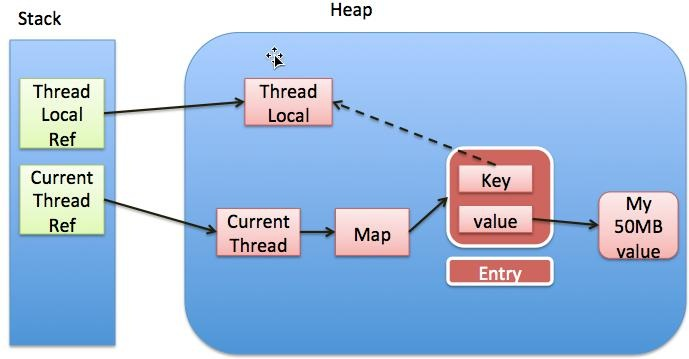
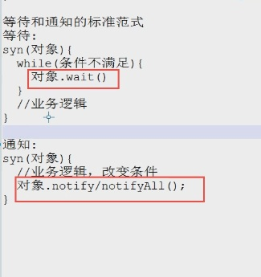

# 3. 线程间的共享和协作

## 3.1 synchronized 内置锁

:::tip 阿里巴巴java开发手册
高并发时，同步调用应该去考量锁的性能损耗。能用无锁数据结构，就不要用锁；能锁区块，就不要锁整个方法体；能用对象锁，就不要用类锁。

说明：尽可能使加锁的代码块工作量尽可能的小，避免在锁代码块中调用 RPC 方法。
:::

### 3.1.1 对象锁和类锁
对象锁是用于对象实例方法，或者一个对象实例上的   
类锁是用于类的静态方法或者一个类的class对象上的   

我们知道类的对象实例可以有很多个，但是每个类只有一个class对象，所以不同对象实例的对象锁是互不干扰的

**不同对象实例的对象锁是互不干扰的**
```java
import cn.tqk.tools.SleepTools;

/**
 *类说明：锁的实例不一样，也是可以并行的
 */
public class DiffInstance {
	
    private static class InstanceSyn implements Runnable{
        private DiffInstance diffInstance;

        public InstanceSyn(DiffInstance diffInstance) {
            this.diffInstance = diffInstance;
        }

        @Override
        public void run() {
            System.out.println("TestInstance is running..."+ diffInstance);
            diffInstance.instance();
        }
    }

    private static class Instance2Syn implements Runnable{
        private DiffInstance diffInstance;

        public Instance2Syn(DiffInstance diffInstance) {
            this.diffInstance = diffInstance;
        }
        @Override
        public void run() {
            System.out.println("TestInstance2 is running..."+ diffInstance);
            diffInstance.instance2();
        }
    }

    private synchronized void instance(){
        SleepTools.second(3);
        System.out.println("synInstance is going..."+this.toString());
        SleepTools.second(3);
        System.out.println("synInstance ended "+this.toString());
    }

    private synchronized void instance2(){
        SleepTools.second(3);
        System.out.println("synInstance2 is going..."+this.toString());
        SleepTools.second(3);
        System.out.println("synInstance2 ended "+this.toString());
    }

    public static void main(String[] args) {
        //对不同的对象上锁
        DiffInstance instance1 = new DiffInstance();
        Thread t3 = new Thread(new Instance2Syn(instance1));
        DiffInstance instance2 = new DiffInstance();
        Thread t4 = new Thread(new InstanceSyn(instance2));
        t3.start();
        t4.start();
        SleepTools.second(1);
    }
}
```
但是每个类只有一个类锁,有一点必须注意的是，其实类锁只是一个概念上的东西，并不是真实存在的，类锁其实锁的是每个类的对应的class对象。

**类锁和对象锁之间也是互不干扰的**
```java
import cn.tqk.tools.SleepTools;

/**
 *类说明：演示实例锁和类锁是不同的，两者可以并行
 */
public class InstanceAndClass {
	
    private static class SynClass extends Thread{
        @Override
        public void run() {
            System.out.println("TestClass is running...");
            synClass();
        }
    }

    private static class InstanceSyn implements Runnable{
        private InstanceAndClass SynClassAndInstance;

        public InstanceSyn(InstanceAndClass SynClassAndInstance) {
            this.SynClassAndInstance = SynClassAndInstance;
        }

        @Override
        public void run() {
            System.out.println("TestInstance is running..."+SynClassAndInstance);
            SynClassAndInstance.instance();
        }
    }

    private synchronized void instance(){
        SleepTools.second(1);
        System.out.println("synInstance is going..."+this.toString());
        SleepTools.second(1);
        System.out.println("synInstance ended "+this.toString());
    }

    private static synchronized void synClass(){
        SleepTools.second(1);
        System.out.println("synClass going...");
        SleepTools.second(1);
        System.out.println("synClass end");
    }

    public static void main(String[] args) {
        InstanceAndClass synClassAndInstance = new InstanceAndClass();
        Thread t1 = new SynClass();
        Thread t2 = new Thread(new InstanceSyn(synClassAndInstance));
        t2.start();
        SleepTools.second(1);
        t1.start();
    }
}
```
**类锁和锁static变量也是不同的**

```java
import cn.tqk.tools.SleepTools;

/**
 *类说明：类锁和锁static变量也是不同的
 */
public class StaticAndClass {
	
    private static class SynClass extends Thread{
        @Override
        public void run() {
            System.out.println(currentThread().getName()
                    +":SynClass is running...");
            synClass();
        }
    }

    private static class SynStatic extends Thread{
        @Override
        public void run() {
            System.out.println(currentThread().getName()
                    +"SynStatic is running...");
            synStatic();
        }
    }

    private static synchronized void synClass(){
        System.out.println(Thread.currentThread().getName()
                +"synClass going...");
        SleepTools.second(1);
        System.out.println(Thread.currentThread().getName()
                +"synClass end");
    }

    private static Object obj = new Object();
    private static void synStatic(){
        synchronized (obj){
            System.out.println(Thread.currentThread().getName()
                    +"synStatic going...");
            SleepTools.second(1);
            System.out.println(Thread.currentThread().getName()
                    +"synStatic end");
        }
    }

    public static void main(String[] args) {
        StaticAndClass synClassAndInstance = new StaticAndClass();
        Thread t1 = new SynClass();
        Thread t2 = new SynStatic();
//        Thread t2 = new SynClass();
        t2.start();
        SleepTools.second(1);
        t1.start();
    }
}
```

### 3.1.2 volatile最轻量的同步机制

:::tip volatile关键字作用 
1. 保证被volatile修饰的共享变量对所有线程总数可见的，也就是当一个线程修改了一个被volatile修饰共享变量的值，新值总是可以被其他线程立即得知。  

2. 禁止指令重排序优化  
:::

volatile 解决多线程内存不可见问题。对于一写多读，是可以解决变量同步问题

但是如果多写，同样无法解决线程安全问题。如果是count++ 操作，使用如下类实现：
```java
AtomicInteger count = new AtomicInteger(); count.addAndGet(1); 
```
如果是JDK8，推荐使用 LongAdder 对象，比 AtomicLong 性能更好（减少乐观锁的重试次数）。

**不加volatile时，子线程无法感知主线程修改了ready的值，从而不会退出循环， 而加了volatile 后，子线程可以感知主线程修改了ready的值，迅速退出循环** 

```java
/**
 * 类说明：演示Volatile的提供的可见性
 */
public class VolatileCase {
    private  volatile  static boolean ready;
    private static int number;

    private static class PrintThread extends Thread{
        @Override
        public void run() {
            System.out.println("PrintThread is running.......");
            while(!ready);
            System.out.println("number = "+number);
        }
    }

    public static void main(String[] args) {
        new PrintThread().start();
        SleepTools.second(1);
        number = 51;
        ready = true;
        SleepTools.second(5);
        System.out.println("main is ended!");
    }
}
```

**但是volatile不能保证数据在多个线程下同时写时的线程安全**

```java
public class NotSafe {
    private volatile long count =0;

    public long getCount() {
        return count;
    }

    public void setCount(long count) {
        this.count = count;
    }

    //count进行累加
    public void incCount(){
        count++;
    }

    //线程
    private static class Count extends Thread{

        private NotSafe simplOper;

        public Count(NotSafe simplOper) {
            this.simplOper = simplOper;
        }

        @Override
        public void run() {
            for(int i=0;i<10000;i++){
                simplOper.incCount();
            }
        }
    }

    public static void main(String[] args) throws InterruptedException {
        NotSafe simplOper = new NotSafe();
        //启动两个线程
        Count count1 = new Count(simplOper);
        Count count2 = new Count(simplOper);
        count1.start();
        count2.start();
        Thread.sleep(50);
        System.out.println(simplOper.count);
    }

```

### 3.1.3 错误的加锁和原因分析

**锁包装类、锁的对象不同，都会造成加锁失败**

```java
package com.tqk.ex1.syn;

/**
 * 类说明：错误的加锁和原因分析
 */
public class TestIntegerSyn {

    public static void main(String[] args) throws InterruptedException {
        Worker worker=new Worker(1);
        //Thread.sleep(50);
        for(int i=0;i<5;i++) {
            new Thread(worker).start();
        }
    }

    private static class Worker implements Runnable{

        private Integer i;

        public Worker(Integer i) {
            this.i=i;
        }

        @Override
        public void run() {
            synchronized (i) {
                Thread thread=Thread.currentThread();
                System.out.println(thread.getName()+"--@"+System.identityHashCode(i));
                i++;
                System.out.println(thread.getName()+"-------"+i+"-@"+System.identityHashCode(i));
                try {
                    Thread.sleep(3000);
                } catch (InterruptedException e) {
                    e.printStackTrace();
                }
                System.out.println(thread.getName()+"-------"+i+"--@"+System.identityHashCode(i));
            }

        }

    }

}
```

## 3.2 ThreadLocal

:::tip ThreadLocal特性
ThreadLocal和Synchronized都是为了解决多线程中相同变量的访问冲突问题，不同的点是Synchronized是通过线程等待，牺牲时间来解决访问冲突  

1. ThreadLocal是通过每个线程单独一份存储空间，牺牲空间来解决冲突  
2. 相比于Synchronized，ThreadLocal具有线程隔离的效果，只有在线程内才能获取到对应的值，线程外则不能访问到想要的值  
:::

**ThreadLocal每个线程单独一份存储空间**

```java
package com.tqk.ex1.threadlocal;
/**
 *类说明：ThreadLocal 的使用
 */
public class UseThreadLocal {
    public static ThreadLocal<Integer> threadLocal=new ThreadLocal<Integer>(){
        @Override
        protected Integer initialValue() {
            return 1;
        }
    };
	//TODO
    /**
     * 运行3个线程
     */
    public void StartThreadArray(){
        Thread[] runs = new Thread[3];
        for(int i=0;i<runs.length;i++){
            runs[i]=new Thread(new TestThread(i));
        }
        for(int i=0;i<runs.length;i++){
            runs[i].start();
        }
    }
    
    /**
     *类说明：测试线程，线程的工作是将ThreadLocal变量的值变化，并写回，看看线程之间是否会互相影响
     */
    public static class TestThread implements Runnable{
        int id;
        public TestThread(int id){
            this.id = id;
        }
        @Override
        public void run() {
            System.out.println(Thread.currentThread().getName()+":start");
            //TODO
            Integer s= threadLocal.get()+id;
            threadLocal.set(s);
            System.out.println(Thread.currentThread().getName()+":"
                    +threadLocal.get());
        }
    }

    public static void main(String[] args){
    	UseThreadLocal test = new UseThreadLocal();
        test.StartThreadArray();
    }
}
```

### 3.2.1 ThreadLocal 的使用 

:::tip ThreadLocal 类接口
• <font color='red'><strong>void set(Object value)</strong></font> 设置当前线程的线程局部变量的值。   
• <font color='red'><strong>public Object get()</strong></font> 该方法返回当前线程所对应的线程局部变量。   
• <font color='red'><strong>public void remove()</strong></font> 将当前线程局部变量的值删除，目的是为了减少内存的占用，该方法是 JDK 5.0 新增的方法。需要指出的是当线程结束后，对应该线程的局部变量将自动被垃圾回收，所以显式调用该方法清除线程的局部变量并不是必须的操作，但它可以加快内存回收的速度。   
• <font color='red'><strong>protected Object initialValue()</strong></font> 返回该线程局部变量的初始值，该方法是一个 protected 的方法，显然是为了让子类覆盖而设计的。这个方法是一个延迟调用方法，在线程第 1 次调用 get() 或 set(Object)时才执行，并且仅执行 1 次。ThreadLocal 中的缺省实现直接返回一 个 null。  

**示例**   
<font color='red'><strong>public final static ThreadLocal&lt;String&gt; RESOURCE = new ThreadLocal&lt;String&gt;()</strong></font>    

RESOURCE代表一个能够存放String类型的ThreadLocal对象。 此时不论什么一个线程能够并发访问这个变量，对它进行写入、读取操作，都是 线程安全的。  
:::

### 3.2.2 ThreadLocal实现解析

<a data-fancybox title="ThreadLocal实现解析" href="./image/threadlocal1.jpg"></a>

ThreadLocal即线程本地变量。它用来为每个线程维护一个专属的变量副本，线程对自己的变量副本进行操作时，对其他线程的变量副本没有任何影响。由此可见，它特别适合解决并发情况下变量共享造成的线程安全性问题，前提是各个副本隔离后不影响业务运行

**在Thread类内部，有如下的定义**  
```java
    /* ThreadLocal values pertaining to this thread. This map is maintained
     * by the ThreadLocal class. */
    ThreadLocal.ThreadLocalMap threadLocals = null;
````

可见每个线程都维护了一个叫ThreadLocalMap的东西，它是ThreadLocal中定义的一个静态内部类。其实现类似于HashMap，但没实现Map接口，数据结构和内部逻辑也有不同。


**ThreadLocalMap中Entry是这样定义的**

```java

/**
    * The entries in this hash map extend WeakReference, using
    * its main ref field as the key (which is always a
    * ThreadLocal object).  Note that null keys (i.e. entry.get()
    * == null) mean that the key is no longer referenced, so the
    * entry can be expunged from table.  Such entries are referred to
    * as "stale entries" in the code that follows.
    */
static class Entry extends WeakReference<ThreadLocal<?>> {
    /** The value associated with this ThreadLocal. */
    Object value;

    Entry(ThreadLocal<?> k, Object v) {
        super(k);
        value = v;
    }
}
```
该Entry的键值类型都是确定的。值就是变量的副本，键是对ThreadLocal对象的一个弱引用。由于线程并不能直接访问和存取ThreadLocalMap，只能由ThreadLocal进行，因此不同的线程之间的变量副本就实现了隔离。  
可以看到有个 Entry 内部静态类，它继承了WeakReference，总之它记录了两个信息，一个是**ThreadLocal<?>类型**，一个**Object类型**的值。  
getEntry 方法 则是获取某个 ThreadLocal 对应的值，  
set 方法就是更新或赋值相应的 ThreadLocal 对应的值。  
<a data-fancybox title="ThreadLocal实现解析" href="./image/threadlocal.jpg"></a>

### 3.2.2.1 ThreadLocal.get方法
```java

    /**
     * Returns the value in the current thread's copy of this
     * thread-local variable.  If the variable has no value for the
     * current thread, it is first initialized to the value returned
     * by an invocation of the {@link #initialValue} method.
     *
     * @return the current thread's value of this thread-local
        返回此线程局部变量的当前线程副本中的值。 如果该变量对于当前线程没有值，则首先将其初始化为调用initialValue方法返回的值。
        返回：
        此线程本地的当前线程的值
     */
    public T get() {
        Thread t = Thread.currentThread();
        ThreadLocalMap map = getMap(t);
        if (map != null) {
            ThreadLocalMap.Entry e = map.getEntry(this);
            if (e != null) {
                @SuppressWarnings("unchecked")
                T result = (T)e.value;
                return result;
            }
        }
        return setInitialValue();
    }

    /**
     * Get the map associated with a ThreadLocal. Overridden in
     * InheritableThreadLocal.
     *
     * @param  t the current thread
     * @return the map
     获取与 ThreadLocal 关联的映射。 在 InheritableThreadLocal 中重写。
        参数：
        t – 当前线程
        返回：地图
     */
    ThreadLocalMap getMap(Thread t) {
        return t.threadLocals;
    }

    /**
     * Variant of set() to establish initialValue. Used instead
     * of set() in case user has overridden the set() method.
     *
     * @return the initial value
    用于建立初始值的 set() 变体。 如果用户覆盖了 set() 方法，则代替 set() 使用。
    返回：初始值
     */
    private T setInitialValue() {
        T value = initialValue();
        Thread t = Thread.currentThread();
        ThreadLocalMap map = getMap(t);
        if (map != null)
            map.set(this, value);
        else
            createMap(t, value);
        return value;
    }
````
上面先取到当前线程，然后调用 getMap 方法获取对应的 ThreadLocalMap， ThreadLocalMap 是 ThreadLocal 的静态内部类，然后 Thread 类中有一个这样类型 成员，所以 getMap 是直接返回 Thread 的成员。

```java
        static class Entry extends WeakReference<ThreadLocal<?>> {
            /** The value associated with this ThreadLocal. */
            Object value;

            Entry(ThreadLocal<?> k, Object v) {
                super(k);
                value = v;
            }
        }
    /**
        * Get the entry associated with key.  This method
        * itself handles only the fast path: a direct hit of existing
        * key. It otherwise relays to getEntryAfterMiss.  This is
        * designed to maximize performance for direct hits, in part
        * by making this method readily inlinable.
        *
        * @param  key the thread local object
        * @return the entry associated with key, or null if no such
        获取与密钥关联的条目。 此方法本身仅处理快速路径：直接点击现有密钥。 否则它会中继到 getEntryAfterMiss。 这旨在最大限度地提高直接命中的性能，部分原因是使该方法易于内联。
        参数：
        key – 线程本地对象
        返回：
        与 key 关联的条目，如果没有，则为 null
        */
    private Entry getEntry(ThreadLocal<?> key) {
        int i = key.threadLocalHashCode & (table.length - 1);
        Entry e = table[i];
        if (e != null && e.get() == key)
            return e;
        else
            return getEntryAfterMiss(key, i, e);
    }  
```
可以看到有个 Entry 内部静态类，它继承了 WeakReference，总之它记录了 两个信息，一个是 ThreadLocal<?>类型，一个是 Object 类型的值。getEntry 方法 则是获取某个 ThreadLocal 对应的值，set 方法就是更新或赋值相应的 ThreadLocal 对应的值。

ThreadLocal的 get 方法，<font color='red'><strong>其实就是拿到每个线程独有的 ThreadLocalMap</strong></font> 。然后再用 ThreadLocal 的当前实例，拿到 Map 中的相应的 Entry，然后就可以拿到相应的值返回出去。当然如果 Map 为空，还会先进行 map 的创建，初始化等工作。


### 3.2.3 Threadlocal引发的内存泄漏分析

```java
package com.tqk.ex1.threadlocal;

import java.util.concurrent.LinkedBlockingQueue;
import java.util.concurrent.ThreadPoolExecutor;
import java.util.concurrent.TimeUnit;

/**
 * 类说明：ThreadLocal造成的内存泄漏演示
 * -Xmx256m
 */
public class ThreadLocalOOM {
    private static final int TASK_LOOP_SIZE = 500;

    final static ThreadPoolExecutor poolExecutor
            = new ThreadPoolExecutor(5, 5, 1,
            TimeUnit.MINUTES,
            new LinkedBlockingQueue<>());

    static class LocalVariable {
        private byte[] a = new byte[1024*1024*5];/*5M大小的数组*/
    }

    final static ThreadLocal<LocalVariable> localVariable
            = new ThreadLocal<>();

    public static void main(String[] args) throws InterruptedException {
        for (int i = 0; i < TASK_LOOP_SIZE; ++i) {
            poolExecutor.execute(new Runnable() {
                @Override
                public void run() {
                    LocalVariable lb=new LocalVariable();
                    localVariable.set(lb);
                    System.out.println("use local varaible");
                    localVariable.remove();
                }
            });

            Thread.sleep(100);
        }
        System.out.println("pool execute over");
    }

}
```
<a data-fancybox title="引发的内存泄漏分析" href="./image/threadlocaloom1.jpg"></a>

根据我们前面对 ThreadLocal 的分析，我们可以知道每个 Thread 维护一个 ThreadLocalMap，这个映射表的 key 是 ThreadLocal 实例本身，value 是真正需 要存储的 Object，也就是说 ThreadLocal 本身并不存储值，它只是作为一个 key 来让线程从 ThreadLocalMap 获取 value。仔细观察 ThreadLocalMap，这个 map 是使用 ThreadLocal 的弱引用作为 Key 的，弱引用的对象在 GC 时会被回收。 因此使用了 ThreadLocal 后，引用链如图所示

<a data-fancybox title="引发的内存泄漏分析" href="./image/threadlocaloom.jpg"></a>
这样，当把 threadlocal 变量置为 null 以后，没有任何强引用指向 threadlocal 实例，所以 threadlocal 将会被 gc 回收。
这样一来，ThreadLocalMap 中就会出现key 为 null 的 Entry，就没有办法访问这些 key 为 null 的 Entry 的 value，

如果当前线程再迟迟不结束的话，这些 key 为 null 的 Entry 的 value 就会一直存在一条强引用链：Thread Ref -> Thread -> ThreaLocalMap -> Entry -> value，而这块 value 永远不会被访问到了，所以存在着内存泄露。

只有当前 thread 结束以后，current thread 就不会存在栈中，强引用断开， Current Thread、Map value 将全部被 GC 回收。最好的做法是不在需要使用 ThreadLocal 变量后，都调用它的<font color='red'><strong> remove()方法</strong></font>，清除数据。

<font color='red'><strong>key 使用强引用</strong></font>：对 ThreadLocal 对象实例的引用被置为 null 了，但是 ThreadLocalMap 还持有这个 ThreadLocal 对象实例的强引用，如果没有手动删除， ThreadLocal 的对象实例不会被回收，导致 Entry 内存泄漏。 

<font color='red'><strong>key 使用弱引用</strong></font>：对 ThreadLocal 对象实例的引用被被置为 null 了，由于 ThreadLocalMap 持有 ThreadLocal 的弱引用，即使没有手动删除，ThreadLocal 的 对象实例也会被回收。value 在下一次 ThreadLocalMap 调用 set，get，remove 都 有机会被回收。
 
比较两种情况，我们可以发现：由于 ThreadLocalMap 的生命周期跟 Thread 一样长，如果都没有手动删除对应 key，都会导致内存泄漏，但是使用弱引用可以多一层保障。 因此ThreadLocal 内存泄漏的根源是：由于 ThreadLocalMap 的生命周期跟 Thread 一样长，如果没有手动删除对应 key 就会导致内存泄漏，而不是因为弱引用。

<font color='red'><strong>总结 </strong></font>  
JVM 利用设置 ThreadLocalMap 的 Key 为弱引用，来避免内存泄露。   
JVM 利用调用 remove、get、set 方法的时候，回收弱引用。   
当 ThreadLocal 存储很多 Key 为 null 的 Entry 的时候，而不再去调用 remove、 get、set 方法，那么将导致内存泄漏。   
使用线程池+ThreadLocal 时要小心，因为这种情况下，线程是一直在不断的 重复运行的，从而也就造成了 value 可能造成累积的情况  

### 3.2.4 ThreadLocal 导致线程不安全

```java
package com.tqk.ex1.threadlocal;


import cn.tqk.tools.SleepTools;

/**
 * 类说明：ThreadLocal的线程不安全演示
 */
public class ThreadLocalUnsafe implements Runnable {

    public static Number number = new Number(0);

    @Override
    public void run() {
        //每个线程计数加一
        //要正常的工作，应该的用法是让每个线程中的 ThreadLocal 都 应该持有一个新的 Number 对象
//        Number number = new Number(0);

        number.setNum(number.getNum()+1);
      //将其存储到ThreadLocal中
        value.set(number);
        SleepTools.ms(2);
        //输出num值
        System.out.println(Thread.currentThread().getName()+"="+value.get().getNum());
    }

    public static ThreadLocal<Number> value = new ThreadLocal<Number>() {
    };

    public static void main(String[] args) {
        for (int i = 0; i < 5; i++) {
            new Thread(new ThreadLocalUnsafe()).start();
        }
    }

    private static class Number {
        public Number(int num) {
            this.num = num;
        }

        private int num;

        public int getNum() {
            return num;
        }

        public void setNum(int num) {
            this.num = num;
        }

        @Override
        public String toString() {
            return "Number [num=" + num + "]";
        }
    }

}

//输出结果
Thread-0=2
Thread-1=2
Thread-3=5
Thread-4=5
Thread-2=5
```
为什么每个线程都是输出小于等于5？难道他们没有独自保存自己的 Number 副本吗？ 为什么其他线程还是能够修改这个值？
仔细考察 ThreadLocal 和 Thead 的代码， 我们发现 ThreadLocalMap 中保存的其实是对象的一个引用，这样的话，当有其 他线程对这个引用指向的对象实例做修改时，其实也同时影响了所有的线程持有 的对象引用所指向的同一个对象实例。

这也就是为什么上面的程序为什么会输出 一样的结果：5 个线程中保存的是同一 Number 对象的引用，在线程睡眠的时候， 其他线程将 num 变量进行了修改，而修改的对象 Number 的实例是同一份，因此它们最终输出的结果是相同的。 

<font color='red'><strong>上面的程序要正常的工作，应该的用法是让每个线程中的 ThreadLocal 都 应该持有一个新的 Number 对象</strong></font> 

## 3.3 等待/通知机制

是指一个线程 A 调用了对象 O 的 wait()方法进入等待状态，而另一个线程 B 调用了对象 O 的 notify()或者 notifyAll()方法，线程 A 收到通知后从对象 O 的 wait() 方法返回，进而执行后续操作。上述两个线程通过对象 O 来完成交互，而对象 上的 wait()和 notify/notifyAll()的关系就如同开关信号一样，用来完成等待方和通 知方之间的交互工作。

<font color='red'><strong>notify()</strong></font> ： 通知一个在对象上等待的线程,使其从 wait 方法返回,而<font color='red'><strong>返回的前提是该线程获取到了对象的锁</strong></font>，没有获得锁的线程重新进入 WAITING 状态    
<font color='red'><strong>notifyAll()</strong></font> ： 通知所有等待在该对象上的线程   
<font color='red'><strong>wait()</strong></font>  调用该方法的线程进入 WAITING 状态,只有等待另外线程的通知或被中断才会返回    
需要注意,调用 wait()方法后,会释放对象的锁 wait(long) 超时等待一段时间,这里的参数时间是毫秒,也就是等待长达n毫秒,如果没有通知就超时返回 wait (long,int) 对于超时时间更细粒度的控制,可以达到纳秒

<a data-fancybox title="引发的内存泄等待/通知机制漏分析" href="./image/waitnotify.jpg"></a>


**调用 yield() 、sleep()、wait()、notify()等方法对锁有何影响？**  
yield() 、sleep()被调用后，都不会释放当前线程所持有的锁。   
调用 wait()方法后，会释放当前线程持有的锁，而且当前被唤醒后，会重新 去竞争锁，锁竞争到后才会执行 wait 方法后面的代码。   
调用 notify()系列方法后，对锁无影响，线程只有在 syn 同步代码执行完后才 会自然而然的释放锁，所以 notify()系列方法一般都是 syn 同步代码的最后一行。  


notify 和 notifyAll 应该用谁?  
尽可能用 notifyall()，谨慎使用 notify()，因为 notify()只会唤醒一个线程，我们无法确保被唤醒的这个线程一定就是我们需要唤醒的线程

### 3.3.1 等待超时模式实现一个连接池


```java

import java.sql.Connection;
import java.util.LinkedList;

/**
 *类说明：连接池的实现
 */
public class DBPool {

    /*容器，存放连接*/
    private static LinkedList<Connection> pool = new LinkedList<Connection>();

    /*限制了池的大小=20*/
    public DBPool(int initialSize) {
        if (initialSize > 0) {
            for (int i = 0; i < initialSize; i++) {
                pool.addLast(SqlConnectImpl.fetchConnection());
            }
        }
    }

    /*释放连接,通知其他的等待连接的线程*/
    public void releaseConnection(Connection connection) {
        if (connection != null) {
            synchronized (pool){
                pool.addLast(connection);
                //通知其他等待连接的线程
                pool.notifyAll();
            }
        }
    }

    /*获取*/
    // 在mills内无法获取到连接，将会返回null 1S
    public Connection fetchConnection(long mills)
            throws InterruptedException {
        synchronized (pool){
            //永不超时
            if(mills<=0){
                //资源池为空时，进行等待
                while(pool.isEmpty()){
                    pool.wait();
                }
                return pool.removeFirst();
            }else{
                /*超时时刻*/
                long future = System.currentTimeMillis()+mills;
                /*等待时长*/
                long remaining = mills;
                //资源池为空，并且等待时间大于0，继续等待
                while(pool.isEmpty()&&remaining>0){
                    pool.wait(remaining);
                    /*唤醒一次，重新计算等待时长*/
                    remaining = future-System.currentTimeMillis();
                }
                Connection connection = null;
                if(!pool.isEmpty()){
                    connection = pool.removeFirst();
                }
                return connection;
            }
        }

    }
}

```

```java
import java.sql.Connection;
import java.util.concurrent.CountDownLatch;
import java.util.concurrent.atomic.AtomicInteger;

/**
 *类说明：
 */
public class DBPoolTest {
    static DBPool pool  = new DBPool(10);
    // 控制器:控制main线程将会等待所有Woker结束后才能继续执行
    static CountDownLatch end;

    public static void main(String[] args) throws Exception {
    	// 线程数量
        int threadCount = 50;
        end = new CountDownLatch(threadCount);
        //每个线程的操作次数
        int count = 20;
        //计数器：统计可以拿到连接的线程
        AtomicInteger got = new AtomicInteger();
        //计数器：统计没有拿到连接的线程
        AtomicInteger notGot = new AtomicInteger();

        for (int i = 0; i < threadCount; i++) {
            Thread thread = new Thread(new Worker(count, got, notGot), 
            		"worker_"+i);
            thread.start();
        }
        end.await();// main线程在此处等待
        System.out.println("总共尝试了: " + (threadCount * count));
        System.out.println("拿到连接的次数：  " + got);
        System.out.println("没能连接的次数： " + notGot);
    }

    static class Worker implements Runnable {
        int           count;
        AtomicInteger got;
        AtomicInteger notGot;

        public Worker(int count, AtomicInteger got,
                               AtomicInteger notGot) {
            this.count = count;
            this.got = got;
            this.notGot = notGot;
        }

        @Override
        public void run() {
            while (count > 0) {
                try {
                    // 从线程池中获取连接，如果1000ms内无法获取到，将会返回null
                    // 分别统计连接获取的数量got和未获取到的数量notGot
                    Connection connection = pool.fetchConnection(1000);
                    if (connection != null) {
                        try {
                            connection.createStatement();
//                            PreparedStatement preparedStatement
//                                    = connection.prepareStatement("");
//                            preparedStatement.execute();
                            connection.commit();
                        } finally {
                            pool.releaseConnection(connection);
                            got.incrementAndGet();
                        }
                    } else {
                        notGot.incrementAndGet();
                        System.out.println(Thread.currentThread().getName()
                        		+"等待超时!");
                    }
                } catch (Exception ex) {
                } finally {
                    count--;
                }
            }
            end.countDown();
        }
    }
}
```

```java
package com.tqk.ex1.dbpool;


import cn.tqk.tools.SleepTools;

import java.sql.*;
import java.util.Map;
import java.util.Properties;
import java.util.concurrent.Executor;

/**
 *类说明：
 */
public class SqlConnectImpl implements Connection{
	
	/*拿一个数据库连接*/
    public static final Connection fetchConnection(){
        return new SqlConnectImpl();
    }

	@Override
	public boolean isWrapperFor(Class<?> arg0) throws SQLException {
		// TODO Auto-generated method stub
		return false;
	}

	@Override
	public <T> T unwrap(Class<T> arg0) throws SQLException {
		// TODO Auto-generated method stub
		return null;
	}

	@Override
	public void abort(Executor arg0) throws SQLException {
		// TODO Auto-generated method stub
		
	}

	@Override
	public void clearWarnings() throws SQLException {
		// TODO Auto-generated method stub
		
	}

	@Override
	public void close() throws SQLException {
		// TODO Auto-generated method stub
		
	}

	@Override
	public void commit() throws SQLException {
		SleepTools.ms(70);
	}

	@Override
	public Array createArrayOf(String arg0, Object[] arg1) throws SQLException {
		// TODO Auto-generated method stub
		return null;
	}

	@Override
	public Blob createBlob() throws SQLException {
		// TODO Auto-generated method stub
		return null;
	}

	@Override
	public Clob createClob() throws SQLException {
		// TODO Auto-generated method stub
		return null;
	}

	@Override
	public NClob createNClob() throws SQLException {
		// TODO Auto-generated method stub
		return null;
	}

	@Override
	public SQLXML createSQLXML() throws SQLException {
		// TODO Auto-generated method stub
		return null;
	}

	@Override
	public Statement createStatement() throws SQLException {
		SleepTools.ms(1);
		return null;
	}

	@Override
	public Statement createStatement(int arg0, int arg1) throws SQLException {
		// TODO Auto-generated method stub
		return null;
	}

	@Override
	public Statement createStatement(int arg0, int arg1, int arg2) throws SQLException {
		// TODO Auto-generated method stub
		return null;
	}

	@Override
	public Struct createStruct(String arg0, Object[] arg1) throws SQLException {
		// TODO Auto-generated method stub
		return null;
	}

	@Override
	public boolean getAutoCommit() throws SQLException {
		// TODO Auto-generated method stub
		return false;
	}

	@Override
	public String getCatalog() throws SQLException {
		// TODO Auto-generated method stub
		return null;
	}

	@Override
	public Properties getClientInfo() throws SQLException {
		// TODO Auto-generated method stub
		return null;
	}

	@Override
	public String getClientInfo(String arg0) throws SQLException {
		// TODO Auto-generated method stub
		return null;
	}

	@Override
	public int getHoldability() throws SQLException {
		// TODO Auto-generated method stub
		return 0;
	}

	@Override
	public DatabaseMetaData getMetaData() throws SQLException {
		// TODO Auto-generated method stub
		return null;
	}

	@Override
	public int getNetworkTimeout() throws SQLException {
		// TODO Auto-generated method stub
		return 0;
	}

	@Override
	public String getSchema() throws SQLException {
		// TODO Auto-generated method stub
		return null;
	}

	@Override
	public int getTransactionIsolation() throws SQLException {
		// TODO Auto-generated method stub
		return 0;
	}

	@Override
	public Map<String, Class<?>> getTypeMap() throws SQLException {
		// TODO Auto-generated method stub
		return null;
	}

	@Override
	public SQLWarning getWarnings() throws SQLException {
		// TODO Auto-generated method stub
		return null;
	}

	@Override
	public boolean isClosed() throws SQLException {
		// TODO Auto-generated method stub
		return false;
	}

	@Override
	public boolean isReadOnly() throws SQLException {
		// TODO Auto-generated method stub
		return false;
	}

	@Override
	public boolean isValid(int arg0) throws SQLException {
		// TODO Auto-generated method stub
		return false;
	}

	@Override
	public String nativeSQL(String arg0) throws SQLException {
		// TODO Auto-generated method stub
		return null;
	}

	@Override
	public CallableStatement prepareCall(String arg0) throws SQLException {
		// TODO Auto-generated method stub
		return null;
	}

	@Override
	public CallableStatement prepareCall(String arg0, int arg1, int arg2) throws SQLException {
		// TODO Auto-generated method stub
		return null;
	}

	@Override
	public CallableStatement prepareCall(String arg0, int arg1, int arg2, int arg3) throws SQLException {
		// TODO Auto-generated method stub
		return null;
	}

	@Override
	public PreparedStatement prepareStatement(String arg0) throws SQLException {
		// TODO Auto-generated method stub
		return null;
	}

	@Override
	public PreparedStatement prepareStatement(String arg0, int arg1) throws SQLException {
		// TODO Auto-generated method stub
		return null;
	}

	@Override
	public PreparedStatement prepareStatement(String arg0, int[] arg1) throws SQLException {
		// TODO Auto-generated method stub
		return null;
	}

	@Override
	public PreparedStatement prepareStatement(String arg0, String[] arg1) throws SQLException {
		// TODO Auto-generated method stub
		return null;
	}

	@Override
	public PreparedStatement prepareStatement(String arg0, int arg1, int arg2) throws SQLException {
		// TODO Auto-generated method stub
		return null;
	}

	@Override
	public PreparedStatement prepareStatement(String arg0, int arg1, int arg2, int arg3) throws SQLException {
		// TODO Auto-generated method stub
		return null;
	}

	@Override
	public void releaseSavepoint(Savepoint arg0) throws SQLException {
		// TODO Auto-generated method stub
		
	}

	@Override
	public void rollback() throws SQLException {
		// TODO Auto-generated method stub
		
	}

	@Override
	public void rollback(Savepoint arg0) throws SQLException {
		// TODO Auto-generated method stub
		
	}

	@Override
	public void setAutoCommit(boolean arg0) throws SQLException {
		// TODO Auto-generated method stub
		
	}

	@Override
	public void setCatalog(String arg0) throws SQLException {
		// TODO Auto-generated method stub
		
	}

	@Override
	public void setClientInfo(Properties arg0) throws SQLClientInfoException {
		// TODO Auto-generated method stub
		
	}

	@Override
	public void setClientInfo(String arg0, String arg1) throws SQLClientInfoException {
		// TODO Auto-generated method stub
		
	}

	@Override
	public void setHoldability(int arg0) throws SQLException {
		// TODO Auto-generated method stub
		
	}

	@Override
	public void setNetworkTimeout(Executor arg0, int arg1) throws SQLException {
		// TODO Auto-generated method stub
		
	}

	@Override
	public void setReadOnly(boolean arg0) throws SQLException {
		// TODO Auto-generated method stub
		
	}

	@Override
	public Savepoint setSavepoint() throws SQLException {
		// TODO Auto-generated method stub
		return null;
	}

	@Override
	public Savepoint setSavepoint(String arg0) throws SQLException {
		// TODO Auto-generated method stub
		return null;
	}

	@Override
	public void setSchema(String arg0) throws SQLException {
		// TODO Auto-generated method stub
		
	}

	@Override
	public void setTransactionIsolation(int arg0) throws SQLException {
		// TODO Auto-generated method stub
		
	}

	@Override
	public void setTypeMap(Map<String, Class<?>> arg0) throws SQLException {
		// TODO Auto-generated method stub
		
	}
	
}
```