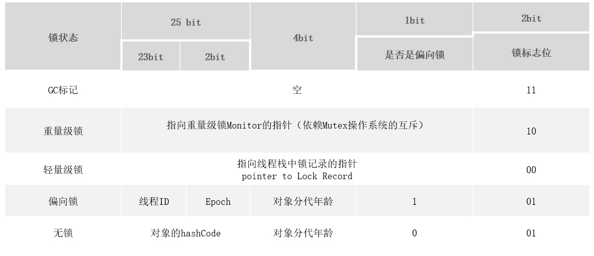

# 3. 线程间的共享和协作

[[toc]]
## 3.1 synchronized 内置锁

**synchronized内置锁是一种对象锁(锁的是对象而非引用)，作用粒度是对象，可以用来实现对临界资源的同步互斥访问，是可 重入的。**

:::tip 阿里巴巴java开发手册
高并发时，同步调用应该去考量锁的性能损耗。能用无锁数据结构，就不要用锁；能锁区块，就不要锁整个方法体；能用对象锁，就不要用类锁。

说明：尽可能使加锁的代码块工作量尽可能的小，避免在锁代码块中调用 RPC 方法。
:::

:::tip 加锁的方式
1、同步实例方法，锁是**当前实例对象**

2、同步类方法，锁是**当前类对象** 

3、同步代码块，锁是**括号里面的对象**
:::

### 3.1.1 对象锁和类锁

对象锁是用于对象实例方法，或者一个对象实例上的   
类锁是用于类的静态方法或者一个类的class对象上的   

我们知道类的对象实例可以有很多个，但是每个类只有一个class对象，所以不同对象实例的对象锁是互不干扰的

#### 不同对象实例的对象锁是互不干扰的

```java
import cn.tqk.tools.SleepTools;

/**
 *类说明：锁的实例不一样，也是可以并行的
 */
public class DiffInstance {
	
    private static class InstanceSyn implements Runnable{
        private DiffInstance diffInstance;

        public InstanceSyn(DiffInstance diffInstance) {
            this.diffInstance = diffInstance;
        }

        @Override
        public void run() {
            System.out.println("TestInstance is running..."+ diffInstance);
            diffInstance.instance();
        }
    }

    private static class Instance2Syn implements Runnable{
        private DiffInstance diffInstance;

        public Instance2Syn(DiffInstance diffInstance) {
            this.diffInstance = diffInstance;
        }
        @Override
        public void run() {
            System.out.println("TestInstance2 is running..."+ diffInstance);
            diffInstance.instance2();
        }
    }

    private synchronized void instance(){
        SleepTools.second(3);
        System.out.println("synInstance is going..."+this.toString());
        SleepTools.second(3);
        System.out.println("synInstance ended "+this.toString());
    }

    private synchronized void instance2(){
        SleepTools.second(3);
        System.out.println("synInstance2 is going..."+this.toString());
        SleepTools.second(3);
        System.out.println("synInstance2 ended "+this.toString());
    }

    public static void main(String[] args) {
        //对不同的对象上锁
        DiffInstance instance1 = new DiffInstance();
        Thread t3 = new Thread(new Instance2Syn(instance1));
        DiffInstance instance2 = new DiffInstance();
        Thread t4 = new Thread(new InstanceSyn(instance2));
        t3.start();
        t4.start();
        SleepTools.second(1);
    }
}
```
但是每个类只有一个类锁,有一点必须注意的是，其实类锁只是一个概念上的东西，并不是真实存在的，类锁其实锁的是每个类的对应的class对象。

#### 类锁和对象锁之间也是互不干扰的
```java
import cn.tqk.tools.SleepTools;

/**
 *类说明：演示实例锁和类锁是不同的，两者可以并行
 */
public class InstanceAndClass {
	
    private static class SynClass extends Thread{
        @Override
        public void run() {
            System.out.println("TestClass is running...");
            synClass();
        }
    }

    private static class InstanceSyn implements Runnable{
        private InstanceAndClass SynClassAndInstance;

        public InstanceSyn(InstanceAndClass SynClassAndInstance) {
            this.SynClassAndInstance = SynClassAndInstance;
        }

        @Override
        public void run() {
            System.out.println("TestInstance is running..."+SynClassAndInstance);
            SynClassAndInstance.instance();
        }
    }

    private synchronized void instance(){
        SleepTools.second(1);
        System.out.println("synInstance is going..."+this.toString());
        SleepTools.second(1);
        System.out.println("synInstance ended "+this.toString());
    }

    private static synchronized void synClass(){
        SleepTools.second(1);
        System.out.println("synClass going...");
        SleepTools.second(1);
        System.out.println("synClass end");
    }

    public static void main(String[] args) {
        InstanceAndClass synClassAndInstance = new InstanceAndClass();
        Thread t1 = new SynClass();
        Thread t2 = new Thread(new InstanceSyn(synClassAndInstance));
        t2.start();
        SleepTools.second(1);
        t1.start();
    }
}
```
#### 类锁和锁static变量也是不同的

```java
import cn.tqk.tools.SleepTools;

/**
 *类说明：类锁和锁static变量也是不同的
 */
public class StaticAndClass {
	
    private static class SynClass extends Thread{
        @Override
        public void run() {
            System.out.println(currentThread().getName()
                    +":SynClass is running...");
            synClass();
        }
    }

    private static class SynStatic extends Thread{
        @Override
        public void run() {
            System.out.println(currentThread().getName()
                    +"SynStatic is running...");
            synStatic();
        }
    }

    private static synchronized void synClass(){
        System.out.println(Thread.currentThread().getName()
                +"synClass going...");
        SleepTools.second(1);
        System.out.println(Thread.currentThread().getName()
                +"synClass end");
    }

    private static Object obj = new Object();
    private static void synStatic(){
        synchronized (obj){
            System.out.println(Thread.currentThread().getName()
                    +"synStatic going...");
            SleepTools.second(1);
            System.out.println(Thread.currentThread().getName()
                    +"synStatic end");
        }
    }

    public static void main(String[] args) {
        StaticAndClass synClassAndInstance = new StaticAndClass();
        Thread t1 = new SynClass();
        Thread t2 = new SynStatic();
//        Thread t2 = new SynClass();
        t2.start();
        SleepTools.second(1);
        t1.start();
    }
}
```

### 3.1.2 错误的加锁和原因分析

**锁包装类、锁的对象不同，都会造成加锁失败**

```java
package com.tqk.ex1.syn;

/**
 * 类说明：错误的加锁和原因分析
 */
public class TestIntegerSyn {

    public static void main(String[] args) throws InterruptedException {
        Worker worker=new Worker(0);
//        Thread.sleep(50);
        for(int i=0;i<5;i++) {
            new Thread(worker).start();
        }
    }

    private static class Worker implements Runnable{

        private Integer i;

        public Worker(Integer i) {
            this.i=i;
        }

        @Override
        public void run() {
            synchronized (i) {
                Thread thread=Thread.currentThread();
                System.out.println(thread.getName()+"---start----"+i+"--@"+System.identityHashCode(i));
                i++;
                System.out.println(thread.getName()+"---runing----"+i+"--@"+System.identityHashCode(i));
                try {
                    Thread.sleep(1000);
                } catch (InterruptedException e) {
                    e.printStackTrace();
                }
                System.out.println(thread.getName()+"---end----"+i+"--@"+System.identityHashCode(i));
            }

        }

    }

}

```
-------------------
```sh
Thread-0---start----0--@1700405589
Thread-0---runing----1--@1805501326
Thread-1---start----1--@1805501326
Thread-1---runing----2--@186668687
Thread-4---start----2--@186668687
Thread-4---runing----3--@1684444739
Thread-0---end----3--@1684444739
Thread-1---end----3--@1684444739
Thread-4---end----3--@1684444739
Thread-3---start----3--@1684444739
Thread-3---runing----4--@1770731361
Thread-3---end----4--@1770731361
Thread-2---start----4--@1770731361
Thread-2---runing----5--@903341402
Thread-2---end----5--@903341402
#结果可见假的所得对象是不一样的
```

原因：虽然我们对**i进行了加锁**，但是当我们反编译这个类的 class 文件后，可以看到 i++实际是 
本质上是返回了一个新的 Integer 对象。也就是每个线程实际加锁的是不同的 Integer 对象。 

## 3.2  synchronized底层原理 

**synchronized是基于JVM内置锁**实现，通过内部对象<font color='red'><strong>Monitor(监视器锁)</strong></font>实现，基于进入与退出Monitor对象实现方法与代码 块同步，监视器锁的实现依赖底层操作系统的Mutex lock（互斥锁）实现，它是一个重量级锁性能较低。<font color='red'><strong>当然JVM内置锁在1.5 之后版本做了重大的优化</strong></font>，如
**锁粗化（Lock Coarsening）、**
**锁消除（Lock Elimination）、**
**轻量级锁（Lightweight Locking）、**
**偏向锁（Biased Locking）、**
**适应性自旋（Adaptive Spinning）**等技术来减少锁操作的开销，内置锁的并发性能已经基本与 Lock持平。

synchronized关键字被编译成字节码后会被翻译成<font color='red'><strong>monitorenter 和 monitorexit</strong></font> 两条指令分别在同步块逻辑代码的起始位置与结束位置。
<a data-fancybox title="synchronized" href="./image/synchronized02.jpg"></a>
每个同步对象都有一个自己的Monitor(监视器锁)，加锁过程如下图所示：

<a data-fancybox title="synchronized" href="./image/synchronized03.jpg"></a>

### 3.2.1 Monitor监视器锁

**任何一个对象都有一个Monitor与之关联，当且一个Monitor被持有后，它将处于锁定状态。** Synchronized在JVM里的实现都是 **基于进入和退出Monitor对象来实现方法同步和代码块同步**，虽然具体实现细节不一样，但是都可以通过成对的MonitorEnter和MonitorExit指令来实现。

1. **monitorenter：**每个对象都是一个监视器锁（monitor）。当monitor被占用时就会处于锁定状态，线程执行 monitorenter指令时尝试获取monitor的所有权，过程如下： 

a. **如果monitor的进入数为0**，则该线程可以进入monitor，然后将进入数设置为1，该线程即为monitor 的所有者； 

b. **如果线程已经占有该monitor**，只是重新进入，则进入monitor的进入数加1； 

c. **如果其他线程已经占用了monitor，则该线程进入阻塞状态，直到monitor的进入数为0，再重新尝试获取monitor的所有权**； 

------------

2. **monitorexit**：执行monitorexit的线程必须是objectref所对应的monitor的所有者。指令执行时，monitor的进入数减 
a. **如果减1后进入数为0，那线程退出monitor，不再是这个monitor的所有者**。其他被这个monitor阻塞的线程可以尝试去 获取这个 monitor 的所有权。
b. **monitorexit，指令出现了两次，第1次为同步正常退出释放锁；第2次为发生异步退出释放锁；** 

通过上面两段描述，我们应该能很清楚的看出Synchronized的实现原理，Synchronized的语义底层是通过一个monitor的对象来完成，**其实wait/notify等方法也依赖于monitor对象**

这就是为什么只有在同步的块或者方法中才能调用wait/notify等方法，**否则会抛出java.lang.IllegalMonitorStateException的异常的原因**。

##### 同步代码块反编译字节码

```java
public class Juc_LockOnObject {

    public static Object object = new Object();

    private Integer stock = 10;

    public void decrStock(){
        //T1,T2
        synchronized (object){
            --stock;
            if(stock <= 0){
                System.out.println("库存售罄");
                return;
            }
        }
    }
}
```
--------------
###### Juc_LockOnObject字节码

```byte
"C:\Program Files\Java\jdk1.8.0_144\bin\javap.exe" -c Juc_LockOnObject.class
Compiled from "Juc_LockOnObject.java"
public class com.tqk.tl04.syn.Juc_LockOnObject {
  public static java.lang.Object object;

  public com.tqk.tl04.syn.Juc_LockOnObject();
    Code:
       0: aload_0
       1: invokespecial #1                  // Method java/lang/Object."<init>":()V
       4: aload_0
       5: bipush        10
       7: invokestatic  #2                  // Method java/lang/Integer.valueOf:(I)Ljava/lang/Integer;
      10: putfield      #3                  // Field stock:Ljava/lang/Integer;
      13: return

  public void decrStock();
    Code:
       0: getstatic     #4                  // Field object:Ljava/lang/Object;
       3: dup
       4: astore_1
       5: monitorenter
       6: aload_0
       7: aload_0
       8: getfield      #3                  // Field stock:Ljava/lang/Integer;
      11: invokevirtual #5                  // Method java/lang/Integer.intValue:()I
      14: iconst_1
      15: isub
      16: invokestatic  #2                  // Method java/lang/Integer.valueOf:(I)Ljava/lang/Integer;
      19: putfield      #3                  // Field stock:Ljava/lang/Integer;
      22: aload_0
      23: getfield      #3                  // Field stock:Ljava/lang/Integer;
      26: invokevirtual #5                  // Method java/lang/Integer.intValue:()I
      29: ifgt          43
      32: getstatic     #6                  // Field java/lang/System.out:Ljava/io/PrintStream;
      35: ldc           #7                  // String 库存售罄
      37: invokevirtual #8                  // Method java/io/PrintStream.println:(Ljava/lang/String;)V
      40: aload_1
      41: monitorexit
      42: return
      43: aload_1
      44: monitorexit
      45: goto          53
      48: astore_2
      49: aload_1
      50: monitorexit
      51: aload_2
      52: athrow
      53: return
    Exception table:
       from    to  target type
           6    42    48   any
          43    45    48   any
          48    51    48   any

  static {};
    Code:
       0: new           #9                  // class java/lang/Object
       3: dup
       4: invokespecial #1                  // Method java/lang/Object."<init>":()V
       7: putstatic     #4                  // Field object:Ljava/lang/Object;
      10: return
}

```
#### 什么是monitor？
可以把它理解为 一个同步工具，也可以描述为 一种同步机制，它通常被描述为一个对象。与一切皆对象一样，所有的Java对象是天生的Monitor，每一个Java对象都有成为Monitor的潜质，**因为在Java的设计中 ，每一个Java对象自打娘胎里出来就带了一把看不见的锁，它叫做内部锁或者Monitor锁。也就是通常说Synchronized的对象锁，MarkWord锁标识位为10，其中指针指向的是Monitor对象的起始地址。**   在Java虚拟机（HotSpot）中，Monitor是由ObjectMonitor实现的，其主要数据结构如下（位于HotSpot虚拟机源码ObjectMonitor.hpp文件，C++实现的）：

```cpp
ObjectMonitor() {
    _header       = NULL;
    _count        = 0; // 记录个数
    _waiters      = 0,
    _recursions   = 0;
    _object       = NULL;
    _owner        = NULL;
    _WaitSet      = NULL; // 处于wait状态的线程，会被加入到_WaitSet
    _WaitSetLock  = 0 ;
    _Responsible  = NULL ;
    _succ         = NULL ;
    _cxq          = NULL ;
    FreeNext      = NULL ;
    _EntryList    = NULL ; // 处于等待锁block状态的线程，会被加入到该列表
    _SpinFreq     = 0 ;
    _SpinClock    = 0 ;
    OwnerIsThread = 0 ;
  }
  ```

ObjectMonitor中有两个队列，_WaitSet 和 _EntryList，用来保存ObjectWaiter对象列表（ 每个等待锁的线程都会被封装成ObjectWaiter对象 ），_owner指向持有ObjectMonitor对象的线程，当多个线程同时访问一段同步代码时：
1. 首先会进入 _EntryList 集合，当线程获取到对象的monitor后，进入 _Owner区域并把monitor中的owner变量设置为当前线程，同时monitor中的计数器count加1；
2. 若线程调用 wait() 方法，将释放当前持有的monitor，owner变量恢复为null，count自减1，同时该线程进入 WaitSet集合中等待被唤醒；
3. 若当前线程执行完毕，也将释放monitor（锁）并复位count的值，以便其他线程进入获取monitor(锁)；

同时，**Monitor对象存在于每个Java对象的对象头Mark Word中（存储的指针的指向），Synchronized锁便是通过这种方式获取锁的**，也是为什么Java中任意对象可以作为锁的原因，同时notify/notifyAll/wait等方法会使用到Monitor锁对象，所以必须在同步代码块中使用。监视器Monitor有两种同步方式：**互斥与协作**。多线程环境下线程之间如果需要共享数据，需要解决互斥访问数据的问题，**监视器可以确保监视器上的数据在同一时刻只会有一个线程在访问**。

那么有个问题来了，我们知道synchronized加锁加在对象上，对象是如何记录锁状态的呢？答案是锁状态是被记录在每个对象的对象头（Mark Word）中，下面我们一起认识一下对象的内存布局

### 3.2.2 对象的内存布局

HotSpot虚拟机中，对象在内存中存储的布局可以分为三块区域：**对象头（Header）、实例数据（Instance Data）和对齐填充(Padding)**

**对象头：** 比如 hash码，对象所属的年代，对象锁，锁状态标志，偏向锁（线程）ID，偏向时间，数组长度（数组对象）等。Java对象头一般占有2个机器码（在32位虚拟机中，1个机器码等于4字节，也就是32bit，在64位虚拟机中，1个机器码是8个字节，也就是64bit），但是 如果对象是数组类型，则需要3个机器码，因为JVM虚拟机可以通过Java对象的元数据信息确定Java对象的大小，但是无法从数组的元数据来确认数组的大小，所以用一块来记录数组长度。

**实例数据：**存放类的属性数据信息，包括父类的属性信息；

**对齐填充：**由于虚拟机要求 对象起始地址必须是8字节的整数倍。填充数据不是必须存在的，仅仅是为了字节对齐；

<a data-fancybox title="对象的内存布局" href="./image/markword.jpg"></a>

#### 对象头
HotSpot虚拟机的对象头包括两部分信息，第一部分是“**Mark Word**”，用于存储对象自身的运行时数据， 如哈希码（HashCode）、GC分代年龄、锁状态标志、线程持有的锁、偏向线程ID、偏向时间戳等等，**它是实现轻量级锁和偏向锁的关键**。这部分数据的长度在32位和64位的虚拟机（暂 不考虑开启压缩指针的场景）中分别为32个和64个Bits，官方称它为“Mark Word”。对象需要存储的运行时数据很多，其实已经超出了32、64位Bitmap结构所能记录的限度，但是对象头信息是与对象自身定义的数据无关的额 外存储成本，考虑到虚拟机的空间效率，Mark Word被设计成一个非固定的数据结构以便在极小的空间内存储尽量多的信息，它会根据对象的状态复用自己的存储空间。例如在32位的HotSpot虚拟机 中对象未被锁定的状态下，Mark Word的32个Bits空间中的25Bits用于存储对象哈希码（HashCode），4Bits用于存储对象分代年龄，2Bits用于存储锁标志位，1Bit固定为0，在其他状态（轻量级锁定、重量级锁定、GC标记、可偏向）下对象的存储内容如下表所示。

但是如果对象是数组类型，则需要三个机器码，因为JVM虚拟机可以通过Java对象的元数据信息确定Java对象的大小，但是无法从数组的元数据来确认数组的大小，所以用一块来记录数组长度。

对象头信息是与对象自身定义的数据无关的额外存储成本，但是考虑到虚拟机的空间效率，Mark Word被设计成一个非固定的数据结构以便在极小的空间内存存储尽量多的数据，它会根据对象的状态复用自己的存储空间，也就是说，Mark Word会随着程序的运行发生变化。
变化状态如下：

-------------

**32位虚拟机**
<a data-fancybox title="对象的内存布局" href="./image/markword32.jpg"></a>

--------------

**64位虚拟机**
<a data-fancybox title="对象的内存布局" href="./image/markword64.jpg"></a>

现在我们虚拟机基本是64位的，而64位的对象头有点浪费空间,JVM默认会开启指针压缩，所以基本上也是按32位的形式记录对象头的

```sh
#手动设置开启指针压缩
-XX:+UseCompressedOops
```
#### 对象头分析工具
运行时对象头锁状态分析工具JOL，他是OpenJDK开源工具包，引入下方maven依赖
```xml
<dependency>
    <groupId>org.openjdk.jol</groupId>
    <artifactId>jol-core</artifactId>
    <version>0.10</version>
</dependency>
```

#### 打印markword

```java
System.out.println(ClassLayout.parseInstance(object).toPrintable());
object为我们的锁对象
```
##### 查看锁升级过程

######  无锁状态升级为轻量级锁
```java
package com.tqk.tl04.syn;

import org.openjdk.jol.info.ClassLayout;

public class T0_ObjectSize {

    public static void main(String[] args) throws InterruptedException {
        // TimeUnit.SECONDS.sleep(5);// 延迟五秒钟后，无锁状态会变成匿名偏向锁
        Object o = new Object();
        System.out.println(ClassLayout.parseInstance(o).toPrintable());
        //JVM 加载偏向锁需要4s左右，所以这里会直接升级为轻量级锁
        synchronized (o){
            System.out.println(ClassLayout.parseInstance(o).toPrintable());
        }
        System.out.println(ClassLayout.parseInstance(o).toPrintable());
    }
}
```
```bash
java.lang.Object object internals:
 OFFSET  SIZE   TYPE DESCRIPTION                               VALUE
      0     4        (object header)                           01 00 00 00 (00000001 00000000 00000000 00000000) (1)
      4     4        (object header)                           00 00 00 00 (00000000 00000000 00000000 00000000) (0)
      8     4        (object header)                           e5 01 00 f8 (11100101 00000001 00000000 11111000) (-134217243)
     12     4        (loss due to the next object alignment)
Instance size: 16 bytes
Space losses: 0 bytes internal + 4 bytes external = 4 bytes total

java.lang.Object object internals:
 OFFSET  SIZE   TYPE DESCRIPTION                               VALUE
      0     4        (object header)                           68 f3 97 02 (01101000 11110011 10010111 00000010) (43512680)
      4     4        (object header)                           00 00 00 00 (00000000 00000000 00000000 00000000) (0)
      8     4        (object header)                           e5 01 00 f8 (11100101 00000001 00000000 11111000) (-134217243)
     12     4        (loss due to the next object alignment)
Instance size: 16 bytes
Space losses: 0 bytes internal + 4 bytes external = 4 bytes total

java.lang.Object object internals:
 OFFSET  SIZE   TYPE DESCRIPTION                               VALUE
      0     4        (object header)                           01 00 00 00 (00000001 00000000 00000000 00000000) (1)
      4     4        (object header)                           00 00 00 00 (00000000 00000000 00000000 00000000) (0)
      8     4        (object header)                           e5 01 00 f8 (11100101 00000001 00000000 11111000) (-134217243)
     12     4        (loss due to the next object alignment)
Instance size: 16 bytes
Space losses: 0 bytes internal + 4 bytes external = 4 bytes total
```

------------

######  匿名偏向锁状态升级为偏向锁

```java
package com.tqk.tl04.syn;

import org.openjdk.jol.info.ClassLayout;

public class T0_ObjectSize {

    public static void main(String[] args) throws InterruptedException {
        TimeUnit.SECONDS.sleep(5);// 延迟五秒钟后，无锁状态会变成匿名偏向锁
        Object o = new Object();
        System.out.println(ClassLayout.parseInstance(o).toPrintable());
        //JVM 加载偏向锁需要4s左右，所以这里会直接升级为轻量级锁
        synchronized (o){
            System.out.println(ClassLayout.parseInstance(o).toPrintable());
        }
        System.out.println(ClassLayout.parseInstance(o).toPrintable());
    }
}
```
---------------

```bash
java.lang.Object object internals:
 OFFSET  SIZE   TYPE DESCRIPTION                               VALUE
      0     4        (object header)                           05 00 00 00 (00000101 00000000 00000000 00000000) (5)
      4     4        (object header)                           00 00 00 00 (00000000 00000000 00000000 00000000) (0)
      8     4        (object header)                           e5 01 00 f8 (11100101 00000001 00000000 11111000) (-134217243)
     12     4        (loss due to the next object alignment)
Instance size: 16 bytes
Space losses: 0 bytes internal + 4 bytes external = 4 bytes total

java.lang.Object object internals:
 OFFSET  SIZE   TYPE DESCRIPTION                               VALUE
      0     4        (object header)                           05 28 67 03 (00000101 00101000 01100111 00000011) (57092101)
      4     4        (object header)                           00 00 00 00 (00000000 00000000 00000000 00000000) (0)
      8     4        (object header)                           e5 01 00 f8 (11100101 00000001 00000000 11111000) (-134217243)
     12     4        (loss due to the next object alignment)
Instance size: 16 bytes
Space losses: 0 bytes internal + 4 bytes external = 4 bytes total

java.lang.Object object internals:
 OFFSET  SIZE   TYPE DESCRIPTION                               VALUE
      0     4        (object header)                           05 28 67 03 (00000101 00101000 01100111 00000011) (57092101)
      4     4        (object header)                           00 00 00 00 (00000000 00000000 00000000 00000000) (0)
      8     4        (object header)                           e5 01 00 f8 (11100101 00000001 00000000 11111000) (-134217243)
     12     4        (loss due to the next object alignment)
Instance size: 16 bytes
Space losses: 0 bytes internal + 4 bytes external = 4 bytes total
```
----------------

######  多个线程竞争不激烈的时候，偏向锁升级为轻量级锁

```java
package com.tqk.tl04.syn;

import org.openjdk.jol.info.ClassLayout;


/**
 * @author tianqikai
 * @Des :多个线程竞争不激烈的时候，偏向锁升级为轻量级锁
 */
public class T0_BasicLock {
    public static void main(String[] args) throws InterruptedException {
        Thread.sleep(5000);

        Object o = new Object();
        System.out.println("1:  "+ ClassLayout.parseInstance(o).toPrintable());

        new Thread(()->{
            synchronized (o){
                System.out.println("2:  "+ClassLayout.parseInstance(o).toPrintable());
            }
        }).start();

        try {
            Thread.sleep(2000);
        } catch (InterruptedException e) {
            e.printStackTrace();
        }

        System.out.println("3:  "+ClassLayout.parseInstance(o).toPrintable());
        new Thread(()->{
            synchronized (o){
                System.out.println("4:  "+ClassLayout.parseInstance(o).toPrintable());
            }
        }).start();
    }
}
```
```bash

```

######  多个线程竞争不激烈的时候，偏向锁升级为轻量级锁

```java
/**
 * @author tianqikai
 * @Des : 多个线程之间竞争激烈时，锁会自旋升级为重量级锁
 */
public class T0_heavyWeightMonitor {

    public static void main(String[] args) throws InterruptedException {
        Thread.sleep(5000);
        Object a = new Object();
        System.out.println(ClassLayout.parseInstance(a).toPrintable());

        Thread thread1 = new Thread(){
            @Override
            public void run() {
                synchronized (a){
                    System.out.println("thread1 locking");
                    System.out.println(ClassLayout.parseInstance(a).toPrintable());
                    try {
                        //让线程晚点儿死亡，造成锁的竞争
                        Thread.sleep(2000);
                    } catch (InterruptedException e) {
                        e.printStackTrace();
                    }
                }
            }
        };
        Thread thread2 = new Thread(){
            @Override
            public void run() {
                synchronized (a){
                    System.out.println("thread2 locking");
                    System.out.println(ClassLayout.parseInstance(a).toPrintable());
                    try {
                        Thread.sleep(2000);
                    } catch (InterruptedException e) {
                        e.printStackTrace();
                    }
                }
            }
        };
        thread1.start();
        thread2.start();
    }
}

```

```bash
java.lang.Object object internals:
 OFFSET  SIZE   TYPE DESCRIPTION                               VALUE
      0     4        (object header)                           01 00 00 00 (00000001 00000000 00000000 00000000) (1)
      4     4        (object header)                           00 00 00 00 (00000000 00000000 00000000 00000000) (0)
      8     4        (object header)                           e5 01 00 f8 (11100101 00000001 00000000 11111000) (-134217243)
     12     4        (loss due to the next object alignment)
Instance size: 16 bytes
Space losses: 0 bytes internal + 4 bytes external = 4 bytes total

thread1 locking
java.lang.Object object internals:
 OFFSET  SIZE   TYPE DESCRIPTION                               VALUE
      0     4        (object header)                           2a 21 44 1c (00101010 00100001 01000100 00011100) (474226986)
      4     4        (object header)                           00 00 00 00 (00000000 00000000 00000000 00000000) (0)
      8     4        (object header)                           e5 01 00 f8 (11100101 00000001 00000000 11111000) (-134217243)
     12     4        (loss due to the next object alignment)
Instance size: 16 bytes
Space losses: 0 bytes internal + 4 bytes external = 4 bytes total

thread2 locking
java.lang.Object object internals:
 OFFSET  SIZE   TYPE DESCRIPTION                               VALUE
      0     4        (object header)                           2a 21 44 1c (00101010 00100001 01000100 00011100) (474226986)
      4     4        (object header)                           00 00 00 00 (00000000 00000000 00000000 00000000) (0)
      8     4        (object header)                           e5 01 00 f8 (11100101 00000001 00000000 11111000) (-134217243)
     12     4        (loss due to the next object alignment)
Instance size: 16 bytes
Space losses: 0 bytes internal + 4 bytes external = 4 bytes total
```


###  3.2.3 锁的膨胀升级过程


锁的状态总共有四种，无锁状态、偏向锁、轻量级锁和重量级锁。随着锁的竞争，锁可以从偏向锁升级到轻量级锁，再升级的重 量级锁，但是锁的升级是单向的，也就是说只能从低到高升级，不会出现锁的降级。从JDK 1.6 中默认是开启偏向锁和轻量级锁 的，可以通过-XX:-UseBiasedLocking来禁用偏向锁。下图为锁的升级全过程

--------------------

<a data-fancybox title="JVM锁的膨胀升级" href="./image/synup.jpg"></a>

#### 偏向锁 

偏向锁是Java 6之后加入的新锁，它是一种针对加锁操作的优化手段，经过研究发现，在大多数情况下，锁不仅不存在多线程竞争，而且总是由同一线程多次获得，因此为了减少同一线程获取锁(会涉及到一些CAS操作,耗时)的代价而引入偏向锁。偏向锁的核心思想是，**如果一个线程获得了锁，那么锁就进入偏向模式，此时Mark Word 的结构也变为偏向锁结构，当这个线程再次请求锁时， 无需再做任何同步操作，即获取锁的过程，这样就省去了大量有关锁申请的操作，从而也就提供程序的性能**。所以对于没有锁竞争的场合，偏向锁有很好的优化效果，毕竟极有可能连续多次是同一个线程申请相同的锁。但是对于锁竞争比较激烈的场合，偏向锁就失效了，因为这样场合极有可能每次申请锁的线程都是不相同的，因此这种场合下不应该使用偏向锁，否则会得不偿失，需要注意的是偏向锁失败后，并不会立即膨胀为重量级锁，而是先升级为轻量级锁。下面我们接着了解轻量级锁。 默认开启偏向锁 开启偏向锁：-XX:+UseBiasedLocking -XX:BiasedLockingStartupDelay=0 关闭偏向锁：-XX:-UseBiasedLocking 

#### 轻量级锁 

倘若偏向锁失败，虚拟机并不会立即升级为重量级锁，它还会尝试使用一种称为轻量级锁的优化手段(1.6之后加入的)，此时 Mark Word 的结构也变为轻量级锁的结构。轻量级锁能够提升程序性能的依据是“对绝大部分的锁，在整个同步周期内都不存在竞争”，注意这是经验数据。需要了解的是，**轻量级锁所适应的场景是线程交替执行同步块的场合，如果存在同一时间访问同一锁的场合，就会导致轻量级锁膨胀为重量级锁**。 

#### 自旋锁 

轻量级锁失败后，虚拟机为了避免线程真实地在操作系统层面挂起，还会进行一项称为自旋锁的优化手段。这是基于在大多数情况下，线程持有锁的时间都不会太长，如果直接挂起操作系统层面的线程可能会得不偿失，毕竟操作系统实现线程之间的切换时需要 从用户态转换到核心态，这个状态之间的转换需要相对比较长的时间，时间成本相对较高，因此自旋锁会假设在不久将来，当前的线程可以获得锁，因此虚拟机会让当前想要获取锁的线程做几个空循环(这也是称为自旋的原因)，一般不会太久，可能是50个循环或 100循环，在经过若干次循环后，如果得到锁，就顺利进入临界区。如果还不能获得锁，那就会将线程在操作系统层面挂起，这就是自旋锁的优化方式，这种方式确实也是可以提升效率的。最后没办法也就只能升级为重量级锁了。 

#### 重量级锁
内置锁在Java中被抽象为监视器锁（monitor）。在JDK 1.6之前，监视器锁可以认为直接对应底层操作系统中的互斥量（mutex）。这种同步方式的成本非常高，包括系统调用引起的内核态与用户态切换、线程阻塞造成的线程切换等。因此，后来称这种锁为“重量级锁”。

#### 锁消除 

消除锁是虚拟机另外一种锁的优化，这种优化更彻底，Java虚拟机在JIT编译时(可以简单理解为当某段代码即将第一次被执行时进行编译，又称即时编译)，通过对运行上下文的扫描，去除不可能存在共享资源竞争的锁，通过这种方式消除没有必要的锁，可以节省毫无意义的请求锁时间，如下StringBuffer的append是一个同步方法，但是在add方法中的StringBuffer属于一个局部变量，并且不会被其他线程所使用，因此StringBuffer不可能存在共享资源竞争的情景，JVM会自动将其锁消除。**锁消除的依据是逃逸分析的数据支持**。 

锁消除前提是java必须运行在server模式（server模式会比client模式作更多的优化），同时必须开启逃逸分析 
```bash
-XX:+DoEscapeAnalysis #开启逃逸分析 
-XX:+EliminateLocks  #表示开启锁消除
```
#### 逃逸分析 

使用逃逸分析，编译器可以对代码做如下优化： 

一、**同步省略**。如果一个对象被发现只能从一个线程被访问到，那么对于这个对象的操作可以不考虑同步。 

二、**将堆分配转化为栈分配**。如果一个对象在子程序中被分配，要使指向该对象的指针永远不会逃逸，对象可能是栈分配的候选，而不是堆分配。

三、**分离对象或标量替换**。有的对象可能不需要作为一个连续的内存结构存在也可以被访问到，那么对象的部分（或全部）可以不存储在内存， 而是存储在CPU寄存器中。 是不是所有的对象和数组都会在堆内存分配空间？ 不一定 在Java代码运行时，
通过JVM参数可指定是否开启逃逸分析， 

```bash
-XX:+DoEscapeAnalysis  #： 表示开启逃逸分析 
-XX:- DoEscapeAnalysis #： 表示关闭逃逸分析。
```

从jdk 1.7开始已经默认开启逃逸分析，如需关闭，需要指定-XX:-DoEscapeAnalysis 关于逃逸分析的案例论证见Git课程源码

```java
public class T0_ObjectStackAlloc {

    /**
     * 进行两种测试
     * 关闭逃逸分析，同时调大堆空间，避免堆内GC的发生，如果有GC信息将会被打印出来
     * VM运行参数：-Xmx4G -Xms4G -XX:-DoEscapeAnalysis -XX:+PrintGCDetails -XX:+HeapDumpOnOutOfMemoryError
     *
     * 开启逃逸分析
     * VM运行参数：-Xmx4G -Xms4G -XX:+DoEscapeAnalysis -XX:+PrintGCDetails -XX:+HeapDumpOnOutOfMemoryError
     *
     * 执行main方法后
     * jps 查看进程
     * jmap -histo 进程ID
     */
    public static void main(String[] args) {
        long start = System.currentTimeMillis();
        for (int i = 0; i < 500000; i++) {
            alloc();
        }
        long end = System.currentTimeMillis();
        //查看执行时间
        System.out.println("cost-time " + (end - start) + " ms");
        try {
            Thread.sleep(100000);
        } catch (InterruptedException e1) {
            e1.printStackTrace();
        }
    }

    private static TulingStudent alloc() {
        //Jit对编译时会对代码进行 逃逸分析
        //并不是所有对象存放在堆区，有的一部分存在线程栈空间
        TulingStudent student = new TulingStudent();
        return student;
    }

    static class TulingStudent {
        private String name;
        private int age;
    }
}
```

##### 关闭内存逃逸

关闭内存逃逸创建的对象个数整好**500000**

```bash
#关闭逃逸分析，同时调大堆空间，避免堆内GC的发生，如果有GC信息将会被打印出来
#VM运行参数：-Xmx4G -Xms4G -XX:-DoEscapeAnalysis -XX:+PrintGCDetails -XX:+HeapDumpOnOutOfMemoryError
C:\Users\tianqikai>jmap -histo 21972

 num     #instances         #bytes  class name
----------------------------------------------
   1:           731       70192888  [I
   2:        500000       12000000  com.yg.edu.T0_ObjectStackAlloc$TulingStudent
   3:          2101        1657856  [B
   4:          9785        1390992  [C
   5:          7110         170640  java.lang.String
   6:           745          84872  java.lang.Class
   7:          1363          67048  [Ljava.lang.Object;
   8:           834          33360  java.util.TreeMap$Entry
   9:           705          28200  java.util.LinkedHashMap$Entry
  10:           459          22208  [Ljava.lang.String;
  11:           461          14752  java.io.File
```
##### 开启内存逃逸

开启内存逃逸创建的对象只有**169689**， 原因是将堆分配转化为栈分配
```bash
C:\Users\tianqikai>jmap -histo  20932

 num     #instances         #bytes  class name
----------------------------------------------
   1:           731       78120352  [I
   2:        169689        4072536  com.yg.edu.T0_ObjectStackAlloc$TulingStudent
   3:          2101        1657856  [B
   4:          9785        1390992  [C
   5:          7110         170640  java.lang.String
   6:           745          84872  java.lang.Class
   7:          1363          67048  [Ljava.lang.Object;
   8:           834          33360  java.util.TreeMap$Entry
   9:           705          28200  java.util.LinkedHashMap$Entry
  10:           459          22208  [Ljava.lang.String;
  11:           461          14752  java.io.File
```
## 3.2 ThreadLocal

:::tip ThreadLocal特性
ThreadLocal和Synchronized都是为了解决多线程中相同变量的访问冲突问题，不同的点是Synchronized是通过线程等待，牺牲时间来解决访问冲突  

1. ThreadLocal是通过每个线程单独一份存储空间，牺牲空间来解决冲突  
2. 相比于Synchronized，ThreadLocal具有线程隔离的效果，只有在线程内才能获取到对应的值，线程外则不能访问到想要的值  
:::

**ThreadLocal每个线程单独一份存储空间**

```java
package com.tqk.ex1.threadlocal;
/**
 *类说明：ThreadLocal 的使用
 */
public class UseThreadLocal {
    public static ThreadLocal<Integer> threadLocal=new ThreadLocal<Integer>(){
        @Override
        protected Integer initialValue() {
            return 1;
        }
    };
	//TODO
    /**
     * 运行3个线程
     */
    public void StartThreadArray(){
        Thread[] runs = new Thread[3];
        for(int i=0;i<runs.length;i++){
            runs[i]=new Thread(new TestThread(i));
        }
        for(int i=0;i<runs.length;i++){
            runs[i].start();
        }
    }
    
    /**
     *类说明：测试线程，线程的工作是将ThreadLocal变量的值变化，并写回，看看线程之间是否会互相影响
     */
    public static class TestThread implements Runnable{
        int id;
        public TestThread(int id){
            this.id = id;
        }
        @Override
        public void run() {
            System.out.println(Thread.currentThread().getName()+":start");
            //TODO
            Integer s= threadLocal.get()+id;
            threadLocal.set(s);
            System.out.println(Thread.currentThread().getName()+":"
                    +threadLocal.get());
        }
    }

    public static void main(String[] args){
    	UseThreadLocal test = new UseThreadLocal();
        test.StartThreadArray();
    }
}
```

### 3.2.1 ThreadLocal 的使用 

:::tip ThreadLocal 类接口
• <font color='red'><strong>void set(Object value)</strong></font> 设置当前线程的线程局部变量的值。   
• <font color='red'><strong>public Object get()</strong></font> 该方法返回当前线程所对应的线程局部变量。   
• <font color='red'><strong>public void remove()</strong></font> 将当前线程局部变量的值删除，目的是为了减少内存的占用，该方法是 JDK 5.0 新增的方法。需要指出的是当线程结束后，对应该线程的局部变量将自动被垃圾回收，所以显式调用该方法清除线程的局部变量并不是必须的操作，但它可以加快内存回收的速度。   
• <font color='red'><strong>protected Object initialValue()</strong></font> 返回该线程局部变量的初始值，该方法是一个 protected 的方法，显然是为了让子类覆盖而设计的。这个方法是一个延迟调用方法，在线程第 1 次调用 get() 或 set(Object)时才执行，并且仅执行 1 次。ThreadLocal 中的缺省实现直接返回一 个 null。  

**示例**   
<font color='red'><strong>public final static ThreadLocal&lt;String&gt; RESOURCE = new ThreadLocal&lt;String&gt;()</strong></font>    

RESOURCE代表一个能够存放String类型的ThreadLocal对象。 此时不论什么一个线程能够并发访问这个变量，对它进行写入、读取操作，都是线程安全的。  
:::

### 3.2.2 ThreadLocal实现解析

<a data-fancybox title="ThreadLocal实现解析" href="./image/threadlocal1.jpg"></a>

ThreadLocal即线程本地变量。它用来为每个线程维护一个专属的变量副本，线程对自己的变量副本进行操作时，对其他线程的变量副本没有任何影响。由此可见它特别适合解决并发情况下变量共享造成的线程安全性问题，前提是各个副本隔离后不影响业务运行

**在Thread类内部，有如下的定义**  
```java
    /* ThreadLocal values pertaining to this thread. This map is maintained
     * by the ThreadLocal class. */
    ThreadLocal.ThreadLocalMap threadLocals = null;
````

可见每个线程都维护了一个叫ThreadLocalMap的东西，它是ThreadLocal中定义的一个静态内部类。其实现类似于HashMap，但没实现Map接口，数据结构和内部逻辑也有不同。


**ThreadLocalMap中Entry是这样定义的**

```java

/**
    * The entries in this hash map extend WeakReference, using
    * its main ref field as the key (which is always a
    * ThreadLocal object).  Note that null keys (i.e. entry.get()
    * == null) mean that the key is no longer referenced, so the
    * entry can be expunged from table.  Such entries are referred to
    * as "stale entries" in the code that follows.
    */
static class Entry extends WeakReference<ThreadLocal<?>> {
    /** The value associated with this ThreadLocal. */
    Object value;

    Entry(ThreadLocal<?> k, Object v) {
        super(k);
        value = v;
    }
}
```
该Entry的键值类型都是确定的。值就是变量的副本，键是对ThreadLocal对象的一个弱引用。由于线程并不能直接访问和存取ThreadLocalMap，只能由ThreadLocal进行，因此不同的线程之间的变量副本就实现了隔离。  
可以看到有个 Entry 内部静态类，它继承了WeakReference，总之它记录了两个信息，一个是**ThreadLocal<?>类型**，一个**Object类型**的值。  
getEntry 方法 则是获取某个 ThreadLocal 对应的值，  
set 方法就是更新或赋值相应的 ThreadLocal 对应的值。  
<a data-fancybox title="ThreadLocal实现解析" href="./image/threadlocal.jpg"></a>

### 3.2.2.1 ThreadLocal.get方法
```java

    /**
     * Returns the value in the current thread's copy of this
     * thread-local variable.  If the variable has no value for the
     * current thread, it is first initialized to the value returned
     * by an invocation of the {@link #initialValue} method.
     *
     * @return the current thread's value of this thread-local
        返回此线程局部变量的当前线程副本中的值。 如果该变量对于当前线程没有值，则首先将其初始化为调用initialValue方法返回的值。
        返回：
        此线程本地的当前线程的值
     */
    public T get() {
        Thread t = Thread.currentThread();
        ThreadLocalMap map = getMap(t);
        if (map != null) {
            ThreadLocalMap.Entry e = map.getEntry(this);
            if (e != null) {
                @SuppressWarnings("unchecked")
                T result = (T)e.value;
                return result;
            }
        }
        return setInitialValue();
    }

    /**
     * Get the map associated with a ThreadLocal. Overridden in
     * InheritableThreadLocal.
     *
     * @param  t the current thread
     * @return the map
     获取与 ThreadLocal 关联的映射。 在 InheritableThreadLocal 中重写。
        参数：
        t – 当前线程
        返回：地图
     */
    ThreadLocalMap getMap(Thread t) {
        return t.threadLocals;
    }

    /**
     * Variant of set() to establish initialValue. Used instead
     * of set() in case user has overridden the set() method.
     *
     * @return the initial value
    用于建立初始值的 set() 变体。 如果用户覆盖了 set() 方法，则代替 set() 使用。
    返回：初始值
     */
    private T setInitialValue() {
        T value = initialValue();
        Thread t = Thread.currentThread();
        ThreadLocalMap map = getMap(t);
        if (map != null)
            map.set(this, value);
        else
            createMap(t, value);
        return value;
    }
````
上面先取到当前线程，然后调用 getMap 方法获取对应的 ThreadLocalMap， ThreadLocalMap 是 ThreadLocal 的静态内部类，然后 Thread 类中有一个这样类型 成员，所以 getMap 是直接返回 Thread 的成员。

```java
        static class Entry extends WeakReference<ThreadLocal<?>> {
            /** The value associated with this ThreadLocal. */
            Object value;

            Entry(ThreadLocal<?> k, Object v) {
                super(k);
                value = v;
            }
        }
    /**
        * Get the entry associated with key.  This method
        * itself handles only the fast path: a direct hit of existing
        * key. It otherwise relays to getEntryAfterMiss.  This is
        * designed to maximize performance for direct hits, in part
        * by making this method readily inlinable.
        *
        * @param  key the thread local object
        * @return the entry associated with key, or null if no such
        获取与密钥关联的条目。 此方法本身仅处理快速路径：直接点击现有密钥。 否则它会中继到 getEntryAfterMiss。 这旨在最大限度地提高直接命中的性能，部分原因是使该方法易于内联。
        参数：
        key – 线程本地对象
        返回：
        与 key 关联的条目，如果没有，则为 null
        */
    private Entry getEntry(ThreadLocal<?> key) {
        int i = key.threadLocalHashCode & (table.length - 1);
        Entry e = table[i];
        if (e != null && e.get() == key)
            return e;
        else
            return getEntryAfterMiss(key, i, e);
    }  
```
可以看到有个 Entry 内部静态类，它继承了 WeakReference，总之它记录了 两个信息，一个是 ThreadLocal<?>类型，一个是 Object 类型的值。getEntry 方法 则是获取某个 ThreadLocal 对应的值，set 方法就是更新或赋值相应的 ThreadLocal 对应的值。

ThreadLocal的 get 方法，<font color='red'><strong>其实就是拿到每个线程独有的 ThreadLocalMap</strong></font> 。然后再用 ThreadLocal 的当前实例，拿到 Map 中的相应的 Entry，然后就可以拿到相应的值返回出去。当然如果 Map 为空，还会先进行 map 的创建，初始化等工作。


### 3.2.3 Threadlocal引发的内存泄漏分析

```java
package com.tqk.ex1.threadlocal;

import java.util.concurrent.LinkedBlockingQueue;
import java.util.concurrent.ThreadPoolExecutor;
import java.util.concurrent.TimeUnit;

/**
 * 类说明：ThreadLocal造成的内存泄漏演示
 * -Xmx256m
 */
public class ThreadLocalOOM {
    private static final int TASK_LOOP_SIZE = 500;

    final static ThreadPoolExecutor poolExecutor
            = new ThreadPoolExecutor(5, 5, 1,
            TimeUnit.MINUTES,
            new LinkedBlockingQueue<>());

    static class LocalVariable {
        private byte[] a = new byte[1024*1024*5];/*5M大小的数组*/
    }

    final static ThreadLocal<LocalVariable> localVariable
            = new ThreadLocal<>();

    public static void main(String[] args) throws InterruptedException {
        for (int i = 0; i < TASK_LOOP_SIZE; ++i) {
            poolExecutor.execute(new Runnable() {
                @Override
                public void run() {
                    LocalVariable lb=new LocalVariable();
                    localVariable.set(lb);
                    System.out.println("use local varaible");
                    localVariable.remove();
                }
            });

            Thread.sleep(100);
        }
        System.out.println("pool execute over");
    }

}
```
<a data-fancybox title="引发的内存泄漏分析" href="./image/threadlocaloom1.jpg"></a>

根据我们前面对 ThreadLocal 的分析，我们可以知道每个 Thread 维护一个 ThreadLocalMap，这个映射表的 key 是 ThreadLocal 实例本身，value 是真正需 要存储的 Object，也就是说 ThreadLocal 本身并不存储值，它只是作为一个 key 来让线程从 ThreadLocalMap 获取 value。仔细观察 ThreadLocalMap，这个 map 是使用 ThreadLocal 的弱引用作为 Key 的，弱引用的对象在 GC 时会被回收。 因此使用了 ThreadLocal 后，引用链如图所示

<a data-fancybox title="引发的内存泄漏分析" href="./image/threadlocaloom.jpg"></a>
这样，当把 threadlocal 变量置为 null 以后，没有任何强引用指向 threadlocal 实例，所以 threadlocal 将会被 gc 回收。
这样一来，ThreadLocalMap 中就会出现key 为 null 的 Entry，就没有办法访问这些 key 为 null 的 Entry 的 value，

如果当前线程再迟迟不结束的话，这些 key 为 null 的 Entry 的 value 就会一直存在一条强引用链：Thread Ref -> Thread -> ThreaLocalMap -> Entry -> value，而这块 value 永远不会被访问到了，所以存在着内存泄露。

只有当前 thread 结束以后，current thread 就不会存在栈中，强引用断开， Current Thread、Map value 将全部被 GC 回收。最好的做法是不在需要使用 ThreadLocal 变量后，都调用它的<font color='red'><strong> remove()方法</strong></font>，清除数据。

<font color='red'><strong>key 使用强引用</strong></font>：对 ThreadLocal 对象实例的引用被置为 null 了，但是 ThreadLocalMap 还持有这个 ThreadLocal 对象实例的强引用，如果没有手动删除， ThreadLocal 的对象实例不会被回收，导致 Entry 内存泄漏。 

<font color='red'><strong>key 使用弱引用</strong></font>：对 ThreadLocal 对象实例的引用被被置为 null 了，由于 ThreadLocalMap 持有 ThreadLocal 的弱引用，即使没有手动删除，ThreadLocal 的 对象实例也会被回收。value 在下一次 ThreadLocalMap 调用 set，get，remove 都 有机会被回收。
 
比较两种情况，我们可以发现：由于 ThreadLocalMap 的生命周期跟 Thread 一样长，如果都没有手动删除对应 key，都会导致内存泄漏，但是使用弱引用可以多一层保障。 因此ThreadLocal 内存泄漏的根源是：由于 ThreadLocalMap 的生命周期跟 Thread 一样长，如果没有手动删除对应 key 就会导致内存泄漏，而不是因为弱引用。

<font color='red'><strong>总结 </strong></font>  
JVM 利用设置 ThreadLocalMap 的 Key 为弱引用，来避免内存泄露。   
JVM 利用调用 remove、get、set 方法的时候，回收弱引用。   
当 ThreadLocal 存储很多 Key 为 null 的 Entry 的时候，而不再去调用 remove、 get、set 方法，那么将导致内存泄漏。   
使用线程池+ThreadLocal 时要小心，因为这种情况下，线程是一直在不断的 重复运行的，从而也就造成了 value 可能造成累积的情况  

### 3.2.4 ThreadLocal 导致线程不安全

```java
package com.tqk.ex1.threadlocal;


import cn.tqk.tools.SleepTools;

/**
 * 类说明：ThreadLocal的线程不安全演示
 */
public class ThreadLocalUnsafe implements Runnable {

    public static Number number = new Number(0);

    @Override
    public void run() {
        //每个线程计数加一
        //要正常的工作，应该的用法是让每个线程中的 ThreadLocal 都 应该持有一个新的 Number 对象
//        Number number = new Number(0);

        number.setNum(number.getNum()+1);
      //将其存储到ThreadLocal中
        value.set(number);
        SleepTools.ms(2);
        //输出num值
        System.out.println(Thread.currentThread().getName()+"="+value.get().getNum());
    }

    public static ThreadLocal<Number> value = new ThreadLocal<Number>() {
    };

    public static void main(String[] args) {
        for (int i = 0; i < 5; i++) {
            new Thread(new ThreadLocalUnsafe()).start();
        }
    }

    private static class Number {
        public Number(int num) {
            this.num = num;
        }

        private int num;

        public int getNum() {
            return num;
        }

        public void setNum(int num) {
            this.num = num;
        }

        @Override
        public String toString() {
            return "Number [num=" + num + "]";
        }
    }

}

//输出结果
Thread-0=2
Thread-1=2
Thread-3=5
Thread-4=5
Thread-2=5
```
为什么每个线程都是输出小于等于5？难道他们没有独自保存自己的 Number 副本吗？ 为什么其他线程还是能够修改这个值？
仔细考察 ThreadLocal 和 Thead 的代码， 我们发现 ThreadLocalMap 中保存的其实是对象的一个引用，这样的话，当有其 他线程对这个引用指向的对象实例做修改时，其实也同时影响了所有的线程持有 的对象引用所指向的同一个对象实例。

这也就是为什么上面的程序为什么会输出 一样的结果：5 个线程中保存的是同一 Number 对象的引用，在线程睡眠的时候， 其他线程将 num 变量进行了修改，而修改的对象 Number 的实例是同一份，因此它们最终输出的结果是相同的。 

<font color='red'><strong>上面的程序要正常的工作，应该的用法是让每个线程中的 ThreadLocal 都 应该持有一个新的 Number 对象</strong></font> 

## 3.3 等待/通知机制

是指一个线程 A 调用了对象 O 的 wait()方法进入等待状态，而另一个线程 B 调用了对象 O 的 notify()或者 notifyAll()方法，线程 A 收到通知后从对象 O 的 wait() 方法返回，进而执行后续操作。上述两个线程通过对象 O 来完成交互，而对象 上的 wait()和 notify/notifyAll()的关系就如同开关信号一样，用来完成等待方和通 知方之间的交互工作。

<font color='red'><strong>notify()</strong></font> ： 通知一个在对象上等待的线程,使其从 wait 方法返回,而<font color='red'><strong>返回的前提是该线程获取到了对象的锁</strong></font>，没有获得锁的线程重新进入 WAITING 状态    
<font color='red'><strong>notifyAll()</strong></font> ： 通知所有等待在该对象上的线程   
<font color='red'><strong>wait()</strong></font>  调用该方法的线程进入 WAITING 状态,只有等待另外线程的通知或被中断才会返回    
需要注意,调用 wait()方法后,会释放对象的锁 wait(long) 超时等待一段时间,这里的参数时间是毫秒,也就是等待长达n毫秒,如果没有通知就超时返回 wait (long,int) 对于超时时间更细粒度的控制,可以达到纳秒

<a data-fancybox title="引发的内存泄等待/通知机制漏分析" href="./image/waitnotify.jpg"></a>


**调用 yield() 、sleep()、wait()、notify()等方法对锁有何影响？**  
yield() 、sleep()被调用后，都不会释放当前线程所持有的锁。   
调用 wait()方法后，会释放当前线程持有的锁，而且当前被唤醒后，会重新 去竞争锁，锁竞争到后才会执行 wait 方法后面的代码。   
调用 notify()系列方法后，对锁无影响，线程只有在 syn 同步代码执行完后才 会自然而然的释放锁，所以 notify()系列方法一般都是 syn 同步代码的最后一行。  


notify 和 notifyAll 应该用谁?  
尽可能用 notifyall()，谨慎使用 notify()，因为 notify()只会唤醒一个线程，我们无法确保被唤醒的这个线程一定就是我们需要唤醒的线程

### 3.3.1 等待超时模式实现一个连接池


```java

import java.sql.Connection;
import java.util.LinkedList;

/**
 *类说明：连接池的实现
 */
public class DBPool {

    /*容器，存放连接*/
    private static LinkedList<Connection> pool = new LinkedList<Connection>();

    /*限制了池的大小=20*/
    public DBPool(int initialSize) {
        if (initialSize > 0) {
            for (int i = 0; i < initialSize; i++) {
                pool.addLast(SqlConnectImpl.fetchConnection());
            }
        }
    }

    /*释放连接,通知其他的等待连接的线程*/
    public void releaseConnection(Connection connection) {
        if (connection != null) {
            synchronized (pool){
                pool.addLast(connection);
                //通知其他等待连接的线程
                pool.notifyAll();
            }
        }
    }

    /*获取*/
    // 在mills内无法获取到连接，将会返回null 1S
    public Connection fetchConnection(long mills)
            throws InterruptedException {
        synchronized (pool){
            //永不超时
            if(mills<=0){
                //资源池为空时，进行等待
                while(pool.isEmpty()){
                    pool.wait();
                }
                return pool.removeFirst();
            }else{
                /*超时时刻*/
                long future = System.currentTimeMillis()+mills;
                /*等待时长*/
                long remaining = mills;
                //资源池为空，并且等待时间大于0，继续等待
                while(pool.isEmpty()&&remaining>0){
                    pool.wait(remaining);
                    /*唤醒一次，重新计算等待时长*/
                    remaining = future-System.currentTimeMillis();
                }
                Connection connection = null;
                if(!pool.isEmpty()){
                    connection = pool.removeFirst();
                }
                return connection;
            }
        }

    }
}

```

```java
import java.sql.Connection;
import java.util.concurrent.CountDownLatch;
import java.util.concurrent.atomic.AtomicInteger;

/**
 *类说明：
 */
public class DBPoolTest {
    static DBPool pool  = new DBPool(10);
    // 控制器:控制main线程将会等待所有Woker结束后才能继续执行
    static CountDownLatch end;

    public static void main(String[] args) throws Exception {
    	// 线程数量
        int threadCount = 50;
        end = new CountDownLatch(threadCount);
        //每个线程的操作次数
        int count = 20;
        //计数器：统计可以拿到连接的线程
        AtomicInteger got = new AtomicInteger();
        //计数器：统计没有拿到连接的线程
        AtomicInteger notGot = new AtomicInteger();

        for (int i = 0; i < threadCount; i++) {
            Thread thread = new Thread(new Worker(count, got, notGot), 
            		"worker_"+i);
            thread.start();
        }
        end.await();// main线程在此处等待
        System.out.println("总共尝试了: " + (threadCount * count));
        System.out.println("拿到连接的次数：  " + got);
        System.out.println("没能连接的次数： " + notGot);
    }

    static class Worker implements Runnable {
        int           count;
        AtomicInteger got;
        AtomicInteger notGot;

        public Worker(int count, AtomicInteger got,
                               AtomicInteger notGot) {
            this.count = count;
            this.got = got;
            this.notGot = notGot;
        }

        @Override
        public void run() {
            while (count > 0) {
                try {
                    // 从线程池中获取连接，如果1000ms内无法获取到，将会返回null
                    // 分别统计连接获取的数量got和未获取到的数量notGot
                    Connection connection = pool.fetchConnection(1000);
                    if (connection != null) {
                        try {
                            connection.createStatement();
//                            PreparedStatement preparedStatement
//                                    = connection.prepareStatement("");
//                            preparedStatement.execute();
                            connection.commit();
                        } finally {
                            pool.releaseConnection(connection);
                            got.incrementAndGet();
                        }
                    } else {
                        notGot.incrementAndGet();
                        System.out.println(Thread.currentThread().getName()
                        		+"等待超时!");
                    }
                } catch (Exception ex) {
                } finally {
                    count--;
                }
            }
            end.countDown();
        }
    }
}
```

```java
package com.tqk.ex1.dbpool;


import cn.tqk.tools.SleepTools;

import java.sql.*;
import java.util.Map;
import java.util.Properties;
import java.util.concurrent.Executor;

/**
 *类说明：
 */
public class SqlConnectImpl implements Connection{
	
	/*拿一个数据库连接*/
    public static final Connection fetchConnection(){
        return new SqlConnectImpl();
    }

	@Override
	public boolean isWrapperFor(Class<?> arg0) throws SQLException {
		// TODO Auto-generated method stub
		return false;
	}

	@Override
	public <T> T unwrap(Class<T> arg0) throws SQLException {
		// TODO Auto-generated method stub
		return null;
	}

	@Override
	public void abort(Executor arg0) throws SQLException {
		// TODO Auto-generated method stub
		
	}

	@Override
	public void clearWarnings() throws SQLException {
		// TODO Auto-generated method stub
		
	}

	@Override
	public void close() throws SQLException {
		// TODO Auto-generated method stub
		
	}

	@Override
	public void commit() throws SQLException {
		SleepTools.ms(70);
	}

	@Override
	public Array createArrayOf(String arg0, Object[] arg1) throws SQLException {
		// TODO Auto-generated method stub
		return null;
	}

	@Override
	public Blob createBlob() throws SQLException {
		// TODO Auto-generated method stub
		return null;
	}

	@Override
	public Clob createClob() throws SQLException {
		// TODO Auto-generated method stub
		return null;
	}

	@Override
	public NClob createNClob() throws SQLException {
		// TODO Auto-generated method stub
		return null;
	}

	@Override
	public SQLXML createSQLXML() throws SQLException {
		// TODO Auto-generated method stub
		return null;
	}

	@Override
	public Statement createStatement() throws SQLException {
		SleepTools.ms(1);
		return null;
	}

	@Override
	public Statement createStatement(int arg0, int arg1) throws SQLException {
		// TODO Auto-generated method stub
		return null;
	}

	@Override
	public Statement createStatement(int arg0, int arg1, int arg2) throws SQLException {
		// TODO Auto-generated method stub
		return null;
	}

	@Override
	public Struct createStruct(String arg0, Object[] arg1) throws SQLException {
		// TODO Auto-generated method stub
		return null;
	}

	@Override
	public boolean getAutoCommit() throws SQLException {
		// TODO Auto-generated method stub
		return false;
	}

	@Override
	public String getCatalog() throws SQLException {
		// TODO Auto-generated method stub
		return null;
	}

	@Override
	public Properties getClientInfo() throws SQLException {
		// TODO Auto-generated method stub
		return null;
	}

	@Override
	public String getClientInfo(String arg0) throws SQLException {
		// TODO Auto-generated method stub
		return null;
	}

	@Override
	public int getHoldability() throws SQLException {
		// TODO Auto-generated method stub
		return 0;
	}

	@Override
	public DatabaseMetaData getMetaData() throws SQLException {
		// TODO Auto-generated method stub
		return null;
	}

	@Override
	public int getNetworkTimeout() throws SQLException {
		// TODO Auto-generated method stub
		return 0;
	}

	@Override
	public String getSchema() throws SQLException {
		// TODO Auto-generated method stub
		return null;
	}

	@Override
	public int getTransactionIsolation() throws SQLException {
		// TODO Auto-generated method stub
		return 0;
	}

	@Override
	public Map<String, Class<?>> getTypeMap() throws SQLException {
		// TODO Auto-generated method stub
		return null;
	}

	@Override
	public SQLWarning getWarnings() throws SQLException {
		// TODO Auto-generated method stub
		return null;
	}

	@Override
	public boolean isClosed() throws SQLException {
		// TODO Auto-generated method stub
		return false;
	}

	@Override
	public boolean isReadOnly() throws SQLException {
		// TODO Auto-generated method stub
		return false;
	}

	@Override
	public boolean isValid(int arg0) throws SQLException {
		// TODO Auto-generated method stub
		return false;
	}

	@Override
	public String nativeSQL(String arg0) throws SQLException {
		// TODO Auto-generated method stub
		return null;
	}

	@Override
	public CallableStatement prepareCall(String arg0) throws SQLException {
		// TODO Auto-generated method stub
		return null;
	}

	@Override
	public CallableStatement prepareCall(String arg0, int arg1, int arg2) throws SQLException {
		// TODO Auto-generated method stub
		return null;
	}

	@Override
	public CallableStatement prepareCall(String arg0, int arg1, int arg2, int arg3) throws SQLException {
		// TODO Auto-generated method stub
		return null;
	}

	@Override
	public PreparedStatement prepareStatement(String arg0) throws SQLException {
		// TODO Auto-generated method stub
		return null;
	}

	@Override
	public PreparedStatement prepareStatement(String arg0, int arg1) throws SQLException {
		// TODO Auto-generated method stub
		return null;
	}

	@Override
	public PreparedStatement prepareStatement(String arg0, int[] arg1) throws SQLException {
		// TODO Auto-generated method stub
		return null;
	}

	@Override
	public PreparedStatement prepareStatement(String arg0, String[] arg1) throws SQLException {
		// TODO Auto-generated method stub
		return null;
	}

	@Override
	public PreparedStatement prepareStatement(String arg0, int arg1, int arg2) throws SQLException {
		// TODO Auto-generated method stub
		return null;
	}

	@Override
	public PreparedStatement prepareStatement(String arg0, int arg1, int arg2, int arg3) throws SQLException {
		// TODO Auto-generated method stub
		return null;
	}

	@Override
	public void releaseSavepoint(Savepoint arg0) throws SQLException {
		// TODO Auto-generated method stub
		
	}

	@Override
	public void rollback() throws SQLException {
		// TODO Auto-generated method stub
		
	}

	@Override
	public void rollback(Savepoint arg0) throws SQLException {
		// TODO Auto-generated method stub
		
	}

	@Override
	public void setAutoCommit(boolean arg0) throws SQLException {
		// TODO Auto-generated method stub
		
	}

	@Override
	public void setCatalog(String arg0) throws SQLException {
		// TODO Auto-generated method stub
		
	}

	@Override
	public void setClientInfo(Properties arg0) throws SQLClientInfoException {
		// TODO Auto-generated method stub
		
	}

	@Override
	public void setClientInfo(String arg0, String arg1) throws SQLClientInfoException {
		// TODO Auto-generated method stub
		
	}

	@Override
	public void setHoldability(int arg0) throws SQLException {
		// TODO Auto-generated method stub
		
	}

	@Override
	public void setNetworkTimeout(Executor arg0, int arg1) throws SQLException {
		// TODO Auto-generated method stub
		
	}

	@Override
	public void setReadOnly(boolean arg0) throws SQLException {
		// TODO Auto-generated method stub
		
	}

	@Override
	public Savepoint setSavepoint() throws SQLException {
		// TODO Auto-generated method stub
		return null;
	}

	@Override
	public Savepoint setSavepoint(String arg0) throws SQLException {
		// TODO Auto-generated method stub
		return null;
	}

	@Override
	public void setSchema(String arg0) throws SQLException {
		// TODO Auto-generated method stub
		
	}

	@Override
	public void setTransactionIsolation(int arg0) throws SQLException {
		// TODO Auto-generated method stub
		
	}

	@Override
	public void setTypeMap(Map<String, Class<?>> arg0) throws SQLException {
		// TODO Auto-generated method stub
		
	}
	
}
```