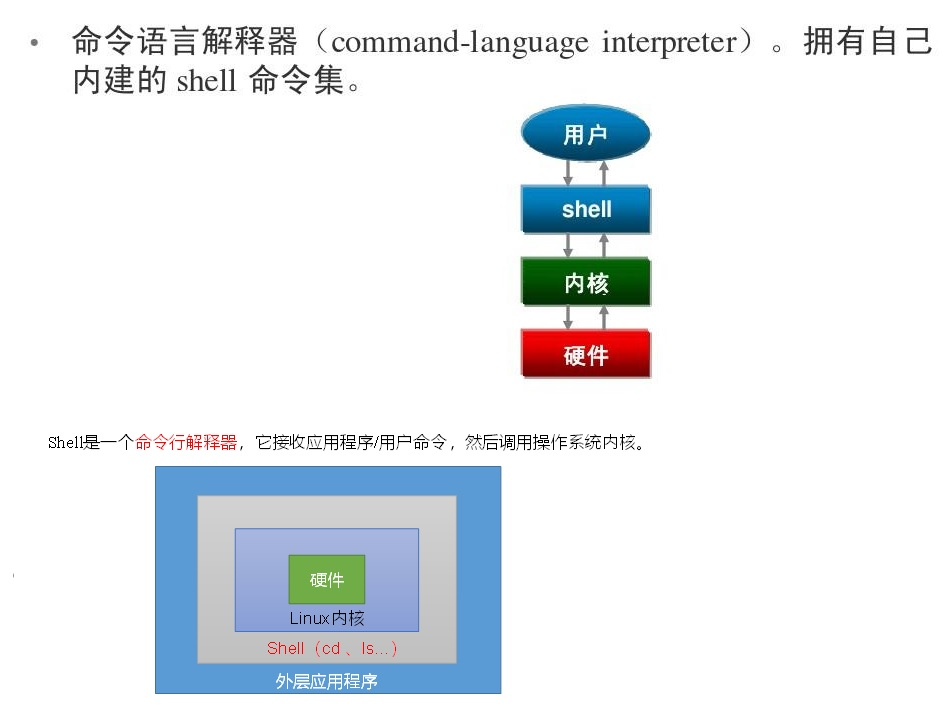

# 2. shell脚本入门

## 2.1 shell脚本简介

C Shell 是一个用 C 语言编写的程序，它是用户使用 Linux 的桥梁。Shell 既是一种命令语言，又是一种程序设计语言。

Shell 是指一种命令行解释器，接收用户指令和应用程序命令，操作系统内核的服务。
<a data-fancybox title="shell" href="./image/shell01.jpg"></a>

常见的shell还有 Bourne shell，两者语法不兼容；

### 2.1.1 shell解释器


```sh
# Centos默认的解析器是bash
[root@TXYUN-NO2 ~]# cat /etc/shells
/bin/sh
/bin/bash
/usr/bin/sh
/usr/bin/bash

```

## 2.2  shell中的变量

### 2.2.1 系统变量

**常用系统变量$HOME、$PWD、$SHELL、$USER等**

:::tip 常用系统
$HOME : 当前目录的根目录  
$PWD  : 当前目录  
$USER ：当前用户  
$SHELL ：当前系统默认的解释器  
:::

-----------

```sh
[root@TXYUN-NO2 JVM]# echo $HOME
/root
[root@TXYUN-NO2 JVM]# echo $USER
root
[root@TXYUN-NO2 JVM]# echo $PWD
/root/JVM
[root@TXYUN-NO2 JVM]# echo $SHELL
/bin/bash

```
### 2.2.2 自定义变量

:::tip 基本语法
1. 定义变量：变量=值 

2. 撤销变量：unset 变量

3. 声明静态变量：readonly变量，注意：不能unset
:::


:::tip 变量定义规则
（1）变量名称可以由字母、数字和下划线组成，但是不能以数字开头，环境变量名建议大写。

（2）等号两侧不能有空格

（3）在bash中，变量默认类型都是字符串类型，无法直接进行数值运算。

（4）变量的值如果有空格，需要使用双引号或单引号括起来。
:::

```sh

[root@TXYUN-NO2 JVM]# A=555
[root@TXYUN-NO2 JVM]# echo $A
555

[root@TXYUN-NO2 JVM]# unset A
[root@TXYUN-NO2 JVM]# echo $A

[root@TXYUN-NO2 JVM]# readonly B=999
[root@TXYUN-NO2 JVM]# echo $B
999

[root@TXYUN-NO2 JVM]# unset B
-bash: unset: B: cannot unset: readonly variable

# 在bash中，变量默认类型都是字符串类型，无法直接进行数值运算
[root@TXYUN-NO2 JVM]# A=11+22
[root@TXYUN-NO2 JVM]# echo  $A
11+22

# 变量的值如果有空格，需要使用双引号或单引号括起来
[root@TXYUN-NO2 JVM]# A='1 love you'
[root@TXYUN-NO2 JVM]# echo  $A
1 love you

# 可把变量提升为全局环境变量，可供其他Shell程序使用
# export 变量名
[root@TXYUN-NO2 JVM]# export A

```
### 2.2.3 特殊变量

:::tip  特殊变量
<font color='red'><strong>$#</strong></font>	传递到脚本的参数个数

<font color='red'><strong>$*</strong></font>	以一个单字符串显示所有向脚本传递的参数。  
如$*用""括起来的情况、以"$1 $2 … $n"的形式输出所有参数

<font color='red'><strong>$$</strong></font>	脚本运行的当前进程ID号

<font color='red'><strong>$!</strong></font>	后台运行的最后一个进程的ID号

<font color='red'><strong>$@</strong></font>	与$*相同，但是使用时加引号，并在引号中返回每个参数。  
如$@用""括起来的情况、以"$1" "$2" … "$n" 的形式输出所有参数

<font color='red'><strong>$-</strong></font>	显示Shell使用的当前选项，与set命令功能相同。

<font color='red'><strong>$?</strong></font>	显示最后命令的退出状态。0表示没有错误，其他任何值表明有错误。
:::

```sh
#!bash/bin
echo $*
echo $@
echo $#
echo $1 $2 $3
echo "进程ID：$$"
if [ $? -eq 0 ]; then
echo "sucess"
fi

------------------------------

[root@TXYUN-NO2 JVM]# sh test.sh  1 2 3
1 2 3
1 2 3
3
1 2 3
进程ID：652055
sucess
```

## 2.3 shell中运算符	

### 2.3.1 算术运算符

:::tip 算术运算符
<font color='red'><strong>+	加法</strong></font>	`expr $a + $b` 结果为 30。  
<font color='red'><strong>-	减法</strong></font>	`expr $a - $b` 结果为 -10。  
<font color='red'><strong>*	乘法</strong></font>	`expr $a \* $b` 结果为  200。  
<font color='red'><strong>/	除法</strong></font>	`expr $b / $a` 结果为 2。  
<font color='red'><strong>%	取余</strong></font>	`expr $b % $a` 结果为 0。  
<font color='red'><strong>=	赋值</strong></font>	a=$b 将把变量 b 的值赋给 a。  
<font color='red'><strong>==	相等</strong></font>。用于比较两个数字，相同则返回 true。	[ $a == $b ] 返回 false。  
<font color='red'><strong>!=	不相等</strong></font>。用于比较两个数字，不相同则返回 true。	[ $a != $b ] 返回 true。  
:::

**注意**：条件表达式要放在方括号之间，并且要有**空格**，
例如: <font color='red'><strong>[$a==$b]</strong></font> 是错误的，必须写成 <font color='red'><strong>[ $a == $b ]</strong></font>。

```sh
#!bash/bin
a=20;
b=10;
# 注意：`是反冒号, + 前后需要空格
val=`expr $a + $b`;
echo "相加 a+b=$val";

val=`expr $a / $b`;
echo "相处 a/b=$val";

val=`expr $a - $b`;
echo "相减 a-b=$val";

#乘号(*)前边必须加反斜杠(\)才能实现乘法运算
val=`expr $a \* $b`;
echo "相乘 a*b=$val";


val=`expr $a % $b`;
echo "取余 a%b=$val";

if [ $a == $b ];then
echo "a等于b";
else
echo "a不等于b";
fi
```

-------------

```sh
[root@TXYUN-NO2 JVM]# sh expr.sh
相加 a+b=30
相处 a/b=2
相减 a-b=10
相乘 a*b=200
取余 a%b=0
a不等于b

```
### 2.3.2 关系运算符

关系运算符**只支持数字，不支持字符串**，除非字符串的值是数字。

:::tip 关系运算符
<font color='red'><strong>-eq</strong></font>	equal 检测两个数是否相等，相等返回 true。	[ $a -eq $b ] 返回 false。  
<font color='red'><strong>-ne</strong></font>	no equal 检测两个数是否不相等，不相等返回 true。	[ $a -ne $b ] 返回 true。  
<font color='red'><strong>-gt</strong></font>	greater than 检测左边的数是否大于右边的，如果是，则返回 true。	[ $a -gt $b ] 返回 false。  
<font color='red'><strong>-lt</strong></font>	less than 检测左边的数是否小于右边的，如果是，则返回 true。	[ $a -lt $b ] 返回 true。  
<font color='red'><strong>-ge</strong></font>	greater equal 检测左边的数是否大于等于右边的，如果是，则返回 true。	[ $a -ge $b ] 返回 false。  
<font color='red'><strong>-le</strong></font>	less equal 检测左边的数是否小于等于右边的，如果是，则返回 true。	[ $a -le $b ] 返回 true。  
:::

-----------

```sh
#!bash/bin
a=20;
b=10;

if [ $a -eq $b ]; then
        echo "A $a 等于 $b"
else
        echo "A $a 不等于 $b"
fi

b=20;
if [ $a -ne $b ]; then
        echo "B $a 不等于 $b"
else
        echo "B $a 等于 $b"
fi

b=10
if [ $a -gt $b ]; then
        echo "C $a 大于 $b"
else
        echo "C $a 不大于 $b"
fi


if [ $a -lt $b ]; then
        echo "D $a 小于 $b"
else
        echo "D $a 不小于 $b"
fi

if [ $a -ge $b ]; then
        echo "F $a 大于等于 $b"
else
        echo "F $a 小于 $b"
fi


if [ $a -le $b ]; then
        echo "E $a 小于等于 $b"
else
        echo "E $a 大于 $b"
fi

```
-------------

**运行结果**
```sh
[root@TXYUN-NO2 JVM]# sh than.sh 
A 20 不等于 10
B 20 等于 20
C 20 大于 10
D 20 不小于 10
F 20 大于等于 10
E 20 大于 10

```

### 2.3.3 布尔运算符
下表列出了常用的布尔运算符，假定变量 a 为 10，变量 b 为 20：

:::tip 布尔运算符
<font color='red'><strong>!</strong></font>	非运算，表达式为 true 则返回 false，否则返回 true。	[ ! false ] 返回 true。  
<font color='red'><strong>-o</strong></font>	或运算，有一个表达式为 true 则返回 true。	[ $a -lt 20 -o $b -gt 100 ] 返回 true。  
<font color='red'><strong>-a</strong></font>	与运算，两个表达式都为 true 才返回 true。	[ $a -lt 20 -a $b -gt 100 ] 返回 false。  
:::

-----------

```sh
#!bash/bin

a=20;
b=10;

if [ ! $a -eq $b  ]; then
echo "$? $a $b 不相等"
else
echo "$? $a $b 相等"
fi

a=10
if [ $a  -lt 20 -o $b -gt 100 ]; then
echo "or $? $a $b"
fi

if [ $a  -lt 20 -a $b -gt 100 ]; then
echo "and $? $a $b"

else
echo "and $?"
fi

```
**运行结果**
```sh
[root@TXYUN-NO2 JVM]# sh bool.sh 
0 20 10 不相等
or 0 10 10
and 1

```
### 2.3.4 逻辑运算符
以下介绍 Shell 的逻辑运算符，假定变量 a 为 10，变量 b 为 20:

:::tip 逻辑运算符
<font color='red'><strong>&&</strong></font>	逻辑的 AND	[[ $a -lt 100 && $b -gt 100 ]] 返回 false  
<font color='red'><strong>||</strong></font>	逻辑的 OR	[[ $a -lt 100 || $b -gt 100 ]] 返回 true  
:::

```sh
#!bash/bin
a=10
b=20

if [[ $a -lt 100 && $b -gt 100 ]]
then
   echo "返回 true"
else
   echo "返回 false"
fi

if [[ $a -lt 100 || $b -gt 100 ]]
then
   echo "返回 true"
else
   echo "返回 false"
fi
```
-----------

**运行结果**
```sh
[root@TXYUN-NO2 JVM]# sh boolean.sh
返回 false
返回 true

```

### 2.3.5 字符串运算符

下表列出了常用的字符串运算符，假定变量 a 为 "abc"，变量 b 为 "efg"：

:::tip 字符串运算符
<font color='red'><strong>=</strong></font>	检测两个字符串是否相等，相等返回 true。	[ $a = $b ] 返回 false。  
<font color='red'><strong>!=</strong></font>	检测两个字符串是否不相等，不相等返回 true。	[ $a != $b ] 返回 true。  
<font color='red'><strong>-z</strong></font>	检测字符串长度是否为0，为0返回 true。	[ -z $a ] 返回 false。  
<font color='red'><strong>-n</strong></font>	检测字符串长度是否不为 0，不为 0 返回 true。	"$a" 使用时要用双引号<font color='red'><strong>[ -n "$a" ]</strong></font> 返回 true。  
<font color='red'><strong>$	</strong></font> 检测字符串是否为空，不为空返回 true。	[ $a ] 返回 true。  
:::

----------------

```sh
#!bash/bin

a="AAAA";
b="BBBB";

if [ $a = $b ]; then
echo "1 $a 等于 $b"
else
echo "1 $a 不等于 $b"
fi

if [ $a != $b ]; then
echo "2 $a 不等于 $b"
else
echo "2 $a 等于 $b"
fi

# zero

if [ -z $a ]; then
echo "3 $a 长度为0"
else
echo "3 $a 长度不为0"
fi

unset a;
if [ $a ]; then
echo "4 $a 不为空"
else
echo "4 $a 为空"
fi

#no zero
# 使用时要用双引号
if [ -n "$a" ]; then
echo "5 $a 长度不为0"
else
echo "5 $a 长度为0"
fi

if [ -z $a ]; then
echo "3 $a 长度为0"
else
echo "3 $a 长度不为0"
fi
```
**运行结果**
```sh
[root@TXYUN-NO2 JVM]# sh str.sh 
1 AAAA 不等于 BBBB
2 AAAA 不等于 BBBB
3 AAAA 长度不为0
4  为空
5  长度为0
3  长度为0
```

### 2.3.6 文件测试运算符

文件测试运算符用于检测 Unix 文件的各种属性。

:::tip 属性检测
<font color='red'><strong>-b file</strong></font>	检测文件是否是块设备文件，如果是，则返回 true。	[ -b $file ] 返回 false。  
<font color='red'><strong>-c file</strong></font>	检测文件是否是字符设备文件，如果是，则返回 true。	[ -c $file ] 返回 false。  
<font color='red'><strong>-d file</strong></font>	检测文件是否是目录，如果是，则返回 true。	[ -d $file ] 返回 false。  
<font color='red'><strong>-f file</strong></font>	检测文件是否是普通文件（既不是目录，也不是设备文件），如果是，则返回 true。	[ -f $file ] 返回 true。  
<font color='red'><strong>-g file</strong></font>	检测文件是否设置了 SGID 位，如果是，则返回 true。	[ -g $file ] 返回 false。  
<font color='red'><strong>-k file</strong></font>	检测文件是否设置了粘着位(Sticky Bit)，如果是，则返回 true。	[ -k $file ] 返回 false。  
<font color='red'><strong>-p file</strong></font>	检测文件是否是有名管道，如果是，则返回 true。	[ -p $file ] 返回 false。  
<font color='red'><strong>-u file</strong></font>	检测文件是否设置了 SUID 位，如果是，则返回 true。	[ -u $file ] 返回 false。  
<font color='red'><strong>-r file</strong></font>	检测文件是否可读，如果是，则返回 true。	[ -r $file ] 返回 true。  
<font color='red'><strong>-w file</strong></font>	检测文件是否可写，如果是，则返回 true。	[ -w $file ] 返回 true。  
<font color='red'><strong>-x file</strong></font>	检测文件是否可执行，如果是，则返回 true。	[ -x $file ] 返回 true。  
<font color='red'><strong>-s file</strong></font>	检测文件是否为空（文件大小是否大于0），不为空返回 true。	[ -s $file ] 返回 true。  
<font color='red'><strong>-e file</strong></font>	检测文件（包括目录）是否存在，如果是，则返回 true。	[ -e $file ] 返回 true。  
:::

---------------------

```sh
#!bash/bin

file="/root/JVM/str.sh"

echo $file
if [ -r $file ]
then
   echo "文件可读"
else
   echo "文件不可读"
fi
if [ -w $file ]
then
   echo "文件可写"
else
   echo "文件不可写"
fi
if [ -x $file ]
then
   echo "文件可执行"
else
   echo "文件不可执行"
fi
if [ -f $file ]
then
   echo "文件为普通文件"
else
   echo "文件为特殊文件"
fi
if [ -d $file ]
then
   echo "文件是个目录"
else
   echo "文件不是个目录"
fi
if [ -s $file ]
then
   echo "文件不为空"
else
   echo "文件为空"
fi
if [ -e $file ]
then
   echo "文件存在"
else
   echo "文件不存在"
fi

```

```sh
[root@TXYUN-NO2 JVM]# sh file.sh 
/root/JVM/str.sh
文件可读
文件可写
文件不可执行
文件为普通文件
文件不是个目录
文件不为空
文件存在

```

## 2.4 shell中流程控制		

### 2.4.1 if判断

#### 2.4.1.1 基本语法
:::tip 基本语法

1. 方式一
```sh
if [ 条件判断式 ];then 
  程序 
fi 
```
---------------------

2. 方式二
```sh
if [ 条件判断式 ] 
  then 
    程序 
fi
```
-------------------
3. 方式三
```sh
if [ 条件判断式 ]; then 
  程序 
elseif [ 条件判断式 ]; then
  程序
else
  程序
fi
```
**注意事项：**
（1）[ 条件判断式 ],中括号和条件判断式之间必须有空格
（2）<font color='red'>if后要有空格</font>
:::

#### 2.4.1.2 实例演示

```sh
#!bash/bin
a=10;
b=10;
if [ $a -gt $b ];then
    echo "$a 大于 $b"
elif [ $a -eq $b ]
then
    echo "$a 等于 $b";
else
    echo "$a 小于 $b";
fi
```
----------
```sh
[root@TXYUN-NO2 JVM]# sh ifelse.sh
10 等于 10
```

### 2.4.2 for循环

#### 2.4.2.1 基本语法

:::tip 基本语法
1. 方式一
```sh
for (( 初始值;循环控制条件;变量变化 )) 
  do 
    程序 
  done
```
2. 方式二
```sh
for  变量 in item1 item2 ... itemN
do
    echo "$val"
done
```
3. 方式三
```sh
for  变量 in `表达式`
do
    echo "$val"
done
```
:::
#### 2.4.2.2 案例实例

```sh
#!bash/bin
for  val in `find . -name "*.sh"`
do
        echo "$val"
done

echo '--------------------'
files=`find . -name "*.sh"`

for filename in $files
do
echo "$filename"
done

echo '--------------------'
for (( i=0;i<10;i++))
do
echo "NO.$i"
done
```

```sh
[root@TXYUN-NO2 JVM]# sh for.sh
./bool.sh
./expr.sh
./file.sh
./str.sh
./ifelse.sh
./than.sh
./test.sh
./for.sh
./boolean.sh
--------------------
./bool.sh
./expr.sh
./file.sh
./str.sh
./ifelse.sh
./than.sh
./test.sh
./for.sh
./boolean.sh
--------------------
NO.0
NO.1
NO.2
NO.3
NO.4
NO.5
NO.6
NO.7
NO.8
NO.9
```
### 2.4.3 while循环

#### 2.4.3.1 基础语法
:::tip 基础语法
1. 方式一
```sh
while ((条件表达式))
do
    command
done
```
-----------
2. 方式二
```sh
while :
do
    command
done
```
-------------
3. 方式三
```sh
while true
do
    command
done
```
:::
#### 2.4.3.2 案例实例

```sh
#!bash/bin
i=0;
while (($i<2))
do
 echo "NO.$i";
 i=`expr $i + 1`;
done

echo "----------------------";
while true
do
  echo "NUMBER NO.$i";
  i=`expr $i + 1`;
  if [ $i -gt 10 ];then
    break
  fi
done

echo "----------------------";
while :
do
  echo "NUMBER NO.$i";
  i=`expr $i + 1`;
  if [ $i -gt 20 ];then
    break
  fi
done

```
----------------

```sh
[root@TXYUN-NO2 JVM]# sh while.sh
NO.0
NO.1
----------------------
NUMBER NO.2
NUMBER NO.3
NUMBER NO.4
NUMBER NO.5
NUMBER NO.6
NUMBER NO.7
NUMBER NO.8
NUMBER NO.9
NUMBER NO.10
----------------------
NUMBER NO.11
NUMBER NO.12
NUMBER NO.13
NUMBER NO.14
NUMBER NO.15
NUMBER NO.16
NUMBER NO.17
NUMBER NO.18
NUMBER NO.19
NUMBER NO.20
```
### 2.4.4 until 循环
until 循环执行一系列命令直至条件为 true 时停止。

until 循环与 while 循环在处理方式上刚好相反。

一般 while 循环优于 until 循环，但在某些时候—也只是极少数情况下，until 循环更加有用。

#### 2.4.4.1 基础语法
:::tip 基础语法
1. 方式一
```sh
until condition
do
    command
done
```
:::

#### 2.4.4.2 案例实例

```sh
#!/bin/bash
a=0
until [ ! $a -lt 10 ]
do
   echo $a
   a=`expr $a + 1`
done
```
--------------------------
```sh
[root@TXYUN-NO2 JVM]# sh until.sh
0
1
2
3
4
5
6
7
8
9
```

### 2.4.5 case ... esac语句

#### 2.4.5.1 基础语法
:::tip 基础语法
1. 方式一
```sh
case 值 in
值1)
    command1
    command2
    ...
    commandN
    ;;
值2）
    command1
    command2
    ...
    commandN
    ;;
esac
```
:::

#### 2.4.5.2 案例实例
```sh
#!bash/bin
while :
do
echo "请输入1到4之间的数字"
read NUM
case $NUM in
    1)  echo '你选择了 1'
    ;;
    2)  echo '你选择了 2'
    ;;
    3)  echo '你选择了 3'
    ;;
    4)  echo '你选择了 4'
    ;;
    *)  echo '你没有输入 1 到 4 之间的数字,游戏结束'
        break;
    ;;
esac
done
```
```sh
[root@TXYUN-NO2 JVM]# sh case.sh
请输入1到5之间的数字
1
你选择了 1
请输入1到5之间的数字
5
你没有输入 1 到 4 之间的数字,游戏结束

```
### 2.4.6 break命令
break命令允许跳出所有循环（终止执行后面的所有循环）。

```sh
#!bash/bin
while :
do
echo "请输入1到4之间的数字"
read NUM
case $NUM in
    1)  echo '你选择了 1'
    ;;
    2)  echo '你选择了 2'
    ;;
    3)  echo '你选择了 3'
    ;;
    4)  echo '你选择了 4'
    ;;
    *)  echo '你没有输入 1 到 4 之间的数字,游戏结束'
        break;
    ;;
esac
done
```
### 2.4.7 continue命令
continue命令与break命令类似，只有一点差别，它不会跳出所有循环，仅仅跳出当前循环
```sh
```
## 2.5 shell中函数	

### 2.5.1 常见系统函数

#### 2.5.1.1 基本语法

:::tip 基本语法
1. **read**
read(选项)(参数)  
选项：  
-p：指定读取值时的提示符；  
-t：指定读取值时等待的时间（秒）。  
参数  
	变量：指定读取值的变量名  
-------------------

2. **basename**
basename [string / pathname] [suffix]    	
（功能描述：basename命令会删掉所有的前缀包括最后一个（‘/’）字符，然后将字符串显示出来。
选项：
suffix为后缀，如果suffix被指定了，basename会将pathname或string中的suffix去掉。

------------------

3. **dirname**基本语法
dirname 文件绝对路径	  	
（功能描述：从给定的包含绝对路径的文件名中去除文件名（非目录的部分），然后返回剩下的路径（目录的部分））
:::

#### 2.5.1.2 案例实例

```sh
[root@TXYUN-NO2 JVM]# basename /root/JVM/find.sh  .sh
find
[root@TXYUN-NO2 JVM]# basename /root/JVM/find.sh
find.sh
[root@TXYUN-NO2 JVM]# dirname /root/JVM/find.sh
/root/JVM
```

**查出当前路径下所有的的shell脚本，并检查是否在目标数组中，如果不在标注出来并返回**
```sh
#!bash/bin

myarray=(test.sh expr.sh than.sh bool.sh boolean.sh str.sh file.sh);

echo "${myarray[@]}"
echo "${myarray[*]}"

shellname=`find . -name "*.sh" -exec  basename {} \;`

echo "$shellname"
notgetfilename="";
count=0;
for filename in $shellname

do
 if [[ ${myarray[*]} =~ $filename ]]; then
   echo "$filename 存在于数组中"
 else
   count=`expr $count + 1`;
   notgetfilename="$notgetfilename |$filename"
 fi

done
echo "多余文件个数：$count $notgetfilename"
```

### 2.5.2 自定义函数

#### 2.5.2.1 基本语法
:::tip 基本语法
1. 基本语法
```sh
[ function ] funname[()]
{
	Action;
	[return int;]
}
funname  
```
------------

2. 经验技巧  
	（1）必须在调用函数地方之前，先声明函数，shell脚本是逐行运行。不会像其它语言一样先编译。  
	（2）函数返回值，只能通过$?系统变量获得，可以显示加：return返回，如果不加，将以最后一条命令运行结果，作为返回值。return后跟数值n(0-255)  
:::

------------

#### 2.5.2.2 实际案例

```sh

```

## 2.6 shell中数组

### 2.6.1 基础语法

```sh
array_name=(value1 value2 ... valuen)
```
### 2.6.2 实际案例

```sh
#!bash/bin

myarray=(test.sh expr.sh than.sh bool.sh boolean.sh str.sh file.sh);

echo "${myarray[@]}"
echo "${myarray[*]}"
echo "${myarray[1]}"
echo "${myarray[0]}"

 if [[ ${myarray[*]} =~ "bool.sh" ]]; then
   echo "$filename 存在于数组中"
 else
   echo "$filename 不存在于数组中"
 fi
```
-------------

```sh
[root@TXYUN-NO2 JVM]# sh array.sh
test.sh expr.sh than.sh bool.sh boolean.sh str.sh file.sh
test.sh expr.sh than.sh bool.sh boolean.sh str.sh file.sh
expr.sh
test.sh
存在于数组中
```

## 2.7 shell中工具命令	

### 2.7.1 cut命令

#### 2.7.1.1 基础语法
:::tip 基础语法
cut  [-bn] [file]
cut [-c] [file]
cut [-df] [file]
:::

:::warning 参数
<font color='red'><strong>-b</strong></font> ：以字节为单位进行分割。这些字节位置将忽略多字节字符边界，除非也指定了 -n 标志。

<font color='red'><strong>-c</strong></font> ：以字符为单位进行分割。

<font color='red'><strong>-d</strong></font> ：自定义分隔符，默认为**制表符**。

<font color='red'><strong>-f</strong></font> ：与-d一起使用，指定显示哪个区域。

<font color='red'><strong>-n</strong></font> ：取消分割多字节字符。仅和 -b 标志一起使用。如果字符的最后一个字节落在由 -b 标志的 List 参数指示的
范围之内，该字符将被写出；否则，该字符将被排除
:::

#### 2.7.1.2 实际案例

```sh
[root@TXYUN-NO2 JVM]# cat cut.txt
qw er dsf ffg ssdfsa
sd tqk 001 tian kai qi
sss ff bai chuan lei
qiue meng meng kkkk sss
田起凯 球儿萌萌
```
--------------

```sh
# 1. 切割第四个字节
[root@TXYUN-NO2 JVM]# who
root     pts/0        2021-10-27 08:58 (218.201.132.130)
[root@TXYUN-NO2 JVM]# who|cut -b 4
t
## 提取第3,4,10的字节
[root@TXYUN-NO2 JVM]# cut -b 3-4,10 cut.txt
 e
 t1
s i
ue

## 当遇到多字节字符时，使用-n选项，不会将多字节字符拆开(汉字的情况)
[root@TXYUN-NO2 JVM]# cut -nb 1 cut.txt
q
s
s
q
田

[root@TXYUN-NO2 JVM]# cut -b 1 cut.txt
q
s
s
q
▒

-------------------------------------
# 2. -f 切割某几列
# 切割第2 3列
[root@TXYUN-NO2 JVM]# cut -d " " -f 2,3 cut.txt
er dsf
tqk 001
ff bai
meng meng
# 切割 2到4列
[root@TXYUN-NO2 JVM]# cut -d " " -f 2-4 cut.txt
er dsf ffg
tqk 001 tian
ff bai chuan
meng meng kkkk
------------------------------

```

### 2.7.2 sed命令

sed是一种流编辑器，它一次处理一行内容。处理时，把当前处理的行存储在临时缓冲区中，称为“模式空间”，接着用sed命令处理缓冲区中的内容，处理完成后，把缓冲区的内容送往屏幕。接着处理下一行，这样不断重复，直到文件末尾。<font color='red'><strong>文件内容并没有改变</strong></font>，除非你使用重定向存储输出。

#### 2.7.2.1 基础语法
:::tip 基础语法
**sed [选项参数]  ‘command’  filename**

动作说明：
<font color='red'><strong>a</strong></font> ：新增， a 的后面可以接字串，而这些字串会在新的一行出现(目前的下一行)～  
<font color='red'><strong>c</strong></font> ：取代， c 的后面可以接字串，这些字串可以取代 n1,n2 之间的行！  
<font color='red'><strong>d</strong></font> ：删除，因为是删除啊，所以 d 后面通常不接任何咚咚；  
<font color='red'><strong>i</strong></font> ：插入， i 的后面可以接字串，而这些字串会在新的一行出现(目前的上一行)；  
<font color='red'><strong>p</strong></font> ：打印，亦即将某个选择的数据印出。通常 p 会与参数 sed -n 一起运行～  
<font color='red'><strong>s</strong></font> ：取代，可以直接进行取代的工作哩！通常这个 s 的动作可以搭配正规表示法！例如 1,20s/old/new/g 就是  啦！
:::

#### 2.7.2.2 实际案例

```sh
# 文本显示
[root@TXYUN-NO2 JVM]# cat sed.txt 
NO1
NO2
NO3
NO4
NO5
# 每行后边添加tqk
[root@TXYUN-NO2 JVM]# sed 'a\tqk' sed.txt 
NO1
tqk
NO2
tqk
NO3
tqk
NO4
tqk
NO5
tqk
# 第一行后边添加tqk
[root@TXYUN-NO2 JVM]# sed '1a\tqk' sed.txt 
NO1
tqk
NO2
NO3
NO4
NO5
# 1到2行后边添加tqk
[root@TXYUN-NO2 JVM]# sed '1,2a\tqk' sed.txt 
NO1
tqk
NO2
tqk
NO3
NO4
NO5
#删除第一行
[root@TXYUN-NO2 JVM]# sed '1d' sed.txt 
NO2
NO3
NO4
NO5
#第一行前边添加TQK
[root@TXYUN-NO2 JVM]# sed '1c\TQK' sed.txt 
TQK
NO2
NO3
NO4
NO5
#一到三行替换成TQK
[root@TXYUN-NO2 JVM]# sed '1,3c\TQK' sed.txt 
TQK
NO4
NO5
#NO替换成TQK
[root@TXYUN-NO2 JVM]# sed 's/NO/TQK/g' sed.txt 
TQK1
TQK2
TQK3
TQK4
TQK5
#第一行前添加TQK001
[root@TXYUN-NO2 JVM]# sed '1i\TQK001' sed.txt 
TQK001
NO1
NO2
NO3
NO4
NO5

```

### 2.7.3 awk命令
一个强大的文本分析工具，把文件逐行的读入，以空格为默认分隔符将每行切片，切开的部分再进行分析处理

#### 2.7.3.1 基础语法

:::tip 基础语法
1. **基本用法**

**awk [选项参数] 'pattern1{action1}  pattern2{action2}...' filename**

<font color='red'><strong>pattern</strong></font>：表示AWK在数据中查找的内容，就是匹配模式

<font color='red'><strong>action</strong></font>：在找到匹配内容时所执行的一系列命令

2. **选项参数说明**
<font color='red'><strong>-F</strong></font>	指定输入文件折分隔符
<font color='red'><strong>-v</strong></font>	赋值一个用户定义变量

3. **内建变量**
<font color='red'><strong>$n</strong></font>		当前记录的第n个字段，字段间由FS分隔  
<font color='red'><strong>$0</strong></font>		完整的输入记录  
<font color='red'><strong>ARGC</strong></font>		命令行参数的数目  
<font color='red'><strong>ARGIND</strong></font>		命令行中当前文件的位置(从0开始算)  
<font color='red'><strong>ARGV</strong></font>		包含命令行参数的数组  
<font color='red'><strong>CONVFMT</strong></font>		数字转换格式(默认值为%.6g)ENVIRON环境变量关联数组  
<font color='red'><strong>ERRNO</strong></font>		最后一个系统错误的描述  
<font color='red'><strong>FIELDWIDTHS</strong></font>		字段宽度列表(用空格键分隔)  
<font color='red'><strong>FILENAME</strong></font>		当前文件名  
<font color='red'><strong>FNR</strong></font>		各文件分别计数的行号   
<font color='red'><strong>FS</strong></font>		字段分隔符(默认是任何空格)  
<font color='red'><strong>IGNORECASE</strong></font>		如果为真，则进行忽略大小写的匹配  
<font color='red'><strong>NF</strong></font>		一条记录的字段的数目  
<font color='red'><strong>NR</strong></font>		已经读出的记录数，就是行号，从1开始  
<font color='red'><strong>OFMT</strong></font>		数字的输出格式(默认值是%.6g)  
<font color='red'><strong>OFS</strong></font>		输出字段分隔符，默认值与输入字段分隔符一致。  
<font color='red'><strong>ORS</strong></font>		输出记录分隔符(默认值是一个换行符)  
<font color='red'><strong>RLENGTH</strong></font>		由match函数所匹配的字符串的长度  
<font color='red'><strong>RS</strong></font>		记录分隔符(默认是一个换行符)  
<font color='red'><strong>RSTART</strong></font>		由match函数所匹配的字符串的第一个位置  
<font color='red'><strong>SUBSEP</strong></font>		数组下标分隔符(默认值是/034)  
:::

#### 2.7.3.2 实际案例

```bash
[root@TXYUN-NO2 JVM]# cat awk.txt 
./str.sh  :tqk:1
./awk.sh:1:1
./while.sh:345:2
tqk  001 :1:3
tqk  002 :3:4
tqk:001:003
```
------------
1. **方式一**

```sh

# 默认使用空格进行分割取第二个字段
[root@TXYUN-NO2 JVM]# awk '{print $2}' awk.txt 
:tqk:1


001
002

# -F使用：进行分割
# awk -F  #-F相当于内置变量FS, 指定分割字符
[root@TXYUN-NO2 JVM]# awk -F: '{print $1 ,$2 ,$3 }' awk.txt 
./str.sh   tqk 1
./awk.sh 1 1
./while.sh 345 2
tqk  001  1 3
tqk  002  3 4
tqk 001 003

#awk -v  # 设置变量
# -v 定义变量i
[root@TXYUN-NO2 JVM]#  awk -v 'i=1' -F: '{print $3  ,$3+i }' awk.txt 
1 2
1 2
2 3
3 4
4 5
003 4
```
------------
2. **方式二--运算符**

```sh
[root@TXYUN-NO2 JVM]# awk -F: '$3>2 {print $1,$3}' awk.txt
tqk  001  3
tqk  002  4
tqk 003

```
------------
3. **方式三--使用正则，字符串匹配**

```sh
[root@TXYUN-NO2 JVM]# awk -F: '/^tqk/ {print $1,$3}' awk.txt
tqk  001  3
tqk  002  4
tqk 003

```
------------
4. **方式四--awk脚本**

```sh
[root@TXYUN-NO2 JVM]# vi cal.awk 
[root@TXYUN-NO2 JVM]# cat scare.txt 
Marry   2143 78 84 77
Jack    2321 66 78 45
Tom     2122 48 77 71
Mike    2537 87 97 95
Bob     2415 40 57 62
```

```sh
#!/bin/awk -f
#运行前
BEGIN {
    math = 0
    english = 0
    computer = 0

    printf "NAME    NO.   MATH  ENGLISH  COMPUTER   TOTAL\n"
    printf "---------------------------------------------\n"
}
#运行中
{
    math+=$3
    english+=$4
    computer+=$5
    printf "%-6s %-6s %4d %8d %8d %8d\n", $1, $2, $3,$4,$5, $3+$4+$5
}
#运行后
END {
    printf "---------------------------------------------\n"
    printf "  TOTAL:%10d %8d %8d \n", math, english, computer
    printf "AVERAGE:%10.2f %8.2f %8.2f\n", math/NR, english/NR, computer/NR
}

```

```sh
[root@TXYUN-NO2 JVM]# awk -f  cal.awk  scare.txt 
NAME    NO.   MATH  ENGLISH  COMPUTER   TOTAL
---------------------------------------------
Marry  2143     78       84       77      239
Jack   2321     66       78       45      189
Tom    2122     48       77       71      196
Mike   2537     87       97       95      279
Bob    2415     40       57       62      159
---------------------------------------------
  TOTAL:       319      393      350 
AVERAGE:     63.80    78.60    70.00
```

### 2.7.4 sort命令

sort命令是在Linux里非常有用，它将文件进行排序，并将排序结果标准输出

#### 2.7.4.1 基础语法

:::tip 基础语法
**sort(选项)(参数)**

**选项说明:**  
<font color='red'><strong>-n</strong></font>	依照数值的大小排序  
<font color='red'><strong>-r</strong></font>	以相反的顺序来排序  
<font color='red'><strong>-t</strong></font>	设置排序时所用的分隔字符  
<font color='red'><strong>-k</strong></font>	指定需要排序的列   
:::

#### 2.7.4.2 实际案例

```sh
[root@TXYUN-NO2 JVM]# cat sort.txt 
3
465
21
3
7
8
43
56
34
9

```

```sh
#依照数值的大小排序
[root@TXYUN-NO2 JVM]# sort -n sort.txt 
3
3
7
8
9
21
34
43
56
465
#以相反的顺序来排序 
[root@TXYUN-NO2 JVM]# sort -nr sort.txt 
465
56
43
34
21
9
8
7
3
3

```

```sh

# -t 设置排序时所用的分隔字符  
# -k 指定需要排序的列  
[root@TXYUN-NO2 JVM]# sort -nr sort2.txt -t : -k 2
tqk:999
aa:234
sdf:10
sd:7
sdafd:5
3:4
a:2
1:1
[root@TXYUN-NO2 JVM]# sort -n sort2.txt -t : -k 2
1:1
a:2
3:4
sdafd:5
sd:7
sdf:10
aa:234
tqk:999
```

<font color='red'><strong>grep 更适合单纯的查找或匹配文本</strong></font>  
<font color='red'><strong>sed 更适合编辑匹配到的文本</strong></font>  
<font color='red'><strong>awk 更适合格式化文本，对文本进行较复杂格式处理</strong></font>  