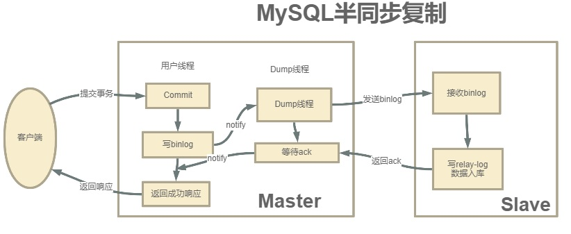
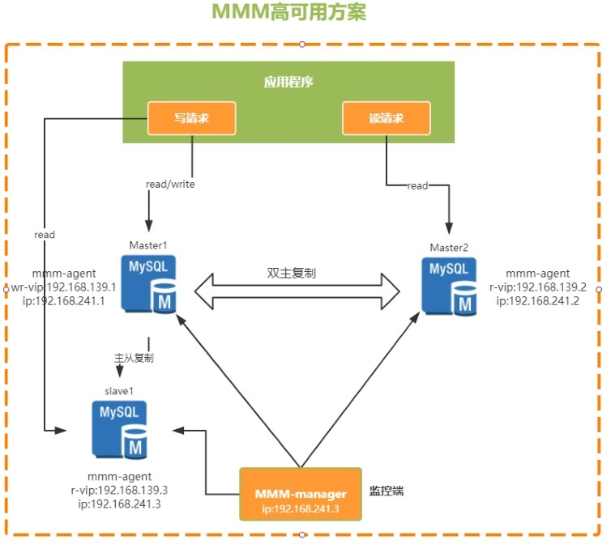
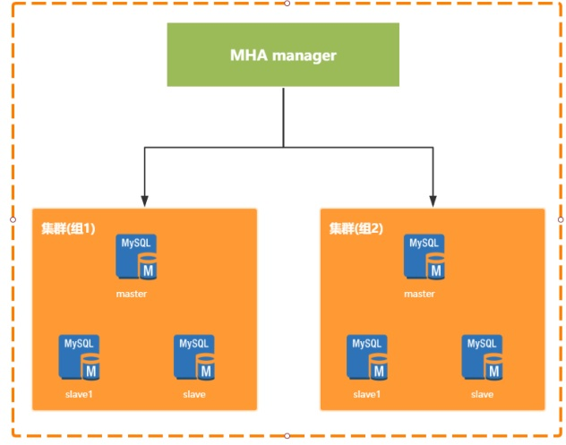
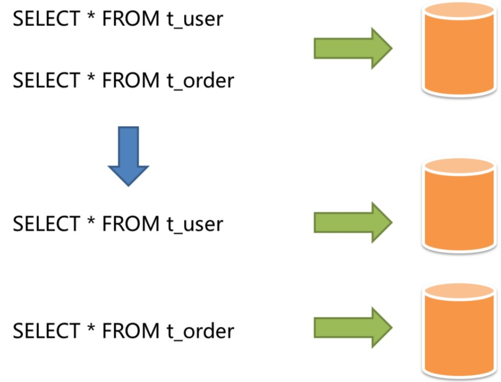
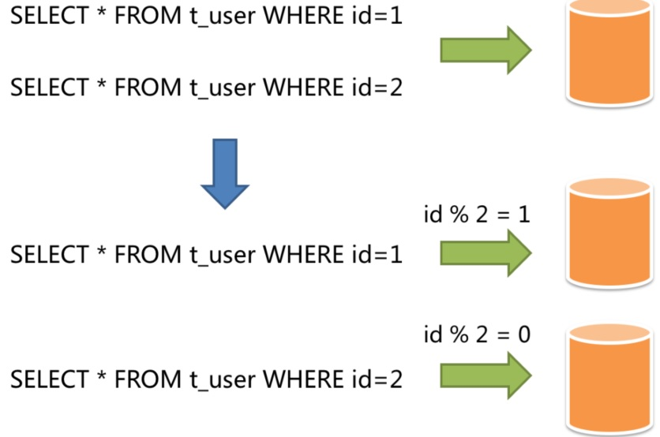

# 3. MySQL的高可用方案

我们之前的MySQL服务集群，都是使用MySQL自身的功能来搭建的集群。但是这样的集群，**不具备高可用的功能**。即如果是MySQL主服务挂了，从服务是没办法自动切换成主服务的。而如果要实现MySQL的高可用，需要借助一些第三方工具来实现

常见的MySQL集群方案有三种: **MMM、MHA、MGR**

这三种高可用框架都有一些共同点：  
1. 对主从复制集群中的Master节点进行监控
2. 自动的对Master进行迁移，通过VIP。
3. 重新配置集群中的其它slave对新的Master进行同步

## 3.1 MMM

MMM(Master-Master replication managerfor Mysql，Mysql主主复制管理
器)是一套由Perl语言实现的脚本程序，可以对mysql集群进行监控和故障迁移。他
需要两个Master，同一时间只有一个Master对外提供服务，可以说是主备模式。

他是通过一个VIP(虚拟IP)的机制来保证集群的高可用。整个集群中，在主节点上
会通过一个VIP地址来提供数据读写服务，而当出现故障时，VIP就会从原来的主节
点漂移到其他节点，由其他节点提供服务。

:::tip 优点：
1. 提供了读写VIP的配置，使读写请求都可以达到高可用
2. 工具包相对比较完善，不需要额外的开发脚本
3. 完成故障转移之后可以对MySQL集群进行高可用监控
:::

:::tip 缺点：
1. 故障简单粗暴，容易丢失事务，建议采用半同步复制方式，减少失败的概率
2. 目前MMM社区已经缺少维护，不支持基于GTID的复制
:::

:::tip 适用场景：
1. 读写都需要高可用的
2. 基于日志点的复制方式
:::

## 3.2 MHA

Master High Availability Manager and Tools for MySQL。是由日本人开发的一
个基于Perl脚本写的工具。这个工具专门用于监控主库的状态，当发现master节点
故障时，会提升其中拥有新数据的slave节点成为新的master节点，在此期间，
MHA会通过其他从节点获取额外的信息来避免数据一致性方面的问题。MHA还提
供了mater节点的在线切换功能，即按需切换master-slave节点。MHA能够在30秒
内实现故障切换，并能在故障切换过程中，最大程度的保证数据一致性。在淘宝内
部，也有一个相似的TMHA产品。

MHA是需要单独部署的，分为Manager节点和Node节点，两种节点。其中
Manager节点一般是单独部署的一台机器。而Node节点一般是部署在每台MySQL
机器上的。 Node节点得通过解析各个MySQL的日志来进行一些操作。

Manager节点会通过探测集群里的Node节点去判断各个Node所在机器上的
MySQL运行是否正常，如果发现某个Master故障了，就直接把他的一个Slave提升
为Master，然后让其他Slave都挂到新的Master上去，完全透明。

## 3.2.1 MHA搭建

<!-- fastdfs 服务器 101.43.21.33:8888 
文件目录
放置在
/var/fdfs/storage
目录下，进入storage容器，进入
/var/fdfs
目录，运行下面命令：
 /usr/bin/fdfs_upload_file /etc/fdfs/client.conf springIOC.pdf

 http://101.43.21.33:8888/group1/M00/00/00/CgAQBWGm5j-AIOFgAAMuH8Jinac005.pdf
-->

<a href="http://101.43.21.33:8888/group1/M00/00/00/CgAQBWGx-tOANzauABHrGAZy0rY151.pdf" text="MHA搭建">MHA搭建</a>

-------------------

## 3.3 MGR

**MGR：MySQL Group Replication**。 是MySQL官方在5.7.17版本正式推出的一种组复制机制。主要是解决传统异步复制和半同步复制的数据一致性问题。

由若干个节点共同组成一个复制组，一个事务提交后，必须经过超过半数节点的决议并通过后，才可以提交。

引入组复制，主要是为了解决传统异步复制和半同步复制可能产生数据不一致的问题。MGR依靠分布式一致性协议(Paxos协议的一个变体)，实现了分布式下数据的最终一致性，提供了真正的数据高可用方案(方案落地后是否可靠还有待商榷)。

支持多主模式，但官方推荐单主模式：
1. 多主模式下，客户端可以随机向MySQL节点写入数据
2. 单主模式下，MGR集群会选出primary节点负责写请求，primary节点与其它节点都可以进行读请求处理.

## 3.4 分库分表的方式

### 3.4.1 分库分表有什么用

分库分表就是为了解决由于数据量过大而导致数据库性能降低的问题，将原来独立的数据库拆分成若干数据库组成，将数据大表拆分成若干数据表组成，使得单一数据库、单一数据表的数据量变小，从而达到提升数据库性能的目的。

例如：微服务架构中，每个服务都分配一个独立的数据库，这就是分库。而对一些业务日志表，按月拆分成不同的表，这就是分表。

_______________________________________

分库分表包含**分库和分表** 两个部分，而这两个部分可以统称为**数据分片**，其目的都是将数据拆分成不同的存储单元。另外，从分拆的角度上，可以分为**垂直分片和水平分片**

### 3.4.2 垂直分片

**垂直分片**： 按照业务来对数据进行分片，又称为纵向分片。他的核心理念就是转库专用。在拆分之前，一个数据库由多个数据表组成，每个表对应不同的业务。

而拆分之后，则是按照业务将表进行归类，分布到不同的数据库或表中，从而将压力分散至不同的数据库或表。例如，下图将用户表和订单表垂直分片到不同的数据库：

垂直分片往往需要对架构和设计进行调整。通常来讲，是来不及应对业务需求快速
变化的。而且，他也无法真正的解决单点数据库的性能瓶颈。垂直分片可以缓解数
据量和访问量带来的问题，但无法根治。如果垂直分片之后，表中的数据量依然超
过单节点所能承载的阈值，则需要水平分片来进一步处理。

### 3.4.3 水平分片

**水平分片：又称横向分片**。相对于垂直分片，它不再将数据根据业务逻辑分类，
而是通过某个字段(或某几个字段)，根据某种规则将数据分散至多个库或表中，
每个分片仅包含数据的一部分。例如，像下图根据主键机构分片。

:::tip 常用的分片策略有：
1. 取余\取模 ： 优点 均匀存放数据，缺点 扩容非常麻烦
2. 按照范围分片 ： 比较好扩容， 数据分布不够均匀
3. 按照时间分片 ： 比较容易将热点数据区分出来。
4. 按照枚举值分片 ： 例如按地区分片
5. 按照目标字段前缀指定进行分区：自定义业务规则分片

**水平分片从理论上突破了单机数据量处理的瓶颈，并且扩展相对自由，是分库分表的标准解决方案**

一般来说，在系统设计阶段就应该根据业务耦合松紧来确定垂直分库，垂直分表方案，在数据量及访问压力不是特别大的情况，首先考虑缓存、读写分离、索引技术等方案。若数据量极大，且持续增长，再考虑水平分库水平分表方案

## 3.5 分库分表的缺点

### 3.5.1 事务一致性问题
原本单机数据库有很好的事务机制能够帮我们保证数据一致性。但是分库分表后，
由于数据分布在不同库甚至不同服务器，不可避免会带来分布式事务问题。

### 3.5.2 跨节点关联查询问题
在没有分库时，我们可以进行很容易的进行跨表的关联查询。但是在分库后，表被
分散到了不同的数据库，就无法进行关联查询了。
这时就需要将关联查询拆分成多次查询，然后将获得的结果进行拼装。

### 3.5.3 跨节点分页、排序函数
跨节点多库进行查询时，limit分页、order by排序等问题，就变得比较复杂了。需
要先在不同的分片节点中将数据
进行排序并返回，然后将不同分片返回的结果集进行汇总和再次排序。
这时非常容易出现内存崩溃的问题。

### 3.5.4 主键避重问题
在分库分表环境中，由于表中数据同时存在不同数据库中，主键值平时使用的自增
长将无用武之地，某个分区数据库生成的ID无法保证全局唯一。因此需要单独设计全局主键，以避免跨库主键重复
问题。

### 3.5.5 公共表处理
实际的应用场景中，参数表、数据字典表等都是数据量较小，变动少，而且属于高
频联合查询的依赖表。这一类表一般就需要在每个数据库中都保存一份，并且所有
对公共表的操作都要分发到所有的分库去执行。

### 3.5.6运维工作量
面对散乱的分库分表之后的数据，应用开发工程师和数据库管理员对数据库的操作
都变得非常繁重。对于每一次数据读写操作，他们都需要知道要往哪个具体的数据
库的分表去操作，这也是其中重要的挑战之一