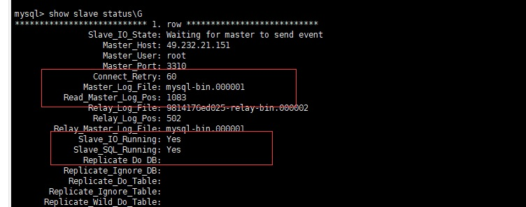
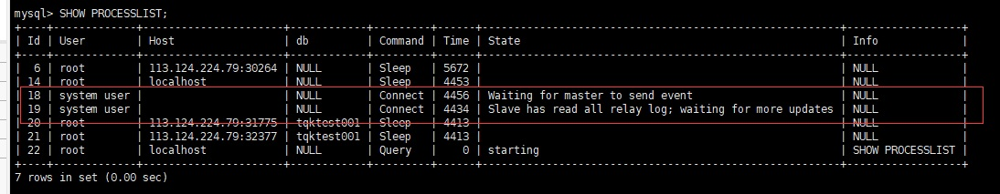
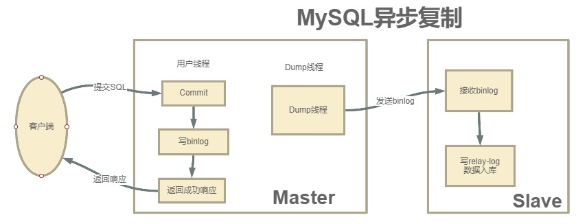
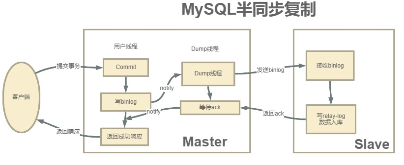

# 2. Mysql搭建主从集群

## 2.1 配置master主服务器

### 2.1.1 启动Master数据库

```shell
docker run --name mysql3310 -p 3310:3306 --privileged=true -ti -e MYSQL_ROOT_PASSWORD=12345@tqk -e MYSQL_DATABASE=enjoy -e MYSQL_USER=user -e MYSQL_PASSWORD=pass -v /home/mysql/docker-data/3310/conf:/etc/mysql/conf.d -v /home/mysql/docker-data/3310/data/:/var/lib/mysql -v /home/mysql/docker-data/3310/logs/:/var/log/mysql -d mysql:5.7
```

### 2.1.2 修改my.cnf 

首先，配置主节点的mysql配置文件： vi /home/mysql/docker-data/3310/conf/my.cnf

这一步需要对master进行配置，主要是需要**打开binlog日志，以及指定severId**

我们打开MySQL主服务的my.cnf文件，在文件中一行server-id以及一个关闭域名解析的配置。

然后**重启服务**

```shell
server-id=3310
#开启复制功能
log-bin=mysql-bin
# 自增长字段每次递增的量，其默认值是 1
auto_increment_increment=2
# 自增长字段从那个数开始
auto_increment_offset=1
# 忽略大小写
lower_case_table_names=1
#binlog-do-db=mstest      //要同步的mstest数据库,要同步多个数据库
#binlog-ignore-db=mysql  //要忽略的数据库
```

::: tip配置说明：
1. **server-id**：服务节点的唯一标识。需要给集群中的每个服务分配一个单独的ID。

2. **log_bin**：打开Binlog日志记录，并指定文件名。

3. **log_bin-index**：Binlog日志文件
:::

### 2.1.3 重启MySQL服务

```sh
 # 可以直接重启docker
 docker restart mysql3310
 #service mysqld restart
```

### 2.1.3 分配replication slave的权限。

**在实际生产环境中，通常不会直接使用root用户，而会创建一个拥有全部权限的用户来负责主从同步**

```shell
#登录主数据库 ，创建 repluser用户
mysql -u root -p 
GRANT REPLICATION SLAVE,FILE,REPLICATION CLIENT ON *.* TO 'repluser'@'%' IDENTIFIED BY '12345@tqk';
# 刷新配置
FLUSH PRIVILEGES;

```
-----------------------------


### 2.1.4 重启MySQL服务

```sh
 # 可以直接重启docker
 docker restart mysql3310
 #service mysqld restart
```

这个指令结果中的File和Position记录的是当前日志的binlog文件以及文件中的索引。

而后面的Binlog_Do_DB和Binlog_Ignore_DB这两个字段是表示需要记录binlog
文件的库以及不需要记录binlog文件的库。目前我们没有进行配置，就表示是针对
全库记录日志。这两个字段如何进行配置，会在后面进行介绍。

#### 在master上查看master的二进制日志

```sql
show  master status;
mysql> show  master status;
+------------------+----------+--------------+------------------+-------------------+
| File             | Position | Binlog_Do_DB | Binlog_Ignore_DB | Executed_Gtid_Set |
+------------------+----------+--------------+------------------+-------------------+
| mysql-bin.000001 |      154 |              |                  |                   |
+------------------+----------+--------------+------------------+-------------------+
1 row in set (0.00 sec)

-- 查看进程信息

mysql>  SHOW PROCESSLIST;
+----+------+---------------------+------+-------------+------+---------------------------------------------------------------+------------------+
| Id | User | Host                | db   | Command     | Time | State                                                         | Info             |
+----+------+---------------------+------+-------------+------+---------------------------------------------------------------+------------------+
|  4 | root | localhost           | NULL | Sleep       | 4664 |                                                               | NULL             |
| 17 | root | 49.232.21.151:48028 | NULL | Binlog Dump | 4686 | Master has sent all binlog to slave; waiting for more updates | NULL             |
| 18 | root | localhost           | NULL | Query       |    0 | starting                                                      | SHOW PROCESSLIST |
+----+------+---------------------+------+-------------+------+---------------------------------------------------------------+------------------+
3 rows in set (0.00 sec)
```
------------------------

开启binlog后，数据库中的所有操作都会被记录到datadir当中，以一组轮询文件的方式循环记录。而指令查到的File和Position就是当前日志的文件和位置。而在后面配置从服务时，就需要通过这个**File和Position**通知从服务从哪个地方开始记录binLog。


## 2.2  配置slave从服务


### 2.2.1 启动slave数据库

```shell
docker run --name mysql3311 -p 3311:3306 --privileged=true -ti -e MYSQL_ROOT_PASSWORD=12345@tqk -e MYSQL_DATABASE=enjoy -e MYSQL_USER=user -e MYSQL_PASSWORD=pass -v /home/mysql/docker-data/3311/conf:/etc/mysql/conf.d -v /home/mysql/docker-data/3311/data/:/var/lib/mysql -v /home/mysql/docker-data/3311/logs/:/var/log/mysql -d mysql:5.7
```

### 2.2.2 修改my.cnf 

首先，配置主节点的mysql配置文件： vi /home/mysql/docker-data/3311/conf/my.cnf

这一步需要对master进行配置，主要是需要**打开binlog日志，以及指定severId**

我们打开MySQL主服务的my.cnf文件，在文件中一行server-id以及一个关闭域名解析的配置。

然后**重启服务**

```shell
server-id=3311
#开启复制功能
log-bin=mysql-bin
# 自增长字段每次递增的量，其默认值是 1
auto_increment_increment=2
# 自增长字段从那个数开始
auto_increment_offset=1
# 忽略大小写
lower_case_table_names=1
#binlog-do-db=mstest      //要同步的mstest数据库,要同步多个数据库
#binlog-ignore-db=mysql  //要忽略的数据库
```

### 2.2.3 slave中设置master的信息

```sql
root@9814176ed025:/# mysql -uroot -p12345@tqk
--切换到mysql
mysql> use mysql;
Reading table information for completion of table and column names
You can turn off this feature to get a quicker startup with -A
Database changed
--change master to master_host='49.232.21.151',master_port=3310,master_user='repluser',master_password='12345@tqk',master_log_file='mysql-bin.000001',master_log_pos=154;

--如果不生效，查看master_log_pos位置是否正确
mysql> change master to master_host='49.232.21.151',master_port=3310,master_user='repluser',master_password='12345@tqk',master_log_file='mysql-bin.000001',master_log_pos=154;
Query OK, 0 rows affected, 2 warnings (0.05 sec)

```


### 2.2.4 开启slave，启动SQL和IO线程

```sql
start slave;
```

### 2.1.4 查看slave的状态

```sql
show slave status\G
```
<a data-fancybox title="mysql" href="./image/mysql37.jpg"></a>


### 2.2.5 查看进程信息

```sh
SHOW PROCESSLIST;
mysql> SHOW PROCESSLIST;
+----+-------------+----------------------+------------+---------+------+--------------------------------------------------------+------------------+
| Id | User        | Host                 | db         | Command | Time | State                                                  | Info             |
+----+-------------+----------------------+------------+---------+------+--------------------------------------------------------+------------------+
|  6 | root        | 113.124.224.79:30264 | NULL       | Sleep   | 5672 |                                                        | NULL             |
| 14 | root        | localhost            | NULL       | Sleep   | 4453 |                                                        | NULL             |
| 18 | system user |                      | NULL       | Connect | 4456 | Waiting for master to send event                       | NULL             |
| 19 | system user |                      | NULL       | Connect | 4434 | Slave has read all relay log; waiting for more updates | NULL             |
| 20 | root        | 113.124.224.79:31775 | tqktest001 | Sleep   | 4413 |                                                        | NULL             |
| 21 | root        | 113.124.224.79:32377 | tqktest001 | Sleep   | 4413 |                                                        | NULL             |
| 22 | root        | localhost            | NULL       | Query   |    0 | starting                                               | SHOW PROCESSLIST |
+----+-------------+----------------------+------------+---------+------+--------------------------------------------------------+------------------+

```
<a data-fancybox title="mysql" href="./image/mysql38.jpg"></a>

## 2.3 主从测试
```sql
--主数据库创建tqktest001
create database tqktest001;

mysql> show databases;
+--------------------+
| Database           |
+--------------------+
| information_schema |
| enjoy              |
| mysql              |
| performance_schema |
| syncdemo           |
| sys                |
| tqktest            |
| tqktest001         |
+--------------------+
```
#### 从服务器查看

```sql
mysql> show databases;
+--------------------+
| Database           |
+--------------------+
| information_schema |
| enjoy              |
| mysql              |
| performance_schema |
| syncdemo           |
| sys                |
| tqktest001         |
```


## 2.3 全库同步与部分同步

之前提到，我们目前配置的主从同步是针对全库配置的，而实际环境中，一般并
不需要针对全库做备份，而只需要对一些特别重要的库或者表来进行同步。那如何
针对库和表做同步配置呢？

首先在**Master端**：在my.cnf中，可以通过以下这些属性指定需要针对哪些库或者哪些表记录binlog

```sh
#需要同步的二进制数据库名
binlog-do-db=tqk001
#只保留7天的二进制日志，以防磁盘被日志占满(可选)
expire-logs-days  = 7
#不备份的数据库
binlog-ignore-db=tqk002
binlog-ignore-db=tqk003
binlog-ignore-db=sys
```
然后**在Slave端**：在my.cnf中，需要配置备份库与主服务的库的对应关系。

```sh
#如果salve库名称与master库名相同，使用本配置
replicate-do-db = tqk001 
#如果master库名[mastdemo]与salve库名[mastdemo01]不同，使用以下配置[需要做映射]
#replicate-rewrite-db = tqk001 -> tqk001history

#如果不是要全部同步[默认全部同步]，则指定需要同步的表
# replicate-wild-do-table=tqk001.user
# replicate-wild-do-table=tqk001.order
```

配置完成了之后重启，在show master status指令中，就可以看到Binlog_Do_DB和Binlog_Ignore_DB两个参数的作用了
```sh
```

## 2.4 集群扩容

我们现在已经搭建成功了一主一从的MySQL集群架构，那要扩展到一主多从的集群架构，其实就比较简单了，只需要增加一个binlog复制就行了。

​但是如果我们的集群是已经运行过一段时间，这时候如果要扩展新的从节点就有一个问题，之前的数据没办法从binlog来恢复了。这时候在扩展新的slave节点时，就需要增加一个数据复制的操作。

MySQL的数据备份恢复操作相对比较简单，可以通过SQL语句直接来完成。具体操作可以使用mysql的bin目录下的mysqldump工具

```sql
--1、进入mysql查看数据库
mysql -uroot -p123456;
show databases;

--2、备份相应数据库
mysqldump -uroot -p12345@tqk --databases consult mall > back.sql

--这里需要注意，如果是热备份，这里需要在dump数据之前进行锁表操作，避免dump数据的时候出现插入操作导致数据不一致的情况。

--3、master锁表
flush table with read lock;

--4、slave导入数据
mysql -uroot -p12345@tqk < back.sql

--5、master解锁
unlock tables;
```

###  2.4.1 新加一个从库

**重复 2.2 的步骤即可**


## 2.5 半同步复制

到现在为止，我们已经可以搭建MySQL的主从集群，互主集群，但是我们这个集群有一个隐患，就是有可能会丢数据。这是为什么呢？这要从MySQL主从数据复制分析起。

​MySQL主从集群默认采用的是一种异步复制的机制。主服务在执行用户提交的事务后，写入binlog日志，然后就给客户端返回一个成功的响应了。而binlog会由一个dump线程异步发送给Slave从服务。

<a data-fancybox title="mysql" href="./image/mysql39.jpg"></a>


​由于这个发送binlog的过程是异步的。主服务在向客户端反馈执行结果时，是不知道binlog是否同步成功了的。这时候如果主服务宕机了，而从服务还没有备份到新执行的binlog，那就有可能会丢数据。

那怎么解决这个问题呢，这就要靠MySQL的半同步复制机制来保证数据安全


半同步复制机制是一种介于异步复制和全同步复制之前的机制。主库在执行完客户端提交的事务后，并不是立即返回客户端响应，而是等待至少一个从库接收并写到relay log中，才会返回给客户端。MySQL在等待确认时，默认会等10秒，**如果超过10秒没有收到ack，就会降级成为异步复制**


<a data-fancybox title="mysql" href="./image/mysql40.jpg"></a>

这种半同步复制相比异步复制，能够有效的提高数据的安全性。但是这种安全性也不是绝对的，他只保证事务提交后的binlog至少传输到了一个从库，并且并不保证从库应用这个事务的binlog是成功的。另一方面，半同步复制机制也会造成一定程度的延迟，这个延迟时间最少是一个TCP/IP请求往返的时间。整个服务的性能是会有所下降的。而当从服务出现问题时，主服务需要等待的时间就会更长，要等到从服务的服务恢复或者请求超时才能给用户响应。


## 2.6 Mysql主从半同步复制搭建


### 2.6.1 Master安装semisync_master模块

```sql
-- 加载lib，所有主从节点都要配置
-- 主库：install plugin rpl_semi_sync_master soname 'semisync_master.so';
-- 从库：install plugin rpl_semi_sync_slave soname 'semisync_slave.so';         
-- 可以一起装。建议一起装，因为会有主从切换的情景。
mysql> install plugin rpl_semi_sync_master soname 'semisync_master.so';
Query OK, 0 rows affected (0.01 sec)

mysql> show global variables like 'rpl_semi%';
+-------------------------------------------+------------+
| Variable_name                             | Value      |
+-------------------------------------------+------------+
| rpl_semi_sync_master_enabled              | OFF        |
| rpl_semi_sync_master_timeout              | 10000      |
| rpl_semi_sync_master_trace_level          | 32         |
| rpl_semi_sync_master_wait_for_slave_count | 1          |
| rpl_semi_sync_master_wait_no_slave        | ON         |
| rpl_semi_sync_master_wait_point           | AFTER_SYNC |
| rpl_semi_sync_slave_enabled               | OFF        |
| rpl_semi_sync_slave_trace_level           | 32         |
+-------------------------------------------+------------+
8 rows in set (0.01 sec)


-- set global rpl_semi_sync_master_enabled = {0|1};   # 1：启用，0：禁止
-- set global rpl_semi_sync_master_timeout = 10000;       # 单位为ms
mysql> set global rpl_semi_sync_master_enabled=ON;
Query OK, 0 rows affected (0.00 sec)

--再次查看 
mysql> show global variables like 'rpl_semi%';
+-------------------------------------------+------------+
| Variable_name                             | Value      |
+-------------------------------------------+------------+
| rpl_semi_sync_master_enabled              | ON         |
| rpl_semi_sync_master_timeout              | 10000      |
| rpl_semi_sync_master_trace_level          | 32         |
| rpl_semi_sync_master_wait_for_slave_count | 1          |
| rpl_semi_sync_master_wait_no_slave        | ON         |
| rpl_semi_sync_master_wait_point           | AFTER_SYNC |
| rpl_semi_sync_slave_enabled               | OFF        |
| rpl_semi_sync_slave_trace_level           | 32         |
+-------------------------------------------+------------+
8 rows in set (0.01 sec)

-- 查看，确保所有节点都成功加载。
-- show plugins;

```

1. 第一行是通过扩展库来安装半同步复制模块，需要指定扩展库的文件名。

2. 第二行查看系统全局参数，rpl_semi_sync_master_timeout就是半同步复制时等待应答的最长等待时间，默认是10秒，可以根据情况自行调整。

:::tip 重要参数
1. **rpl_semi_sync_master_enabled**   （主库）是否启动半同步
2. **rpl_semi_sync_master_timeout**    等待多时毫秒后变成异步复制，默认是10000ms
3. **rpl_semi_sync_master_wait_point** 5.7默认AFTER_SYNC（增强版半同步复制，无损复制模式），在得到slave的应答后再commit，可选值AFTER_COMMIT，在master提交后同步数据给slave，然后master等待slave应答，应答成功返回客户端。
:::

--------------------------

3. 第三行则是打开半同步复制的开关。

在第二行查看系统参数时，最后的一个参数rpl_semi_sync_master_wait_point其实表示一种半同步复制的方式。

半同步复制有两种方式，一种是我们现在看到的这种默认的AFTER_SYNC方式。这种方式下，主库把日志写入binlog，并且复制给从库，然后开始等待从库的响应。从库返回成功后，主库再提交事务，接着给客户端返回一个成功响应。

而另一种方式是叫做**AFTER_COMMIT方式**。他不是默认的。这种方式，在主库写入binlog后，等待binlog复制到从库，主库就提交自己的本地事务，再等待从库返回给自己一个成功响应，然后主库再给客户端返回响应。

### 2.6.2 Slave安装smeisync_slave模块

```sql
mysql> install plugin rpl_semi_sync_slave soname 'semisync_slave.so';
Query OK, 0 rows affected (0.01 sec)

mysql> show global variables like 'rpl_semi_sync_slave%';
+---------------------------------+-------+
| Variable_name                   | Value |
+---------------------------------+-------+
| rpl_semi_sync_slave_enabled     | OFF   |
| rpl_semi_sync_slave_trace_level | 32    |
+---------------------------------+-------+
2 rows in set (0.00 sec)


mysql> set global rpl_semi_sync_slave_enabled = on;
Query OK, 0 rows affected (0.00 sec)

mysql> show global variables like 'rpl_semi%';
+---------------------------------+-------+
| Variable_name                   | Value |
+---------------------------------+-------+
| rpl_semi_sync_slave_enabled     | ON    |
| rpl_semi_sync_slave_trace_level | 32    |
+---------------------------------+-------+
2 rows in set, 1 warning (0.00 sec)

mysql> stop slave;
Query OK, 0 rows affected (0.01 sec)

mysql> start slave;
Query OK, 0 rows affected (0.01 sec)
```

**slave端的安装过程基本差不多，不过要注意下安装完slave端的半同步插件后，需要重启下slave服务**

#### 再去Master节点查看，发现 Rpl_semi_sync_master_clients=1
```sql
mysql> show global status like "%sync%";
+--------------------------------------------+-------+
| Variable_name                              | Value |
+--------------------------------------------+-------+
| Innodb_data_fsyncs                         | 7     |
| Innodb_data_pending_fsyncs                 | 0     |
| Innodb_os_log_fsyncs                       | 4     |
| Innodb_os_log_pending_fsyncs               | 0     |
| Rpl_semi_sync_master_clients               | 1     |
| Rpl_semi_sync_master_net_avg_wait_time     | 0     |
| Rpl_semi_sync_master_net_wait_time         | 0     |
| Rpl_semi_sync_master_net_waits             | 0     |
| Rpl_semi_sync_master_no_times              | 0     |
| Rpl_semi_sync_master_no_tx                 | 0     |
| Rpl_semi_sync_master_status                | ON    |
| Rpl_semi_sync_master_timefunc_failures     | 0     |
| Rpl_semi_sync_master_tx_avg_wait_time      | 0     |
| Rpl_semi_sync_master_tx_wait_time          | 0     |
| Rpl_semi_sync_master_tx_waits              | 0     |
| Rpl_semi_sync_master_wait_pos_backtraverse | 0     |
| Rpl_semi_sync_master_wait_sessions         | 0     |
| Rpl_semi_sync_master_yes_tx                | 0     |
| Rpl_semi_sync_slave_status                 | OFF   |
+--------------------------------------------+-------+
19 rows in set (0.01 sec)
```
----------------

:::tip 重要参数
1. Rpl_semi_sync_master_clients         支持和注册半同步复制的已连Slave数
2. Rpl_semi_sync_master_no_times     master关闭半同步复制的次数
3. Rpl_semi_sync_master_no_tx           master没有收到slave的回复而提交的次数，可以理解为master等待超时的次数，即半同步模式不成功提交数量
4. Rpl_semi_sync_master_status          ON是活动状态（半同步），OFF是非活动状态（异步），用于表示主服务器使用的是异步复制模式，还是半同步复制模式
5. Rpl_semi_sync_master_tx_avg_wait_time      master花在每个事务上的平均等待时间
6. Rpl_semi_sync_master_tx_waits         master等待成功的次数，即master没有等待超时的次数，也就是成功提交的次数
7. Rpl_semi_sync_master_yes_tx          master成功接收到slave的回复的次数，即半同步模式成功提交数量。
:::