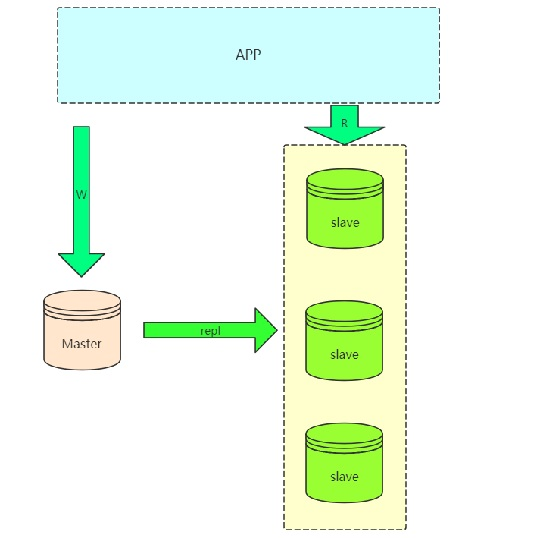
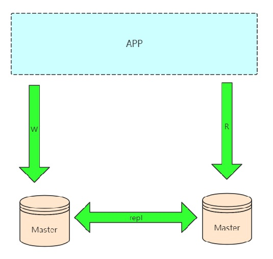
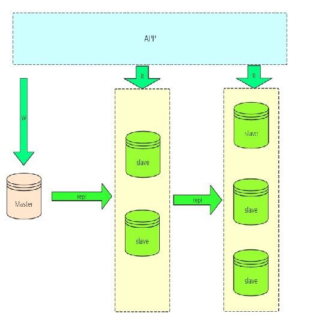
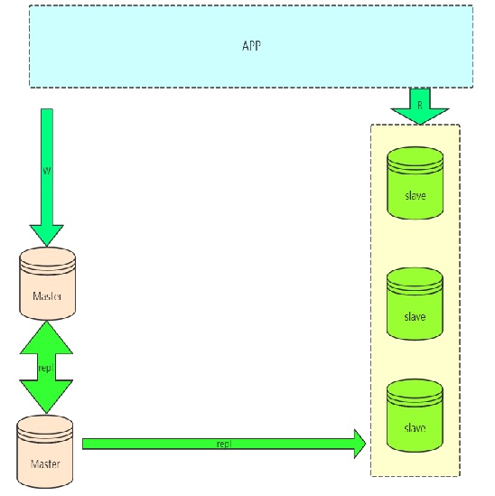
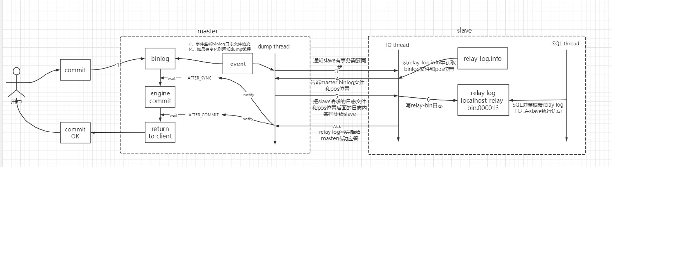
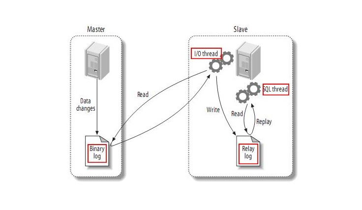

# 1. Mysql分表分库简介

## 1.1 Replication常用架构

### 1.1.1 数据库扩展解决了什么问题

1. **数据安全**

给主服务增加一个数据备份。基于这个目的，可以搭建主从架构，或者也可以基
于主从架构搭建互主的架构。

2. **读写分离**

对于大部分的JAVA业务系统来说，都是读多写少的，读请求远远高于写请求。这时，当主服务的访问压力过大时，可以将数据读请求转为由从服务来分担，主服务只负责数据写入的请求，这样大大缓解数据库的访问压力。

要理解，MySQL的主从架构只是实现读写分离的一个基础。实现读写分离还是需要一些中间件来支持，比如**ShardingSphere**。

3. **故障转移-高可用**

当MySQL主服务宕机后，可以由一台从服务切换成为主服务，继续提供数据读写功能。

对于高可用架构，主从数据的同步也只是实现故障转移的一个前提条件，**要实现MySQL主从切换，还需要依靠一些其他的中间件来实现。比如MMM、MHA、MGR**。

### 1.1.2 Master--Slaves

在实际应用场景中，MySQL 复制 90% 以上都是一个 Master 复制到一个或者多个Slave 的架构模式

:::tip 缺点：
1. master不能停机，停机就不能接收写请求
2. slave过多会出现延迟

3. 由于master需要进行常规维护停机了，那么必须要把一个slave提成master，选哪一个是一个问题？

   某一个slave提成master了，就存在当前master和之前的master数据不一致的情况，并且之前master并没有保存当前master节点的binlog文件和pos位置
:::

### 1.1.3 Dual Master复制架构(Master--Master) Master)

可以配合一个第三方的工具，比如keepalived轻松做到IP的漂移，停机维护也不会影响写操作。

### 1.1.4 级联复制架构(Master--Slaves--Slaves..)..)

如果读压力加大，就需要更多的slave来解决，但是如果slave的复制全部从master复制，势必会加大master的复制IO的压力，所以就出现了级联复制，减轻master压力。

缺点：slave延迟更加大了

### 1.1.5 Dual Master与级联复制结合架构(Master-Master-Slaves)

这样解决了单点master的问题，解决了slave级联延迟的问题.

## 1.2 Replication机制的实现原理

MySQL服务的主从架构一般都是通过**binlog日志文件来进行的**。

即在主服务上打开binlog记录每一步的数据库操作，然后从服务上会有一个**IO线程**，负责跟主服务建立一个TCP连接，请求主服务将binlog传输过来。

这时，主库上会有一个**IO dump线程**，负责通过这个TCP连接把Binlog日志传输给从库的IO线程。接着从服务的IO线程会把读取到的binlog日志数据写入自己的relay日志文件中。

然后从服务上另外一个SQL线程会读取relay日志里的内容，进行操作重演，达到还原数据的目的。我们通常对MySQL做的读写分离配置就必须基于主从架构来搭建

MySQL的binlog不光可以用于主从同步，还可以用于缓存数据同步等场景。

例如Canal，**可以模拟一个slave节点，向MySQL发起binlog同步，然后将数据落地到Redis、Kafka等其他组件，实现数据实时流转**

:::tip 搭建主从集群必要要求：
1. 双方MySQL必须版本一致。至少需要主服务的版本低于从服务
2. 两节点间的时间需要同步
:::

