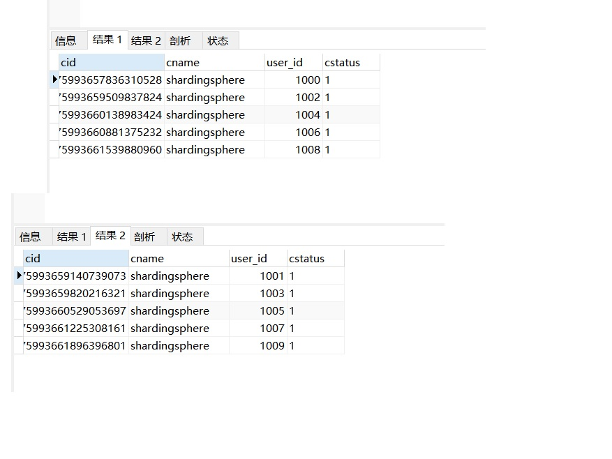
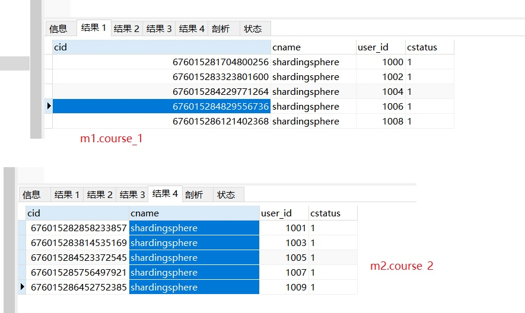
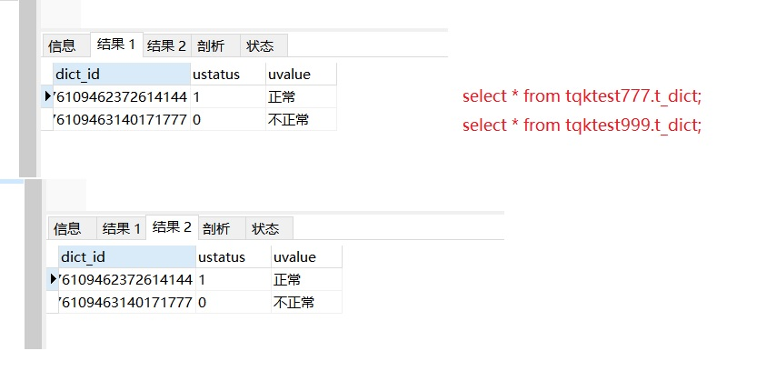
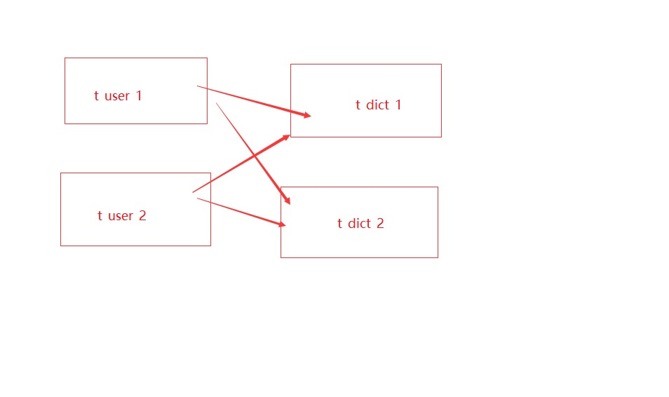

# 4. ShardingJDBC实战

## 4.1 核心概念

1. **逻辑表**：水平拆分的数据库的相同逻辑和数据结构表的总称
2. **真实表**：在分片的数据库中真实存在的物理表。
3. **数据节点**：数据分片的最小单元。由数据源名称和数据表组成
4. **绑定表**：分片规则一致的主表和子表。
5. **广播表**：也叫公共表，指素有的分片数据源中都存在的表，表结构和表中的数据在每个数据库中都完全一致。例如字典表。
6. **分片键**：用于分片的数据库字段，是将数据库(表)进行水平拆分的关键字段。SQL中若没有分片字段，将会执行全路由，性能会很差。
7. **分片算法**：通过分片算法将数据进行分片，支持通过=、BETWEEN和IN分片。分片算法需要由应用开发者自行实现，可实现的灵活度非常高。
8. **分片策略**：真正用于进行分片操作的是分片键+分片算法，也就是分片策略。在ShardingJDBC中一般采用基于Groovy表达式的inline分片策略，通过一个包含
分片键的算法表达式来制定分片策略，如t_user_$->{u_id%8}标识根据u_id模8，分成8张表，表名称为t_user_0到t_user_7。

## 4.2 ShardingJDBC的分片算法

ShardingJDBC的整个实战完成后，可以看到，整个分库分表的核心就是在于配置的分片算法。

我们的这些实战都是使用的inline分片算法，即提供一个分片键和一个分片表达式来制定分片算法。这种方式配置简单，功能灵活，是分库分表最佳的配置方式，并且对于绝大多数的分库分片场景来说，都已经非常好用了

但是如果**针对一些更为复杂的分片策略，例如多分片键、按范围分片等场景**，inline分片算法就有点力不从心了。所以我们还需要学习下ShardingSphere提供的其他几种分片策略

### 4.2.1 NoneShardingStrategy


不分片。这种严格来说不算是一种分片策略了。只是ShardingSphere也提供了这么一个配置

### 4.2.2 InlineShardingStrategy

**最常用的分片方式**

**配置参数**： inline.shardingColumn 分片键；inline.algorithmExpression分片表达式

**实现方式**： 按照分片表达式来进行分片。


### 4.2.3 StandardShardingStrategy

只支持单分片键的标准分片策略

:::tip 配置参数

1. standard.sharding-column 分片键；

2. standard.precise-algorithm-class-name 精确分片算法类名；

3. standard.range-algorithm-class-name 范围分片算法类名
:::

-----------------------------

:::tip 实现方式
1. shardingColumn指定分片算法。

2. preciseAlgorithmClassName 指向一个实现了
io.shardingsphere.api.algorithm.sharding.standard.PreciseShardingAl

3. gorithm接口的java类名，提供按照 = 或者 IN 逻辑的精确分片 
示例：
com.roy.shardingDemo.algorithm.MyPreciseShardingAlgorithm

4. rangeAlgorithmClassName 指向一个实现了
io.shardingsphere.api.algorithm.sharding.standard.RangeShardingAlg

5. orithm接口的java类名，提供按照Between 条件进行的范围分片。
示例：
com.roy.shardingDemo.algorithm.MyRangeShardingAlgorithm
:::

**说明**：  
其中**精确分片算法是必须提供的**，而范围分片算法则是可选的。

### 4.2.4 ComplexShardingStrategy

**支持多分片键的复杂分片策略**

:::tip 配置参数：
1. complex.sharding-columns 分片键(多个);
2. complex.algorithm-class-name 分片算法实现类。
:::

:::tip 实现方式：
1. shardingColumn指定多个分片列。

2. algorithmClassName指向一个实现了org.apache.shardingsphere.api.sharding.complex.ComplexKeysShardi

3. ngAlgorithm接口的java类名。提供按照多个分片列进行综合分片的算法。
:::

**示例：**
com.roy.shardingDemo.algorithm.MyComplexKeysShardingAlgorithm

---------------

### 4.2.5 HintShardingStrategy

不需要分片键的强制分片策略。这个分片策略，简单来理解就是说，他的分片键
不再跟SQL语句相关联，而是用程序另行指定。对于一些复杂的情况，例如
select count(*) from (select userid from t_user where userid in (1,3,5,7,9))
这样的SQL语句，就没法通过SQL语句来指定一个分片键。这个时候就可以通过
程序，给他另行执行一个分片键，例如在按userid奇偶分片的策略下，可以指定
1作为分片键，然后自行指定他的分片策略。

:::tip 配置参数：
hint.algorithm-class-name 分片算法实现类。
:::

:::tip 实现方式：
1. algorithmClassName指向一个实现了org.apache.shardingsphere.api.sharding.hint.HintShardingAlgorithm接口的java类名。 示例：com.roy.shardingDemo.algorithm.MyHintShardingAlgorithm


2. 在这个算法类中，同样是需要分片键的。而分片键的指定是通过
HintManager.addDatabaseShardingValue方法(分库)和
HintManager.addTableShardingValue(分表)来指定。

3. 使用时要注意，这个分片键是线程隔离的，只在当前线程有效，所以通常建
议使用之后立即关闭，或者用try资源方式打开。

4. 而Hint分片策略并没有完全按照SQL解析树来构建分片策略，是绕开
了SQL解析的，所有对某些比较复杂的语句，Hint分片策略性能有可
能会比较好(情况太多了，无法一一分析)。
:::

但是要注意，Hint强制路由在使用时有非常多的限制：

```sql
-- 不支持UNION 
SELECT * FROM t_order1 UNION SELECT * FROM t_order2 INSERT INTO tbl_name (col1, col2, …) SELECT col1, col2, … FROM tbl_name WHERE col3 = ? 
-- 不支持多层子查询 
SELECT COUNT(*) FROM (SELECT * FROM t_order o WHERE o.id IN (SELECT id FROM t_order WHERE status = ?)) 
-- 不支持函数计算。ShardingSphere只能通过SQL字面提取用于分片的值 
SELECT * FROM t_order WHERE to_date(create_time, 'yyyy-mm-dd') = '2019-01-01';
```


## 4.3 ShardingSphere的SQL使用限制

参见官网文档: [https://shardingsphere.apache.org/document/current/cn/features/sharding/use-norms/sql/] 

文档中详细列出了非常多ShardingSphere目前版本支持和不支持的SQL类型。这些东西要经常关注。


## 4.4 快速实战-分表

### 4.4.1 application.properties

```properties
#垂直分表策略
#配置真实数据源
spring.shardingsphere.datasource.names=m1
spring.shardingsphere.datasource.m1.type=com.alibaba.druid.pool.DruidDataSource
spring.shardingsphere.datasource.m1.driver-class-name=com.mysql.cj.jdbc.Driver
# serverTimezone=GMT%2B8 数据库查询时间问题
spring.shardingsphere.datasource.m1.url=jdbc:mysql://49.232.21.151:3310/tqktest777?useUnicode=true&characterEncoding=utf8&allowMultiQueries=true&serverTimezone=GMT%2B8
spring.shardingsphere.datasource.m1.username=root
spring.shardingsphere.datasource.m1.password=12345@tqk

#配置真实表分布
# 指定表的分布情况 配置表在哪个数据库里，表名是什么。水平分表，分两个表： m1.course_1,m1.course_2
spring.shardingsphere.sharding.tables.course.actual-data-nodes=m1.course_$->{1..2}
#主键生成策略
spring.shardingsphere.sharding.tables.course.key-generator.column=cid

#雪花算法
spring.shardingsphere.sharding.tables.course.key-generator.type=SNOWFLAKE
#雪花算法的一个可选参数
spring.shardingsphere.sharding.tables.course.key-generator.props.worker.id=1

#配置分表策略
# 选定计算的字段
spring.shardingsphere.sharding.tables.course.table-strategy.inline.sharding-column=cid
#指定分片策略 约定cid值为偶数添加到course_1表。如果是奇数添加到course_2表。
# 根据计算的字段算出对应的表名。
spring.shardingsphere.sharding.tables.course.table-strategy.inline.algorithm-expression=course_$->{cid%2+1}

#其他运行属性
# 打开sql日志输出。
spring.shardingsphere.props.sql.show = true
spring.main.allow-bean-definition-overriding=true

```
1. 首先定义一个数据源m1，并对m1进行实际的JDBC参数配置

2. spring.shardingsphere.sharding.tables.course开头的一系列属性即定义了一个名为**course的逻辑表**。

3. **actual-data-nodes属性即定义course逻辑表的实际数据分布情况**，他分布在m1.course_1和m1.course_2两个表。

4. **key-generator**属性配置了他的主键列以及主键生成策略。

5. ShardingJDBC默认提供了UUID和SNOWFLAKE两种分布式主键生成策略。

6. **table-strategy属性即配置他的分库分表策略**。分片键为cid属性。分片算法为course_$->{cid%2+1}，表示按照cid模2+1的结果，然后加上前面的course__ 部分作为前缀就是他的实际表结果。

**注意：** 这个表达式计算出来的结果需要能够与实际数据分布中的一种情况对应上，否则就会报错。

7. **sql.show**属性表示要在日志中打印实际SQL

### 4.4.2  测试案例

```java
@RunWith(SpringRunner.class)
@SpringBootTest
public class ShardingJDBCTest {
    @Resource
    CourseMapper courseMapper;

    /**
     * 取模分片策略
     */
    @Test
    public void addCourse(){
        for(int i = 0 ; i < 10 ; i ++){
            Course c = new Course();
//            c.setCid(Long.valueOf(i));
            c.setCname("shardingsphere");
            c.setUserId(Long.valueOf(""+(1000+i)));
            c.setCstatus("1");
            courseMapper.insert(c);
        }
    }
}
```
### 4.4.3 测试结果

```log
2021-12-10 09:17:28.267  INFO 34764 --- [           main] ShardingSphere-SQL                       : SQLStatement: InsertStatementContext(super=CommonSQLStatementContext(sqlStatement=org.apache.shardingsphere.sql.parser.sql.statement.dml.InsertStatement@3c19592c, tablesContext=org.apache.shardingsphere.sql.parser.binder.segment.table.TablesContext@413d2cd1), tablesContext=org.apache.shardingsphere.sql.parser.binder.segment.table.TablesContext@413d2cd1, columnNames=[cname, user_id, cstatus], insertValueContexts=[InsertValueContext(parametersCount=3, valueExpressions=[ParameterMarkerExpressionSegment(startIndex=59, stopIndex=59, parameterMarkerIndex=0), ParameterMarkerExpressionSegment(startIndex=62, stopIndex=62, parameterMarkerIndex=1), ParameterMarkerExpressionSegment(startIndex=65, stopIndex=65, parameterMarkerIndex=2), DerivedParameterMarkerExpressionSegment(super=ParameterMarkerExpressionSegment(startIndex=0, stopIndex=0, parameterMarkerIndex=3))], parameters=[shardingsphere, 1008, 1])], generatedKeyContext=Optional[GeneratedKeyContext(columnName=cid, generated=true, generatedValues=[675993661539880960])])
2021-12-10 09:17:28.267  INFO 34764 --- [           main] ShardingSphere-SQL                       : Actual SQL: m1 ::: INSERT INTO course_1  ( cname,
user_id,
cstatus , cid)  VALUES  (?, ?, ?, ?) ::: [shardingsphere, 1008, 1, 675993661539880960]
2021-12-10 09:17:28.352  INFO 34764 --- [           main] ShardingSphere-SQL                       : Logic SQL: INSERT INTO course  ( cname,
user_id,
cstatus )  VALUES  ( ?,
?,
? )
```

从这个日志中我们可以看到，程序中执行的Logic SQL经过ShardingJDBC处理后，被转换成了Actual SQL往数据库里执行。执行的结果可以在MySQL中看到，
course_1和course_2两个表中各插入了五条消息。这就是ShardingJDBC帮我们进行的数据库的分库分表操作。

<a data-fancybox title="mysql" href="./image/mysql46.jpg"></a>

------------------------------


## 4.5 快速实战-inline

**inline分片策略**

### 4.5.1 简单分库策略配置

```properties
#配置多个数据源
spring.shardingsphere.datasource.names=m1,m2

spring.shardingsphere.datasource.m1.type=com.alibaba.druid.pool.DruidDataSource
spring.shardingsphere.datasource.m1.driver-class-name=com.mysql.cj.jdbc.Driver
# serverTimezone=GMT%2B8 数据库查询时间问题
spring.shardingsphere.datasource.m1.url=jdbc:mysql://49.232.21.151:3310/tqktest777?useUnicode=true&characterEncoding=utf8&allowMultiQueries=true&serverTimezone=GMT%2B8
spring.shardingsphere.datasource.m1.username=root
spring.shardingsphere.datasource.m1.password=12345@tqk

spring.shardingsphere.datasource.m2.type=com.alibaba.druid.pool.DruidDataSource
spring.shardingsphere.datasource.m2.driver-class-name=com.mysql.cj.jdbc.Driver
spring.shardingsphere.datasource.m2.url=jdbc:mysql://49.232.21.151:3310/tqktest999?useUnicode=true&characterEncoding=utf8&allowMultiQueries=true&serverTimezone=GMT%2B8
spring.shardingsphere.datasource.m2.username=root
spring.shardingsphere.datasource.m2.password=12345@tqk

#真实表分布，分库，分表
spring.shardingsphere.sharding.tables.course.actual-data-nodes=m$->{1..2}.course_$->{1..2}

spring.shardingsphere.sharding.tables.course.key-generator.column=cid
spring.shardingsphere.sharding.tables.course.key-generator.type=SNOWFLAKE
spring.shardingsphere.sharding.tables.course.key-generator.props.worker.id=1

#inline分片策略
## 这种方式存在的问题是只能存到m1.course_1 m2.course_2两张表
# 分表
spring.shardingsphere.sharding.tables.course.table-strategy.inline.sharding-column=cid
spring.shardingsphere.sharding.tables.course.table-strategy.inline.algorithm-expression=course_$->{cid%2+1}
# 分库
spring.shardingsphere.sharding.tables.course.database-strategy.inline.sharding-column=cid
spring.shardingsphere.sharding.tables.course.database-strategy.inline.algorithm-expression=m$->{cid%2+1}
#-------------------------
spring.shardingsphere.props.sql.show = true
spring.main.allow-bean-definition-overriding=true

```

### 4.5.2  测试案例

```java
@RunWith(SpringRunner.class)
@SpringBootTest
public class ShardingJDBCTest {
    @Resource
    CourseMapper courseMapper;

    /**
     * 取模分片策略
     */
    @Test
    public void addCourse(){
        for(int i = 0 ; i < 10 ; i ++){
            Course c = new Course();
//            c.setCid(Long.valueOf(i));
            c.setCname("shardingsphere");
            c.setUserId(Long.valueOf(""+(1000+i)));
            c.setCstatus("1");
            courseMapper.insert(c);
        }
    }

    /**
     * 查询测试
     */
    @Test
    public void queryCourse(){
        //select * from course
        QueryWrapper<Course> wrapper = new QueryWrapper<>();
        wrapper.orderByDesc("cid");
//        wrapper.eq("cid",676015284523372545L);
        List<Long> cidList = new ArrayList<>();
        cidList.add(676015284523372545L);
        cidList.add(676015286452752385L);
        cidList.add(676015284829556736L);
        wrapper.in("cid", cidList);
        List<Course> courses = courseMapper.selectList(wrapper);
        System.out.println("查询结果：");
        courses.forEach(course -> System.out.println(course.toString()));
    }
}
```

### 4.5.3 测试结果

<a data-fancybox title="mysql" href="./image/mysql47.jpg"></a>

```log
查询结果：
Course{cid=676015286452752385, cname='shardingsphere', userId=1009, cstatus='1'}
Course{cid=676015284829556736, cname='shardingsphere', userId=1006, cstatus='1'}
Course{cid=676015284523372545, cname='shardingsphere', userId=1005, cstatus='1'}
```
------------------------------


**inline无法支持between范围查询**

## 4.6 快速实战-standard

### 4.6.1 配置文件

**standard支持between范围查询**

```properties
#standard标准分片策略
spring.shardingsphere.sharding.tables.course.table-strategy.standard.sharding-column=cid
# 表精准查询算法
spring.shardingsphere.sharding.tables.course.table-strategy.standard.precise-algorithm-class-name=com.tqk.algorithem.MyPreciseTableShardingAlgorithm
# 表范围查询算法
spring.shardingsphere.sharding.tables.course.table-strategy.standard.range-algorithm-class-name=com.tqk.algorithem.MyRangeTableShardingAlgorithm

spring.shardingsphere.sharding.tables.course.database-strategy.standard.sharding-column=cid
# 库精准查询算法
spring.shardingsphere.sharding.tables.course.database-strategy.standard.precise-algorithm-class-name=com.tqk.algorithem.MyPreciseDSShardingAlgorithm
# 库范围查询算法
spring.shardingsphere.sharding.tables.course.database-strategy.standard.range-algorithm-class-name=com.tqk.algorithem.MyRangeDSShardingAlgorithm
```

### 4.6.2 自定义分片策略

```java
package com.tqk.algorithem;

import org.apache.shardingsphere.api.sharding.standard.PreciseShardingAlgorithm;
import org.apache.shardingsphere.api.sharding.standard.PreciseShardingValue;

import java.math.BigInteger;
import java.util.Collection;

/**
 * @author
 * @date ：
 * @description:库精准查询算法
 **/

public class MyPreciseDSShardingAlgorithm implements PreciseShardingAlgorithm<Long> {
    //select * from course where cid = ? or cid in (?,?)
    @Override
    public String doSharding(Collection<String> availableTargetNames, PreciseShardingValue<Long> shardingValue) {
        String logicTableName = shardingValue.getLogicTableName();
        String cid = shardingValue.getColumnName();
        Long cidValue = shardingValue.getValue();
        //todo 实现 course_$->{cid%2+1)
        BigInteger shardingValueB = BigInteger.valueOf(cidValue);
        BigInteger resB = (shardingValueB.mod(new BigInteger("2"))).add(new BigInteger("1"));
        //todo 库名
        String key = "m"+resB;
        if(availableTargetNames.contains(key)){
            return key;
        }
        //todo couse_1, course_2
        throw new UnsupportedOperationException("route "+ key +" is not supported ,please check your config");
    }
}

```
---------------------

```java
package com.tqk.algorithem;

import org.apache.shardingsphere.api.sharding.standard.PreciseShardingAlgorithm;
import org.apache.shardingsphere.api.sharding.standard.PreciseShardingValue;

import java.math.BigInteger;
import java.util.Collection;

/**
 * @author ：
 * @date ：
 * @description: 表精准查询算法
 **/

public class MyPreciseTableShardingAlgorithm implements PreciseShardingAlgorithm<Long> {
    //select * from course where cid = ? or cid in (?,?)
    @Override
    public String doSharding(Collection<String> availableTargetNames, PreciseShardingValue<Long> shardingValue) {
        String logicTableName = shardingValue.getLogicTableName();
        //todo 获取列名
        String cid = shardingValue.getColumnName();
        Long cidValue = shardingValue.getValue();
        //todo 实现 course_$->{cid%2+1) 取模运算
        BigInteger shardingValueB = BigInteger.valueOf(cidValue);
        BigInteger resB = (shardingValueB.mod(new BigInteger("2"))).add(new BigInteger("1"));
        String key = logicTableName+"_"+resB;
        if(availableTargetNames.contains(key)){
            return key;
        }
        //todo couse_1, course_2
        throw new UnsupportedOperationException("route "+ key +" is not supported ,please check your config");
    }
}

```
---------------------

```java
package com.tqk.algorithem;

import org.apache.shardingsphere.api.sharding.standard.RangeShardingAlgorithm;
import org.apache.shardingsphere.api.sharding.standard.RangeShardingValue;

import java.util.Arrays;
import java.util.Collection;

/**
 * @author ：
 * @date ：
 * @description:库范围查询算法
 **/

public class MyRangeDSShardingAlgorithm implements RangeShardingAlgorithm<Long> {
    @Override
    public Collection<String> doSharding(Collection<String> availableTargetNames, RangeShardingValue<Long> shardingValue) {
        //todo select * from course where cid between 1 and 100;
        Long upperVal = shardingValue.getValueRange().upperEndpoint();//100
        Long lowerVal = shardingValue.getValueRange().lowerEndpoint();//1

        String logicTableName = shardingValue.getLogicTableName();
        return Arrays.asList("m1","m2");
    }
}

```
---------------------

```java
package com.tqk.algorithem;

import org.apache.shardingsphere.api.sharding.standard.RangeShardingAlgorithm;
import org.apache.shardingsphere.api.sharding.standard.RangeShardingValue;

import java.util.Arrays;
import java.util.Collection;

/**
 * @author ：
 * @date ：Created in 2021/1/6
 * @description:表范围查询算法
 **/

public class MyRangeTableShardingAlgorithm implements RangeShardingAlgorithm<Long> {
    @Override
    public Collection<String> doSharding(Collection<String> availableTargetNames, RangeShardingValue<Long> shardingValue) {
        //todo select * from course where cid between 1 and 100; 范围查询
//        Long upperVal = shardingValue.getValueRange().upperEndpoint();//100
//        Long lowerVal = shardingValue.getValueRange().lowerEndpoint();//1
        //todo 设置表名策略
        String logicTableName = shardingValue.getLogicTableName();
        return Arrays.asList(logicTableName+"_1",logicTableName+"_2");
    }
}

```
---------------------


### 4.6.3 测试

```java
    /**
     * 查询测试
     */
    @Test
    public void queryCourse(){
        //select * from course
        QueryWrapper<Course> wrapper = new QueryWrapper<>();
        wrapper.orderByDesc("cid");
//        wrapper.eq("cid",676015284523372545L);
        List<Long> cidList = new ArrayList<>();
        cidList.add(676015284523372545L);
        cidList.add(676015286452752385L);
        cidList.add(676015284829556736L);
        wrapper.in("cid", cidList);
        List<Course> courses = courseMapper.selectList(wrapper);
        System.out.println("查询结果：");
        courses.forEach(course -> System.out.println(course.toString()));
    }

    /**
     * 范围查询
     */
    @Test
    public void queryOrderRange(){
        //select * from course
        QueryWrapper<Course> wrapper = new QueryWrapper<>();
        wrapper.between("cid",676021369531535361L,676021372056506369L);
//        wrapper.in()
        List<Course> courses = courseMapper.selectList(wrapper);
        courses.forEach(course -> System.out.println(course));
    }
```


**该种方式会每张表都进行一次范围查询**

---------------------

```log
2021-12-10 14:17:55.693  INFO 36988 --- [           main] ShardingSphere-SQL                       : Actual SQL: m1 ::: SELECT  cid,cname,user_id,cstatus  FROM course_1  
 WHERE  cid BETWEEN ? AND ? ::: [676021369531535361, 676021372056506369]
2021-12-10 14:17:55.693  INFO 36988 --- [           main] ShardingSphere-SQL                       : Actual SQL: m1 ::: SELECT  cid,cname,user_id,cstatus  FROM course_2  
 WHERE  cid BETWEEN ? AND ? ::: [676021369531535361, 676021372056506369]
2021-12-10 14:17:55.693  INFO 36988 --- [           main] ShardingSphere-SQL                       : Actual SQL: m2 ::: SELECT  cid,cname,user_id,cstatus  FROM course_1  
 WHERE  cid BETWEEN ? AND ? ::: [676021369531535361, 676021372056506369]
2021-12-10 14:17:55.693  INFO 36988 --- [           main] ShardingSphere-SQL                       : Actual SQL: m2 ::: SELECT  cid,cname,user_id,cstatus  FROM course_2  
 WHERE  cid BETWEEN ? AND ? ::: [676021369531535361, 676021372056506369]
```


## 4.7 快速实战-complex--复杂分片策略

### 4.7.1 配置文件

**complex--复杂分片策略**

```properties
#complex--复杂分片策略
spring.shardingsphere.sharding.tables.course.table-strategy.complex.sharding-columns= cid, user_id
spring.shardingsphere.sharding.tables.course.table-strategy.complex.algorithm-class-name=com.tqk.algorithem.MyComplexTableShardingAlgorithm
#
spring.shardingsphere.sharding.tables.course.database-strategy.complex.sharding-columns=cid, user_id
spring.shardingsphere.sharding.tables.course.database-strategy.complex.algorithm-class-name=com.tqk.algorithem.MyComplexDSShardingAlgorithm
```

### 4.7.2 自定义分片策略

```java
package com.tqk.algorithem;

import org.apache.shardingsphere.api.sharding.complex.ComplexKeysShardingAlgorithm;
import org.apache.shardingsphere.api.sharding.complex.ComplexKeysShardingValue;

import java.math.BigInteger;
import java.util.ArrayList;
import java.util.Collection;
import java.util.List;

/**
 * @author ：Complex
 * @date ：
 * @description:数据库分区精准策略
 **/

public class MyComplexDSShardingAlgorithm implements ComplexKeysShardingAlgorithm<Long> {
//todo     SELECT  cid,cname,user_id,cstatus  FROM course
//todo     WHERE  cid BETWEEN ? AND ? AND user_id = ?
    @Override
    public Collection<String> doSharding(Collection<String> availableTargetNames, ComplexKeysShardingValue<Long> shardingValue) {

        Collection<Long> userIdCol = shardingValue.getColumnNameAndShardingValuesMap().get("user_id");

        List<String> res = new ArrayList<>();

        for(Long userId: userIdCol){
            //todo course_{userID%2+1}
            BigInteger userIdB = BigInteger.valueOf(userId);
            BigInteger target = (userIdB.mod(new BigInteger("2"))).add(new BigInteger("1"));

            res.add("m"+target);
        }

        return res;
    }
}

```
---------------------

```java
package com.tqk.algorithem;

import org.apache.shardingsphere.api.sharding.complex.ComplexKeysShardingAlgorithm;
import org.apache.shardingsphere.api.sharding.complex.ComplexKeysShardingValue;

import java.math.BigInteger;
import java.util.ArrayList;
import java.util.Collection;
import java.util.List;

/**
 * @author ：Complex
 * @date ：Created in 2021/1/6
 * @description:表分区精准策略
 **/

public class MyComplexTableShardingAlgorithm implements ComplexKeysShardingAlgorithm<Long> {
    @Override
    public Collection<String> doSharding(Collection<String> availableTargetNames, ComplexKeysShardingValue<Long> shardingValue) {

        Collection<Long> userIdCol = shardingValue.getColumnNameAndShardingValuesMap().get("user_id");

        List<String> res = new ArrayList<>();

        for(Long userId: userIdCol){
            //todo course_{userID%2+1} userid取模
            BigInteger userIdB = BigInteger.valueOf(userId);
            BigInteger target = (userIdB.mod(new BigInteger("2"))).add(new BigInteger("1"));

            res.add(shardingValue.getLogicTableName()+"_"+target);
        }

        return res;
    }
}
```
---------------------
### 4.7.3 测试

```java
    @Test
    public void queryCourseComplex(){
        QueryWrapper<Course> wrapper = new QueryWrapper<>();
        wrapper.between("cid",676090372270592000L,676090376192266240L);
        wrapper.eq("user_id",1008L);
//        wrapper.in()
        List<Course> courses = courseMapper.selectList(wrapper);
        System.out.println("查询结果：");
        courses.forEach(course -> System.out.println(course));
    }
```

--------------

```log
2021-12-10 16:20:24.642  INFO 23080 --- [           main] ShardingSphere-SQL                       : Actual SQL: m1 ::: SELECT  cid,cname,user_id,cstatus  FROM course_1  
 WHERE  cid BETWEEN ? AND ? AND user_id = ? ::: [676090372270592000, 676090376192266240, 1008]
查询结果：
Course{cid=676090376192266240, cname='shardingsphere', userId=1008, cstatus='1'}
```

---------------------


## 4.8 快速实战-hint强制路由策略

### 4.8.1 配置文件

**hint强制路由策略**

```properties
#hint强制路由策略
spring.shardingsphere.sharding.tables.course.table-strategy.hint.algorithm-class-name=com.tqk.algorithem.MyHintTableShardingAlgorithm
```

### 4.7.2 自定义分片策略

```java
package com.tqk.algorithem;

import org.apache.shardingsphere.api.sharding.hint.HintShardingAlgorithm;
import org.apache.shardingsphere.api.sharding.hint.HintShardingValue;

import java.util.Arrays;
import java.util.Collection;

/**
 * @author ：楼兰
 * @date ：Created in 2021/1/6
 * @description:
 **/

public class MyHintTableShardingAlgorithm implements HintShardingAlgorithm<Integer> {
    @Override
    public Collection<String> doSharding(Collection<String> availableTargetNames, HintShardingValue<Integer> shardingValue) {
        String key = shardingValue.getLogicTableName() + "_" + shardingValue.getValues().toArray()[0];
        if(availableTargetNames.contains(key)){
            return Arrays.asList(key);
        }
        throw new UnsupportedOperationException("route "+ key +" is not supported ,please check your config");
    }
}

```
---------------------
---------------------

### 4.7.3 测试

```java
    /**
     * Hint--只查询表course_2
     */
    @Test
    public void queryCourseByHint(){
        HintManager hintManager = HintManager.getInstance();
        hintManager.addTableShardingValue("course",2);
        List<Course> courses = courseMapper.selectList(null);
        System.out.println("查询结果：");
        courses.forEach(course -> System.out.println(course));
        hintManager.close();
    }
```

--------------

```log
2021-12-10 16:43:16.674  INFO 37512 --- [           main] ShardingSphere-SQL                       : Actual SQL: m1 ::: SELECT  cid,cname,user_id,cstatus  FROM course_2
2021-12-10 16:43:16.674  INFO 37512 --- [           main] ShardingSphere-SQL                       : Actual SQL: m2 ::: SELECT  cid,cname,user_id,cstatus  FROM course_2
查询结果：
Course{cid=676090373243670529, cname='shardingsphere', userId=1001, cstatus='1'}
Course{cid=676090374103502849, cname='shardingsphere', userId=1003, cstatus='1'}
Course{cid=676090375072387073, cname='shardingsphere', userId=1005, cstatus='1'}
Course{cid=676090375777030145, cname='shardingsphere', userId=1007, cstatus='1'}
Course{cid=676090376494256129, cname='shardingsphere', userId=1009, cstatus='1'}
```

---------------------

## 4.9 广播表

### 4.9.1 配置信息
```properties
#广播表配置
spring.shardingsphere.sharding.broadcast-tables=t_dict,t_user
spring.shardingsphere.sharding.tables.t_dict.key-generator.column=dict_id
spring.shardingsphere.sharding.tables.t_dict.key-generator.type=SNOWFLAKE
```
### 4.9.2 测试

```java
    @Test
    public void addDict(){
        Dict d1 = new Dict();
        d1.setUstatus("1");
        d1.setUvalue("正常");
        dictMapper.insert(d1);

        Dict d2 = new Dict();
        d2.setUstatus("0");
        d2.setUvalue("不正常");
        dictMapper.insert(d2);
    }
```

<a data-fancybox title="mysql" href="./image/mysql48.jpg"></a>

## 4.10 绑定表

### 4.10.1 配置信息

```properties
spring.shardingsphere.datasource.names=m1

spring.shardingsphere.datasource.m1.type=com.alibaba.druid.pool.DruidDataSource
spring.shardingsphere.datasource.m1.driver-class-name=com.mysql.cj.jdbc.Driver
# serverTimezone=GMT%2B8 数据库查询时间问题
spring.shardingsphere.datasource.m1.url=jdbc:mysql://49.232.21.151:3310/tqktest777?useUnicode=true&characterEncoding=utf8&allowMultiQueries=true&serverTimezone=GMT%2B8
spring.shardingsphere.datasource.m1.username=root
spring.shardingsphere.datasource.m1.password=12345@tqk


spring.shardingsphere.sharding.tables.t_dict.actual-data-nodes=m1.t_dict_$->{1..2}

spring.shardingsphere.sharding.tables.t_dict.key-generator.column=dict_id
spring.shardingsphere.sharding.tables.t_dict.key-generator.type=SNOWFLAKE
spring.shardingsphere.sharding.tables.t_dict.key-generator.props.worker.id=1
#inline分片策略
spring.shardingsphere.sharding.tables.t_dict.table-strategy.inline.sharding-column=ustatus
spring.shardingsphere.sharding.tables.t_dict.table-strategy.inline.algorithm-expression=t_dict_$->{ustatus.toInteger()%2+1}

spring.shardingsphere.sharding.tables.user.actual-data-nodes=m1.t_user_$->{1..2}
spring.shardingsphere.sharding.tables.user.key-generator.column=user_id
spring.shardingsphere.sharding.tables.user.key-generator.type=SNOWFLAKE
spring.shardingsphere.sharding.tables.user.key-generator.props.worker.id=1
#inline分片策略
spring.shardingsphere.sharding.tables.user.table-strategy.inline.sharding-column=ustatus
spring.shardingsphere.sharding.tables.user.table-strategy.inline.algorithm-expression=t_user_$->{ustatus.toInteger()%2+1}

#绑定表示例
spring.shardingsphere.sharding.binding-tables[0]=user,t_dict

spring.shardingsphere.props.sql.show = true
spring.main.allow-bean-definition-overriding=true


```


### 4.10.2 测试类

```java
public interface UserMapper extends BaseMapper<User> {

    @Select("select u.user_id,u.username,d.uvalue ustatus from user u left join t_dict d on u.ustatus = d.ustatus")
    public List<User> queryUserStatus();
}
```


```java
/**
    * 绑定表示例
    */
@Test
public void queryUserStatus(){
    List<User> users = userMapper.queryUserStatus();
    users.forEach(user -> System.out.println(user));
}
```

#### 卡笛尔效应

```properties
#绑定表示例 不加改配置时
spring.shardingsphere.sharding.binding-tables[0]=user,t_dict
```

<a data-fancybox title="mysql" href="./image/mysql49.jpg"></a>

```log
2021-12-10 17:27:51.647  INFO 36056 --- [           main] ShardingSphere-SQL                       : Actual SQL: m1 ::: select u.user_id,u.username,d.uvalue ustatus from t_user_2 u left join t_dict_1 d on u.ustatus = d.ustatus
2021-12-10 17:27:51.647  INFO 36056 --- [           main] ShardingSphere-SQL                       : Actual SQL: m1 ::: select u.user_id,u.username,d.uvalue ustatus from t_user_2 u left join t_dict_2 d on u.ustatus = d.ustatus
2021-12-10 17:27:51.647  INFO 36056 --- [           main] ShardingSphere-SQL                       : Actual SQL: m1 ::: select u.user_id,u.username,d.uvalue ustatus from t_user_1 u left join t_dict_1 d on u.ustatus = d.ustatus
2021-12-10 17:27:51.647  INFO 36056 --- [           main] ShardingSphere-SQL                       : Actual SQL: m1 ::: select u.user_id,u.username,d.uvalue ustatus from t_user_1 u left join t_dict_2 d on u.ustatus = d.ustatus
User{userId=676116140073684993, username='user No 1', ustatus='null', uage=0}
User{userId=676116140878991361, username='user No 3', ustatus='null', uage=0}
User{userId=676116141512331265, username='user No 5', ustatus='null', uage=0}
User{userId=676116142196002817, username='user No 7', ustatus='null', uage=0}
User{userId=676116142804176897, username='user No 9', ustatus='null', uage=0}
User{userId=676116140073684993, username='user No 1', ustatus='正常', uage=0}
User{userId=676116140878991361, username='user No 3', ustatus='正常', uage=0}
User{userId=676116141512331265, username='user No 5', ustatus='正常', uage=0}
User{userId=676116142196002817, username='user No 7', ustatus='正常', uage=0}
User{userId=676116142804176897, username='user No 9', ustatus='正常', uage=0}
User{userId=676116139725557760, username='user No 0', ustatus='不正常', uage=0}
User{userId=676116140484726784, username='user No 2', ustatus='不正常', uage=0}
User{userId=676116141189369856, username='user No 4', ustatus='不正常', uage=0}
User{userId=676116141839486976, username='user No 6', ustatus='不正常', uage=0}
User{userId=676116142460243968, username='user No 8', ustatus='不正常', uage=0}
User{userId=676116139725557760, username='user No 0', ustatus='null', uage=0}
User{userId=676116140484726784, username='user No 2', ustatus='null', uage=0}
User{userId=676116141189369856, username='user No 4', ustatus='null', uage=0}
User{userId=676116141839486976, username='user No 6', ustatus='null', uage=0}
User{userId=676116142460243968, username='user No 8', ustatus='null', uage=0}
```
-----------------------------

```properties
#绑定表示例 加该配置时
spring.shardingsphere.sharding.binding-tables[0]=user,t_dict
```
---------------

```log
2021-12-10 17:35:15.713  INFO 18336 --- [           main] ShardingSphere-SQL                       : Actual SQL: m1 ::: select u.user_id,u.username,d.uvalue ustatus from t_user_1 u left join t_dict_1 d on u.ustatus = d.ustatus
2021-12-10 17:35:15.713  INFO 18336 --- [           main] ShardingSphere-SQL                       : Actual SQL: m1 ::: select u.user_id,u.username,d.uvalue ustatus from t_user_2 u left join t_dict_2 d on u.ustatus = d.ustatus
User{userId=676116139725557760, username='user No 0', ustatus='不正常', uage=0}
User{userId=676116140484726784, username='user No 2', ustatus='不正常', uage=0}
User{userId=676116141189369856, username='user No 4', ustatus='不正常', uage=0}
User{userId=676116141839486976, username='user No 6', ustatus='不正常', uage=0}
User{userId=676116142460243968, username='user No 8', ustatus='不正常', uage=0}
User{userId=676116140073684993, username='user No 1', ustatus='正常', uage=0}
User{userId=676116140878991361, username='user No 3', ustatus='正常', uage=0}
User{userId=676116141512331265, username='user No 5', ustatus='正常', uage=0}
User{userId=676116142196002817, username='user No 7', ustatus='正常', uage=0}
User{userId=676116142804176897, username='user No 9', ustatus='正常', uage=0}
```


## 4.11 读写分离

### 4.11.1 配置信息
```properties
#配置主从数据源，要基于MySQL主从架构
spring.shardingsphere.datasource.names=m0,s0

spring.shardingsphere.datasource.m0.type=com.alibaba.druid.pool.DruidDataSource
spring.shardingsphere.datasource.m0.driver-class-name=com.mysql.cj.jdbc.Driver
spring.shardingsphere.datasource.m0.url=jdbc:mysql://49.232.21.151:3310/tqktest777?useUnicode=true&characterEncoding=utf8&allowMultiQueries=true&serverTimezone=GMT%2B8
spring.shardingsphere.datasource.m0.username=root
spring.shardingsphere.datasource.m0.password=12345@tqk

spring.shardingsphere.datasource.s0.type=com.alibaba.druid.pool.DruidDataSource
spring.shardingsphere.datasource.s0.driver-class-name=com.mysql.cj.jdbc.Driver
spring.shardingsphere.datasource.s0.url=jdbc:mysql://49.232.21.151:3311/tqktest777?useUnicode=true&characterEncoding=utf8&allowMultiQueries=true&serverTimezone=GMT%2B8
spring.shardingsphere.datasource.s0.username=root
spring.shardingsphere.datasource.s0.password=12345@tqk
#读写分离规则， m0 主库，s0 从库
spring.shardingsphere.sharding.master-slave-rules.ds0.master-data-source-name=m0
spring.shardingsphere.sharding.master-slave-rules.ds0.slave-data-source-names[0]=s0
#基于读写分离的表分片
spring.shardingsphere.sharding.tables.t_dict.actual-data-nodes=ds0.t_dict
spring.shardingsphere.sharding.tables.t_dict.key-generator.column=dict_id
spring.shardingsphere.sharding.tables.t_dict.key-generator.type=SNOWFLAKE
spring.shardingsphere.sharding.tables.t_dict.key-generator.props.worker.id=1

spring.shardingsphere.props.sql.show = true
spring.main.allow-bean-definition-overriding=true


```


```
#基于读写分离的表分片
spring.shardingsphere.sharding.tables.t_dict.actual-data-nodes=ds0.t_dict_$->{1..2}

spring.shardingsphere.sharding.tables.t_dict.key-generator.column=dict_id
spring.shardingsphere.sharding.tables.t_dict.key-generator.type=SNOWFLAKE
spring.shardingsphere.sharding.tables.t_dict.key-generator.props.worker.id=1

#inline分片策略
# 分表
spring.shardingsphere.sharding.tables.course.table-strategy.inline.sharding-column=dict_id
spring.shardingsphere.sharding.tables.course.table-strategy.inline.algorithm-expression=course_$->{dict_id%2+1}
```

### 4.11.2 测试类

```java
    /**
     * 读写分离
     */
    @Test
    public void addDictByMS(){
        Dict d1 = new Dict();
        d1.setUstatus("1");
        d1.setUvalue("正常");
        dictMapper.insert(d1);

        Dict d2 = new Dict();
        d2.setUstatus("0");
        d2.setUvalue("不正常");
        dictMapper.insert(d2);
    }

    /**
     * 读写分离
     */
    @Test
    public void queryDictByMS(){
        List<Dict> dicts = dictMapper.selectList(null);
        dicts.forEach(dict -> System.out.println(dict));
    }
```

```log
2021-12-10 17:44:46.961  INFO 10100 --- [           main] ShardingSphere-SQL                       : Actual SQL: s0 ::: SELECT  dict_id,ustatus,uvalue  FROM t_dict
Dict{dictId=676121103369768960, ustatus='1', uvalue='正常'}
Dict{dictId=676121104338653185, ustatus='0', uvalue='不正常'}
```
