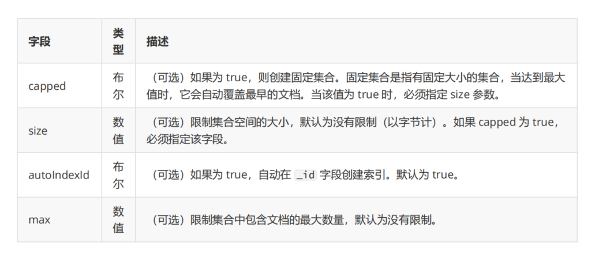

# 4.MongoDB基本操作

## 4.1 Database 操作

### 4.1.1 创建数据库
在 MongoDB 中创建数据库的命令使用的是 use 命令。该命令有两层含义：
- 切换指定数据库；
- 如果切换的数据库不存在，则创建该数据库。

用 use mydb 创建一个数据库。

```sh
use mymongo
```

### 4.1.2 查询数据库
 执行 db 命令可以显示当前所在的数据库

```sh
> use mymongo
switched to db mymongo
> db
mymongo
```

若想查看所有数据库，可以通过 show dbs 或者 show databases 命令查看。

```sh
> db.user.insert({"name": "zhangsan"})
WriteResult({ "nInserted" : 1 })
> show dbs
READ__ME_TO_RECOVER_YOUR_DATA  0.000GB
admin                          0.000GB
config                         0.000GB
local                          0.000GB
mymongo                        0.000GB
test                           0.000GB

```
### 4.1.3 删除数据库

删除数据库需要切换到需要删除的数据库中，且登录用户具有 dbAdmin 或 dbAdminAnyDatabase 或更高权
限，执行 db.dropDatabase() 。

```sh
> db.dropDatabase()
{ "ok" : 1 }
> show dbs
READ__ME_TO_RECOVER_YOUR_DATA  0.000GB
admin                          0.000GB
config                         0.000GB
local                          0.000GB
test                           0.000GB

```

## 4.2 Collection 操作

MongoDB 中的集合是一组文档的集，相当于关系型数据库中的表。

### 4.2.1 创建集合

MongoDB 使用 `db.createCollection()`函数来创建集合。

语法格式： `db.createCollection(name, options)` 

- name：要创建的集合名称。
- options：可选参数，指定有关内存大小及索引的选项。

<a data-fancybox title="" href="./image/MongoDB03.png"></a>

创建一个默认选项的集合命令如下：

```sh
> db.createCollection("c1")
{ "ok" : 1 }

```
**提示**：其实在 MongoDB 中创建文档时会自动创建集合，除非你对创建的集合有特殊的需求。

```sh
# 方式一：
db.c2.insert({"a":1}) # 当第一个文档插入时，集合就会被创建并包含该文档
# 方式二：
db.c3 
# 创建一个空集合，里面没有数据时通过 show tables 或 show collections 是无法查看到的。需要向集合中插入一个文档才能看见。
```

### 4.2.2 查看集合
- 通过 show tables 或 show collections 查看所有集合。

```sh
> show tables
c1
c2
user
> show collections
c1
c2
user

```

- 通过 db.COLLECTION_NAME.stats() 查看集合详情。
```sh
> db.c3.stats()
{
	"ns" : "test.c3",
	"size" : 0,
	"count" : 0,
	"storageSize" : 0,
	"totalSize" : 0,
	"nindexes" : 0,
	"totalIndexSize" : 0,
	"indexSizes" : {
		
	},
	"scaleFactor" : 1,
	"ok" : 1
}
```

### 4.2.3 删除集合
 通过 db.COLLECTION_NAME.drop() 删除集合。

```sh
>  db.user.drop() 
true
> show collections
c1
c2

```

## 4.3 Document 操作

接下来的操作我们在 GUI 可视化管理工具 Studio 3T 中完成。

### 4.3.1 插入文档

#### 单条插入

可以使用 insert/insertOne/save 

:::tip 插入单条文档：
- db.c1.insert({"name":"a"})
- db.c1.insertOne({"name":"a"})
- db.c1.save({"name":"a"})
:::

##### insert
 通过 db.COLLECTION_NAME.insert(document) 插入文档。

 插入文档时如果没有指定 _id 则默认为 ObjectId 类型， _id 不能重复，且在插入后不可变。
```sh
user1 = { 
 "name":"zhangsan", 
 "age":18, 
 "hobbies":["music", "read"], 
 "addr":{ 
 "country":"China", 
 "city":"BJ" 
 } 
} 
db.user.insert(user1)
```

##### insertOne
 在 MongoDB 3.2 版本以后，提供了 insertOne() 函数用于插入单条文档。

 ```sh
 user2 = { 
 "_id":"2", 
 "name":"lisi", 
 "age":20, 
 "hobbies":["music", "read"], 
 "addr":{ 
 "country":"China", 
 "city":"SH" 
 } 
} 
db.user.insertOne(user2)
```

##### save
 插入文档也可以使用 db.COLLECTION_NAME.save(document) 命令。

 如果不指定 _id 字段 save() 方法等同于 insert() 方法。如果指定 _id 字段，则变为更新文档的操作。

 ```sh
 user3 = { 
 "_id":"3", 
 "name":"wangwu", 
 "age":20, 
 "hobbies":["music", "read"], 
 "addr":{ 
 "country":"China", 
 "city":"SZ" 
 } 
} 
db.user.save(user3)
```

### 4.3.2 批量插入

可以使用 insert/insertMany/save 插入多条文档。

区别在于把单条插入时函数参数的对象类型 {} 变成数组
类型 [{}, {}] ：

- db.c1.insert([{name:"a"}, {name:"b"}])
- db.c1.insertMany([{name:"a"}, {name:"b"}])
- db.c1.save([{name:"a"}, {name:"b"}])

```json
user1 = { 
 "_id":1, 
 "name":"zhangsan", 
 "age":1, 
 "hobbies":["music", "read"], 
 "addr":{ 
 "country":"China", 
 "city":"BJ" 
 } 
} 
user2 = { 
 "_id":2, 
 "name":"lisi", 
 "age":2, 
 "hobbies":["music", "read"], 
 "addr":{ 
 "country":"China", 
 "city":"SH" 
 } 
} 
user3 = { 
 "_id":3, 
 "name":"wangwu", 
 "age":3, 
 "hobbies":["music", "read"], 
 "addr":{ 
 "country":"China", 
 "city":"GZ" 
 } 
} 
user4 = { 
 "_id":4, 
 "name":"zhaoliu", 
 "age":4, 
 "hobbies":["music", "read"], 
 "addr":{ 
 "country":"China", 
 "city":"SZ" 
 } 
} 
user5 = { 
 "_id":5, 
 "name":"tianqi", 
 "age":5, 
 "hobbies":["music", "read"], 
 "addr":{ 
 "country":"China", 
 "city":"TY" 
 }
}
```

```mongodb
db.users.insert([user1, user2, user3, user4, user5])
db.users.insertMany([user1, user2, user3, user4, user5])
db.users.save([user1, user2, user3, user4, user5])
```

## 4.4 更新文档

### 4.4.1 update函数

通过 update 系列函数或者 save 函数可以更新集合中的文档。我们来详细看下 update 函数的使用，上一节
已经介绍过 save 函数

update() 函数用于更新已存在的文档。语法格式如下：
`db.COLLECTION_NAME.update(query, update, options)`

- `query` ：update 的查询条件，类似 SQL update 语句中的 where 部分。
- `update` ：update 的对象和一些更新的操作符（如 $set，$inc...）等，也可以理解为 SQL update 语句中的 set
部分。
- `upsert` ：可选，如果不存在 update 的文档，是否插入该文档。true 为插入，默认是 false，不插入。
- `multi` ：可选，是否批量更新。true 表示按条件查询出来的多条记录全部更新，false 只更新找到的第一条记
录，默认是 false

```sh
user = { 
 "name":"wangwu111", 
 "age":20, 
 "hobbies":["music", "read"], 
 "addr":{ 
 "country":"China", 
 "city":"BJ" 
 } 
} 
# 修改单条
db.user.updateOne({"name":"lisi"}, {"$set": user}) 
# 查找到的匹配数据如果是多条，只会修改第一条
db.user.update({"name":"lisi"}, user) # 修改单条等价于 updateOne() 
# 查找到的匹配数据如果是多条，修改所有匹配到的记录
db.user.update({"name":"lisi"}, {"$set": user}, false, true) # 修改多条
db.user.updateMany({"name":"张三123123"}, {"$set": user}) # 修改多条
```

## 4.5 删除文档
 
 通过 remove() 函数是用来移除集合中的数据,其语法格式如下所示：
`db.COLLECTION_NAME.remove(<query>, {justOne: <boolean>}) `
- query ：(可选)删除的文档的条件。
- justOne ：(可选)如果设为 true，则只删除一个文档，False删除所有匹配的数据
 等价于

```sh
#删除符合条件的第一个文档
db.user.deleteOne(<query>) 
#删除所有数据命令
db.user.remove({}) 
#清空该集合(表) 等价于上一条
db.user.deleteMany({})
```
## 4.6 查询文档

### 4.6.1 查询所有

:::tip 查询数据的语法格式如下：
```sh
# 等同于db.user.find({}) 
db.user.find() 

# 去重
db.user.distinct('name')
```
:::

```sh
> db.user.find()
{ "_id" : ObjectId("623b4226c9760000e4000550"), "name" : "zhangsan", "age" : 18, "hobbies" : [ "music", "read" ], "addr" : { "country" : "China", "city" : "BJ" } }
{ "_id" : "3", "name" : "wangwu", "age" : 20, "hobbies" : [ "music", "read" ], "addr" : { "country" : "China", "city" : "SZ" } }
{ "_id" : "2", "name" : "wangwu111", "age" : 20, "hobbies" : [ "music", "read" ], "addr" : { "country" : "China", "city" : "BJ" } }

```
## 4.7 索引