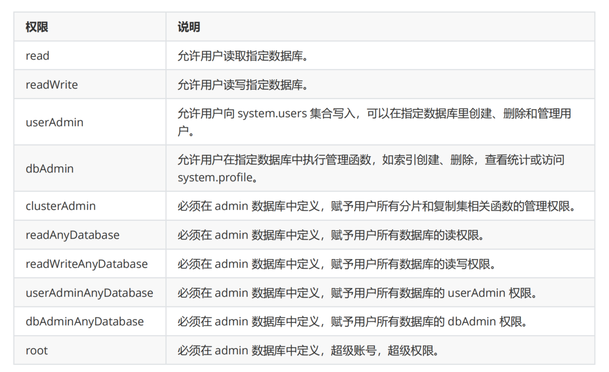

# 3.MongoDB用户权限管理

MongoDB 作为时下最为热门的数据库，其安全验证也是必不可少的，否则一个没有验证的数据库暴露出去，任
何人可随意操作，这将是非常危险的。不信请看以下各网友们的惨痛经历，你就明白了。


## 3.1 常用权限

<a data-fancybox title="" href="./image/MongoDB02.png"></a>

## 3.2 创建管理用户

MongoDB 有一个用户管理机制，简单描述为`管理用户组`，这个组的用户是专门为管理普通用户而设的，暂且称之为`管理员`。

管理员通常没有数据库的读写权限，只有操作用户的权限，我们只需要赋予管理员 `userAdminAnyDatabase` 角色即可。另外管理员账户必须在admin数据库下创建。


由于用户被创建在哪个数据库下，就只能在哪个数据库登录，所以把所有的用户都创建在 admin 数据库
下。这样我们切换数据库时就不需要频繁的进行登录了。
 
先 use admin 切换至 admin 数据库进行登录，登录后再 use 切换其他数据库进行操作即可。第二次的
use 就不需要再次登录了。MongoDB 设定 use 第二个数据库时如果登录用户权限比较高就可以直接操作第二
个数据库，而不需要登录。

### 3.2.1 切换数据库
管理员需要在 admin 数据库下创建，所以我们需要先切换至 admin 数据库

```sh
[root@VM-16-5-centos ~]# docker exec -it  mongodb  mongo admin
> use admin
switched to db admin
```

### 3.2.2 查看用户
通过 db.system.users.find() 函数查看 admin 数据库中的所有用户信息

```sh
# 查看用户 
>  db.system.users.find()
```

目前 admin 数据库中并没有用户，所以查无结果。

### 3.2.3 创建用户

在 MongoDB 中可以使用 db.createUser({用户信息}) 函数创建用户。

```sh
db.createUser({ 
   user: "<name>",
   pwd: "<cleartext password>",
   customData: { <any information> },
   roles: [
       { role: "<role>", db: "<database>" } | "<role>",
       ...
   ]
});
```
----------------------------

- `user` ：用户名
- `pwd` ：密码
- `customData` ：存放用户相关的自定义数据，该属性也可忽略
- `roles` ：数组类型，配置用户的权限

```sh
db.createUser({user:"tqk001",pwd:"tqk001",roles:[{role:"userAdminAnyDatabase",db:"admin"}]})
```

### 3.2.4 重启服务

管理员账户创建完成以后，需要重新启动 MongoDB，并开启身份验证功能。
先通过 db.shutdownServer() 函数关闭服务。

```sh
 > db.shutdownServer()
[root@VM-16-5-centos ~]# 
```

本文是通过指定配置文件的方式启动的 MongoDB，所以修改配置信息，启用身份验证功能，然后重启服务。完整配置信息如下：
```sh
# 数据文件存放目录
dbpath = /usr/local/mongodb/data/db
# 日志文件存放目录
logpath = /usr/local/mongodb/logs/mongodb.log
# 以追加的方式记录日志
logappend = true
# 端口默认为 27017
port = 27017
# 以守护进程的方式启用，即在后台运行
fork = true
# 对访问 IP 地址不做限制
bind_ip = 0.0.0.0
# 启动身份验证
auth = true
```

### 3.2.5 身份认证

重启服务以后切换至 admin 数据库，此时再通过 db.system.users.find() 函数或者 show users 查看
admin 数据库中的所有用户信息时，就会返回以下信息。

```sh
# 登陆成功
> db.auth("tqk001","tqk001")
1
#查看用户
> show users
{
	"_id" : "admin.tqk001",
	"userId" : UUID("30ce006f-fba5-4604-91f9-ca41f925dfef"),
	"user" : "tqk001",
	"db" : "admin",
	"roles" : [
		{
			"role" : "userAdminAnyDatabase",
			"db" : "admin"
		}
	],
	"mechanisms" : [
		"SCRAM-SHA-1",
		"SCRAM-SHA-256"
	]
}
```

## 3.3 创建普通用户

需求：创建一个 test 数据库，给这个数据库添加一个用户，用户名为 testuser，密码为 123456。并授予该用户对 test 数据库的读写操作权限。

### 3.3.1 创建数据库

管理员登录数据库普通用户需要由管理员用户创建，所以先使用管理员用户登录数据库。

打开一个新的客户端连接，切换至 test 数据库，执行文档插入语句，返回信息如下：

```sh
> use admin
switched to db admin
> db.auth("tqk001", "tqk001")
```
MongoDB 没有特定创建数据库的语法，在使用 use 切换数据库时，`如果对应的数据库不存在则直接创建并切换`。

```sh
> use test
switched to db test

```
### 3.3.2 创建用户

```sh
> db.createUser({user:"testuser",pwd:"123456",roles:[{role:"readWrite",db:"test"}]})
Successfully added user: {
	"user" : "testuser",
	"roles" : [
		{
			"role" : "readWrite",
			"db" : "test"
		}
	]
}

```

### 3.3.3 身份认证
 打开一个新的客户端连接，切换至 test 数据库，执行文档插入语句，返回信息如下：

 ```sh
 > use test
switched to db test
## 开启用户认证是写不进去
> db.user.insert({"name": "zhangsan"})
WriteCommandError({
 "ok" : 0,
 "errmsg" : "command insert requires authentication",
 "code" : 13,
 "codeName" : "Unauthorized"
})
```

```sh
## 登录 testuser
>  db.auth("testuser", "123456")
1
> db.user.insert({"name": "zhangsan"})
WriteResult({ "nInserted" : 1 })
> db.user.find()
{ "_id" : ObjectId("623b26f4016d5958ec004f2a"), "name" : "zhangsan" }
{ "_id" : ObjectId("623b2734016d5958ec004f2b"), "name" : "zhangsan" }
```

## 3.4 更新用户

### 3.4.1 更新角色
如果我们需要对已存在的用户进行角色修改，可以使用 db.updateUser() 函数来更新用户角色。注意：执行该函数需要当前用户具有 userAdmin 或 userAdminAnyDatabse 或 root 角色。

```sh
db.updateUser("用户名", {"roles":[{"role":"角色名称",db:"数据库"},{"更新项2":"更新内容"}]})
```
比如给刚才的 tqk001 用户再添加 readWriteAnyDatabase 和 dbAdminAnyDatabase 权限。

```sh
db.updateUser("tqk001", {"roles":[{"role":"userAdminAnyDatabase",db:"admin"},{role:"readWriteAnyDatabase",db:"admin"},{role:"dbAdminAnyDatabase",db:"admin"}]})

## 查看用户
> show users
{
	"_id" : "admin.tqk001",
	"userId" : UUID("30ce006f-fba5-4604-91f9-ca41f925dfef"),
	"user" : "tqk001",
	"db" : "admin",
	"roles" : [
		{
			"role" : "readWriteAnyDatabase",
			"db" : "admin"
		},
		{
			"role" : "userAdminAnyDatabase",
			"db" : "admin"
		},
		{
			"role" : "dbAdminAnyDatabase",
			"db" : "admin"
		}
	],
	"mechanisms" : [
		"SCRAM-SHA-1",
		"SCRAM-SHA-256"
	]
}

```

### 3.4.2 更新密码

 更新用户密码有以下两种方式，更新密码时需要切换到该用户所在的数据库。注意：需要使用具有 userAdmin
或 userAdminAnyDatabse 或 root 角色的用户执行：

- 使用 db.updateUser("用户名", {"pwd":"新密码"}) 函数更新密码
- 使用 db.changeUserPassword("用户名", "新密码") 函数更新密码

## 3.5 删除用户

通过 `db.dropUser()` 函数可以删除指定用户，删除成功以后会返回 true。删除用户时需要切换到该用户所在的数据库。

**注意**：需要使用具有 userAdmin 或 userAdminAnyDatabse 或 root 角色的用户才可以删除其他用户。

```sh
> db.dropUser("testuser") 
true 
> show users
```

