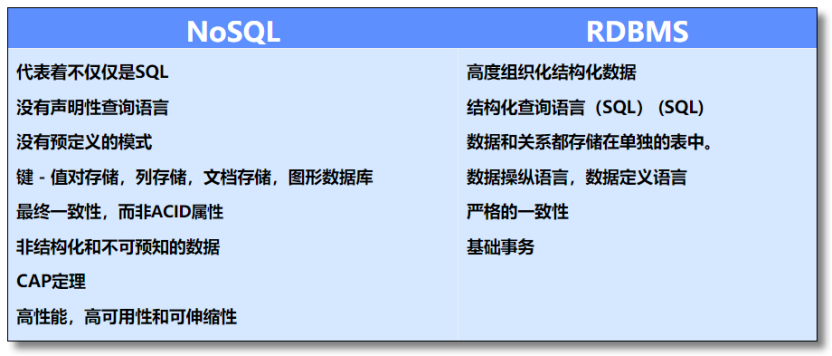

# 1. MongoDB简介

随着互联网的飞速发展与普及，网民上网冲浪时所产生数据也逐日增多，从 GB 到 TB 到 PB。这些数据有很大一
部分都是由关系型数据库管理系统（RDBMS）来进行处理的。
 
 由于关系型数据库的范式约束、事务特性、磁盘 IO 等特点，若服务器使用关系型数据库，当有大量数据产生
时，传统的关系型数据库已经无法满足快速查询与插入数据的需求。NoSQL 的出现解决了这一危机。它通过降低数
据的安全性，减少对事务的支持，减少对复杂查询的支持，获取性能上的提升。但是，在某些特定场景下 NoSQL 仍
然不是最佳人选，比如一些绝对要有事务与安全指标的场景。
 
 NoSQL 是一项全新的数据库革命性运动，早期就有人提出，发展至 2009 年趋势越发高涨。NoSQL 的拥护者们
提倡运用非关系型的数据存储，相对于铺天盖地的关系型数据库运用，这一概念无疑是一种全新的思维的注入。

Mongo 并非芒果（Mango）的意思，而是源于 Humongous（巨大的；庞大的）一词。

 MongoDB 是一个基于分布式文件存储的 NoSQL 数据库。由 C++ 语言编写。旨在为 WEB 应用提供可扩展的高
性能数据存储解决方案。关于什么是 NoSQL 可阅读《学了那么多 NoSQL 数据库 NoSQL 究竟是啥》

 MongoDB 是一个介于关系型数据库和非关系型数据库之间的产品，是非关系型数据库当中功能最丰富，最像关
系数据库的。

## 1.1 RDBMS vs. NoSQL

## 1.2 NoSQL 数据库四大家族

### 1.2.1 键值（Key-Value）存储

**特点**：键值数据库就像传统语言中使用的哈希表。通过 Key 添加、查询或者删除数据。

**优点**：查询速度快。

**缺点**：数据无结构化，通常只被当作字符串或者二进制数据存储。

**应用场景**：内容缓存、用户信息比如会话、配置信息、购物车等，主要用于处理大量数据的高访问负载。

**NoSQL 代表**：Redis、Memcached...

### 1.2.2 文档（Document-Oriented）存储

**特点**：文档数据库将数据以文档的形式储存，类似 JSON，是一系列数据项的集合。每个数据项都有一个名称与
对应的值，值既可以是简单的数据类型，如字符串、数字和日期等；也可以是复杂的类型，如有序列表和关联对象。

**优点**：数据结构要求不严格，表结构可变，不需要像关系型数据库一样需要预先定义表结构。

**缺点**：查询性能不高，缺乏统一的查询语法。

**应用场景**：日志、 Web 应用等。

**NoSQL 代表**：`MongoDB`、CouchDB...

### 1.2.3 列（Wide Column Store/Column-Family）存储

**特点**：列存储数据库将数据储存在列族（Column Family）中，将多个列聚合成一个列族，键仍然存在，但是它
们的特点是指向了多个列。举个例子，如果我们有一个 Person 类，我们通常会一起查询他们的姓名和年龄而不是薪
资。这种情况下，姓名和年龄就会被放入一个列族中，而薪资则在另一个列族中。

**优点**：列存储查找速度快，可扩展性强，更容易进行分布式扩展，适用于分布式的文件系统，应对分布式存储的
海量数据。

**缺点**：查询性能不高，缺乏统一的查询语法。
 
**应用场景**：日志、 分布式的文件系统(对象存储)、推荐画像、时空数据、消息/订单等。

**NoSQL 代表**：Cassandra、`HBase`...

### 1.2.4 图形（Graph-Oriented）存储

**特点**：图形数据库允许我们将数据以图的方式储存。

**优点**：图形相关算法。比如最短路径寻址，N 度关系查找等。

**缺点**：很多时候需要对整个图做计算才能得出需要的信息，分布式的集群方案不好做，处理超级节点乏力，没有分片存储机制，国内社区不活跃。

**应用场景**：社交网络，推荐系统等。专注于构建关系图谱。

**NoSQL 代表**：Neo4j、Infinite Graph...

## 1.3 NoSQL 的优缺点
:::tip 优点
- 高可扩展性
- 没有标准化
- 分布式计算
- 有限的查询功能（到目前为止）
- 低成本
:::

:::tip 缺点
- 最终一致是不直观的程序
- 架构的灵活性，半结构化数据
- 没有复杂的关系
:::

:::tip 总结
NoSQL 数据库在以下几种情况下比较适用：
- 数据模型比较简单
- 需要灵活性更强的 IT 系统
- 对数据库性能要求较高
- 不需要高度的数据一致性
- 对于给定的 Key，比较容易映射复杂值的环境
:::
