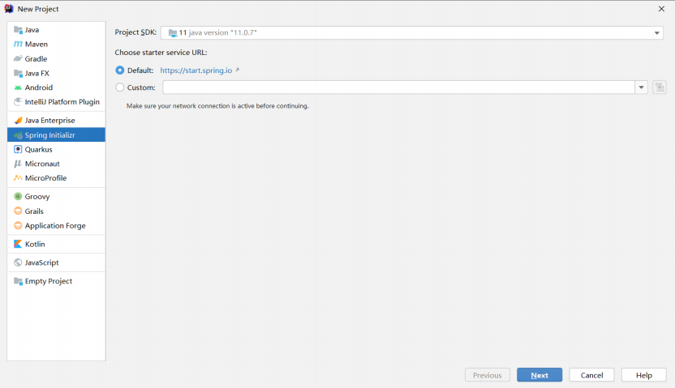
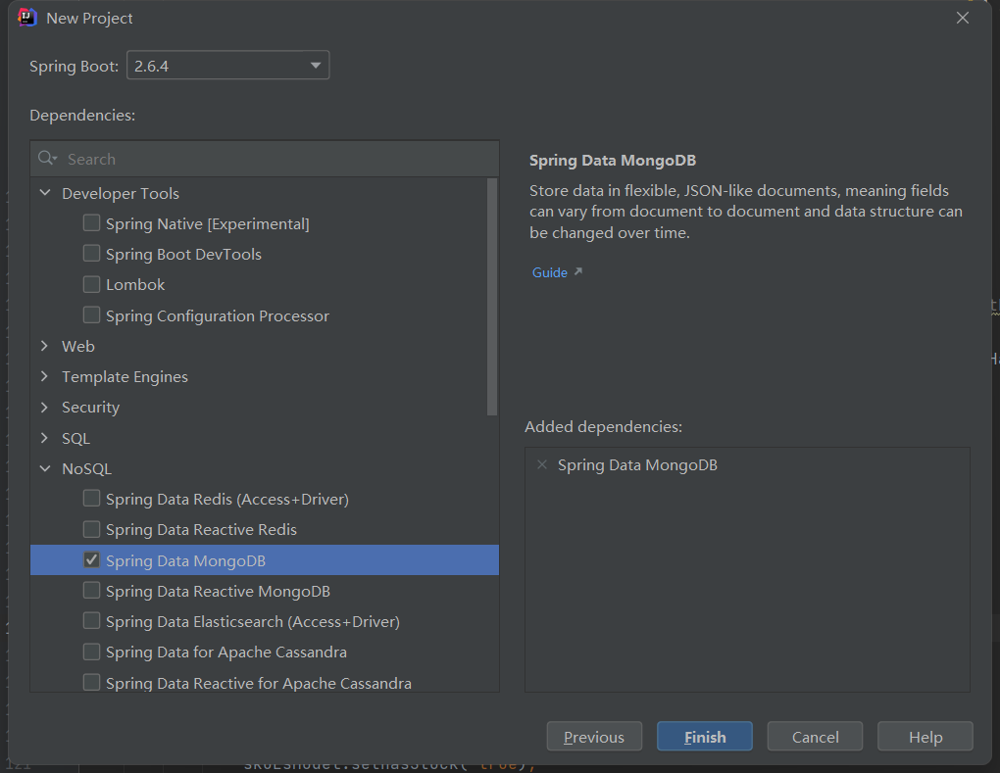

# 5. SpringDataMongoDB使用

使用Spring Data 框架都是按照面向对象思想操作用于的工具。

使用Spring Data Mongodb 也是使用面向对象的方式进行操作MongoDB，`省略了使用Mongodb的Java客户端API把Document转换为实体类的过程`

## 5.1 搭建项目环境

### 5.1.1 创建项目

<a data-fancybox title="" href="./image/MongoDB05.png"></a>


<a data-fancybox title="" href="./image/MongoDB04.png"></a>

### 5.1.2 MongoDB依赖

```xml
<dependency>
    <groupId>org.springframework.boot</groupId>
    <artifactId>spring-boot-starter-data-mongodb</artifactId>
</dependency>
```

### 5.1.3 配置文件

```yml
spring:
  data:
    # mongodb配置
    mongodb:
      # 服务器地址
      host: 192.168.10.101
      # 端口
      port: 27017
      # 用户名
      username: uaad
      # 密码
      password: uaad
      # 认证数据库
      authentication-database: admin
      # 操作的数据库
      database: test
```

## 5.2 创建实体类


### 5.2.1 文档操作相关注解

:::tip 相关注解
1. **@Document**
- 修饰范围: 用在类上
- 作用: 用来映射这个类的一个对象为mongo中一条文档数据。
- 属性:( value 、collection )用来指定操作的集合名称

2. **@Id**
- 修饰范围: 用在成员变量、方法上
- 作用: 用来将成员变量的值映射为文档的_id的值

3. **@Field**
- 修饰范围: 用在成员变量、方法上
- 作用: 用来将成员变量及其值映射为文档中一个key:value对。
- 属性:( name , value )用来指定在文档中 key的名称,默认为成员变量名

4. **@Transient**
- 修饰范围:用在成员变量、方法上
- 作用:用来指定此成员变量不参与文档的序列化
:::

------------------------------------

```java
package com.tqk.mongo.pojo;

import org.springframework.data.annotation.Id;
import org.springframework.data.mongodb.core.mapping.Document;
import org.springframework.data.mongodb.core.mapping.Field;

import java.io.Serializable;

/**
 * @author tianqikai
 * @since 1.0.0
 * 把一个java类声明为mongodb的文档，可以通过collection参数指定这个类对应的文档
 * 可以省略，如果省略，则默认使用类名小写映射集合
 * 若未加 @Document ，则 save 到 people
 * 若添加 @Document ，则 save 到 collection1
 */
@Document("collection1")
public class People implements Serializable {
	/**
	 * 	主键标识，该属性的值会自动对应mongodb的主键字段"_id"，如果该属性名就叫“id”,则该注解可以省略，否则必须写
	 */
	@Id
	private String id;

	/**
	 * 	该属性对应mongodb的字段的名字，如果一致，则无需该注解
	 */
	@Field("name")
	private String name;

	private int age;

	public People() {
	}

	public People(String id, String name, int age) {
		this.id = id;
		this.name = name;
		this.age = age;
	}

	public String getId() {
		return id;
	}

	public void setId(String id) {
		this.id = id;
	}

	public String getName() {
		return name;
	}

	public void setName(String name) {
		this.name = name;
	}

	public int getAge() {
		return age;
	}

	public void setAge(int age) {
		this.age = age;
	}

	@Override
	public String toString() {
		return "People{" +
				"id='" + id + '\'' +
				", name='" + name + '\'' +
				", age=" + age +
				'}';
	}
}
```


## 5.3 添加文档

### 5.3.1 单个添加

```java
    /**
     * 插入文档
     */
    @Test
    public void insert() {
        People people = new People();
        people.setAge(15);
        people.setName("李四");
        People result = mongoTemplate.insert(people);
        System.out.println(result);
    }
```

```java
    /**
     * 插入文档
     */
    @Test
    public void save() {
        People people = new People();
        people.setAge(15);
        people.setName("嘿嘿");
        People result = mongoTemplate.insert(people);
        System.out.println(result);
    }
```

### 5.3.2 批量添加

```java
  /**
     * 插入文档
     */
    @Test
    public void insertAll() {
        ArrayList<People> list = new ArrayList<>();
        People people = new People();
        people.setAge(15);
        people.setName("李四");
        list.add(new People("1","张三",25));
        list.add(new People("2","李四",35));
        list.add(new People("3","王五",45));
        ArrayList<People> result = (ArrayList<People>) mongoTemplate.insertAll(list);
        System.out.println(result);
    }
```

## 5.4 更新文档

在Mongodb中无论是使用客户端API还是使用Spring Data，更新返回结果一定是受行数影响。**如果更新后的结果和更新前的结果是相同，返回0**。

- `updateFirst()` 只更新满足条件的第一条记录
- `updateMulti()` 更新所有满足条件的记录
- `upsert()` 没有符合条件的记录则插入数据
- `save` 根据唯一id进行更新

### 5.4.1 save

```java
    /**
     * save更新
     */
    @Test
    public void saveUp() {
        People people = new People();
        people.setId("623de27915caac02fc751d50");
        people.setAge(25);
        people.setName("小明");
        // id不存在就是保存，存在就是更新
        People result = mongoTemplate.save(people);
        System.out.println(result);
    }
```

### 5.4.2 updateFirst

```java
   /**
     * updateFirst
     */
    @Test
    public void updateFirst() {
        // 设置查询体，查询条件具体内容
        Criteria criteria = Criteria.where("name").is("张三123").and("age").is(25);
        // query设置查询条件
        Query query = new Query(criteria);
        // 设置修改哪些属性
        Update update = new Update();
        update.set("name", "张三1233456").set("age",29);
        // People.class 告诉Spring Data MongoDB 上面的属性是哪个类。
        // 类对应集合，就知道具体操作集合的哪个属性
        UpdateResult updateResult = mongoTemplate.updateFirst(query, update, People.class);
        // 修改数量，如果修改前和修改后相同，返回0
        System.out.println(updateResult.getModifiedCount());
        // 匹配数量。最多返回1，即使有多个张三返回也是1.
        System.out.println(updateResult.getMatchedCount());
    }
```

### 5.4.3 updateMulti
```java
   /**
     * updateMulti
     */
    @Test
    public void updateMulti() {
        // 设置查询体，查询条件具体内容
        Criteria criteria = Criteria.where("name").is("李四");
        // query设置查询条件
        Query query = new Query(criteria);
        // 设置修改哪些属性
        Update update = new Update();
        update.set("age", 18);
        // People.class 告诉Spring Data MongoDB 上面的属性是哪个类。
        // 类对应集合，就知道具体操作集合的哪个属性
        UpdateResult result = mongoTemplate.updateMulti(query, update, People.class);
        // 修改数量。返回所有匹配结果中真实被修改数量
        System.out.println(result.getModifiedCount());
        // 匹配数量
        System.out.println(result.getMatchedCount());
    }
```

### 5.4.4 upsert

```java
    /**
     * upsert 如果有多个只修改第一个
     */
    @Test
    public void upsert() {
        // 设置查询体，查询条件具体内容
        Criteria criteria = Criteria.where("name").is("李四");
        // query设置查询条件
        Query query = new Query(criteria);
        // 设置修改哪些属性
        Update update = new Update();
        update.set("age", 99);
        // People.class 告诉Spring Data MongoDB 上面的属性是哪个类。
        // 类对应集合，就知道具体操作集合的哪个属性
        UpdateResult result = mongoTemplate.upsert(query, update, People.class);
        // 修改数量。返回所有匹配结果中真实被修改数量
        System.out.println(result.getModifiedCount());
        // 匹配数量
        System.out.println(result.getMatchedCount());
    }
```
## 5.5 删除文档

```java
    /**
     * remove
     */
    @Test
    public void remove(){
        // todo 根据主键删除
        // 使用 remove(Object) 实现根据主键进行删除。
        // 只判断对象的主键，其他属性是否有值没有影响。但是主键必须不能是null的。
        People people = new People();
        people.setId("1");
        DeleteResult deleteResult1 = mongoTemplate.remove(people);
        //todo 根据条件删除
        Criteria criteria = Criteria.where("name").is("小明");
        System.out.println(deleteResult1.getDeletedCount());
        // query设置查询条件
        Query query = new Query(criteria);
        DeleteResult deleteResult = mongoTemplate.remove(query, People.class);
        System.out.println(deleteResult.getDeletedCount());
    }
```

## 5.6 查询文档

