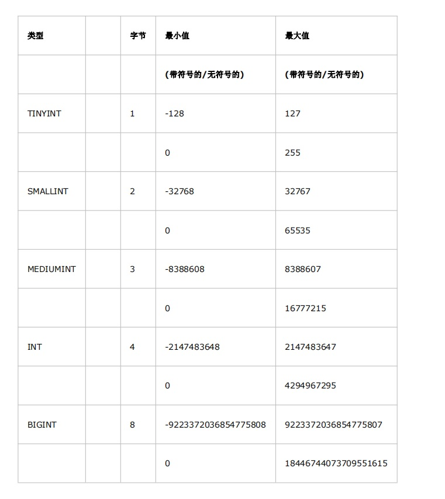
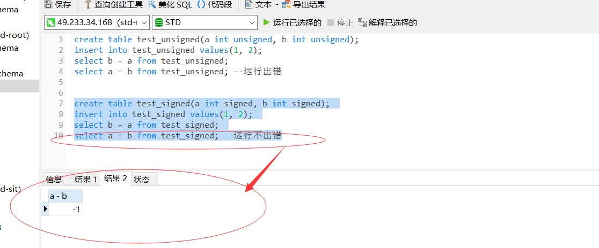
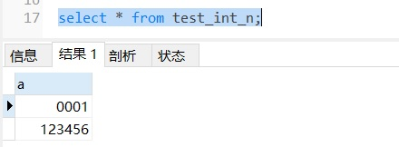
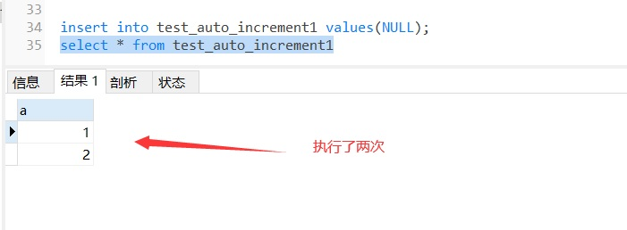
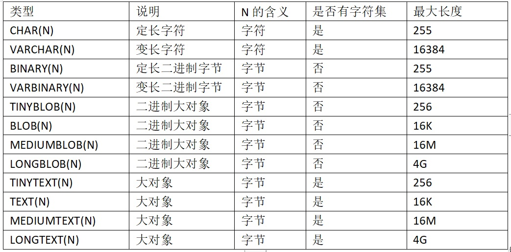
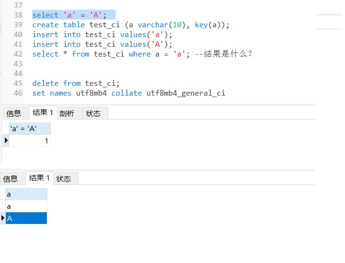
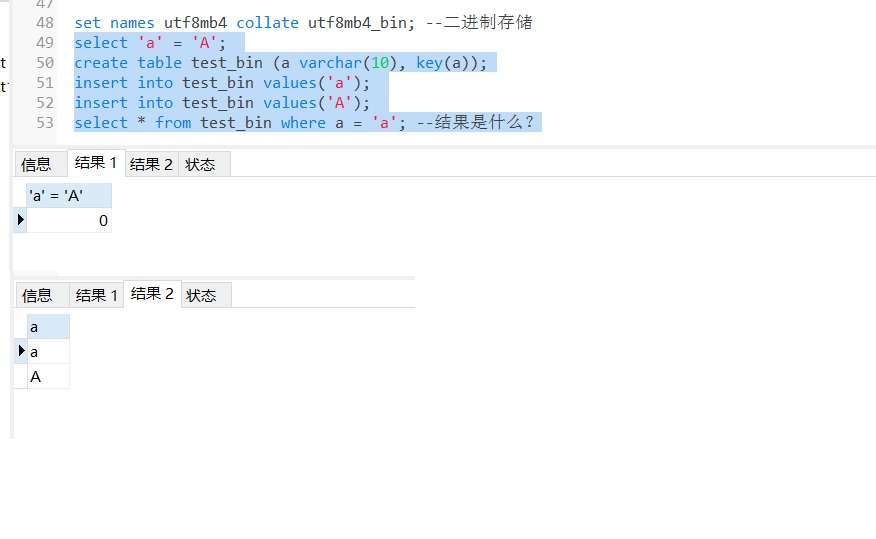
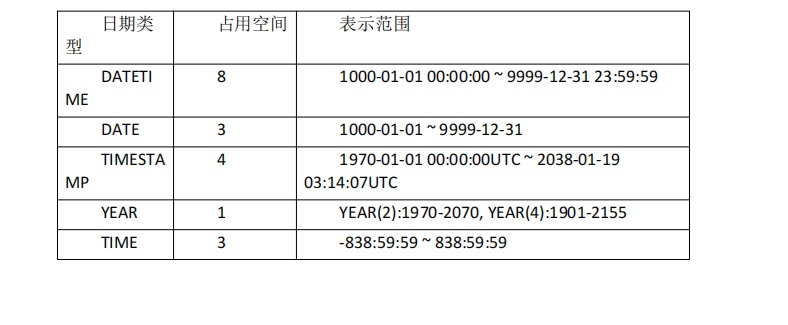

# 2. MySql 数据类型
[[toc]]
## 2.1 Int 类型
<a data-fancybox title="MYSQL" href="./image/mysql11.jpg"></a>

### 2.1.1 有无符号
**在项目中使用 BIGINT，而且是有符号的。**
```sql
create table test_unsigned(a int unsigned, b int unsigned); 
insert into test_unsigned values(1, 2); 
select b - a from test_unsigned; 
select a - b from test_unsigned; --运行出错
--运行出错
> 1064 - You have an error in your SQL syntax; check the manual that corresponds to your MySQL server version for the right syntax to use near '--运行出错' at line 1

create table test_signed(a int signed, b int signed); 
insert into test_signed values(1, 2); 
select b - a from test_signed; 
select a - b from test_signed; --运行不出错

```
<a data-fancybox title="MYSQL" href="./image/mysql12.jpg"></a>

### 2.1.1 INT(N)

:::tip INT(N)
1. int(N)中的 N 是显示宽度， 不表示 存储的数字的 长度 的上限。 
2. zerofill 表示当存储的数字 长度 < N 时，用 数字 0 填充左边，直至补满长度 N 
3. 当存储数字的长度 超过 N 时 ，按照实际存储的数字显示
:::

```sql
create table test_int_n(a int(4) zerofill); 
insert into test_int_n values(1); 
insert into test_int_n values(123456);
```
<a data-fancybox title="MYSQL" href="./image/mysql13.jpg"></a>


### 2.1.2 AUTO_INCREMENT 自增列
AUTO_INCREMENT 自增列。这样可以保证数据行是按顺序写入，对于根据主键做关联操作的性能也会更好。

```sql
create table test_auto_increment(a int auto_increment);
--Incorrect table definition; there can be only one auto column and it must be defined as a key

create table test_auto_increment(a int auto_increment primary key);

insert into test_auto_increment values(NULL); --null 会导致自增，设置非空字段也会自增
insert into test_auto_increment values(0); 
insert into test_auto_increment values(-1); 
insert into test_auto_increment values(null),(100),(null),(10),(null)

--null 会导致自增，设置非空字段也会自增
CREATE TABLE `test_auto_increment1`  (
  `a` int(255) NOT NULL AUTO_INCREMENT,
  PRIMARY KEY (`a`) USING BTREE
);

insert into test_auto_increment1 values(NULL);
```

<a data-fancybox title="MYSQL" href="./image/mysql14.jpg"></a>

## 2.2 字符类型

<a data-fancybox title="MYSQL" href="./image/mysql15.jpg"></a>

### 2.2.1 VARCHAR 和 CHAR 类型

VARCHAR 和 CHAR 是两种最主要的字符串类型。 VARCHAR VARCHAR 类型用于存储可变长字符串，是最常见的字符串数据类型。它比 定长类型更节省空间，因为它仅使用必要的空间（例如，越短的字符串使用越少的空间)。

在内部实现上，既然是变长，VARCHAR 需要使用 1 或 2 个额外字节记录字符串的长度，如果列的最大长度小于或等于 255 字节,则只使用 1 个字节表示,否 则使用 2 个字节。 

VARCHAR 节省了存储空间，所以对性能也有帮助。但是，由于行是变长的， 在 UPDATE 时新值比旧值长时，使行变得比原来更长，这就肯能导致需要做额外 的工作。如果一个行占用的空间增长，并且在页内没有更多的空间可以存储，在 这种情况下，MyISAM 会将行拆成不同的片段存储，InnoDB 则需要分裂页来使行 可以放进页内。 

CHAR 类型是定长的，MySQL 总是根据定义的字符串长度分配足够的空间。 当存储 CHAR 值时，MySQL 会删除所有的末尾空格，CHAR 值会根据需要采用空 格进行填充以方便比较。 

在 CHAR 和 VARCHAR 的选择上，这些情况下使用 VARCHAR 是合适的： 
字符串列的最大长度比平均长度大很多﹔列的更新很少；使用了像 UTF-8 这 样复杂的字符集，每个字符都使用不同的字节数进行存储。 

CHAR 适合存储很短的字符串，或者所有值定长或都接近同一个长度。例如， CHAR 非常适合存储密码的 MD5 值，因为这是一个定长的值。对于经常变更的数据，CHAR 也比 VARCHAR 更好，因为定长的 CHAR 类型不容易产生碎片。 

对于非常短的列，CHAR 比 VARCHAR 在存储空间上也更有效率。例如用 CHAR( 1)来存储只有 Y 和 N 的值，如果采用单字节字符集只需要一个字节，但是 VARCHAR(1)却需要两个字节，因为还有一个记录长度的额外字节。 

另外，使用 VARCHAR(5)和 VARCHAR(200)存储'hello'在磁盘空间上开销是一 样的。我们随便选择一个就好？应该使用更短的列，为什么? 事实证明有很大的优势。更长的列会消耗更多的内存，因为 MySQL 通常会 分配固定大小的内存块来保存内部值。尤其是使用内存临时表进行排序或操作时 会特别糟糕。在利用磁盘临时表进行排序时也同样糟糕。 所以最好的策略是只分配真正需要的空间

### 2.2.2 排序规则

```sql
set names utf8mb4 collate utf8mb4_general_ci --按字符存储排序，忽略大小写
select 'a' = 'A'; 
create table test_ci (a varchar(10), key(a));
insert into test_ci values('a'); 
insert into test_ci values('A'); 
select * from test_ci where a = 'a'; --结果是什么？
```
<a data-fancybox title="MYSQL" href="./image/mysql17.jpg"></a>

```sql 
set names utf8mb4 collate utf8mb4_bin; --二进制存储 大小写敏感
select 'a' = 'A'; 
create table test_bin (a varchar(10), key(a));
insert into test_bin values('a'); 
insert into test_bin values('A'); 
select * from test_bin where a = 'a'; --结果是什么？
```
<a data-fancybox title="MYSQL" href="./image/mysql18.jpg"></a>

## 2.3 日期和时间类型

<a data-fancybox title="MYSQL" href="./image/mysql16.jpg"></a>

大部分时间类型都没有替代品，因此没有什么是最佳选择的问题。唯一的问 题 MySQL 提供两种相似的日期类型:DATETIME 和 TIMESTAMP。对于很多应用程序，它们都能工作，但是在某些场景，需要做些适当选择。 

DATETIME 这个类型能保存大范围的值，从 1001 年到 9999 年，精度为秒。它把日期和 时间封装到格式为 YyYYMMDDHHMMSS 的整数中，与时区无关。使用 8 个字节 的存储空间。 

TIMETAMP 类型保存了从 1970 年 1 月 1 日午夜（格林尼治标准时间)以来的 秒数，它和 UNIX 时间戳相同。TIMESTAMP 只使用 4 个字节的存储空间，因此它 的范围比 DATETIME 小得多﹔只能表示从 1970 年到 2038 年。TIMESTAMP 显示的 值也依赖于时区。从空间效率来说，当然 TIMETAMP 比 DATETIME 更高。


## 2.4 JSON 类型

略