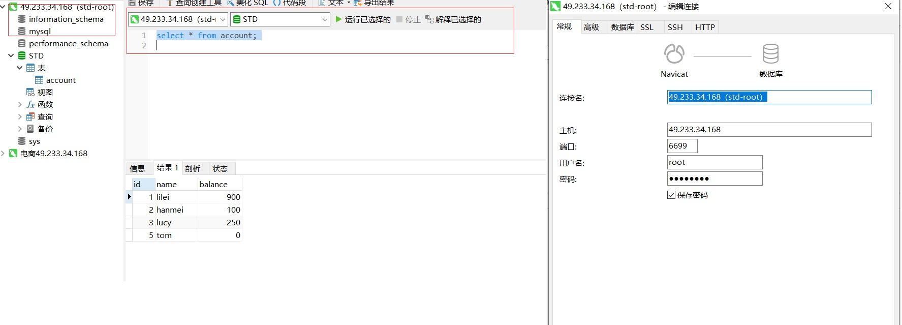
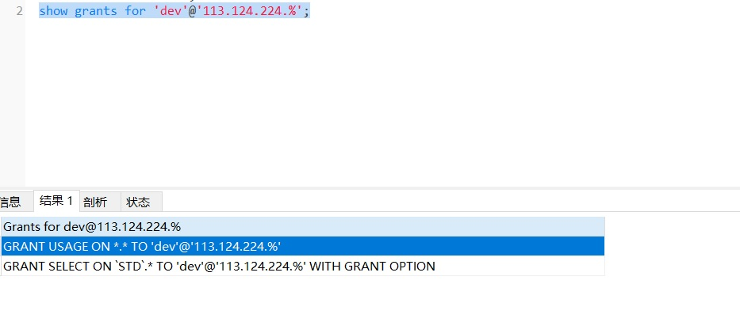
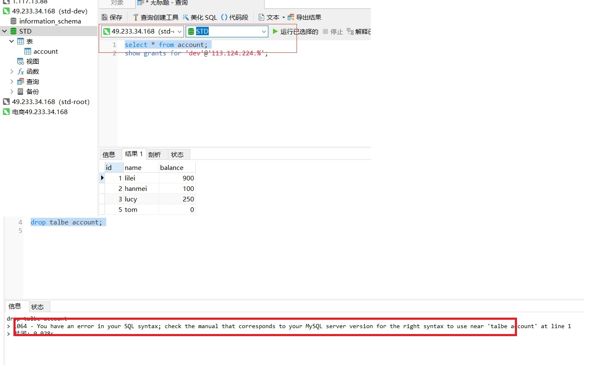
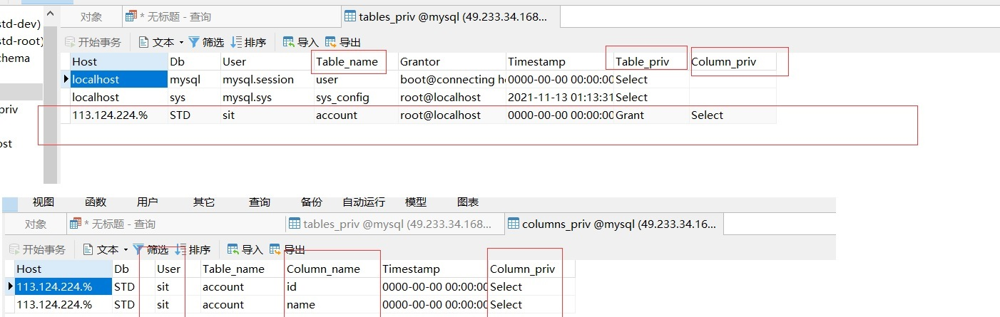
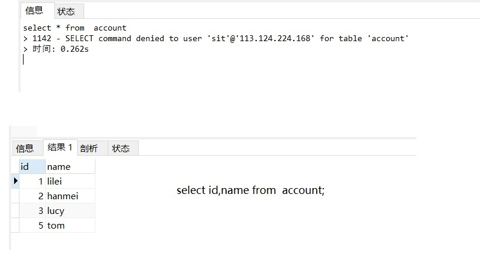
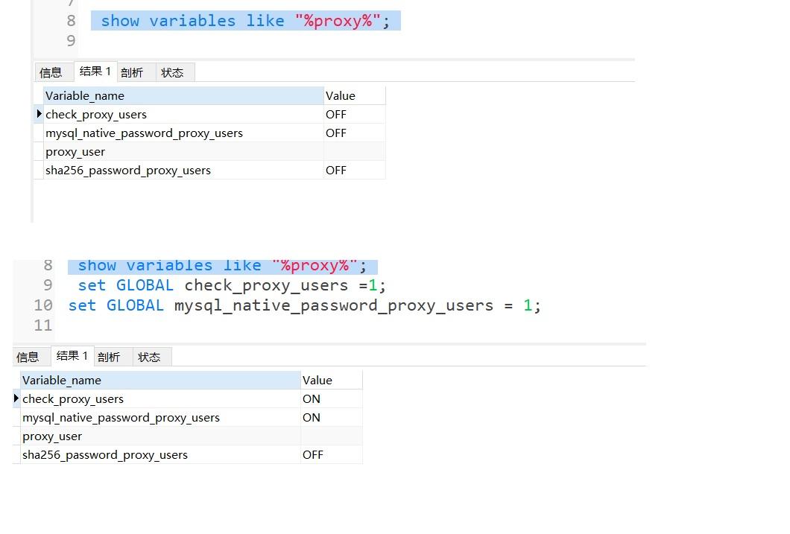
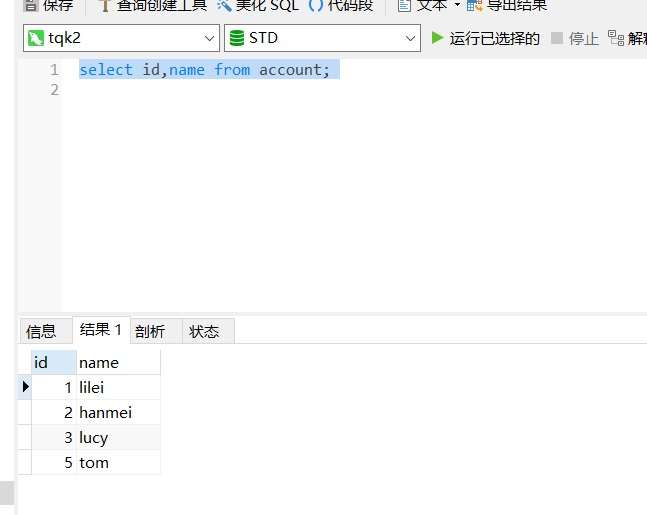

# 1. Mysql 权限

[[toc]]
## 1.1 简单的MySql权限

预先准备使用的SQL语句
```sql
DROP TABLE IF EXISTS `account`;
CREATE TABLE `account` ( `id` int(11) NOT NULL, `name` varchar(50) DEFAULT NULL, `balance` int(255) DEFAULT NULL, PRIMARY KEY (`id`), KEY `idx_balance` (`balance`) ) ENGINE=InnoDB DEFAULT CHARSET=utf8;

INSERT INTO `account` VALUES ('1', 'lilei', '900'); 
INSERT INTO `account` VALUES ('2', 'hanmei', '100'); 
INSERT INTO `account` VALUES ('3', 'lucy', '250'); 
INSERT INTO `account` VALUES ('5', 'tom', '0');
```

### 1.1.1 设置root权限远程登陆

```sql
ALTER USER 'root'@'%' IDENTIFIED WITH mysql_native_password BY '12345@tqk';
```
**该sql命令意思为可以通过所有网段<font color='#d71345'>(@)</font>使用root用户登录mysql服务所有的数据库；**

------------------------------

```bash
mysql> select host,user from user;
+-----------+---------------+
| host      | user          |
+-----------+---------------+
| %         | root          |
| localhost | mysql.session |
| localhost | mysql.sys     |
| localhost | root          |
+-----------+---------------+
4 rows in set (0.01 sec)

mysql> ALTER USER 'root'@'%' IDENTIFIED WITH mysql_native_password BY '12345@tqk';
Query OK, 0 rows affected (0.00 sec)

mysql> select host,user from user;
+-----------+---------------+
| host      | user          |
+-----------+---------------+
| %         | root          |
| localhost | mysql.session |
| localhost | mysql.sys     |
| localhost | root          |
+-----------+---------------+
4 rows in set (0.00 sec)

mysql> flush privileges;
Query OK, 0 rows affected (0.00 sec)
```
<a data-fancybox title="MYSQL" href="./image/mysql01.jpg"></a>


### 1.1.2 设置普通用户登陆
**使用 Root 用户，执行**

```bash
# grant '权限' on '作用域' to '用户';

mysql> grant SELECT on STD.* TO 'dev'@'113.124.224.%' IDENTIFIED BY '12345@tqk' WITH GRANT OPTION;
Query OK, 0 rows affected, 1 warning (0.01 sec)

mysql> flush privileges;
```

很简单的一句 sql，创建了一个 dev 的用户，密码为 12345@tqk，仅仅运行在网段为 **113.124.224.* **的网段进行**STD数据库用户查询操作**

```sql
show grants for 'dev'@'113.124.224.%';
```
<a data-fancybox title="MYSQL" href="./image/mysql02.jpg"></a>

可以链接，也可以执行 select，这个时候无法进行DDL DMl操作
<a data-fancybox title="MYSQL" href="./image/mysql03.jpg"></a>

## 1.2 用户标识

### 1.2.1 用户标识说明

上面一句简单的 SQL 堪称完美的解决了程序员新手的删库跑路的问题，

这里有个小的知识点需要先具备，在 mysql 中的权限不是单纯的赋予给用户的，而是赋予给” **用户+IP**”的 

比如 dev 用户是否能登陆，用什么密码登陆，并且能访问什么数据库等都需要加上 IP，这样才算 一 个完整的用户标识 ， 换 句 话 说 'dev'@'192.168.0.168' 、 'dev'@'127.0.0.1' 与 'dev'@'localhost' 这 3 个是完全不同的用户标识（哪怕你本机的 ip 就是 192.168.0.168）。

**作用： 登录，管理数据库逻辑对象**

**定义： 用户名@'主机值'**

**主机值可以是主机名或IP地址，主机值中允许使用通配符**
```
root@'10.0.0.%'    
root@'%'
root@'10.0.0.51'
root@'localhost'
root@'db02'     # 主机名不能是数字开头
root@'10.0.0.5%'
root@'10.0.0.0/255.255.0.0' # 10.0 B类网络上任何主机
```
#### 用户管理操作

```bash
#增：
mysql> create user dev@'10.0.0.%' identified by '123';
#查：
mysql> desc mysql.user;    ---->  mysql5.7 开始新版的mysql数据库下的user表中已经没有password字段了保存密码的字段变成了authentication_string字段
mysql> select user, host, authentication_string from mysql.user;
#改:
mysql> alter user dev@'10.0.0.%' identified by '456';
#删：
mysql> drop user dev@'10.0.0.%';
```
#### 权限管理操作

```bash
# grant '权限' on '作用域' to '用户';
mysql> grant all on *.* to 'test'@'%';
Query OK, 0 rows affected (0.00 sec)
```
:::tip 常用权限介绍
1. select：可以从数据库中的表中查询数据
2. insert：可以插入数据到数据库的表中
3. update：可以对数据库中的表进行更新数据
4. delete：可以从数据库中的表中删除数据
5. alter：可以使用 alter table 来改变表的结构
6. create：可以创建新的数据库或表的语句
7. drop：能够删除现有数据库，表和视图
8. grant option：可以向其它用户授予或移除权限
9. index：可以创建和删除索引
10. all或all privileges：代表指定权限等级的所有权限
:::

### 1.2.2 用户权限所涉及的表

mysql.user，mysql.db，mysql.table_priv，mysql_column_priv 你可以熟悉其中的 user 表，甚至手动的改过里面的数据（不合规范）

:::tip 表和权限关系
1. **User** 的一行记录代表一个用户标识 
2. **db** 的一行记录代表对数据库的权限 
3. **table_priv** 的一行记录代表对表的权限
5. **column_priv** 的一行记录代表对某一列的权限
:::

创建的 sit 用户我不想让测试人员访问 balance 列,但是 id 和 name 列是可以访问的，这样的需求在工作中不是没有

--------------------

```bash
mysql> grant SELECT on STD.* TO 'sit'@'113.124.224.%' IDENTIFIED BY '12345@tqk' WITH GRANT OPTION;

mysql> grant select(id,name) on STD.account TO 'sit'@'113.124.224.%' IDENTIFIED BY '12345@tqk' WITH GRANT OPTION;
Query OK, 0 rows affected, 1 warning (0.01 sec)
mysql> REVOKE SELECT on STD.* from'sit'@'113.124.224.%'
mysql> flush privileges;
```

这时候可以在分别看下 table_priv，column_priv 的数据
<a data-fancybox title="MYSQL" href="./image/mysql04.jpg"></a>

再要查询所有记录？不好意思不让查而你查询id，name查询又是可以了
<a data-fancybox title="MYSQL" href="./image/mysql06.jpg"></a>

## 1.3 Mysql 的角色

MySql 基于”用户+IP”的这种授权模式其实还是挺好用的，但如果你使用 Oracle、 PostgreSQL、SqlServer 你可能会发牢骚 

这样对于每个用户都要赋权的方式是不是太麻烦了，如果我用户多呢？有没有角色或者用户组这样的功能呢？ 好吧，你搓中了 mysql 的软肋，很痛，

在 mysql5.7 开始才正式支持这个功能，而且连 mysql 官方把它叫做“Role Like”（不是角色，长得比较像而已，额~~~）？

### 1.3.1 查看mysql5.7中的类似角色

```sql
show variables like "%proxy%"
```
**check_proxy_users，mysql_native_password_proxy_users 这两个变量设置成 true 才行**

```sql
set GLOBAL check_proxy_users =1; 
set GLOBAL mysql_native_password_proxy_users = 1;
```
<a data-fancybox title="MYSQL" href="./image/mysql05.jpg"></a>

### 1.3.2 创建一个角色

```bash
### 无密码
create USER 'tqk_role';
grant select(id,name) on STD.account to 'tqk_role' WITH GRANT OPTION;

create USER 'tqk1';
grant proxy on 'tqk_role' to 'tqk1' WITH GRANT OPTION;

# WITH GRANT OPTION 意思是可以让其他用户继承自己的权限的意思
### 有密码
create user 'tqk_role2'@'113.124.224.%' identified by '12345@tqk';
# 将权限赋给角色
grant select(id,name) on STD.account TO 'tqk_role2'@'113.124.224.%' WITH GRANT OPTION;

create USER 'tqk2'@'113.124.224.%' identified by '12345@tqk';
grant proxy on 'tqk_role2'@'113.124.224.%'  to 'tqk2'@'113.124.224.%' WITH GRANT OPTION;
```
<a data-fancybox title="MYSQL" href="./image/mysql07.jpg"></a>


