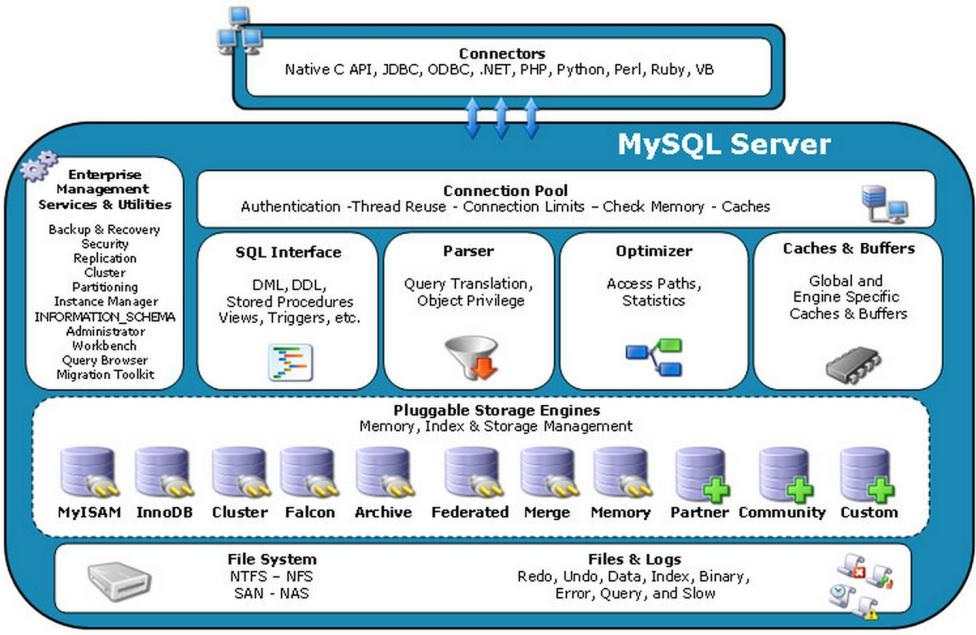
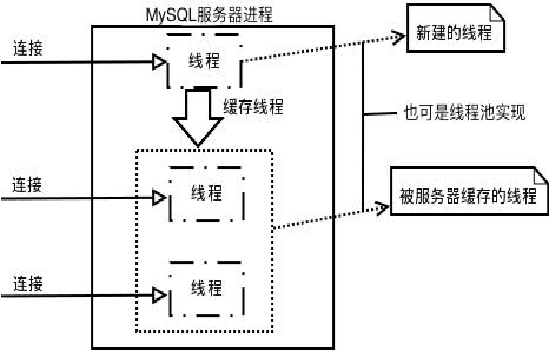
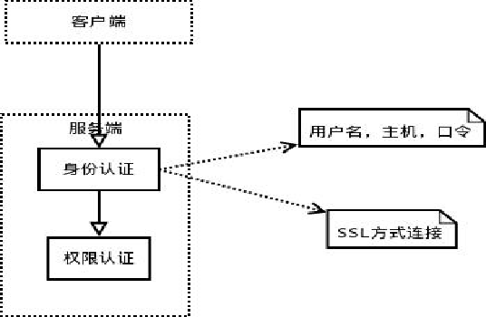
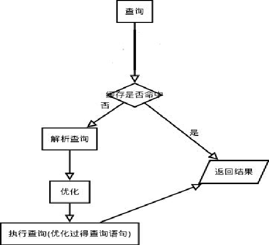
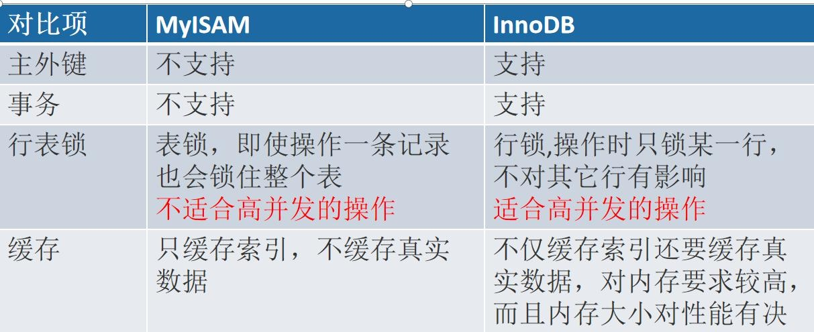

# 3. Mysql 架构
[[toc]]
<a data-fancybox title="MYSQL" href="./image/mysql21.jpg"></a>

可以看出 MySQL 最上层是连接组件。下面服务器是由**连接池、管理工具和 服务、SQL 接口、解析器、优化器、缓存、存储引擎、文件系统**组成。

**连接池：**由于每次建立建立需要消耗很多时间，连接池的作用就是将这些连 接缓存下来，下次可以直接用已经建立好的连接，提升服务器性能。 

**管理工具和服务：**系统管理和控制工具，例如备份恢复、Mysql 复制、集群 等 

**SQL 接口：**接受用户的 SQL 命令，并且返回用户需要查询的结果。比如 select from 就是调用 SQL Interface 

**解析器:** SQL 命令传递到解析器的时候会被解析器验证和解析。
解析器主要功能：
1. 将 SQL 语句分解成数据结构，并将这个结构传递到后续步骤，以后 SQL 语句的传递和处理就是基于这个结构的 
2. 如果在分解构成中遇到错误，那么就说明这个 sql 语句是不合理的 


**优化器：**查询优化器，SQL 语句在查询之前会使用查询优化器对查询进行优化。

**缓存器：** 查询缓存，如果查询缓存有命中的查询结果，查询语句就可以直 接去查询缓存中取数据。 这个缓存机制是由一系列小缓存组成的。比如表缓存，记录缓存，key 缓存， 权限缓存等。

## 3.1 连接层

当 MySQL 启动（MySQL 服务器就是一个进程），等待客户端连接，每一个 客户端连接请求，服务器都会新建一个线程处理（如果是线程池的话，则是分配 一个空的线程），每个线程独立，拥有各自的内存处理空间

<a data-fancybox title="MYSQL" href="./image/mysql22.png"></a>

```sql
--同时使用的连接的最大数目
show VARIABLES like '%max_connections%';

--如果是root帐号，你能看到所有用户的当前连接。如果是其它普通帐号，只能看到自己占用的连接。
show processlist;
```
<a data-fancybox title="MYSQL" href="./image/mysql23.png"></a>

连接到服务器，服务器需要对其进行验证，也就是用户名、IP、密码验证， 一旦连接成功，还要验证是否具有执行某个特定查询的权限（例如，是否允许客 户端对某个数据库某个表的某个操作）

## 3.2 Server 层(SQL 处理层)

<a data-fancybox title="MYSQL" href="./image/mysql24.png"></a>

这一层主要功能有：**SQL 语句的解析、优化，缓存的查询，MySQL 内置函数**的实现，跨存储引擎功能（所谓跨存储引擎就是说每个引擎都需提供的功能（引擎需对外提供接口）），例如：存储过程、触发器、视图等。 

1. 如果是查询语句（select 语句），首先会查询缓存是否已有相应结果，有则返回结果，无则进行下一步（如果不是查询语句，同样调到下一步） 
2. 解析查询，创建一个内部数据结构（解析树），这个解析树主要用来 SQL 语句的语义与语法解析； 
3. 优化：优化 SQL 语句，例如重写查询，决定表的读取顺序，以及选择需要 的索引等。这一阶段用户是可以查询的，查询服务器优化器是如何进行优化的， 便于用户重构查询和修改相关配置，达到最优化。这一阶段还涉及到存储引擎， 优化器会询问存储引擎，比如某个操作的开销信息、是否对特定索引有查询优化等。

### 3.2.1 缓存

```sql
show variables like '%query_cache_type%'; -- 默认不开启 
--query_cache_type	OFF
show variables like '%query_cache_size%'; --默认值 1M 
--query_cache_size	1048576
SET GLOBAL query_cache_type = 1; --会报错
--query_cache_type 只能配置在 my.cnf 文件中，
这大大限制了 qc 的作用 在生产环境建议不开启，除非经常有 sql 完全一模一样的查询
```

**QC严格要求 2 次 SQL 请求要完全一样，包括 SQL 语句，连接的数据库、协议 版本、字符集等因素都会影响**

从 8.0 开始，MySQL 不再使用查询缓存，那么放弃它的原因是什么呢？
MySQL查询缓存是查询结果缓存。它将以SEL开头的查询与哈希表进行比较， 如果匹配则返回上一次查询的结果。进行匹配时，查询必须逐字节匹配，例如 SELECT * FROM e1; 不等于 select * from e1;
此外，一些不确定的查询结果无法被缓存，任何对表的修改都会导致这些表的所有缓存无效。因此适用于查询缓存的最理想的方案是只读，特别是需要检查数百万行后仅返回数行的复杂查询。 如果你的查询符合这样一个特点，开启查询缓存会提升你的查询性能。 

随着技术的进步，经过时间的考验，MySQL 的工程团队发现启用缓存的好处并不多。首先查询缓存的效果取决于缓存的命中率，只有命中缓存的查询效果才能 有改善，因此无法预测其性能。 

其次，查询缓存的另一个大问题是它受到单个互斥锁的保护。在具有多个内 核的服务器上，大量查询会导致大量的互斥锁争用。 
通过基准测试发现，大多数工作负载最好禁用查询缓存(5.6 的默认设置)： 按照官方所说的：造成的问题比它解决问题要多的多， 弊大于利就直接砍掉了

## 3.3 存储引擎

### 3.3.1 InnoDB 存储引擎 
InnoDB 是 MySQL 的默认事务型引擎，也是最重要、使用最广泛的存储引擎。 它被设计用来处理大量的短期(short-lived)事务，短期事务大部分情况是正常提交 的，很少会被回滚。InnoDB 的性能和自动崩溃恢复特性，使得它在非事务型存 储的需求中也很流行。除非有非常特别的原因需要使用其他的存储引擎，否则应 该优先考虑 InnoDB 引擎。如果要学习存储引擎，InnoDB 也是一个非常好的值得
花最多的时间去深入学习的对象，收益肯定比将时间平均花在每个存储引擎的学 习上要高得多。所以 InnoDB 引擎也将是我们学习的重点。 

:::tip InnoDB 存储引擎
1. Innodb 是一种事务性存储引擎
2. 完全支持事务得 ACID 特性 
3. Redo Log 和 Undo Log 
4. Innodb 支持行级锁（并发程度更高）
:::
<a data-fancybox title="MYSQL" href="./image/mysql25.jpg"></a>

```sql
show VARIABLES like 'innodb_log_buffer_size';
innodb_log_buffer_size	16777216  --16MB
```

innodb_log_buffer_size 是 redo log 的写缓存，如果 buffer 不够大，就会发生多次 IO write，将缓存中的数据刷到磁盘；
innodb_log_buffer_size 越大，IO 次数越少。

### 3.3.2 MylSAM 存储引擎 
在 MySQL 5.1 及之前的版本，MyISAM 是默认的存储引擎。MyISAM 提供了 大量的特性，包括全文索引、压缩、空间函数（GIS）等，但 MyISAM 不支持事 务和行级锁，而且有一个毫无疑问的缺陷就是崩溃后无法安全恢复。尽管MyISAM 引擎不支持事务、不支持崩溃后的安全恢复，但它绝不是一无是处的。对于只读 的数据，或者表比较小、可以忍受修复（repair）操作，则依然可以继续使用 MyISAM （但请不要默认使用 MyISAM，而是应当默认使用 InnoDB)。但是 MyISAM 对整 张表加锁，而不是针对行。读取时会对需要读到的所有表加共享锁,写入时则对 表加排他锁。MyISAM 很容易因为表锁的问题导致典型的的性能问题。 

### 3.3.3 Mrg_MylSAM 
Merge 存储引擎，是一组 MyIsam 的组合，也就是说，他将 MyIsam 引擎的 多个表聚合起来，但是他的内部没有数据，真正的数据依然是 MyIsam 引擎的表 中，但是可以直接进行查询、删除更新等操作。 

### 3.3.4 Archive 引擎
Archive 存储引擎只支持 INSERT 和 SELECT 操作，在 MySQL 5.1 之前也不支持 索引。
Archive 引擎会缓存所有的写并利用 zlib 对插入的行进行压缩，所以比 MyISAM 表的磁盘 I/O 更少。但是每次 SELECT 查询都需要执行全表扫描。所以 Archive 表适合日志和数据采集类应用，这类应用做数据分析时往往需要全表扫 描。或者在一些需要更快速的 INSERT 操作的场合下也可以使用。Archive 引擎不 是一个事务型的引擎，而是一个针对高速插入和压缩做了优化的简单引擎。 

### 3.3.5 Blackhole 引擎 
Blackhole 引擎没有实现任何的存储机制，它会丢弃所有插入的数据，不做 任何保存。但是服务器会记录 Blackhole 表的日志，所以可以用于复制数据到备 库，或者只是简单地记录到日志。这种特殊的存储引擎可以在一些特殊的复制架 构和日志审核时发挥作用。但这种引擎在应用方式上有很多问题，因此并不推荐。 

### 3.3.6 CSV 引擎
CSV 引擎可以将普通的 CSV 文件(逗号分割值的文件）作为 MySQL 的表来处 理，但这种表不支持索引。CSV 引擎可以在数据库运行时拷入或者拷出文件。可 以将 Excel 等的数据存储为 CSV 文件，然后复制到 MySQL 数据目录下，就能在 MySQL 中打开使用。同样，如果将数据写入到一个 CSV 引擎表，其他的外部程 序也能立即从表的数据文件中读取 CSV 格式的数据。因此 CSV 引擎可以作为一 种数据交换的机制，非常有用。 

### 3.3.7 Federated 引擎 
Federated 引擎是访问其他 MySQL 服务器的一个代理，它会创建一个到远程 MySQL 服务器的客户端连接，并将查询传输到远程服务器执行，然后提取或者发 送需要的数据。最初设计该存储引擎是为了和企业级数据库如 Microsoft SQL Server 和 Oracle 的类似特性竞争的，可以说更多的是一种市场行为。尽管该引擎看起来提供了一种很好的跨服务器的灵活性，但也经常带来问题，因此默认是 禁用的。 

### 3.3.8 Memory 引擎 

如果需要快速地访问数据，并且这些数据不会被修改，重启以后丢失也没有 关系，那么使用 Memory 表(以前也叫做 HEAP 表）是非常有用的。Memory 表至 少比 MyISAM 表要快一个数量级，因为每个基于 MEMORY 存储引擎的表实际对 应一个磁盘文件。该文件的文件名与表名相同，类型为 frm 类型。该文件中只存 储表的结构。而其数据文件，都是存储在内存中，这样有利于数据的快速处理， 提高整个表的效率，不需要进行磁盘 I/O。所以 Memory 表的结构在重启以后还 会保留，但数据会丢失。 Memroy 表在很多场景可以发挥好的作用: 用于查找(lookup）或者映射(mapping）表，例如将邮编和州名映射的表。 用于缓存周期性聚合数据(periodically aggregated data)的结果。 用于保存数据分析中产生的中间数据。 Memory 表支持 Hash 索引，因此查找操作非常快。虽然 Memory 表的速度 非常快，但还是无法取代传统的基于磁盘的表。Memroy 表是表级锁，因此并发 写入的性能较低。它不支持 BLOB 或 TEXT 类型的列，并且每行的长度是固定的， 所以即使指定了 VARCHAR 列，实际存储时也会转换成 CHAR，这可能导致部分 内存的浪费。 

### 3.3.9 NDB 集群引擎 
使用 MySQL 服务器、NDB 集群存储引擎，以及分布式的、share-nothing 的、 容灾的、高可用的 NDB 数据库的组合，被称为 MySQL 集群（(MySQL Cluster)。