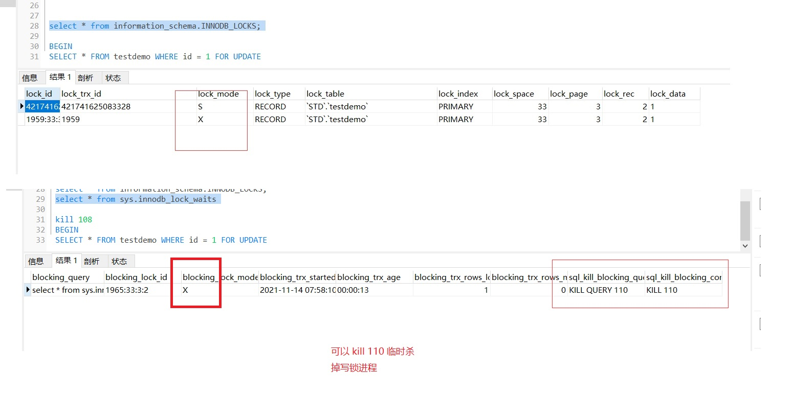

# 4. Mysql 锁

## 4.1 锁的简介 

1. 锁是计算机协调多个进程或线程并发访问某一资源的机制。 
2. 在数据库中，数据也是一种供许多用户共享的资源。如何保证数据并发访问的一致性、 有效性是所有数据库必须解决的一个问题，锁冲突也是影响数据库并发访问性能的一个 重要因素。 
3. 锁对数据库而言显得尤其重要，也更加复杂

### 4.1.1 MySQL 中的锁

:::tip MySQL中的锁
**表级锁**：开销小，加锁快；不会出现死锁；锁定粒度大，发生锁冲突的概率最高,并发 度最低。 
**行级锁**：开销大，加锁慢；会出现死锁；锁定粒度最小，发生锁冲突的概率最低,并发 度也最高。 
**页面锁(gap 锁,间隙锁)**：开销和加锁时间界于表锁和行锁之间；会出现死锁；锁定粒度 界于表锁和行锁之间，并发度一般.
:::

## 4.2 MyISAM 锁

:::tip MySQL的表级锁有两种模式： 
1. 表共享读锁（Table Read Lock） 
2. 表独占写锁（Table Write Lock）
:::

```sql
create table testmysam ( id int PRIMARY key) ENGINE=myisam;
insert into testmysam	VALUES(1),(2),(3);
```

### 4.2.1 表共享读锁（Table Read Lock）

```sql
--添加读锁
lock table testmysam READ; 
--解除读锁
unlock tables;

--1. 启动另外一个 session 远程连接
select * from testmysam;-- 可以查询 

--2. 在加锁的session 中会报错
insert into testmysam value(2); 
update testmysam set id=2 where id=1;-- 报错 

--3.在另外一个 session 中 
insert into testmysam value(2); --等待 

--4.在同一个 session 中操作其他的表也会报错
insert into account value(4,'aa',123); --报错 
select * from account ; --报错 

--5.在另外一个 session 中 
insert into account value(4,'aa',123);-- 成功 

--6.加锁在同一个 session 中 ，别名查询也会报错
select s.* from testmysam s; --报错 lock table 表名 as 别名 read;
```

### 4.2.2 表独占写锁（Table Write Lock）

```sql
--添加写锁
lock table testmysam WRITE; 

1.在同一个 session 中 
insert testmysam value(33);
delete from testmysam where id = 3 ;
select * from testmysam ;--等待
2.对不同的表操作（报错） 
select s.* from testmysam s ;--报错
insert into account value(4,'aa',123); --报错
select * from account ; --报错 
3.在其他 session 中 （等待） 
select * from testmysam;--等待
```

### 4.2.3 总结

:::tip 总结
1. 读锁，对 MyISAM 表的读操作，不会阻塞其他用户对同一表的读请求，但会阻塞对同一表的写请求 
2. 读锁，对 MyISAM 表的读操作，不会阻塞当前 session 对表读，当对表进行修改会报错 
3. 读锁，一个 session 使用 LOCK TABLE 命令给表 f 加了读锁，这个 session 可以查询锁定表中的记录，但**更新或访问其他表**都会提示错误； 
4. 写锁，对 MyISAM 表的写操作，则会阻塞其他用户对同一表的读和写操作； 
5. 写锁，对 MyISAM 表的写操作，当前 session 可以对本表做 CRUD,但对其他表进行操作会报错
:::

## 4.3 InnoDB 锁

在 mysql 的 InnoDB 引擎支持行锁 

**共享锁又称：读锁**。当一个事务对某几行上读锁时，允许其他事务对这几行进行读操作，但 不允许其进行写操作，也不允许其他事务给这几行上排它锁，但允许上读锁。 

**排它锁又称：写锁**。当一个事务对某几个上写锁时，不允许其他事务写，但允许读。更不允 许其他事务给这几行上任何锁。包括写锁

### 4.3.1 语法
```sql
--上共享锁的写法：lock in share mode 
select * from 表 where 条件 lock in share mode; 

--上排它锁的写法：for update 
select * from 表 where 条件 for update;
```

:::tip 注意
1. 两个事务不能锁同一个索引。 
2. insert ，delete ， update 在事务中都会自动默认加上排它锁（隐性锁）。 
3. **行锁必须有索引才能实现**，否则会自动锁全表，那么就不是行锁了。
:::

### 4.3.2 实例演示

```sql
CREATE TABLE testdemo ( `id` int(255) NOT NULL , 
 `c1` varchar(300) CHARACTER SET utf8 COLLATE utf8_general_ci NULL DEFAULT NULL ,
 `c2` int(50) NULL DEFAULT NULL , 
 PRIMARY KEY (`id`), 
 INDEX `idx_c2` (`c2`) 
 USING BTREE ) ENGINE=InnoDB; 
 
 insert into testdemo VALUES(1,'1',1),(2,'2',2)
```

```sql
1. 
BEGIN 
select * from testdemo where id =1 for update;
--在另外一个 session 中 
 update testdemo set c1 = '1' where id = 2; --成功 
 update testdemo set c1 = '1' where id = 1; --等待 
2.
BEGIN 
update testdemo set c1 = '1' where id = 1 ;
--在另外一个 session 中 
update testdemo set c1 = '1' where id = 1; --等待
3. 
BEGIN 
update testdemo set c1 = '1' where c1 = '1'; 
--在另外一个 session 中 
update testdemo set c1 = '2' where c1 = '2'; --等待 
4.
--第一个 session 中 
BEGIN
select * from testdemo where id =1 for update ;
--第二个 session 
select * from testdemo where id =1 lock in share mode ;
--回到第一个 session 
UNLOCK TABLES --并不会解锁 
使用 commit 或者 begin 或者 ROLLBACK 才会解锁 
5.
--再来看下表锁 
lock table testdemo WRITE ;
使用 commit，ROLLBACK 并不会解锁 使用 UNLOCK TABLES 或者 begin 会解锁
```

### 4.3.3 .锁的等待问题(死锁)

#### 实例
程序员甲，正直调试代码 
BEGIN
SELECT * FROM testdemo WHERE id = 1 FOR UPDATE 

你正直完成的功能也要经过那部分的代码，你得上个读锁 
BEGIN
SELECT * FROM testdemo WHERE id = 1 lock in share mode 
这个时候很不幸，你并不知道发生了什么问题，在你调试得过程中永远就是一个超时得异常， 而这种问题不管在开发中还是在实际项目运行中都可能会碰到，那么怎么排查这个问题呢？ 
这其实也是有小技巧的

```sql
select * from information_schema.INNODB_LOCKS;
```
<a data-fancybox title="MYSQL" href="./image/mysql41.jpg"></a>

真好，我通过这个 sql 语句起码发现在同一张表里面得同一个数据有了 2 个锁其中一个是 X （写锁），另外一个是 S（读锁），我可以跳过这一条数据，使用其他数据做调试或者自己本地建库，临时表等手段
