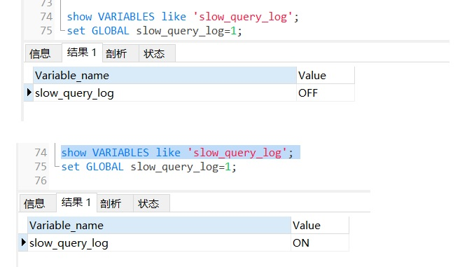
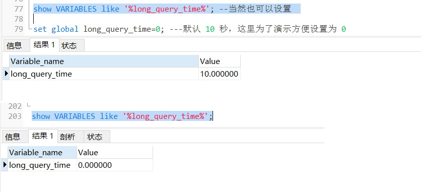
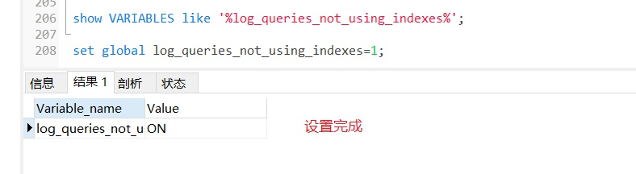
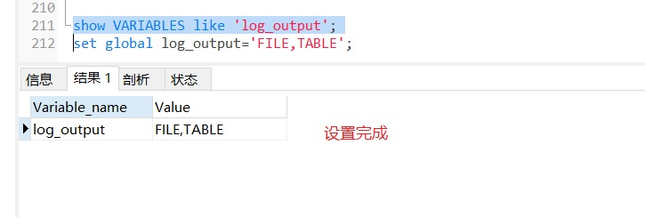
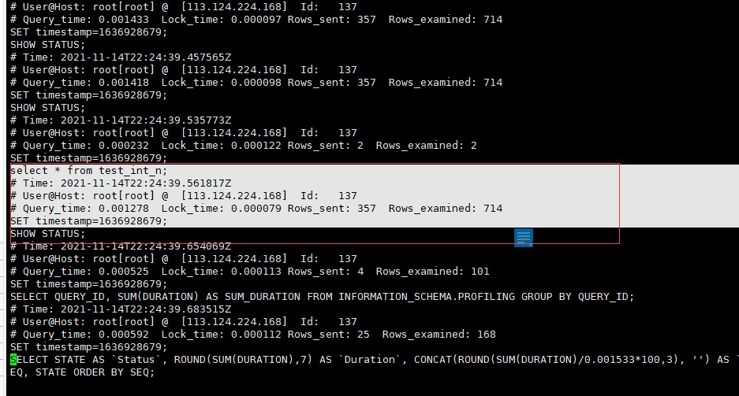
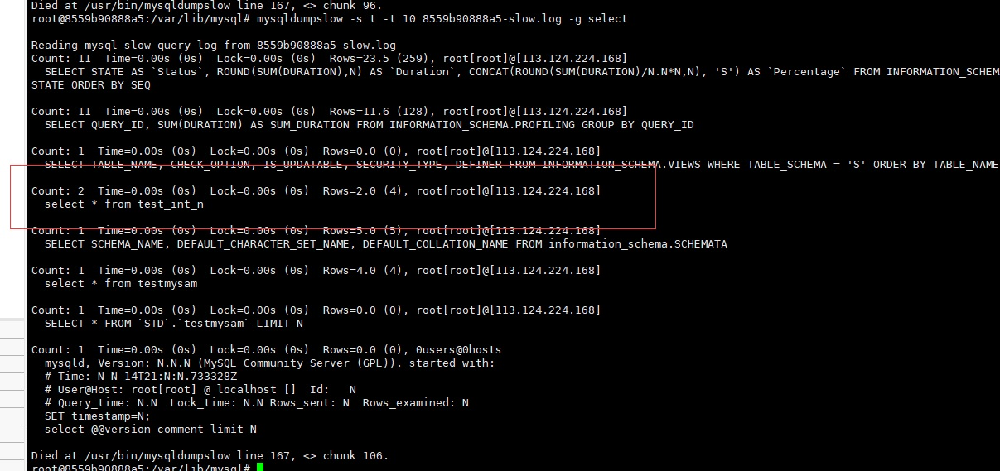

# 7. Mysql慢查询

慢查询日志，顾名思义，就是查询慢的日志，是指 mysql 记录所有执行超过 long_query_time 参数设定的时间阈值的 SQL 语句的日志。该日志能为 SQL 语句的优化带来很好的帮助。默 认情况下，慢查询日志是关闭的，要使用慢查询日志功能，首先要开启慢查询日志功能。

## 7.1 慢查询配置

我们已经知道慢查询日志可以帮助定位可能存在问题的 SQL 语句，从而进行 SQL 语句层面的优化。但是默认值为关闭的，需要我们手动开启。

```sql
show VARIABLES like 'slow_query_log';
--开启
set GLOBAL slow_query_log=1;
```

<a data-fancybox title="slow_query_log" href="./image/slow_query_log.jpg"></a>

但是多慢算慢？MySQL 中可以设定一个阈值，将运行时间超过该值的所有 SQL 语句都记录到慢查询日志中。long_query_time 参数就是这个阈值。默认值为 10，代表 10 秒。

```sql
show VARIABLES like '%long_query_time%'; --当然也可以设置 

set global long_query_time=0; ---默认 10 秒，这里为了演示方便设置为 0
```
<a data-fancybox title="long_query_time" href="./image/long_query_time.jpg"></a>

同时对于没有运行的 SQL 语句没有使用索引，则 MySQL 数据库也可以将这 条 SQL 语句记录到慢查询日志文件，控制参数是：

```sql
show VARIABLES like '%log_queries_not_using_indexes%';

set global log_queries_not_using_indexes=1;
```
<a data-fancybox title="log_queries_not_using_indexes" href="./image/log_queries_not_using_indexes.jpg"></a>

对于产生的慢查询日志，可以指定输出的位置，通过参数 log_output 来控制， 可以输出到[TABLE][FILE][FILE,TABLE]。比如

```sql
show VARIABLES like 'log_output';
set global log_output='FILE,TABLE';
```
缺省是输出到文件，我们的配置把慢查询 输出到表，不过一般不推荐输出到表。 
<a data-fancybox title="log_output" href="./image/log_output.jpg"></a>

:::tip 总结
 1. **slow_query_log** 启动停止慢查询日志 
 2. **slow_query_log_file** 指定慢查询日志得存储路径及文件（默认和数据 文件放一起） 
 3. **long_query_time** 指定记录慢查询日志 SQL 执行时间得伐值（单位： 秒，默认 10 秒） 
 4. **log_queries_not_using_indexes** 是否记录未使用索引的 SQL 
 5. **log_output** 日志存放的地方可以是[TABLE][FILE][FILE,TABLE]
 :::


 ## 7.2 慢查询解读分析

### 7.2.1 slow.log日志文件
```bash
#日志文件目录
root@8559b90888a5:/var/lib/mysql# pwd
/var/lib/mysql
root@8559b90888a5:/var/lib/mysql# ls -lrt *slow
-rw-r----- 1 mysql mysql    24444 Nov 14 22:24 8559b90888a5-slow.log
```

<a data-fancybox title="showquery" href="./image/showquery.jpg"></a>
```bash
# Time: 2021-11-14T22:24:39.535773Z
# User@Host: root[root] @  [113.124.224.168]  Id:   137
# Query_time: 0.000232  Lock_time: 0.000122 Rows_sent: 2  Rows_examined: 2
SET timestamp=1636928679;
select * from test_int_n;
```

:::tip slow.log日志文件分析
Time: 2021-11-14T22:24:39.535773Z：查询执行时间  
User@Host: root[root] @  [113.124.224.168]  Id:   137：用户名 、用户的 IP 信 息、线程 ID 号   
Query_time: 0.000232 :执行花费的时长【单位：毫秒】  
Lock_time: 0.000122 :执行获得锁的时长   
Rows_sent: 2 :获得的结果行数   
Rows_examined: 2 :扫描的数据行数  
SET timestamp：这 SQL 执行的具体时间   
最后一行：执行的 SQL 语句  
::: 

### 7.2.2 mysqldumpslow语法
:::tip 语法
```bash 
mysqldumpslow -s r -t 10 slow-mysql.log 
-s order (c,t,l,r,at,al,ar) 
c:总次数 
t:总时间 
l:锁的时间
r:获得的结果行数
at,al,ar :指 t,l,r 平均数 
【例如：at = 总时间/总次数】 
-s 对结果进行排序，怎么排，根据后面所带的 (c,t,l,r,at,al,ar)，缺省为at 
-t NUM just show the top n queries：仅显示前 n 条查询 
-g PATTERN grep: only consider stmts that include this string：通过 grep 来 筛选语句。
```
:::

```bash
./mysqldumpslow -s t -t 10 8559b90888a5-slow.log 
./mysqldumpslow -s t -t 10 8559b90888a5-slow.log -g select

```
<a data-fancybox title="slowquery" href="./image/slowquery.jpg"></a>
