# 8. Mysql执行计划

使用 EXPLAIN 关键字可以模拟优化器执行 SQL 查询语句，从而知道 MySQL 是 如何处理你的 SQL 语句的。分析你的查询语句或是表结构的性能瓶颈

:::tip 执行计划的作用 
1. 表的读取顺序 
2. 数据读取操作的操作类型 
3. 哪些索引可以使用 
4. 哪些索引被实际使用 
5. 表之间的引用 
6. 每张表有多少行被优化器查询
:::

## 8.1 执行计划的语法 
执行计划的语法其实非常简单： 在 SQL 查询的前面加上 EXPLAIN 关键字就行。

```sql
EXPLAIN select * from table1 
--重点的就是 EXPLAIN 后面你要分析的 SQL 语句 
```
除了以 SELECT 开头的查询语句，其余的 DELETE、INSERT、REPLACE 以 及 UPOATE 语句前边都可以加上 EXPLAIN，用来查看这些语句的执行计划，不 过我们这里对 SELECT 语句更感兴趣，所以后边只会以 SELECT 语句为例来描述 EsxPLAIN 语句的用法。


## 8.2 执行计划详解

```cpp
mysql> explain select * from STD.account;
+----+-------------+---------+------------+------+---------------+------+---------+------+------+----------+-------+
| id | select_type | table   | partitions | type | possible_keys | key  | key_len | ref  | rows | filtered | Extra |
+----+-------------+---------+------------+------+---------------+------+---------+------+------+----------+-------+
|  1 | SIMPLE      | account | NULL       | ALL  | NULL          | NULL | NULL    | NULL |    7 |   100.00 | NULL  |
+----+-------------+---------+------------+------+---------------+------+---------+------+------+----------+-------+
```

:::tip 执行计划字段说明
1. id： 在一个大的查询语句中每个 SELECT 关键字都对应一个唯一的 id 
2. select_type： SELECT 关键字对应的那个查询的类型 
3. table：表名
4. partitions：匹配的分区信息 
5. type：针对单表的访问方法 
6. possible_keys：可能用到的索引 
7. key：实际上使用的索引 
8. key_len：实际使用到的索引长度 
9. ref：当使用索引列等值查询时，与索引列进行等值匹配的对象信息 
10. rows：预估的需要读取的记录条数 
11. filtered：某个表经过搜索条件过滤后剩余记录条数的百分比 
12. Extra：—些额外的信息
:::


为了方便学习，我们使用范例表 order_exp： 这个表在库中有个三个派生表 s1，s2，order_exp_cut，表结构基本一致，有少许差别

<a data-fancybox title="order_exp" href="./image/order_exp.jpg">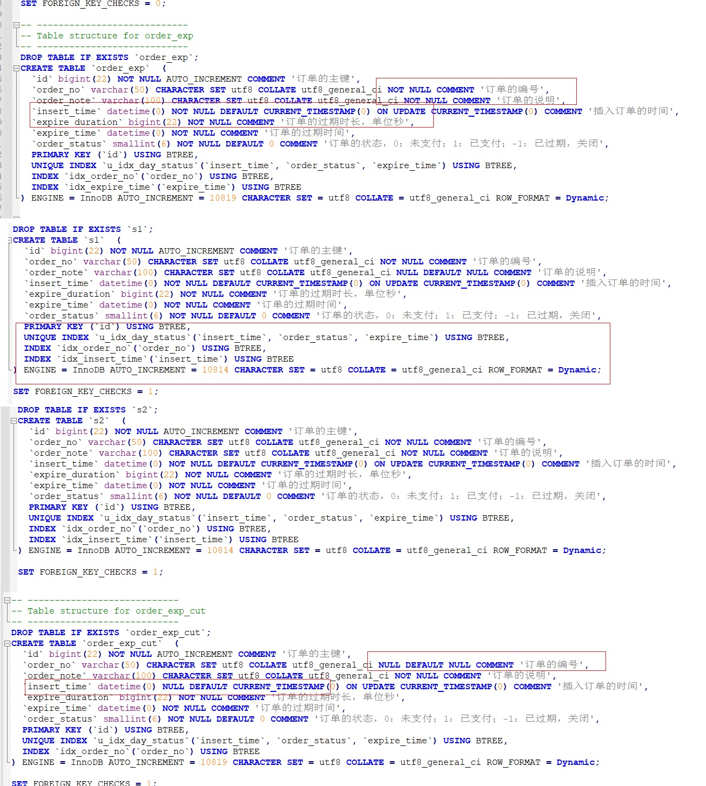</a>


## 8.3 table
不论我们的查询语句有多复杂，里边包含了多少个表，到最后也是需要对每个表进行单表访问的，MySQL 规定 EXPLAIN 语句输出的每条记录都对应着某个单表的访问方法，该条记录的 table 列代表着该表的表名。
```sql
EXPLAIN SELECT * FROM s1 INNER JOIN s2;
EXPLAIN SELECT * FROM s1 where order_no='a';
```

<a data-fancybox title="table" href="./image/table.jpg">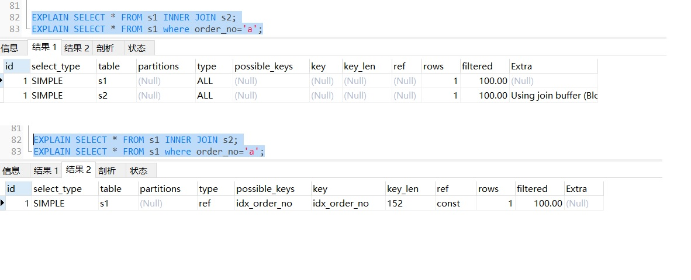</a>

可以看见，只涉及对 s1 表的单表查询，所以 EXPLAIN 输出中只有一条记录， 其中的 table 列的值是 s1，而连接查询的执行计划中有两条记录，这两条记录的 table 列分别是 s1 和 s2.

## 8.4 id

### 8.4.1 单 SELECT 关键字
比如下边这个查询中只有一个 SELECT 关键字，所以 EXPLAIN 的结果中也就 只有一条 id 列为 1 的记录∶
```sql
 EXPLAIN SELECT * FROM s1 WHERE order_no = 'a';
```
<a data-fancybox title="ID" href="./image/id01.jpg">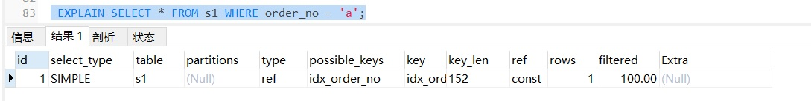</a>

### 8.4.2 连接查询

对于连接查询来说，一个 SELEOT 关键字后边的 FROM 子句中可以跟随多个 表，所以在连接查询的执行计划中，每个表都会对应一条记录，但是这些记录的 id 值都是相同的，比如: 
```sql
EXPLAIN SELECT * FROM s1 INNER JOIN s2;
EXPLAIN select s1.* from s1,s2,order_exp_cut where s1.id = s2.id and s1.id = order_exp_cut.id ;
```
<a data-fancybox title="ID" href="./image/id02.jpg">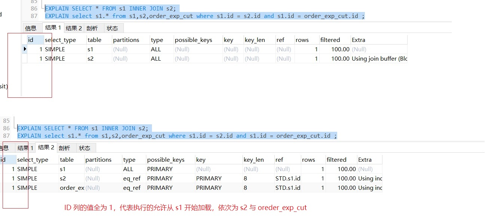</a>
可以看到，上述连接查询中参与连接的 s1 和 s2 表分别对应一条记录，但是 这两条记录对应的 id 值都是 1。这里需要大家记住的是，在连接查询的执行计划 中，每个表都会对应一条记录，这些记录的 id 列的值是相同的。

### 8.4.3 包含子查询
对于包含子查询的查询语句来说，就可能涉及多个 SELECT 关键字，所以在 包含子查询的查询语句的执行计划中，每个 SELECT 关键字都会对应一个唯一的 id 值，比如这样:

```sql
EXPLAIN SELECT * FROM s1 WHERE id IN (SELECT id FROM s2) OR order_no = 'a'; 
```

<a data-fancybox title="ID" href="./image/id03.jpg">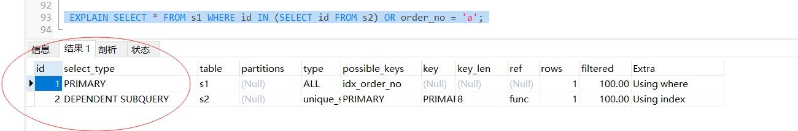</a>

但是这里大家需要特别注意，查询优化器可能对涉及子查询的查询语句进行 重写，从而转换为连接查询。所以如果我们想知道查询优化器对某个包含子查询 的语句是否进行了重写，直接查看执行计划就好了，比如说:

```sql
EXPLAIN SELECT * FROM s1 WHERE id IN (SELECT id FROM s2 WHERE order_no = 'a');
```
<a data-fancybox title="ID" href="./image/id04.jpg">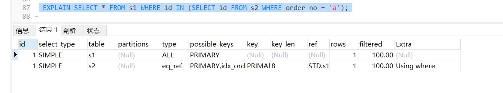</a>

可以看到，虽然我们的查询语句是一个子查询，但是执行计划中 s1 和 s2 表 对应的记录的 id 值全部是 1，这就表明了查询优化器将**子查询转换为了连接查询**,
### 8.4.4 包含 UNION 子句
对于包含 UNION 子句的查询语句来说，每个 SELECT 关键字对应一个 id 值也 是没错的，不过还是有点儿特别的东西，比方说下边这个查询:
```sql
EXPLAIN SELECT * FROM s1 UNION SELECT * FROM s2;
```
<a data-fancybox title="ID" href="./image/id05.jpg">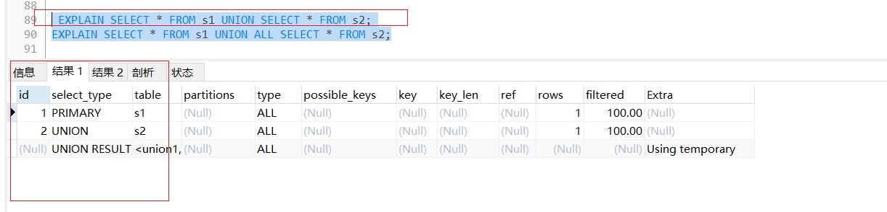</a>

这个语句的执行计划的第三条记录为什么这样？UNION 子句会把多个查询 的结果集合并起来并对结果集中的记录进行去重，怎么去重呢? MySQL 使用的是 内部的临时表。正如上边的查询计划中所示，UNION 子句是为了把 id 为 1 的查 询和id为2的查询的结果集合并起来并去重，所以在内部创建了一个名为&lt;union1， 2&gt;的临时表（就是执行计划第三条记录的 table 列的名称)，id 为 NULL 表明这个 临时表是为了合并两个查询的结果集而创建的。 跟 UNION 对比起来，UNION ALL 就不需要为最终的结果集进行去重，它只 是单纯的把多个查询的结果集中的记录合并成一个并返回给用户，所以也就不需 要使用临时表。所以在包含 UNION ALL 子句的查询的执行计划中，就没有那个 id 为 NULL 的记录，如下所示:

```sql
EXPLAIN SELECT * FROM s1 UNION ALL SELECT * FROM s2;
```
<a data-fancybox title="ID" href="./image/id06.jpg">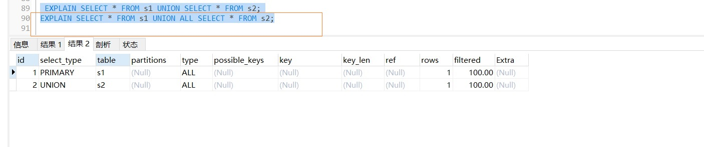</a>

## 8.5 select_type 列
通过上边的内容我们知道，一条大的查询语句里边可以包含若干个 SELECT 关键字，每个 SELECT 关键字代表着一个小的查询语句，而每个 SELECT 关键字的 From 子句中都可以包含若干张表（这些表用来做连接查询)，每一张表都对应着
执行计划输出中的一条记录，对于在同一个 SELECT 关键字中的表来说，它们的 id 值是相同的。 MySQL 为每一个 SELECT 关键字代表的小查询都定义了一个称之为 select_type 的属性，意思是我们只要知道了某个小查询的 select_type 属性，就 知道了这个小查询在整个大查询中扮演了一个什么角色

:::tip select_type 取值如下:
1. <font color='red'><strong>SIMPLE</strong></font>：简单的 select 查询,不使用 union 及子查询 
2. <font color='red'><strong>PRIMARY</strong></font>：最外层的 select 查询 
3. <font color='red'><strong>UNION</strong></font>：UNION 中的第二个或随后的 select 查询,不依赖于外部查询的结果集 
4. <font color='red'><strong>UNION RESULT</strong></font>：UNION 结果集 
5. <font color='red'><strong>SUBQUERY</strong></font>：子查询中的第一个 select 查询,不依赖于外部查询的结果集 
6. <font color='red'><strong>DEPENDENT UNION</strong></font>：UNION 中的第二个或随后的 select 查询,依赖于外部查询的结果集 
7. <font color='red'><strong>DEPENDENT SUBQUERY</strong></font>：子查询中的第一个 select 查询,依赖于外部查询的结果集
8. <font color='red'><strong>DERIVED</strong></font>： 用于 from 子句里有子查询的情况。 MySQL 会 递归执行这些 子查询, 把结果放在临时表里。 
9. <font color='red'><strong>MATERIALIZED</strong></font>：物化子查询 
10. <font color='red'><strong>UNCACHEABLE SUBQUERY</strong></font>： 结果集不能被缓存的子查询,必须重新为外层查 询的每一行进行评估，出现极少。 
11. <font color='red'><strong>UNCACHEABLE UNION</strong></font>：UNION 中的第二个或随后的 select 查询,属于不可缓 存的子查询，出现极少。
:::

### 8.5.1 SIMPLE
```sql
EXPLAIN SELECT * FROM s1 WHERE order_no = 'a'; --简单的 select 查询，查询中不包含子查询或者 UNION
EXPLAIN SELECT * FROM s1 INNER JOIN s2; --连接查询也算是 SIMPLE 类型 
```
<a data-fancybox title="ID" href="./image/id07.jpg">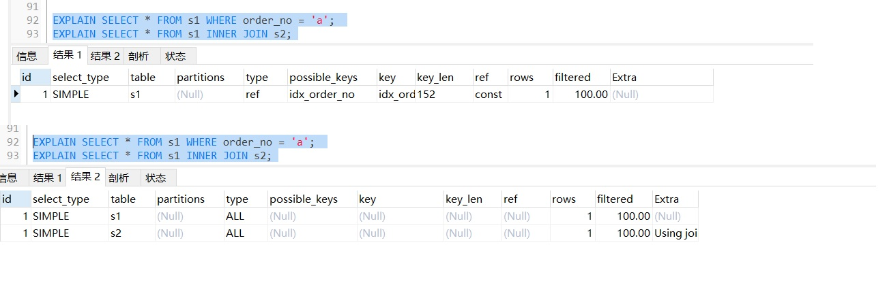</a>

### 8.5.2 PRIMARY  UNION  UNION RESULT
对于包含 UNION、UNION ALL 或者子查询的大查询来说，它是由几个小查询 组成的，其中最左边的那个查询的 select_type 值就是 PRIMARY 
对于包含 UNION 或者 UNION ALL 的大查询来说，它是由几个小查询组成的， 其中除了最左边的那个小查询以外，其余的查询的 select_type 值就是 UNION  
MySQL 选择使用临时表来完成 UNION 查询的去重工作，针对该临时表的查 询的 select_type 就是 UNION RESULT，例子上边有。  
```sql
EXPLAIN SELECT * FROM s1 UNION SELECT * FROM s2;
```
<a data-fancybox title="ID" href="./image/id05.jpg"></a>

### 8.5.3 SUBQUERY

如果包含子查询的查询语句不能够转为对应的 semi-join 的形式，并且该子查询是不相关子查询，并且查询优化器决定采用将该子查询物化的方案来执行该 子查询时，该子查询的第一个 SELECT 关键字代表的那个查询的 select_type 就是 SUBQUERY，比如下边这个查询:
```sql
 EXPLAIN SELECT * FROM s1 WHERE id IN (SELECT id FROM s2) OR order_no = 'a';
```
<a data-fancybox title="ID" href="./image/id03.jpg"></a>
可以看到，外层查询的 select_type 就是 PRTIMARY，子查询的 select_type 就 是 SUBOUERY。需要大家注意的是，由于 select_type 为 SUBQUERY 的子查询由于 会被物化，所以只需要执行一遍。

:::tip
**semi-join：**半连接优化技术，本质上是把子查询上拉到父查询中，与父查询 的表做 join 操作。关键词是“上拉”。对于子查询，其子查询部分相对于父表的 每个符合条件的元组，都要把子查询执行一轮。效率低下。用半连接操作优化子 查询，是把子查询上拉到父查询中，这样子查询的表和父查询中的表是并列关系， 父表的每个符合条件的元组，只需要在子表中找符合条件的元组即可。简单来说， 就是通过将子查询上拉对父查询中的数据进行筛选，以使获取到最少量的足以对 父查询记录进行筛选的信息就足够了。 

**子查询物化：**子查询的结果通常缓存在内存或临时表中。 

**关联/相关子查询：**子查询的执行依赖于外部查询。多数情况下是子查询的 WHERE 子句中引用了外部查询的表。自然“非关联/相关子查询”的执行则不依 赖与外部的查询。
:::
### 8.5.4 DEPENDENT UNION、DEPENDENT SUBQUERY

```sql
EXPLAIN SELECT * FROM s1 WHERE id IN (SELECT id FROM s2 WHERE id = 716 UNION SELECT id FROM s1 WHERE id = 718);
```
<a data-fancybox title="ID" href="./image/id08.jpg">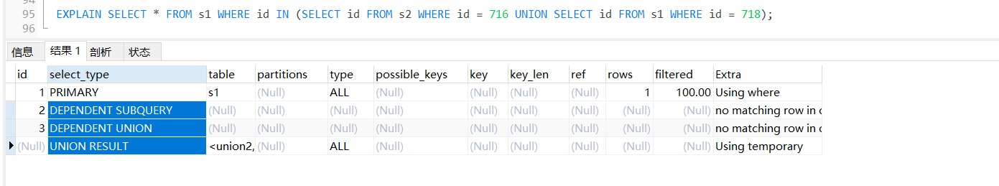</a>

### 8.5.5 DERIVED
对于采用物化的方式执行的包含派生表的查询，该派生表对应的子查询的 select_type 就是 DERIVED。
```sql
EXPLAIN SELECT * FROM (SELECT id, count(*) as c FROM s1 GROUP BY id) AS derived_s1 where c >1;
```
<a data-fancybox title="ID" href="./image/id09.jpg">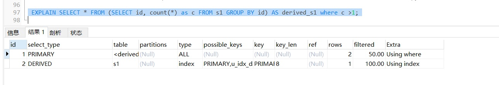</a>
从执行计划中可以看出， id 为 2 的记录就代表子查询的执行方式，它的 select_type 是 DERIVED ，说明该子查询是以物化的方式执行的。id 为 1 的记录 代表外层查询，大家注意看它的 table 列显示的是&lt;derived2>&gt;，表示该查询是针 对将派生表物化之后的表进行查询的。

### 8.5.6 MATERIALIZED
当查询优化器在执行包含子查询的语句时，选择将子查询物化之后与外层查 询进行连接查询时，该子查询对应的 select_type 属性就是 MATERIALIZED，比如 下边这个查询
```sql
EXPLAIN SELECT * FROM s1 WHERE order_no IN (SELECT order_no FROM s2);
```
<a data-fancybox title="ID" href="./image/id09.jpg"></a>

## 8.6 partitions
和分区表有关，一般情况下我们的查询语句的执行计划的 partitions 列的值都是 NULL。

## 8.7 type

我们前边说过执行计划的一条记录就代表着 MySQL 对某个表的执行查询时 的访问方法/访问类型，其中的 type 列就表明了这个访问方法/访问类型是个什么 东西，是较为重要的一个指标，

结果值从最好到最坏依次是： **system > const > eq_ref > ref > fulltext > ref_or_null > index_merge > unique_subquery > index_subquery > range > index > ALL**

出现比较多的是 **system>const>eq_ref>ref>range>index>ALL**

一般来说，得保证查询至少达到 range 级别，最好能达到 ref。

### 8.7.1 System 与 const

**System**：表只有一行记录（等于系统表），这是 const 类型的特列，平时不会出现，这个也可以忽略不计

**Const**：表示通过索引一次就找到了 const 用于比较 primary key 或者 unique 索引。因为只匹配一行数据，所以很快 如将主键置于 where 列表中，MySQL 就能将该查询转换为一个常量

```sql
EXPLAIN SELECT * FROM order_exp WHERE id = 716;
```
<a data-fancybox title="ID" href="./image/const.jpg">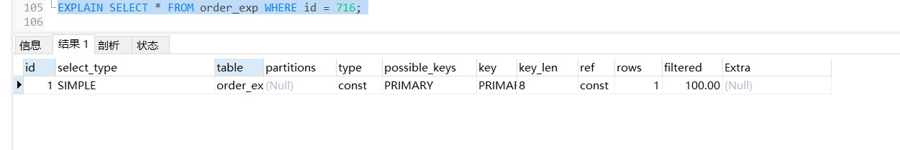</a>

### 8.7.2 eq_ref 
唯一性索引扫描，对于每个索引键，表中只有一条记录与之匹配。常见于主键或唯一索引扫描

在连接查询时，如果被驱动表是通过主键或者唯一二级索引列等值匹配的 方式进行访问的〈如果该主键或者唯一二级索引是联合索引的话，所有的索引列 都必须进行等值比较)，则对该被驱动表的访问方法就是eq_ref
```sql
EXPLAIN SELECT * FROM s1 INNER JOIN s2 ON s1.id = s2.id;
```
<a data-fancybox title="ID" href="./image/eq_ref.jpg">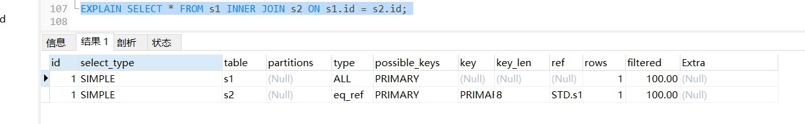</a>

**驱动表与被驱动表**：A 表和 B 表 join 连接查询，如果通过 A 表的结果集作为 循环基础数据，然后一条一条地通过该结果集中的数据作为过滤条件到 B 表中查 询数据，然后合并结果。那么我们称 A 表为驱动表，B 表为被驱动表

### 8.7.3 ref 
当通过普通的二级索引列与常量进行等值匹配时来查询某个表，那么对该表的访问方法就可能是 ref。 

本质上也是一种索引访问，它返回所有匹配某个单独值的行，然而，它可能会找到多个符合条件的行，所以他属于查找和扫描的混合体

```sql
--INDEX `idx_order_no`(`order_no`) 
EXPLAIN SELECT * FROM s1 WHERE order_no = 'a';
```
<a data-fancybox title="ID" href="./image/ref.jpg">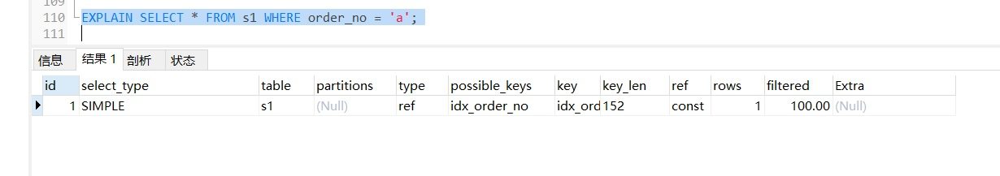</a>

### 8.7.4 fulltext 
全文索引，跳过～。


### 8.7.5 ef_or_null 

有时候我们不仅想找出某个二级索引列的值等于某个常数的记录，还想把该 列的值为 NULL 的记录也找出来，就像下边这个查询：
```sql
--`order_no` varchar(50) CHARACTER SET utf8 COLLATE utf8_general_ci NULL DEFAULT NULL COMMENT '订单的编号',
 explain SELECT * FROM order_exp_cut WHERE order_no= 'abc' OR order_no IS NULL;
```
注意，上面的表改为了 order_exp_cut，order_exp_cut 相对于 order_exp 就 是把一些列改为了允许 null，其他的无变化。

<a data-fancybox title="ID" href="./image/ref_or_null.jpg">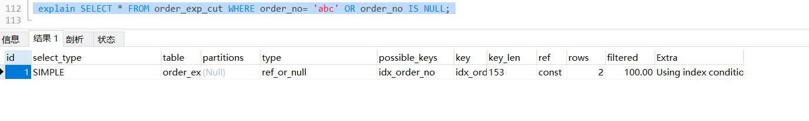</a>

### 8.7.6 index_merge 
一般情况下对于某个表的查询只能使用到一个索引，在某些场景下可以使用 索引合并的方式来执行查询: 
```sql
EXPLAIN SELECT * FROM s1 WHERE order_no = 'a' OR insert_time = '2021-03-22 18:36:47';
```
<a data-fancybox title="ID" href="./image/index_merge.jpg">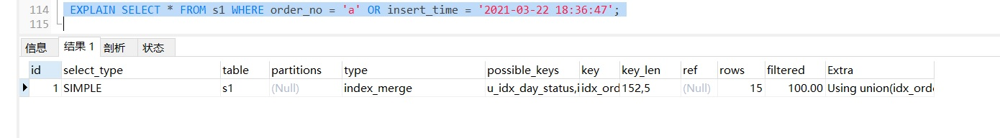</a>

### 8.7.7 unique_subquery
类似于两表连接中被驱动表的 eg_ref 访问方法，unique _subquery 是针对在 一些包含IN子查询的查询语句中，如果查询优化器决定将IN子查询转换为EXISTS 子查询，而且子查询可以使用到主键进行等值匹配的话，那么该子查询执行计划 的 type 列的值就是 unique_subquery，比如下边的这个查询语句: 
```sql
EXPLAIN SELECT * FROM STD.s1 WHERE id IN (SELECT id FROM STD.s2 where STD.s1.insert_time = STD.s2.insert_time) OR order_no = 'a';
```
```cpp
mysql> EXPLAIN SELECT * FROM STD.s1 WHERE id IN (SELECT id FROM STD.s2 where STD.s1.insert_time = STD.s2.insert_time) OR order_no = 'a';
+----+--------------------+-------+------------+-----------------+------------------------------------------+---------+---------+------+-------+----------+-------------+
| id | select_type        | table | partitions | type            | possible_keys                            | key     | key_len | ref  | rows  | filtered | Extra       |
+----+--------------------+-------+------------+-----------------+------------------------------------------+---------+---------+------+-------+----------+-------------+
|  1 | PRIMARY            | s1    | NULL       | ALL             | idx_order_no                             | NULL    | NULL    | NULL | 10661 |   100.00 | Using where |
|  2 | DEPENDENT SUBQUERY | s2    | NULL       | unique_subquery | PRIMARY,u_idx_day_status,idx_insert_time | PRIMARY | 8       | func |     1 |    10.00 | Using where |
+----+--------------------+-------+------------+-----------------+------------------------------------------+---------+---------+------+-------+----------+-------------+
2 rows in set, 2 warnings (0.00 sec)
```

可以看到执行计划的第二条记录的 type 值就是 unique_subquery，说明在执行子查询时会使用到 id 列的索引。


range 
如果使用索引获取某些范围区间的记录，那么就可能使用到range访问方法， 一般就是在你的 where 语句中出现了 between、<、>、in 等的查询。 这种范围**扫描索引扫描**比全表扫描要好，因为它只需要开始于索引的某一点， 而结束于另一点，不用扫描全部索引。 
```sql
EXPLAIN SELECT * FROM STD.s1 WHERE order_no IN ('a', 'b', 'c'); 
EXPLAIN SELECT * FROM STD.s1 WHERE order_no > 'a' AND order_no < 'b';
```

```cpp
mysql> EXPLAIN SELECT * FROM STD.s1 WHERE order_no IN ('a', 'b', 'c'); 
+----+-------------+-------+------------+-------+---------------+--------------+---------+------+------+----------+-----------------------+
| id | select_type | table | partitions | type  | possible_keys | key          | key_len | ref  | rows | filtered | Extra                 |
+----+-------------+-------+------------+-------+---------------+--------------+---------+------+------+----------+-----------------------+
|  1 | SIMPLE      | s1    | NULL       | range | idx_order_no  | idx_order_no | 152     | NULL |    3 |   100.00 | Using index condition |
+----+-------------+-------+------------+-------+---------------+--------------+---------+------+------+----------+-----------------------+
1 row in set, 1 warning (0.00 sec)

mysql> EXPLAIN SELECT * FROM STD.s1 WHERE order_no > 'a' AND order_no < 'b';
+----+-------------+-------+------------+-------+---------------+--------------+---------+------+------+----------+-----------------------+
| id | select_type | table | partitions | type  | possible_keys | key          | key_len | ref  | rows | filtered | Extra                 |
+----+-------------+-------+------------+-------+---------------+--------------+---------+------+------+----------+-----------------------+
|  1 | SIMPLE      | s1    | NULL       | range | idx_order_no  | idx_order_no | 152     | NULL |    1 |   100.00 | Using index condition |
+----+-------------+-------+------------+-------+---------------+--------------+---------+------+------+----------+-----------------------+
1 row in set, 1 warning (0.00 sec)

```
这种利用索引进行范围匹配的访问方法称之为：range。 此处所说的使用索引进行范围匹配中的 `索引` 可以是聚簇索引，也可以是二级索引。

### 8.7.8 index
 index 当我们可以使用索引覆盖，但需要扫描全部的索引记录时，该表的访问方法就是index。
```sql
--  UNIQUE INDEX `u_idx_day_status`(`insert_time`, `order_status`, `expire_time`) USING BTREE,
mysql> EXPLAIN SELECT insert_time FROM STD.s1 WHERE expire_time = '2021-03-22 18:36:47';
+----+-------------+-------+------------+-------+---------------+------------------+---------+------+-------+----------+--------------------------+
| id | select_type | table | partitions | type  | possible_keys | key              | key_len | ref  | rows  | filtered | Extra                    |
+----+-------------+-------+------------+-------+---------------+------------------+---------+------+-------+----------+--------------------------+
|  1 | SIMPLE      | s1    | NULL       | index | NULL          | u_idx_day_status | 12      | NULL | 10661 |    10.00 | Using where; Using index |
+----+-------------+-------+------------+-------+---------------+------------------+---------+------+-------+----------+--------------------------+
1 row in set, 1 warning (0.00 sec)

```
### 8.7.9 all 
最熟悉的全表扫描，将遍历全表以找到匹配的行
```sql
mysql> EXPLAIN SELECT * FROM STD.s1;
+----+-------------+-------+------------+------+---------------+------+---------+------+-------+----------+-------+
| id | select_type | table | partitions | type | possible_keys | key  | key_len | ref  | rows  | filtered | Extra |
+----+-------------+-------+------------+------+---------------+------+---------+------+-------+----------+-------+
|  1 | SIMPLE      | s1    | NULL       | ALL  | NULL          | NULL | NULL    | NULL | 10661 |   100.00 | NULL  |
+----+-------------+-------+------------+------+---------------+------+---------+------+-------+----------+-------+
1 row in set, 1 warning (0.01 sec)
```

## 8.8 possible_keys 与 key

在EXPLAIN 语句输出的执行计划中,
possible_keys 列表示在某个查询语句中， 对某个表执行单表查询时可能用到的索引有哪些，  
key 列表示实际用到的索引有哪些，如果为 NULL，则没有使用索引。比方说下边这个查询 
```sql
--  UNIQUE INDEX `u_idx_day_status`(`insert_time`, `order_status`, `expire_time`) USING BTREE,
mysql> EXPLAIN SELECT order_note FROM STD.s1 WHERE insert_time = '2021-03-22 18:36:47';
+----+-------------+-------+------------+------+----------------------------------+------------------+---------+-------+------+----------+-------+
| id | select_type | table | partitions | type | possible_keys                    | key              | key_len | ref   | rows | filtered | Extra |
+----+-------------+-------+------------+------+----------------------------------+------------------+---------+-------+------+----------+-------+
|  1 | SIMPLE      | s1    | NULL       | ref  | u_idx_day_status,idx_insert_time | u_idx_day_status | 5       | const |   14 |   100.00 | NULL  |
+----+-------------+-------+------------+------+----------------------------------+------------------+---------+-------+------+----------+-------+
1 row in set, 1 warning (0.00 sec)

```
上述执行计划的 possible keys 列的值表示该查询可能使用到 u_idx_day_status,idx_insert_time 两个索引，然后 key 列的值是 u_idx_day_status， 表示经过查询优化器计算使用不同索引的成本后，最后决定使用 u_idx_day_status 来执行查询比较划算。 

不过有一点比较特别，就是在使用 index 访问方法来查询某个表时，可能会出现 possible_keys 列是空的，而 key 列展示的是实际使用到的索引，比如这样:
```cpp
mysql> EXPLAIN SELECT insert_time FROM STD.s1 WHERE expire_time = '2021-03-22 18:36:47';
+----+-------------+-------+------------+-------+---------------+------------------+---------+------+-------+----------+--------------------------+
| id | select_type | table | partitions | type  | possible_keys | key              | key_len | ref  | rows  | filtered | Extra                    |
+----+-------------+-------+------------+-------+---------------+------------------+---------+------+-------+----------+--------------------------+
|  1 | SIMPLE      | s1    | NULL       | index | NULL          | u_idx_day_status | 12      | NULL | 10661 |    10.00 | Using where; Using index |
+----+-------------+-------+------------+-------+---------------+------------------+---------+------+-------+----------+--------------------------+
1 row in set, 1 warning (0.00 sec)

```
## 8.9 key_len
key_len 列表示当优化器决定使用某个索引执行查询时，该索引记录的最大 长度，计算方式是这样的： 
对于使用固定长度类型的索引列来说，它实际占用的存储空间的最大长度就 是该固定值，对于指定字符集的变长类型的索引列来说，比如某个索引列的类型 是 VARCHAR(100)，使用的字符集是 utf8，那么该列实际占用的最大存储空间就 是 100 x 3 = 300 个字节。 

如果该索引列可以存储 NULL 值，则 key_len 比不可以存储 NULL 值时多 1 个 字节。

对于变长字段来说，都会有 2 个字节的空间来存储该变长列的实际长度

```cpp
mysql> EXPLAIN SELECT * FROM STD.s1 WHERE id = 718;
+----+-------------+-------+------------+-------+---------------+---------+---------+-------+------+----------+-------+
| id | select_type | table | partitions | type  | possible_keys | key     | key_len | ref   | rows | filtered | Extra |
+----+-------------+-------+------------+-------+---------------+---------+---------+-------+------+----------+-------+
|  1 | SIMPLE      | s1    | NULL       | const | PRIMARY       | PRIMARY | 8       | const |    1 |   100.00 | NULL  |
+----+-------------+-------+------------+-------+---------------+---------+---------+-------+------+----------+-------+
1 row in set, 1 warning (0.00 sec)

```
由于 id 列的类型是 bigint，并且不可以存储 NULL 值，所以在使用该列的索 引时 key_len 大小就是 8。 

对于可变长度的索引列来说，比如下边这个查询: 
```cpp
mysql> EXPLAIN SELECT * FROM STD.s1 WHERE order_no = 'a'; 
+----+-------------+-------+------------+------+---------------+--------------+---------+-------+------+----------+-------+
| id | select_type | table | partitions | type | possible_keys | key          | key_len | ref   | rows | filtered | Extra |
+----+-------------+-------+------------+------+---------------+--------------+---------+-------+------+----------+-------+
|  1 | SIMPLE      | s1    | NULL       | ref  | idx_order_no  | idx_order_no | 152     | const |    1 |   100.00 | NULL  |
+----+-------------+-------+------------+------+---------------+--------------+---------+-------+------+----------+-------+
1 row in set, 1 warning (0.00 sec)

```
由于 order_no 列的类型是 VARCHAR(50)，所以该列实际最多占用的存储空间就是 50*3 字节，又因为**该列是可变长度列**，所以 key_len 需要加 2，最后 ken_len 的值就是 152

Key_len 表示索引中使用的字节数，可通过该列计算查询中使用的索引的长度。<font color='red'><strong>在不损失精确性的情况下，长度越短越好</strong></font>

key_len显示的值为索引字段的最大可能长度，并非实际使用长度，即key_len 是根据表定义计算而得，不是通过表内检索出的。 注意：char 和 varchar 跟字符编码也有密切的联系，比如 latin1 占用 1 个字节， gbk 占用 2 个字节，utf8 占用 3 个字节。

## 8.10 ref
r当使用索引列等值匹配的条件去执行查询时，也就是在访问方法是 const、 eg_ref、ref、ref_or_null、unique_sutbquery、index_subopery 其中之一时,ref 列 展示的就是与索引列作等值匹配的是谁，比如**只是一个常数或者是某个列**。比如：

```cpp
mysql> EXPLAIN SELECT * FROM STD.s1 WHERE order_no = 'a'; 
+----+-------------+-------+------------+------+---------------+--------------+---------+-------+------+----------+-------+
| id | select_type | table | partitions | type | possible_keys | key          | key_len | ref   | rows | filtered | Extra |
+----+-------------+-------+------------+------+---------------+--------------+---------+-------+------+----------+-------+
|  1 | SIMPLE      | s1    | NULL       | ref  | idx_order_no  | idx_order_no | 152     | const |    1 |   100.00 | NULL  |
+----+-------------+-------+------------+------+---------------+--------------+---------+-------+------+----------+-------+
1 row in set, 1 warning (0.00 sec)

```
可以看到 ref 列的值是 const，表明在使用 idx_order_no 索引执行查询时，与 order_no 列作等值匹配的对象是**一个常数**

当然有时候更复杂一点： 
```cpp
mysql> EXPLAIN SELECT * FROM STD.s1 INNER JOIN STD.s2 ON STD.s1.id = STD.s2.id;
+----+-------------+-------+------------+--------+---------------+---------+---------+-----------+-------+----------+-------+
| id | select_type | table | partitions | type   | possible_keys | key     | key_len | ref       | rows  | filtered | Extra |
+----+-------------+-------+------------+--------+---------------+---------+---------+-----------+-------+----------+-------+
|  1 | SIMPLE      | s2    | NULL       | ALL    | PRIMARY       | NULL    | NULL    | NULL      | 10621 |   100.00 | NULL  |
|  1 | SIMPLE      | s1    | NULL       | eq_ref | PRIMARY       | PRIMARY | 8       | STD.s2.id |     1 |   100.00 | NULL  |
+----+-------------+-------+------------+--------+---------------+---------+---------+-----------+-------+----------+-------+
2 rows in set, 1 warning (0.00 sec)

```
可以看到对被驱动表 s2 的访问方法是 eq_ref，而对应的 ref 列的值是 STD.s2.id，这说明在对被驱动表进行访问时会用到 **PRIMARY 索引**，也就是聚簇索引与一个列进行等值匹配的条件，与 s2 表的 id 作等值匹配的对象就是 STD.s2.id 列(注意这里把数据库名也写出来了)。 

有的时候**与索引列进行等值匹配的对象是一个函数**，比如 

```cpp
mysql> EXPLAIN SELECT * FROM STD.s1 INNER JOIN STD.s2 ON STD.s2.order_no= UPPER(STD.s1.order_no);
+----+-------------+-------+------------+------+---------------+--------------+---------+------+-------+----------+-----------------------+
| id | select_type | table | partitions | type | possible_keys | key          | key_len | ref  | rows  | filtered | Extra                 |
+----+-------------+-------+------------+------+---------------+--------------+---------+------+-------+----------+-----------------------+
|  1 | SIMPLE      | s1    | NULL       | ALL  | NULL          | NULL         | NULL    | NULL | 10661 |   100.00 | NULL                  |
|  1 | SIMPLE      | s2    | NULL       | ref  | idx_order_no  | idx_order_no | 152     | func |     1 |   100.00 | Using index condition |
+----+-------------+-------+------------+------+---------------+--------------+---------+------+-------+----------+-----------------------+
2 rows in set, 1 warning (0.00 sec)

```
可以看到在查询计划的**ref 列⾥输出的是 func**
## 8.11 rows

如果查询优化器决定使用全表扫描的方式对某个表执行查询时，执行计划的 rows 列就代表预计**需要扫描的行数**

如果使用索引来执行查询时，执行计划的 rows 列就代表预计**扫描的索引记录行数**。

比如下边两个查询:

```cpp
mysql> EXPLAIN SELECT * FROM STD.s1 WHERE order_no > 'z'; 
+----+-------------+-------+------------+-------+---------------+--------------+---------+------+------+----------+-----------------------+
| id | select_type | table | partitions | type  | possible_keys | key          | key_len | ref  | rows | filtered | Extra                 |
+----+-------------+-------+------------+-------+---------------+--------------+---------+------+------+----------+-----------------------+
|  1 | SIMPLE      | s1    | NULL       | range | idx_order_no  | idx_order_no | 152     | NULL |    1 |   100.00 | Using index condition |
+----+-------------+-------+------------+-------+---------------+--------------+---------+------+------+----------+-----------------------+
1 row in set, 1 warning (0.00 sec)

/** order_no > 'a' 索引失效了，所以索引上大于小于慎用**/
mysql> EXPLAIN SELECT * FROM STD.s1 WHERE order_no > 'a';
+----+-------------+-------+------------+------+---------------+------+---------+------+-------+----------+-------------+
| id | select_type | table | partitions | type | possible_keys | key  | key_len | ref  | rows  | filtered | Extra       |
+----+-------------+-------+------------+------+---------------+------+---------+------+-------+----------+-------------+
|  1 | SIMPLE      | s1    | NULL       | ALL  | idx_order_no  | NULL | NULL    | NULL | 10661 |    50.00 | Using where |
+----+-------------+-------+------------+------+---------------+------+---------+------+-------+----------+-------------+
1 row in set, 1 warning (0.00 sec)

```
我们看到执行计划的 rows 列的值是分别是 1 和 10661 器在经过分析使用 idx_order_no 进行查询的成本之后，觉得满足 order_no> ' a ' 这个条件的记录只有 1 条，觉得满足 order_no> ' a '这个条件的记录有 10661 条
## 8.12 filtered

查询优化器预测有多少条记录满⾜其余的搜索条件，什么意思呢？

看具体的语句：
```cpp
mysql> EXPLAIN SELECT * FROM STD.s1 WHERE id > 5890 AND order_note = 'a';
+----+-------------+-------+------------+-------+---------------+---------+---------+------+------+----------+-------------+
| id | select_type | table | partitions | type  | possible_keys | key     | key_len | ref  | rows | filtered | Extra       |
+----+-------------+-------+------------+-------+---------------+---------+---------+------+------+----------+-------------+
|  1 | SIMPLE      | s1    | NULL       | range | PRIMARY       | PRIMARY | 8       | NULL | 5330 |    10.00 | Using where |
+----+-------------+-------+------------+-------+---------------+---------+---------+------+------+----------+-------------+
1 row in set, 1 warning (0.00 sec)
 
```

从执行计划的 key 列中可以看出来，该查询使用 PRIMARY 索引来执行查询， 从 rows 列可以看出满足 id > 5890 的记录有 5286 条。执行计划的 filtered 列就代 表查询优化器预测在这 5330 条记录中，有多少条记录满足其余的搜索条件，也就是 order_note = 'a'这个条件的百分比。此处 filtered 列的值是 10.0，说明查询优化器预测在 5330 条记录中有 10.00%的记录满足 order_note = 'a'这个条件(5330*10%=533)。 

对于单表查询来说，这个 filtered 列的值没什么意义，我们更关注在连接查 询中驱动表对应的执行计划记录的 filtered 值，比方说下边这个查询: 

```cpp
mysql> EXPLAIN SELECT * FROM STD.s1 INNER JOIN STD.s2 ON STD.s1.order_no = STD.s2.order_no WHERE STD.s1.order_note > ''; 
+----+-------------+-------+------------+------+---------------+--------------+---------+-----------------+-------+----------+-------------+
| id | select_type | table | partitions | type | possible_keys | key          | key_len | ref             | rows  | filtered | Extra       |
+----+-------------+-------+------------+------+---------------+--------------+---------+-----------------+-------+----------+-------------+
|  1 | SIMPLE      | s1    | NULL       | ALL  | idx_order_no  | NULL         | NULL    | NULL            | 10661 |    33.33 | Using where |
|  1 | SIMPLE      | s2    | NULL       | ref  | idx_order_no  | idx_order_no | 152     | STD.s1.order_no |     1 |   100.00 | NULL        |
+----+-------------+-------+------------+------+---------------+--------------+---------+-----------------+-------+----------+-------------+
2 rows in set, 1 warning (0.00 sec)

```

从执行计划中可以看出来，查询优化器打算把 s 1 当作驱动表，s2 当作被驱 动表。我们可以看到驱动表 s1 表的执行计划的 rows 列为 10661 列为 33.33 ，这意味着驱动表 s1 的扇出值就是 10661 x 33.33 % = 3553.3，这说明还要对被驱动表执行大约 3554 次查询。

## 8.13 Extra

顾名思义，Extra 列是用来说明一些额外信息的，我们可以通过这些额外信 息来更准确的理解 MySQL 到底将如何执行给定的查询语句。MySQL 提供的额外 信息很多，几十个，无法一一介绍，挑一些平时常见的或者比较重要的额外信息 讲讲，同时因为数据的关系，很难实际演示出来，所以本小节的相关内容不会提 供全部实际的 SQL 语句和结果画面
<a data-fancybox title="Extra" href="./image/extra.jpg">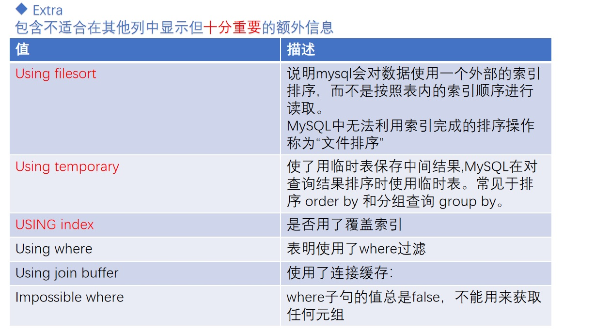</a>


### 8.13.1 No tables used 

当查询语句的没有 FROM 子句时将会提示该额外信息。 
### 8.13.2 Impossible WHERE 

查询语句的 WHERE 子句永远为 FALSE 时将会提示该额外信息。 
### 8.13.3 No matching min/max row 

当查询列表处有 MIN 或者 MAX 聚集函数，但是并没有符合 WHERE 子句中 的搜索条件的记录时，将会提示该额外信息。 

### 8.13.4 Using index 
当我们的查询列表以及搜索条件中只包含属于某个索引的列，也就是在可以 使用索引覆盖的情况下，在 Extra 列将会提示该额外信息。比方说下边这个查询 中只需要用到 idx_order_no 而不需要回表操作：

```cpp
mysql> EXPLAIN SELECT expire_time FROM STD.s1 WHERE insert_time = '2021-03-22 18:36:47';
+----+-------------+-------+------------+------+----------------------------------+------------------+---------+-------+------+----------+-------------+
| id | select_type | table | partitions | type | possible_keys                    | key              | key_len | ref   | rows | filtered | Extra       |
+----+-------------+-------+------------+------+----------------------------------+------------------+---------+-------+------+----------+-------------+
|  1 | SIMPLE      | s1    | NULL       | ref  | u_idx_day_status,idx_insert_time | u_idx_day_status | 5       | const |   14 |   100.00 | Using index |
+----+-------------+-------+------------+------+----------------------------------+------------------+---------+-------+------+----------+-------------+
1 row in set, 1 warning (0.00 sec)

```

### 8.13.5 Using index condition 
有些搜索条件中虽然出现了索引列，但却不能使用到索引，比如下边这个查询：

```sql
SELECT * FROM s1 WHERE order_no > 'z' AND order_no LIKE '%a';
```
其中的 order_no> 'z'可以使用到索引，但是 order_no LIKE '%a'却无法使用到索引，

在以前版本的 MySQL 中，是按照下边步骤来执行这个查询的： 
1. 先根据 order_no> 'z'这个条件，从二级索引 idx_order_no 中获取到对应的 二级索引记录。 
2. 根据上一步骤得到的二级索引记录中的主键值进行回表(因为是 select *)， 找到完整的用户记录再检测该记录是否符合 key1 LIKE '%a'这个条件，将符合条件 的记录加入到最后的结果集。 

但是虽然 order_no LIKE '%a'不能组成范围区间参与 range 访问方法的执行， 但这个条件毕竟只涉及到了 order_no 列，MySQL 把上边的步骤改进了一下。 

**索引条件下推**
1. 先根据 order_no> 'z'这个条件，定位到二级索引 idx_order_no 中对应的二级索引记录。 
2. 对于指定的二级索引记录，先不着急回表，而是先检测一下该记录是否满足 order_noLIKE '%a'这个条件，如果这个条件不满足，则该二级索引记录压根儿就没必要回表。 

3. 对于满足 order_no LIKE '%a'这个条件的二级索引记录执行回表操作。 我们说回表操作其实是一个随机 IO，比较耗时，所以上述修改可以省去很 多回表操作的成本。这个改进称之为索引条件下推（英文名：ICP ，Index Condition Pushdown）。

如果在查询语句的执行过程中将要使用索引条件下推这个特性，在 Extra 列 中将会显示 Using index condition，比如这样：
```cpp
mysql> explain SELECT * FROM STD.s1 WHERE order_no > 'z' AND order_no LIKE '%a';
+----+-------------+-------+------------+-------+---------------+--------------+---------+------+------+----------+-----------------------+
| id | select_type | table | partitions | type  | possible_keys | key          | key_len | ref  | rows | filtered | Extra                 |
+----+-------------+-------+------------+-------+---------------+--------------+---------+------+------+----------+-----------------------+
|  1 | SIMPLE      | s1    | NULL       | range | idx_order_no  | idx_order_no | 152     | NULL |    1 |   100.00 | Using index condition |
+----+-------------+-------+------------+-------+---------------+--------------+---------+------+------+----------+-----------------------+
1 row in set, 1 warning (0.00 sec)
```

### 8.13.6 Using where 

当我们使用全表扫描来执行对某个表的查询，并且该语句的 WHERE 子句中 有针对该表的搜索条件时，在 Extra 列中会提示上述额外信息。 
```cpp
mysql> EXPLAIN SELECT * FROM STD.s1 WHERE order_note = 'a'; 
+----+-------------+-------+------------+------+---------------+------+---------+------+-------+----------+-------------+
| id | select_type | table | partitions | type | possible_keys | key  | key_len | ref  | rows  | filtered | Extra       |
+----+-------------+-------+------------+------+---------------+------+---------+------+-------+----------+-------------+
|  1 | SIMPLE      | s1    | NULL       | ALL  | NULL          | NULL | NULL    | NULL | 10661 |    10.00 | Using where |
+----+-------------+-------+------------+------+---------------+------+---------+------+-------+----------+-------------+
1 row in set, 1 warning (0.00 sec)

```
当使用索引访问来执行对某个表的查询，并且该语句的 WHERE 子句中有除了该索引包含的列之外的其他搜索条件时，在 Extra 列中也会提示上述信息。 

比如下边这个查询虽然使用 idx_order_no 索引执行查询，但是搜索条件中除 了包含 order_no 的搜索条件 order_no = 'a'，还有包含 order_note 的搜索条件， 此时需要回表检索记录然后进行条件判断，所以 Extra 列会显示 Using where 的 提示：
```cpp
mysql> EXPLAIN SELECT * FROM STD.s1 WHERE order_no = 'a' AND order_note = 'a'; 
+----+-------------+-------+------------+------+---------------+--------------+---------+-------+------+----------+-------------+
| id | select_type | table | partitions | type | possible_keys | key          | key_len | ref   | rows | filtered | Extra       |
+----+-------------+-------+------------+------+---------------+--------------+---------+-------+------+----------+-------------+
|  1 | SIMPLE      | s1    | NULL       | ref  | idx_order_no  | idx_order_no | 152     | const |    1 |    10.00 | Using where |
+----+-------------+-------+------------+------+---------------+--------------+---------+-------+------+----------+-------------+
1 row in set, 1 warning (0.00 sec)

```

但是大家注意：出现了 Using where，只是表示在 server 层根据 where 条件 进行了过滤，和是否全表扫描或读取了索引文件没有关系，网上有不少文章把 Using where 和是否读取索引进行关联，是不正确的，也有文章把 Using where 和 回表进行了关联，这也是不对的。

按照 MySQL 官方的说明： https://dev.mysql.com/doc/refman/5.7/en/explain-output.html#explain_extra 意思是：Extra 列中出现了 Using where 代表 WHERE 子句用于限制要与下一 个表匹配或发送给客户端的行。 很明显，Using where 只是表示 MySQL 使用 where 子句中的条件对记录进行了过滤

### 8.13.7 Using join buffer (Block Nested Loop) 

在连接查询执行过程中，当被驱动表不能有效的利用索引加快访问速度， MySQL 一般会为其分配一块名叫 join buffer 的内存块来加快查询速度： 

```cpp
mysql> EXPLAIN SELECT * FROM STD.s1 INNER JOIN STD.s2 ON STD.s1.order_note = STD.s2.order_note;
+----+-------------+-------+------------+------+---------------+------+---------+------+-------+----------+----------------------------------------------------+
| id | select_type | table | partitions | type | possible_keys | key  | key_len | ref  | rows  | filtered | Extra                                              |
+----+-------------+-------+------------+------+---------------+------+---------+------+-------+----------+----------------------------------------------------+
|  1 | SIMPLE      | s2    | NULL       | ALL  | NULL          | NULL | NULL    | NULL | 10621 |   100.00 | NULL                                               |
|  1 | SIMPLE      | s1    | NULL       | ALL  | NULL          | NULL | NULL    | NULL | 10661 |    10.00 | Using where; Using join buffer (Block Nested Loop) |
+----+-------------+-------+------------+------+---------------+------+---------+------+-------+----------+----------------------------------------------------+
2 rows in set, 1 warning (0.00 sec)

```

我们看到，在对 s1 表的执行计划的 Extra 列显示了两个提示：

Using join buffer (Block Nested Loop)：这是因为对表 s1 的访问不能有效利用索引，只好退而求其次，使用 join buffer 来减少对 s1 表的访问次数，从而提高 性能。
 
Using where：可以看到查询语句中有一个 s1.order_note = s2.order_note 条件，因为 s2 是驱动表，s1 是被驱动表，所以在访问 s1 表时，s1.order_note 的 值已经确定下来了，所以实际上查询 s1 表条件就是 s1.order_note = 一个常数， 所以提示了 Using where 额外信息。


### 8.13.8 Not exists 
当我们使用左（外）连接时，如果 WHERE 子句中包含要求被驱动表的某个 列等于 NULL 值的搜索条件，而且那个列又是不允许存储 NULL 值的，那么在该 表的执行计划的 Extra 列就会提示 Not exists 额外信息，比如这样： 

```cpp
mysql> EXPLAIN SELECT * FROM STD.s1 LEFT JOIN STD.s2 ON STD.s1.order_no = STD.s2.order_no WHERE STD.s2.id IS NULL; 
+----+-------------+-------+------------+------+---------------+--------------+---------+-----------------+-------+----------+-------------------------+
| id | select_type | table | partitions | type | possible_keys | key          | key_len | ref             | rows  | filtered | Extra                   |
+----+-------------+-------+------------+------+---------------+--------------+---------+-----------------+-------+----------+-------------------------+
|  1 | SIMPLE      | s1    | NULL       | ALL  | NULL          | NULL         | NULL    | NULL            | 10661 |   100.00 | NULL                    |
|  1 | SIMPLE      | s2    | NULL       | ref  | idx_order_no  | idx_order_no | 152     | STD.s1.order_no |     1 |    10.00 | Using where; Not exists |
+----+-------------+-------+------------+------+---------------+--------------+---------+-----------------+-------+----------+-------------------------+
2 rows in set, 1 warning (0.00 sec)
```

上述查询中 s1 表是驱动表，s2 表是被驱动表，s2.id 列是主键而且不允许存 储 NULL 值的，而 WHERE 子句中又包含 s2.id IS NULL 的搜索条件

### 8.13.9 Using intersect(...)、Using union(...)和 Using sort_union(...) 

如果执行计划的 Extra 列出现了 Using intersect(...)提示，说明准备使用 Intersect 索引合并的方式执行查询，括号中的...表示需要进行索引合并的索引名 称；如果出现了 Using union(...)提示，说明准备使用 Union 索引合并的方式执行 查询；出现了 Using sort_union(...)提示，说明准备使用 Sort-Union 索引合并的方 式执行查询。什么是索引合并，我们后面会单独讲。

### 8.13.10 Zero limit 

当我们的 LIMIT 子句的参数为 0 时，表示压根儿不打算从表中读出任何记录， 将会提示该额外信息。

### 8.13.11 Using filesort 
有一些情况下对结果集中的记录进行排序是可以使用到索引的，比如下边这个查询：

```cpp
mysql> EXPLAIN SELECT * FROM STD.s1 ORDER BY order_no LIMIT 10;
+----+-------------+-------+------------+-------+---------------+--------------+---------+------+------+----------+-------+
| id | select_type | table | partitions | type  | possible_keys | key          | key_len | ref  | rows | filtered | Extra |
+----+-------------+-------+------------+-------+---------------+--------------+---------+------+------+----------+-------+
|  1 | SIMPLE      | s1    | NULL       | index | NULL          | idx_order_no | 152     | NULL |   10 |   100.00 | NULL  |
+----+-------------+-------+------------+-------+---------------+--------------+---------+------+------+----------+-------+
1 row in set, 1 warning (0.00 sec)
```

这个查询语句可以利用idx_order_no索引直接取出order_no列的10条记录， 然后再进行回表操作就好了。

但是很多情况下排序操作无法使用到索引，只能在 内存中（记录较少的时候）或者磁盘中（记录较多的时候）进行排序，MySQL 把这种在内存中或者磁盘上进行排序的方式统称为文件排序。如果某个查询需要使用文件排序的方式执行查询，就会在执行计划的 Extra 列中显示 Using filesort 提示：

```cpp
mysql> EXPLAIN SELECT * FROM STD.s1 ORDER BY order_note LIMIT 10; 
+----+-------------+-------+------------+------+---------------+------+---------+------+-------+----------+----------------+
| id | select_type | table | partitions | type | possible_keys | key  | key_len | ref  | rows  | filtered | Extra          |
+----+-------------+-------+------------+------+---------------+------+---------+------+-------+----------+----------------+
|  1 | SIMPLE      | s1    | NULL       | ALL  | NULL          | NULL | NULL    | NULL | 10661 |   100.00 | Using filesort |
+----+-------------+-------+------------+------+---------------+------+---------+------+-------+----------+----------------+
1 row in set, 1 warning (0.00 sec)
```

需要注意的是，如果查询中需要使用 filesort 的方式进行排序的记录非常多， **那么这个过程是很耗费性能的，我们最好想办法将使用文件排序的执行方式改为 使用索引进行排序**

### 8.13.12 Using temporary 

在许多查询的执行过程中，MySQL 可能会借助临时表来完成一些功能，比如 去重、排序之类的，比如我们在执行许多包含 DISTINCT、GROUP BY、UNION 等 子句的查询过程中，如果不能有效利用索引来完成查询，MySQL 很有可能寻求通 过建立内部的临时表来执行查询。如果查询中使用到了内部的临时表，在执行计划的 Extra 列将会显示 Using temporary 提示： 

```cpp
mysql>  EXPLAIN SELECT DISTINCT order_note FROM STD.s1;
+----+-------------+-------+------------+------+---------------+------+---------+------+-------+----------+-----------------+
| id | select_type | table | partitions | type | possible_keys | key  | key_len | ref  | rows  | filtered | Extra           |
+----+-------------+-------+------------+------+---------------+------+---------+------+-------+----------+-----------------+
|  1 | SIMPLE      | s1    | NULL       | ALL  | NULL          | NULL | NULL    | NULL | 10661 |   100.00 | Using temporary |
+----+-------------+-------+------------+------+---------------+------+---------+------+-------+----------+-----------------+
1 row in set, 1 warning (0.00 sec)

```
再比如： 
```cpp
mysql> EXPLAIN SELECT order_note, COUNT(*) AS amount FROM STD.s1 GROUP BY order_note; 
+----+-------------+-------+------------+------+---------------+------+---------+------+-------+----------+---------------------------------+
| id | select_type | table | partitions | type | possible_keys | key  | key_len | ref  | rows  | filtered | Extra                           |
+----+-------------+-------+------------+------+---------------+------+---------+------+-------+----------+---------------------------------+
|  1 | SIMPLE      | s1    | NULL       | ALL  | NULL          | NULL | NULL    | NULL | 10661 |   100.00 | Using temporary; Using filesort |
+----+-------------+-------+------------+------+---------------+------+---------+------+-------+----------+---------------------------------+
1 row in set, 1 warning (0.00 sec)

```


上述执行计划的 Extra 列不仅仅包含 Using temporary 提示，还包含 Using filesort 提示，可是我们的查询语句中明明没有写 ORDER BY 子句呀？这是因为 MySQL 会在包含 GROUP BY 子句的查询中默认添加上 ORDER BY 子句，也就是说 上述查询其实和下边这个查询等价：
```cpp
mysql> EXPLAIN SELECT order_note, COUNT(*) AS amount FROM STD.s1 GROUP BY order_note order by order_note;
+----+-------------+-------+------------+------+---------------+------+---------+------+-------+----------+---------------------------------+
| id | select_type | table | partitions | type | possible_keys | key  | key_len | ref  | rows  | filtered | Extra                           |
+----+-------------+-------+------------+------+---------------+------+---------+------+-------+----------+---------------------------------+
|  1 | SIMPLE      | s1    | NULL       | ALL  | NULL          | NULL | NULL    | NULL | 10661 |   100.00 | Using temporary; Using filesort |
+----+-------------+-------+------------+------+---------------+------+---------+------+-------+----------+---------------------------------+
1 row in set, 1 warning (0.00 sec)
```

如果我们并不想为包含 GROUP BY 子句的查询进行排序，需要我们显式的写 上 ORDER BY NULL：

```cpp
mysql> EXPLAIN SELECT order_note, COUNT(*) AS amount FROM STD.s1 GROUP BY order_note order by null; 
+----+-------------+-------+------------+------+---------------+------+---------+------+-------+----------+-----------------+
| id | select_type | table | partitions | type | possible_keys | key  | key_len | ref  | rows  | filtered | Extra           |
+----+-------------+-------+------------+------+---------------+------+---------+------+-------+----------+-----------------+
|  1 | SIMPLE      | s1    | NULL       | ALL  | NULL          | NULL | NULL    | NULL | 10661 |   100.00 | Using temporary |
+----+-------------+-------+------------+------+---------------+------+---------+------+-------+----------+-----------------+
1 row in set, 1 warning (0.00 sec)

```
这回执行计划中就没有 Using filesort 的提示了，也就意味着执行查询时可以 省去对记录进行文件排序的成本了。 

很明显，执行计划中出现 Using temporary 并不是一个好的征兆，因为建立 与维护临时表要付出很大成本的，所以我们最好能使用索引来替代掉使用临时表， 比方说下边这个包含 GROUP BY 子句的查询就不需要使用临时表：

```cpp
mysql> EXPLAIN SELECT order_no, COUNT(*) AS amount FROM STD.s1 GROUP BY order_no; 
+----+-------------+-------+------------+-------+---------------+--------------+---------+------+-------+----------+-------------+
| id | select_type | table | partitions | type  | possible_keys | key          | key_len | ref  | rows  | filtered | Extra       |
+----+-------------+-------+------------+-------+---------------+--------------+---------+------+-------+----------+-------------+
|  1 | SIMPLE      | s1    | NULL       | index | idx_order_no  | idx_order_no | 152     | NULL | 10661 |   100.00 | Using index |
+----+-------------+-------+------------+-------+---------------+--------------+---------+------+-------+----------+-------------+
1 row in set, 1 warning (0.00 sec)

```
从 Extra 的 Using index 的提示里我们可以看出，上述查询只需要扫描 idx_order_no 索引就可以搞定了，不再需要临时表了。 总的来说，发现在执行计划里面有using filesort或者Using temporary的时候， 特别需要注意，这往往存在着很大优化的余地，最好进行改进，变为使用 Using index 会更好。


### 8.13.13 Start temporary, End temporary 
有子查询时，查询优化器会优先尝试将 IN 子查询转换成 semi-join(半连接优化技术，本质上是把子查询上拉到父查询中，与父查询的表做 join 操作)，而 semi-join 又有好多种执行策略，当执行策略为 DuplicateWeedout 时，也就是通过建立临时表来实现为外层查询中的记录进行去重操作时，驱动表查询执行计划 的 Extra 列将显示 Start temporary 提示，被驱动表查询执行计划的 Extra 列将显 示 End temporary 提示。

### 8.13.14 LooseScan 
在将 In 子查询转为 semi-join 时，如果采用的是 LooseScan 执行策略，则在驱动表执行计划的 Extra 列就是显示 LooseScan 提示。 

### 8.13.15 FirstMatch(tbl_name) 
在将 In 子查询转为 semi-join 时，如果采用的是 FirstMatch 执行策略，则在被驱动表执行计划的 Extra 列就是显示 FirstMatch(tbl_name)提示。

