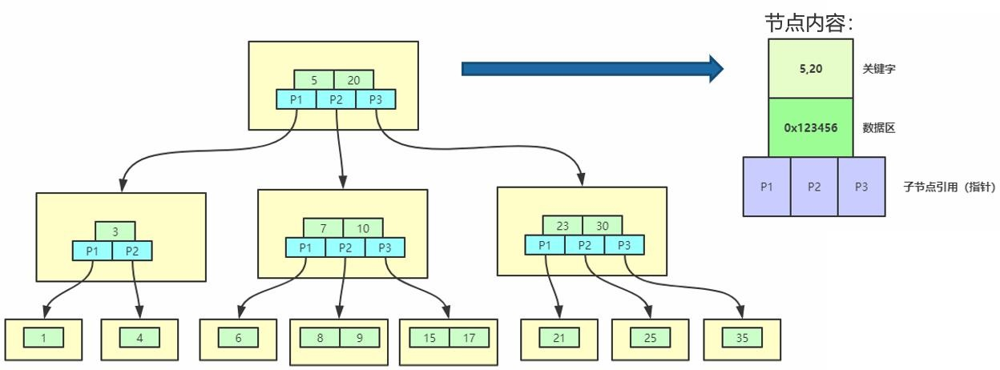
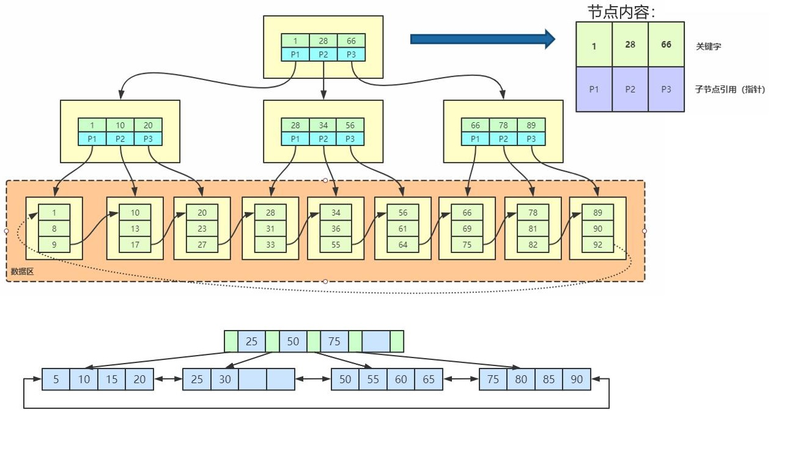
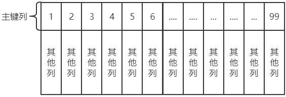
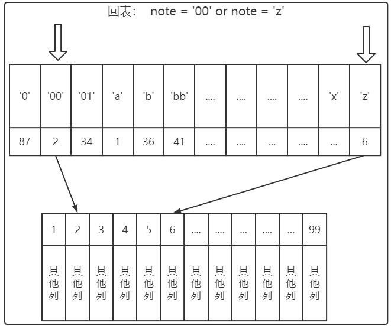
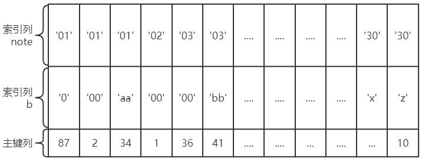
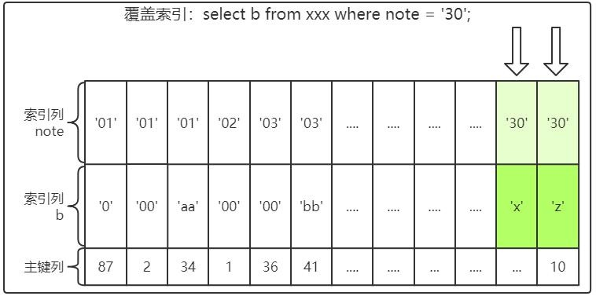

# 5. MYsql索引

## 5.1 B+Tree
B+树索引就是传统意义上的索引，这是目前关系型数据库系统中查找最常用 和最为有效的索引。B+树索引的构造类似于二叉树，根据键值（Key Value）快速 找到数据。注意 B+树中的 B 不是代表二叉(binary)，而是代表平衡(balance)，因 为 B+树是从最早的平衡二叉树演化而来，但是 B+树不是一个二叉树。

### 5.1.1 B+树的定义

B+树是 B 树的一种变形形式，B+树上的叶子节点**存储关键字以及相应记录的地址**，叶子节点以上各层作为索引使用。

B+树是为磁盘或其他直接存取辅助设备设计的一种**平衡查找树**。在 B+树中， 所有记录节点都是按键值的大小顺序存放在同一层的叶子节点上，由各叶子节点 指针进行连接。比如：

:::tip 在B+树的简要定义中其实已经包括了
1. 相同节点数量的情况下，B+树高度远低于平衡二叉树； 
2. 非叶子节点只保存索引信息和下一层节点的指针信息，不保存实际数据 记录；
3. 每个叶子页（LeafPage）存储了实际的数据，比如上图中每个叶子页就 存放了 4 条数据记录，当然可以更多，叶子节点由小到大（有序）串联在一起， 叶子页中的数据也是排好序的； 
4. 索引节点指示该节点的左子树比这个索引值小，而右子树大于等于这个 索引值。
:::

### 5.1.2 B+树的插入
到 B+树的三种情况，每种情况都可能会导致不同的插入算法。 

**Leaf Page 不满，lndex Page 不满**，直接将记录插入到叶子节点。 

**Leaf Page 满，lndex Page 不满**
1. 拆分 Leaf Page 
2. 将中间的节点放入到 Index Page 中 
3. 小于中间节点的记录放左边
4. 大于或等于中间节点的记录放右边。 

**Leaf Page 满，lndex Page 满** 
1. 拆分 Leaf Page 
2. 小于中间节点的记录放左边 
3. 大于或等于中间节点的记录放右边 
4. 拆分 Index Page 5)小于中间节点的记录放左边
6. 大于中间节点的记录放右边 
7. 中间节点放入上一层 Index Page。

-----------
比如已有 B+树：

插入 28，发现当前 Leaf Page 和 Index Page 都没有满，直接进行插入即可：

接着再插入 70 这个键值，这时原先的 Leaf Page 已经满了，但是 Index Page 还没有满，符合表 5-1 的第二种情况，这时插入 Leaf Page 后的情况为 55、55、 60、65、70，并根据中间的值 60 来拆分叶子节点：

最后插入键值 95，这时 Leaf Page 和 Index Page 都满了，这时需要做两次拆分：

的键值可能需要做大量的拆分页(split）操作。因为 B+树结构主要用于磁 盘，页的拆分意味着磁盘的操作，所以应该在可能的情况下尽量减少页的拆分操 作。因此，B+树同样提供了类似于平衡二叉树的旋转（Rotation）功能。

 旋转发生在 Leaf Page 已经满，但是其的左右兄弟节点没有满的情况下。这 时 B+树并不会急于去做拆分页的操作，而是将记录移到所在页的兄弟节点上。 比如前面的插入键值 70，其实 B+树并不会急于去拆分叶子节点，而是去做旋转 操作：

从上图可以看到，采用旋转操作使 B+树减少了一次页的拆分操作，同时这 棵 B+树的高度依然还是 2。

## 5.2. InnoDB 中的索引

### 5.2.1 聚集索引/聚簇索引
InnoDB 中使用了聚集索引，就是将表的主键用来构造一棵 B+树，并且将整 张表的行记录数据存放在该 B+树的叶子节点中。也就是所谓的索引即数据，数 据即索引。由于聚集索引是利用表的主键构建的，所以**每张表只能拥有一个聚集索引**。

聚集索引的叶子节点就是数据页。换句话说，数据页上存放的是完整的每行 记录。因此聚集索引的一个优点就是：**通过过聚集索引能获取完整的整行数据**。 

另一个优点是：**对于主键的排序查找和范围查找速度非常快。** 

如果我们没有定义主键呢？MySQL 会使用唯一性索引，没有唯一性索引， MySQL 也会创建一个隐含列 RowID 来做主键，然后用这个主键来建立聚集索引。

### 5.2.2 辅助索引/二级索引

上边介绍的聚簇索引只能在搜索条件是主键值时才能发挥作用，因为 B+树中的数据都是按照主键进行排序的,那如果我们想以别的列作为搜索条件怎么办？我们一般会建立多个索引，这些索引被称为辅助索引/二级索引。 

对于辅助索引(Secondary Index，也称二级索引、非聚集索引)，叶子节点并不包含行记录的全部数据。叶子节点除了包含键值以外，每个叶子节点中的索引行中还包含了一个书签( bookmark)。该书签用来告诉 InnoDB 存储引擎哪里可 以找到与索引相对应的行数据。因此 InnoDB 存储引擎的辅助索引的书签就是相应行数据的聚集索引键。

比如辅助索引 index(node)，那么**叶子节点中包含的数据就包括了（主键、note）**

#### 回表
辅助索引的存在并不影响数据在聚集索引中的组织，因此每张表上可以有多 个辅助索引。当通过辅助索引来寻找数据时，InnoDB 存储引擎会遍历辅助索引 并通过叶级别的指针获得指向主键索引的主键，然后再通过主键索引（聚集索引） 来找到一个完整的行记录。这个过程也被称为回表。也就是根据辅助索引的值查 询一条完整的用户记录需要使用到 2 棵 B+树----一次辅助索引，一次聚集索引。

### 5.2.3 联合索引/复合索引

前面我们对索引的描述，隐含了一个条件，那就是构建索引的字段只有一个， 但实践工作中构建索引的完全可以是多个字段。所以，将表上的多个列组合起来 进行索引我们称之为联合索引或者复合索引，比如 index(a,b)就是将 a,b 两个 列组合起来构成一个索引。 

千万要注意一点，建立联合索引只会建立 1 棵 B+树，多个列分别建立索引 会分别以每个列则建立 B+树，有几个列就有几个 B+树，比如，index(note)、 index(b)，就分别对 note,b 两个列各构建了一个索引。 

index(note,b)在索引构建上，包含了两个意思：   
1. 先把各个记录按照 note 列进行排序。 
2. 在记录的 note 列相同的情况下，采用 b 列进行排序

### 5.2.4 覆盖索引/索引覆盖

既然多个列可以组合起来构建为联合索引，那么辅助索引自然也可以由多个 列组成。InnoDB 存储引擎支持覆盖索引(covering index，或称索引覆盖)，即从辅助索引中就可以得到查询的记录，而不需要查询聚集索引中的记录。使用覆盖索 引的一个好处是辅助索引不包含整行记录的所有信息，故其大小要远小于聚集索 引，因此可以减少大量的 IO 操作。所以记住，覆盖索引并不是索引类型的一种。

