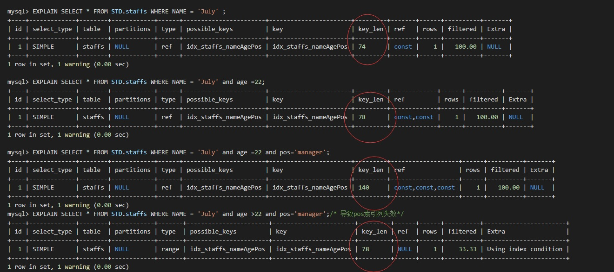
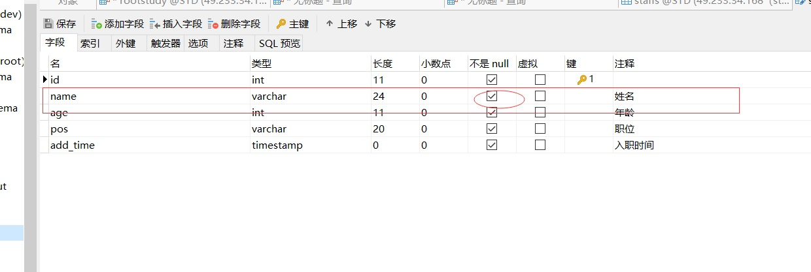

# 9.SQL优化

```sql
--提前准备SQL表
CREATE TABLE `staffs`( id int primary key auto_increment, 
name varchar(24) not null default "" comment'姓名',
age int not null default 0 comment '年龄', 
pos varchar(20) not null default "" comment'职位', 
add_time timestamp not null default current_timestamp comment '入职时间' 
)charset utf8 comment '员工记录表'; 

alter table staffs add index idx_staffs_nameAgePos(name,age,pos);

insert into staffs(name,age,pos,add_time) values('z3',22,'manage',now()); 
insert into staffs(name,age,pos,add_time) values('july',23,'dev',now()); 
insert into staffs(name,age,pos,add_time) values('2000',23,'dev',now());
```

## 9.1尽量全值匹配

```sql
EXPLAIN SELECT * FROM STD.staffs WHERE NAME = 'July';
EXPLAIN SELECT * FROM STD.staffs WHERE NAME = 'July' AND age = 25; 
EXPLAIN SELECT * FROM STD.staffs WHERE NAME = 'July' AND age = 25 AND pos = 'dev';
--当建立了索引列后，能在 where 条件中使用索引的尽量所用
```
### 测试结果
```cpp
mysql> EXPLAIN SELECT * FROM STD.staffs WHERE NAME = 'July';
+----+-------------+--------+------------+------+-----------------------+-----------------------+---------+-------+------+----------+-------+
| id | select_type | table  | partitions | type | possible_keys         | key                   | key_len | ref   | rows | filtered | Extra |
+----+-------------+--------+------------+------+-----------------------+-----------------------+---------+-------+------+----------+-------+
|  1 | SIMPLE      | staffs | NULL       | ref  | idx_staffs_nameAgePos | idx_staffs_nameAgePos | 74      | const |    1 |   100.00 | NULL  |
+----+-------------+--------+------------+------+-----------------------+-----------------------+---------+-------+------+----------+-------+
1 row in set, 1 warning (0.00 sec)

mysql> EXPLAIN SELECT * FROM STD.staffs WHERE NAME = 'July' AND age = 25; 
+----+-------------+--------+------------+------+-----------------------+-----------------------+---------+-------------+------+----------+-------+
| id | select_type | table  | partitions | type | possible_keys         | key                   | key_len | ref         | rows | filtered | Extra |
+----+-------------+--------+------------+------+-----------------------+-----------------------+---------+-------------+------+----------+-------+
|  1 | SIMPLE      | staffs | NULL       | ref  | idx_staffs_nameAgePos | idx_staffs_nameAgePos | 78      | const,const |    1 |   100.00 | NULL  |
+----+-------------+--------+------------+------+-----------------------+-----------------------+---------+-------------+------+----------+-------+
1 row in set, 1 warning (0.00 sec)

mysql> EXPLAIN SELECT * FROM STD.staffs WHERE NAME = 'July' AND age = 25 AND pos = 'dev';
+----+-------------+--------+------------+------+-----------------------+-----------------------+---------+-------------------+------+----------+-------+
| id | select_type | table  | partitions | type | possible_keys         | key                   | key_len | ref               | rows | filtered | Extra |
+----+-------------+--------+------------+------+-----------------------+-----------------------+---------+-------------------+------+----------+-------+
|  1 | SIMPLE      | staffs | NULL       | ref  | idx_staffs_nameAgePos | idx_staffs_nameAgePos | 140     | const,const,const |    1 |   100.00 | NULL  |
+----+-------------+--------+------------+------+-----------------------+-----------------------+---------+-------------------+------+----------+-------+
1 row in set, 1 warning (0.00 sec)

```
**由测试结果来看key，ref，使用的索引越来越多，这样查询效率会高**


## 9.2 最佳左前缀法则

如果索引了多列，要遵守最左前缀法则。指的是查询从索引的最左前列开始并且不跳过索引中的列。

```sql
EXPLAIN SELECT * FROM STD.staffs WHERE age = 25 AND pos = 'dev' ;
EXPLAIN SELECT * FROM STD.staffs WHERE pos = 'dev'; 
EXPLAIN SELECT * FROM STD.staffs WHERE NAME = 'July';
```
### 测试结果
```cpp
mysql> EXPLAIN SELECT * FROM STD.staffs WHERE age = 25 AND pos = 'dev' ;
+----+-------------+--------+------------+------+---------------+------+---------+------+------+----------+-------------+
| id | select_type | table  | partitions | type | possible_keys | key  | key_len | ref  | rows | filtered | Extra       |
+----+-------------+--------+------------+------+---------------+------+---------+------+------+----------+-------------+
|  1 | SIMPLE      | staffs | NULL       | ALL  | NULL          | NULL | NULL    | NULL |    3 |    33.33 | Using where |
+----+-------------+--------+------------+------+---------------+------+---------+------+------+----------+-------------+
1 row in set, 1 warning (0.00 sec)

mysql> EXPLAIN SELECT * FROM STD.staffs WHERE pos = 'dev'; 
+----+-------------+--------+------------+------+---------------+------+---------+------+------+----------+-------------+
| id | select_type | table  | partitions | type | possible_keys | key  | key_len | ref  | rows | filtered | Extra       |
+----+-------------+--------+------------+------+---------------+------+---------+------+------+----------+-------------+
|  1 | SIMPLE      | staffs | NULL       | ALL  | NULL          | NULL | NULL    | NULL |    3 |    33.33 | Using where |
+----+-------------+--------+------------+------+---------------+------+---------+------+------+----------+-------------+
1 row in set, 1 warning (0.00 sec)

mysql> EXPLAIN SELECT * FROM STD.staffs WHERE NAME = 'July';
+----+-------------+--------+------------+------+-----------------------+-----------------------+---------+-------+------+----------+-------+
| id | select_type | table  | partitions | type | possible_keys         | key                   | key_len | ref   | rows | filtered | Extra |
+----+-------------+--------+------------+------+-----------------------+-----------------------+---------+-------+------+----------+-------+
|  1 | SIMPLE      | staffs | NULL       | ref  | idx_staffs_nameAgePos | idx_staffs_nameAgePos | 74      | const |    1 |   100.00 | NULL  |
+----+-------------+--------+------------+------+-----------------------+-----------------------+---------+-------+------+----------+-------+
1 row in set, 1 warning (0.00 sec)
```
**查询条件没有已name开始的，type都是ALL，key都是null 索引都失效了**

## 9.3 不在索引列上做任何操作

**不在索引列上做任何操作（计算、函数、(自动 or 手动)类型转换），会导致索引失效而转向 全表扫描**

```sql
EXPLAIN SELECT * FROM STD.staffs WHERE NAME = 'July'; 
EXPLAIN SELECT * FROM STD.staffs WHERE left(NAME,4) = 'July';
```
### 测试结果
```cpp
mysql> EXPLAIN SELECT * FROM STD.staffs WHERE NAME = 'July'; 
+----+-------------+--------+------------+------+-----------------------+-----------------------+---------+-------+------+----------+-------+
| id | select_type | table  | partitions | type | possible_keys         | key                   | key_len | ref   | rows | filtered | Extra |
+----+-------------+--------+------------+------+-----------------------+-----------------------+---------+-------+------+----------+-------+
|  1 | SIMPLE      | staffs | NULL       | ref  | idx_staffs_nameAgePos | idx_staffs_nameAgePos | 74      | const |    1 |   100.00 | NULL  |
+----+-------------+--------+------------+------+-----------------------+-----------------------+---------+-------+------+----------+-------+
1 row in set, 1 warning (0.00 sec)

mysql> EXPLAIN SELECT * FROM STD.staffs WHERE left(NAME,4) = 'July';
+----+-------------+--------+------------+------+---------------+------+---------+------+------+----------+-------------+
| id | select_type | table  | partitions | type | possible_keys | key  | key_len | ref  | rows | filtered | Extra       |
+----+-------------+--------+------------+------+---------------+------+---------+------+------+----------+-------------+
|  1 | SIMPLE      | staffs | NULL       | ALL  | NULL          | NULL | NULL    | NULL |    3 |   100.00 | Using where |
+----+-------------+--------+------------+------+---------------+------+---------+------+------+----------+-------------+
1 row in set, 1 warning (0.01 sec)
```
## 9.4 范围条件放最后

```sql
EXPLAIN SELECT * FROM STD.staffs WHERE NAME = 'July' ;
EXPLAIN SELECT * FROM STD.staffs WHERE NAME = 'July' and age =22;
EXPLAIN SELECT * FROM STD.staffs WHERE NAME = 'July' and age =22 and pos='manager'; 
--中间有范围查询会导致后面的索引列全部失效 
EXPLAIN SELECT * FROM STD.staffs WHERE NAME = 'July' and age >22 and pos='manager';
```

### 测试结果

```cpp

mysql> EXPLAIN SELECT * FROM STD.staffs WHERE NAME = 'July' ;
+----+-------------+--------+------------+------+-----------------------+-----------------------+---------+-------+------+----------+-------+
| id | select_type | table  | partitions | type | possible_keys         | key                   | key_len | ref   | rows | filtered | Extra |
+----+-------------+--------+------------+------+-----------------------+-----------------------+---------+-------+------+----------+-------+
|  1 | SIMPLE      | staffs | NULL       | ref  | idx_staffs_nameAgePos | idx_staffs_nameAgePos | 74      | const |    1 |   100.00 | NULL  |
+----+-------------+--------+------------+------+-----------------------+-----------------------+---------+-------+------+----------+-------+
1 row in set, 1 warning (0.00 sec)

mysql> EXPLAIN SELECT * FROM STD.staffs WHERE NAME = 'July' and age =22;
+----+-------------+--------+------------+------+-----------------------+-----------------------+---------+-------------+------+----------+-------+
| id | select_type | table  | partitions | type | possible_keys         | key                   | key_len | ref         | rows | filtered | Extra |
+----+-------------+--------+------------+------+-----------------------+-----------------------+---------+-------------+------+----------+-------+
|  1 | SIMPLE      | staffs | NULL       | ref  | idx_staffs_nameAgePos | idx_staffs_nameAgePos | 78      | const,const |    1 |   100.00 | NULL  |
+----+-------------+--------+------------+------+-----------------------+-----------------------+---------+-------------+------+----------+-------+
1 row in set, 1 warning (0.00 sec)

mysql> EXPLAIN SELECT * FROM STD.staffs WHERE NAME = 'July' and age =22 and pos='manager'; 
+----+-------------+--------+------------+------+-----------------------+-----------------------+---------+-------------------+------+----------+-------+
| id | select_type | table  | partitions | type | possible_keys         | key                   | key_len | ref               | rows | filtered | Extra |
+----+-------------+--------+------------+------+-----------------------+-----------------------+---------+-------------------+------+----------+-------+
|  1 | SIMPLE      | staffs | NULL       | ref  | idx_staffs_nameAgePos | idx_staffs_nameAgePos | 140     | const,const,const |    1 |   100.00 | NULL  |
+----+-------------+--------+------------+------+-----------------------+-----------------------+---------+-------------------+------+----------+-------+
1 row in set, 1 warning (0.00 sec)
mysql> EXPLAIN SELECT * FROM STD.staffs WHERE NAME = 'July' and age >22 and pos='manager';/* 导致pos索引列失效*/
+----+-------------+--------+------------+-------+-----------------------+-----------------------+---------+------+------+----------+-----------------------+
| id | select_type | table  | partitions | type  | possible_keys         | key                   | key_len | ref  | rows | filtered | Extra                 |
+----+-------------+--------+------------+-------+-----------------------+-----------------------+---------+------+------+----------+-----------------------+
|  1 | SIMPLE      | staffs | NULL       | range | idx_staffs_nameAgePos | idx_staffs_nameAgePos | 78      | NULL |    1 |    33.33 | Using index condition |
+----+-------------+--------+------------+-------+-----------------------+-----------------------+---------+------+------+----------+-----------------------+
1 row in set, 1 warning (0.00 sec)
```
<a data-fancybox title="SQL优化" href="./image/sqlyouhua.jpg"></a>

### 解决办法
**创建索引时，考虑会进行范围查询的的字段放在最后边**
比如：
```sql
alter table staffs add index idx_staffs_nameAgePos(name,pos,age);
```
<a data-fancybox title="SQL优化" href="./image/index01.jpg"></a>

```cpp
mysql> EXPLAIN SELECT * FROM STD.staffs WHERE NAME = 'July' and pos='manager' and age>22;
+----+-------------+--------+------------+-------+-----------------------+-----------------------+---------+------+------+----------+-----------------------+
| id | select_type | table  | partitions | type  | possible_keys         | key                   | key_len | ref  | rows | filtered | Extra                 |
+----+-------------+--------+------------+-------+-----------------------+-----------------------+---------+------+------+----------+-----------------------+
|  1 | SIMPLE      | staffs | NULL       | range | idx_staffs_nameAgePos | idx_staffs_nameAgePos | 140     | NULL |    1 |   100.00 | Using index condition |
+----+-------------+--------+------------+-------+-----------------------+-----------------------+---------+------+------+----------+-----------------------+
1 row in set, 1 warning (0.00 sec)
```

## 9.5 覆盖索引尽量用

尽量使用覆盖索引(只访问索引的查询(索引列和查询列一致))，减少 select * 

```sql
EXPLAIN SELECT * FROM STD.staffs WHERE NAME = 'July' and age =22 and pos='manager'; 
EXPLAIN SELECT name,age,pos FROM STD.staffs WHERE NAME = 'July' and age =22 and pos='manager'; 
EXPLAIN SELECT * FROM STD.staffs WHERE NAME = 'July' and age >22 and pos='manager'; 
EXPLAIN SELECT name,age,pos FROM STD.staffs WHERE NAME = 'July' and age >22 and pos='manager';
```
### 测试结果
```cpp
mysql> EXPLAIN SELECT * FROM STD.staffs WHERE NAME = 'July' and age =22 and pos='manager'; 
+----+-------------+--------+------------+------+-----------------------+-----------------------+---------+-------------------+------+----------+-------+
| id | select_type | table  | partitions | type | possible_keys         | key                   | key_len | ref               | rows | filtered | Extra |
+----+-------------+--------+------------+------+-----------------------+-----------------------+---------+-------------------+------+----------+-------+
|  1 | SIMPLE      | staffs | NULL       | ref  | idx_staffs_nameAgePos | idx_staffs_nameAgePos | 140     | const,const,const |    1 |   100.00 | NULL  |
+----+-------------+--------+------------+------+-----------------------+-----------------------+---------+-------------------+------+----------+-------+
1 row in set, 1 warning (0.00 sec)

mysql> EXPLAIN SELECT name,age,pos FROM STD.staffs WHERE NAME = 'July' and age =22 and pos='manager'; 
+----+-------------+--------+------------+------+-----------------------+-----------------------+---------+-------------------+------+----------+-------------+
| id | select_type | table  | partitions | type | possible_keys         | key                   | key_len | ref               | rows | filtered | Extra       |
+----+-------------+--------+------------+------+-----------------------+-----------------------+---------+-------------------+------+----------+-------------+
|  1 | SIMPLE      | staffs | NULL       | ref  | idx_staffs_nameAgePos | idx_staffs_nameAgePos | 140     | const,const,const |    1 |   100.00 | Using index |
+----+-------------+--------+------------+------+-----------------------+-----------------------+---------+-------------------+------+----------+-------------+
1 row in set, 1 warning (0.00 sec)

mysql> EXPLAIN SELECT * FROM STD.staffs WHERE NAME = 'July' and age >22 and pos='manager'; 
+----+-------------+--------+------------+-------+-----------------------+-----------------------+---------+------+------+----------+-----------------------+
| id | select_type | table  | partitions | type  | possible_keys         | key                   | key_len | ref  | rows | filtered | Extra                 |
+----+-------------+--------+------------+-------+-----------------------+-----------------------+---------+------+------+----------+-----------------------+
|  1 | SIMPLE      | staffs | NULL       | range | idx_staffs_nameAgePos | idx_staffs_nameAgePos | 140     | NULL |    1 |   100.00 | Using index condition |
+----+-------------+--------+------------+-------+-----------------------+-----------------------+---------+------+------+----------+-----------------------+
1 row in set, 1 warning (0.00 sec)

mysql> EXPLAIN SELECT name,age,pos FROM STD.staffs WHERE NAME = 'July' and age >22 and pos='manager';
+----+-------------+--------+------------+-------+-----------------------+-----------------------+---------+------+------+----------+--------------------------+
| id | select_type | table  | partitions | type  | possible_keys         | key                   | key_len | ref  | rows | filtered | Extra                    |
+----+-------------+--------+------------+-------+-----------------------+-----------------------+---------+------+------+----------+--------------------------+
|  1 | SIMPLE      | staffs | NULL       | range | idx_staffs_nameAgePos | idx_staffs_nameAgePos | 140     | NULL |    1 |   100.00 | Using where; Using index |
+----+-------------+--------+------------+-------+-----------------------+-----------------------+---------+------+------+----------+--------------------------+

```

:::tip
using index ：使用覆盖索引的时候就会出现

using where：在查找使用索引的情况下，需要回表去查询所需的数据

using index condition：查找使用了索引，但是需要回表查询数据

using index & using where：查找使用了索引，但是需要的数据都在索引列中能找到，所以不需要回表查询数据
:::

## 9.6 不等于大于小于要甚用
**mysql 在使用不等于(!= 或者<>)的时候无法使用索引会导致全表扫描**

```sql
EXPLAIN SELECT * FROM STD.staffs WHERE NAME = 'July'; 
EXPLAIN SELECT * FROM STD.staffs WHERE NAME != 'July'; 
EXPLAIN SELECT * FROM STD.staffs WHERE NAME <> 'July';
```

### 测试结果
```cpp

mysql> EXPLAIN SELECT * FROM STD.staffs WHERE NAME = 'July'; 
+----+-------------+--------+------------+------+-----------------------+-----------------------+---------+-------+------+----------+-------+
| id | select_type | table  | partitions | type | possible_keys         | key                   | key_len | ref   | rows | filtered | Extra |
+----+-------------+--------+------------+------+-----------------------+-----------------------+---------+-------+------+----------+-------+
|  1 | SIMPLE      | staffs | NULL       | ref  | idx_staffs_nameAgePos | idx_staffs_nameAgePos | 74      | const |    1 |   100.00 | NULL  |
+----+-------------+--------+------------+------+-----------------------+-----------------------+---------+-------+------+----------+-------+
1 row in set, 1 warning (0.00 sec)

mysql> EXPLAIN SELECT * FROM STD.staffs WHERE NAME != 'July'; 
+----+-------------+--------+------------+------+-----------------------+------+---------+------+------+----------+-------------+
| id | select_type | table  | partitions | type | possible_keys         | key  | key_len | ref  | rows | filtered | Extra       |
+----+-------------+--------+------------+------+-----------------------+------+---------+------+------+----------+-------------+
|  1 | SIMPLE      | staffs | NULL       | ALL  | idx_staffs_nameAgePos | NULL | NULL    | NULL |    3 |    66.67 | Using where |
+----+-------------+--------+------------+------+-----------------------+------+---------+------+------+----------+-------------+
1 row in set, 1 warning (0.00 sec)

mysql> EXPLAIN SELECT * FROM STD.staffs WHERE NAME <> 'July';
+----+-------------+--------+------------+------+-----------------------+------+---------+------+------+----------+-------------+
| id | select_type | table  | partitions | type | possible_keys         | key  | key_len | ref  | rows | filtered | Extra       |
+----+-------------+--------+------------+------+-----------------------+------+---------+------+------+----------+-------------+
|  1 | SIMPLE      | staffs | NULL       | ALL  | idx_staffs_nameAgePos | NULL | NULL    | NULL |    3 |    66.67 | Using where |
+----+-------------+--------+------------+------+-----------------------+------+---------+------+------+----------+-------------+
1 row in set, 1 warning (0.00 sec)
```
### 解决方案

**如果定要需要使用不等于,请用覆盖索引**

```sql
EXPLAIN SELECT name,age,pos FROM STD.staffs WHERE NAME != 'July'; 
EXPLAIN SELECT name,age,pos FROM STD.staffs WHERE NAME <> 'July';
```

```cpp
mysql> EXPLAIN SELECT name,age,pos FROM STD.staffs WHERE NAME != 'July'; 
+----+-------------+--------+------------+-------+-----------------------+-----------------------+---------+------+------+----------+--------------------------+
| id | select_type | table  | partitions | type  | possible_keys         | key                   | key_len | ref  | rows | filtered | Extra                    |
+----+-------------+--------+------------+-------+-----------------------+-----------------------+---------+------+------+----------+--------------------------+
|  1 | SIMPLE      | staffs | NULL       | range | idx_staffs_nameAgePos | idx_staffs_nameAgePos | 74      | NULL |    2 |   100.00 | Using where; Using index |
+----+-------------+--------+------------+-------+-----------------------+-----------------------+---------+------+------+----------+--------------------------+
1 row in set, 1 warning (0.00 sec)

mysql> EXPLAIN SELECT name,age,pos FROM STD.staffs WHERE NAME <> 'July';
+----+-------------+--------+------------+-------+-----------------------+-----------------------+---------+------+------+----------+--------------------------+
| id | select_type | table  | partitions | type  | possible_keys         | key                   | key_len | ref  | rows | filtered | Extra                    |
+----+-------------+--------+------------+-------+-----------------------+-----------------------+---------+------+------+----------+--------------------------+
|  1 | SIMPLE      | staffs | NULL       | range | idx_staffs_nameAgePos | idx_staffs_nameAgePos | 74      | NULL |    2 |   100.00 | Using where; Using index |
+----+-------------+--------+------------+-------+-----------------------+-----------------------+---------+------+------+----------+--------------------------+
1 row in set, 1 warning (0.00 sec)
```

## 9.7 Null/Not 有影响

**注意 null/not null 对索引的可能影响**

### 自定义字段为NOTNULL情况
**在字段为 not null 的情况下，使用 is null 或 is not null 会导致索引失效**
<a data-fancybox title="SQL优化" href="./image/notnull.jpg"></a>

```sql
EXPLAIN select * from STD.staffs where name is null ;
EXPLAIN select * from STD.staffs where name is not null;
```

```cpp
mysql> EXPLAIN select * from STD.staffs where name is null ;
+----+-------------+-------+------------+------+---------------+------+---------+------+------+----------+------------------+
| id | select_type | table | partitions | type | possible_keys | key  | key_len | ref  | rows | filtered | Extra            |
+----+-------------+-------+------------+------+---------------+------+---------+------+------+----------+------------------+
|  1 | SIMPLE      | NULL  | NULL       | NULL | NULL          | NULL | NULL    | NULL | NULL |     NULL | Impossible WHERE |
+----+-------------+-------+------------+------+---------------+------+---------+------+------+----------+------------------+
1 row in set, 1 warning (0.00 sec)

mysql> EXPLAIN select * from STD.staffs where name is not null;
+----+-------------+--------+------------+------+-----------------------+------+---------+------+------+----------+-------------+
| id | select_type | table  | partitions | type | possible_keys         | key  | key_len | ref  | rows | filtered | Extra       |
+----+-------------+--------+------------+------+-----------------------+------+---------+------+------+----------+-------------+
|  1 | SIMPLE      | staffs | NULL       | ALL  | idx_staffs_nameAgePos | NULL | NULL    | NULL |    3 |    66.67 | Using where |
+----+-------------+--------+------------+------+-----------------------+------+---------+------+------+----------+-------------+
1 row in set, 1 warning (0.00 sec)

```
#### 解决方式：

**覆盖索引**
```cpp
mysql> EXPLAIN select name,age,pos from STD.staffs where name is not null;
+----+-------------+--------+------------+-------+-----------------------+-----------------------+---------+------+------+----------+--------------------------+
| id | select_type | table  | partitions | type  | possible_keys         | key                   | key_len | ref  | rows | filtered | Extra                    |
+----+-------------+--------+------------+-------+-----------------------+-----------------------+---------+------+------+----------+--------------------------+
|  1 | SIMPLE      | staffs | NULL       | index | idx_staffs_nameAgePos | idx_staffs_nameAgePos | 140     | NULL |    3 |    66.67 | Using where; Using index |
+----+-------------+--------+------------+-------+-----------------------+-----------------------+---------+------+------+----------+--------------------------+
1 row in set, 1 warning (0.00 sec)
```
### 自定义为 NULL 或者不定义


```sql
EXPLAIN select * from STD.staffs where name is null ;
EXPLAIN select * from STD.staffs where name is not null;
```

#### 测试结果
```cpp
mysql> EXPLAIN select * from STD.staffs where name is null ;
+----+-------------+--------+------------+------+-----------------------+-----------------------+---------+-------+------+----------+-----------------------+
| id | select_type | table  | partitions | type | possible_keys         | key                   | key_len | ref   | rows | filtered | Extra                 |
+----+-------------+--------+------------+------+-----------------------+-----------------------+---------+-------+------+----------+-----------------------+
|  1 | SIMPLE      | staffs | NULL       | ref  | idx_staffs_nameAgePos | idx_staffs_nameAgePos | 75      | const |    1 |   100.00 | Using index condition |
+----+-------------+--------+------------+------+-----------------------+-----------------------+---------+-------+------+----------+-----------------------+
1 row in set, 1 warning (0.00 sec)

mysql> EXPLAIN select * from STD.staffs where name is not null;
+----+-------------+--------+------------+------+-----------------------+------+---------+------+------+----------+-------------+
| id | select_type | table  | partitions | type | possible_keys         | key  | key_len | ref  | rows | filtered | Extra       |
+----+-------------+--------+------------+------+-----------------------+------+---------+------+------+----------+-------------+
|  1 | SIMPLE      | staffs | NULL       | ALL  | idx_staffs_nameAgePos | NULL | NULL    | NULL |    3 |   100.00 | Using where |
+----+-------------+--------+------------+------+-----------------------+------+---------+------+------+----------+-------------+
1 row in set, 1 warning (0.00 sec)

```

***Is not null 的情况会导致索引失效 ***

#### 解决方式：覆盖索引 

```cpp
mysql> EXPLAIN select name,age,pos from STD.staffs where name is not null;
+----+-------------+--------+------------+-------+-----------------------+-----------------------+---------+------+------+----------+--------------------------+
| id | select_type | table  | partitions | type  | possible_keys         | key                   | key_len | ref  | rows | filtered | Extra                    |
+----+-------------+--------+------------+-------+-----------------------+-----------------------+---------+------+------+----------+--------------------------+
|  1 | SIMPLE      | staffs | NULL       | index | idx_staffs_nameAgePos | idx_staffs_nameAgePos | 141     | NULL |    3 |   100.00 | Using where; Using index |
+----+-------------+--------+------------+-------+-----------------------+-----------------------+---------+------+------+----------+--------------------------+
1 row in set, 1 warning (0.00 sec)
```
## 9.8 Like 查询要当心

**like 以通配符开头('%abc...')mysql 索引失效会变成全表扫描的操作**

```sql
EXPLAIN select * from STD.staffs where name ='july';
EXPLAIN select * from STD.staffs where name like '%july%'; 
EXPLAIN select * from STD.staffs where name like '%july'; 
EXPLAIN select * from STD.staffs where name like 'july%'; 
```

### 测试结果

```cpp
mysql> EXPLAIN select * from STD.staffs where name ='july';
+----+-------------+--------+------------+------+-----------------------+-----------------------+---------+-------+------+----------+-------+
| id | select_type | table  | partitions | type | possible_keys         | key                   | key_len | ref   | rows | filtered | Extra |
+----+-------------+--------+------------+------+-----------------------+-----------------------+---------+-------+------+----------+-------+
|  1 | SIMPLE      | staffs | NULL       | ref  | idx_staffs_nameAgePos | idx_staffs_nameAgePos | 75      | const |    1 |   100.00 | NULL  |
+----+-------------+--------+------------+------+-----------------------+-----------------------+---------+-------+------+----------+-------+
1 row in set, 1 warning (0.00 sec)

mysql> EXPLAIN select * from STD.staffs where name like '%july%'; 
+----+-------------+--------+------------+------+---------------+------+---------+------+------+----------+-------------+
| id | select_type | table  | partitions | type | possible_keys | key  | key_len | ref  | rows | filtered | Extra       |
+----+-------------+--------+------------+------+---------------+------+---------+------+------+----------+-------------+
|  1 | SIMPLE      | staffs | NULL       | ALL  | NULL          | NULL | NULL    | NULL |    3 |    33.33 | Using where |
+----+-------------+--------+------------+------+---------------+------+---------+------+------+----------+-------------+
1 row in set, 1 warning (0.00 sec)

mysql> EXPLAIN select * from STD.staffs where name like '%july'; 
+----+-------------+--------+------------+------+---------------+------+---------+------+------+----------+-------------+
| id | select_type | table  | partitions | type | possible_keys | key  | key_len | ref  | rows | filtered | Extra       |
+----+-------------+--------+------------+------+---------------+------+---------+------+------+----------+-------------+
|  1 | SIMPLE      | staffs | NULL       | ALL  | NULL          | NULL | NULL    | NULL |    3 |    33.33 | Using where |
+----+-------------+--------+------------+------+---------------+------+---------+------+------+----------+-------------+
1 row in set, 1 warning (0.00 sec)

mysql> EXPLAIN select * from STD.staffs where name like 'july%'; 
+----+-------------+--------+------------+-------+-----------------------+-----------------------+---------+------+------+----------+-----------------------+
| id | select_type | table  | partitions | type  | possible_keys         | key                   | key_len | ref  | rows | filtered | Extra                 |
+----+-------------+--------+------------+-------+-----------------------+-----------------------+---------+------+------+----------+-----------------------+
|  1 | SIMPLE      | staffs | NULL       | range | idx_staffs_nameAgePos | idx_staffs_nameAgePos | 75      | NULL |    1 |   100.00 | Using index condition |
+----+-------------+--------+------------+-------+-----------------------+-----------------------+---------+------+------+----------+-----------------------+
1 row in set, 1 warning (0.00 sec)

```

like 以通配符开头('%abc...')mysql 索引失效会变成全表扫描的操作;

**july%走聚合索引后再进行回表查询**

### 解决方式：覆盖索引 

```cpp
mysql> EXPLAIN select name,age,pos from STD.staffs where name like '%july%';
+----+-------------+--------+------------+-------+---------------+-----------------------+---------+------+------+----------+--------------------------+
| id | select_type | table  | partitions | type  | possible_keys | key                   | key_len | ref  | rows | filtered | Extra                    |
+----+-------------+--------+------------+-------+---------------+-----------------------+---------+------+------+----------+--------------------------+
|  1 | SIMPLE      | staffs | NULL       | index | NULL          | idx_staffs_nameAgePos | 141     | NULL |    3 |    33.33 | Using where; Using index |
+----+-------------+--------+------------+-------+---------------+-----------------------+---------+------+------+----------+--------------------------+
1 row in set, 1 warning (0.00 sec)
```

## 9.9 字符类型加引号

**字符串不加单引号索引失效** <font color='red'>原因是发生了隐形类型转换导致索引失效</font>

```cpp
mysql> EXPLAIN select * from STD.staffs where name = 917;
+----+-------------+--------+------------+------+-----------------------+------+---------+------+------+----------+-------------+
| id | select_type | table  | partitions | type | possible_keys         | key  | key_len | ref  | rows | filtered | Extra       |
+----+-------------+--------+------------+------+-----------------------+------+---------+------+------+----------+-------------+
|  1 | SIMPLE      | staffs | NULL       | ALL  | idx_staffs_nameAgePos | NULL | NULL    | NULL |    3 |    33.33 | Using where |
+----+-------------+--------+------------+------+-----------------------+------+---------+------+------+----------+-------------+
1 row in set, 3 warnings (0.00 sec)


mysql> EXPLAIN select * from STD.staffs where name = '917';
+----+-------------+--------+------------+------+-----------------------+-----------------------+---------+-------+------+----------+-------+
| id | select_type | table  | partitions | type | possible_keys         | key                   | key_len | ref   | rows | filtered | Extra |
+----+-------------+--------+------------+------+-----------------------+-----------------------+---------+-------+------+----------+-------+
|  1 | SIMPLE      | staffs | NULL       | ref  | idx_staffs_nameAgePos | idx_staffs_nameAgePos | 75      | const |    1 |   100.00 | NULL  |
+----+-------------+--------+------------+------+-----------------------+-----------------------+---------+-------+------+----------+-------+
1 row in set, 1 warning (0.00 sec)

```

## 9.10 OR 改 UNION 效率高
```sql
EXPLAIN select * from STD.staffs where name='July' or name = 'z3' ;
EXPLAIN select * from STD.staffs  where name='July' UNION select * from STD.staffs where name = 'z3'; 
```

### 测试结果

```cpp
mysql> EXPLAIN select * from STD.staffs where name='July' or name = 'z3' ;
+----+-------------+--------+------------+------+-----------------------+------+---------+------+------+----------+-------------+
| id | select_type | table  | partitions | type | possible_keys         | key  | key_len | ref  | rows | filtered | Extra       |
+----+-------------+--------+------------+------+-----------------------+------+---------+------+------+----------+-------------+
|  1 | SIMPLE      | staffs | NULL       | ALL  | idx_staffs_nameAgePos | NULL | NULL    | NULL |    3 |    66.67 | Using where |
+----+-------------+--------+------------+------+-----------------------+------+---------+------+------+----------+-------------+
1 row in set, 1 warning (0.00 sec)
mysql> EXPLAIN select * from STD.staffs  where name='July' UNION select * from STD.staffs where name = 'z3';
+----+--------------+------------+------------+------+-----------------------+-----------------------+---------+-------+------+----------+-----------------+
| id | select_type  | table      | partitions | type | possible_keys         | key                   | key_len | ref   | rows | filtered | Extra           |
+----+--------------+------------+------------+------+-----------------------+-----------------------+---------+-------+------+----------+-----------------+
|  1 | PRIMARY      | staffs     | NULL       | ref  | idx_staffs_nameAgePos | idx_staffs_nameAgePos | 75      | const |    1 |   100.00 | NULL            |
|  2 | UNION        | staffs     | NULL       | ref  | idx_staffs_nameAgePos | idx_staffs_nameAgePos | 75      | const |    1 |   100.00 | NULL            |
| NULL | UNION RESULT | <union1,2> | NULL       | ALL  | NULL                  | NULL                  | NULL    | NULL  | NULL |     NULL | Using temporary |
+----+--------------+------------+------------+------+-----------------------+-----------------------+---------+-------+------+----------+-----------------+

```

### 解决方式：覆盖索引 

```cpp
mysql> EXPLAIN select name,age from STD.staffs  where name='July' or name = 'z3';
+----+-------------+--------+------------+-------+-----------------------+-----------------------+---------+------+------+----------+--------------------------+
| id | select_type | table  | partitions | type  | possible_keys         | key                   | key_len | ref  | rows | filtered | Extra                    |
+----+-------------+--------+------------+-------+-----------------------+-----------------------+---------+------+------+----------+--------------------------+
|  1 | SIMPLE      | staffs | NULL       | range | idx_staffs_nameAgePos | idx_staffs_nameAgePos | 75      | NULL |    2 |   100.00 | Using where; Using index |
+----+-------------+--------+------------+-------+-----------------------+-----------------------+---------+------+------+----------+--------------------------+
1 row in set, 1 warning (0.00 sec)
```


## 9.11 insert 语句优化； 

1. 提交前关闭自动提交 
2. 尽量使用批量 insert 语句 
3. 可以使用 MyISAM 存储引擎 

### 9.11.1 LOAD DATA INFLIE 

LOAD DATA INFLIE； 使用 LOAD DATA INFLIE ,比一般的 insert 语句快 20 倍 

select * into OUTFILE 'D:\\product.txt' from product_info 
load data INFILE 'D:\\product.txt' into table product_info 
load data INFILE '/soft/product3.txt' into table product_info


**show VARIABLES like 'secure_file_priv'** 
1. secure_file_priv 为 NULL 时，表示限制 mysqld 不允许导入或导出。 
2. secure_file_priv 为 /tmp 时，表示限制 mysqld 只能在/tmp 目录中执行导入导出，其他 目录不能执行。 
3. secure_file_priv 没有值时，表示不限制 mysqld 在任意目录的导入导出。 secure_file_priv='' 