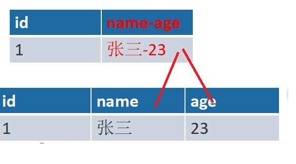
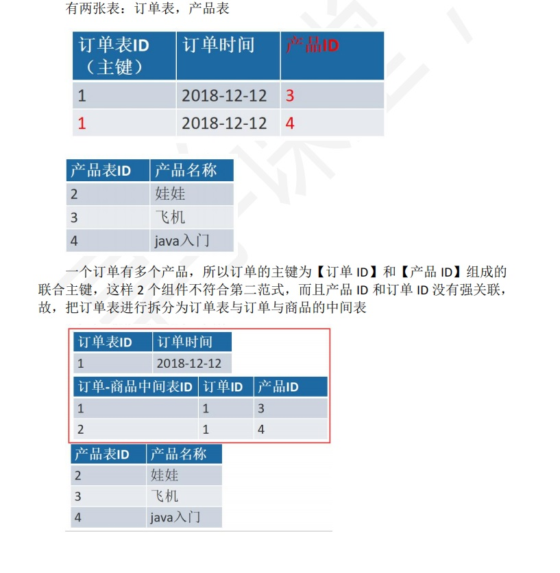
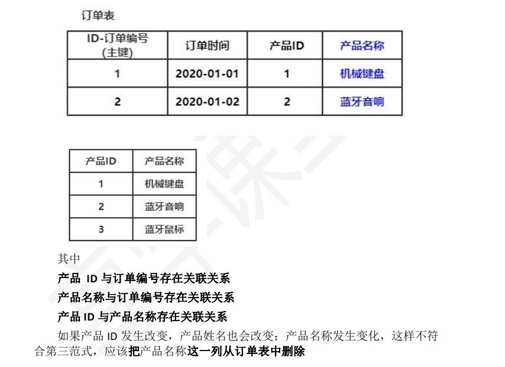

# 7. 业务表设计

## 7.1 数据库表设计
良好的表结构设计是高性能的基石，应该根据系统将要执行的业务查询来设 计，这往往需要权衡各种因素。糟糕的表结构设计，会浪费大量的开发时间，严 重延误项目开发周期，让人痛苦万分，而且直接影响到数据库的性能，并需要花 费大量不必要的优化时间，效果往往还不怎么样。
在数据库表设计上有个很重要的设计准则，称为范式设计。

### 7.1.1 范式设计

#### 请概述下数据库的范式设计 

目前关系数据库有六种范式，常见范式：
第一范式：1NF 是对属性的原子性约束，要求属性具有原子性，不可再分解；
第二范式：2NF 是对记录的惟一性约束，要求记录有惟一标识，即实体的惟一性；
第三范式：3NF 是对字段冗余性的约束，即任何字段不能由其他字段派生出来，它要求字段没有冗余。。 

范式化设计优缺点:   
优点:可以尽量得减少数据冗余，使得更新快，体积小；  
缺点:对于查询需要 多个表进行关联，减少写得效率增加读得效率，更难进行索引优化   

反范式化:   
优点:可以减少表得关联，可以更好得进行索引优化；  
缺点:数据冗余以及数 据异常，数据得修改需要更多的成本，常见的反范式设计有缓存、冗余等等。  

#### 数据库设计的第一范式
定义： 属于第一范式关系的所有属性都不可再分，即数据项不可分。 
理解： 第一范式强调**数据表的原子性**，是其他范式的基础。例如下表

name-age 列具有两个属性，一个 name,一个 age 不符合第一范式，把它拆 分成两列

#### 数据库设计的第二范式

第二范式（2NF）是在第一范式（1NF）的基础上建立起来的，即满足第二 范式（2NF）必须先满足第一范式（1NF）。 

第二范式（2NF）要求数据库表中的每个实例或行必须可以被惟一地区分。 通常在实现来说，需要为表加上一个列，以存储各个实例的惟一标识。例如员工 信息表中加上了员工编号（emp_id）列，因为每个员工的员工编号是惟一的，因 此每个员工可以被惟一区分。这个惟一属性列被称为主关键字或主键、主码。 

也就是说要求表中只具有一个业务主键，而且第二范式（2NF）要求实体的 属性完全依赖于主关键字。所谓完全依赖是指不能存在仅依赖主关键字一部分的 属性。什么意思呢？

#### 数据库设计的第三范式

指每一个非非主属性既不部分依赖于也不传递依赖于业务主键，也就是在第 二范式的基础上消除了非主键对主键的传递依赖。例如，存在一个部门信息表， 其中每个部门有部门编号（dept_id）、部门名称、部门简介等信息。那么在员 工信息表中列出部门编号后就不能再将部门名称、部门简介等与部门有关的信息 再加入员工信息表中。如果不存在部门信息表，则根据第三范式（3NF）也应该 构建它，否则就会有大量的数据冗余。

### 7.1.2 反范式设计

::: tip 反范式设计-
1. 反范式化是针对范式化而言得，在前面介绍了数据库设计得范式 
2. 所谓得反范式化就是为了性能和读取效率得考虑而适当得对数据库设计范式得要求进 行违反 
3. 允许存在少量得冗余，换句话来说反范式化就是使用空间来换取时间
:::

### 7.1.3 范式反范式优缺点

:::tip 范式化设计优缺点 
**优点：**可以尽量得减少数据冗余 范式化的更新操作比反范式化更快 范式化的表通常比反范式化的表更小   
**缺点：**对于查询需要对多个表进行关联 更难进行索引优化  
:::

:::tip 反范式化设计优缺点 
**优点：**可以减少表的关联 可以更好的进行索引优化   
**缺点：**存在数据冗余及数据维护异常 对数据的修改需要更多的成本  
:::

范式化和反范式化的各有优劣，怎么选择最佳的设计? 请记住：小孩子才做选择，我们全都要；小孩才分对错，大人只看利弊。 而现实也是，完全的范式化和完全的反范式化设计都是实验室里才有的东西， 在真实世界中很少会这么极端地使用。在实际应用中经常需要混用。 最常见的反范式化数据的方法是复制或者缓存，在不同的表中存储相同的特 定列。比如从父表冗余一些数据到子表的。前面我们看到的分类信息放到商品表里 面进行冗余存放就是典型的例子。

## 7.2 字段数据类型优化
MySQL 支持的数据类型非常多，选择正确的数据类型对于获得高性能至关重 要。不管存储哪种类型的数据，下面几个简单的原则都有助于做出更好的选择

### 7.2.1 基本原则

:::tip  基本原则
1. 更小数据类型的通常更好
2. 简单就好
3. 尽量避免 NULL
:::

**更小的通常更好** 一般情况下,应该尽量使用可以正确存储数据的最小数据类型。更小的数据 类型通常更快，因为它们占用更少的磁盘、内存和 CPU 缓存，并且处理时需要 的 CPU 周期也更少。 但是要确保没有低估需要存储的值的范围，因为在的多个地方增加数据类型 的范围是一个非常耗时和痛苦的操作。如果无法确定哪个数据类型是最好的，就 择你认为不会超过范围的最小类型。 

**简单就好**简单数据类型的操作通常需要更少的 CPU 周期。例如，整型比字符操作代 价更低，因为字符集和校对规则(排序规则)使字符比较比整型比较更复杂。比如 应该使用 MySQL 内建的类型而不是字符串来存储日期和时间。 

**尽量避免 NULL** 很多表都包含可为 NULL(空值)的列，即使应用程序并不需要保存 NULL 也是 如此，这是因为可为 NULL 是列的默认属性。通常情况下最好指定列为 NOT NULL， 除非真的需要存储 NULL 值。 如果查询中包含可为 NULL 的列，对 MySQL 来说更难优化，因为可为 NULL 的列使得索引、索引统计和值比较都更复杂。可为 NULL 的列会使用更多的存储 空间，在 MySQL 里也需要特殊处理。当可为 NULL 的列被索引时，每个索引记录 需要一个额外的字节。 通常把可为 NULL 的列改为 NOT NULL 带来的性能提升比较小，所以（调优 时）没有必要首先在现有 schema 中查找并修改掉这种情况，除非确定这会导致 问题。但是，如果计划在列上建索引，就应该尽量避免设计成可为 NULL 的列。

## 7.3 工程实践-命名规范 

1、数据库、表、字段的命名要遵守可读性原则，尽可能少使用或者不使用缩写

2、表名、字段名必须使用小写字母或数字，禁止出现数字开头，禁止两个 下划线中间只出现数字。数据库字段名的修改代价很大，因为无法进行预发布， 所以字段名称需要慎重考虑。 说明：MySQL 在 Windows 下不区分大小写，但在 Linux 下默认是区分大小写。因此，数据库名、表名、字段名，都不允许出现任 何大写字母，避免节外生枝。 

3、**表名不使用复数名词**

4、数据库、表、字段的命名禁用保留字，如 desc、range、match 之类 

5、**对象的名字应该能够描述它所表示的对象**--<strong>见名知意</strong> 例如： 表的名称应该能够体现表中存储的数据内容，最好是遵循“**业务名称_表的作用**”；对于存储过程存储过程应该能够体现存储过程的功能。**库名与应用名称尽量一致**。 

6、主键索引名为 <strong>pk_字段名</strong> ；唯一索引名为 <strong>uk_字段名</strong> ；普通索引名则为 <strong>idx_ 字段名</strong> 。

7、表达是与否概念的字段，应该使用 <strong>is_xxx</strong> 的方式命名，数据类型是 unsigned tinyint（1 表示是，0 表示否）。