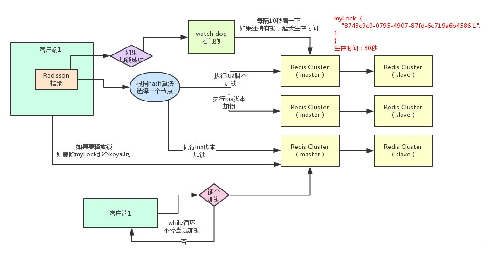
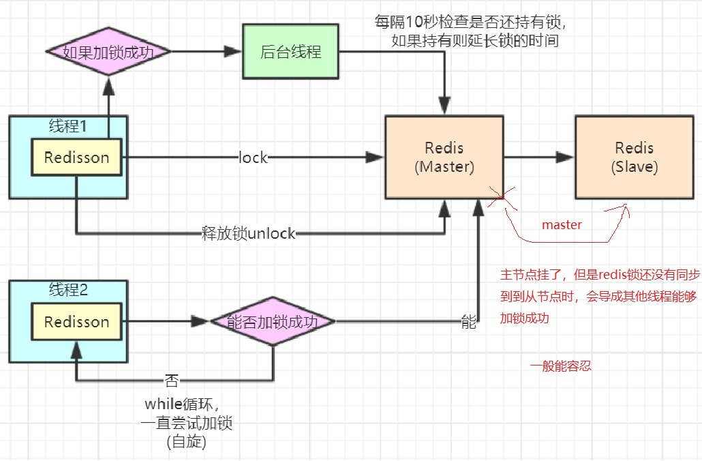
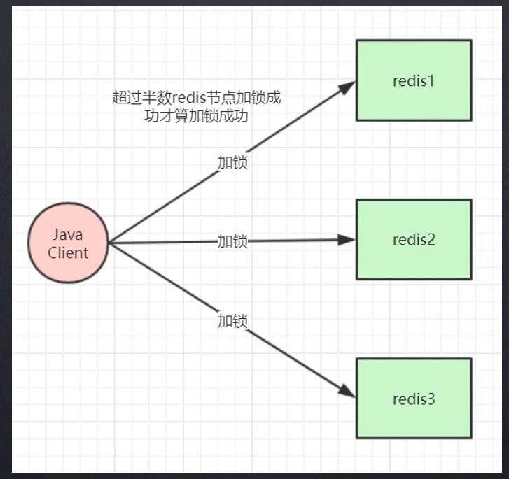

# 3. Redis分布式锁

## 3.1 什么是分布式锁？

在单机部署的情况下，为了保证数据的一致性，不出现脏数据等，就需要使用synchronized关键字、semaphore、ReentrantLock或者我们可以基于AQS定制锁。锁是在多线程间共享；<font color='#d93a49'><strong>在分布式部署情况下，锁是在多进程间共享的</strong></font>；所以为了保证锁在多进程之间的唯一性，就需要实现锁在多进程之间的共享

:::tip 分布式锁的特性：
1. 要保证某个时刻中只有一个服务的一个方法获取到这个锁
2. 要保证是可重入锁(避免死锁)
3. 要保证锁的获取和释放的高可用
:::

:::tip 分布式锁考虑的要点：

1. 需要在何时释放锁(finally)

2. 锁超时设置

3. 锁刷新设置(timeOut)

4. 如果锁超时了，为了避免误删了其他其他线程的锁，可以将当前线程的id存入redis中，当前线程释放锁的时候，需要判断存入redis的值是否为当前线程的id

5. 可重入
:::

## 3.2 简单redis锁

**简单的秒杀可以这样设计** 

```java
import org.springframework.beans.factory.annotation.Autowired;
import org.springframework.data.redis.core.StringRedisTemplate;
import org.springframework.web.bind.annotation.RequestMapping;
import org.springframework.web.bind.annotation.RestController;

import java.util.UUID;
import java.util.concurrent.TimeUnit;

@RestController
public class IndexController {
    @Autowired
    private StringRedisTemplate stringRedisTemplate;

    @RequestMapping("/deduct_stock")
    public String deductStock() {
        String lockKey = "product_101";
        String clientId = UUID.randomUUID().toString();
        //todo 加锁操作 如果product_101不存在，加锁处理，有效时间30秒-》防止服务挂了，没有释放掉锁--setnx命令
        Boolean result = stringRedisTemplate.opsForValue().setIfAbsent(lockKey, clientId, 30, TimeUnit.SECONDS);
        //todo 可以优化，自旋一段时间--牺牲性能
        if (!result) {
            //todo 优化提示 ”访问量过大，请稍后再试“
            return "error_code";
        }
        try {
            //todo  jedis.get("stock")
            int stock = Integer.parseInt(stringRedisTemplate.opsForValue().get("stock"));
            if (stock > 0) {
                int realStock = stock - 1;
                //todo  jedis.set(key,value)
                stringRedisTemplate.opsForValue().set("stock", realStock + "");
                System.out.println("扣减成功，剩余库存:" + realStock);
            } else {
                System.out.println("扣减失败，库存不足");
            }
        } finally {
            //todo 判断当前锁是否存在，存在则删除掉
            /*可以使用lua脚本，原子操作
                if redis.call("get",KEYS[1]) == ARGV[1] then 
                    return redis.call("del",KEYS[1]) 
                else 
                    return 0 
                end
            */
            if (clientId.equals(stringRedisTemplate.opsForValue().get(lockKey))) {
                stringRedisTemplate.delete(lockKey);
            }
        }
        return "end";
    }
}
```

## 3.3 基于Lock自定义实现redis锁

###  3.3.1 RedisLock

```java
package com.tqk.redis.lock;

import com.tqk.redis.utils.FileUtils;
import org.springframework.data.redis.connection.jedis.JedisConnectionFactory;
import org.springframework.stereotype.Service;
import redis.clients.jedis.Jedis;

import javax.annotation.Resource;
import java.util.Arrays;
import java.util.UUID;
import java.util.concurrent.TimeUnit;
import java.util.concurrent.locks.Condition;
import java.util.concurrent.locks.Lock;

/**
 *  该自定义锁没有实现锁的续期
 * @author tianqikai
 */
@Service
public class RedisLock implements Lock {
    private static final String  KEY = "LOCK_KEY";

    @Resource
    private JedisConnectionFactory factory;

    private ThreadLocal<String> local = new ThreadLocal<>();

    /**
     *自旋锁，阻塞式加锁
     */
    @Override
    public void lock() {
     // 1.尝试加锁
        if(tryLock()){
            return ;
        }else{
            //加锁失败，休眠一会，机会尝试加锁
            try {
                Thread.sleep(10);

            } catch (InterruptedException e) {
                e.printStackTrace();
            }
            //3.递归调用，再次去抢锁
            lock();
        }
    }

    @Override
    public void lockInterruptibly() throws InterruptedException {

    }

    /**
     * 阻塞式加锁,使用setNx命令返回OK的加锁成功，并生产随机值
     * @return
     */
    @Override
    public boolean tryLock() {
        String uuid = UUID.randomUUID().toString();
        Jedis jedis = (Jedis) factory.getConnection().getNativeConnection();
        /**
         * key:我们使用key来当锁
         * uuid:唯一标识，这个锁是我加的，属于我
         * NX：设入模式【SET_IF_NOT_EXIST】--仅当key不存在时，本语句的值才设入
         * PX：给key加有效期  -防止加锁线程崩溃，一直不释放锁
         * 1000：有效时间为 1 秒
         */
        String ret = jedis.set(KEY, uuid, "NX", "PX", 1000);
        if("OK".equals(ret)){
            System.out.println(Thread.currentThread().getName()+" : "+ Thread.currentThread().getId() +" 加锁成功："+uuid+" : "+ret);
            local.set(uuid);//抢锁成功，把锁标识号记录入本线程--- Threadlocal
            return true;
        }

        //key值里面有了，我的uuid未能设入进去，抢锁失败
        return false;
    }

    @Override
    public boolean tryLock(long time, TimeUnit unit) throws InterruptedException {
        return false;
    }

    /**
     * 正确解锁方式
     */
    @Override
    public void unlock() {
        //读取lua脚本
        String script = FileUtils.getScript("unlock.lua");
        //获取redis的原始连接
        Jedis jedis = (Jedis) factory.getConnection().getNativeConnection();
        //通过原始连接连接redis执行lua脚本
        jedis.eval(script, Arrays.asList(KEY), Arrays.asList(local.get()));
    }

    @Override
    public Condition newCondition() {
        return null;
    }
}
```

### 3.3.2 unlock.lua

```lua
if redis.call("get",KEYS[1]) == ARGV[1] then 
    return redis.call("del",KEYS[1]) 
else 
    return 0 
end
```


### 3.3.3 LockController

```java

package com.tqk.redis.controller;

import io.swagger.annotations.Api;
import io.swagger.annotations.ApiOperation;
import org.springframework.web.bind.annotation.RequestMapping;
import org.springframework.web.bind.annotation.RequestMethod;
import org.springframework.web.bind.annotation.RestController;

import javax.annotation.Resource;
import java.util.concurrent.CountDownLatch;
import java.util.concurrent.locks.Lock;

@Api(value = "锁机制", description = "锁机制说明")
@RestController
public class LockController {
    private static long count = 20;//黄牛
    private CountDownLatch countDownLatch = new CountDownLatch(5);

    @Resource(name="redisLock")
    private Lock lock;

	@ApiOperation(value="售票")
    @RequestMapping(value = "/sale", method = RequestMethod.GET)
    public Long sale() throws InterruptedException {
        count = 20;
        countDownLatch = new CountDownLatch(5);

        System.out.println("-------共20张票，分五个窗口开售-------");
        new PlusThread().start();
        new PlusThread().start();
        new PlusThread().start();
        new PlusThread().start();
        new PlusThread().start();
        return count;
    }

    // 线程类模拟一个窗口买火车票
    public class PlusThread extends Thread {
        private int amount = 0;//抢多少张票

        @Override
        public void run() {
            System.out.println(Thread.currentThread().getName() + "开始售票");
            countDownLatch.countDown();
            if (countDownLatch.getCount()==0){
                System.out.println("----------售票结果------------------------------");
            }
            try {
                countDownLatch.await();
            } catch (InterruptedException e) {
                e.printStackTrace();
            }

            while (count > 0) {
                lock.lock();
                try {
                    if (count > 0) {
                        //模拟卖票业务处理
                        amount++;
                        count--;
                    }
                }finally{
                    lock.unlock();
                }

                try {
                    Thread.sleep(10);
                } catch (Exception e) {
                    e.printStackTrace();
                }
            }
            System.out.println(Thread.currentThread().getName() + "售出"+ (amount) + "张票");
        }
    }
}
```

### 3.3.4 RedisConfig

```java
package com.tqk.redis.config;

import org.springframework.context.annotation.Bean;
import org.springframework.context.annotation.Configuration;
import org.springframework.data.redis.connection.jedis.JedisConnectionFactory;
import redis.clients.jedis.JedisPoolConfig;

@Configuration
public class RedisConfig {
    @Bean
    public JedisPoolConfig jedisPoolConfig(){
        JedisPoolConfig jedisPoolConfig = new JedisPoolConfig();
        //最大能够保持idle(闲置)的数量，控制一个pool最多有多少个状态为idle的jedis实例
        jedisPoolConfig.setMaxIdle(10);
        //在指定时刻通过pool能够获取到的最大的连接的jedis个数
        jedisPoolConfig.setMaxTotal(10000);
        return  jedisPoolConfig;
    }
    @Bean
    public JedisConnectionFactory jedisConnectionFactory(JedisPoolConfig jedisPoolConfig)  {
        JedisConnectionFactory jedisConnectionFactory = new JedisConnectionFactory();
        jedisConnectionFactory.setHostName("49.233.34.168");
        jedisConnectionFactory.setPort(6400);
//        jedisConnectionFactory.setPassword("12345678");
        jedisConnectionFactory.setUsePool(true);
        jedisConnectionFactory.setPoolConfig(jedisPoolConfig);

        return jedisConnectionFactory;
    }
}
```

### 3.3.5 如何实现锁的续期

Redis分布式锁过期了，但业务还没有处理完，需要对锁进行续期处理；

怎么续期呢？项目中启动一个WatchDog，锁的有效时间是30秒，每隔一段时间（比如10s）为当前分布式锁延期，延期时就是每隔10s重新设置当前key值得过期时间


## 3.4 Redisson分布式锁

<a data-fancybox title="Redisson分布式锁" href="./image/Redisson.jpg"></a>

### 3.4.1 依赖

```xml
    <dependency>
        <groupId>org.redisson</groupId>
        <artifactId>redisson</artifactId>
        <version>3.6.5</version>
    </dependency>
```


### 3.4.2 Redisson分布式锁

```java
import org.redisson.Redisson;
import org.redisson.api.RLock;
import org.springframework.beans.factory.annotation.Autowired;
import org.springframework.data.redis.core.StringRedisTemplate;
import org.springframework.web.bind.annotation.RequestMapping;
import org.springframework.web.bind.annotation.RestController;

/**
 * @author tianqikai
 */
@RestController
public class RedissionController {
    @Autowired
    Redisson  redisson ;
    @Autowired
    private StringRedisTemplate stringRedisTemplate;

    @RequestMapping("/redissionLock")
    public String redissionLock() {
        String lockKey = "product_101";
        RLock redissonLock = redisson.getLock(lockKey);
        try {
            //todo setnx 加锁 setIfAbsent(lockKey, clientId, 30, TimeUnit.SECONDS);
            //todo 默认有效期30秒 可以实现自动续期
            redissonLock.lock();
            //todo jedis.get("stock") 获取库存
            int stock = Integer.parseInt(stringRedisTemplate.opsForValue().get("stock"));

            if (stock > 0) {
                int realStock = stock - 1;
                //todo jedis.set(key,value)
                stringRedisTemplate.opsForValue().set("stock", realStock + "");
                System.out.println("扣减成功，剩余库存:" + realStock);
            } else {
                System.out.println("扣减失败，库存不足");
            }
        } finally {
            //todo 释放锁
            redissonLock.unlock();
        }
        return null;
    }
}
```

## 3.5 Redlock锁(不建议使用)

<a data-fancybox title="Redlock锁" href="./image/redis14.jpg"></a>

------------------------------------------------------------------------------------------------------

**Redlock锁相当于是一个zookeeper集群模式，半数加锁成功才能成功**

<a data-fancybox title="Redlock锁" href="./image/redis13.jpg"></a>

```java
import org.redisson.Redisson;
import org.redisson.RedissonRedLock;
import org.redisson.api.RLock;
import org.springframework.beans.factory.annotation.Autowired;
import org.springframework.data.redis.core.StringRedisTemplate;
import org.springframework.web.bind.annotation.RequestMapping;
import org.springframework.web.bind.annotation.RestController;

import java.util.concurrent.TimeUnit;

/**
 * @author tianqikai
 */
@RestController
public class RedLockController {
    @Autowired
    private Redisson redisson;
    @Autowired
    private StringRedisTemplate stringRedisTemplate;

    @RequestMapping("/redlock")
    public String redlock() {
        String lockKey = "product_001";
        //todo 这里需要自己实例化不同redis实例的redisson客户端连接，这里只是伪代码用一个redisson客户端简化了
        //todo 应该是连接多个redis进行加锁处理,每一个redisson连接一个redis
        RLock lock1 = redisson.getLock(lockKey);
        RLock lock2 = redisson.getLock(lockKey);
        RLock lock3 = redisson.getLock(lockKey);

        /**
         * 根据多个 RLock 对象构建 RedissonRedLock （最核心的差别就在这里）
         */
        RedissonRedLock redLock = new RedissonRedLock(lock1, lock2, lock3);
        try {
            /**
             * waitTimeout 尝试获取锁的最大等待时间，超过这个值，则认为获取锁失败
             * leaseTime   锁的持有时间,超过这个时间锁会自动失效（值应设置为大于业务处理的时间，确保在锁有效期内业务能处理完）
             */
            boolean res = redLock.tryLock(10, 30, TimeUnit.SECONDS);
            if (res) {
                //成功获得锁，在这里处理业务
            }
        } catch (Exception e) {
            throw new RuntimeException("lock fail");
        } finally {
            //无论如何, 最后都要解锁
            redLock.unlock();
        }

        return "end";
    }
}

```

## 3.6 高并发分段锁

**并发小于10w不建议使用，没有必要**

**分段加锁思想** 假如你现在iphone有1000个库存，那么你完全可以给拆成20个库存段，要是你愿意，可以在数据库的表里建20个库存字段，每个库存段是50件库存，比如stock_01对应50件库存，stock_02对应50件库存。类似这样的，也可以在redis之类的地方放20个库存key。

接着，1000个/s 请求，用一个简单的随机算法，每个请求都是随机在20个分段库存里，选择一个进行加锁。

每个下单请求锁了一个库存分段，然后在业务逻辑里面，就对数据库或者是Redis中的那个分段库存进行操作即可，包括查库存 -> 判断库存是否充足 -> 扣减库存。

相当于一个20毫秒，可以并发处理掉20个下单请求，那么1秒，也就可以依次处理掉20 * 50 = 1000个对iphone的下单请求了。

一旦对某个数据做了分段处理之后，有一个坑一定要注意：就是如果某个下单请求，咔嚓加锁，然后发现这个分段库存里的库存不足了，此时咋办？
这时你得自动释放锁，然后立马换下一个分段库存，再次尝试加锁后尝试处理。 这个过程一定要实现

**具体的分段的数量和锁的数量要和CPU核数匹配，并不是锁越多越好**