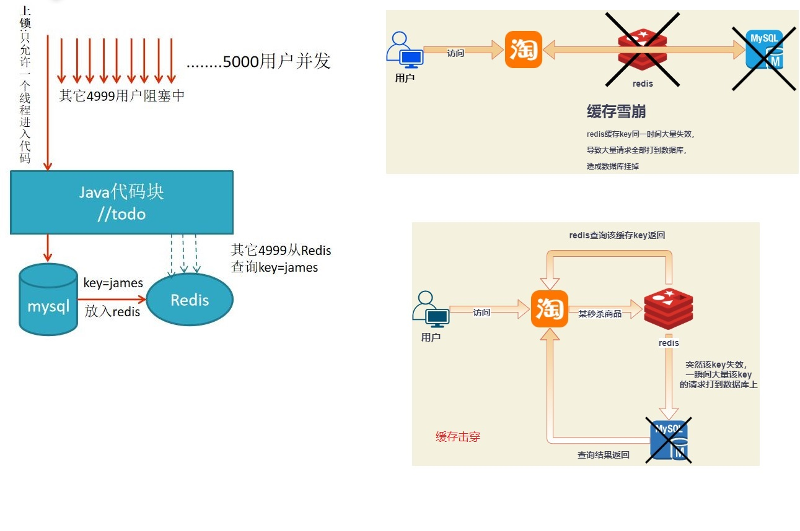
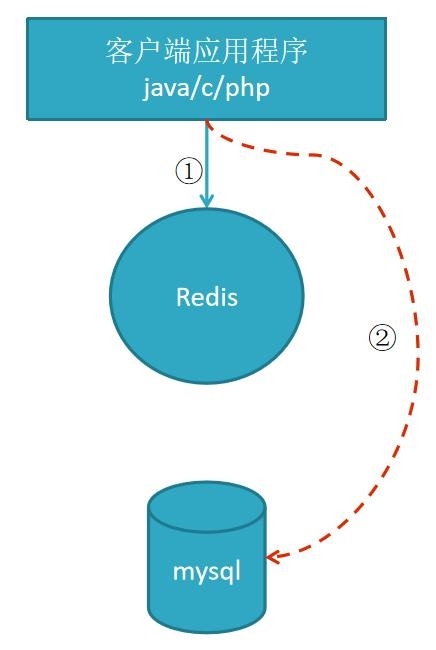

# 1. Redis基础知识

## 1.1 Redis简介

### 1.1.1 Redis特点

1. Redis读取的速度是110000次/s，写的速度是81000次/s
2. 原子 。Redis的所有操作都是原子性的，同时Redis还支持对**几个操作全并后的原子性执行**。
3. 支持多种数据结构：string（字符串）；list（列表）；hash（哈希），set（集合）；zset(有序集合)
4. 持久化：发生断电或机器故障，数据可能会丢失，持久化到硬盘
5. 主从复制（集群）：实现多个相同数据的 redis 副本
6. 支持过期时间，支持事务，消息订阅。
7. 高可用和分布式：哨兵机制实现高可用，保证 redis 节点故障发现和自动转移

### 1.1.2 Redis的应用场景

1. **数据缓存（提高访问性能）** 
将一些数据在短时间之内不会发生变化，而且它们还要被频繁访问，为了提高用户的请求速度和降低网站的负载，降低数据库的读写次数，就把这些数据放到缓存中。
**合理使用缓存加快数据访问速度，降低后端数据源压力**

2. **会话缓存**
（session cache，保存web会话信息）

3. **排行榜**
（NGINX+lua+redis计数器进行IP自动封禁）
：按照热度排名，按照发布时间排行，主要用到列表和有序集合

4. 计数器
视频网站播放数，网站浏览数，使用 redis 计数

5. 消息队列：发布和订阅
**（构建实时消息系统，聊天，群聊）**

## 1.2 Redis数据类型

        使用Redis进行应用设计和开发的一个核心概念是数据类型。与关系数据库不同，在Redis中不存在需要我们担心的表，在使用Redis进行应用设计和开发时，我们首先应该考虑的是Redis原生支持的哪种数据类型阳适合我们的应该场景，此外，我们无法像在关系数据库中那样，使用sql来操作Redis中的数据，相反，我们需要直接使用API发送数据反对应的命令，来操作想要操作的数据

### 1.2.1 字符串类型Map &lt;String,String&gt;
    字符串类型是编程语言和应用程序中最常见和最有用的数据类型，也是Redis的基本数据类型之一，事实上，Redis中所有键都必须是字符串。

### 1.2.2 list数据类型Map&lt;String,List&lt;Object&gt;&gt;
    列表是应用我只是应该程序开发中非常有用的数据类型之一，列表能存在一组对象，因此它也可以被用于栈或者队列，在Redis中，与键相关的联的值可以是字符串组成的列表，Redis中的列表更像是数据结构中的双向链表。

### 1.2.3 hash数据类型Map&lt;String,Map&lt;Object,Object&gt;&gt;
    哈希表示字段和值之间的映射关系，与JAVA中的Map类似，Redis数据集本身就可以看做一个哈希，其中字符串类型的键关联到如字符串和列表之类的数据对象，而Reidis的数据对象也可以再次使用哈希，其字段和值必须 是字符串。

### 1.2.4 set数据类型Map&lt;String,Set&lt;Object,Object&gt;&gt;
    集合类型是由唯一，无序对象组成的集合(collection).它经常用于测试某个成员是集合中，重复项删除和集合运算（求并，交，差集），Redis的值对象可以是字符串集合。

### 1.2.5 zset(sortset)数据类型
    有序集合是一个类似于set但是更复杂的数据类型,单词sorted意为着这种集合中的每个元素都有一个可用于排序的权重，并且我们可以按顺序从集合中得到元素在某些需要一个保持数据有序的场景中，使用这种原生的序的特性是很方便的。

## 1.3 重要的指令使用

### 1.3.1 全局命令

:::tip 语法
1. **查看所有键：keys *** set school enjoy set hello world 
2. **键总数 dbsize** //2 个键，如果存在大量键，线上禁止使用此指令 
3. **检查键是否存在：exists key** //存在返回 1，不存在返回 0 
4. **删除键：del key** //del hello school, 返回删除键个数，删除不存在键返回 0 
5. **键过期：expire key seconds** //set name test expire name 10 //10 秒过期 **ttl name 查看剩余的过期时间** 
6. **键的数据结构类型：type key** //type hello //返回 string,键不存在返回 none
:::

```sh
root@c2411dac6aa2:/data# redis-cli -h 127.0.0.1 -p 6379
127.0.0.1:6379> keys *
1) "tqk"
127.0.0.1:6379> dbsize
(integer) 1
127.0.0.1:6379> exists tqk
(integer) 1
127.0.0.1:6379> set tt mandao
OK
127.0.0.1:6379> exists tqk tt
(integer) 2
127.0.0.1:6379> set name test
OK
127.0.0.1:6379> expire name 10
(integer) 1
127.0.0.1:6379> ttl name
(integer) 6
127.0.0.1:6379> ttl name
(integer) 5
127.0.0.1:6379> ttl name
(integer) 4
127.0.0.1:6379> ttl name
(integer) 3
127.0.0.1:6379> type tt
string
```

### 1.3.2 string类型相关命令

字符串类型：实际上可以是字符串（包括 XML JSON），还有数字（整形 浮点 数），二进制（图片 音频 视频），最大不能超过 512MB

:::tip 语法 
1. **set key value**  :set name cxx
2. **get name**
3. getrange name 0 -1 字符串分段   0 -1是全部   0 -2  ==n-1 :截取字符串：set name helloworld ; getrange name 2 4//返回 llo
4. getset name new_cxx 设置值，返回旧值
5. **mset key1 key2 批量设置**
6. **mget key1 key2 批量获取**
7. **setnx key value 不存在就插入**（not exists）不存在键 name 时，返回 1 设置成功；存在的话失败 0
8. setrange key index value 从index开始替换value
9. incr age 递增
10. incrby age 10 递增
11. decr age 递减
12. decrby age 10 递减
13. incrbyfloat 增减浮点数
14. append 追加指令：set name hello; append name world //追加后成 helloworld
15. strlen 字符串长度：set hello “世界”；strlen hello//结果 6，每个中文占 3 个字节
16. 内部编码：int:8 字节长整理//set age 100; **object encoding age** //返回 int embstr:小于等于 39 字节串 set name bejin; object encodeing name//embstr raw:大于 39 字节的字符串 set a fsdfwerwerweffffffffffdfs//返回 raw
:::

### 1.3.3 哈希 hash

**是一个 string 类型的 field 和 value 的映射表，hash 特适合用于存储对象。**

:::tip 语法命令 
1. hset key field value 设值：hset user:1 name james //成功返回 1，失败返回 0 
2. 取值：hget user:1 name //返回 james 
3. 删值：hdel user:1 age //返回删除的个数 
4. 计算个数：hset user:1 name james; hset user:1 age 23;
hlen user:1 //返回 2，user:1 有两个属性值 
5. 批量设值：hmset user:2 name james age 23 sex boy //返回 OK 
6. 批量取值：hmget user:2 name age sex //返回三行：james 23 boy 
7. 判断 field 是否存在：hexists user:2 name //若存在返回 1，不存在返回 0 
8. 获取所有 field: hkeys user:2 // 返回 name age sex 三个 field 
9. 获取 user:2 所有 value：hvals user:2 // 返回 james 23 boy 
11. 获取 user:2 所有 field 与 value：hgetall user:2 //name age sex james 23 boy 值 
12. 增加 1：hincrby user:2 age 1 //age+1 hincrbyfloat user:2 age 2 //浮点型加 2
:::

### 1.3.4 列表&lt;list&gt;

用来存储多个有序的字符串，一个列表最多可存 2 的 32 次方减 1 个元素
因为有序，可以通过索引下标获取元素或某个范围内元素列表，列表元素可以重复

#### 1.3.4.1 语法命令
<a data-fancybox title="list" href="./image/redis02.jpg"></a>

:::tip 添加命令：
rpush james c b a //从右向左插入 cba, 返回值 3 
lrange james 0 -1 //从左到右获取列表所有元素 返回 c b a 
lpush key c b a //从左向右插入 cba 
linsert james before b teacher //在 b 之前插入 teacher, after 为之后，使 用 lrange james 0 -1 查看：c teacher b a
:::

:::tip 查找命令： 
lrange key start end //索引下标特点：从左到右为 0 到 N-1 
lindex james -1 //返回最右末尾 a，-2 返回 b 
llen james //返回当前列表长度 
lpop james //把最左边的第一个元素 c 删除 
rpop james //把最右边的元素 a 删除 
lrem key count value//删除指定元素 如：lpush test b b b b b j x z //键 test 放入 z x j b b b b b 
lrange test 0 -1 //查询结果为 z x j b b b b b 
lrem test 4 b //从左右开始删除 b 的元素,删除 4 个， 若 lrem test 8 b, 删除 8 个 b, 但只有 5 个全部删除 
lrange test 0 -1 //删除后的结果为 b j x z lrem test 0 b //检索所有 b 全部删除 j x z lpush user b b b b b j x z //键 user 从左到右放入 z x j b b b b b ltrim user 1 3 //只保留从第 2 到第 4 的元素，其它全删 
lrange user 0 -1 //查询结果为 x j b, 其它已全被删掉 
lpush user01 z y x //键 user01 从左到右放入 x y z 
lset user01 2 java // 把第 3 个元素 z 替换成 java 
lrange user01 0 -1 //查询结果为 x y java
:::

#### 1.3.4.2 应用场景设计： cacheListHashApplicationTest 用例

1. 每个用户有多个订单 key 为 order:1 order:2 order:3, 结合 hmset 
```sh
hmset order:1 orderId 1 money 36.6 time 2018-01-01 
hmset order:2 orderId 2 money 38.6 time 2018-01-01 
hmset order:3 orderId 3 money 39.6 time 2018-01-01 
```

2. 把订单信息的 key 放到队列
```
lpush user:1:order order:1 order:2 order:3 
```

3. 每新产生一个订单， 
hmset order:4 orderId 4 money 40.6 time 2018-01-01 
追加一个 order:4 放入队列第一个位置 
lpush user:1:order order:4 
4. 当需要查询用户订单记录时： 

```
lrange user:1:order 0 -1

```

```java
List orderKeys = lrange user:1:order 0 -1 //查询 user:1 的所有订单 key 值 
for(Order order: orderKeys){ 
    hmget order:1 orderId monkey time 
}
```

### 1.3.5 集合&lt;SET&gt;

**用户标签，社交，查询有共同兴趣爱好的人**

#### 1.3.5.1 命令

:::tip 命令：
1. exists user //检查 user 键值是否存在 
2. sadd user a b c//向 user 插入 3 个元素，返回 3 
3. sadd user a b //若再加入相同的元素，则重复无效，返回 0 
4. smembers user //获取 user 的所有元素,返回结果无序 
5. srem user a //返回 1，删除 a 元素 
6. scard user //返回 2，计算元素个数 
7. sismember user a //判断元素是否在集合存在，存在返回 1，不存在 0 
8. srandmember user 2 //随机返回 2 个元素，2 为元素个数 
9. spop user 2 //随机返回 2 个元素 a b,并将 a b 从集合中删除 
10. smembers user //此时已没有 a b, 只有 c 

集合的交集： 
1. sadd user:1 zhangsan 24 girl 
2. sadd user:2 james 24 boy//初始化两个集合 
3. sinter user:1 user:2 //求两集合交集， 此时返回 24
4. sadd user:3 wang 24 girl //新增第三个元素 
5. sinter user:1 user:2 user:3 //求三个集合的交集，此时返回 24 

集合的并集（集合合并去重）： 
1. sunion user:1 user:2 user:3 //三集合合并(并集)，去重 24 
2. sdiff user:1 user:2//1 和 2 差集,(zhangsan 24 girl)-(james 24 boy)=zhangsan girl 将交集(jj)、并集(bj)、差集(cj)的结果保存： 
3. sinterstore user_jj user:1 user:2 //将 user:1 user:2 的交集保存到 
4. user_jj sunionstore user_bj user:1 user:2 //将 user:1 user:2 的(并)合集保存 
5. user_bj sdiffstore user_cj user:1 user:2 //将 user:1-user:2 的差集保存 
6. user_cj smemebers user_cj // 返回 zhangsan girl
:::

#### 1.3.5.2 使用场景：

**标签，社交，查询有共同兴趣爱好的人,智能推荐**

1. 使用方式： 给用户添加标签： 

```sh
sadd user:1:fav basball fball pq 
sadd user:2:fav basball fball
```

2. 计算出共同感兴趣的人：

```sh
sinter user:1:fav user:2:fav
```

3. 新增用户加标签


```sh
sadd user:3:fav basball fball pq 
```

------------------
```sh
127.0.0.1:6379> sadd user:1:fav basball fball pq 
(integer) 3
127.0.0.1:6379> sadd user:2:fav basball fball
(integer) 2
127.0.0.1:6379> sinter user:1:fav user:2:fav
1) "fball"
2) "basball"
127.0.0.1:6379> sadd user:3:fav basball
(integer) 1
127.0.0.1:6379> sinter user:1:fav user:2:fav user:3:fav
1) "basball"
```

### 1.3.6 有序集合:

**常用于排行榜，如视频网站需要对用户上传视频做排行榜，或点赞数**
与集合有联系，不能有重复的成员

#### 1.3.6.1 命令语法

:::tip 命令语法
1. **zadd key score member [score member......]**  
zadd user:zan 200 james //james 的点赞数 1, 返回操作成功的条数 1   
zadd user:zan 200 james 120 mike 100 lee// 返回 3   

zadd test:1 nx 100 james //键 test:1 必须不存在，主用于添加 

zadd test:1 xx incr 200 james //键 test:1 必须存在，主用于修改,此时为 300 

zadd test:1 xx ch incr -299 james //返回操作结果 1，300-299=1 

zrange test:1 0 -1 withscores //查看点赞（分数）与成员名 

zcard test:1 //计算成员个数， 返回 1
:::

#### 查点赞数 

```
zadd test:2 nx 100 james //新增一个集合 
zscore test:2 james //查看 james 的点赞数（分数），返回 100
```

#### 排名： 

```
zadd user:3 200 james 120 mike 100 lee//先插入数据 
zrange user:3 0 -1 withscores //查看分数与成员


zrank user:3 james //返回名次：第 3 名返回 2，从 0 开始到 2，共 3 名 
zrevrank user:3 james //返回 0， 反排序，点赞数越高，排名越前
```

#### 删除成员
```sh
zrem user:3 jame mike //返回成功删除 2 个成员，还剩 lee
```
#### 增加分数：

```sh
zincrby user:3 10 lee //成员 lee 的分数加 10 
zadd user:3 xx incr 10 lee //和上面效果一样
```
#### 返回指定排名范围的分数与成员

```sh
zadd user:4 200 james 120 mike 100 lee//先插入数据 
zrange user:4 0 -1 withscores //返回结果如下图
```
#### 返回指定分数范围的成员 
```sh
zrangebyscore user:4 110 300 withscores //返回 120 lee ,200 James, 由低到高 
zrevrangebyscore user:4 300 110 withscores //返回 200james 120lee,由高到低 

zrangebyscore user:4 (110 +inf withscores//110 到无限大，120mike 200james 
zrevrangebyscore user:4 (110 -inf withscores//无限小到 110，返回 100 lee 
```
#### 返回指定分数范围的成员个数： 
```sh
zcount user:4 110 300 //返回 2，由 mike120 和 james200 两条数据 删除指定排名内的升序元素： 
zremrangebyrank user:4 0 1 //分数升序排列，删除第 0 个与第 1 个，只剩 james 
```
#### 删除指定分数范围的成员 
```sh
zadd user:5 200 james 120 mike 100 lee//先插入测试数据 
zremrangebyscore user:5 100 300 //删除分数在 100 与 300 范围的成员 
zremrangebyscore user:5 (100 +inf //删除分数大于 100(不包括 100),还剩 lee
```

#### 使用场景： 排行榜系统，如视频网站需要对用户上传的视频做排行榜 

1. 点赞数：
```
zadd user:1:20180106 3 mike //mike 获得 3 个赞
```
2. 再获一赞：
```
zincrby user:1:20180106 1 mike //在 3 的基础上加 1 
```
3. 用户作弊，将用户从排行榜删掉：
```
zrem user:1:20180106 mike 
```
4. 展示赞数最多的 5 个用户：
```
zadd user:4:20160101 9 jack 10 jj 11 dd 3 james 4 lee 6 mark 7 kate 
zrevrangebylex user:4:20160101 + - limit 0 5 
```
5. 查看用户赞数与排名：
``` 
zscore user:1:20180106 mike   
zrank user:1:20180106 mike
```

## 1.4 缓存雪崩和缓存穿透

### 1.4.1 缓存雪崩

前提:为节约内存,Redis 一般会做定期清除操作, 
1. 当查询 key=james 的值,此时 Redis 没有数据 
2. 如果有 5000 个用户并发来查询 key=james,全到 Mysql 里去查, Mysql 会挂掉,导致雪崩;
<a data-fancybox title="缓存雪崩" href="./image/redis03.jpg"></a>

**总结一句话：在高并发下，大量缓存key在同一时间失效，大量请求直接落在数据库上，导致数据库宕机**

### 1.4.2 缓存雪崩解决方案

:::tip 解决方案
1. 若是集群部署，可将热点数据均匀分布在不同的Redis库中也能够避免key全部失效问题

2. 设置热点数据永远不过期

3. 跑定时任务，在缓存失效前刷进新的缓存

4. 加互斥锁
<a data-fancybox title="加互斥锁" href="./image/redis04.jpg"></a>
:::

### 1.4.3 缓存穿透

前提:黑客模拟一个不存在的订单号 xxxx 
1. Redis 中无此值 
2. Mysql 中也无此值, 但一直被查询

<a data-fancybox title="缓存穿透" href="./image/redis05.jpg"></a>

### 1.4.2 缓存穿透解决方案

:::tip 解决方案

1. 对查询不存在的订单，在第一次查询数据库查询不到时，设置一个临时redis键值对 values为null(对于大量无效订单，可能对redis造成影响)

2. 对订单表所有数据查询出来放到布隆过滤器, 经过布隆过滤器处理的数据很小(只存 0 或 1)  
每次查订单表前,先到过滤器里查询当前订单号状态是0还是1, 0的话代表数据库没有数据, 直接拒绝查询

3. 对订单号进行校验，不合法的进行拦截

4. 封杀该IP地址
:::

## 1.5 Redis 持久化

redis 支持 RDB 和 AOF 两种持久化机制，持久化可以避免因进程退出而造成数据丢失；

### 1.5.1 RDB 持久化

RDB 持久化把当前进程数据生成快照（.rdb）文件保存到硬盘的过程，有手动触发 和自动触发手动触发有 save 和 bgsave 两命令 

save 命令：阻塞当前 Redis，直到 RDB 持久化过程完成为止，若内存实例比较大会造成长时间阻塞，**线上环境不建议用它** 
bgsave 命令：redis 进程执行 fork 操作创建子线程，由子线程完成持久化，阻塞时间很短（微秒级），是 save 的优化,

在执行 redis-cli shutdown 关闭 redis 服务时，如果没有开启 AOF 持久化，自动执行 bgsave; 显然 bgsave 是对 save 的优化。

<a data-fancybox title="bgsave" href="./image/bgsave.jpg"></a>

### 1.5.2 AOF 持久化

具体学习见云笔记 **Redis学习文档**
