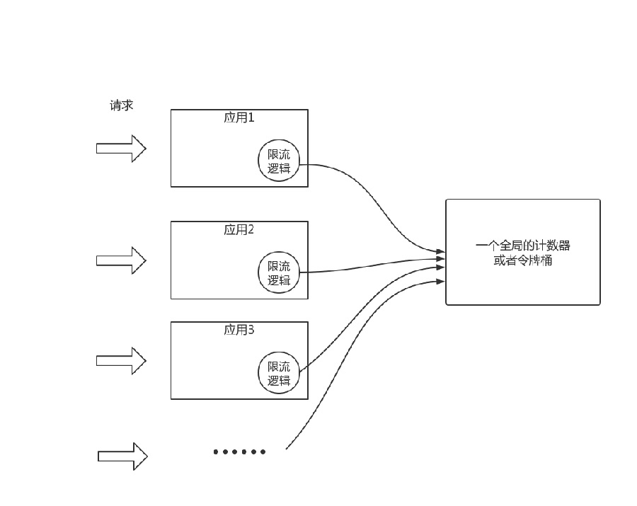

# 4. Redis实战案例

## 4.1 Redis实现抢红包

### 4.1.1 业务需求
:::tip 业务需求
1. 将所有红包全部存储到Redis ( 红包池子的概念 )
2. 用户抢了多少红包, 记录红包被抢的详情信息;
3. 用户只能抢一次红包, 不能重复抢红包
4. 其它........
:::

### 4.1.2 hongBaoPoolKey红包池

**List队列：将N个红包放到List队列中，用来初始化红包池子**
```bash
#执行命令，如何将多个红包放到放到hongBaoPool中
lpush  hongBaoPoolKey  {id:rid_1, money:9}
lpush  hongBaoPoolKey  {id:rid_2, money:8}
lpush  hongBaoPoolKey  {id:rid_3, money:12}
lpush  hongBaoPoolKey  {id:rid_N, money:15}

```

<a data-fancybox title="hongBaoPoolKey红包池" href="./image/redpack.jpg"></a>

### 4.1.2 hongBaoDetailListKey

**List类型：记录用户抢了多少钱**

```
lpush  hongBaoDetailListKey  {id:rid_N, userId:c9eb0829-40f9-4c4f-898c-1bc63321eeca,money:15}
`
`
...
```

<a data-fancybox title="hongBaoDetailListKey" href="./image/redpackedetail.jpg"></a>

### 4.1.3 hongBaoDetailListKey

**Hash类型：记录哪些用户已抢过红包，防止重复抢**

```bash
# 执行命令，如何将多个红包放到放到hongBaoPool中
hset  userIdRecordKey 001 1
hset  userIdRecordKey 002 1
hset  userIdRecordKey 003 1
hset  userIdRecordKey 00N 1
```

<a data-fancybox title="hongBaoDetailListKey" href="./image/redpackedetail.jpg"></a>

### 4.1.4 业务流程

<a data-fancybox title="业务流程" href="./image/redpack01.jpg"></a>

### 4.1.5 初始化红包池

```java
package com.tqk.redisredpack.basic;

import com.alibaba.fastjson.JSONObject;

import java.util.concurrent.CountDownLatch;

public class GenRedPack {
	/**
	 * 多线程模拟红包池初始化  Jedis类
	 */
	public static void genHongBao() throws InterruptedException {
		final JedisUtils jedis = new JedisUtils(Basic.ip, Basic.port);
		jedis.flushall();  //清空,线上不要用.....

		//发枪器
		final CountDownLatch latch = new CountDownLatch(Basic.threadCount);
		
		for(int i = 0 ; i < Basic.threadCount; i++){
			final int page = i;
			Thread thread = new Thread(){
				@Override
				public void run(){
					latch.countDown();
					try {
						latch.await();
					} catch (InterruptedException e) {
						e.printStackTrace();
					}
					//每个线程要初始化多少个红包1000  20线程
					int per = Basic.honBaoCount/Basic.threadCount;
					
					JSONObject object = new JSONObject();
					
					for(int j = page * per ; j < (page+1) * per; j++){
						object.put("id", "rid_"+j); //红包ID
						object.put("money", j);   //红包金额
						jedis.lpush("hongBaoPoolKey", object.toJSONString());
					}
				}
			};
			thread.start();
		}
	}
}

```

### 4.1.6 Lua脚本

```java
package com.tqk.redisredpack.basic;

public class Basic {
	public static String ip = "49.233.34.168";
	public static int port = 6400;
//	public static String auth = "12345678";
	public static int honBaoCount = 1000;

	public static int threadCount = 20;
	public static String hongBaoPoolKey = "hongBaoPoolKey"; //LIST类型来模拟红包池子
	public static String hongBaoDetailListKey = "hongBaoDetailListKey";//LIST类型，记录所有用户抢红包的详情
	public static String userIdRecordKey = "userIdRecordKey";//记录已经抢过红包的用户ID,防止重复抢
	
	/*
	 * KEYS[1]:hongBaoPool：                   //键hongBaoPool为List类型，模拟红包池子，用来从红包池抢红包
	 * KEYS[2]:hongBaoDetailList：//键hongBaoDetailList为List类型，记录所有用户抢红包的详情
	 * KEYS[3]:userIdRecord ：           //键userIdRecord为Hash类型，记录所有已经抢过红包的用户ID
	 * KEYS[4]:userid ：                              //模拟抢红包的用户ID
	 * 
	 * 
	 * jedis.eval(  Basic.getHongBaoScript,   4,    Basic.hongBaoPoolKey,  Basic.hongBaoDetailListKey,	Basic.userIdRecordKey,  userid);
	 *                      Lua脚本           参数个数
	 * key[1]                     key[2]                       key[3]      key[4]
	 *
	 * Basic.hongBaoPoolKey,
	 * Basic.hongBaoDetailListKey,
	 * Basic.userIdRecordKey,
	 * userid
	*/
	public static String getHongBaoScript =
			        //查询用户是否已抢过红包，如果用户已抢过红包，则直接返回nil
		            "if redis.call('hexists', KEYS[3], KEYS[4]) ~= 0 then\n"   + 
		                 "return nil\n" + 
		            "else\n"  +
							//从红包池中取出一个小红包
		                  "local hongBao = redis.call('rpop', KEYS[1]);\n"  +
							//判断红包池的红包是否为不空
		            	  "if hongBao then\n"  +
			            	 "local x = cjson.decode(hongBao);\n"  +
							//将红包信息与用户ID信息绑定，表示该用户已抢过红包
			            	 "x['userId'] = KEYS[4];\n"  +
			            	 "local re = cjson.encode(x);\n"  +
			            	 "redis.call('hset', KEYS[3], KEYS[4], '1');\n"  +
							//将抢红包的结果详情存入hongBaoDetailListKey
			            	 "redis.call('lpush', KEYS[2], re);\n" + 
			            	 "return re;\n"  +
		                  "end\n"  +
		            "end\n"  +
		            "return nil";  
}

```

## 4.2 Redis+Lua实现限流

<a data-fancybox title="Redis+Lua实现限流" href="./image/xianliu.jpg"></a>

:::tip 限流方案
1. 客户端限流sentinel等
2. 网关限流 nginx， getways等
3. 缓存限流 Redis+Lua实现限流
4. 消息队列限流 MQ
:::

## 4.3 Redis+Lua实现秒杀扣减库存

### 4.3.1 依赖
```xml
     <dependency>
            <groupId>redis.clients</groupId>
            <artifactId>jedis</artifactId>
            <version>2.9.0</version>
        </dependency>
```

### 4.3.2 代码实现

```java
package com.tuling.jedis;

import redis.clients.jedis.Jedis;
import redis.clients.jedis.JedisPool;
import redis.clients.jedis.JedisPoolConfig;

import java.io.IOException;
import java.util.Arrays;

/**
 * 访问redis单机
 *
 */
public class JedisSingleTest {
    public static void main(String[] args) throws IOException {

        JedisPoolConfig jedisPoolConfig = new JedisPoolConfig();
        jedisPoolConfig.setMaxTotal(20);
        jedisPoolConfig.setMaxIdle(10);
        jedisPoolConfig.setMinIdle(5);

        // timeout，这里既是连接超时又是读写超时，从Jedis 2.8开始有区分connectionTimeout和soTimeout的构造函数
        JedisPool jedisPool = new JedisPool(jedisPoolConfig, "192.168.65.60", 6379, 3000, null);

        Jedis jedis = null;
        try {
            //从redis连接池里拿出一个连接执行命令
            jedis = jedisPool.getResource();

            //******* jedis普通操作示例 ********
           /* System.out.println(jedis.set("single1", "zhuge"));
            System.out.println(jedis.get("single1"));*/

            //******* 管道示例 ********
            //管道的命令执行方式：cat redis.txt | redis-cli -h 127.0.0.1 -a password - p 6379 --pipe
           /* Pipeline pl = jedis.pipelined();
            for (int i = 0; i < 10; i++) {
                pl.incr("pipelineKey");
                pl.set("zhuge" + i, "zhuge");
                //模拟管道报错
                pl.setbit("zhuge", -1, true);
            }
            List<Object> results = pl.syncAndReturnAll();
            System.out.println(results);*/

            //******* lua脚本示例 ********
            //模拟一个商品减库存的原子操作
            //lua脚本命令执行方式：redis-cli --eval /tmp/test.lua , 10
            jedis.set("product_stock_10016", "15");  //初始化商品10016的库存
            String script = " local count = redis.call('get', KEYS[1]) " +
                            " local a = tonumber(count) " +
                            " local b = tonumber(ARGV[1]) " +
                            " if a >= b then " +
                            "   redis.call('set', KEYS[1], a-b) " +
                            //模拟语法报错回滚操作
                            "   bb == 0 " +
                            "   return 1 " +
                            " end " +
                            " return 0 ";
            Object obj = jedis.eval(script, Arrays.asList("product_stock_10016"), Arrays.asList("10"));
            System.out.println(obj);

        } catch (Exception e) {
            e.printStackTrace();
        } finally {
            //注意这里不是关闭连接，在JedisPool模式下，Jedis会被归还给资源池。
            if (jedis != null)
                jedis.close();
        }
    }
}

```


