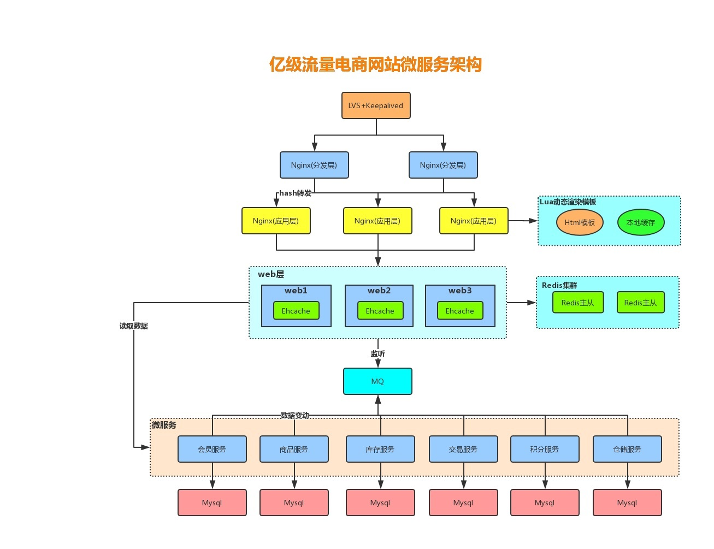
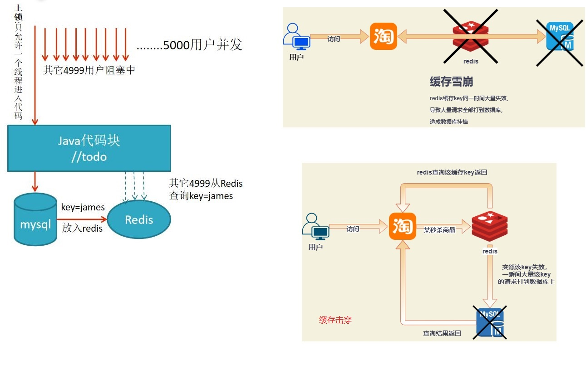
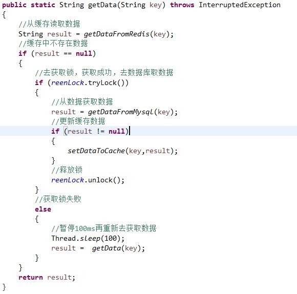
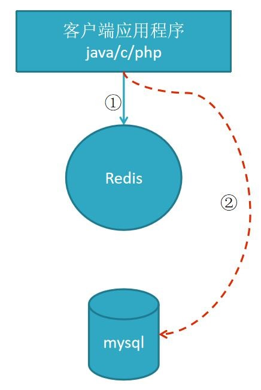
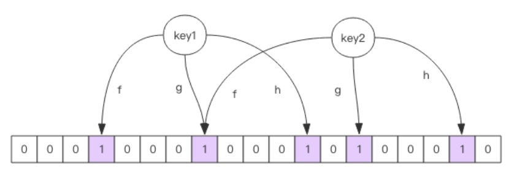
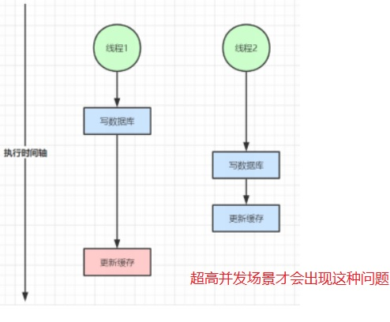
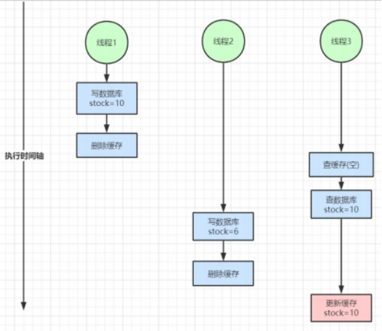
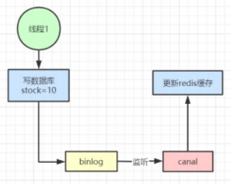

# 7. Redis缓存设计与调优
<a data-fancybox title="Redis缓存设计与调优" href="./image/redis15.jpg"></a>

## 7.1 缓存雪崩

缓存雪崩指的是缓存层支撑不住或宕掉后，流量会像奔逃的野牛一样，打向后端存储层。
由于缓存层承载着大量请求， 有效地保护了存储层， 

但是如果缓存层由于某些原因不能提供服务(比如超大并  发过来， 缓存层支撑不住， 或者由于缓存设计不好， 类似大量请求访问bigkey， 导致缓存能支撑的并发急剧下降)， 于是大量请求都会打到存储层， 存储层的调用量会暴增， 造成存储层也会级联宕机的情况。

-------------

前提:为节约内存,Redis 一般会做定期清除操作

1. 当查询 key=james 的值,此时 Redis 没有数据 
2. 如果有 5000 个用户并发来查询 key=james,全到 Mysql 里去查, Mysql 会挂掉,导致雪崩;
<a data-fancybox title="缓存雪崩" href="./image/redis03.jpg"></a>

**总结一句话：在高并发下，大量缓存key在同一时间失效，大量请求直接落在数据库上，导致数据库宕机**


预防和解决缓存雪崩问题， 可以从以下三个方面进行着手。
1. 保证缓存层服务高可用性， 比如**使用Redis Sentinel或Redis Cluster**。
2. 依赖隔离组件为后端限流熔断并降级。  比如使用**Sentinel或Hystrix限流降级组件**。

:::tip 解决方案
1. 若是集群部署，可将热点数据均匀分布在不同的Redis库中也能够避免key全部失效问题

2. 设置热点数据永远不过期

3. 跑定时任务，在缓存失效前刷进新的缓存

4. **加互斥锁**
<a data-fancybox title="加互斥锁" href="./image/redis04.jpg"></a>
:::


预防和解决缓存雪崩问题， 可以从以下三个方面进行着手。

1. 保证缓存层服务高可用性， 比如使用Redis Sentinel或Redis Cluster。

2. 依赖隔离组件为后端限流熔断并降级。  比如使用Sentinel或Hystrix限流降级组件。

比如服务降级， 我们可以针对不同的数据采取不同的处理方式。  
当业务应用访问的是非核心数据（例如电商商 品属性， 用户信息等）  时， 暂时停止从缓存中查询这些数据， 而是直接返回预定义的默认降级信息、空值或是错误提示信息；  

当业务应用访问的是核心数据（例如电商商品库存）时， 仍然允许查询缓存， 如果缓存缺失， 也可以继续通过数据库读取。

3. 提前演练。   在项目上线前， 演练缓存层宕掉后， 应用以及后端的负载情况以及可能出现的问题， 在此基 础上做一些预案设定


### 7.1.1 热点缓存key重建优化

开发人员使用“缓存+过期时间”的策略既可以加速数据读写， 又保证数据的定期更新， 这种模式基本能够满足绝大部分需求。   但是有两个问题如果同时出现， 可能就会对应用造成致命的危害：

1. 当前key是一个热点key （例如一个热门的娱乐新闻） ， 并发量非常大。
2. 重建缓存不能在短时间完成， 可能是一个复杂计算， 例如复杂的SQL、   多次IO、   多个依赖等。

在缓存失效的瞬间， 有大量线程来重建缓存， 造成后端负载加大， 甚至可能会让应用崩溃。

要解决这个问题主要就是要避免大量线程同时重建缓存。
我们可以利用**互斥锁来解决**， 此方法只允许一个线程重建缓存， 其他线程等待重建缓存的线程执行完， 重新从缓存获取数据即可。

**示例伪代码：**
```java
 String get(String key) {    // 从Redis中获取数据
  String value = redis.get(key);     // 如果value为空， 则开始重构缓存
  if (value == null) {
        // 只允许一个线程重建缓存， 使用nx， 并设置过期时间ex
        String mutexKey = "mutext:key:" + key;
        if (redis.set(mutexKey, "1", "ex 180", "nx")) {   // 从数据源获取数据
            value = db.get(key);
            // 回写Redis， 并设置过期时间
            redis.setex(key, timeout, value); 13   // 删除key_mutex
            redis.delete(mutexKey);
        }// 其他线程休息50毫秒后重试
        else {
            Thread.sleep(50);
            get(key);
        }
   }
   return value;
}
```

## 7.2 缓存穿透

缓存穿透是指查询一个根本不存在的数据， 缓存层和存储层都不会命中， 通常出于容错的考虑， 如果从存储 层查不到数据则不写入缓存层。 缓存穿透将导致不存在的数据每次请求都要到存储层去查询， 失去了缓存保护后端存储的意义。比如:黑客模拟一个不存在的订单号 xxxx 

1. Redis 中无此值 -- 自身业务代码或者数据出现问题。
2. Mysql 中也无此值, 但一直被查询--一些恶意攻击、 爬虫等造成大量空命中。

<a data-fancybox title="缓存穿透" href="./image/redis05.jpg"></a>


:::tip 解决方案

1. 对查询不存在的订单，在第一次查询数据库查询不到时，设置一个临时redis键值对 values为null(对于大量无效订单，可能对redis造成影响)

2. 对订单表所有数据查询出来放到布隆过滤器, 经过布隆过滤器处理的数据很小(只存 0 或 1)  
每次查订单表前,先到过滤器里查询当前订单号状态是0还是1, 0的话代表数据库没有数据, 直接拒绝查询

3. 对订单号进行校验，不合法的进行拦截

4. 封杀该IP地址
:::

### 7.2.1 缓存空对象

```java
String get(String key) { 
    // 从缓存中获取数据 
    String cacheValue = cache.get(key); 
    // 缓存为空 
    if (StringUtils.isBlank(cacheValue)) { 
        // 从存储中获取 
        String storageValue = storage.get(key); 
        cache.set(key, storageValue); 
        // 如果存储数据为空， 需要设置一个过期时间(300秒)
        if (storageValue == null) { 
            cache.expire(key, 60 * 5); 
        } 
        return storageValue; 
    } else { 
                // 缓存非空 
                return cacheValue; 
            } 
    }
```

### 7.2.2 布隆过滤器

对于恶意攻击，向服务器请求大量不存在的数据造成的缓存穿透，还可以用布隆过滤器先做一次过滤，对于不 存在的数据布隆过滤器一般都能够过滤掉，不让请求再往后端发送。**当布隆过滤器说某个值存在时，这个值可能不存在；当它说不存在时，那就肯定不存在**。
<a data-fancybox title="布隆过滤器" href="./image/redis21.jpg"></a>

布隆过滤器就是**一个大型的位数组和几个不一样的无偏 hash 函数**。所谓无偏就是能够把元素的 hash 值算得比较均匀。 

向布隆过滤器中添加 key 时，会使用多个 hash 函数对 key 进行 hash 算得一个整数索引值然后对位数组长度 进行取模运算得到一个位置，每个 hash 函数都会算得一个不同的位置。再把位数组的这几个位置都置为 1 就 完成了 add 操作。 

向布隆过滤器询问 key 是否存在时，跟 add 一样，也会把 hash 的几个位置都算出来，看看位数组中这几个位 置是否都为 1，只要有一个位为 0，那么说明布隆过滤器中这个key 不存在。如果都是 1，这并不能说明这个 key 就一定存在，只是极有可能存在，因为这些位被置为 1 可能是因为其它的 key 存在所致。如果这个位数组 比较稀疏，这个概率就会很大，如果这个位数组比较拥挤，这个概率就会降低。 

这种方法适用于**数据命中不高、 数据相对固定、 实时性低（通常是数据集较大） 的应用场景**， 代码维护较为 复杂， **但是缓存空间占用很少**。

可以用redisson实现布隆过滤器，引入依赖

```xml
<dependency> 
    <groupId>org.redisson</groupId> 
    <artifactId>redisson</artifactId> 
    <version>3.6.5</version> 
</dependency>
```

------------------------

```java
package com.tqk.redisboot;
import org.redisson.Redisson;
import org.redisson.api.RBloomFilter;  
import org.redisson.api.RedissonClient; 
import org.redisson.config.Config; 

public class RedissonBloomFilter { 
    public static void main(String[] args) { 
        Config config = new Config(); 
        config.useSingleServer().setAddress("redis://49.233.34.168:6400");
        //构造Redisson 
        RedissonClient redisson = Redisson.create(config); 
        RBloomFilter<String> bloomFilter = redisson.getBloomFilter("nameList"); 
        //初始化布隆过滤器：预计元素为100000000L,误差率为3%,根据这两个参数会计算出底层的bit数组大小 
        bloomFilter.tryInit(100000000L,0.03); 
        //将zhuge插入到布隆过滤器中 
        bloomFilter.add("zhuge"); 
        //判断下面号码是否在布隆过滤器中 
        System.out.println(bloomFilter.contains("guojia"));//false 
        System.out.println(bloomFilter.contains("baiqi"));//false 
        System.out.println(bloomFilter.contains("zhuge"));//true 
    } 
}
```

-----------------

```log
[redisClient=[addr=redis://49.233.34.168:6400], channel=[id: 0x67a84238, L:/192.168.0.105:52349 - R:/49.233.34.168:6400]]
false
21:40:29.446 [redisson-netty-1-2] DEBUG org.redisson.command.CommandAsyncService - connection released for command null and params null from slot null using connection RedisConnection@1281079435 [redisClient=[addr=redis://49.233.34.168:6400], channel=[id: 0xef9f38be, L:/192.168.0.105:52336 - R:/49.233.34.168:6400]]
false
21:40:29.473 [redisson-netty-1-7] DEBUG org.redisson.command.CommandAsyncService - connection released for command null and params null from slot null using connection RedisConnection@361441739 [redisClient=[addr=redis://49.233.34.168:6400], channel=[id: 0x4e1615ba, L:/192.168.0.105:52317 - R:/49.233.34.168:6400]]
true
```

#### 使用布隆过滤器需要把所有数据提前放入布隆过滤器，并且在增加数据时也要往布隆过滤器里放，布隆过滤器 缓存过滤伪代码：

```java
  //初始化布隆过滤器
  RBloomFilter<String> bloomFilter = redisson.getBloomFilter("nameList");
  //初始化布隆过滤器： 预计元素为100000000L,误差率为3%
  bloomFilter.tryInit(100000000L,0.03);

  //把所有数据存入布隆过滤器
  void init(){
       for (String key: keys) {
            bloomFilter.put(key);        
        }
  }

  String get(String key) {
       // 从布隆过滤器这一级缓存判断下key是否存在
       Boolean exist = bloomFilter.contains(key);
       if(!exist){
            return "";        
        }
       // 从缓存中获取数据
       String cacheValue = cache.get(key);        // 缓存为空
       if (StringUtils.isBlank(cacheValue)) {             // 从存储中获取
            String storageValue = storage.get(key);
            cache.set(key, storageValue);
            // 如果存储数据为空， 需要设置一个过期时间(300秒)
            if (storageValue == null) {
                cache.expire(key, 60 * 5);            
            }
            return storageValue;      
        } else {
            // 缓存非空
            return cacheValue;       
        }
  }
```

#### 注意：布隆过滤器不能删除数据，如果要删除得重新初始化数据。

## 7.3 缓存失效(击穿)

由于大批量缓存在同一时间失效可能导致大量请求同时穿透缓存直达数据库， 可能会造成数据库瞬间压力过大甚至挂掉， 对于这种情况我们在批量增加缓存时最好将这一批数据的缓存过期时间设置为一个时间段内的不同时间。

```java
  String get(String key) {    // 从缓存中获取数据
    String cacheValue = cache.get(key);    // 缓存为空
    if (StringUtils.isBlank(cacheValue)) {    // 从存储中获取
            String storageValue = storage.get(key);
            cache.set(key, storageValue);
            //设置一个过期时间(300到600之间的一个随机数)
            int expireTime = new Random().nextInt(300)+300
            if (storageValue == null) {
                cache.expire(key, expireTime);    
            }
            return storageValue;
    } else {
            // 缓存非空
            return cacheValue;
    }
  }
```

## 7.4 缓存与数据库双写不一致

在大并发下， 同时操作数据库与缓存会存在数据不一致性问题

### 7.4.1 双写不一致情况

**先更新数据库，再更新缓存**
<a data-fancybox title="双写不一致情况" href="./image/redis16.jpg"></a>

### 7.4.2 读写并发不一致

这种是常说的的**先写数据库删除缓存再更新缓存**
<a data-fancybox title="读写并发不一致" href="./image/redis17.jpg"></a>

### 7.4.3 延时双删（不建议用）

1. 删除redis
2. 更新数据库
3. 延时500毫秒--牺牲性能不一定解决问题
4. 删除redis
5. 更新数据库

### 7.4.5 分布式锁处理

**分布式锁处理相当于串行化处理，肯定不会出问题**

### 7.4.6 canal处理

<a data-fancybox title="读写并发不一致" href="./image/redis18.jpg"></a>

:::tip 总结解决方案：
1.  对于并发几率很小的数据(如个人维度的订单数据、  用户数据等)， 这种几乎不用考虑这个问题， 很少会发生 缓存不一致， 可以给缓存数据加上过期时间， 每隔一段时间触发读的主动更新即可。
2.  就算并发很高， 如果业务上能容忍短时间的缓存数据不一致(如商品名称， 商品分类菜单等)， 缓存加上过期 时间依然可以解决大部分业务对于缓存的要求。
3.  如果不能容忍缓存数据不一致， 可以通过加读写锁保证并发读写或写写的时候按顺序排好队， 读读的时候相 当于无锁。
4.  也可以用阿里开源的canal通过监听数据库的binlog日志及时的去修改缓存， 但是引入了新的中间件， 增加 了系统的复杂度
:::

## 7.5 Redis开发规范

<a href="https://note.youdao.com/s/ME0ZymwT">https://note.youdao.com/s/ME0ZymwT</a>