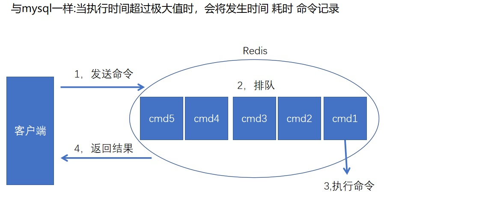
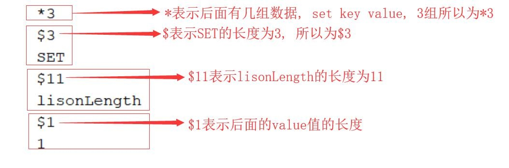
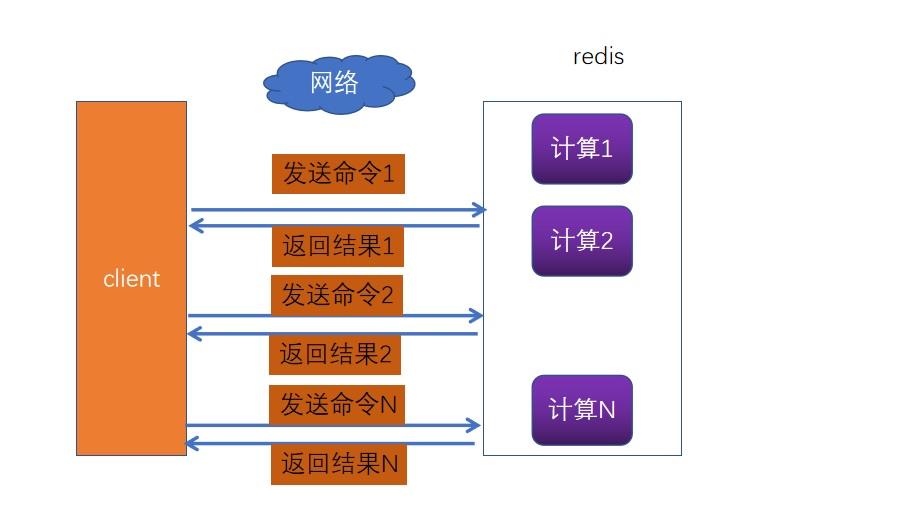
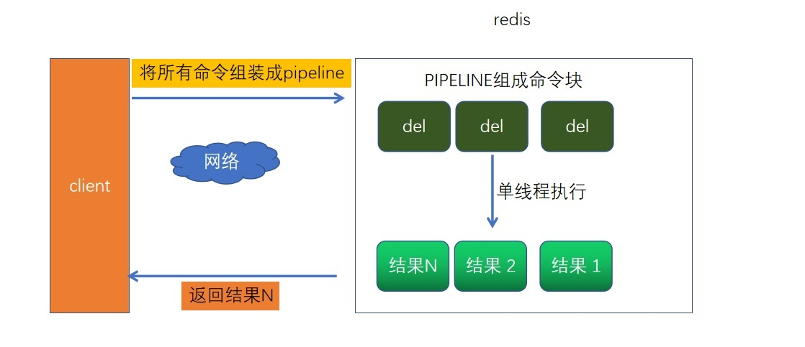
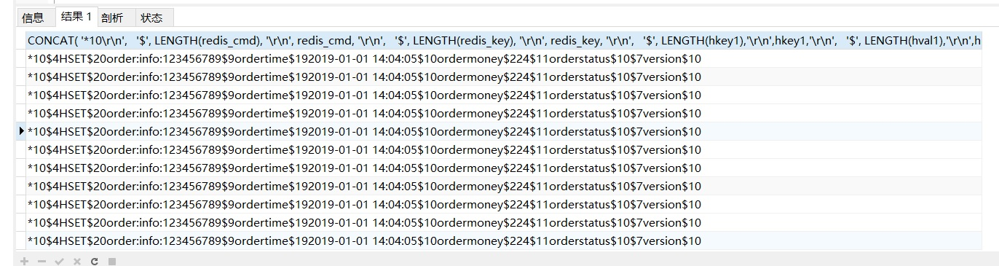

# 5. Redis慢查询和事务

redis命令生命周期：**发送 排队 执行 返回**
慢查询只统计第3个执行步骤的时间

<a data-fancybox title="Redis慢查询" href="./image/redisslow.jpg"></a>
Redis 的所有指令全部会存放到队列, 由单线程按顺序获取并执行指令, 如果某个指令执 行很慢, 会出现阻塞, 以上图可以得出: Redis 的慢查询指的是在执行第 3 个操作的时候发生的


## 5.1 Redis 慢查询阈值

### 5.1.1 Redis 慢查询阈值设置

1. 动态设置 6379:> **config set slowlog-log-slower-than 10000** //10 毫秒 使用 config set 完后,若想将配置**持久化保存到redis.conf**，要执行 **config rewrite**

```sh
# docker容器安装的

root@c2411dac6aa2:/# redis-cli
127.0.0.1:6379> config get slowlog-log-slower-than
1) "slowlog-log-slower-than"
2) "10000"
127.0.0.1:6379> config set slowlog-log-slower-than 1000
OK
127.0.0.1:6379> config get slowlog-log-slower-than
1) "slowlog-log-slower-than"
2) "1000"
127.0.0.1:6379> config rewrite
(error) ERR Rewriting config file: Permission denied ##docker安装的 没有权限写
```

2. redis.conf 修改：找到 **slowlog-log-slower-than 10000** ，修改保存即可 注意：slowlog-log-slower-than =0 记录所有命令都不记录

### 5.1.2 Redis 慢查询原理

慢查询记录也是存在队列里的，slow-max-len 存放的记录最大条数， 比如设置的 slow-max-len＝10，当有第 11 条慢查询命令插入时，队列的第一条命令就会出列，第 11 条入列到慢查询队列中，可以 config set 动态设置， 也可以修改 redis.conf 完成配置

### 5.1.3 Redis 慢查询的命令

1. 获取队列里慢查询的命令：slowlog get 

```sh
127.0.0.1:6379> config set slowlog-log-slower-than 0
OK
127.0.0.1:6379> set tqk aaaa
OK
127.0.0.1:6379> slowlog get
1) 1) (integer) 1
   2) (integer) 1637482726
   3) (integer) 18
   4) 1) "set"
      2) "tqk"
      3) "aaaa"
   5) "127.0.0.1:42108"
   6) ""
2) 1) (integer) 0
   2) (integer) 1637482721
   3) (integer) 8
   4) 1) "config"
      2) "set"
      3) "slowlog-log-slower-than"
      4) "0"
   5) "127.0.0.1:42108"
   6) ""
127.0.0.1:6379> slowlog len
(integer) 3
```

2. 获取慢查询列表当前的长度：slowlog len //以上只有 1 条慢查询，返回 1；
3. 对慢查询列表清理（重置）：slowlog reset //再查 slowlog len 此时返回 0 清空；
4. 对于线上 slow-max-len 配置的建议：线上可加大 slow-max-len 的值，记录慢查询存 长命令时 redis 会做截断，不会占用大量内存，线上可设置 1000 以上 
5. 对于线上 slowlog-log-slower-than 配置的建议：默认为 10 毫秒，根据 redis 并发量 来调整，对于高并发比建议为 1 毫秒 4)，慢查询是先进先出的队列，访问日志记录出列丢失，需定期执行 slowlog get,将结果 存储到其它设备中（如 mysql）

### 5.1.4 Redis 性能测试工具

1. **redis-benchmark -h 49.233.34.168 -p 6400 -c 100 -n 100000**                                          //100 个并发连接，100000 个请求，检测服务器性能
```sh

====== PING_INLINE ======                                                   
  100000 requests completed in 10.38 seconds
  100 parallel clients
  3 bytes payload
  keep alive: 1
  host configuration "save": 3600 1 300 100 60 10000
  host configuration "appendonly": yes
  multi-thread: no
====== LPUSH ======                                                   
  100000 requests completed in 14.79 seconds
  100 parallel clients
  3 bytes payload
  keep alive: 1
  host configuration "save": 3600 1 300 100 60 10000
  host configuration "appendonly": yes
  multi-thread: no


====== SET ======
  100000 requests completed in 1.64 seconds 指令1.64秒准备完成
  100 parallel clients #100个并行客户端
  3 bytes payload # 每次输入3个byte的数据
  keep alive: 1 # 或者

33.33% <= 1 milliseconds #一秒输入33.33%
99.80% <= 2 milliseconds #第二秒秒输入99.80%
99.88% <= 3 milliseconds #由于笔者的阿里云是1核1G此时写入的数据（下面为宝塔监视面板测试时候的cpu状态）
99.90% <= 10 milliseconds
99.95% <= 11 milliseconds
100.00% <= 11 milliseconds
61087.36 requests per second #一秒61087.36次
```
2. **redis-benchmark -h 49.233.34.168 -p 6400 -q -d 100**                                                //测试存取大小为 100 字节的数据包的性能 

3. **redis-benchmark -h 49.233.34.168 -p 6400 -t set,get -n 100000 -q**                                  //只测试 set,lpush 操作的性能 

4. **redis-benchmark -h 49.233.34.168 -p 6400 -n 100000 -q script load "redis.call('set','foo','bar')"** //只测试某些数值存取的性能

**Redis慢查询一般从计算机硬件进行优化，以及持久化策略方面进行考虑**

## 5.2 Resp 协议

Redis 服务器与客户端通过 RESP（REdis Serialization Protocol）协议通信。 主要以下特点：**容易实现,解析快,人类可读**. RESP 底层采用的是 **TCP 的连接方式**，通过 tcp 进行数据传输，然后根据解析规则解析相 应信息，完成交互。 我们可以测试下，首先运行一个 serverSocket 监听 6379，来接收 redis 客户端的请求信息，实现如下

### 5.2.1 服务端程序如下
```java
package com.james.cache.redis;

import java.io.IOException;
import java.net.ServerSocket;
import java.net.Socket;

//写一个伪的redis
public class ServerRedis {
    public static void main(String[] args) {
        try {
            ServerSocket serverSocket = new ServerSocket(6379);
            Socket rec = serverSocket.accept();
            byte[] result = new byte[2048];
            rec.getInputStream().read(result);
            System.out.println(new String(result));
        } catch (IOException e) {
            e.printStackTrace();
        }
    }
}

```
### 5.2.2 客户端程序如下
```java
package com.james.cache.redis;

import redis.clients.jedis.Jedis;

public class ClientTest {
    public static void main(String[] args) {
        Jedis jedis = new Jedis("127.0.0.1",6379);
        jedis.set("name","rehash");
        jedis.close();
    }
}
```


### 5.2.3 测试打印结果

```
*3
$3
SET
$4
name
$6
rehash
```

<a data-fancybox title="Resp 协议" href="./image/redisresp.jpg"></a>


## 5.3 PIPELINE 操作流程

大多数情况下，我们都会通过请求-相应机制去操作 redis。只用这种模式的一般的步骤 是，先获得 jedis 实例，然后通过 jedis 的 get/put 方法与 redis 交互。由于 redis 是单线程的， 下一次请求必须等待上一次请求执行完成后才能继续执行。然而使用 Pipeline 模式，客户端 可以一次性的发送多个命令，无需等待服务端返回。这样就大大的减少了网络往返时间，提高了系统性能。

### 每一次请求都会建立网络连接非常耗时, 特别是跨机房的场景下
<a data-fancybox title="PIPELINE " href="./image/redis11.jpg"></a>

```java
    public static  void delByStu(String... keys){
        Jedis jedis = new Jedis("49.233.34.168", 6400);//创建 jedis实例，没有进行连接
        for (String key:keys){
            jedis.del(key);//创建连接并执行命令
        }
        jedis.close();
    }
```

### 使用 PIPELINE 可以解决网络开销的问题

原理也非常简单,流程如下, 将多个指令打包后,一次性提交到 Redis, 网络通信只有一次
<a data-fancybox title="PIPELINE " href="./image/redis12.jpg"></a>

```java
    public static  void delByPipe(String... keys){
        Jedis jedis = new Jedis("49.233.34.168", 6400);//创建 jedis实例，没有进行连接
        Pipeline pipelined = jedis.pipelined();
        for (String key:keys){
            pipelined.del(key);//封装命令 没有提交
        }
        pipelined.sync();//提交
        jedis.close();
    }
```
## 5.4 基于PipeLine将数据库表数据快速同步到Redis


### 操作指令如下 

```sql
SELECT CONCAT(
 '*10\r\n',
   '$', LENGTH(redis_cmd), '\r\n', redis_cmd, '\r\n',
   '$', LENGTH(redis_key), '\r\n', redis_key, '\r\n',
   '$', LENGTH(hkey1),'\r\n',hkey1,'\r\n',
   '$', LENGTH(hval1),'\r\n',hval1,'\r\n',
   '$', LENGTH(hkey2),'\r\n',hkey2,'\r\n',
   '$', LENGTH(hval2),'\r\n',hval2,'\r\n',
   '$', LENGTH(hkey3),'\r\n',hkey3,'\r\n',
   '$', LENGTH(hval3),'\r\n',hval3,'\r\n',
   '$', LENGTH(hkey4),'\r\n',hkey4,'\r\n',
   '$', LENGTH(hval4),'\r\n',hval4,'\r'
)
FROM (
 SELECT
 'HSET' AS redis_cmd,
 CONCAT('order:info:',orderid) AS redis_key,
 'ordertime' AS hkey1, ordertime AS hval1,
 'ordermoney' AS hkey2, ordermoney AS hval2,
 'orderstatus' AS hkey3, orderstatus AS hval3,
 'version' AS hkey4, `version` AS hval4
 FROM redis.`order`
) AS t
```
<a data-fancybox title="ordersql " href="./image/ordersql.jpg"></a>


```sh
## stress 可能不需要  --skip-column-names --raw 不要列名称
mysql -utest -ptest stress --default-character-set=utf8 --skip-column-names --raw < order.sql | redis-cli -h 192.168.42.111 -p 6379 -a 12345678 --pipe
```

## 5.5 Redis弱事务

**pipeline是多条命令的组合，为了保证它的原子性，redis提供了简单的事务。**

redis的简单事务，将一组需要一起执行的命令放到**multi和exec**两个

命令之间，其中multi代表事务开始，exec代表事务结束

watch命令：使用watch后， multi失效，事务失效

**总结：redis提供了简单的事务，不支持事务回滚**


## 5.6 Redis消息发布与订阅机制

redis提供了“发布、订阅”模式的消息机制，其中消息订阅者与发布者不直接通信，发布者向指定的频道（channel）发布消息，订阅该频道的每个客户端都可以接收到消息


