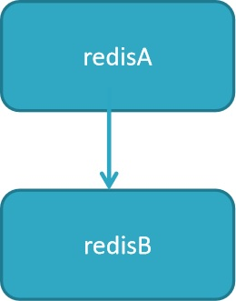
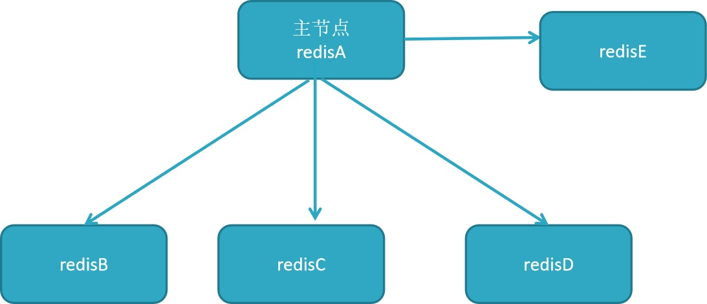
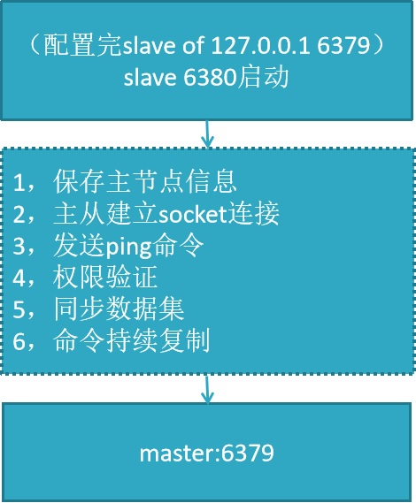
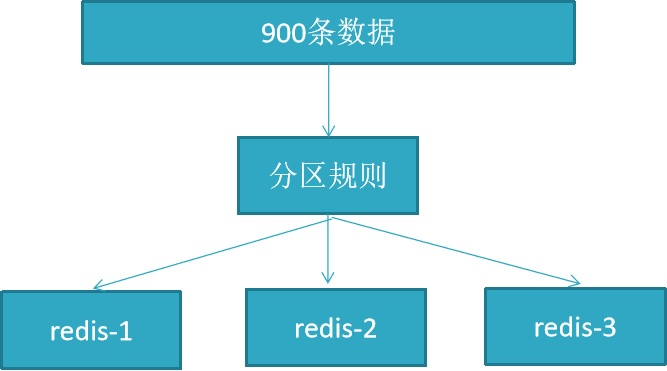
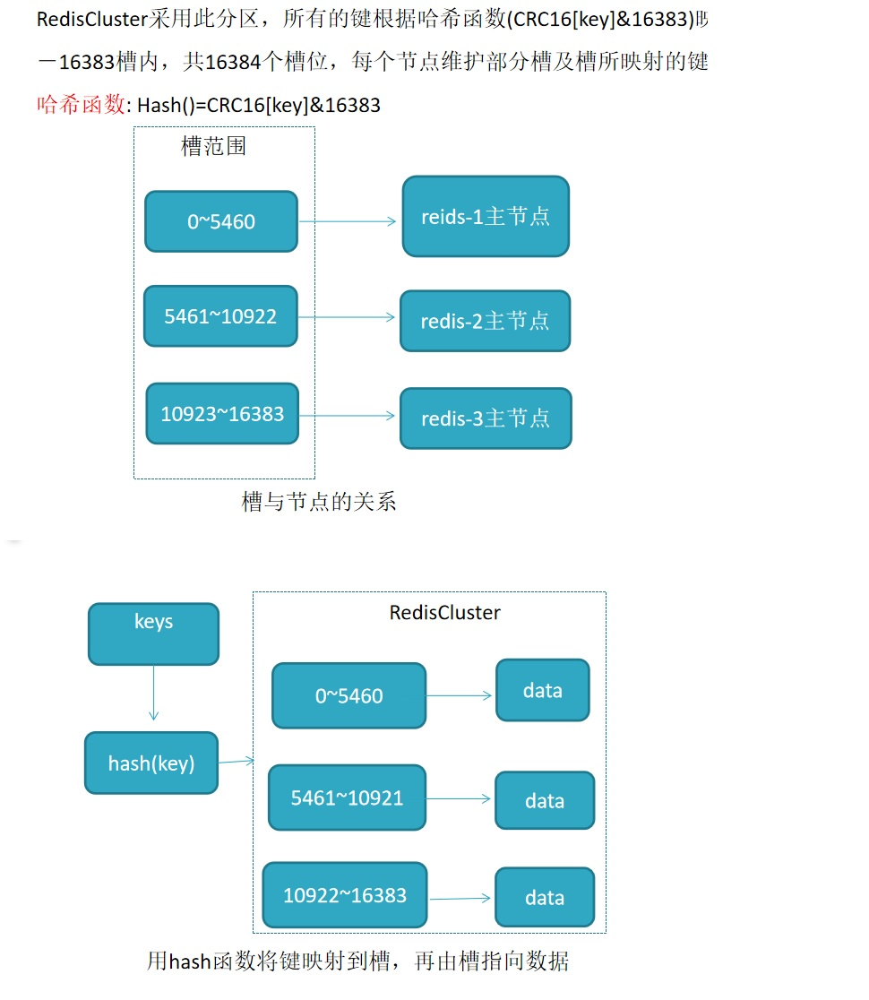

# 6. Redis高可用集群

## 6.1 Redis主从复制

### 6.1.1 Redis主从拓扑-一主一从

**一主一从**：用于主节点故障转移从节点，当主节点的“写”命令并发高且需要持久化，可以只在从节点开启AOF（主节点不需要）

### 6.1.2 Redis主从拓扑-Redis主从拓扑

**一主多从**：**针对“读”较多的场景**，“读”由多个从节点来分担，但节点越多，主节点同步到多节点的次数也越多，影响带宽，也加重主节点的稳定

### 6.1.3 复制原理

执行slave master port后，与主节点连接，同步主节点的数据,6380:>info replication：查看主从及同步信息

## 6.2 哨兵模式
反客为主的自动版，能够后台监控主机是否故障，如果故障了根据投票数自动将从库转换为主库

## 6.3 Redis高可用集群

分布式数据库把整个数据按分区规则映射到多个节点，即把数据划分到多个节点上，每个节点负责整体数据的一个子集。
比如我们库有900条用户数据，有3个redis节点，将900条分成3份，分别存入到3个redis节点

RedisCluster采用了哈希分区的“虚拟槽分区”方式（哈希分区分节点取余、一致性哈希分区和虚拟槽分区）。

### 6.3.2 虚拟槽分区

RedisCluster采用此分区，所有的键根据哈希函数(CRC16[key]&16383)映射到0－16383槽内，共16384个槽位，每个节点维护部分槽及槽所映射的键值数据
哈希函数: Hash()=CRC16[key]&16383

