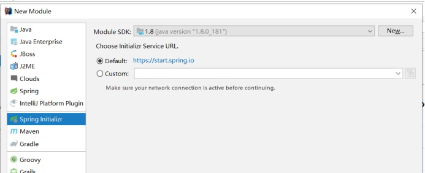

# 2. SringBoot整合Redis

## 2.1 创建项目

<a data-fancybox title="创建项目" href="./image/springboot+redis.jpg"></a>

### 2.1.1 修改pom.xml

```xml
<?xml version="1.0" encoding="UTF-8"?>
<project xmlns="http://maven.apache.org/POM/4.0.0" xmlns:xsi="http://www.w3.org/2001/XMLSchema-instance"
         xsi:schemaLocation="http://maven.apache.org/POM/4.0.0 https://maven.apache.org/xsd/maven-4.0.0.xsd">
    <modelVersion>4.0.0</modelVersion>
    <parent>
        <groupId>org.springframework.boot</groupId>
        <artifactId>spring-boot-starter-parent</artifactId>
        <version>2.6.0</version>
        <relativePath/> <!-- lookup parent from repository -->
    </parent>
    <groupId>com.tqk</groupId>
    <artifactId>Redis-Boot</artifactId>
    <version>0.0.1-SNAPSHOT</version>
    <name>Redis-Boot</name>
    <description>Spring Boot集成redis</description>
    <properties>
        <java.version>1.8</java.version>
    </properties>

    <dependencies>
        <dependency>
            <groupId>org.springframework.boot</groupId>
            <artifactId>spring-boot-starter-data-redis</artifactId>
            <version>2.6.0</version>
        </dependency>
        <!-- https://mvnrepository.com/artifact/org.springframework.data/spring-data-redis -->
        <!-- <dependency>
            <groupId>org.springframework.data</groupId>
            <artifactId>spring-data-redis</artifactId>
            <version>2.6.0</version>
        </dependency> -->
        <dependency>
            <groupId>org.springframework.boot</groupId>
            <artifactId>spring-boot-starter-web</artifactId>
        </dependency>

        <dependency>
            <groupId>org.springframework.boot</groupId>
            <artifactId>spring-boot-devtools</artifactId>
            <scope>runtime</scope>
            <optional>true</optional>
        </dependency>
        <dependency>
            <groupId>org.springframework.boot</groupId>
            <artifactId>spring-boot-configuration-processor</artifactId>
            <optional>true</optional>
        </dependency>
        <dependency>
            <groupId>org.projectlombok</groupId>
            <artifactId>lombok</artifactId>
            <optional>true</optional>
        </dependency>
        <dependency>
            <groupId>org.springframework.boot</groupId>
            <artifactId>spring-boot-starter-test</artifactId>
            <scope>test</scope>
            <exclusions>
                <exclusion>
                    <groupId>org.junit.vintage</groupId>
                    <artifactId>junit-vintage-engine</artifactId>
                </exclusion>
            </exclusions>
        </dependency>
    </dependencies>

    <build>
        <plugins>
            <plugin>
                <groupId>org.springframework.boot</groupId>
                <artifactId>spring-boot-maven-plugin</artifactId>
                <configuration>
                    <excludes>
                        <exclude>
                            <groupId>org.projectlombok</groupId>
                            <artifactId>lombok</artifactId>
                        </exclude>
                    </excludes>
                </configuration>
            </plugin>
        </plugins>
    </build>

</project>

```
### 2.1.2 创建application.yml

```yml
#redis的配置
spring:
  redis:
    host: 49.233.34.168
    #password: 123456
    port: 6400
    jedis:
      pool:
        max-active: 20
        max-idle: 8
        min-idle: 0
        max-wait: 2000
```

### 2.1.3 Redis自动配置类的说明
后续补充

### 2.1.4 测试StringRedisTemplate

```java
package com.tqk.redisboot;

import org.junit.jupiter.api.Test;
import org.springframework.beans.factory.annotation.Autowired;
import org.springframework.boot.test.context.SpringBootTest;
import org.springframework.dao.DataAccessException;
import org.springframework.data.redis.connection.RedisConnection;
import org.springframework.data.redis.core.*;
import org.springframework.data.redis.serializer.GenericJackson2JsonRedisSerializer;
import org.springframework.data.redis.serializer.StringRedisSerializer;

import java.util.Collection;
import java.util.List;
import java.util.concurrent.TimeUnit;

@SpringBootTest
class ApplicationTests {

    @Autowired
    private StringRedisTemplate redisTemplate;

    @Test
    void contextLoads() {
        System.out.println(redisTemplate);
    }

    @Test
    void flushdb(){
        redisTemplate.execute(new RedisCallback<String>() {
            @Override
            public String doInRedis(RedisConnection connection) throws DataAccessException {
                connection.flushAll();
                connection.flushDb();
                return "ok";
            }
        });
    }

    @Test
    void testNormal(){
        redisTemplate.keys("*");
        redisTemplate.multi();
        redisTemplate.exec();
        redisTemplate.watch("");
        redisTemplate.unwatch();
        redisTemplate.delete("k1");
        Collection<String> keys=null;
        redisTemplate.delete(keys);
        redisTemplate.randomKey();
        redisTemplate.rename("oldKey","newKey");
        redisTemplate.discard();

        //
        redisTemplate.getStringSerializer(); //指redis key序列化方式
        redisTemplate.getValueSerializer();  //指值的序列化方式
        redisTemplate.getHashKeySerializer();//指hash  Vlaue的 key序列化方式  hset(key,key,value)
        redisTemplate.getHashValueSerializer();//指hash  Vlaue的 value序列化方式


    }

    @Test
    void testString(){
        //这是设置key的序列化方式   因为RedisTemplate<Object,Object> 如果传String key会被当做object进么序列化
        this.redisTemplate.setKeySerializer(new StringRedisSerializer());
        this.redisTemplate.setValueSerializer(new GenericJackson2JsonRedisSerializer());

        ValueOperations<String, String> opsForValue = redisTemplate.opsForValue();
        System.out.println(redisTemplate.getKeySerializer());
        System.out.println(redisTemplate.getValueSerializer());

        //其它方法集
        RedisOperations<String, String> operations = opsForValue.getOperations();
//        opsForValue.get("");
//        opsForValue.set("","");
//        opsForValue.setIfPresent("","");
//        opsForValue.increment("");
//        opsForValue.decrement("");

        //设置TQK赋值，不存在创建并赋值，存在则不赋值，设置有效时间60s
        Boolean bool=opsForValue.setIfAbsent("TQK","田起凯",60, TimeUnit.SECONDS);

        System.out.println(bool);
        if(bool){
            System.out.println("TQK创建成功");
        }else{
            System.out.println("TQK键值对已存在");
        }
        System.out.println(opsForValue.get("TQK"));
//        opsForValue.set("name","xiaoming");
//        System.out.println(opsForValue.get("name"));
        System.out.println("--------------------------");

        System.out.println("操作完成");
    }

    @Test
    void testList(){
        ListOperations<String, String> opsForList = this.redisTemplate.opsForList();

        RedisOperations<String, String> operations = opsForList.getOperations();

        opsForList.leftPush("","");
        opsForList.leftPushAll("","","","");
        opsForList.rightPush("","");
        opsForList.rightPushAll("","");
        opsForList.leftPop("");
        opsForList.rightPop("");


        List<String> key = opsForList.range("key", 0, -1);

    }

    @Test
    void testHash(){
        HashOperations<String, Object, Object> opsForHash = this.redisTemplate.opsForHash();

        opsForHash.put("","hashKey","value");

        opsForHash.get("","hashKey");

    }

    @Test
    void testSet(){
        SetOperations<String, String> opsForSet = this.redisTemplate.opsForSet();
        opsForSet.add("","");
        opsForSet.members("");

    }

    @Test
    void testZset(){
        ZSetOperations<String, String> opsForZSet = this.redisTemplate.opsForZSet();
        opsForZSet.add("key","value",1);

    }


    /**
     * 集群操作
     */
    @Test
    void test(){
        ClusterOperations<String, String> clusterOperations = this.redisTemplate.opsForCluster();
    }

}

```
### 2.1.5 序列化接口--ApplicationRedisTemplateTests

```java
package com.tqk.redisboot;

import com.tqk.redisboot.pojo.User;
import org.junit.jupiter.api.Test;
import org.springframework.beans.factory.annotation.Autowired;
import org.springframework.boot.test.context.SpringBootTest;
import org.springframework.data.redis.core.RedisTemplate;
import org.springframework.data.redis.core.ValueOperations;
import org.springframework.data.redis.serializer.GenericJackson2JsonRedisSerializer;
import org.springframework.data.redis.serializer.StringRedisSerializer;

import java.util.Date;

@SpringBootTest
class ApplicationRedisTemplateTests {

    @Autowired
    private RedisTemplate redisTemplate;

    @Test
    void contextLoads() {
        System.out.println(redisTemplate);
        System.out.println(redisTemplate.getKeySerializer());
        System.out.println(redisTemplate.getValueSerializer());
    }
    @Test
    void testString(){
        //这是设置key的序列化方式   因为RedisTemplate<Object,Object> 如果传String key会被当做object进么序列化
        this.redisTemplate.setKeySerializer(new StringRedisSerializer());
        ValueOperations opsForValue = redisTemplate.opsForValue();
        opsForValue.set("user:1".toString(),new User(1,"xiaoming","wh",new Date()));
        User user = (User) opsForValue.get("user:1");
        System.out.println(user);
        System.out.println("操作成功");
    }
    @Test
    void testString2(){
        //这是设置key的序列化方式   因为RedisTemplate<Object,Object> 如果传String key会被当做object进么序列化
        this.redisTemplate.setKeySerializer(new StringRedisSerializer());
        this.redisTemplate.setValueSerializer(new GenericJackson2JsonRedisSerializer());
        ValueOperations opsForValue = redisTemplate.opsForValue();
        //opsForValue.set("user:2".toString(),new User(1,"xiaoming","wh",new Date()));
        User user = (User) opsForValue.get("user:2");
        System.out.println(user);
        System.out.println("操作成功");
    }
}

```

## 2.2 springboot使用redis注解做缓存

### 2.2.1 相关注解

```java
@EnableCaching 在启动类上加上注解启动缓存
​
#作用在你要缓存的数据上
@Cacheable(key="#id",cacheNames="com.sxt.service.impl.MenuServiceImpl") 
@Cacheput 解决脏读
@CachEvict（解决脏读）
@Cacheconfig（全局的配置缓存）
```

### 2.2.2 创建项目
同上
pom.xml

```xml
<?xml version="1.0" encoding="UTF-8"?>
<project xmlns="http://maven.apache.org/POM/4.0.0" xmlns:xsi="http://www.w3.org/2001/XMLSchema-instance"
         xsi:schemaLocation="http://maven.apache.org/POM/4.0.0 https://maven.apache.org/xsd/maven-4.0.0.xsd">
    <modelVersion>4.0.0</modelVersion>
    <parent>
        <groupId>org.springframework.boot</groupId>
        <artifactId>spring-boot-starter-parent</artifactId>
        <version>2.6.0</version>
        <relativePath/> <!-- lookup parent from repository -->
    </parent>
    <groupId>com.tqk</groupId>
    <artifactId>Redis-Boot-Cache</artifactId>
    <version>0.0.1-SNAPSHOT</version>
    <name>Redis-Boot-Cache</name>
    <description>Demo project for Spring Boot</description>
    <properties>
        <java.version>1.8</java.version>
    </properties>
    <dependencies>
        <dependency>
            <groupId>org.springframework.boot</groupId>
            <artifactId>spring-boot-starter-data-redis</artifactId>
        </dependency>
        <dependency>
            <groupId>org.springframework.boot</groupId>
            <artifactId>spring-boot-starter-jdbc</artifactId>
        </dependency>
        <dependency>
            <groupId>org.springframework.boot</groupId>
            <artifactId>spring-boot-starter-web</artifactId>
        </dependency>
        <dependency>
            <groupId>org.mybatis.spring.boot</groupId>
            <artifactId>mybatis-spring-boot-starter</artifactId>
            <version>2.1.1</version>
        </dependency>

        <dependency>
            <groupId>org.springframework.boot</groupId>
            <artifactId>spring-boot-devtools</artifactId>
            <scope>runtime</scope>
            <optional>true</optional>
        </dependency>
        <dependency>
            <groupId>mysql</groupId>
            <artifactId>mysql-connector-java</artifactId>
            <scope>runtime</scope>
        </dependency>
        <dependency>
            <groupId>org.springframework.boot</groupId>
            <artifactId>spring-boot-configuration-processor</artifactId>
            <optional>true</optional>
        </dependency>
        <dependency>
            <groupId>org.projectlombok</groupId>
            <artifactId>lombok</artifactId>
            <optional>true</optional>
        </dependency>
        <dependency>
            <groupId>org.springframework.boot</groupId>
            <artifactId>spring-boot-starter-test</artifactId>
            <scope>test</scope>
            <exclusions>
                <exclusion>
                    <groupId>org.junit.vintage</groupId>
                    <artifactId>junit-vintage-engine</artifactId>
                </exclusion>
            </exclusions>
        </dependency>
    </dependencies>

    <build>
        <plugins>
            <plugin>
                <groupId>org.springframework.boot</groupId>
                <artifactId>spring-boot-maven-plugin</artifactId>
            </plugin>
        </plugins>
    </build>

</project>

```
### 2.2.3 修改application.yml

```yml
#
spring:
  #数据源
  datasource:
    driver-class-name: com.mysql.jdbc.Driver
    url: jdbc:mysql://49.233.34.168:6699/mybatis?useUnicode=true&characterEncoding=utf8&allowMultiQueries=true
    username: root
    password: 12345@tqk
    type: org.springframework.jdbc.datasource.DriverManagerDataSource
  #redis
  redis:
    host: 49.233.34.168
#    password: 123456
    port: 6400
    jedis:
      pool:
        max-active: 20
        max-idle: 8
        min-idle: 0
        max-wait: 2000
#mybatis
mybatis:
  mapper-locations:
    - classpath:mapper/*Mapper.xml
  configuration:
    log-prefix: mybatis
    log-impl: org.apache.ibatis.logging.stdout.StdOutImpl

```

### 2.2.4 创建 TUserMapper TUser

```xml
<?xml version="1.0" encoding="UTF-8" ?>
<!DOCTYPE mapper PUBLIC "-//mybatis.org//DTD Mapper 3.0//EN" "http://mybatis.org/dtd/mybatis-3-mapper.dtd" >
<mapper namespace="com.tqk.redisbootcache.mapper.TUserMapper">
	<resultMap id="BaseResultMap" type="com.tqk.redisbootcache.pojo.TUser">

		<!-- <constructor> <idArg column="id" javaType="int"/> <arg column="userName"
			javaType="String"/> </constructor> -->
		<id column="id" property="id" />
		<result column="userName" property="userName" />
		<result column="realName" property="realName" />
		<result column="sex" property="sex" />
		<result column="mobile" property="mobile" />
		<result column="email" property="email" />
		<result column="note" property="note" />
	</resultMap>

	<sql id="Base_Column_List">
		id, userName, realName, sex, mobile, email, note
	</sql>

	<select id="selectAll" resultMap="BaseResultMap">
		select
		<include refid="Base_Column_List" />
		from t_user
	</select>

	<select id="selectByPrimaryKey"   resultMap="BaseResultMap" >
		select
		<include refid="Base_Column_List" />
		from t_user where id=#{id}
	</select>
	<delete id="deleteByPrimaryKey" parameterType="java.lang.Integer">
		delete from t_user
		where id = #{id,jdbcType=INTEGER}
	</delete>

	<insert id="insert" parameterType="com.tqk.redisbootcache.pojo.TUser" useGeneratedKeys="true"	keyProperty="id">
		insert into t_user (id, userName, realName,
							sex, mobile,
							email,
							note)
		values (#{id,jdbcType=INTEGER},
				#{userName,jdbcType=VARCHAR},
				#{realName,jdbcType=VARCHAR},
				#{sex,jdbcType=TINYINT},
		        #{mobile,jdbcType=VARCHAR},
				#{email,jdbcType=VARCHAR},
				#{note,jdbcType=VARCHAR})
	</insert>

	<update id="updateByPrimaryKey" parameterType="com.tqk.redisbootcache.pojo.TUser">
		update t_user
		<set>
			<if test="userName != null">
				userName = #{userName,jdbcType=VARCHAR},
			</if>
			<if test="realName != null">
				realName = #{realName,jdbcType=VARCHAR},
			</if>
			<if test="sex != null">
				sex = #{sex,jdbcType=TINYINT},
			</if>
			<if test="mobile != null">
				mobile = #{mobile,jdbcType=VARCHAR},
			</if>
			<if test="email != null">
				email = #{email,jdbcType=VARCHAR},
			</if>
			<if test="note != null">
				note = #{note,jdbcType=VARCHAR},
			</if>
		</set>
		where id = #{id,jdbcType=INTEGER}
	</update>
</mapper>
```

```java
package com.tqk.redisbootcache.mapper;


import com.tqk.redisbootcache.pojo.TUser;
import org.apache.ibatis.annotations.Mapper;
import org.apache.ibatis.annotations.Param;

import java.util.List;

@Mapper
public interface TUserMapper {
	
	TUser selectByPrimaryKey(@Param("id")Integer id);
	
	
	List<TUser> selectAll();

	int deleteByPrimaryKey(@Param("id")Integer id);
	void insert(TUser tUser);
	int updateByPrimaryKey(TUser tUser);

}
```

```java
package com.tqk.redisbootcache.pojo;

import lombok.AllArgsConstructor;
import lombok.Data;
import lombok.NoArgsConstructor;

import java.io.Serializable;
import java.util.List;

@Data
@AllArgsConstructor
@NoArgsConstructor
public class TUser implements Serializable{
	
    private Integer id;

    private String userName;

    private String realName;

    private Byte sex;

    private String mobile;

    private String email;

    private String note;
}
```

### 2.2.5 修改启动类

```java
package com.tqk.redisbootcache;

import org.mybatis.spring.annotation.MapperScan;
import org.springframework.boot.SpringApplication;
import org.springframework.boot.autoconfigure.SpringBootApplication;
import org.springframework.cache.annotation.EnableCaching;

@SpringBootApplication
@MapperScan(basePackages = {"com.tqk.redisbootcache.mapper"})
@EnableCaching ///启用缓存
public class RedisBootCacheApplication {

    public static void main(String[] args) {
        SpringApplication.run(RedisBootCacheApplication.class, args);
    }

}

```

### 2.2.6 RedisConfig  UserService  UserServiceimpl

```java
package com.tqk.redisbootcache.config;

import org.springframework.boot.autoconfigure.cache.CacheProperties;
import org.springframework.context.annotation.Bean;
import org.springframework.context.annotation.Configuration;
import org.springframework.data.redis.cache.RedisCacheConfiguration;
import org.springframework.data.redis.serializer.GenericJackson2JsonRedisSerializer;
import org.springframework.data.redis.serializer.RedisSerializationContext;

/**
 * @program: redis-code
 * @author: tianqikai
 **/

@Configuration
public class RedisConfig {
    @Bean
    public RedisCacheConfiguration redisCacheConfiguration(CacheProperties cacheProperties) {
        CacheProperties.Redis redisProperties = cacheProperties.getRedis();
        RedisCacheConfiguration config = RedisCacheConfiguration
                .defaultCacheConfig();

        config = config.serializeValuesWith(RedisSerializationContext.SerializationPair
                .fromSerializer(new GenericJackson2JsonRedisSerializer()));

        if (redisProperties.getTimeToLive() != null) {
            config = config.entryTtl(redisProperties.getTimeToLive());
        }
        if (redisProperties.getKeyPrefix() != null) {
            config = config.prefixKeysWith(redisProperties.getKeyPrefix());
        }
        if (!redisProperties.isCacheNullValues()) {
            config = config.disableCachingNullValues();
        }
        if (!redisProperties.isUseKeyPrefix()) {
            config = config.disableKeyPrefix();
        }
        return config;

    }

}
```

```java
package com.tqk.redisbootcache.service;

import com.tqk.redisbootcache.pojo.TUser;

import java.util.List;

public interface UserService {

    /**
     * 删除用户信息
     * @param id
     * @return
     */
    int deleteByPrimaryKey(Integer id);

    /**
     * 插入用户信息
     * @param user
     * @return
     */
    TUser insert(TUser user);

    /**
     * 根据索引查询
     * @param id
     * @return
     */
    TUser selectByPrimaryKey(Integer id);

    /**
     * 更新用户信息
     * @param user
     * @return
     */
    TUser updateByPrimaryKey(TUser user);

    /**
     * 查询所有的记录
     * @return
     */
    List<TUser> queryAllUser();

}

```

```java
package com.tqk.redisbootcache.service.impl;

import com.tqk.redisbootcache.mapper.TUserMapper;
import com.tqk.redisbootcache.pojo.TUser;
import com.tqk.redisbootcache.service.UserService;
import org.springframework.beans.factory.annotation.Autowired;
import org.springframework.cache.annotation.CacheEvict;
import org.springframework.cache.annotation.CachePut;
import org.springframework.cache.annotation.Cacheable;
import org.springframework.stereotype.Service;

import java.util.List;

@Service
public class UserServiceImpl implements UserService {


    @Autowired
    private  TUserMapper userMapper;

    @CacheEvict(cacheNames = "user",key = "#id")
    @Override
    public int deleteByPrimaryKey(Integer id) {
        return this.userMapper.deleteByPrimaryKey(id);
    }

    @CachePut(cacheNames = "user",key = "#user.id")
//    使用多个变量做为redis的key
//    @CachePut(cacheNames = "user",key = "#result.id+'-'+#result.flag")
    @Override
    public TUser insert(TUser user) {
        this.userMapper.insert(user);
        return user;
    }

    @Cacheable(cacheNames = "user",key = "#id")
    @Override
    public TUser selectByPrimaryKey(Integer id) {
        TUser user=this.userMapper.selectByPrimaryKey(id);
        System.out.println(user);
        return user;
    }


    @CachePut(cacheNames = "user",key = "#user.id")
    @Override
    public TUser updateByPrimaryKey(TUser user) {
        int index = this.userMapper.updateByPrimaryKey(user);
        return user;
    }

    @Override
    public List<TUser> queryAllUser() {
        List<TUser> users=this.userMapper.selectAll();
        System.out.println(users);
        return users;
    }
}

```

### 2.2.7 测试类

```java
package com.tqk.redisbootcache;

import com.tqk.redisbootcache.pojo.TUser;
import com.tqk.redisbootcache.service.UserService;
import org.junit.jupiter.api.Test;
import org.springframework.beans.factory.annotation.Autowired;
import org.springframework.boot.test.context.SpringBootTest;

import java.util.Date;

@SpringBootTest
class RedisBootCacheApplicationTests {
    @Autowired
    private UserService userService;

    @Test
    void contextLoads() {
        TUser user = new TUser();
        user.setUserName("田起凯");
        user.setEmail("953811508@qq.com");
        user.setRealName("tqk001");
        user.setSex((byte) 1);
        user.setNote("沃妮蝶");
        userService.insert(user);
        System.out.println("插入操作成功");
    }
//
//    @Test
//    void update() {
//        TUser TUser = new TUser(2,"小明","武汉北京",new Date(),0);
//        userService.updateByPrimaryKey(TUser);
//        System.out.println("操作成功");
//    }

    @Test
    void query() {
        TUser TUser = userService.selectByPrimaryKey(220);
        System.out.println(TUser);
        System.out.println("操作成功");
    }

//    @Test
//    void delete(){
//        this.userService.deleteByPrimaryKey(2);
//        System.out.println("操作成功");
//    }
}

```

## 2.3 RedisTemplate整合Lua脚本应用

### 2.3.1 Demo1

```java
package com.tqk.redisboot;

import org.junit.jupiter.api.Test;
import org.springframework.beans.factory.annotation.Autowired;
import org.springframework.boot.test.context.SpringBootTest;
import org.springframework.core.io.ClassPathResource;
import org.springframework.data.redis.core.RedisTemplate;
import org.springframework.data.redis.core.StringRedisTemplate;
import org.springframework.data.redis.core.script.DefaultRedisScript;
import org.springframework.data.redis.serializer.GenericJackson2JsonRedisSerializer;
import org.springframework.data.redis.serializer.StringRedisSerializer;
import org.springframework.scripting.ScriptSource;
import org.springframework.scripting.support.ResourceScriptSource;

import java.util.ArrayList;
import java.util.Arrays;
import java.util.List;

@SpringBootTest
public class RedisLuaDemo {
    @Autowired
    private RedisTemplate redisTemplate;

    @Autowired
    private StringRedisTemplate stringRedisTemplate;

    @Test
    void luademo1(){
        Long result = null;
        try {
            stringRedisTemplate.setKeySerializer(new StringRedisSerializer());
            stringRedisTemplate.setValueSerializer(new GenericJackson2JsonRedisSerializer());
            //调用lua脚本并执行
            DefaultRedisScript<Long> redisScript = new DefaultRedisScript<>();
            //设置返回类型是Long
            redisScript.setResultType(Long.class);
            //lua文件存放在resources目录下的redis文件夹内
            ClassPathResource resource = new ClassPathResource("redis/redistest.lua");
            ScriptSource scriptSource = new ResourceScriptSource(resource);
            System.out.println(scriptSource.getScriptAsString());
            redisScript.setScriptSource(scriptSource);
            /**
             * Arrays.asList("prize_stock") 为KEYS， lua脚本对应 KEYS[1]
             * 100, 300为参数，lua脚本对应ARGV[1] 和 ARGV[2]。
             */
            result = stringRedisTemplate.execute(redisScript, Arrays.asList("prize_stock"), 100, 300);
            System.out.println("lock1==:" + result);

        } catch (Exception e) {
            e.printStackTrace();
        }
    }

    @Test
    void luademo2(){
        Long result = null;
        try {
            redisTemplate.setKeySerializer(new StringRedisSerializer());
            redisTemplate.setValueSerializer(new GenericJackson2JsonRedisSerializer());
            //调用lua脚本并执行
            DefaultRedisScript<Long> redisScript = new DefaultRedisScript<>();

            //设置返回类型是Long
            redisScript.setResultType(Long.class);

            //lua文件存放在resources目录下的redis文件夹内
            ClassPathResource resource = new ClassPathResource("redis/lua2.lua");

            ScriptSource scriptSource = new ResourceScriptSource(resource);
            System.out.println(scriptSource.getScriptAsString());

            redisScript.setScriptSource(scriptSource);

            //组装数据
            List<Object> keyList = new ArrayList<>();
            keyList.add("luakey");
            keyList.add("tianqikai");
            keyList.add("100");

            result = (Long) redisTemplate.execute(redisScript, keyList);
            System.out.println("lock2==:" + result);
        } catch (Exception e) {
            e.printStackTrace();
        }
    }
}

```

```lua
local key = KEYS[1]
local value = KEYS[2]
local sec = KEYS[3]

local result = redis.call("SET",key, value, "NX", "EX", sec)
if(result) then
	return 1
else
	return 0;
end
```

```lua
if redis.call('setnx',KEYS[1],ARGV[1]) == 1 then
    return redis.call('expire',KEYS[1],ARGV[2])
else
    return -1000
end
```

