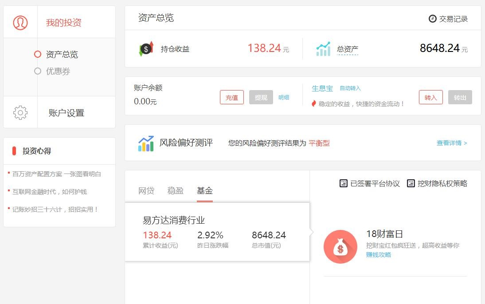

# 1. 使用缓存的经典场景

<a data-fancybox title="使用缓存的经典场景" href="./image/redis01.jpg"></a>

1. 需要从大数据量表进行计算统计；
2. 首页展现，千万级流量访问；
3. 统计数据放在redis中可能发生缓存雪崩等问题，导致mysql压力过大；


## 1.1 代码演示高并发下mysql瘫痪

### 1.1.1 五百个并发直接导致mysql连接超过阈值，崩溃

```java
    // 并发的用户数（同时并发的线程数）
    private static final int threadNum = 500;
    // 从数据库中加载收益总金额
    BigDecimal orderAmount = pds.getProfitAmountByDB(userCode);

    // 从数据库中加载收益总金额
	public BigDecimal getProfitAmountByDB(String userCode) {
		logger.info("======================get data from db============================");
		return mapper.getProfitAmount(userCode);
	}

  	<select id="getProfitAmount" parameterType="java.lang.String" resultType="BigDecimal">
		select sum(price)
		from tb_profit_detail
		where usercode =#{userCode}
	</select>
```

```java
package com.enjoylearning.cache;

import java.math.BigDecimal;
import java.math.RoundingMode;
import java.text.DecimalFormat;
import java.text.NumberFormat;
import java.util.Date;
import java.util.Random;
import java.util.UUID;
import java.util.concurrent.BrokenBarrierException;
import java.util.concurrent.CountDownLatch;
import java.util.concurrent.CyclicBarrier;
import java.util.concurrent.locks.Lock;
import java.util.concurrent.locks.ReentrantLock;

import javax.annotation.Resource;

import org.junit.Before;
import org.junit.Test;
import org.junit.runner.RunWith;
import org.slf4j.Logger;
import org.slf4j.LoggerFactory;
import org.springframework.test.context.ContextConfiguration;
import org.springframework.test.context.junit4.SpringJUnit4ClassRunner;

import com.enjoylearning.cache.entity.ProfitDetail;
import com.enjoylearning.cache.service.ProfitDetailService;

@RunWith(SpringJUnit4ClassRunner.class)
@ContextConfiguration("classpath:applicationContext.xml")
public class CacheCrashTest {

	@Resource
	private ProfitDetailService pds;
	

	private static Logger logger = LoggerFactory.getLogger(CacheCrashTest.class);

	// 并发的用户数（同时并发的线程数）
	private static final int threadNum = 500;

	//存储用户编码，从中随机取值访问
	private static final String[] userList = new String[] { "u001", "u9844","u91134", "ulaowang", "u9334", "u9897" };

	//random对象用于随机从数组中取值
	private Random random = new Random();

	// 倒计数器（发令枪），用于制造线程的并发执行
	private CountDownLatch startLine = new CountDownLatch(threadNum);
	
	private CyclicBarrier cyc = new CyclicBarrier(threadNum +1);
	
	
	@Test
	//模拟另外一个客户端进行了业务更新，新增一笔收益详情
	public void insertData(){
		ProfitDetail detail = new ProfitDetail();
		detail.setCode(UUID.randomUUID().toString());
		detail.setCreattime(new Date());
		detail.setPcode("xxoo");
		detail.setPrice(new BigDecimal(100));
		detail.setUsercode("u001");
		pds.addProfitDetail(detail);
	}

	
	
	
	@Before
	public void init() {
		// 执行缓存初始化
		for (String userCode : userList) {
			pds.cleanCache(userCode);
			pds.getProfitAmountByCache(userCode);
		}
	}

	@Test
	// 主要测试方法
	public void crashTest() throws InterruptedException, BrokenBarrierException {
		long begin = System.currentTimeMillis();
		// 循环threadNum次，实例化threadNum个线程，并同时执行
		for (int i = 0; i < threadNum; i++) {
			String tempUser = userList[random.nextInt(6)];
			new Thread(new UserRequest(tempUser)).start();
			startLine.countDown();
		}
		System.out.println("------------------------------");
		cyc.await();
		long end = System.currentTimeMillis();
		System.out.println("代码运行时间："+(end - begin));
		//阻塞主线程，等待子线程结束
//		Thread.currentThread().join();
		
	}


	// 模拟用户的请求，继承线程接口
	private class UserRequest implements Runnable {
		//用户编号
		private String userCode;

		public UserRequest(String userCode) {
			super();
			this.userCode = userCode;
		}

		@Override
		public void run() {
			try {
				// 所有子线程在这里等待，当所有线程实例化后，同时停止等待
				startLine.await();
			} catch (InterruptedException e) {
				// TODO Auto-generated catch block
				e.printStackTrace();
			}

			// N个子线程同时调用获取收益总额接口
			long begin = System.currentTimeMillis();
			// 从数据库中加载收益总金额
			BigDecimal orderAmount = pds.getProfitAmountByDB(userCode);
			// 优先从缓存中加载收益总金额
//			BigDecimal orderAmount = pds.getProfitAmountByCache(userCode);
			long end = System.currentTimeMillis();
			logger.info(Thread.currentThread().getName() +"用户编码："+userCode+ "==============>"+ orderAmount+"数据查询时间为"+(end-begin)+"毫秒");
			try {
				cyc.await();
			} catch (InterruptedException | BrokenBarrierException e) {
				// TODO Auto-generated catch block
				e.printStackTrace();
			}
		}

	}
	@Test
	// 随机从字符串中取值，比例有一定随机性
	public void testRomdamArray() throws InterruptedException {
		int u1 = 0;
		int u2 = 0;
		int u3 = 0;
		int u4 = 0;
		int u5 = 0;
		int u6 = 0;
		// 循环threadNum次，实例化threadNum个线程，并同时执行
		for (int i = 0; i < threadNum; i++) {
			String tempUser = userList[random.nextInt(6)];
			if (tempUser.equals(userList[0])) {
				u1++;
			}
			if (tempUser.equals(userList[1])) {
				u2++;
			}
			if (tempUser.equals(userList[2])) {
				u3++;
			}
			if (tempUser.equals(userList[3])) {
				u4++;
			}
			if (tempUser.equals(userList[4])) {
				u5++;
			}
			if (tempUser.equals(userList[5])) {
				u6++;
			}
		}
		System.out.println("u1:" + accuracy(u1,threadNum));
		System.out.println("u2:" + accuracy(u2,threadNum));
		System.out.println("u3:" + accuracy(u3,threadNum));
		System.out.println("u4:" + accuracy(u4,threadNum));
		System.out.println("u5:" + accuracy(u5,threadNum));
		System.out.println("u6:" + accuracy(u6,threadNum));

	}


	//计算百分比，并以字符串方式返回
	public static String accuracy(double num, double total){
	    int scale = 2;
		DecimalFormat df = (DecimalFormat)NumberFormat.getInstance();
		//可以设置精确几位小数
		df.setMaximumFractionDigits(scale);
		//模式 例如四舍五入
		df.setRoundingMode(RoundingMode.HALF_UP);
		double accuracy_num = num / total * 100;
		return df.format(accuracy_num)+"%";
	}


}
```


```cpp
2021-11-18 14:23:32.250 [Druid-ConnectionPool-Create-794476802] ERROR com.alibaba.druid.pool.DruidDataSource - create connection error, url: jdbc:mysql://49.233.34.168:6699/pattern?useUnicode=true&characterEncoding=utf8&allowMultiQueries=true, errorCode 1040, state 08004
com.mysql.jdbc.exceptions.jdbc4.MySQLNonTransientConnectionException: Data source rejected establishment of connection,  message from server: "Too many connections"
```

## 1.2 加Redis缓存处理

### 1.2.1 将统计数据存放在redis缓存中

```java

```


## 1.3 缓存失效瞬间，高并发请求给后端系统(比如DB)带来很大压力，甚至系统瘫痪！

### 在db数据库查询上边加锁处理