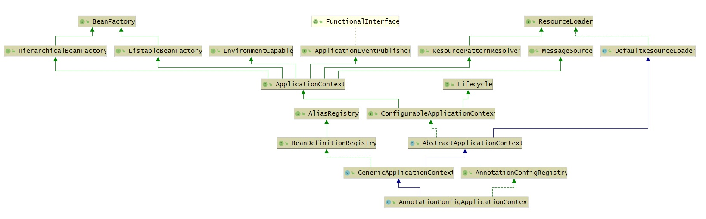
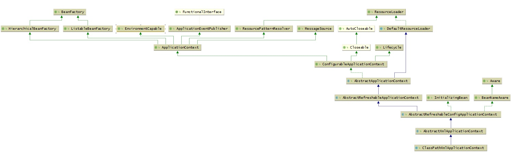

# 3 Spring之底层架构核心概念

## 3.1 BeanDefinition

### 3.1.1 BeanDefinition属性
BeanDefinition表示Bean定义，BeanDefinition中存在很多属性用来描述一个Bean的特点
:::tip BeanDefinition属性
● <font color='red'>class</font>表示Bean类型  
● <font color='red'>scope</font>表示Bean作用域，单例或原型等  
● <font color='red'>lazyInit</font>：表示Bean是否是懒加载  
● <font color='red'>initMethodName</font>：表示Bean初始化时要执行的方法  
● <font color='red'>destroyMethodName</font>：表示Bean销毁时要执行的方法  
● 还有很多...  
:::

### 3.1.2 申明式定义Bean
在Spring中，我们经常会通过以下几种方式来定义Bean,我们可以称之**申明式定义Bean**：

:::tip 申明式定义Bean
1. <font color='#f58220'>&lt;bean/&gt;</font>  
2. <font color='#f58220'>@Bean</font>  
3. <font color='#f58220'> @Component(@Service,@Controller)</font>  
:::

### 3.1.3 编程式定义Bean

```java
AnnotationConfigApplicationContext context = new AnnotationConfigApplicationContext(AppConfig.class);
// 生成一个BeanDefinition对象，并设置beanClass为User.class，并注册到ApplicationContext中
AbstractBeanDefinition beanDefinition = BeanDefinitionBuilder.genericBeanDefinition().getBeanDefinition();
beanDefinition.setBeanClass(User.class);
context.registerBeanDefinition("user", beanDefinition);

System.out.println(context.getBean("user"));
```

我们还可以通过BeanDefinition设置一个Bean的其他属性

```java
beanDefinition.setScope("prototype"); // 设置作用域
beanDefinition.setInitMethodName("init"); // 设置初始化方法
beanDefinition.setLazyInit(true); // 设置懒加载
```
和申明式事务、编程式事务类似，通过&lt;bean/&gt;，@Bean，@Component等申明式方式所定义的Bean，最终都会被Spring解析为对应的BeanDefinition对象，并放入Spring容器中。

## 3.2 BeanDefinitionReader

接下来，我们来介绍几种在Spring源码中所提供的BeanDefinition读取器（BeanDefinitionReader），这些BeanDefinitionReader在我们使用Spring时用得少，但在Spring源码中用得多，相当于Spring源码的基础设施。

### 3.2.1 AnnotatedBeanDefinitionReader

可以直接把某个类转换为BeanDefinition，并且会解析该类上的注解，比如

```java
AnnotationConfigApplicationContext context = new AnnotationConfigApplicationContext(AppConfig.class);

AnnotatedBeanDefinitionReader annotatedBeanDefinitionReader = new AnnotatedBeanDefinitionReader(context);

// 将User.class解析为BeanDefinition
annotatedBeanDefinitionReader.register(User.class);

System.out.println(context.getBean("user"));
```
注意：它能解析的注解是：@Conditional，@Scope、@Lazy、@Primary、@DependsOn、@Role、@Description


### 3.2.2 XmlBeanDefinitionReader
可以解析&lt;bean/&gt;标签

```java
AnnotationConfigApplicationContext context = new AnnotationConfigApplicationContext(AppConfig.class);

XmlBeanDefinitionReader xmlBeanDefinitionReader = new XmlBeanDefinitionReader(context);
int i = xmlBeanDefinitionReader.loadBeanDefinitions("spring.xml");

System.out.println(context.getBean("user"));
```
### 3.2.1 ClassPathBeanDefinitionScanner

ClassPathBeanDefinitionScanner是扫描器，但是它的作用和BeanDefinitionReader类似，它可以进行扫描，扫描某个包路径，对扫描到的类进行解析，比如，扫描到的类上如果存在@Component注解，那么就会把这个类解析为一个BeanDefinition，比如：

```java
AnnotationConfigApplicationContext context = new AnnotationConfigApplicationContext();
context.refresh();

ClassPathBeanDefinitionScanner scanner = new ClassPathBeanDefinitionScanner(context);
scanner.scan("com.zhouyu");

System.out.println(context.getBean("userService"));
```

## 3.3 BeanFactory

BeanFactory表示**Bean工厂**，所以很明显，BeanFactory会负责创建Bean，并且提供获取Bean的API。

而ApplicationContext是BeanFactory的一种，在Spring源码中，是这么定义的

```java
public interface ApplicationContext extends EnvironmentCapable, ListableBeanFactory, HierarchicalBeanFactory,
		MessageSource, ApplicationEventPublisher, ResourcePatternResolver {

            ...
}
```

首先在Java中，接口是可以多继承的，我们发现**ApplicationContext继承了ListableBeanFactory和HierarchicalBeanFactory**，而**ListableBeanFactory和HierarchicalBeanFactory都继承至BeanFactory**;

所以我们可以认为ApplicationContext继承了BeanFactory，相当于苹果继承水果，宝马继承汽车一样，ApplicationContext也是BeanFactory的一种，**拥有BeanFactory支持的所有功能**。

不过ApplicationContext比BeanFactory更加强大，ApplicationContext还继承了其他接口，也就表示ApplicationContext还拥有其他功能，
比如MessageSource表示国际化，  
ApplicationEventPublisher表示事件发布，  
EnvironmentCapable表示获取环境变量等等，  

关于ApplicationContext后面再详细讨论。

在Spring的源码实现中，当我们new一个ApplicationContext时，其底层会new一个BeanFactory出来，当使用ApplicationContext的某些方法时，比如getBean()，底层调用的是BeanFactory的getBean()方法。

在Spring源码中，BeanFactory接口存在一个非常重要的实现类是：**DefaultListableBeanFactory，也是非常核心的**。具体重要性，随着后续课程会感受更深。

所以，我们可以直接来使用DefaultListableBeanFactory，而不用使用ApplicationContext的某个实现类，比如

```java
DefaultListableBeanFactory beanFactory = new DefaultListableBeanFactory();

AbstractBeanDefinition beanDefinition = BeanDefinitionBuilder.genericBeanDefinition().getBeanDefinition();
beanDefinition.setBeanClass(User.class);

beanFactory.registerBeanDefinition("user", beanDefinition);

System.out.println(beanFactory.getBean("user"));
```

**DefaultListableBeanFactory是非常强大的，支持很多功能，可以通过查看DefaultListableBeanFactory的类继承实现结构来看**

<a data-fancybox title="DefaultListableBeanFactory" href="./image/spring31.jpg"></a>

:::tip 它实现了很多接口，表示它拥有很多功能：
1. AliasRegistry：支持别名功能，一个名字可以对应多个别名
2. BeanDefinitionRegistry：可以注册、保存、移除、获取某个BeanDefinition
3. BeanFactory：Bean工厂，可以根据某个bean的名字、或类型、或别名获取某个Bean对象
4. SingletonBeanRegistry：可以直接注册、获取某个单例Bean
5. SimpleAliasRegistry：它是一个类，实现了AliasRegistry接口中所定义的功能，支持别名功能
6. ListableBeanFactory：在BeanFactory的基础上，增加了其他功能，可以获取所有BeanDefinition的beanNames，可以根据某个类型获取对应的beanNames，可以根据某个类型获取{类型：对应的Bean}的映射关系
7. HierarchicalBeanFactory：在BeanFactory的基础上，添加了获取父BeanFactory的功能
8. DefaultSingletonBeanRegistry：它是一个类，实现了SingletonBeanRegistry接口，拥有了直接注册、获取某个单例Bean的功能
9. ConfigurableBeanFactory：在HierarchicalBeanFactory和SingletonBeanRegistry的基础上，添加了设置父BeanFactory、类加载器（表示可以指定某个类加载器进行类的加载）、设置Spring EL表达式解析器（表示该BeanFactory可以解析EL表达式）、设置类型转化服务（表示该BeanFactory可以进行类型转化）、可以添加BeanPostProcessor（表示该BeanFactory支持Bean的后置处理器），可以合并BeanDefinition，可以销毁某个Bean等等功能
10. FactoryBeanRegistrySupport：支持了FactoryBean的功能
11. AutowireCapableBeanFactory：是直接继承了BeanFactory，在BeanFactory的基础上，支持在创建Bean的过程中能对Bean进行自动装配
12. AbstractBeanFactory：实现了ConfigurableBeanFactory接口，继承了FactoryBeanRegistrySupport，这个BeanFactory的功能已经很全面了，但是不能自动装配和获取beanNames
13. ConfigurableListableBeanFactory：继承了ListableBeanFactory、AutowireCapableBeanFactory、ConfigurableBeanFactory
14. AbstractAutowireCapableBeanFactory：继承了AbstractBeanFactory，实现了AutowireCapableBeanFactory，拥有了自动装配的功能
15. DefaultListableBeanFactory：继承了AbstractAutowireCapableBeanFactory，实现了ConfigurableListableBeanFactory接口和BeanDefinitionRegistry接口，所以DefaultListableBeanFactory的功能很强大
:::

## 3.4 ApplicationContext

上面有分析到，ApplicationContext是个接口，实际上也是一个BeanFactory，不过比BeanFactory更加强大，比如：

:::tip ApplicationContext继承接口
1. HierarchicalBeanFactory：拥有获取父BeanFactory的功能
2. ListableBeanFactory：拥有获取beanNames的功能
3. ResourcePatternResolver：资源加载器，可以一次性获取多个资源（文件资源等等）
4. EnvironmentCapable：可以获取运行时环境（没有设置运行时环境功能）
5. ApplicationEventPublisher：拥有广播事件的功能（没有添加事件监听器的功能）
6. MessageSource：拥有国际化功能
:::

我们先来看ApplicationContext两个比较重要的实现类：
1. AnnotationConfigApplicationContext
2. ClassPathXmlApplicationContext

### 3.4.1 AnnotationConfigApplicationContext
<a data-fancybox title="AnnotationConfigApplicationContext" href="./image/AnnotationConfigApplicationContext.jpg"></a>


1. **ConfigurableApplicationContext**：继承了ApplicationContext接口，增加了，添加事件监听器、添加BeanFactoryPostProcessor、设置Environment，获取ConfigurableListableBeanFactory等功能

2. **AbstractApplicationContext**：实现了ConfigurableApplicationContext接口

3. **GenericApplicationContext**：继承了AbstractApplicationContext，实现了BeanDefinitionRegistry接口，拥有了所有ApplicationContext的功能，并且可以注册BeanDefinition，注意这个类中有一个属性(DefaultListableBeanFactory beanFactory)

4. **AnnotationConfigRegistry**：可以单独注册某个为类为BeanDefinition（可以处理该类上的@Configuration注解，已经可以处理@Bean注解），同时可以扫描

5. **AnnotationConfigApplicationContext**：继承了GenericApplicationContext，实现了AnnotationConfigRegistry接口，拥有了以上所有的功能

### 3.4.2 ClassPathXmlApplicationContext

它也是继承了AbstractApplicationContext，但是相对于AnnotationConfigApplicationContext而言，功能没有AnnotationConfigApplicationContext强大，比如不能注册BeanDefinition

<a data-fancybox title="ClassPathXmlApplicationContext" href="./image/ClassPathXmlApplicationContext.jpg"></a>


### 3.4.3 国际化
先定义一个MessageSource:
```java
@Bean
public MessageSource messageSource() {
	ResourceBundleMessageSource messageSource = new ResourceBundleMessageSource();
	messageSource.setBasename("messages");
	return messageSource;
}
```

有了这个Bean，你可以在你任意想要进行国际化的地方使用该MessageSource。
同时，因为ApplicationContext也拥有国家化的功能，所以可以直接这么用：
```java
context.getMessage("test", null, new Locale("en_CN"))
```

### 3.4.4 资源加载
ApplicationContext还拥有资源加载的功能，比如，可以直接利用ApplicationContext获取某个文件的内容：

```java
AnnotationConfigApplicationContext context = new AnnotationConfigApplicationContext(AppConfig.class);

Resource resource = context.getResource("file://D:\\IdeaProjects\\spring-framework-5.3.10\\tuling\\src\\main\\java\\com\\zhouyu\\service\\UserService.java");
System.out.println(resource.contentLength());
```

你可以想想，如果你不使用ApplicationContext，而是自己来实现这个功能，就比较费时间了。
还比如你可以：

```java
AnnotationConfigApplicationContext context = new AnnotationConfigApplicationContext(AppConfig.class);

Resource resource = context.getResource("file://D:\\IdeaProjects\\spring-framework-5.3.10\\tuling\\src\\main\\java\\com\\zhouyu\\service\\UserService.java");
System.out.println(resource.contentLength());
System.out.println(resource.getFilename());

Resource resource1 = context.getResource("https://www.baidu.com");
System.out.println(resource1.contentLength());
System.out.println(resource1.getURL());

Resource resource2 = context.getResource("classpath:spring.xml");
System.out.println(resource2.contentLength());
System.out.println(resource2.getURL());
```

还可以一次性获取多个：

```java
Resource[] resources = context.getResources("classpath:com/zhouyu/*.class");
for (Resource resource : resources) {
	System.out.println(resource.contentLength());
	System.out.println(resource.getFilename());
}
```


### 3.4.5 获取运行时环境

```java
AnnotationConfigApplicationContext context = new AnnotationConfigApplicationContext(AppConfig.class);

Map<String, Object> systemEnvironment = context.getEnvironment().getSystemEnvironment();
System.out.println(systemEnvironment);

System.out.println("=======");

Map<String, Object> systemProperties = context.getEnvironment().getSystemProperties();
System.out.println(systemProperties);

System.out.println("=======");

MutablePropertySources propertySources = context.getEnvironment().getPropertySources();
System.out.println(propertySources);

System.out.println("=======");

System.out.println(context.getEnvironment().getProperty("NO_PROXY"));
System.out.println(context.getEnvironment().getProperty("sun.jnu.encoding"));
System.out.println(context.getEnvironment().getProperty("zhouyu"));
```
_____________

注意，可以利用

```java
@PropertySource("classpath:spring.properties")
```
来使得某个properties文件中的参数添加到运行时环境中
### 3.4.6 事件发布
先定义一个事件监听器
```java
@Bean
public ApplicationListener applicationListener() {
	return new ApplicationListener() {
		@Override
		public void onApplicationEvent(ApplicationEvent event) {
			System.out.println("接收到了一个事件");
		}
	};
}
```

发布一个事件
```java
context.publishEvent("kkk");
```