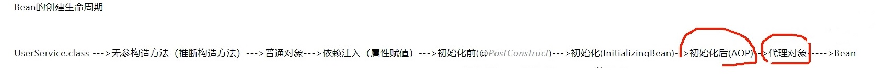
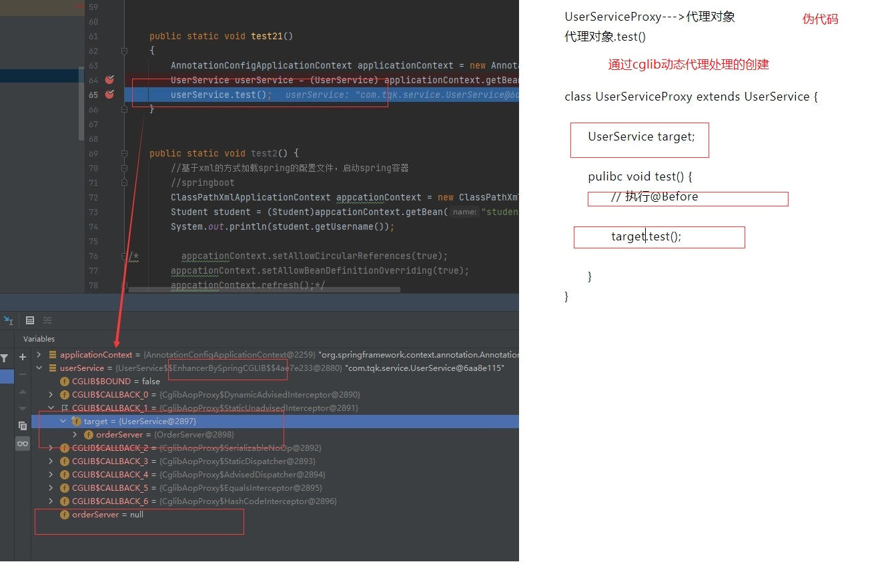

# 1. Spring底层核心原理解析
[[toc]]

:::tip Spring核心知识点
1. Bean的生命周期底层原理
2. 依赖注入底层原理
3. 初始化底层原理
4. 推断构造方法底层原理
5. AOP底层原理
6. Spring事务底层原理
:::

## 1.1 SpringIOC入门

```java
ClassPathXmlApplicationContext context = new ClassPathXmlApplicationContext("spring.xml");
UserService userService = (UserService) context.getBean("userService");
userService.test();
```

```xml
<context:component-scan base-package="com.tqk"/>
<bean id="userService" class="com.tqk.service.UserService"/>
```
1. 第一行代码，会构造一个ClassPathXmlApplicationContext对象，ClassPathXmlApplicationContext该如何理解，调用该构造方法除开会实例化得到一个对象，还会做哪些事情？
2. 第二行代码，会调用ClassPathXmlApplicationContext的getBean方法，会得到一个UserService对象，getBean()是如何实现的？返回的UserService对象和我们自己直接new的UserService对象有区别吗？
3. 第三行代码，就是简单的调用UserService的test()方法，不难理解。


————————————————————————————————————————————————

但是用ClassPathXmlApplicationContext其实已经过时了，在新版的Spring MVC和Spring Boot的底层主要用的都是AnnotationConfigApplicationContext，比如：

```java
AnnotationConfigApplicationContext context = new AnnotationConfigApplicationContext(AppConfig.class);
//ClassPathXmlApplicationContext context = new ClassPathXmlApplicationContext("spring.xml");
UserService userService = (UserService) context.getBean("userService");
userService.test();
```

```java
@ComponentScan("com.tqk")
public class AppConfig {

	@Bean
	public UserService userService(){
		return new UserService();
	}

}
```

————————————————————————————————————————————————

目前，我们基本很少直接使用上面这种方式来用Spring，而是使用Spring MVC，或者Spring Boot，但是它们都是基于上面这种方式的，都需要在内部去创建一个ApplicationContext的，只不过：
1. Spring MVC创建的是**XmlWebApplicationContext**，和ClassPathXmlApplicationContext类似，都是基于XML配置的
2. Spring Boot创建的是**AnnotationConfigApplicationContext**

—————————————————————————————————————————————————


## 1.2 Bean的创建过程

<!-- http://101.43.21.33:8888/group1/M00/00/00/CgAQBWGfAKiANvZGABjfqZExQiI371.pdf -->

<!-- fastdfs 服务器 101.43.21.33:8888 
文件目录
放置在
/var/fdfs/storage
目录下，进入storage容器，进入
/var/fdfs
目录，运行下面命令：
 /usr/bin/fdfs_upload_file /etc/fdfs/client.conf springIOC.pdf

 http://101.43.21.33:8888/group1/M00/00/00/CgAQBWGm5j-AIOFgAAMuH8Jinac005.pdf
-->

<a href="http://101.43.21.33:8888/group1/M00/00/00/CgAQBWGm5j-AIOFgAAMuH8Jinac005.pdf" text="Bean的创建过程">Bean的创建过程</a>


**Spring到底是如何来创建一个Bean的呢，这个就是Bean创建的生命周期，大致过程如下**

:::tip Bean的创建过程

1. 利用该类的构造方法来实例化得到一个对象（但是如何一个类中有多个构造方法，Spring则会进行选择，这个叫做<font color='red'><strong>推断构造方法</strong></font>）

2. 得到一个对象后，Spring会判断该对象中是否存在被@Autowired注解了的属性，把这些属性找出来并由Spring进行赋值（<font color='red'><strong>依赖注入</strong></font>）

3. 依赖注入后，Spring会判断该对象是否实现了BeanNameAware接口、BeanClassLoaderAware接口、BeanFactoryAware接口，如果实现了，就表示当前对象必须实现该接口中所定义的setBeanName()、setBeanClassLoader()、setBeanFactory()方法，那Spring就会调用这些方法并传入相应的参数（<font color='red'><strong>Aware回调</strong></font>）

4. Aware回调后，Spring会判断该对象中是否存在某个方法被@PostConstruct注解了，如果存在，Spring会调用当前对象的此方法（<font color='red'><strong>初始化前</strong></font>）

5. 紧接着Spring会判断该对象是否实现了InitializingBean接口，如果实现了，就表示当前对象必须实现该接口中的afterPropertiesSet()方法，那Spring就会调用当前对象中的afterPropertiesSet()方法(<font color='red'><strong>初始化</strong></font>）

6. 最后Spring会判断当前对象需不需要进行AOP，如果不需要那么Bean就创建完了，如果需要进行AOP，则会进行动态代理并生成一个代理对象做为Bean（<font color='red'><strong>初始化后</strong></font>）
:::

<a data-fancybox title="Bean的创建过程" href="./image/Spring02.jpg"></a>

--------------------

通过最后一步，我们可以发现，当Spring根据UserService类来创建一个Bean时：
1. 如果不用进行AOP，那么Bean就是UserService类的构造方法所得到的对象。
2. 如果需要进行AOP，那么Bean就是**UserService的代理类所实例化得到的对象**，而不是UserService本身所得到的对象。

<a data-fancybox title="AOP Bean的创建过程" href="./image/Spring03.jpg"></a>

### 1.2.2 Bean对象创建出来后

1. 如果当前Bean是单例Bean，那么会把该Bean对象存入一个Map<String, Object>，Map的<font color='red'>key为beanName，value为Bean对象</font>。这样下次getBean时就可以直接从Map中拿到对应的Bean对象了。（**实际上，在Spring源码中，这个Map就是单例池**）

2. 如果当前Bean是**原型Bean**，那么后续没有其他动作，不会存入一个Map，下次getBean时会再次执行上述创建过程，得到一个新的Bean对象。

3. 默认情况下的bean都为单例bean，即context创建的时候就已经创建，我们可以通过设置**bean的scope属性为singleton来设置bean为原型bean**，使得实例在使用的时候才去创建，而且每次创建都是不同的实例

### 1.2.3 推断构造方法

Spring在基于某个类生成Bean的过程中，需要利用该类的构造方法来实例化得到一个对象，但是<font color='red'><strong>如果一个类存在多个构造方法，Spring会使用哪个呢？</strong></font>

:::tip Spring的判断逻辑如下：
1. 如果一个类只存在一个构造方法，不管该构造方法是无参构造方法，还是有参构造方法，Spring都会用这个构造方法
2. 如果一个类存在多个构造方法
  a. 这些构造方法中，存在一个无参的构造方法，**那么Spring就会用这个无参的构造方法**
  b. 这些构造方法中，不存在一个无参的构造方法，那么Spring就会报错
  c. 这些构造方法中，不存在一个无参的构造方法，如果某个方法上添加了 @Autowried 那么Spring就会使用这个方法
:::


Spring的设计思想是这样的：
1. 如果一个类只有一个构造方法，那么没得选择，只能用这个构造方法
2. 如果一个类存在多个构造方法，Spring不知道如何选择，就会看是否有无参的构造方法，因为无参构造方法本身表示了一种默认的意义
3. 不过如果某个构造方法上加了@Autowired注解，那就表示程序员告诉Spring就用这个加了注解的方法，那Spring就会用这个加了@Autowired注解构造方法了

```java
package com.tqk.bean;

import org.springframework.stereotype.Component;

import java.math.BigDecimal;

@Component
public class OrderServer {
    private Integer ordeId=111;
    private BigDecimal money;

    public OrderServer() {
    }

    public OrderServer(Integer ordeId) {
        this.ordeId = ordeId;
    }

    public OrderServer(Integer ordeId, BigDecimal money) {
        this.ordeId = ordeId;
        this.money = money;
    }

    public Integer getOrdeId() {
        return ordeId;
    }

    public void setOrdeId(Integer ordeId) {
        this.ordeId = ordeId;
    }

    public BigDecimal getMoney() {
        return money;
    }

    public void setMoney(BigDecimal money) {
        this.money = money;
    }
}

```
需要重视的是，如果Spring选择了一个有参的构造方法，Spring在调用这个有参构造方法时，需要传入参数，那这个参数是怎么来的呢？

Spring会根据入参的类型和入参的名字去Spring中找Bean对象（以单例Bean为例，Spring会从单例池那个Map中去找）：
1. 先根据入参类型找，如果只找到一个，那就直接用来作为入参
2. 如果根据类型找到多个，则再根据入参名字来确定唯一一个
3. 最终如果没有找到，则会报错，无法创建当前Bean对象

确定用哪个构造方法，确定入参的Bean对象，这个过程就叫做**推断构造方法**

## 1.3 AOP大致流程

**AOP就是进行动态代理**，在创建一个Bean的过程中，Spring在最后一步会去判断当前正在创建的这个Bean是不是需要进行AOP，如果需要则会进行动态代理。

:::tip 如何判断当前Bean对象需不需要进行AOP:
1. 找出所有的切面Bean
2. 遍历切面中的每个方法，看是否写了@Before、@After等注解
3. 如果写了，则判断所对应的Pointcut是否和当前Bean对象的类是否匹配
4. 如果匹配则表示当前Bean对象有匹配的的Pointcut，表示需要进行AOP
:::

--------

:::tip 利用cglib进行AOP的大致流程：
1. 生成代理类UserServiceProxy，代理类继承UserService
2. 代理类中重写了父类的方法，比如UserService中的test()方法
3. 代理类中还会有一个target属性，该属性的值为被代理对象（也就是通过UserService类推断构造方法实例化出来的对象，进行了依赖注入、初始化等步骤的对象）
4. 代理类中的test()方法被执行时的逻辑如下：  
  a. 执行切面逻辑（@Before）  
  b. 调用target.test()  
:::

```java
class UserServiceProxy extends UserService{
    UserService target;
    public void test(){
        执行@Before切面程序

        target.test();
    }
}
```

当我们从Spring容器得到UserService的Bean对象时，拿到的就是UserServiceProxy所生成的对象，也就是代理对象。

**UserService代理对象.test()--->执行切面逻辑--->target.test()，注意target对象不是代理对象，而是被代理对象。**

## 1.4 Spring事务

当我们在某个方法上加了@Transactional注解后，就表示该方法在调用时会开启Spring事务，而这个方法所在的类所对应的Bean对象会是该类的代理对象

:::tip Spring事务的代理对象执行某个方法时的步骤：
1. 判断当前执行的方法是否存在@Transactional注解
2. 如果存在，则利用事务管理器（TransactionMananger）新建一个数据库连接
3. 修改数据库连接的autocommit为false
4. 执行target.test()，执行程序员所写的业务逻辑代码，也就是执行sql
5. 执行完了之后如果没有出现异常，则提交commit，否则回滚rollback
:::

Spring事务是否会失效的判断标准：<font color='red'>**某个加了@Transactional注解的方法被调用时，要判断到底是不是直接被代理对象调用的，如果是则事务会生效，如果不是则失效**</font>

```java
class MysqlServiceProxy extends MysqlService{
    MysqlService target;

    public void test(){
        //执行@Transaction 切面程序
        //利用事务管理器（TransactionMananger）新建一个数据库连接
        //修改数据库连接的conn.autocommit为false

        target.test();//执行jdbcTemplate SQL语句

        //conn.commit()
        //conn.rollback()
    }
}
```

## 1.4 @Configuration()作用


**确保 transactionManager jdbcTemplate 拿到的是同一个数据库连接**
```java
package com.tqk.config;

import org.apache.ibatis.session.SqlSessionFactory;
import org.mybatis.spring.SqlSessionFactoryBean;
import org.springframework.context.annotation.Bean;
import org.springframework.context.annotation.ComponentScan;
import org.springframework.context.annotation.Configuration;
import org.springframework.context.annotation.EnableAspectJAutoProxy;
import org.springframework.jdbc.core.JdbcTemplate;
import org.springframework.jdbc.datasource.DataSourceTransactionManager;
import org.springframework.jdbc.datasource.DriverManagerDataSource;
import org.springframework.transaction.PlatformTransactionManager;

import javax.sql.DataSource;


@EnableAspectJAutoProxy
@ComponentScan("com.tqk")
@Configuration()
public class MainConfig {
    @Bean
    public JdbcTemplate jdbcTemplate() {
        return new JdbcTemplate(dataSource());
    }


    @Bean
    public PlatformTransactionManager transactionManager() {
        DataSourceTransactionManager transactionManager = new DataSourceTransactionManager();
        transactionManager.setDataSource(dataSource());
        return transactionManager;
    }


    @Bean
    public DataSource dataSource() {
        DriverManagerDataSource dataSource = new DriverManagerDataSource();
        dataSource.setUrl("jdbc:mysql://49.233.34.168:6699/spring?useUnicode=true&characterEncoding=utf8&allowMultiQueries=true");
        dataSource.setUsername("root");
        dataSource.setPassword("12345@tqk");
        return dataSource;
    }


    @Bean
    public SqlSessionFactory sqlSessionFactory() throws Exception {
        SqlSessionFactoryBean sessionFactoryBean = new SqlSessionFactoryBean();
        sessionFactoryBean.setDataSource(dataSource());
        return sessionFactoryBean.getObject();
    }
}
```
