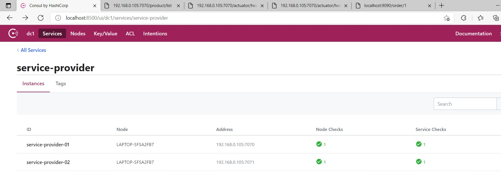
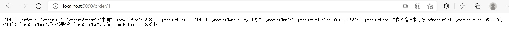

# 3. Consul使用

## 3.0 父项目

```xml
<?xml version="1.0" encoding="UTF-8"?>
<project xmlns="http://maven.apache.org/POM/4.0.0"
         xmlns:xsi="http://www.w3.org/2001/XMLSchema-instance"
         xsi:schemaLocation="http://maven.apache.org/POM/4.0.0 http://maven.apache.org/xsd/maven-4.0.0.xsd">
    <modelVersion>4.0.0</modelVersion>

    <groupId>org.example</groupId>
    <artifactId>Consul</artifactId>
    <version>1.0-SNAPSHOT</version>

    <!-- 继承 spring-boot-starter-parent 依赖 -->
    <!-- 使用继承方式，实现复用，符合继承的都可以被使用 -->
    <parent>
        <groupId>org.springframework.boot</groupId>
        <artifactId>spring-boot-starter-parent</artifactId>
        <version>2.2.4.RELEASE</version>
    </parent>
    <modules>
        <module>service-provider</module>
        <module>service-consumer</module>
        <module>service-provider02</module>
    </modules>
    <!--
        集中定义依赖组件版本号，但不引入，
        在子工程中用到声明的依赖时，可以不加依赖的版本号，
        这样可以统一管理工程中用到的依赖版本
     -->
    <properties>
        <!-- Spring Cloud Hoxton.SR1 依赖 -->
        <spring-cloud.version>Hoxton.SR1</spring-cloud.version>
    </properties>

    <!-- 项目依赖管理 父项目只是声明依赖，子项目需要写明需要的依赖(可以省略版本信息) -->
    <dependencyManagement>
        <dependencies>
            <!-- spring cloud 依赖 -->
            <dependency>
                <groupId>org.springframework.cloud</groupId>
                <artifactId>spring-cloud-dependencies</artifactId>
                <version>${spring-cloud.version}</version>
                <type>pom</type>
                <scope>import</scope>
            </dependency>
        </dependencies>
    </dependencyManagement>

</project>
```


## 3.1 服务端

### 3.1.1 Maven依赖
```xml
<?xml version="1.0" encoding="UTF-8"?>

<project xmlns="http://maven.apache.org/POM/4.0.0" xmlns:xsi="http://www.w3.org/2001/XMLSchema-instance"
         xsi:schemaLocation="http://maven.apache.org/POM/4.0.0 http://maven.apache.org/xsd/maven-4.0.0.xsd">
    <modelVersion>4.0.0</modelVersion>

    <groupId>com.xxxx</groupId>
    <artifactId>service-provider</artifactId>
    <version>1.0-SNAPSHOT</version>

    <!-- 继承父依赖 -->
    <parent>
        <groupId>org.example</groupId>
        <artifactId>Consul</artifactId>
        <version>1.0-SNAPSHOT</version>
    </parent>

    <!-- 项目依赖 -->
    <dependencies>
        <!-- spring cloud consul 依赖 -->
        <dependency>
            <groupId>org.springframework.cloud</groupId>
            <artifactId>spring-cloud-starter-consul-discovery</artifactId>
        </dependency>
        <!-- spring boot actuator 依赖 -->
        <dependency>
            <groupId>org.springframework.boot</groupId>
            <artifactId>spring-boot-starter-actuator</artifactId>
        </dependency>
        <!-- spring boot web 依赖 -->
        <dependency>
            <groupId>org.springframework.boot</groupId>
            <artifactId>spring-boot-starter-web</artifactId>
        </dependency>
        <!-- lombok 依赖 -->
        <dependency>
            <groupId>org.projectlombok</groupId>
            <artifactId>lombok</artifactId>
            <scope>provided</scope>
        </dependency>

        <!-- spring boot test 依赖 -->
        <dependency>
            <groupId>org.springframework.boot</groupId>
            <artifactId>spring-boot-starter-test</artifactId>
            <scope>test</scope>
            <exclusions>
                <exclusion>
                    <groupId>org.junit.vintage</groupId>
                    <artifactId>junit-vintage-engine</artifactId>
                </exclusion>
            </exclusions>
        </dependency>
    </dependencies>

</project>

```
_______


### 3.1.2 配置文件
```yml
server:
  port: 7070 # 端口

spring:
  application:
    name: service-provider # 应用名称
  # 配置 Consul 注册中心
  cloud:
    consul:
      # 注册中心的访问地址
      host: 192.168.0.105
      port: 8500
      # 服务提供者信息
      discovery:
        register: true                                # 是否需要注册
        instance-id: ${spring.application.name}-01    # 注册实例 id（必须唯一）
        service-name: ${spring.application.name}      # 服务名称
        port: ${server.port}                          # 服务端口
        prefer-ip-address: true                       # 是否使用 ip 地址注册
        ip-address: ${spring.cloud.client.ip-address} # 服务请求 ip

# 度量指标监控与健康检查
management:
  endpoints:
    web:
      exposure:
        # 打开所有访问节点 除了 shutdown；需要打开shutdown，还需要配置线变得信息
        include: '*'
  endpoint:
    shutdown:
      enabled: true               # 开启 shutdown 实现优雅停服
    health:
      show-details: always
```
_______


### 3.1.3 服务启动后

<a data-fancybox title=" 服务启动后" href="./image/consul05.jpg"></a>

## 3.2 客户端

### 3.2.1 Maven依赖
```xml
<?xml version="1.0" encoding="UTF-8"?>

<project xmlns="http://maven.apache.org/POM/4.0.0" xmlns:xsi="http://www.w3.org/2001/XMLSchema-instance"
         xsi:schemaLocation="http://maven.apache.org/POM/4.0.0 http://maven.apache.org/xsd/maven-4.0.0.xsd">
    <modelVersion>4.0.0</modelVersion>

    <groupId>com.xxxx</groupId>
    <artifactId>service-consumer</artifactId>
    <version>1.0-SNAPSHOT</version>

    <!-- 继承父依赖 -->
    <parent>
        <groupId>org.example</groupId>
        <artifactId>Consul</artifactId>
        <version>1.0-SNAPSHOT</version>
    </parent>

    <!-- 项目依赖 -->
    <dependencies>
        <!-- spring cloud consul 依赖 -->
        <dependency>
            <groupId>org.springframework.cloud</groupId>
            <artifactId>spring-cloud-starter-consul-discovery</artifactId>
        </dependency>
        <!-- spring boot actuator 依赖 -->
        <dependency>
            <groupId>org.springframework.boot</groupId>
            <artifactId>spring-boot-starter-actuator</artifactId>
        </dependency>
        <!-- spring boot web 依赖 -->
        <dependency>
            <groupId>org.springframework.boot</groupId>
            <artifactId>spring-boot-starter-web</artifactId>
        </dependency>
        <!-- lombok 依赖 -->
        <dependency>
            <groupId>org.projectlombok</groupId>
            <artifactId>lombok</artifactId>
            <scope>provided</scope>
        </dependency>

        <!-- spring boot test 依赖 -->
        <dependency>
            <groupId>org.springframework.boot</groupId>
            <artifactId>spring-boot-starter-test</artifactId>
            <scope>test</scope>
            <exclusions>
                <exclusion>
                    <groupId>org.junit.vintage</groupId>
                    <artifactId>junit-vintage-engine</artifactId>
                </exclusion>
            </exclusions>
        </dependency>
    </dependencies>

</project>

```
_______


### 3.2.2 配置文件
```yml
server:
  port: 9090 # 端口

spring:
  application:
    name: service-consumer # 应用名称
  # 配置 Consul 注册中心
  cloud:
    consul:
      # 注册中心的访问地址
      host: 192.168.0.105
      port: 8500
      # 服务提供者信息
      discovery:
        register: false                                # 是否需要注册
        instance-id: ${spring.application.name}-01    # 注册实例 id（必须唯一）
        service-name: ${spring.application.name}      # 服务名称
        port: ${server.port}                          # 服务端口
        prefer-ip-address: true                       # 是否使用 ip 地址注册
        ip-address: ${spring.cloud.client.ip-address} # 服务请求 ip
```
_______


### 3.2.3 客户端访问

<a data-fancybox title=" 客户端访问" href="./image/consul06.jpg"></a>
