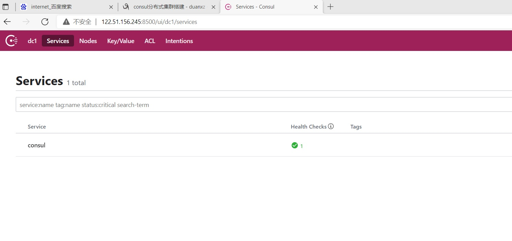
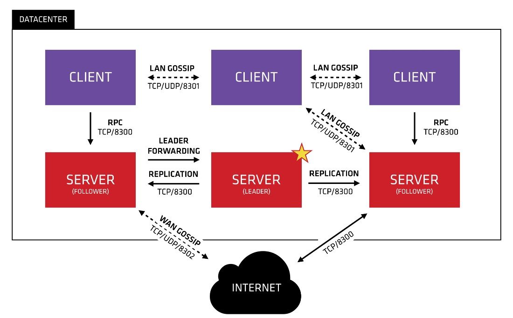

# 2. Consul环境搭建

**注意：搭建是注意网络访问关系，是否在一个网段，网络是否联通**

## 2.1 单机版--开发使用
```sh
# 创建 consul 目录
mkdir -p /usr/local/consul 
# 解压至 consul 目录
unzip consul_1.7.0_linux_amd64.zip -d /usr/local/consul/ 
# 创建 consul 数据目录
mkdir -p /usr/local/consul/data
# 启动
nohup /usr/local/consul/consul agent -dev -client=0.0.0.0 &

```

访问管理后台：http://122.51.156.245:8500/ 看到下图意味着我们的 Consul 服务启动成功了

<a data-fancybox title="Consul 单机版" href="./image/consul04.jpg"></a>

## 2.2 集群版-非docker版

<a data-fancybox title="Consul 角色" href="./image/consul03.jpg"></a>

上图是一个简单的 Consul Cluster 架构，Consul Cluster 有 Server 和 Client 两种角色。不管是 Server 还是
Client，统称为 Agent，Consul Client 是相对无状态的，只负责转发 RPC 到 Server 资源开销很少。Server 是一个有
一组扩展功能的代理，这些功能包括参与 Raft 选举，维护集群状态，响应 RPC 查询，与其他数据中心交互 WAN
Gossip 和转发查询给 leader 或者远程数据中心。

每个数据中心，Client 和 Server 是混合的。一般建议有 3~5 台 Server。这是基于有故障情况下的可用性和性能
之间的权衡结果，因为越多的机器加入达成共识越慢，Server 之间会选举出一个 Leader。然而并不限制 Client 的数
量，一般建议一个服务对应一个 Client，它们可以很容易的扩展到数千或者数万台 。在开发时我们绑定一组服务注
册中心中的客户端即可。

### 2.2.1 上传安装包

```sh
# 创建 consul 目录
mkdir -p /usr/local/consul 
# 解压至 consul 目录
unzip consul_1.7.0_linux_amd64.zip -d /usr/local/consul/ 
# 创建 consul 数据目录
mkdir -p /usr/local/consul/data
```
### 2.2.2 服务启动

**提前必须在一个网段中，公网搭建，网络不通**

```sh

# 以 server 服务模式运行三台注册中心。
# node-01 1.117.13.88
/usr/local/consul/consul agent -server -bind=172.17.0.8 -client=0.0.0.0 -ui -bootstrap-expect=3 -data-dir=/usr/local/consul/data/ -node=server-01
# node-02 101.43.21.33
/usr/local/consul/consul agent -server -bind=172.17.0.1 -client=0.0.0.0 -ui -bootstrap-expect=3 -data-dir=/usr/local/consul/data/ -node=server-02
# node-03 122.51.156.245
/usr/local/consul/consul agent -server -bind= 172.18.0.1 -client=0.0.0.0 -ui -bootstrap-expect=3 -data-dir=/usr/local/consul/data/ -node=server-03


#注册中心客户端 一台为例
consul agent -client=0.0.0.0 -bind=192.168.10.1 -data-dir=/usr/local/consul/data/  -node=client-01

# 加入集群
./consul join 172.17.0.8
./consul join 172.17.0.8
./consul join 172.17.0.8
```

:::tip 参数含义如下：
1. -server ：以服务端身份启动（注册中心）
2. -bind ：表示绑定到哪个 ip
3. -client ：指定客户端访问的 ip，0.0.0.0 表示不限客户端 ip
4. -ui ：开启 web 界面访问
5. -bootstrap-expect=3 ：表示 server 集群最低节点数为 3，低于这个值将工作不正常（注：类似 ZooKeeper
一样，通常集群数为奇数方便选举，Consul 采用的是 Raft 算法）
6. -data-dir ：表示指定数据的存放目录（该目录必须存在，需提前创建好）
7. -node ：表示节点在 web ui 中显示的名称
:::
