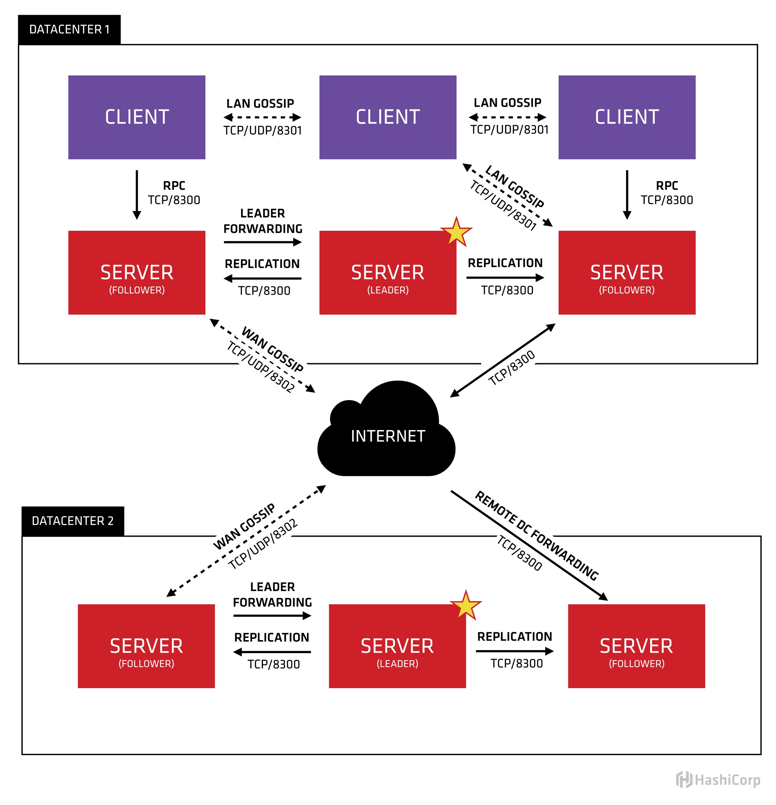
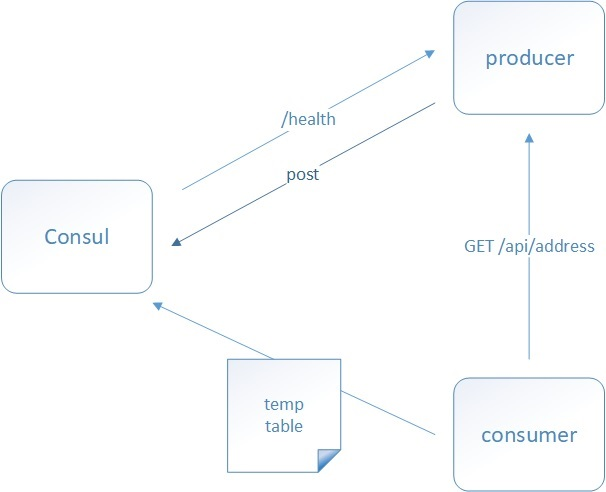

# 1. Consul简介

Consul 是 HashiCorp 公司推出的开源工具，用于实现分布式系统的服务发现与配置。与其它分布式服务注册与
发现的方案，Consul 的方案更“一站式”，内置了服务注册与发现框架、分布一致性协议实现、健康检查、Key/Value
存储、多数据中心方案，不再需要依赖其它工具（比如 ZooKeeper 等），使用起来也较为简单。

Consul 使用 Go 语言编写，因此具有天然可移植性（支持Linux、Windows 和 Mac OS）；安装包仅包含一个可
执行文件，方便部署，与 Docker 等轻量级容器可无缝配合。

## 1.1 Consul功能特性

:::tip Consul功能特性
1. Raft 算法
2. 服务发现
3. 健康检查
4. Key/Value 存储
5. 多数据中心
6. 支持 http 和 dns 协议接口
7. 官方提供 web 管理界面
:::

### 1.1.1 Consul 角色

1. **client：客户端**，无状态，将 HTTP 和 DNS 接口请求转发给局域网内的服务端集群。

2. **server：服务端**，保存配置信息，高可用集群，每个数据中心的 server 数量推荐为 3 个或者 5 个。

### 1.1.2 Consul 工作原理

#### 服务发现以及注册

当服务 Producer 启动时，会将自己的 Ip/host 等信息通过发送请求告知 Consul，Consul 接收到 Producer 的
注册信息后，每隔 10s（默认）会向 Producer 发送一个健康检查的请求，检验 Producer 是否健康。

#### 服务调用

当 Consumer 请求 Product 时，会先从 Consul 中拿到存储 Product 服务的 IP 和 Port 的临时表(temp table)， 从temp table 表中任选一个· Producer 的 IP 和 Port， 然后根据这个 IP 和 Port，发送问请求；temp table 表只
包含通过了健康检查的 Producer 信息，并且每隔 10s（默认）更新。