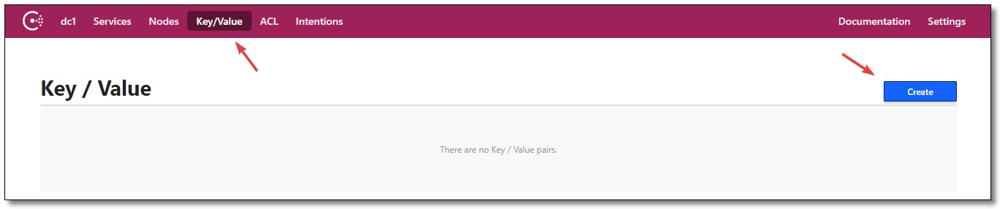
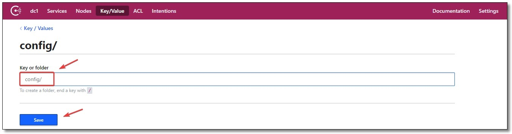
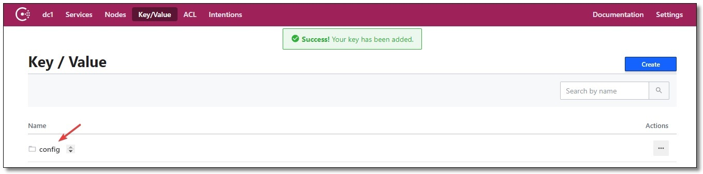
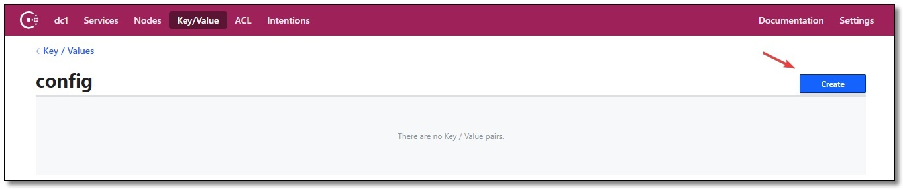
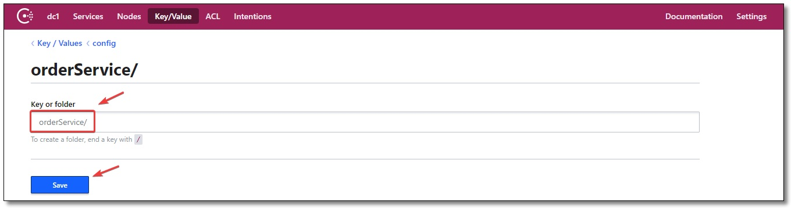
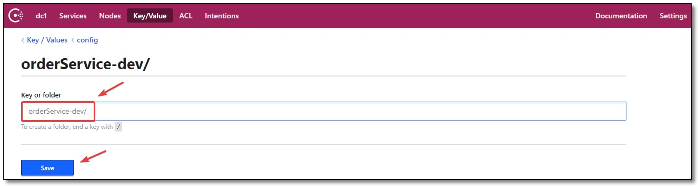
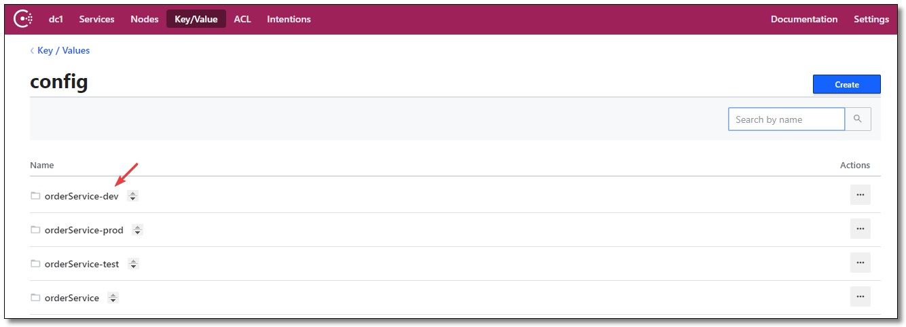
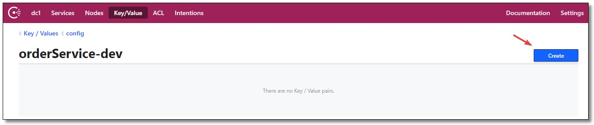
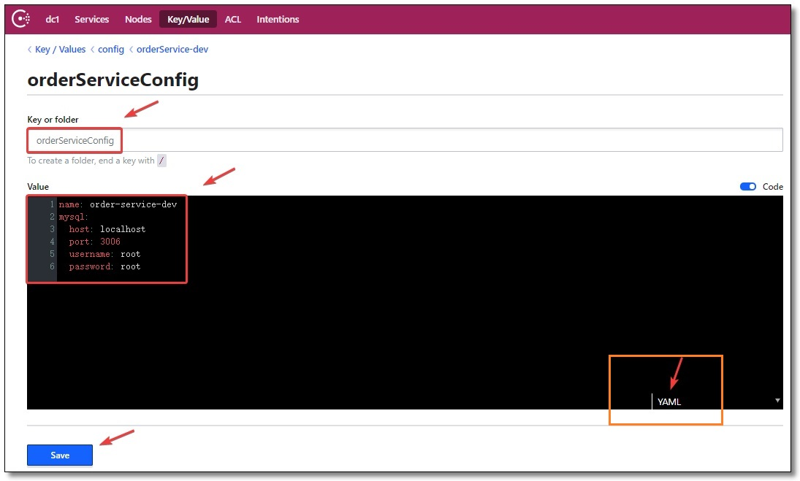

# 4. Consul配置中心

## 4.1 初始化配置

### 4.1.1 创建基本目录

使用 Consul 作为配置中心，第一步我们先创建目录，把配置信息存储至 Consul。
点击菜单 Key/Value 再点击 Create 按钮。
<a data-fancybox title=" Consul配置中心" href="./image/consul10.jpg"></a>

创建 config/ 基本目录，可以理解为配置文件所在的**最外层文件夹**

<a data-fancybox title=" Consul配置中心" href="./image/consul11.jpg"></a>

### 4.1.2 创建应用目录

点击 config 进入文件夹。
<a data-fancybox title=" Consul配置中心" href="./image/consul12.jpg"></a>

再点击 Create 按钮。

<a data-fancybox title=" Consul配置中心" href="./image/consul13.jpg"></a>

创建 orderService/ 应用目录，存储对应微服务应用的 default 环境配置信息。

<a data-fancybox title=" Consul配置中心" href="./image/consul14.jpg"></a>

### 4.1.3 多环境应用目录

假设我们的项目有多环境： default 、 test 、 dev 、 prod ，在 config 目录下创建多环境目录。

1. orderService 文件夹对应 default 环境
2. orderService-test 文件夹对应 test 环境
3. orderService-dev 文件夹对应 dev 环境
4. orderService-prod 文件夹对应 prod 环境

<a data-fancybox title=" Consul配置中心" href="./image/consul15.jpg"></a>

### 4.1.4 初始化配置

以 dev 环境为例，点击 orderService-dev 进入文件夹。
<a data-fancybox title=" Consul配置中心" href="./image/consul16.jpg"></a>

点击 Create 按钮准备创建 Key/Value 配置信息
<a data-fancybox title=" Consul配置中心" href="./image/consul17.jpg"></a>

填写 Key： orderServiceConfig
填写 Value：
<a data-fancybox title=" Consul配置中心" href="./image/consul18.jpg"></a>

假设以上内容为订单微服务的配置信息，下面我们通过案例来加载 Consul 配置中心中的配置信息。

## 4.2 实战测试案例

consul 聚合工程。 SpringBoot 2.2.4.RELEASE 、 Spring Cloud Hoxton.SR1 。
order-service-config ：订单服务
order-service02-config ：订单服务

### 4.2.1 添加依赖

```xml
<?xml version="1.0" encoding="UTF-8"?>

<project xmlns="http://maven.apache.org/POM/4.0.0" xmlns:xsi="http://www.w3.org/2001/XMLSchema-instance"
         xsi:schemaLocation="http://maven.apache.org/POM/4.0.0 http://maven.apache.org/xsd/maven-4.0.0.xsd">
    <modelVersion>4.0.0</modelVersion>

    <groupId>com.example</groupId>
    <artifactId>order-service</artifactId>
    <version>1.0-SNAPSHOT</version>

    <!-- 继承父依赖 -->
    <!-- 继承父依赖 -->
    <parent>
        <groupId>org.example</groupId>
        <artifactId>Consul</artifactId>
        <version>1.0-SNAPSHOT</version>
    </parent>

    <!-- 项目依赖 -->
    <dependencies>
        <!-- spring boot web 依赖 -->
        <dependency>
            <groupId>org.springframework.boot</groupId>
            <artifactId>spring-boot-starter-web</artifactId>
        </dependency>
        <!-- spring boot actuator 依赖 -->
        <dependency>
            <groupId>org.springframework.boot</groupId>
            <artifactId>spring-boot-starter-actuator</artifactId>
        </dependency>
        <!-- spring cloud consul discovery 服务发现依赖 -->
        <dependency>
            <groupId>org.springframework.cloud</groupId>
            <artifactId>spring-cloud-starter-consul-discovery</artifactId>
        </dependency>
        <!-- spring cloud consul config 配置中心依赖 -->
        <dependency>
            <groupId>org.springframework.cloud</groupId>
            <artifactId>spring-cloud-starter-consul-config</artifactId>
        </dependency>

        <!-- spring boot test 依赖 -->
        <dependency>
            <groupId>org.springframework.boot</groupId>
            <artifactId>spring-boot-starter-test</artifactId>
            <scope>test</scope>
            <exclusions>
                <exclusion>
                    <groupId>org.junit.vintage</groupId>
                    <artifactId>junit-vintage-engine</artifactId>
                </exclusion>
            </exclusions>
        </dependency>
    </dependencies>

</project>

```

### 4.2.2 配置文件
老规矩，配置文件必须叫 bootstrap.yml 我们除了使用 Consul 配置中心功能之外，把微服务也注册到
Consul 注册中心去。 order-service 和 order-service02 的配置项中除了端口和注册实例 id 之外，其余配置项
一致，完整配置如下

```yml
server:
  port: 9090 # 端口

spring:
  application:
    name: order-service # 应用名称
  profiles:
    active: dev # 指定环境，默认加载 default 环境
  cloud:
    consul:
      # Consul 服务器地址
      host: localhost
      port: 8500
      # 配置中心相关配置
      config:
        # 是否启用配置中心，默认值 true 开启
        enabled: true
        # 设置配置的基本文件夹，默认值 config 可以理解为配置文件所在的最外层文件夹
        prefix: config
        # 设置应用的文件夹名称，默认值 application 一般建议设置为微服务应用名称
        default-context: orderService
        # 配置环境分隔符，默认值 "," 和 default-context 配置项搭配
        # 例如应用 orderService 分别有环境 default、dev、test、prod
        # 只需在 config 文件夹下创建 orderService、orderService-dev、orderService-test、orderService-prod 文件夹即可
        profile-separator: '-'
        # 指定配置格式为 yaml
        format: YAML
        # Consul 的 Key/Values 中的 Key，Value 对应整个配置文件
        data-key: orderServiceConfig
        # 以上配置可以理解为：加载 config/orderService/ 文件夹下 Key 为 orderServiceConfig 的 Value 对应的配置信息
        watch:
          # 是否开启自动刷新，默认值 true 开启
          enabled: true
          # 刷新频率，单位：毫秒，默认值 1000
          delay: 1000
      # 服务发现相关配置
      discovery:
        register: true                                # 是否需要注册
        instance-id: ${spring.application.name}-01    # 注册实例 id（必须唯一）
        service-name: ${spring.application.name}      # 服务名称
        port: ${server.port}                          # 服务端口
        prefer-ip-address: true                       # 是否使用 ip 地址注册
        ip-address: ${spring.cloud.client.ip-address} # 服务请求 ip
```

### 4.2.3 配置文件实体类

```java
package com.example.config;

import org.springframework.boot.context.properties.ConfigurationProperties;
import org.springframework.stereotype.Component;

@Component
@ConfigurationProperties(prefix = "mysql")
public class MySQLProperties {

    private String host;
    private Integer port;
    private String username;
    private String password;

    public String getHost() {
        return host;
    }

    public void setHost(String host) {
        this.host = host;
    }

    public Integer getPort() {
        return port;
    }

    public void setPort(Integer port) {
        this.port = port;
    }

    public String getUsername() {
        return username;
    }

    public void setUsername(String username) {
        this.username = username;
    }

    public String getPassword() {
        return password;
    }

    public void setPassword(String password) {
        this.password = password;
    }

}
```
### 4.2.4 控制层

**注意需要添加 @RefreshScope 注解用于重新刷新作用域实现属性值自动刷新**

```java
package com.example.controller;

import com.example.config.MySQLProperties;
import org.springframework.beans.factory.annotation.Autowired;
import org.springframework.beans.factory.annotation.Value;
import org.springframework.cloud.context.config.annotation.RefreshScope;
import org.springframework.web.bind.annotation.GetMapping;
import org.springframework.web.bind.annotation.RestController;

@RefreshScope
@RestController
public class ConfigController {

    @Autowired
    private MySQLProperties mySQLProperties;

    @Value("${name}")
    private String name;

    @GetMapping("/name")
    public String getName() {
        return name;
    }

    @GetMapping("/mysql")
    public MySQLProperties getMySQLProperties() {
        return mySQLProperties;
    }

}
```
### 4.2.5 启动类

```java
package com.example;

import org.springframework.boot.SpringApplication;
import org.springframework.boot.autoconfigure.SpringBootApplication;

@SpringBootApplication
public class OrderServiceApplication {

    public static void main(String[] args) {
        SpringApplication.run(OrderServiceApplication.class, args);
    }

}
```
### 4.2.6 测试

[http://localhost:9912/mysql]
```json
{"host":"localhost","port":3306,"username":"root","password":"root"}
```

------------------------

[http://localhost:9912/name]
```string
order-service-dev
```
#### 动态刷新测试
控制台修改为[order-service-dev-tqk]，然后再次访问

```string
order-service-dev-tqk
```
