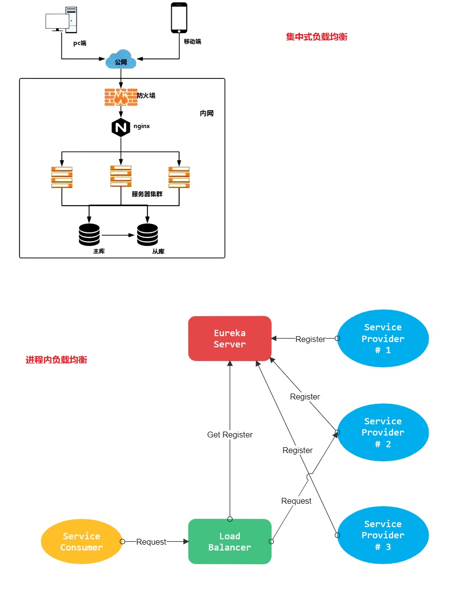

# 3. Eureka整合Ribbon

## 3.1 什么是 Ribbon

Ribbon 是一个基于 HTTP 和 TCP 的 **客服端负载均衡工具**，它是基于 Netflix Ribbon 实现的。

它不像 Spring Cloud 服务注册中心、配置中心、API 网关那样独立部署，但是它几乎存在于每个 Spring Cloud微服务中。包括 Feign 提供的声明式服务调用也是基于该 Ribbon 实现的。
 
Ribbon 默认提供很多种负载均衡算法，例如**轮询、随机**等等。甚至包含自定义的负载均衡算法。

## 3.2 负载均衡不同方案的区别

目前业界主流的负载均衡方案可分成两类：

1. **集中式负载均衡(服务器负载均衡)**，即在 consumer 和 provider 之间使用独立的负载均衡设施(可以是硬
件，如 F5，也可以是软件，如 nginx)，由该设施负责把访问请求通过某种策略转发至 provider；

2. **进程内负载均衡(客户端负载均衡)**，将负载均衡逻辑集成到 consumer，consumer 从服务注册中心获知有
哪些地址可用，然后自己再从这些地址中选择出一个合适的 provider。Ribbon 属于后者，它只是一个类库，集
成于 consumer 进程，consumer 通过它来获取 provider 的地址。

<a data-fancybox title="负载均衡" href="./image/eureka09.jpg"></a>

## 3.3 Ribbon 负载均衡策略


### 3.3.1 轮询策略（默认）
 策略对应类名： RoundRobinRule

 实现原理：轮询策略表示每次都顺序取下一个 provider，比如一共有 5 个 provider，第 1 次取第 1 个，第 2 次
取第 2 个，第 3 次取第 3 个，以此类推。

### 3.3.2 权重轮询策略
**策略对应类名**： WeightedResponseTimeRule

**实现原理：**
根据每个 provider 的响应时间分配一个权重，响应时间越长，权重越小，被选中的可能性越低。
原理：一开始为轮询策略，并开启一个计时器，每 30 秒收集一次每个 provider 的平均响应时间，当信息足够
时，给每个 provider 附上一个权重，并按权重随机选择 provider，高权越重的 provider 会被高概率选中。
### 3.3.3 随机策略
**策略对应类名**： RandomRule

**实现原理**：从 provider 列表中随机选择一个。


### 3.3.4 最少并发数策略
**策略对应类名**： BestAvailableRule

**实现原理**：选择正在请求中的并发数最小的 provider，除非这个 provider 在熔断中。

### 3.3.5 重试策略
**策略对应类名**： RetryRule

**实现原理**：其实就是轮询策略的增强版，轮询策略服务不可用时不做处理，重试策略服务不可用时会重新尝试集
群中的其他节点。

### 3.3.6 可用性敏感策略

**策略对应类名**： AvailabilityFilteringRule

**实现原理**：过滤性能差的 provider
第一种：过滤掉在 Eureka 中处于一直连接失败的 provider。
第二种：过滤掉高并发（繁忙）的 provider。

### 3.3.7 区域敏感性策略

**策略对应类名**： ZoneAvoidanceRule

**实现原理**：
以一个区域为单位考察可用性，对于不可用的区域整个丢弃，从剩下区域中选可用的 provider。
如果这个 ip 区域内有一个或多个实例不可达或响应变慢，都会降低该 ip 区域内其他 ip 被选中的权重。


## 3.4 Ribbon 负载均衡策略设置


**Ribbon不需要额外引入其他依赖，只在消费者配置处理**

### 3.4.1 全局设置
**在启动类或配置类中注入负载均衡策略对象。所有服务请求均使用该策略。**

```java
@Bean
public RandomRule randomRule() {
    return new RandomRule();
}
```

### 3.4.2 局部设置

**修改配置文件指定服务的负载均衡策略。格式： 服务应用名.ribbon.NFLoadBalancerRuleClassName**

```yml
# 负载均衡策略
# service-provider 为调用的服务的名称
service-provider:
 ribbon:
   NFLoadBalancerRuleClassName: com.netflix.loadbalancer.RandomRule
```


## 3.5 Ribbon 点对点直连

点对点直连是指绕过注册中心，直接连接服务提供者获取服务，一般在测试阶段使用比较多

### 添加依赖
 在 pom 文件中引入 Ribbon，需要注意的是如果 pom 中有 Eureka 的依赖，则需要去除 Eureka 的依赖。
```xml
<!-- netflix ribbon 依赖 -->
<dependency>
    <groupId>org.springframework.cloud</groupId>
    <artifactId>spring-cloud-starter-netflix-ribbon</artifactId>
</dependency>
```

### 配置文件
 配置文件中关闭 Eureka，添加直连的服务地址。如果不设置负载均衡策略默认使用轮询策略。
```yml
# 负载均衡策略
# service-provider 为调用的服务的名称
service-provider:
 ribbon:
   NFLoadBalancerRuleClassName: com.netflix.loadbalancer.RandomRule
    # 指定具体的 Provider 服务列表，多个用逗号隔开
   listOfServers: http://localhost:7070,http://localhost:7071
# 关闭 Eureka 实现 Ribbon 点对点直连
ribbon:
 eureka:
   enabled: false # false：关闭，true：开启
```

### 访问
 关闭 Eureka 注册中心，服务提供者由于无法连接至注册中心所以会报连接异常。但是服务是可以正常可消费
的，所以目前使用的是点对点的方式来进行调用的。