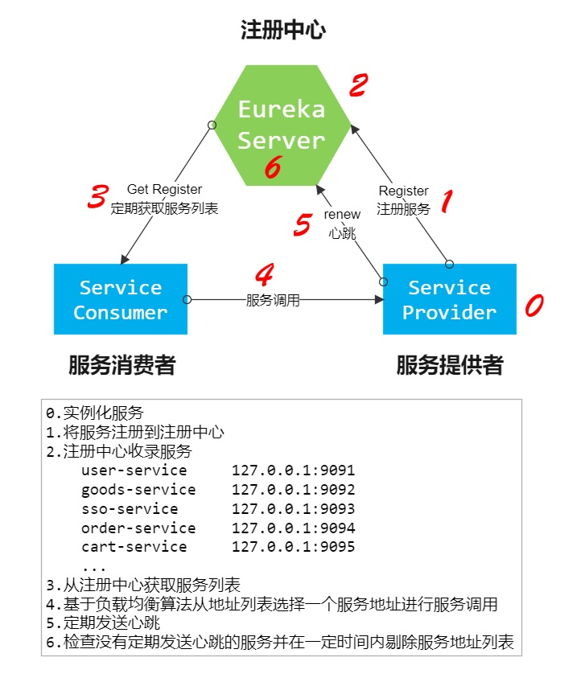

# 1.Eureka简介

注册中心可以说是微服务架构中的“通讯录”，它记录了服务和服务地址的映射关系。在分布式架构中，服务会注册到这里，当服务需要调用其它服务时，就到这里找到服务的地址，进行调用。

**服务注册中心的作用就是服务注册与发现**

**注册中心解决的主要问题：**  
1. 服务管理
2. 服务的依赖关系管理

## 1.1 常见的注册中心对比

## 1.2 为什么需要注册中心

了解了什么是注册中心，那么我们继续谈谈，为什么需要注册中心。在分布式系统中，我们不仅仅是需要在注册中心找到服务和服务地址的映射关系这么简单，我们还需要考虑更多更复杂的问题：
1. 服务注册后，如何被及时发现
2. 服务宕机后，如何及时下线
3. 服务如何有效的水平扩展
4. 服务发现时，如何进行路由
5. 服务异常时，如何进行降级
6. 注册中心如何实现自身的高可用

## 1.3 Eureka 注册中心

Eureka 是 Netflix 开发的服务发现组件，本身是一个基于 **REST 的服务**。Spring Cloud 将它集成在其子项目
Spring Cloud Netflix 中，**实现 Spring Cloud 的服务注册与发现，同时还提供了负载均衡、故障转移等能力**

### 1.3.1 Eureka 注册中心三种角色

:::tip 注册中心角色
1. **Eureka Server**  通过 Register、Get、Renew 等接口提供服务的注册和发现。
2. **Application Service（Service Provider）**  服务提供方，把自身的服务实例注册到 Eureka Server 中。
3. **Application Client（Service Consumer）**   服务调用方，通过 Eureka Server 获取服务列表，消费服务
:::

