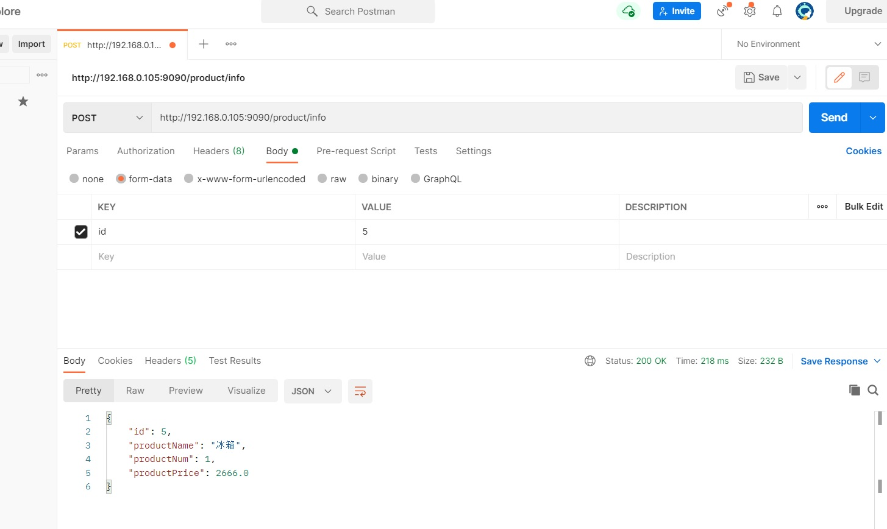

# 2. Feign使用

:::tip Feign的使用步骤
1. 服务消费者添加 Feign 依赖；
2. 创建业务层接口，添加 @FeignClient 注解声明需要调用的服务；
3. 业务层抽象方法使用 SpringMVC 注解配置服务地址及参数；
4. 启动类添加 @EnableFeignClients 注解激活 Feign 组件。
:::

**注册中心以及生产者不用动**

## 2.1 消费者

### 2.1.1 添加依赖

原有基础上添加

```xml
    <!-- spring cloud openfeign 依赖 -->
    <dependency>
        <groupId>org.springframework.cloud</groupId>
        <artifactId>spring-cloud-starter-openfeign</artifactId>
    </dependency>
```
### 2.1.2 启动类

```java
// 开启 FeignClients 注解
@EnableFeignClients
```

```java
package com.tqk;

import com.netflix.loadbalancer.RandomRule;
import feign.Logger;
import org.springframework.boot.SpringApplication;
import org.springframework.boot.autoconfigure.SpringBootApplication;
import org.springframework.cloud.netflix.eureka.EnableEurekaClient;
import org.springframework.cloud.openfeign.EnableFeignClients;
import org.springframework.context.annotation.Bean;

@SpringBootApplication
// 开启 EurekaClient 注解，目前版本如果配置了 Eureka 注册中心，默认会开启该注解
@EnableEurekaClient
// 开启 FeignClients 注解
@EnableFeignClients
public class ServiceConsumerApplication {
    public static void main(String[] args) {
        SpringApplication.run(ServiceConsumerApplication.class, args);
    }

}
```

### 2.1.3 消费服务

```java
package com.tqk.service;
import com.tqk.pojo.Product;
import org.springframework.cloud.openfeign.FeignClient;
import org.springframework.web.bind.annotation.GetMapping;
import org.springframework.web.bind.annotation.PathVariable;
import org.springframework.web.bind.annotation.PostMapping;

import java.util.List;
import java.util.Map;

// 声明需要调用的服务
@FeignClient("service-provider")
public interface ProductService {

    /**
     * 查询商品列表
     *
     * @return
     */
    // 配置需要调用的服务地址及参数
    @GetMapping("/product/list")
    List<Product> selectProductList();

    /**
     * 根据主键查询商品
     *
     * @return
     */
    @GetMapping("/product/{id}")
    Product selectProductById(@PathVariable("id") Integer id);

    /**
     * 根据主键查询商品
     *
     * @param id
     * @return
     */
    @PostMapping("/product/single")
    Product queryProductById(Integer id);

    /**
     * 新增商品
     *
     * @param user
     * @return
     */
    @PostMapping("/product/save")
    Map<Object, Object> createProduct(Product user);

    /**
     * 接收商品对象参数
     *
     * @param product
     * @return
     */
    @GetMapping("/product/pojo")
    Product selectProductByPojo(Product product);

}
```
http://localhost:9090/order/1

<a data-fancybox title=" Feign" href="./image/Feign01.jpg"></a>

——————————————————————————————————————————————

### 2.1.4 Feign 负载均衡

Feign 封装了 Ribbon 自然也就集成了负载均衡的功能，默认采用轮询策略。如何修改负载均衡策略呢？与之前学习 Ribbon 时讲解的配置是一致的。

#### 全局

在启动类或配置类中注入负载均衡策略对象。所有服务请求均使用该策略。

```java
    @Bean
    public RandomRule randomRule() {
       return new RandomRule();
    }
```
#### 局部

修改配置文件指定服务的负载均衡策略。格式： 服务应用名.ribbon.NFLoadBalancerRuleClassName

```yml
# 负载均衡策略
# service-provider 为调用的服务的名称
service-provider:
 ribbon:
   NFLoadBalancerRuleClassName: com.netflix.loadbalancer.RandomRule
```


### 2.1.5 Post请求

#### 服务提供者

```java
    /**
     * 根据主键查询商品
     *
     * @param id
     * @return
     */
    @PostMapping("/single")
    public Product queryProductById(@RequestBody Integer id) {
        return productService.queryProductById(id);
   }
```

#### 服务消费者


```java

@RequestMapping("/order")
public class OrderController {

    @Autowired
    private OrderService orderService;

    /**
     * 根据主键查询订单
     *
     * @param id
     * @return
     */
    @GetMapping("/{id}")
    public Order selectOrderById(@PathVariable("id") Integer id) {
        System.out.println("请求查询订单号："+id);
        return orderService.selectOrderById(id);
    }

}

--------------------------------------
@Service
public class OrderServiceImpl implements OrderService {

    @Autowired
    private ProductService productService;

    /**
     * 根据主键查询订单
     *
     * @param id
     * @return
     */
    @Override
    public Order selectOrderById(Integer id) {
        return new Order(id, "order-001", "中国", 22788D,
                Arrays.asList(productService.selectProductById(5)));
    }

}

--------------------------

// 声明需要调用的服务
@FeignClient("service-provider")
public interface ProductService {

    /**
     * 根据主键查询商品
     *
     * @param id
     * @return
     */
    @PostMapping("/product/single")
    Product queryProductById(Integer id);
}
```

<a data-fancybox title=" Feign" href="./image/Feign02.jpg"></a>
