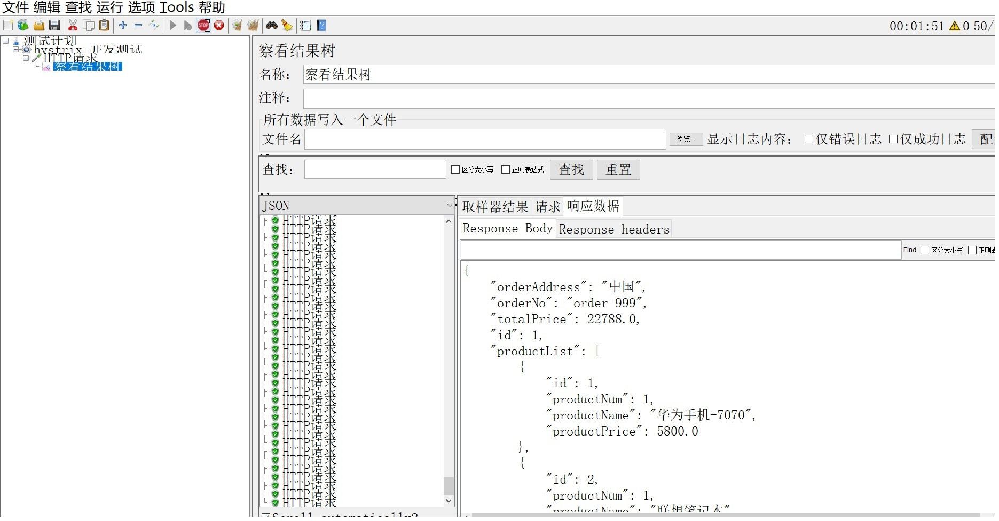
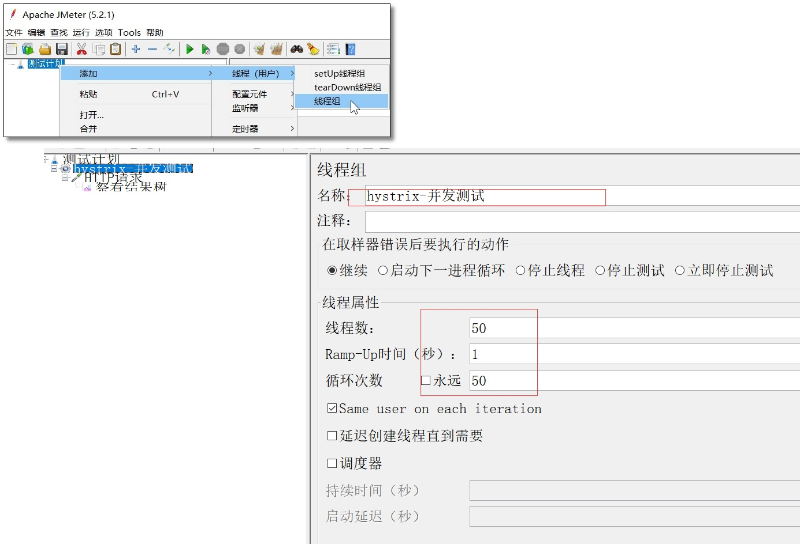
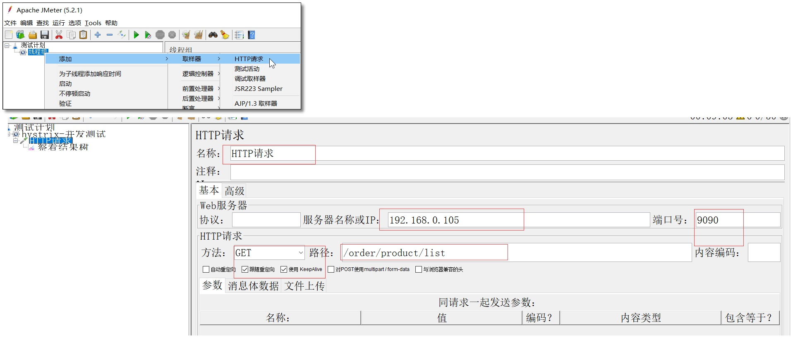
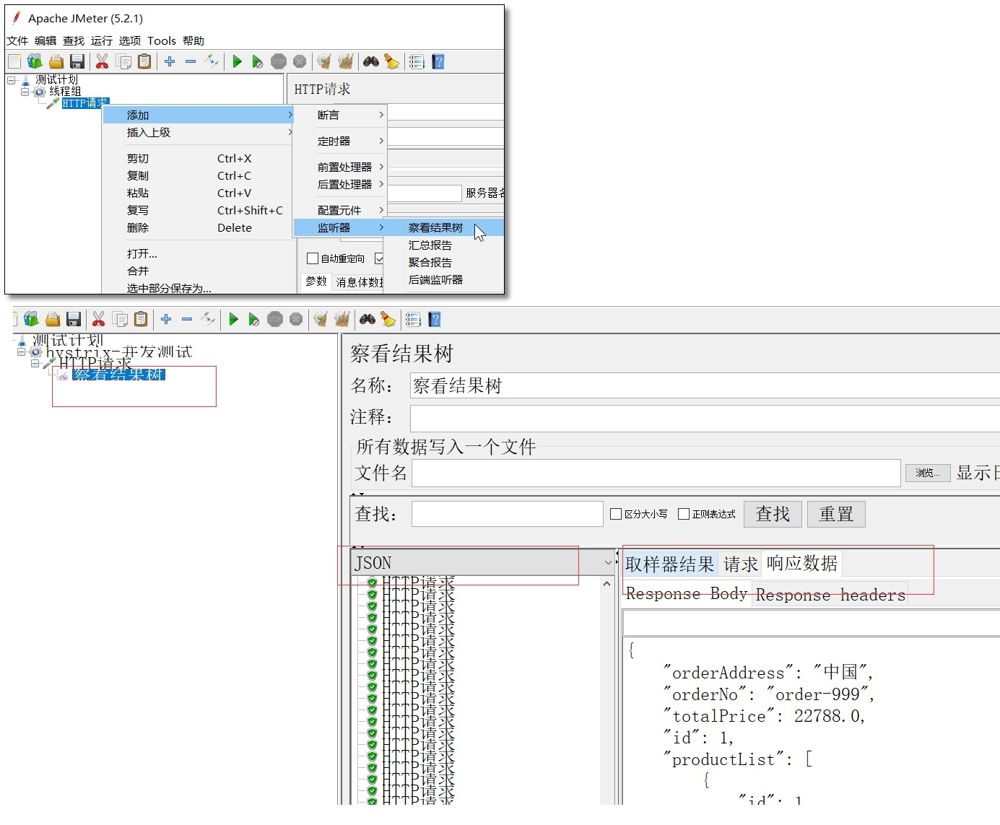
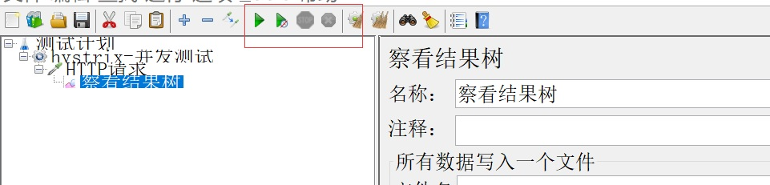
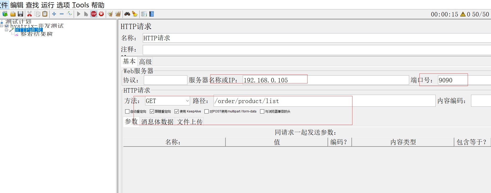
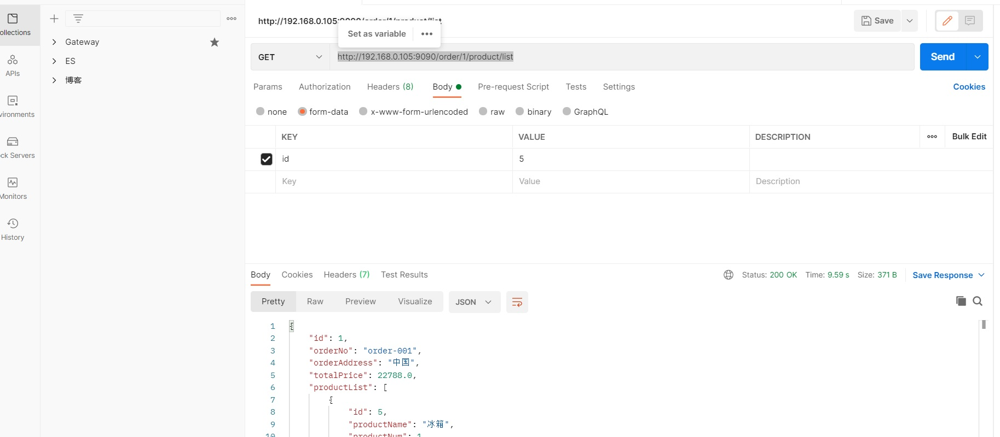

# 2. Jemeter模拟高并发

## 2.1 Jemeter使用

官网：https://jmeter.apache.org/ 本文安装 Windows 版本。

### 2.1.1 Jemeter汉化使用

进入 bin 目录编辑 jmeter.properties 文件，修改 37 行和 1085 行两处代码（不同的电脑可能行数不一致，不过上下差距不大）

```yml
#language=en
language=zh_CN
#sampleresult.default.encoding=ISO-8859-1
sampleresult.default.encoding=UTF-8
```

运行 bin/jmeter.bat 文件，界面显示如下。大家可以通过 **选项 → 外观** 选择自己喜欢的界面风格。

<a data-fancybox title=" Jemeter使用" href="./image/JMeter01.jpg"></a>

### 2.1.2 基本使用

#### 添加线程组
<a data-fancybox title=" Jemeter使用" href="./image/JMeter02.jpg"></a>

#### 添加 HTTP 请求
<a data-fancybox title=" Jemeter使用" href="./image/JMeter03.jpg"></a>

#### 添加结果数
<a data-fancybox title=" Jemeter使用" href="./image/JMeter04.jpg"></a>

#### 执行请求

<a data-fancybox title=" Jemeter使用" href="./image/JMeter05.jpg"></a>

## 2.2 高并发测试

### 2.2.1 模拟高并发场景

#### 服务提供者接口添加 Thread.sleep(2000) ，模拟服务处理时长。

```java
    /**
     * 查询商品列表
     *
     * @return
     */
    @GetMapping("/list")
    public List<Product> selectProductList() {
        //todo 模拟业务超时
        try {
            Thread.sleep(2000L);
        } catch (InterruptedException e) {
            e.printStackTrace();
        }
        return productService.selectProductList();
    }
```
#### 服务消费者降低 Tomcat 最大线程数方便模拟高并发

```yml
server:
 port: 8080
 tomcat:
   max-threads: 10 # 降低最大线程数方便模拟高并发
```

### 2.2.2 Jemeter测试

<a data-fancybox title=" Jemeter使用" href="./image/JMeter06.jpg"></a>


<a data-fancybox title=" Jemeter使用" href="./image/JMeter01.jpg"></a>


通过 JMeter 开启 50 线程循环 50 次请求服务消费者 http://localhost:9090/order/product/list 
 
然后postman再次请求 http://192.168.0.105:9090/order/1/product/list 统计耗时如下。请求耗时： 9.12s

<a data-fancybox title=" Jemeter使用" href="./image/Postman.jpg"></a>
