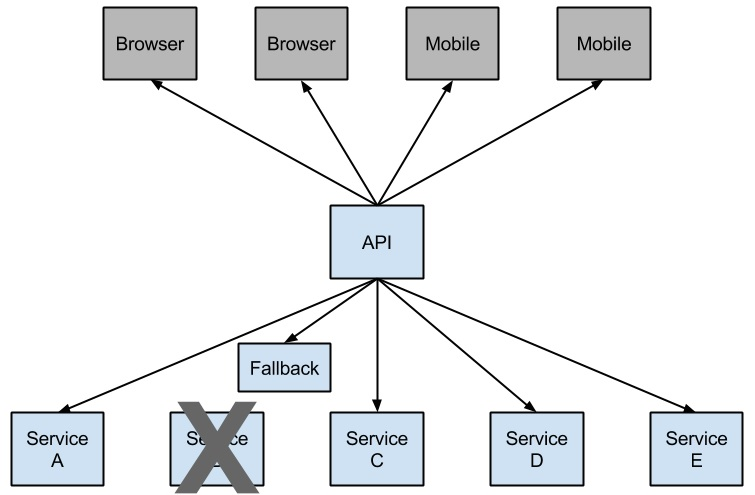

# 6. 服务熔断降级

## 6.1 服务熔断

服务熔断一般是指软件系统中，由于某些原因使得服务出现了过载现象，为防止造成整个系统故障，从而采用的一种保护措施，所以很多地方把熔断亦称为过载保护。

<a data-fancybox title=" 服务熔断" href="./image/rongduan.jpg"></a>

### 6.1.1 业务层

***服务消费者业务层代码添加服务熔断规则***

```java
    //todo --------------------服务熔断---------start-----------
    // 声明需要服务容错的方法
    // 服务熔断
    @HystrixCommand(commandProperties = {
            // 10s 内请求数大于 20 个就启动熔断器，当请求符合熔断条件触发 fallbackMethod 默认 20 个
            @HystrixProperty(name = HystrixPropertiesManager.CIRCUIT_BREAKER_REQUEST_VOLUME_THRESHOLD,
                    value = "10"),
            // 请求错误率大于 50% 就启动熔断器，然后 for 循环发起重试请求，当请求符合熔断条件触发 fallbackMethod
            @HystrixProperty(name = HystrixPropertiesManager.CIRCUIT_BREAKER_ERROR_THRESHOLD_PERCENTAGE,
                    value = "50"),
            // 熔断多少秒后去重试请求，默认 5s
            @HystrixProperty(name = HystrixPropertiesManager.CIRCUIT_BREAKER_SLEEP_WINDOW_IN_MILLISECONDS,
                    value = "5000"),
    }, fallbackMethod = "selectProductByIdFallback")
    @Override
    public Product selectProductByIdRongDuan(Integer id) {
        System.out.println("-----selectProductById-----"
                + LocalDateTime.now().format(DateTimeFormatter.ISO_LOCAL_TIME));
        // 模拟查询主键为 1 的商品信息会导致异常
        if (1 == id) {
            throw new RuntimeException("查询主键为 1 的商品信息导致异常");
        }
        return productService.selectProductById(id);
    }
    //todo 服务熔断 托底数据
    private Product selectProductByIdFallback(Integer id) {
        return new Product(id, "服务熔断--托底数据", 1, 2666D);
    }
    //todo --------------------服务熔断----------end-----------
```


## 6.2 服务降级

<a data-fancybox title=" 服务降级" href="./image/jiangji.jpg"></a>

吃鸡游戏相信大家应该都有所耳闻，这个游戏落地的时候什么东西都没有，装备都是需要自己去主动搜索或者通
过击杀其他队伍而获取。所以，在这个游戏中就涉及到一个背包的问题，背包的大小决定了能携带的物资数量，总共
分为三级，在你没有拿到更高级的背包之前，你只能将最重要的装备留在身边。其实服务降级，就是这么回事，再看
一个例子。

 大家都见过女生旅行吧，大号的旅行箱是必备物，平常走走近处绰绰有余，但一旦出个远门，再大的箱子都白搭
了，怎么办呢？常见的情景就是把物品拿出来分分堆，比了又比，最后一些非必需品的就忍痛放下了，等到下次箱子
够用了，再带上用一用。

**而服务降级，就是这么回事，整体资源快不够了，忍痛将某些服务先关掉，待渡过难关，再开启回来**

### 6.2.1 业务层

**服务消费者业务层代码添加服务降级规则**

```java
    /**
     * 查询订单-调用商品服务 服务降级
     *
     * @return
     */
    @GetMapping("/{id}/jiangji")
    public Product selectProductByIdDown(@PathVariable("id") Integer id){
        return orderService.selectProductByIdDown(id);
    }
```

## 6.3 Feign服务熔断降级

### 6.3.1 配置文件
```yml
feign:
  # Feign 开启 Hystrix 支持
  hystrix:
    enabled: true
```
### 6.3.1 消费服务

```java
// 声明需要调用的服务
@FeignClient(value ="service-provider" , fallback = ProductServiceFallback.class)
public interface ProductService {
    `
    `
    `
```

_______________

#### 服务熔断降级处理

```java
package com.tqk.service;

import com.tqk.pojo.Product;
import org.springframework.stereotype.Component;

import java.util.ArrayList;
import java.util.Arrays;
import java.util.List;
import java.util.Map;
/**
 * 服务熔断降级处理
 */
@Component
public class ProductServiceFallback implements ProductService{
    @Override
    public List<Product> selectProductList() {
        return Arrays.asList(
        new Product(1, "托底数据-华为手机", 1, 5800D),
        new Product(2, "托底数据-联想笔记本", 1, 6888D),
        new Product(3, "托底数据-小米平板", 5, 2020D)
        );
    }

    @Override
    public Product selectProductById(Integer id) {
          return new Product(id, "托底数据", 1, 2666D);
    }

    @Override
    public Product queryProductById(Integer id) {
          return new Product(id, "托底数据", 1, 2666D);
    }

    @Override
    public Map<Object, Object> createProduct(Product user) {
        return null;
    }

    @Override
    public Product selectProductByPojo(Product product) {
        return null;
    }

    @Override
    public List<Product> selectProductListByIds(List<Integer> ids) {
        List<Product> products = new ArrayList<>();
        ids.forEach(id -> products.add(new Product(id, "托底数据-电视机" + id, 1, 5800D)));
        return products;
    }
}

```


### 6.3.2 捕获服务异常

#### 消费服务
通过 fallbackFactory 属性声明服务熔断降级处理类。

```java
// 声明需要调用的服务和服务熔断处理类
@FeignClient(value = "service-provider", fallbackFactory =ProductServiceFallbackFactory.class)
public interface ProductService {
```

___________

```java
package com.tqk.service;


import com.tqk.pojo.Product;
import feign.hystrix.FallbackFactory;
import org.slf4j.Logger;
import org.slf4j.LoggerFactory;
import org.springframework.stereotype.Component;

import java.util.ArrayList;
import java.util.Arrays;
import java.util.List;
import java.util.Map;

/**
 * 服务熔断降级处理可以捕获异常
 */
@Component
public class ProductServiceFallbackFactory implements FallbackFactory<ProductService> {

    // 获取日志，在需要捕获异常的方法中进行处理
    Logger logger = LoggerFactory.getLogger(ProductServiceFallbackFactory.class);

    @Override
    public ProductService create(Throwable throwable) {
        return new ProductService() {
            // 查询商品列表接口的托底数据
            @Override
            public List<Product> selectProductList() {
                logger.error("product-service 服务的 selectProductList 方法出现异常，异常信息如下："
                        + throwable);
                return Arrays.asList(
                        new Product(1, "托底数据-华为手机", 1, 5800D),
                        new Product(2, "托底数据-联想笔记本", 1, 6888D),
                        new Product(3, "托底数据-小米平板", 5, 2020D)
                );
            }

            // 根据多个主键查询商品接口的托底数据
            @Override
            public List<Product> selectProductListByIds(List<Integer> ids) {
                logger.error("product-service 服务的 selectProductListByIds 方法出现异常，异常信息如下："
                        + throwable);
                List<Product> products = new ArrayList<>();
                ids.forEach(id -> products.add(new Product(id, "托底数据-电视机" + id, 1, 5800D)));
                return products;
            }

            // 根据主键查询商品接口的托底数据
            @Override
            public Product selectProductById(Integer id) {
                logger.error("product-service 服务的 selectProductById 方法出现异常，异常信息如下："
                        + throwable);
                return new Product(id, "托底数据", 1, 2666D);
            }

            @Override
            public Product queryProductById(Integer id) {
                return null;
            }

            @Override
            public Map<Object, Object> createProduct(Product user) {
                return null;
            }

            @Override
            public Product selectProductByPojo(Product product) {
                return null;
            }
        };
    }

}
```
