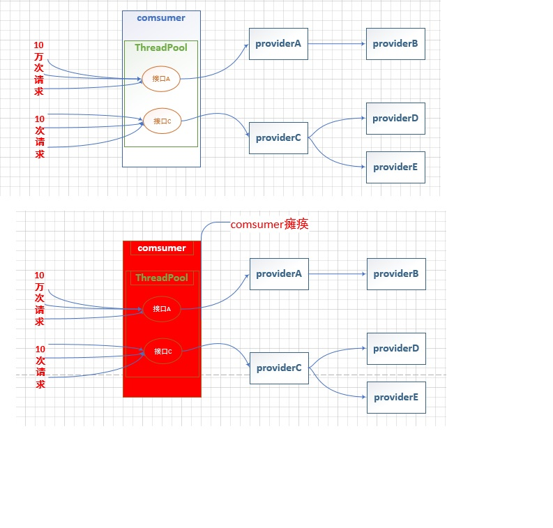
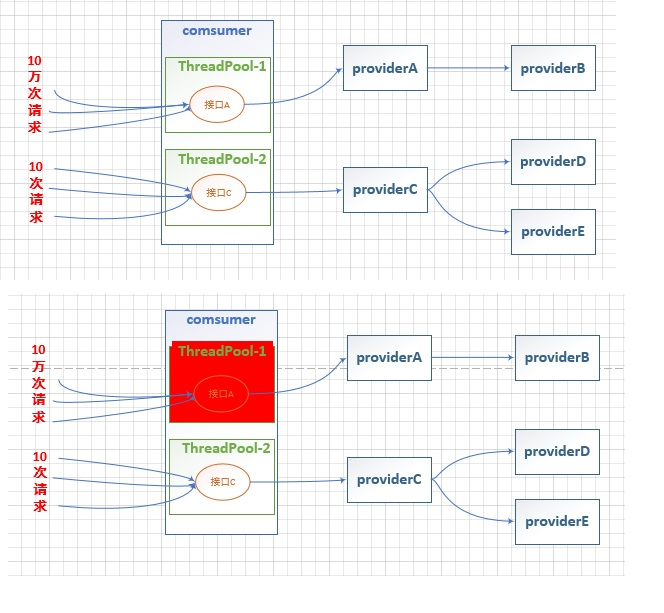
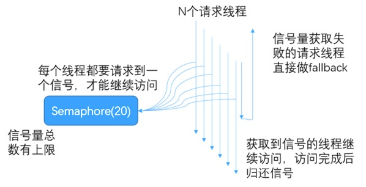
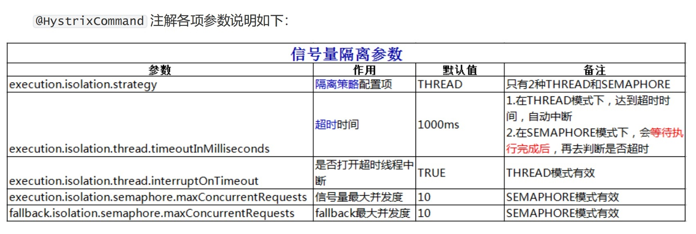

# 4. 服务隔离方案

## 4.1 线程池隔离


### 4.1.1 线程池隔离简介
#### 隔离前

没有线程池隔离的项目所有接口都运行在一个 ThreadPool 中，当某一个接口压力过大或者出现故障时，会导致资源耗尽从而影响到其他接口的调用而引发服务雪崩效应。我们在模拟高并发场景时也演示了该效果。

<a data-fancybox title=" 线程池隔离" href="./image/geli01.jpg"></a>

#### 隔离后


通过每次都开启一个单独线程运行。它的隔离是通过线程池，即每个隔离粒度都是个线程池，互相不干扰。线程池隔离方式，等于多了一层的保护措施，可以通过 hytrix 直接设置超时，超时后直接返回。
<a data-fancybox title=" 线程池隔离" href="./image/geli02.jpg"></a>

:::tip 优点：
1. 使用线程池隔离可以安全隔离依赖的服务（例如图中 A、C、D 服务），减少所依赖服务发生故障时的影响面。比如 A 服务发生异常，导致请求大量超时，对应的线程池被打满，这时并不影响 C、D 服务的调用。
2. 当失败的服务再次变得可用时，线程池将清理并立即恢复，而不需要一个长时间的恢复。
3. 独立的线程池提高了并发性。
:::

:::tip 缺点：
1. 请求在线程池中执行，肯定会带来任务调度、排队和上下文切换带来的 CPU 开销。
2. 因为涉及到跨线程，那么就存在 **ThreadLocal 数据的传递问题**，比如在主线程初始化的 ThreadLocal 变量，在线程池线程中无法获取。
:::

### 4.1.2 添加依赖

```xml
    <!-- spring-cloud netflix hystrix 依赖 -->
    <dependency>
        <groupId>org.springframework.cloud</groupId>
        <artifactId>spring-cloud-starter-netflix-hystrix</artifactId>
    </dependency>

```

### 4.1.3 业务层

服务消费者业务层代码添加线程隔离规则

```java
    //todo --------------------线程池隔离---------start-----------
    // 声明需要服务容错的方法
    // 线程池隔离
    @HystrixCommand(groupKey = "order-productService-listPool",// 服务名称，相同名称使用同一个线程池
            commandKey = "selectProductList",// 接口名称，默认为方法名
            threadPoolKey = "order-productService-listPool",// 线程池名称，相同名称使用同一个线程池
            commandProperties = {
                    // 超时时间，默认 1000ms
                    @HystrixProperty(name = "execution.isolation.thread.timeoutInMilliseconds",
                            value = "1000")
            },
            threadPoolProperties = {
                    // 线程池大小
                    @HystrixProperty(name = "coreSize", value = "6"),
                    // 队列等待阈值(最大队列长度，默认 -1)
                    @HystrixProperty(name = "maxQueueSize", value = "100"),
                    // 线程存活时间，默认 1min
                    @HystrixProperty(name = "keepAliveTimeMinutes", value = "2"),
                    // 超出队列等待阈值执行拒绝策略
                    @HystrixProperty(name = "queueSizeRejectionThreshold", value = "100")
            }, fallbackMethod = "selectProductListFallback")
    @Override
    public List<Product> selectProductList() {
        System.out.println(Thread.currentThread().getName() + "-----selectProductList-----");
        return productService.selectProductList();
    }
    // 托底数据
    private List<Product> selectProductListFallback() {
        System.out.println("-----selectProductListFallback-----");
        return Arrays.asList(
                new Product(1, "托底数据-华为手机", 1, 5800D),
                new Product(2, "托底数据-联想笔记本", 1, 6888D),
                new Product(3, "托底数据-小米平板", 5, 2020D)
        );
    }
    //todo --------------------线程池隔离----------end------------
```


### 4.1.3 @HystrixCommand 注解各项参数

<a data-fancybox title=" 线程池隔离" href="./image/xianchegngeli01.jpg"></a>


### 4.1.4 测试


1. 服务提供者接口添加 Thread.sleep(2000) ，模拟服务处理时长。
 
2. JMeter 开启 20 线程循环 50 次访问：http://localhost:9092/order/xiancheng/geli

3. 浏览器访问：http://192.168.0.105:9092/order/1/product/list


## 4.2 信号隔离

每次调用线程，当前请求通过计数信号量进行限制，当信号量大于了最大请求数 **maxConcurrentRequests**
时，进行限制，调用 **fallback** 接口快速返回。信号量的调用是同步的，也就是说，每次调用都得阻塞调用方的线
程，直到结果返回。这样就导致了无法对访问做超时（只能依靠调用协议超时，无法主动释放）。

<a data-fancybox title=" 信号隔离" href="./image/xinhaolianggeli.jpg"></a>

## 4.2.1  业务代码

```java
    // --------------------信号量隔离---------start-----------
    // 声明需要服务容错的方法
    // 信号量隔离
    @HystrixCommand(commandProperties = {
            // 超时时间，默认 1000ms
            @HystrixProperty(name = "execution.isolation.thread.timeoutInMilliseconds",
                    value = "2000"),
            // 信号量隔离
            @HystrixProperty(name = HystrixPropertiesManager.EXECUTION_ISOLATION_STRATEGY,
                    value = "SEMAPHORE"),
            // 信号量最大并发，调小一些方便模拟高并发
            @HystrixProperty(name = HystrixPropertiesManager.EXECUTION_ISOLATION_SEMAPHORE_MAX_CONCURRENT_REQUESTS,
                    value = "6")
    }, fallbackMethod = "selectProductListFallback")
    @Override
    public List<Product> selectProductList() {
        System.out.println(Thread.currentThread().getName() + "-----selectProductList-----");
        return productService.selectProductList();
    }
    // 托底数据
    private List<Product> selectProductListFallback() {
        System.out.println("-----selectProductListFallback-----");
        return Arrays.asList(
                new Product(1, "托底数据信号量-华为手机", 1, 5800D),
                new Product(2, "托底数据信号量-联想笔记本", 1, 6888D),
                new Product(3, "托底数据信号量-小米平板", 5, 2020D)
        );
    }
    // --------------------信号量隔离----------end------------
```


<a data-fancybox title=" 信号隔离" href="./image/xinhaolianggeli1.jpg"></a>

### 4.1.3 测试

测试同上

