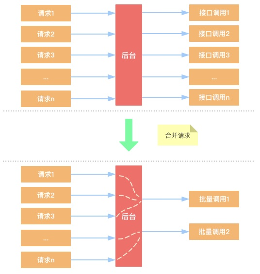
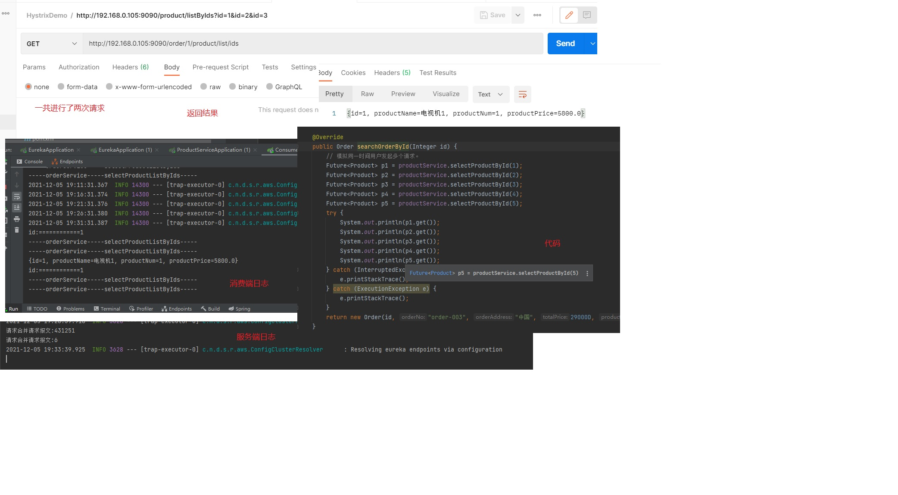

# 4. 请求合并方案

在微服务架构中，我们将一个项目拆分成很多个独立的模块，这些独立的模块通过远程调用来互相配合工作，但
是，**在高并发情况下**，通信次数的增加会导致总的通信时间增加，同时，***线程池的资源也是有限的***，高并发环境会导
致有**大量的线程处于等待状态，进而导致响应延迟**，为了解决这些问题，我们需要来了解 Hystrix 的请求合并。

<a data-fancybox title=" 请求合并方案" href="./image/Hystrix05.jpg"></a>

## 4.1 请求合并的缺点

设置请求合并之后，本来一个请求可能 5ms 就搞定了，但是现在必须再等 10ms 看看还有没有其他的请求一起，这样一个请求的耗时就从 5ms 增加到 15ms 了。

如果我们要发起的命令本身就是一个高延迟的命令，那么这个时候就可以使用请求合并了，因为这个时候时间消耗就显得微不足道了，另外**高并发也是请求合并的一个非常重要的场景**

## 4.2 添加依赖

```xml
    <!-- spring-cloud netflix hystrix 依赖 -->
    <dependency>
        <groupId>org.springframework.cloud</groupId>
        <artifactId>spring-cloud-starter-netflix-hystrix</artifactId>
    </dependency>

```
## 4.3 业务层

```java
package com.tqk.controller;

import com.tqk.pojo.Order;
import com.tqk.pojo.Product;
import com.tqk.service.OrderService;
import org.springframework.beans.factory.annotation.Autowired;
import org.springframework.web.bind.annotation.GetMapping;
import org.springframework.web.bind.annotation.PathVariable;
import org.springframework.web.bind.annotation.RequestMapping;
import org.springframework.web.bind.annotation.RestController;

import java.util.concurrent.ExecutionException;
import java.util.concurrent.Future;

@RestController
@RequestMapping("/order")
public class OrderController {

    @Autowired
    private OrderService orderService;
    /**
     * 查询订单-调用商品服务 请求合并测试
     *
     * @return
     */
    @GetMapping("/{id}/product/list/ids")
    public String selectOrderByIds(@PathVariable("id") Integer id) {
        System.out.println("id:"+"============"+id);
        Object obj=null;
        Future<Product> product=orderService.selectProductById(id);
        Future<Product> product1=orderService.selectProductById(1);
        Future<Product> product2=orderService.selectProductById(2);
        Future<Product> product3=orderService.selectProductById(3);
        Future<Product> product4=orderService.selectProductById(4);
        Future<Product> product5=orderService.selectProductById(5);
        try {
            System.out.println(product.get());
            obj=(Object)product.get();
        } catch (InterruptedException e) {
            e.printStackTrace();
        } catch (ExecutionException e) {
            e.printStackTrace();
        }
        try {
            Thread.sleep(1000);
            Future<Product> product6=orderService.selectProductById(6);
        } catch (InterruptedException e) {
            e.printStackTrace();
        }
        System.out.println("id:"+"============"+id);
        return  obj.toString();
    }


    /**
     * 根据主键查询订单
     * 方式一
     * @param id
     * @return
     */
    @GetMapping("/{id}")
    public Order selectOrderById(@PathVariable("id") Integer id) {
        return orderService.selectOrderById(id);
    }
}
```


```java
    //todo  --------------------请求合并---------start-----------
    /**
     * 根据多个主键合并查询商品
     *
     * @param ids
     * @return
     */
    // 声明需要服务容错的方法
    @HystrixCommand
    public List<Product> selectProductListByIds(List<Integer> ids) {
        System.out.println("-----orderService-----selectProductListByIds-----");
        System.out.println("-----orderService-----selectProductListByIds-----");
        StringBuffer sb = new StringBuffer();
        ids.forEach(id -> sb.append("id=" + id + "&"));
        return restTemplate.getForObject("http://service-provider/product/listByIds?" +
                sb.toString(), List.class);
    }

    // 处理请求合并的方法一定要支持异步，返回值必须是 Future<T>
    // 合并请求

    /**
     *  处理请求合并的方法一定要支持异步，返回值必须是 Future<T>
     *  合并请求
     * @param id
     * @return
     */
    @HystrixCollapser(batchMethod = "selectProductListByIds", // 合并请求方法
            scope = com.netflix.hystrix.HystrixCollapser.Scope.GLOBAL, // 请求方式
            collapserProperties = {
                    // 间隔多久的请求会进行合并，默认 10ms
                    @HystrixProperty(name = "timerDelayInMilliseconds", value = "20"),
                    // 批处理之前，批处理中允许的最大请求数
                    @HystrixProperty(name = "maxRequestsInBatch", value = "200")
            })
    @Override
    public Future<Product> selectProductById(Integer id) {
        System.out.println("-----orderService-----selectProductById-----");
        return null;
    }
    //todo  --------------------请求合并----------end------------
```

## 4.4 启动类

```java
/**
 * @author tianqikai
 */
@SpringBootApplication
// 开启熔断器注解 2 选 1，@EnableHystrix 封装了 @EnableCircuitBreaker
// @EnableHystrix
@EnableCircuitBreaker
public class ConsumerApplication {
    public static void main(String[] args) {
        SpringApplication.run(ConsumerApplication.class,args);
    }
}

```

## 4.5 测试

http://192.168.0.105:9090/order/1/product/list/ids

<a data-fancybox title=" 请求合并方案" href="./image/qingqiuhebing.jpg"></a>
