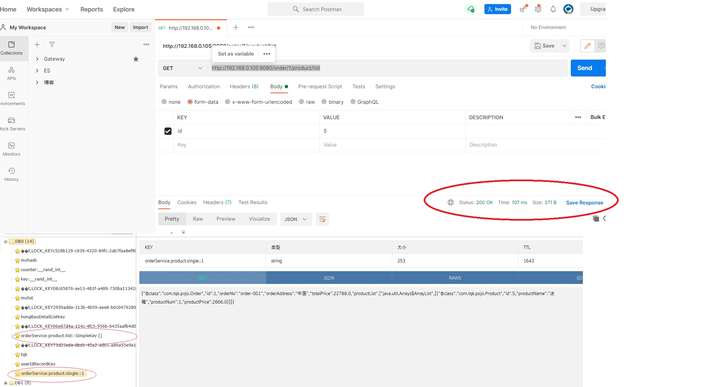

# 3. 请求缓存解决方案

Hystrix 为了降低访问服务的频率，支持将一个请求与返回结果做缓存处理。如果再次请求的 URL 没有变化，那么 Hystrix 不会请求服务，而是直接从缓存中将结果返回。这样可以大大降低访问服务的压力。

## 3.1 添加依赖

```xml
    <!--===========Redis=============================start-->
    <!-- spring boot data redis 依赖 -->
    <dependency>
        <groupId>org.springframework.boot</groupId>
        <artifactId>spring-boot-starter-data-redis</artifactId>
    </dependency>
    <!-- commons-pool2 对象池依赖 -->
    <dependency>
        <groupId>org.apache.commons</groupId>
        <artifactId>commons-pool2</artifactId>
    </dependency>
    <!--===========Redis===========================End-->
```
## 3.2 配置文件

```yml
spring:
  application:
    name: Service-Consumer
  # redis 缓存
  redis:
    timeout: 10000        # 连接超时时间
    host: 49.233.34.168  # Redis服务器地址
    port: 6400            # Redis服务器端口
    #password: root        # Redis服务器密码
    database: 0           # 选择哪个库，默认0库
    lettuce:
      pool:
        max-active: 1024  # 最大连接数，默认 8
        max-wait: 10000   # 最大连接阻塞等待时间，单位毫秒，默认 -1
        max-idle: 200     # 最大空闲连接，默认 8
        min-idle: 5       # 最小空闲连接，默认 0
```
## 3.3 配置类
```java
package com.tqk.config;

import org.springframework.context.annotation.Bean;
import org.springframework.context.annotation.Configuration;
import org.springframework.data.redis.cache.RedisCacheConfiguration;
import org.springframework.data.redis.cache.RedisCacheManager;
import org.springframework.data.redis.cache.RedisCacheWriter;
import org.springframework.data.redis.connection.RedisConnectionFactory;
import org.springframework.data.redis.core.RedisTemplate;
import org.springframework.data.redis.serializer.GenericJackson2JsonRedisSerializer;
import org.springframework.data.redis.serializer.RedisSerializationContext;
import org.springframework.data.redis.serializer.StringRedisSerializer;

import java.time.Duration;

/**
 * Redis 配置类
 */
@Configuration
public class RedisConfig {

    // 重写 RedisTemplate 序列化
    @Bean
    public RedisTemplate<String, Object> redisTemplate(RedisConnectionFactory redisConnectionFactory) {
        RedisTemplate<String, Object> template = new RedisTemplate<>();
        // 为 String 类型 key 设置序列化器
        template.setKeySerializer(new StringRedisSerializer());
        // 为 String 类型 value 设置序列化器
        template.setValueSerializer(new GenericJackson2JsonRedisSerializer());
        // 为 Hash 类型 key 设置序列化器
        template.setHashKeySerializer(new StringRedisSerializer());
        // 为 Hash 类型 value 设置序列化器
        template.setHashValueSerializer(new GenericJackson2JsonRedisSerializer());
        template.setConnectionFactory(redisConnectionFactory);
        return template;
    }

    // 重写 Cache 序列化
    @Bean
    public RedisCacheManager redisCacheManager(RedisTemplate redisTemplate) {
        RedisCacheWriter redisCacheWriter = RedisCacheWriter.nonLockingRedisCacheWriter(redisTemplate.getConnectionFactory());
        RedisCacheConfiguration redisCacheConfiguration = RedisCacheConfiguration.defaultCacheConfig()
                // 设置默认过期时间 30 min
                .entryTtl(Duration.ofMinutes(30))
                // 设置 key 和 value 的序列化
                .serializeKeysWith(RedisSerializationContext.SerializationPair.fromSerializer(redisTemplate.getKeySerializer()))
                .serializeValuesWith(RedisSerializationContext.SerializationPair.fromSerializer(redisTemplate.getValueSerializer()));
        return new RedisCacheManager(redisCacheWriter, redisCacheConfiguration);
    }

}
```
## 3.4 启动类
```java
package com.tqk;

import com.netflix.loadbalancer.RandomRule;
import feign.Logger;
import org.springframework.boot.SpringApplication;
import org.springframework.boot.autoconfigure.SpringBootApplication;
import org.springframework.cache.annotation.EnableCaching;
import org.springframework.cloud.netflix.eureka.EnableEurekaClient;
import org.springframework.cloud.openfeign.EnableFeignClients;
import org.springframework.context.annotation.Bean;

@SpringBootApplication
// 开启 EurekaClient 注解，目前版本如果配置了 Eureka 注册中心，默认会开启该注解
@EnableEurekaClient
// 开启 FeignClients 注解
@EnableFeignClients
// 开启缓存注解
@EnableCaching
public class ServiceConsumerApplication {

    /**
     *    NONE：不记录任何信息，默认值
     *     BASIC：记录请求方法、请求 URL、状态码和用时
     *     HEADERS：在 BASIC 基础上再记录一些常用信息
     *     FULL：记录请求和相应的所有信息
     */
    @Bean
    public Logger.Level getLog() {
        return Logger.Level.FULL;
    }

    /**
     * 负载均衡策略 --随机
     * @return
     */
    @Bean
    public RandomRule randomRule() {
        return new RandomRule();
    }

    public static void main(String[] args) {
        SpringApplication.run(ServiceConsumerApplication.class, args);
    }

}
```
## 3.5 业务层
```java
    /**
     * 根据主键查询订单
     *
     * @param id
     * @return
     */
    @Override
    @Cacheable(cacheNames = "orderService:product:single", key = "#id")
    public Order selectOrderById(Integer id) {
        return new Order(id, "order-001", "中国", 22788D,
                Arrays.asList(productService.selectProductById(5)));
    }

 /**
     * 查询订单列表--缓存方式
     * @return
     */
    @Cacheable(cacheNames = "orderService:product:list")
    @Override
    public Order selectOrderByCache(){
        return new Order(1, "order-999", "中国", 22788D,
                productService.selectProductList());
    }
```
## 3.6 测试

当我们请求相同服务时，服务提供者也不再打印语句说明服务消费者的请求直接获取了缓存的数据。

JMeter 开启 50 线程循环 50 次请求 http://localhost:9090/order/product/list/cache

Postman请求 http://192.168.0.105:9090/order/1/product/list，结果如下：

<a data-fancybox title=" 请求缓存解决方案" href="./image/JMeter07.jpg"></a>
