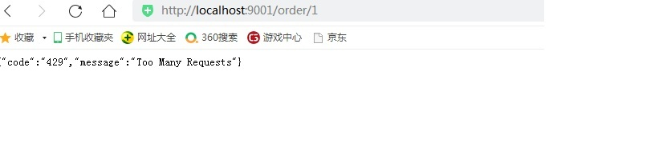
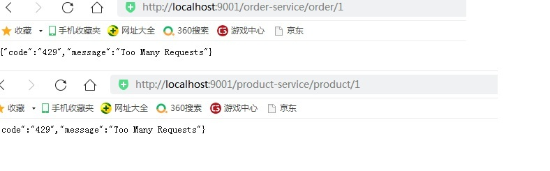

# 5. Gateway整合Sentinel
 
 Sentinel 支持对 Spring Cloud Gateway、Netflix Zuul 等主流的 API Gateway 进行限流。

 官网文档：
https://github.com/alibaba/spring-cloud-alibaba/wiki/Sentinel
https://github.com/alibaba/Sentinel/wiki/%E7%BD%91%E5%85%B3%E9%99%90%E6%B5%81#springcloud-gateway


## 5.1 创建项目
 
创建 gateway-server-sentinel 项目。
 
## 5.2  添加依赖
```xml
<?xml version="1.0" encoding="UTF-8"?>

<project xmlns="http://maven.apache.org/POM/4.0.0" xmlns:xsi="http://www.w3.org/2001/XMLSchema-instance"
         xsi:schemaLocation="http://maven.apache.org/POM/4.0.0 http://maven.apache.org/xsd/maven-4.0.0.xsd">
    <modelVersion>4.0.0</modelVersion>

    <groupId>com.example</groupId>
    <artifactId>gateway-server-sentinel</artifactId>
    <version>1.0-SNAPSHOT</version>

    <!-- 继承父依赖 -->
    <parent>
        <groupId>com.example</groupId>
        <artifactId>gateway-demo</artifactId>
        <version>1.0-SNAPSHOT</version>
    </parent>

    <!-- 项目依赖 -->
    <dependencies>
        <!-- spring cloud gateway 依赖 -->
        <dependency>
            <groupId>org.springframework.cloud</groupId>
            <artifactId>spring-cloud-starter-gateway</artifactId>
        </dependency>
        <!-- netflix eureka client 依赖 -->
        <dependency>
            <groupId>org.springframework.cloud</groupId>
            <artifactId>spring-cloud-starter-netflix-eureka-client</artifactId>
        </dependency>
        <!-- 单独使用 -->
        <!-- sentinel gateway adapter 依赖 -->
        <dependency>
            <groupId>com.alibaba.csp</groupId>
            <artifactId>sentinel-spring-cloud-gateway-adapter</artifactId>
        </dependency>
        <!-- 和 Sentinel Starter 配合使用 -->
        <!--
        <dependency>
            <groupId>com.alibaba.cloud</groupId>
            <artifactId>spring-cloud-starter-alibaba-sentinel</artifactId>
        </dependency>
        <dependency>
            <groupId>com.alibaba.cloud</groupId>
            <artifactId>spring-cloud-alibaba-sentinel-gateway</artifactId>
        </dependency>
        -->
    </dependencies>

</project>

```
 
 单独使用添加 sentinel gateway adapter 依赖即可

  若想跟 Sentinel Starter 配合使用，需要加上 spring-cloud-alibaba-sentinel-gateway 依赖来让 springcloud-alibaba-sentinel-gateway 模块里的 Spring Cloud Gateway 自动化配置类生效。
 同时请将 spring.cloud.sentinel.filter.enabled 配置项置为 false（若在网关流控控制台上看到了 URL
资源，就是此配置项没有置为 false）。


## 5.3 配置文件

```yml
spring:
  application:
    name: gateway-server-sentinel # 应用名称
  cloud:
    sentinel:
      filter:
        enabled: false
    gateway:
      discovery:
        locator:
          # 是否与服务发现组件进行结合，通过 serviceId 转发到具体服务实例。
          enabled: true                  # 是否开启基于服务发现的路由规则
          lower-case-service-id: true    # 是否将服务名称转小写
      # 路由规则
      routes:
        - id: order-service           # 路由 ID，唯一
          uri: lb://order-service     # 目标 URI，lb:// 根据服务名称从注册中心获取服务请求地址
          predicates:                   # 断言（判断条件）
            # 匹配对应 URL 的请求，将匹配到的请求追加在目标 URI 之后
            - Path=/order/**

# 端口
server:
  port: 9001

# 配置 Eureka Server 注册中心
eureka:
  instance:
    prefer-ip-address: true       # 是否使用 ip 地址注册
    instance-id: ${spring.cloud.client.ip-address}:${server.port} # ip:port
  client:
    service-url:                  # 设置服务注册中心地址
      defaultZone: http://localhost:8761/eureka/,http://localhost:8762/eureka/

```


## 5.4 限流规则配置类
使用时只需注入对应的 SentinelGatewayFilter 实例以及 SentinelGatewayBlockExceptionHandler 实例
即可
```java
package com.example.config;

import com.alibaba.csp.sentinel.adapter.gateway.common.SentinelGatewayConstants;
import com.alibaba.csp.sentinel.adapter.gateway.common.api.ApiDefinition;
import com.alibaba.csp.sentinel.adapter.gateway.common.api.ApiPathPredicateItem;
import com.alibaba.csp.sentinel.adapter.gateway.common.api.ApiPredicateItem;
import com.alibaba.csp.sentinel.adapter.gateway.common.api.GatewayApiDefinitionManager;
import com.alibaba.csp.sentinel.adapter.gateway.common.rule.GatewayFlowRule;
import com.alibaba.csp.sentinel.adapter.gateway.common.rule.GatewayRuleManager;
import com.alibaba.csp.sentinel.adapter.gateway.sc.SentinelGatewayFilter;
import com.alibaba.csp.sentinel.adapter.gateway.sc.callback.BlockRequestHandler;
import com.alibaba.csp.sentinel.adapter.gateway.sc.callback.GatewayCallbackManager;
import com.alibaba.csp.sentinel.adapter.gateway.sc.exception.SentinelGatewayBlockExceptionHandler;
import org.springframework.beans.factory.ObjectProvider;
import org.springframework.cloud.gateway.filter.GlobalFilter;
import org.springframework.context.annotation.Bean;
import org.springframework.context.annotation.Configuration;
import org.springframework.core.Ordered;
import org.springframework.core.annotation.Order;
import org.springframework.http.HttpStatus;
import org.springframework.http.MediaType;
import org.springframework.http.codec.ServerCodecConfigurer;
import org.springframework.web.reactive.function.BodyInserters;
import org.springframework.web.reactive.function.server.ServerResponse;
import org.springframework.web.reactive.result.view.ViewResolver;
import org.springframework.web.server.ServerWebExchange;
import reactor.core.publisher.Mono;

import javax.annotation.PostConstruct;
import java.util.*;

/**
 * 限流规则配置类
 */
@Configuration
public class GatewayConfiguration {

    private final List<ViewResolver> viewResolvers;
    private final ServerCodecConfigurer serverCodecConfigurer;

    /**
     * 构造器
     *
     * @param viewResolversProvider
     * @param serverCodecConfigurer
     */
    public GatewayConfiguration(ObjectProvider<List<ViewResolver>> viewResolversProvider,
                                ServerCodecConfigurer serverCodecConfigurer) {
        this.viewResolvers = viewResolversProvider.getIfAvailable(Collections::emptyList);
        this.serverCodecConfigurer = serverCodecConfigurer;
    }

    /**
     * 限流异常处理器
     *
     * @return
     */
    @Bean
    @Order(Ordered.HIGHEST_PRECEDENCE)
    public SentinelGatewayBlockExceptionHandler sentinelGatewayBlockExceptionHandler() {
        // Register the block exception handler for Spring Cloud Gateway.
        return new SentinelGatewayBlockExceptionHandler(viewResolvers, serverCodecConfigurer);
    }

    /**
     * 限流过滤器
     *
     * @return
     */
    @Bean
    @Order(Ordered.HIGHEST_PRECEDENCE)
    public GlobalFilter sentinelGatewayFilter() {
        return new SentinelGatewayFilter();
    }

    /**
     * Spring 容器初始化的时候执行该方法
     */
    @PostConstruct
    public void doInit() {
        // 加载网关限流规则
        initGatewayRules();
    }

    /**
     * 网关限流规则
     */
    private void initGatewayRules() {
        Set<GatewayFlowRule> rules = new HashSet<>();
        /*
            resource：资源名称，可以是网关中的 route 名称或者用户自定义的 API 分组名称
            count：限流阈值
            intervalSec：统计时间窗口，单位是秒，默认是 1 秒
         */
         rules.add(new GatewayFlowRule("order-service")
                 .setCount(3) // 限流阈值
                 .setIntervalSec(60)); // 统计时间窗口，单位是秒，默认是 1 秒
        // 加载网关限流规则
        GatewayRuleManager.loadRules(rules);

    }
}

```

## 5.5  启动类

```java
package com.example;

import org.springframework.boot.SpringApplication;
import org.springframework.boot.autoconfigure.SpringBootApplication;

/**
 * @author tianqikai
 */ // 开启 EurekaClient 注解，目前版本如果配置了 Eureka 注册中心，默认会开启该注解
//@EnableEurekaClient
@SpringBootApplication
public class GatewayServerSentinelApplication {

    public static void main(String[] args) {
        SpringApplication.run(GatewayServerSentinelApplication.class, args);
    }

}
```

## 5.6  访问

<a>http://localhost:9001/order/1</a>

<a data-fancybox title="sentinel" href="./image/sentinel1.jpg"></a>


接口 BlockRequestHandler 的默认实现为 DefaultBlockRequestHandler ，当触发限流时会返回默认的错误
信息： Blocked by Sentinel: FlowException 。我们可以通过 GatewayCallbackManager 定制异常提示信息


## 5.7 Sentinel限流自定义异常提示

**GatewayCallbackManager.setBlockHandler(blockRequestHandler)**用于实现自定义的逻辑，处理被限流的请求

```java
package com.example.config;

import com.alibaba.csp.sentinel.adapter.gateway.common.rule.GatewayFlowRule;
import com.alibaba.csp.sentinel.adapter.gateway.common.rule.GatewayRuleManager;
import com.alibaba.csp.sentinel.adapter.gateway.sc.SentinelGatewayFilter;
import com.alibaba.csp.sentinel.adapter.gateway.sc.callback.BlockRequestHandler;
import com.alibaba.csp.sentinel.adapter.gateway.sc.callback.GatewayCallbackManager;
import com.alibaba.csp.sentinel.adapter.gateway.sc.exception.SentinelGatewayBlockExceptionHandler;
import org.springframework.beans.factory.ObjectProvider;
import org.springframework.cloud.gateway.filter.GlobalFilter;
import org.springframework.context.annotation.Bean;
import org.springframework.context.annotation.Configuration;
import org.springframework.core.Ordered;
import org.springframework.core.annotation.Order;
import org.springframework.http.HttpStatus;
import org.springframework.http.MediaType;
import org.springframework.http.codec.ServerCodecConfigurer;
import org.springframework.web.reactive.function.BodyInserters;
import org.springframework.web.reactive.function.server.ServerResponse;
import org.springframework.web.reactive.result.view.ViewResolver;
import org.springframework.web.server.ServerWebExchange;

import javax.annotation.PostConstruct;
import java.util.*;

/**
 * 限流规则配置类
 */
@Configuration
public class GatewayConfiguration {

    private final List<ViewResolver> viewResolvers;
    private final ServerCodecConfigurer serverCodecConfigurer;

    /**
     * 构造器
     *
     * @param viewResolversProvider
     * @param serverCodecConfigurer
     */
    public GatewayConfiguration(ObjectProvider<List<ViewResolver>> viewResolversProvider,
                                ServerCodecConfigurer serverCodecConfigurer) {
        this.viewResolvers = viewResolversProvider.getIfAvailable(Collections::emptyList);
        this.serverCodecConfigurer = serverCodecConfigurer;
    }

    /**
     * 限流异常处理器
     *
     * @return
     */
    @Bean
    @Order(Ordered.HIGHEST_PRECEDENCE)
    public SentinelGatewayBlockExceptionHandler sentinelGatewayBlockExceptionHandler() {
        // Register the block exception handler for Spring Cloud Gateway.
        return new SentinelGatewayBlockExceptionHandler(viewResolvers, serverCodecConfigurer);
    }

    /**
     * 限流过滤器
     *
     * @return
     */
    @Bean
    @Order(Ordered.HIGHEST_PRECEDENCE)
    public GlobalFilter sentinelGatewayFilter() {
        return new SentinelGatewayFilter();
    }

    /**
     * Spring 容器初始化的时候执行该方法
     */
    @PostConstruct
    public void doInit() {
        // 加载网关限流规则
        initGatewayRules();
        // 加载自定义限流异常处理器
        initBlockHandler();
    }

    /**
     * 网关限流规则
     */
    private void initGatewayRules() {
        Set<GatewayFlowRule> rules = new HashSet<>();
        /*
            resource：资源名称，可以是网关中的 route 名称或者用户自定义的 API 分组名称
            count：限流阈值
            intervalSec：统计时间窗口，单位是秒，默认是 1 秒
         */
         rules.add(new GatewayFlowRule("order-service")
                 .setCount(3) // 限流阈值
                 .setIntervalSec(60)); // 统计时间窗口，单位是秒，默认是 1 秒
        // 加载网关限流规则
        GatewayRuleManager.loadRules(rules);
    }

    /**
     * 自定义限流异常处理器
     */
    private void initBlockHandler() {
//        BlockRequestHandler blockRequestHandler = new BlockRequestHandler() {
//            @Override
//            public Mono<ServerResponse> handleRequest(ServerWebExchange serverWebExchange, Throwable throwable) {
//                Map<String, String> result = new HashMap<>();
//                result.put("code", String.valueOf(HttpStatus.TOO_MANY_REQUESTS.value()));
//                result.put("message", HttpStatus.TOO_MANY_REQUESTS.getReasonPhrase());
//                result.put("route", "order-service");
//                return ServerResponse.status(HttpStatus.TOO_MANY_REQUESTS)
//                        .contentType(MediaType.APPLICATION_JSON)
//                        .body(BodyInserters.fromValue(result));
//            }
//        };
        BlockRequestHandler blockRequestHandler=(ServerWebExchange serverWebExchange, Throwable throwable)->{
            Map<String, String> result = new HashMap<>();
            result.put("code", String.valueOf(HttpStatus.TOO_MANY_REQUESTS.value()));
            result.put("message", HttpStatus.TOO_MANY_REQUESTS.getReasonPhrase());
            return ServerResponse.status(HttpStatus.TOO_MANY_REQUESTS)
                    .contentType(MediaType.APPLICATION_JSON)
                    .body(BodyInserters.fromValue(result));
        };
        // 加载自定义限流异常处理器
        GatewayCallbackManager.setBlockHandler(blockRequestHandler);
    }

}

```

<a data-fancybox title="自定义限流异常" href="./image/gatewayexecption.jpg"></a>


## 5.8 Sentinel分组限流

```java
package com.example.config;

import com.alibaba.csp.sentinel.adapter.gateway.common.SentinelGatewayConstants;
import com.alibaba.csp.sentinel.adapter.gateway.common.api.ApiDefinition;
import com.alibaba.csp.sentinel.adapter.gateway.common.api.ApiPathPredicateItem;
import com.alibaba.csp.sentinel.adapter.gateway.common.api.ApiPredicateItem;
import com.alibaba.csp.sentinel.adapter.gateway.common.api.GatewayApiDefinitionManager;
import com.alibaba.csp.sentinel.adapter.gateway.common.rule.GatewayFlowRule;
import com.alibaba.csp.sentinel.adapter.gateway.common.rule.GatewayRuleManager;
import com.alibaba.csp.sentinel.adapter.gateway.sc.SentinelGatewayFilter;
import com.alibaba.csp.sentinel.adapter.gateway.sc.callback.BlockRequestHandler;
import com.alibaba.csp.sentinel.adapter.gateway.sc.callback.GatewayCallbackManager;
import com.alibaba.csp.sentinel.adapter.gateway.sc.exception.SentinelGatewayBlockExceptionHandler;
import org.springframework.beans.factory.ObjectProvider;
import org.springframework.cloud.gateway.filter.GlobalFilter;
import org.springframework.context.annotation.Bean;
import org.springframework.context.annotation.Configuration;
import org.springframework.core.Ordered;
import org.springframework.core.annotation.Order;
import org.springframework.http.HttpStatus;
import org.springframework.http.MediaType;
import org.springframework.http.codec.ServerCodecConfigurer;
import org.springframework.web.reactive.function.BodyInserters;
import org.springframework.web.reactive.function.server.ServerResponse;
import org.springframework.web.reactive.result.view.ViewResolver;
import org.springframework.web.server.ServerWebExchange;

import javax.annotation.PostConstruct;
import java.util.*;

/**
 * 限流规则配置类
 */
@Configuration
public class GatewayConfiguration {

    private final List<ViewResolver> viewResolvers;
    private final ServerCodecConfigurer serverCodecConfigurer;

    /**
     * 构造器
     *
     * @param viewResolversProvider
     * @param serverCodecConfigurer
     */
    public GatewayConfiguration(ObjectProvider<List<ViewResolver>> viewResolversProvider,
                                ServerCodecConfigurer serverCodecConfigurer) {
        this.viewResolvers = viewResolversProvider.getIfAvailable(Collections::emptyList);
        this.serverCodecConfigurer = serverCodecConfigurer;
    }

    /**
     * 限流异常处理器
     *
     * @return
     */
    @Bean
    @Order(Ordered.HIGHEST_PRECEDENCE)
    public SentinelGatewayBlockExceptionHandler sentinelGatewayBlockExceptionHandler() {
        // Register the block exception handler for Spring Cloud Gateway.
        return new SentinelGatewayBlockExceptionHandler(viewResolvers, serverCodecConfigurer);
    }

    /**
     * 限流过滤器
     *
     * @return
     */
    @Bean
    @Order(Ordered.HIGHEST_PRECEDENCE)
    public GlobalFilter sentinelGatewayFilter() {
        return new SentinelGatewayFilter();
    }

    /**
     * Spring 容器初始化的时候执行该方法
     */
    @PostConstruct
    public void doInit() {
        // 加载网关限流规则
        initGatewayRules();
        // 加载自定义限流异常处理器
        initBlockHandler();
    }

    /**
     * 网关限流规则
     */
    private void initGatewayRules() {
        Set<GatewayFlowRule> rules = new HashSet<>();
        /*
            resource：资源名称，可以是网关中的 route 名称或者用户自定义的 API 分组名称
            count：限流阈值
            intervalSec：统计时间窗口，单位是秒，默认是 1 秒
         */
        // --------------------限流分组----------start----------
        rules.add(new GatewayFlowRule("product-api")
                .setCount(3) // 限流阈值
                .setIntervalSec(60)); // 统计时间窗口，单位是秒，默认是 1 秒
        rules.add(new GatewayFlowRule("order-api")
                .setCount(3) // 限流阈值
                .setIntervalSec(60)); // 统计时间窗口，单位是秒，默认是 1 秒
        // --------------------限流分组-----------end-----------
        // 加载网关限流规则
        GatewayRuleManager.loadRules(rules);
        // 加载限流分组
        initCustomizedApis();
    }

    /**
     * 自定义限流异常处理器
     */
    private void initBlockHandler() {
        BlockRequestHandler blockRequestHandler=(ServerWebExchange serverWebExchange, Throwable throwable)->{
            Map<String, String> result = new HashMap<>();
            result.put("code", String.valueOf(HttpStatus.TOO_MANY_REQUESTS.value()));
            result.put("message", HttpStatus.TOO_MANY_REQUESTS.getReasonPhrase());
            return ServerResponse.status(HttpStatus.TOO_MANY_REQUESTS)
                    .contentType(MediaType.APPLICATION_JSON)
                    .body(BodyInserters.fromValue(result));
        };
        // 加载自定义限流异常处理器
        GatewayCallbackManager.setBlockHandler(blockRequestHandler);
    }

    /**
     * 限流分组
     */
    private void initCustomizedApis() {
        Set<ApiDefinition> definitions = new HashSet<>();
        // product-api 组
        ApiDefinition api1 = new ApiDefinition("product-api")
                .setPredicateItems(new HashSet<ApiPredicateItem>() {{
                    // 匹配 /product-service/product 以及其子路径的所有请求
                    add(new ApiPathPredicateItem().setPattern("/product-service/product/**")
                            .setMatchStrategy(SentinelGatewayConstants.URL_MATCH_STRATEGY_PREFIX));
                }});

        // order-api 组
        ApiDefinition api2 = new ApiDefinition("order-api")
                .setPredicateItems(new HashSet<ApiPredicateItem>() {{
                    // 只匹配 /order-service/order/index
                    add(new ApiPathPredicateItem().setPattern("/order-service/order/**")
                        .setMatchStrategy(SentinelGatewayConstants.URL_MATCH_STRATEGY_PREFIX));
                }});
        definitions.add(api1);
        definitions.add(api2);
        // 加载限流分组
        GatewayApiDefinitionManager.loadApiDefinitions(definitions);
    }

}

```
访问：http://localhost:9001/product-service/product/1 触发限流
访问：http://localhost:9001/order-service/order/1 触发限流
<a data-fancybox title="限流分组" href="./image/gatewayfenzuxianliu.jpg"></a>

