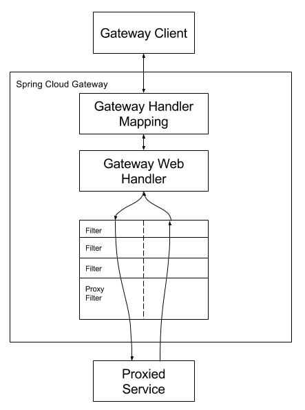

# 1 Gateway简介

## 1.1 Gateway网关作用

[[toc]]

[官网文档](https://cloud.spring.io/spring-cloud-static/spring-cloud-gateway/2.2.1.RELEASE/reference/html/)
 
## 1.2 Gateway网关核心概念
 
<strong>路由（Route）</strong>：路由是网关最基础的部分，路由信息由 ID、目标 URI、一组断言和一组过滤器组成。如果断言路由为真，则说明请求的 URI 和配置匹配。  

<strong>断言（Predicate）</strong>：Java8 中的断言函数。Spring Cloud Gateway 中的断言函数输入类型是 Spring 5.0 框架中的 ServerWebExchange。Spring Cloud Gateway 中的断言函数允许开发者去定义匹配来自于 Http Request 中的任何信息，比如请求头和参数等。 

<strong>过滤器（Filter）</strong>：一个标准的 Spring Web Filter。Spring Cloud Gateway 中的 Filter 分为两种类型，分别是**Gateway Filter** 和 **Global Filter**。过滤器将会对请求和响应进行处理。  

## 1.3 Gateway网关工作原理

客户端向 Spring Cloud Gateway 发出请求。再由网关处理程序 Gateway Handler Mapping映射确定与请求相匹配的路由，将其发送到网关 Web 处理程序 Gateway Web Handler 。该处理程序通过指定的过滤器链将请求发送到我们实际的服务执行业务逻辑，然后返回。过滤器由虚线分隔的原因是，过滤器可以在发送代理请求之前和之后运行逻辑。所有 pre 过滤器逻辑均被执行。然后发出代理请求。发出代理请求后，将运行 post 过滤器逻辑。

