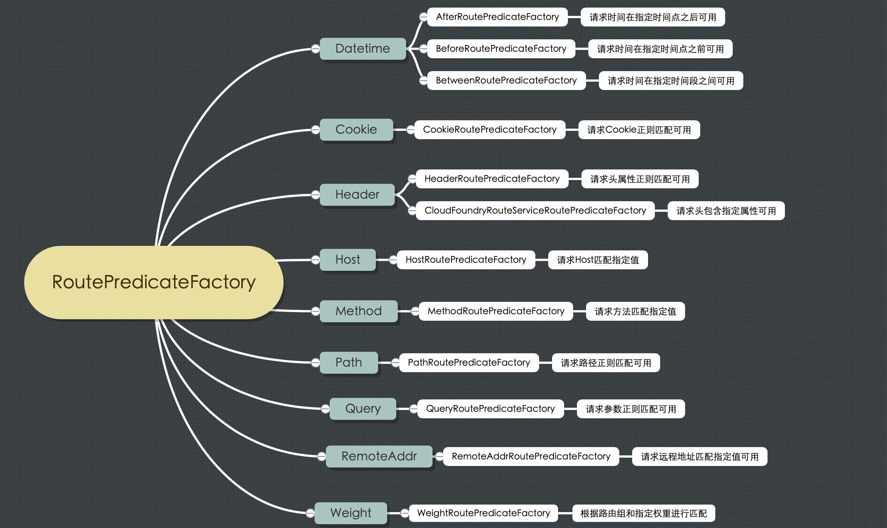

# 2. 路由规则概述

**Spring Cloud Gateway 创建 Route 对象时， 使用 RoutePredicateFactory 创建 Predicate 对象，Predicate 对象可以赋值给 Route**

◆ Spring Cloud Gateway 包含许多内置的 Route Predicate Factories  
◆ 所有这些断言都匹配 HTTP 请求的不同属性  
◆ 多个 Route Predicate Factories 可以通过<font color='red'><strong>逻辑与（and）</strong></font>结合起来一起使用  
 
路由断言工厂 RoutePredicateFactory 包含的主要实现类如图所示，包括 <font color='red'><strong>Datetime、 请求的远端地址、 路由权重、 请求头、 Host 地址、 请求方法、 请求路径和请求参数</strong></font>等类型的路由断言

<a data-fancybox title="RoutePredicateFactory" href="./image/RoutePredicateFactory.jpg"></a>

## 2.1 路由规则-Path 

**匹配对应 URL 的请求，将匹配到的请求追加在目标 URI 之后**

```yml
spring:
  application:
    name: gateway-server # 应用名称
  cloud:
    gateway:
       # 路由规则
      routes:
        - id: product-service           # 路由 ID，唯一
          uri: http://localhost:7070/   # 目标 URI，路由到微服务的地址
          predicates:                   # 断言（判断条件）
            - Path=/product/**          # 匹配对应 URL 的请求，将匹配到的请求追加在目标 URI 之后
```
请求 http://localhost:9000/product/1 将会路由至 http://localhost:7070/product/1


## 2.2 路由规则-Query  

**匹配请求参数中包含 token 的请求**

```yml
spring:
  application:
    name: gateway-server # 应用名称
  cloud:
    gateway:
       # 路由规则
      routes:
        - id: product-service           # 路由 ID，唯一
          uri: http://localhost:7070/   # 目标 URI，路由到微服务的地址
          predicates:                   # 断言（判断条件）
             - Query=token               # 匹配请求参数中包含 token 的请求
        #- Query=token, abc.         # 匹配请求参数中包含 token 并且其参数值满足正则表达式 abc. 的请求
```
Query=token ：比如，<a>http://localhost:9000/product/1?token=123</a>  
Query=token, abc. ：比如，<a>http://localhost:9000/product/1?token=abc1</a>  


## 2.3 路由规则-Method   

**按请求方式匹配请求**

```yml
spring:
  application:
    name: gateway-server # 应用名称
  cloud:
    gateway:
       # 路由规则
      routes:
        - id: product-service           # 路由 ID，唯一
          uri: http://localhost:7070/   # 目标 URI，路由到微服务的地址
          predicates:                   # 断言（判断条件）
             - Method=GET                # 匹配任意 GET 请求
```
## 2.4 路由规则-DateTime  

**匹配中国上海时间之后之前的请求**

```yml
spring:
  application:
    name: gateway-server # 应用名称
  cloud:
    gateway:
       # 路由规则
      routes:
        - id: product-service           # 路由 ID，唯一
          uri: http://localhost:7070/   # 目标 URI，路由到微服务的地址
          predicates:                   # 断言（判断条件）
            # 匹配中国上海时间 2021-6-6 18:34:57 之后的请求
#             - After=2021-06-06T20:20:20.000+08:00[Asia/Shanghai]
             - Before=2021-06-06T20:20:20.000+08:00[Asia/Shanghai]
```

## 2.5 路由规则-Header 

**匹配请求头包含 XXX参数**

```yml
spring:
  application:
    name: gateway-server # 应用名称
  cloud:
    gateway:
       # 路由规则
      routes:
        - id: product-service           # 路由 ID，唯一
          uri: http://localhost:7070/   # 目标 URI，路由到微服务的地址
          predicates:                   # 断言（判断条件）
               # 匹配请求头包含 X-Request-Id 并且其值匹配正则表达式 \d+ 的请求
             - Header=X-Request-Id, \d+
```
http://192.168.1.6:9000/product/1?token=123

<a data-fancybox title="header" href="./image/header.jpg"></a>


## 2.6 路由规则-RemoteAddr  

**匹配远程地址请求是 RemoteAddr 的请求**

```yml
spring:
  application:
    name: gateway-server # 应用名称
  cloud:
    gateway:
       # 路由规则
      routes:
        - id: product-service           # 路由 ID，唯一
          uri: http://localhost:7070/   # 目标 URI，路由到微服务的地址
          predicates:                   # 断言（判断条件）
            # 匹配远程地址请求是 RemoteAddr 的请求，0表示子网掩码
             - RemoteAddr=192.168.1.6/0
```

<a href="">http://192.168.1.6:9000/product/1?token=123</a>

## 2.7 路由规则-动态路由(服务发现)

**动态路由其实就是面向服务的路由**，Spring Cloud Gateway 支持与 **Eureka** 整合开发，<font color='red'><strong>根据 serviceId 自动从注册中心获取服务地址并转发请求</strong></font>，这样做的好处不仅可以通过单个端点来访问应用的所有服务，而且<font color='red'><strong>在添加或移除服务实例时不用修改 Gateway 的路由配置</strong></font>


```yml
spring:
  application:
    name: gateway-server # 应用名称
  cloud:
    gateway:
       # 路由规则
      routes:
        - id: order-service           # 路由 ID，唯一
          uri: lb://order-service       # lb:// 根据服务名称从注册中心获取服务请求地址
          predicates:                   # 断言（判断条件）
            - Path=/order/**          # 匹配对应 URL 的请求，将匹配到的请求追加在目标 URI 之后
# 端口
server:
  port: 9000

# 配置 Eureka Server 注册中心
eureka:
  instance:
    prefer-ip-address: true       # 是否使用 ip 地址注册
    instance-id: ${spring.cloud.client.ip-address}:${server.port} # ip:port
  client:
    service-url:                  # 设置服务注册中心地址
      defaultZone: http://localhost:8761/eureka/,http://localhost:8762/eureka/
```

<a href="">http://localhost:9000/order/1</a>


## 2.8 ★路由规则-服务名称转发

 
 即使配置了动态获取 URI 的方式，项目中微服务一旦过多几十上百个时，配置中任然要写很多配置，这时候就<font color='red'><strong>可以使用服务名称转发，与服务发现组件进行结合，通过 serviceId 转发到具体服务实例</strong></font>。 <font color='blue'><strong>默认匹配URL /微服务名称/** 路由到具体微服务</strong></font>。

 ```yml
 spring:
  application:
    name: gateway-server # 应用名称
  cloud:
    gateway:
      discovery:
        locator:
        # 是否与服务发现组件进行结合，通过 serviceId 转发到具体服务实例。
          enabled: true                           # 是否开启基于服务发现的路由规则
          lower-case-service-id: true      # 是否将服务名称转小写
# 端口
server:
  port: 9000

# 配置 Eureka Server 注册中心
eureka:
  instance:
    prefer-ip-address: true       # 是否使用 ip 地址注册
    instance-id: ${spring.cloud.client.ip-address}:${server.port} # ip:port
  client:
    service-url:                  # 设置服务注册中心地址
      defaultZone: http://localhost:8761/eureka/,http://localhost:8762/eureka/
 ```

配置文件中没有配置任何订单服务的信息，可以通过一下方式访问：
<a href="">http://localhost:9000/order-service/order/1 </a>
<a href="">http://localhost:9000/product-service/product/1</a>