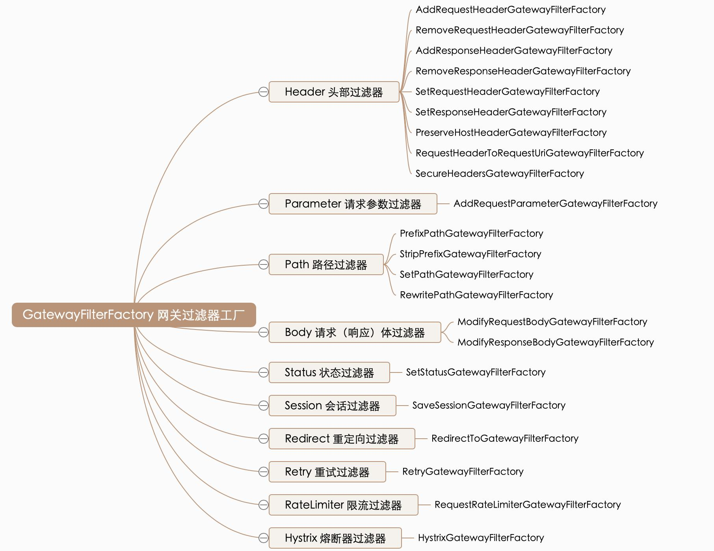
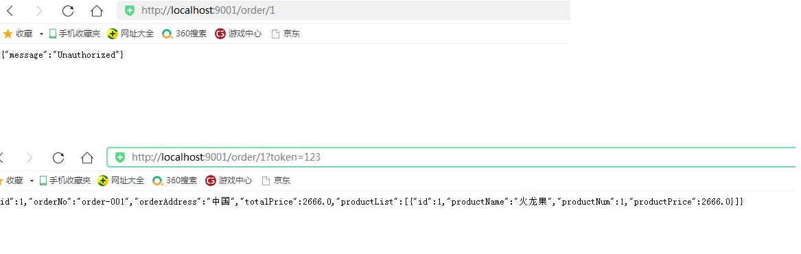

# 3. 过滤器概述

Spring Cloud Gateway 根据作用范围划分为 <font color='blue'><strong>GatewayFilter</strong></font> 和 <font color='blue'><strong>GlobalFilter</strong></font> ，二者区别如下：

<font color='blue'><strong>GatewayFilter ：网关过滤器</strong></font>，需要通过 spring.cloud.routes.filters 配置在具体路由下，只作用在当前路由上或通过 spring.cloud.default-filters 配置在全局，作用在所有路由上。
<font color='blue'><strong>GlobalFilter ：全局过滤器</strong></font>，不需要在配置文件中配置，作用在所有的路由上，最终通过GatewayFilterAdapter 包装成 GatewayFilterChain 可识别的过滤器，它为请求业务以及路由的 URI 转换为真实业务服务请求地址的核心过滤器，不需要配置系统初始化时加载，并作用在每个路由上。

## 3.1 网关过滤器 GatewayFilter
 
 网关过滤器用于拦截并链式处理 Web 请求，可以实现横切与应用无关的需求，比如：安全、访问超时的设置等。修改传入的 HTTP 请求或传出 HTTP 响应。Spring Cloud Gateway 包含许多内置的网关过滤器工厂一共有 22个，包括头部过滤器、 路径类过滤器、Hystrix 过滤器和重写请求 URL 的过滤器， 还有参数和状态码等其他类型的过滤器。根据过滤器工厂的用途来划分，可以分为以下几种：<font color='red'><strong>Header、Parameter、Path、Body、Status、Session、Redirect、Retry、RateLimiter 和 Hystrix</strong></font>。

 <a data-fancybox title="网关过滤器" href="./image/GatewayFilterFactory.jpg"></a>


## 3.2 Path路径过滤器
 
Path 路径过滤器可以实现 URL 重写，通过重写 URL 可以实现隐藏实际路径提高安全性，易于用户记忆和键入，易于被搜索引擎收录等优点。实现方式如下：
 
### RewritePathGatewayFilterFactory
 
**RewritePath 网关过滤器工厂采用路径正则表达式参数和替换参数，使用 Java 正则表达式来灵活地重写请求路径**

```yml
spring:
  application:
    name: gateway-server # 应用名称
  cloud:
    gateway:
      discovery:
        locator:
        # 是否与服务发现组件进行结合，通过 serviceId 转发到具体服务实例。
          enabled: true                           # 是否开启基于服务发现的路由规则
          lower-case-service-id: true      # 是否将服务名称转小写
      # 路由规则
      routes:
        - id: product-service                # 路由 ID，唯一
          uri: lb://product-service         # lb:// 根据服务名称从注册中心获取服务请求地址
          predicates:                            # 断言（判断条件）
              # 匹配对应 URI 的请求，将匹配到的请求追加在目标 URI 之后
             - Path=/product/**, /api-gateway/**
          filters:                                 # 网关过滤器
             # 将 /api-gateway/product/1 重写为 /product/1
             - RewritePath=/api-gateway(?<segment>/?.*), $\{segment}
        - id: order-service                # 路由 ID，唯一
          uri: lb://order-service        # lb:// 根据服务名称从注册中心获取服务请求地址
          predicates:                            # 断言（判断条件）
            # 匹配对应 URI 的请求，将匹配到的请求追加在目标 URI 之后
            - Path=/order/**, /api-gateway2/**
          filters:                                 # 网关过滤器
            # 将 /api-gateway/order/1 重写为 /order/1
            - RewritePath=/api-gateway2(?<segment>/?.*), $\{segment}
# 端口
server:
  port: 9000

# 配置 Eureka Server 注册中心
eureka:
  instance:
    prefer-ip-address: true       # 是否使用 ip 地址注册
    instance-id: ${spring.cloud.client.ip-address}:${server.port} # ip:port
  client:
    service-url:                  # 设置服务注册中心地址
      defaultZone: http://localhost:8761/eureka/,http://localhost:8762/eureka/
```

<a href="">http://localhost:9000/api-gateway/product/1</a>
<a href="">http://localhost:9000/api-gateway2/order/1</a>


### PrefixPathGatewayFilterFactory
 
**PrefixPath 网关过滤器工厂为匹配的 URI 添加指定前缀**


```yml
spring:
  application:
    name: gateway-server # 应用名称
  cloud:
    gateway:
      discovery:
        locator:
        # 是否与服务发现组件进行结合，通过 serviceId 转发到具体服务实例。
          enabled: true                           # 是否开启基于服务发现的路由规则
          lower-case-service-id: true      # 是否将服务名称转小写
      # 路由规则
      routes:
        - id: order-service                # 路由 ID，唯一
          uri: lb://order-service        # lb:// 根据服务名称从注册中心获取服务请求地址
          predicates:                            # 断言（判断条件）
               # 匹配对应 URI 的请求，将匹配到的请求追加在目标 URI 之后
             - Path=/**
          filters:                                  # 网关过滤器
               # 将 /1 重写为 /order/1
             - PrefixPath=/order
# 端口
server:
  port: 9000

# 配置 Eureka Server 注册中心
eureka:
  instance:
    prefer-ip-address: true       # 是否使用 ip 地址注册
    instance-id: ${spring.cloud.client.ip-address}:${server.port} # ip:port
  client:
    service-url:                  # 设置服务注册中心地址
      defaultZone: http://localhost:8761/eureka/,http://localhost:8762/eureka/
```

<a href="">http://localhost:9000/1</a>

### StripPrefixGatewayFilterFactory
 
**StripPrefix 网关过滤器工厂采用一个参数 StripPrefix，该参数表示在将请求发送到下游之前从请求中剥离的路径个数**

```yml
spring:
  application:
    name: gateway-server # 应用名称
  cloud:
    gateway:
      discovery:
        locator:
        # 是否与服务发现组件进行结合，通过 serviceId 转发到具体服务实例。
          enabled: true                           # 是否开启基于服务发现的路由规则
          lower-case-service-id: true      # 是否将服务名称转小写
      # 路由规则
      routes:
        - id: order-service                # 路由 ID，唯一
          uri: lb://order-service        # lb:// 根据服务名称从注册中心获取服务请求地址
          predicates:                            # 断言（判断条件）
               # 匹配对应 URI 的请求，将匹配到的请求追加在目标 URI 之后
             - Path=/**
          filters:                                  # 网关过滤器
               # 将 /api/tqk/order/1 重写为 /order/1
             - StripPrefix=2
# 端口
server:
  port: 9000

# 配置 Eureka Server 注册中心
eureka:
  instance:
    prefer-ip-address: true       # 是否使用 ip 地址注册
    instance-id: ${spring.cloud.client.ip-address}:${server.port} # ip:port
  client:
    service-url:                  # 设置服务注册中心地址
      defaultZone: http://localhost:8761/eureka/,http://localhost:8762/eureka/
```

<a href="">http://localhost:9000/api/tqk/order/1</a>


### SetPathGatewayFilterFactory
 
**SetPath 网关过滤器工厂采用路径模板参数。 它提供了一种通过允许模板化路径段来操作请求路径的简单方法，使用了 Spring Framework 中的 uri 模板，允许多个匹配段**


```yml
spring:
  application:
    name: gateway-server # 应用名称
  cloud:
    gateway:
      discovery:
        locator:
        # 是否与服务发现组件进行结合，通过 serviceId 转发到具体服务实例。
          enabled: true                           # 是否开启基于服务发现的路由规则
          lower-case-service-id: true      # 是否将服务名称转小写
      # 路由规则
      routes:
        - id: order-service                # 路由 ID，唯一
          uri: lb://order-service        # lb:// 根据服务名称从注册中心获取服务请求地址
          predicates:                            # 断言（判断条件）
               # 匹配对应 URI 的请求，将匹配到的请求追加在目标 URI 之后
             - Path=/api/order/{segment}
          filters:                                  # 网关过滤器
               # 将 /api/product/1 重写为 /product/1
             - SetPath=/order/{segment}
# 端口
server:
  port: 9000

# 配置 Eureka Server 注册中心
eureka:
  instance:
    prefer-ip-address: true       # 是否使用 ip 地址注册
    instance-id: ${spring.cloud.client.ip-address}:${server.port} # ip:port
  client:
    service-url:                  # 设置服务注册中心地址
      defaultZone: http://localhost:8761/eureka/,http://localhost:8762/eureka/
```

<a href="">http://localhost:9000/api/order/1</a>

### Parameter 参数过滤器
 
**AddRequestParameter 网关过滤器工厂会将指定参数添加至匹配到的下游请求中**


```yml
spring:
  application:
    name: gateway-server # 应用名称
  cloud:
    gateway:
      discovery:
        locator:
        # 是否与服务发现组件进行结合，通过 serviceId 转发到具体服务实例。
          enabled: true                           # 是否开启基于服务发现的路由规则
          lower-case-service-id: true      # 是否将服务名称转小写
      # 路由规则
      routes:
        - id: order-service                # 路由 ID，唯一
          uri: lb://order-service        # lb:// 根据服务名称从注册中心获取服务请求地址
          predicates:                            # 断言（判断条件）
            # 匹配对应 URI 的请求，将匹配到的请求追加在目标 URI 之后
            - Path=/api-gateway/**
        filters:                       # 网关过滤器
            # 将 /api-gateway/product/1 重写为 /product/1
            - RewritePath=/api-gateway(?<segment>/?.*), $\{segment}
            # 在下游请求中添加 flag=1
            - AddRequestParameter=flag, 1
# 端口
server:
  port: 9000

# 配置 Eureka Server 注册中心
eureka:
  instance:
    prefer-ip-address: true       # 是否使用 ip 地址注册
    instance-id: ${spring.cloud.client.ip-address}:${server.port} # ip:port
  client:
    service-url:                  # 设置服务注册中心地址
      defaultZone: http://localhost:8761/eureka/,http://localhost:8762/eureka/
```

```java
package com.example.controller;
import com.example.pojo.Product;
import com.example.service.ProductService;
import org.springframework.beans.factory.annotation.Autowired;
import org.springframework.web.bind.annotation.GetMapping;
import org.springframework.web.bind.annotation.PathVariable;
import org.springframework.web.bind.annotation.RequestMapping;
import org.springframework.web.bind.annotation.RestController;
@RestController
@RequestMapping("/product")
public class ProductController {
    @Autowired
    private ProductService productService;
    /**
     * 根据主键查询商品
     *
     * @param id
     * @return
     */
    @GetMapping("/{id}")
    public Product selectProductById(@PathVariable("id") Integer id, String flag) {
        System.out.println("flag = " + flag);
        return productService.selectProductById(id);
   }
}
```
<a href="">http://localhost:9000/api-gateway/order/1</a>

### Status 状态过滤器
 
**SetStatus 网关过滤器工厂采用单个状态参数，它必须是有效的 Spring HttpStatus。它可以是整数 404 或枚举NOT_FOUND 的字符串表示**


```yml
spring:
  application:
    name: gateway-server # 应用名称
  cloud:
    gateway:
      discovery:
        locator:
        # 是否与服务发现组件进行结合，通过 serviceId 转发到具体服务实例。
          enabled: true                           # 是否开启基于服务发现的路由规则
          lower-case-service-id: true      # 是否将服务名称转小写
      # 路由规则
      routes:
        - id: order-service                # 路由 ID，唯一
          uri: lb://order-service        # lb:// 根据服务名称从注册中心获取服务请求地址
          predicates:                   # 断言（判断条件）
          # 匹配对应 URI 的请求，将匹配到的请求追加在目标 URI 之后
             - Path=/api-gateway/**
          filters:                       # 网关过滤器
              # 将 /api-gateway/product/1 重写为 /product/1
             - RewritePath=/api-gateway(?<segment>/?.*), $\{segment}
              # 任何情况下，响应的 HTTP 状态都将设置为 404
            - SetStatus=404 # 404 或者对应的枚举 NOT_FOUND
# 端口
server:
  port: 9000

# 配置 Eureka Server 注册中心
eureka:
  instance:
    prefer-ip-address: true       # 是否使用 ip 地址注册
    instance-id: ${spring.cloud.client.ip-address}:${server.port} # ip:port
  client:
    service-url:                  # 设置服务注册中心地址
      defaultZone: http://localhost:8761/eureka/,http://localhost:8762/eureka/
```

<a href="">http://localhost:9000/api-gateway/order/1</a>

## 3.3 全局过滤器 GlobalFilter
 
全局过滤器不需要在配置文件中配置，作用在所有的路由上，最终通过 GatewayFilterAdapter 包装成GatewayFilterChain 可识别的过滤器，它是请求业务以及路由的 URI 转换为真实业务服务请求地址的核心过滤器，不需要配置系统初始化时加载，并作用在每个路由上


## 3.4 自定义过滤器概述
 
即使 Spring Cloud Gateway 自带许多实用的 GatewayFilter Factory、Gateway Filter、GlobalFilter ，但是在很多情景下我们仍然希望可以自定义自己的过滤器，实现一些骚操作。

###  自定义之网关过滤器

**自定义网关过滤器需要实现以下两个接口 ： GatewayFilter ， Ordered**

**创建过滤器  CustomGatewayFilter.java**
```java
package com.example.filter;
import org.springframework.cloud.gateway.filter.GatewayFilter;
import org.springframework.cloud.gateway.filter.GatewayFilterChain;
import org.springframework.core.Ordered;
import org.springframework.web.server.ServerWebExchange;
import reactor.core.publisher.Mono;
/**
* 自定义网关过滤器
*/
public class CustomGatewayFilter implements GatewayFilter, Ordered {
    /**
     * 过滤器业务逻辑
     *
     * @param exchange
     * @param chain
     * @return
     */
    @Override
    public Mono<Void> filter(ServerWebExchange exchange, GatewayFilterChain chain) {
        System.out.println("自定义网关过滤器被执行");
        return chain.filter(exchange); // 继续向下执行
   }
    /**
     * 过滤器执行顺序，数值越小，优先级越高
     * @return
     */
    @Override
    public int getOrder() {
        return 0;
   }
}
 ```

**注册过滤器**

```java
package com.example.config;
import com.example.filter.CustomGatewayFilter;
import org.springframework.cloud.gateway.route.RouteLocator;
import org.springframework.cloud.gateway.route.builder.RouteLocatorBuilder;
import org.springframework.context.annotation.Bean;
import org.springframework.context.annotation.Configuration;
/**
* 网关路由配置类
*/
@Configuration
public class GatewayRoutesConfiguration {
    @Bean
    public RouteLocator routeLocator(RouteLocatorBuilder builder) {
        return builder.routes().route(r -> r
                // 断言（判断条件）
               .path("/product/**")
                // 目标 URI，路由到微服务的地址
               .uri("lb://product-service")
                // 注册自定义网关过滤器
               .filters(new CustomGatewayFilter())
                // 路由 ID，唯一
               .id("product-service"))
               .build();
   }
}
```
### 自定义之全局过滤器

**自定义全局过滤器需要实现以下两个接口 ： GlobalFilter ， Ordered 。通过全局过滤器可以实现权限校验，安全性验证等功能**

 
**创建过滤器**
 
 
实现指定接口，添加 @Component 注解即可 CustomGlobalFilter.java

```java
package com.example.filter;
import org.springframework.cloud.gateway.filter.GatewayFilterChain;
import org.springframework.cloud.gateway.filter.GlobalFilter;
import org.springframework.core.Ordered;
import org.springframework.stereotype.Component;
import org.springframework.web.server.ServerWebExchange;
import reactor.core.publisher.Mono;
/**
* 自定义全局过滤器
*/
@Component
public class CustomGlobalFilter implements GlobalFilter, Ordered {
    /**
     * 过滤器业务逻辑
     *
     * @param exchange
     * @param chain
     * @return
     */
    @Override
    public Mono<Void> filter(ServerWebExchange exchange, GatewayFilterChain chain) {
        System.out.println("自定义全局过滤器被执行");
        return chain.filter(exchange); // 继续向下执行
   }
    /**
     * 过滤器执行顺序，数值越小，优先级越高
     *
     * @return
     */
    @Override
    public int getOrder() {
             return 0;
   }
}
```

### 统一鉴权过滤器

我们在网关过滤器中通过token判断用户是否登录，完成一个统一鉴权案例

```java
package com.example.config;

import lombok.extern.slf4j.Slf4j;
import org.springframework.cloud.gateway.filter.GatewayFilterChain;
import org.springframework.cloud.gateway.filter.GlobalFilter;
import org.springframework.core.Ordered;
import org.springframework.core.io.buffer.DataBuffer;
import org.springframework.http.HttpStatus;
import org.springframework.http.server.reactive.ServerHttpResponse;
import org.springframework.stereotype.Component;
import org.springframework.web.server.ServerWebExchange;
import reactor.core.publisher.Mono;

/**
 * @ClassName：AccessFilter
 * @description: 权限过滤器
 * @author: tianqikai
 * @date : 23:36 2021/6/10
 */
@Slf4j
@Component
public class AccessFilter implements GlobalFilter, Ordered {


    @Override
    public Mono<Void> filter(ServerWebExchange exchange, GatewayFilterChain chain) {
        // 获取请求参数
        String token = exchange.getRequest().getQueryParams().getFirst("token");
        // 业务逻辑处理
        if (null == token) {
            log.info("token is null...");
            ServerHttpResponse response = exchange.getResponse();
            // 响应类型
            response.getHeaders().add("Content-Type", "application/json; charset=utf-8");
            // 响应状态码，HTTP 401 错误代表用户没有访问权限
            response.setStatusCode(HttpStatus.UNAUTHORIZED);
            // 响应内容
            String message = "{\"message\":\"" + HttpStatus.UNAUTHORIZED.getReasonPhrase() + "\"}";
            DataBuffer buffer = response.bufferFactory().wrap(message.getBytes());
            // 请求结束，不在继续向下请求
            return response.writeWith(Mono.just(buffer));
        }
        // 使用 token 进行身份验证
        log.info("token is OK!");
        return chain.filter(exchange);
    }

    @Override
    public int getOrder() {
        return 1;
    }
}

```

http://localhost:9001/order/1

http://localhost:9001/order/1?token=123

<a data-fancybox title="统一鉴权过滤器" href="./image/tongyijianquan.jpg"></a>
